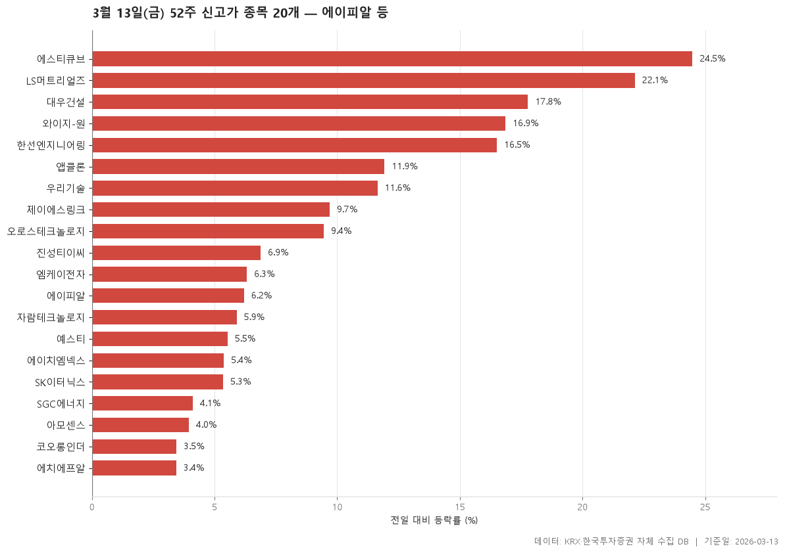

2026-03-13 종가 기준으로 최근 52주 최고가를 넘어선 보통주 20개입니다.

> 기준일: 2026-03-13 · 집계: 자체 수집 데이터베이스

## 핵심 내용

- 전일 대비 등락률이 가장 높은 항목은 에스티큐브(24.48%)입니다.
- 전일 대비 등락률이 가장 낮은 항목은 에치에프알(3.44%)입니다.
- 표에 포함된 항목의 전일 대비 등락률 중위값은 6.60%입니다.
- 시가총액이 가장 큰 항목은 에이피알(128,208.6억원)입니다.
- 시장별로는 KOSPI 5개, KOSDAQ 15개입니다.
- 업종은 9개로 나뉘고, 가장 많은 업종은 전기·전자(7개)입니다.

## 전체 표

| 종목명 | 종목코드 | 시장 | 업종 | 종가 | 등락률 | 이전52주최고 | 거래대금 | 시가총액 |
|---|---|---|---|---|---|---|---|---|
| 에이피알 | 278470 | KOSPI | 화학 | 342,500 | 6.20 | 332,000 | 1,428.60 | 128,208.60 |
| 대우건설 | 047040 | KOSPI | 건설 | 12,320 | 17.78 | 10,910 | 10,690.60 | 51,204.70 |
| 우리기술 | 032820 | KOSDAQ | 전기·전자 | 24,450 | 11.64 | 23,550 | 14,368 | 40,796.60 |
| 코오롱인더 | 120110 | KOSPI | 화학 | 75,000 | 3.45 | 74,700 | 310 | 20,639.30 |
| 앱클론 | 174900 | KOSDAQ | 제약 | 89,100 | 11.93 | 82,600 | 703.80 | 17,753.60 |
| LS머트리얼즈 | 417200 | KOSDAQ | 전기·전자 | 22,850 | 22.13 | 19,340 | 8,650.90 | 15,458.60 |
| 제이에스링크 | 127120 | KOSDAQ | 일반서비스 | 41,900 | 9.69 | 40,500 | 149.20 | 14,295.90 |
| SK이터닉스 | 475150 | KOSPI | 건설 | 39,350 | 5.35 | 37,350 | 4,715.20 | 13,282.20 |
| 에스티큐브 | 052020 | KOSDAQ | 유통 | 18,050 | 24.48 | 14,950 | 311.70 | 12,271 |
| SGC에너지 | 005090 | KOSPI | 전기·가스 | 63,300 | 4.11 | 62,000 | 189.80 | 9,121.10 |
| 예스티 | 122640 | KOSDAQ | 기계·장비 | 25,750 | 5.53 | 25,500 | 138.70 | 5,497.60 |
| 와이지-원 | 019210 | KOSDAQ | 금속 | 13,790 | 16.86 | 12,300 | 578.40 | 5,129 |
| 진성티이씨 | 036890 | KOSDAQ | 기계·장비 | 17,700 | 6.88 | 17,190 | 92.30 | 3,899.80 |
| 자람테크놀로지 | 389020 | KOSDAQ | 전기·전자 | 61,000 | 5.90 | 60,300 | 336.60 | 3,859.10 |
| 에치에프알 | 230240 | KOSDAQ | 전기·전자 | 28,550 | 3.44 | 27,600 | 941.10 | 3,799.70 |
| 에이치엠넥스 | 036170 | KOSDAQ | 전기·전자 | 5,480 | 5.38 | 5,420 | 132 | 3,362.80 |
| 엠케이전자 | 033160 | KOSDAQ | 전기·전자 | 14,300 | 6.32 | 13,950 | 349.60 | 3,267.70 |
| 오로스테크놀로지 | 322310 | KOSDAQ | 기계·장비 | 33,000 | 9.45 | 32,550 | 330.10 | 3,091 |
| 한선엔지니어링 | 452280 | KOSDAQ | 금속 | 16,580 | 16.51 | 14,230 | 1,777.90 | 2,962.30 |
| 아모센스 | 357580 | KOSDAQ | 전기·전자 | 25,000 | 3.95 | 24,600 | 143 | 2,913.60 |

## 집계 기준

- **기준**: 종가 > 직전 52주 최고가
- **관측구간**: 2025-02-27 ~ 2026-03-12 (252거래일)
- **필터**: 시가총액 500억 이상, 거래대금 3억 이상, 보통주
- **단위**: 종가=원, 거래대금·시가총액=억원, 등락률=%

## 데이터 출처 및 유의사항

- **데이터출처**: 한국거래소(KRX) 공시 데이터와 한국투자증권 OpenAPI 를 직접 수집해 구축한 자체 데이터베이스
- **집계방식**: 수집·집계·차트 생성을 직접 구현한 파이프라인에서 자동 산출
- **작성고지**: 본문의 표·통계·차트는 자체 데이터베이스에서 계산된 값이며, 문장 작성 과정에 AI 도구를 활용했습니다.
- **면책**: 본 글은 정보 제공을 목적으로 하며 특정 종목의 매수·매도를 추천하지 않습니다. 제시된 수치는 과거 데이터이고 미래 수익을 보장하지 않습니다. 투자 판단과 그 결과에 대한 책임은 투자자 본인에게 있습니다.

