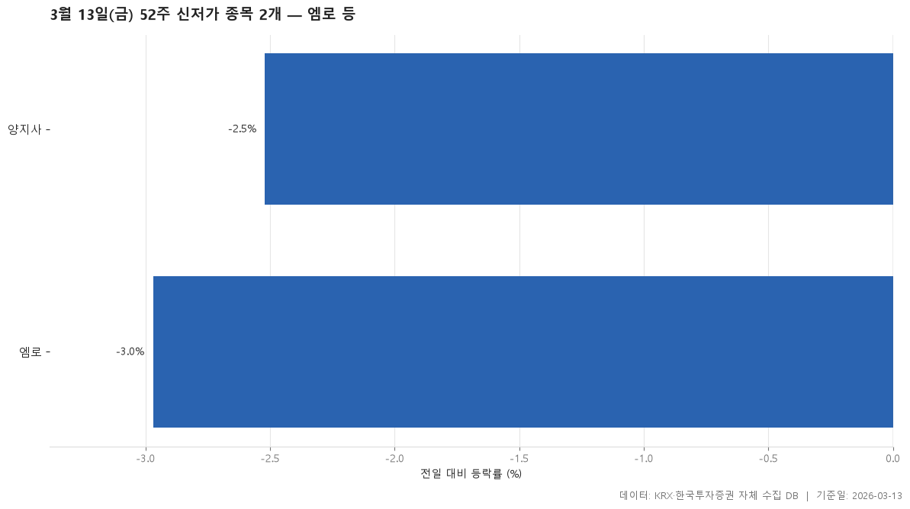

2026-03-13 종가 기준으로 최근 52주 최저가를 밑돈 보통주 2개입니다.

> 기준일: 2026-03-13 · 집계: 자체 수집 데이터베이스

## 핵심 내용

- 전일 대비 등락률이 가장 높은 항목은 양지사(-2.52%)입니다.
- 전일 대비 등락률이 가장 낮은 항목은 엠로(-2.97%)입니다.
- 표에 포함된 항목의 전일 대비 등락률 중위값은 -2.75%입니다.
- 시가총액이 가장 큰 항목은 엠로(3,831.9억원)입니다.
- 시장별로는 KOSPI 0개, KOSDAQ 2개입니다.
- 업종은 2개로 나뉘고, 가장 많은 업종은 IT 서비스(1개)입니다.

## 전체 표

| 종목명 | 종목코드 | 시장 | 업종 | 종가 | 등락률 | 이전52주최저 | 거래대금 | 시가총액 |
|---|---|---|---|---|---|---|---|---|
| 엠로 | 058970 | KOSDAQ | IT 서비스 | 31,000 | -2.97 | 31,400 | 38.20 | 3,831.90 |
| 양지사 | 030960 | KOSDAQ | 출판·매체복제 | 7,340 | -2.52 | 7,400 | 6 | 1,172.90 |

## 집계 기준

- **기준**: 종가 < 직전 52주 최저가
- **관측구간**: 2025-02-27 ~ 2026-03-12 (252거래일)
- **필터**: 시가총액 500억 이상, 거래대금 3억 이상, 보통주
- **단위**: 종가=원, 거래대금·시가총액=억원, 등락률=%

## 데이터 출처 및 유의사항

- **데이터출처**: 한국거래소(KRX) 공시 데이터와 한국투자증권 OpenAPI 를 직접 수집해 구축한 자체 데이터베이스
- **집계방식**: 수집·집계·차트 생성을 직접 구현한 파이프라인에서 자동 산출
- **작성고지**: 본문의 표·통계·차트는 자체 데이터베이스에서 계산된 값이며, 문장 작성 과정에 AI 도구를 활용했습니다.
- **면책**: 본 글은 정보 제공을 목적으로 하며 특정 종목의 매수·매도를 추천하지 않습니다. 제시된 수치는 과거 데이터이고 미래 수익을 보장하지 않습니다. 투자 판단과 그 결과에 대한 책임은 투자자 본인에게 있습니다.

