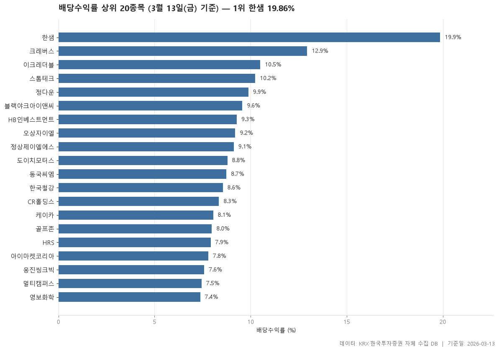

2026-03-13 종가 기준 배당수익률이 높은 보통주 20개입니다. 배당수익률은 직전 결산 배당금을 현재 주가로 나눈 값입니다.

> 기준일: 2026-03-13 · 집계: 자체 수집 데이터베이스

## 핵심 내용

- 배당수익률이 가장 높은 항목은 한샘(19.86%)입니다.
- 배당수익률이 가장 낮은 항목은 영보화학(7.38%)입니다.
- 표에 포함된 항목의 배당수익률 중위값은 8.77%입니다.
- 시가총액이 가장 큰 항목은 한샘(10,107.8억원)입니다.
- 시장별로는 KOSPI 8개, KOSDAQ 12개입니다.
- 업종은 9개로 나뉘고, 가장 많은 업종은 유통(4개)입니다.

## 전체 표

| 종목명 | 종목코드 | 시장 | 업종 | 종가 | 배당수익률 | PER | PBR | 시가총액 |
|---|---|---|---|---|---|---|---|---|
| 한샘 | 009240 | KOSPI | 유통 | 42,950 | 19.86 | 4.68 | 2.03 | 10,107.80 |
| 크레버스 | 096240 | KOSDAQ | 일반서비스 | 11,590 | 12.94 | 12.85 | 2.43 | 1,244.60 |
| 이크레더블 | 092130 | KOSDAQ | IT 서비스 | 15,150 | 10.50 | 14.13 | 3.72 | 1,824.60 |
| 스톰테크 | 352090 | KOSDAQ | 화학 | 3,615 | 10.24 | 6.77 | 1.08 | 971.50 |
| 정다운 | 208140 | KOSDAQ | 음식료·담배 | 2,530 | 9.88 | 6.95 | 0.62 | 826.90 |
| 블랙야크아이앤씨 | 478560 | KOSDAQ | 섬유·의류 | 3,345 | 9.57 | 9.42 | 3.10 | 864 |
| HB인베스트먼트 | 440290 | KOSDAQ | 금융 | 2,155 | 9.28 | 9.54 | 0.67 | 592.80 |
| 오상자이엘 | 053980 | KOSDAQ | IT 서비스 | 3,260 | 9.20 | 9.67 | 0.59 | 618.80 |
| 정상제이엘에스 | 040420 | KOSDAQ | 일반서비스 | 5,810 | 9.12 | 11.41 | 1.03 | 910.90 |
| 도이치모터스 | 067990 | KOSDAQ | 유통 | 4,325 | 8.79 | - | 0.32 | 1,262.10 |
| 동국씨엠 | 460850 | KOSPI | 금속 | 5,720 | 8.74 | 2.68 | 0.17 | 1,710.20 |
| 한국철강 | 104700 | KOSPI | 금속 | 9,360 | 8.55 | 14.20 | 0.38 | 3,411.70 |
| CR홀딩스 | 000480 | KOSPI | 비금속 | 4,910 | 8.35 | - | 0.33 | 2,302.30 |
| 케이카 | 381970 | KOSPI | 유통 | 14,290 | 8.05 | 15.67 | 3.05 | 6,976.50 |
| 골프존 | 215000 | KOSDAQ | IT 서비스 | 50,100 | 7.98 | 6.12 | 0.68 | 3,144 |
| HRS | 036640 | KOSDAQ | 화학 | 5,050 | 7.92 | 5.34 | 0.66 | 825.90 |
| 아이마켓코리아 | 122900 | KOSPI | 유통 | 7,690 | 7.80 | 8.97 | 0.67 | 2,570.70 |
| 웅진씽크빅 | 095720 | KOSPI | 일반서비스 | 1,185 | 7.59 | - | 0.45 | 1,368.70 |
| 멀티캠퍼스 | 067280 | KOSDAQ | 일반서비스 | 28,200 | 7.45 | 5.38 | 0.77 | 1,671.40 |
| 영보화학 | 014440 | KOSPI | 화학 | 4,740 | 7.38 | 4.10 | 0.51 | 948 |

## 집계 기준

- **기준**: KRX 공시 배당수익률 (직전 결산 기준)
- **필터**: 0% 초과 20% 미만, 시가총액 500억 이상, 보통주
- **주의**: 직전 결산 배당 기준이므로 향후 배당이 같다는 보장은 없습니다.
- **단위**: 종가=원, 배당수익률=%, 시가총액=억원

## 데이터 출처 및 유의사항

- **데이터출처**: 한국거래소(KRX) 공시 데이터와 한국투자증권 OpenAPI 를 직접 수집해 구축한 자체 데이터베이스
- **집계방식**: 수집·집계·차트 생성을 직접 구현한 파이프라인에서 자동 산출
- **작성고지**: 본문의 표·통계·차트는 자체 데이터베이스에서 계산된 값이며, 문장 작성 과정에 AI 도구를 활용했습니다.
- **면책**: 본 글은 정보 제공을 목적으로 하며 특정 종목의 매수·매도를 추천하지 않습니다. 제시된 수치는 과거 데이터이고 미래 수익을 보장하지 않습니다. 투자 판단과 그 결과에 대한 책임은 투자자 본인에게 있습니다.

