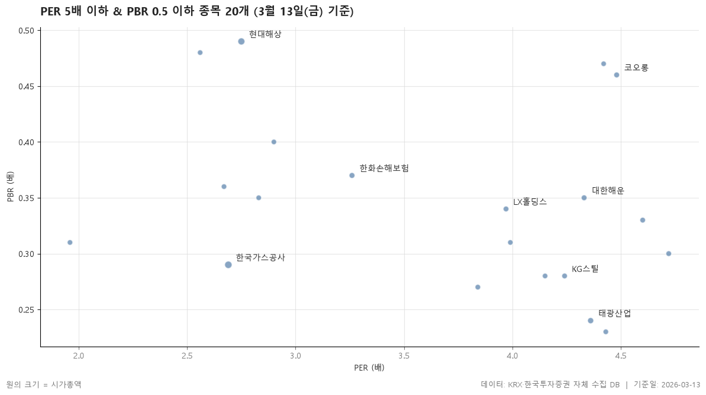

2026-03-13 기준 PER 5배 이하, PBR 0.5 이하를 동시에 만족하는 보통주 20개입니다.

> 기준일: 2026-03-13 · 집계: 자체 수집 데이터베이스

## 핵심 내용

- PER이 가장 높은 항목은 삼천리(4.72배)입니다.
- PER이 가장 낮은 항목은 서희건설(1.96배)입니다.
- 표에 포함된 항목의 PER 중위값은 3.98배입니다.
- 시가총액이 가장 큰 항목은 한국가스공사(32,725.0억원)입니다.
- 시장별로는 KOSPI 18개, KOSDAQ 2개입니다.
- 업종은 11개로 나뉘고, 가장 많은 업종은 금융(4개)입니다.

## 전체 표

| 종목명 | 종목코드 | 시장 | 업종 | 종가 | PER | PBR | 배당수익률 | BPS | 시가총액 |
|---|---|---|---|---|---|---|---|---|---|
| 한국가스공사 | 036460 | KOSPI | 전기·가스 | 35,450 | 2.69 | 0.29 | 4.10 | 124,079 | 32,725 |
| 현대해상 | 001450 | KOSPI | 보험 | 29,800 | 2.75 | 0.49 | 0 | 60,491 | 26,641.20 |
| 태광산업 | 003240 | KOSPI | 화학 | 1,112,000 | 4.36 | 0.24 | 0.16 | 4,668,610 | 12,381 |
| 한화손해보험 | 000370 | KOSPI | 보험 | 6,920 | 3.26 | 0.37 | 0 | 18,660 | 8,078.30 |
| 코오롱 | 002020 | KOSPI | 금융 | 55,600 | 4.48 | 0.46 | 0.99 | 120,681 | 7,176.70 |
| 대한해운 | 005880 | KOSPI | 운송·창고 | 2,200 | 4.33 | 0.35 | 0 | 6,289 | 7,100.40 |
| LX홀딩스 | 383800 | KOSPI | 금융 | 8,190 | 3.97 | 0.34 | 3.54 | 24,061 | 6,247.40 |
| KG스틸 | 016380 | KOSPI | 금속 | 5,670 | 4.24 | 0.28 | 4.41 | 20,053 | 5,670.50 |
| 삼천리 | 004690 | KOSPI | 전기·가스 | 139,700 | 4.72 | 0.30 | 2.15 | 461,293 | 5,664.90 |
| 한일홀딩스 | 003300 | KOSPI | 비금속 | 17,710 | 4.60 | 0.33 | 5.25 | 52,885 | 5,460.50 |
| 삼양사 | 145990 | KOSPI | 음식료·담배 | 46,500 | 3.84 | 0.27 | 3.76 | 172,467 | 4,795.80 |
| BGF | 027410 | KOSPI | 금융 | 4,270 | 4.43 | 0.23 | 3.04 | 18,202 | 4,087.10 |
| 서연이화 | 200880 | KOSPI | 운송장비·부품 | 14,540 | 2.67 | 0.36 | 1.72 | 40,698 | 3,929.90 |
| 세아제강 | 306200 | KOSPI | 금속 | 138,400 | 2.83 | 0.35 | 5.06 | 397,327 | 3,925.40 |
| 서희건설 | 035890 | KOSDAQ | 건설 | 1,623 | 1.96 | 0.31 | 2.77 | 5,175 | 3,729.80 |
| 넥센 | 005720 | KOSPI | 화학 | 6,800 | 4.15 | 0.28 | 1.99 | 24,397 | 3,641 |
| 현대코퍼레이션 | 011760 | KOSPI | 유통 | 25,800 | 2.56 | 0.48 | 2.71 | 54,282 | 3,413.10 |
| KPX홀딩스 | 092230 | KOSPI | 화학 | 79,000 | 3.99 | 0.31 | 5.38 | 256,552 | 3,337.50 |
| 한국캐피탈 | 023760 | KOSDAQ | 금융 | 1,007 | 4.42 | 0.47 | 2.98 | 2,154 | 3,178.20 |
| 사조대림 | 003960 | KOSPI | 음식료·담배 | 33,300 | 2.90 | 0.40 | 0.90 | 83,132 | 3,051.80 |

## 집계 기준

- **기준**: 0 < PER ≤ 5.0, 0 < PBR ≤ 0.5
- **필터**: 시가총액 500억 이상, 보통주
- **단위**: 종가·BPS=원, 시가총액=억원, 배당수익률=%
- **주의**: PER/PBR 은 KRX 공시 기준이며 적자 종목은 PER 이 산출되지 않습니다.

## 데이터 출처 및 유의사항

- **데이터출처**: 한국거래소(KRX) 공시 데이터와 한국투자증권 OpenAPI 를 직접 수집해 구축한 자체 데이터베이스
- **집계방식**: 수집·집계·차트 생성을 직접 구현한 파이프라인에서 자동 산출
- **작성고지**: 본문의 표·통계·차트는 자체 데이터베이스에서 계산된 값이며, 문장 작성 과정에 AI 도구를 활용했습니다.
- **면책**: 본 글은 정보 제공을 목적으로 하며 특정 종목의 매수·매도를 추천하지 않습니다. 제시된 수치는 과거 데이터이고 미래 수익을 보장하지 않습니다. 투자 판단과 그 결과에 대한 책임은 투자자 본인에게 있습니다.

