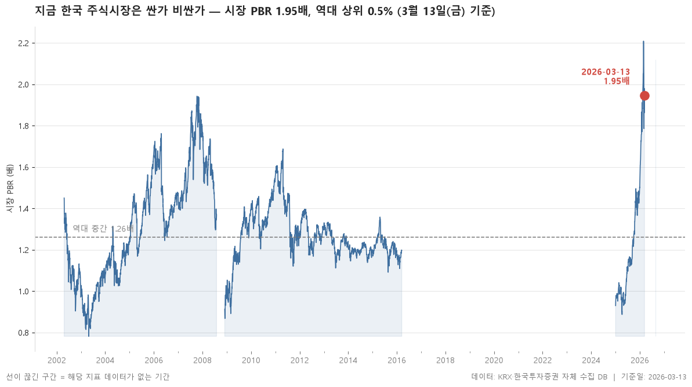
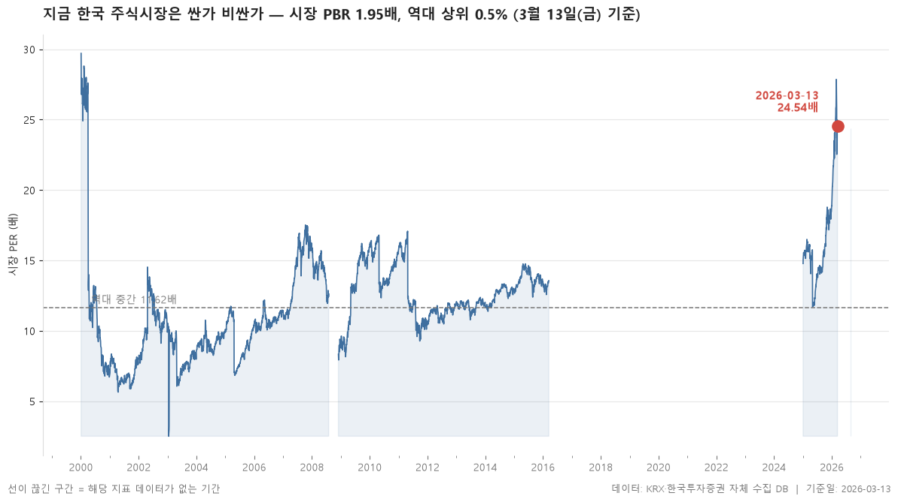

2002-04-23 이후 3,643거래일 기록과 비교하면 2026-03-13 시장 PBR 은 역대 상위 0.5% 수준으로 역사적으로 고평가 구간입니다.

> 기준일: 2026-03-13 · 집계: 자체 수집 데이터베이스

## 핵심 내용

- 시장 PER은 24.54배로 역대 상위 0.4% 수준입니다 (역대 중간값 11.88배).
- 시장 PBR은 1.95배로 역대 상위 0.5% 수준입니다 (역대 중간값 1.26배).
- 시장 배당수익률은 1.17%로 역대 하위 1.3% 수준입니다 (역대 중간값 1.55%).

## 전체 표

| 지표 | 현재값 | 백분위 | 하위1% | 역대중간 | 상위1% | 단위 |
|---|---|---|---|---|---|---|
| 시장 PER | 24.54 | 99.60 | 6.89 | 11.88 | 21.67 | 배 |
| 시장 PBR | 1.95 | 99.50 | 0.87 | 1.26 | 1.89 | 배 |
| 시장 배당수익률 | 1.17 | 1.30 | 1.17 | 1.55 | 3.04 | % |

## 집계 기준

- **기준**: 시가총액 가중 — 시장 PER = Σ시가총액 / Σ(시가총액÷PER)
- **관측구간**: 2002-04-23 ~ 2026-08-21 (3,643거래일)
- **모집단**: KOSPI·KOSDAQ 보통주
- **백분위해석**: 백분위 30 = 역대 기록 중 30% 만이 현재보다 낮았다는 뜻
- **범위표시**: 절대 최소·최대는 하루치 오류 데이터에 흔들리므로 1~99 분위로 표시
- **표본변화**: 집계 종목 수는 관측 초기 약 800개에서 현재 2,481개로 늘어났습니다. 시점 간 비교 시 참고가 필요합니다.

## 데이터 출처 및 유의사항

- **데이터출처**: 한국거래소(KRX) 공시 데이터와 한국투자증권 OpenAPI 를 직접 수집해 구축한 자체 데이터베이스
- **집계방식**: 수집·집계·차트 생성을 직접 구현한 파이프라인에서 자동 산출
- **작성고지**: 본문의 표·통계·차트는 자체 데이터베이스에서 계산된 값이며, 문장 작성 과정에 AI 도구를 활용했습니다.
- **면책**: 본 글은 정보 제공을 목적으로 하며 특정 종목의 매수·매도를 추천하지 않습니다. 제시된 수치는 과거 데이터이고 미래 수익을 보장하지 않습니다. 투자 판단과 그 결과에 대한 책임은 투자자 본인에게 있습니다.

