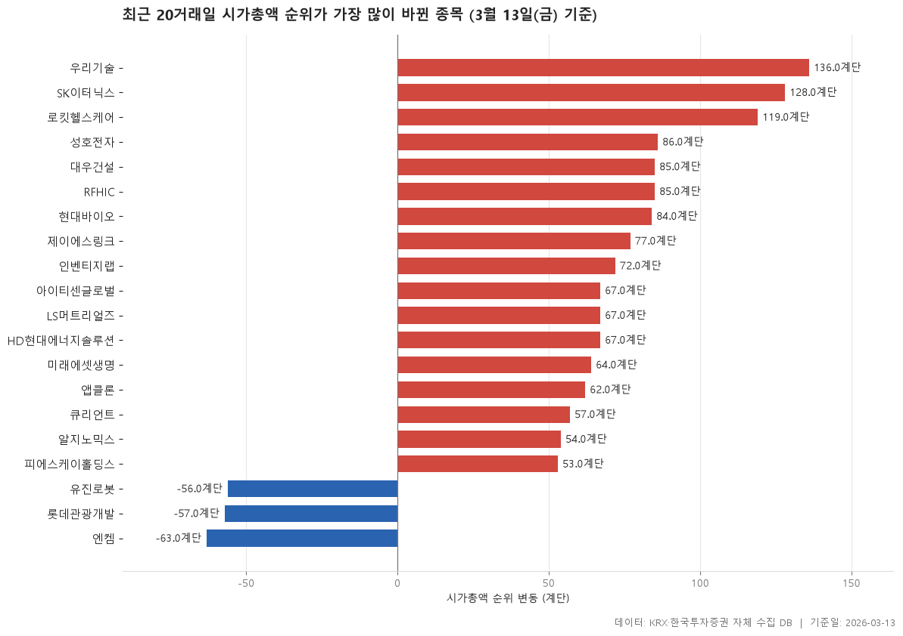

2026-02-09 → 2026-03-13 사이 시가총액 상위 300위권에서 순위 변동이 큰 종목 20개입니다. 상승 17개, 하락 3개.

> 기준일: 2026-03-13 · 집계: 자체 수집 데이터베이스

## 핵심 내용

- 시가총액 순위 변동이 가장 높은 항목은 우리기술(136계단)입니다.
- 시가총액 순위 변동이 가장 낮은 항목은 엔켐(-63계단)입니다.
- 표에 포함된 항목의 시가총액 순위 변동 중위값은 67계단입니다.
- 표 20개 항목 중 17개가 양(+), 3개가 음(-)입니다.
- 시가총액이 가장 큰 항목은 대우건설(51,204.7억원)입니다.
- 시장별로는 KOSPI 5개, KOSDAQ 15개입니다.
- 업종은 8개로 나뉘고, 가장 많은 업종은 전기·전자(5개)입니다.

## 전체 표

| 종목명 | 종목코드 | 시장 | 업종 | 현재순위 | 과거순위 | 순위변동 | 시총증감률 | 시가총액 |
|---|---|---|---|---|---|---|---|---|
| 우리기술 | 032820 | KOSDAQ | 전기·전자 | 128 | 264 | 136 | 156.98 | 40,796.60 |
| SK이터닉스 | 475150 | KOSPI | 건설 | 293 | 421 | 128 | 74.12 | 13,282.20 |
| 로킷헬스케어 | 376900 | KOSDAQ | 제약 | 270 | 389 | 119 | 83.56 | 15,581.40 |
| 성호전자 | 043260 | KOSDAQ | 전기·전자 | 143 | 229 | 86 | 82.94 | 35,745.10 |
| 대우건설 | 047040 | KOSPI | 건설 | 112 | 197 | 85 | 113.52 | 51,204.70 |
| RFHIC | 218410 | KOSDAQ | 전기·전자 | 211 | 296 | 85 | 73.03 | 22,517.30 |
| 현대바이오 | 048410 | KOSDAQ | 화학 | 265 | 349 | 84 | 60.95 | 16,029.20 |
| 제이에스링크 | 127120 | KOSDAQ | 일반서비스 | 286 | 363 | 77 | 51.62 | 14,295.90 |
| 인벤티지랩 | 389470 | KOSDAQ | 일반서비스 | 297 | 369 | 72 | 45.67 | 13,144.50 |
| 아이티센글로벌 | 124500 | KOSDAQ | IT 서비스 | 261 | 328 | 67 | 44.47 | 16,359.20 |
| LS머트리얼즈 | 417200 | KOSDAQ | 전기·전자 | 273 | 340 | 67 | 48.28 | 15,458.60 |
| HD현대에너지솔루션 | 322000 | KOSPI | 전기·전자 | 292 | 359 | 67 | 43.99 | 13,675.20 |
| 미래에셋생명 | 085620 | KOSPI | 보험 | 205 | 269 | 64 | 50.34 | 23,366.10 |
| 엔켐 | 348370 | KOSDAQ | 화학 | 304 | 241 | -63 | -30.35 | 12,555 |
| 앱클론 | 174900 | KOSDAQ | 제약 | 248 | 310 | 62 | 45.83 | 17,753.60 |
| 큐리언트 | 115180 | KOSDAQ | 일반서비스 | 241 | 298 | 57 | 43.97 | 18,579.70 |
| 롯데관광개발 | 032350 | KOSPI | 일반서비스 | 272 | 215 | -57 | -26.76 | 15,466.60 |
| 유진로봇 | 056080 | KOSDAQ | 기계·장비 | 337 | 281 | -56 | -24.77 | 10,597.20 |
| 알지노믹스 | 476830 | KOSDAQ | 일반서비스 | 182 | 236 | 54 | 44.59 | 26,836.60 |
| 피에스케이홀딩스 | 031980 | KOSDAQ | 기계·장비 | 214 | 267 | 53 | 41.02 | 22,166.10 |

## 집계 기준

- **기준**: 2026-02-09 대비 2026-03-13 시가총액 순위 변동 (양수 = 순위 상승)
- **모집단**: 양쪽 날짜 중 한 번이라도 시총 300위 이내였던 보통주
- **단위**: 시총증감률=%, 시가총액=억원

## 데이터 출처 및 유의사항

- **데이터출처**: 한국거래소(KRX) 공시 데이터와 한국투자증권 OpenAPI 를 직접 수집해 구축한 자체 데이터베이스
- **집계방식**: 수집·집계·차트 생성을 직접 구현한 파이프라인에서 자동 산출
- **작성고지**: 본문의 표·통계·차트는 자체 데이터베이스에서 계산된 값이며, 문장 작성 과정에 AI 도구를 활용했습니다.
- **면책**: 본 글은 정보 제공을 목적으로 하며 특정 종목의 매수·매도를 추천하지 않습니다. 제시된 수치는 과거 데이터이고 미래 수익을 보장하지 않습니다. 투자 판단과 그 결과에 대한 책임은 투자자 본인에게 있습니다.

