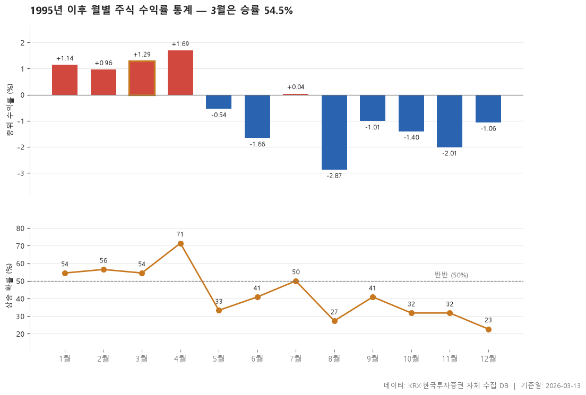

1995-06 ~ 2026-02 기간 263개월의 기록입니다. 역사적으로 가장 강한 달은 4월(중위 1.69%), 가장 약한 달은 8월(중위 -2.87%)입니다. 3월은 중위 1.29%, 승률 54.5%.

> 기준일: 2026-03-13 · 집계: 자체 수집 데이터베이스

## 핵심 내용

- 중위 수익률이 가장 높은 항목은 4월(1.69%)입니다.
- 중위 수익률이 가장 낮은 항목은 8월(-2.87%)입니다.
- 표에 포함된 항목의 중위 수익률 중위값은 -0.78%입니다.
- 표 12개 항목 중 5개가 양(+), 7개가 음(-)입니다.

## 전체 표

| 월 | 관측연수 | 중위수익률 | 평균수익률 | 상승한해 | 승률 | 최고 | 최저 |
|---|---|---|---|---|---|---|---|
| 1월 | 22 | 1.14 | 2.21 | 12 | 54.50 | 27.93 | -11.04 |
| 2월 | 23 | 0.96 | 0.63 | 13 | 56.50 | 11.63 | -9.77 |
| 3월 | 22 | 1.29 | 0.52 | 12 | 54.50 | 12.03 | -10.36 |
| 4월 | 21 | 1.69 | 1.28 | 15 | 71.40 | 19.17 | -20.30 |
| 5월 | 21 | -0.54 | -2.21 | 7 | 33.30 | 10.45 | -18.98 |
| 6월 | 22 | -1.66 | -2.11 | 9 | 40.90 | 6.24 | -11.71 |
| 7월 | 22 | 0.04 | 0.22 | 11 | 50 | 9.46 | -12.71 |
| 8월 | 22 | -2.87 | -2.67 | 6 | 27.30 | 4.68 | -10.96 |
| 9월 | 22 | -1.01 | -2.43 | 9 | 40.90 | 12.85 | -15 |
| 10월 | 22 | -1.40 | -2.73 | 7 | 31.80 | 14.74 | -31.63 |
| 11월 | 22 | -2.01 | -0.66 | 7 | 31.80 | 14.29 | -12.90 |
| 12월 | 22 | -1.06 | -3.19 | 5 | 22.70 | 15.87 | -25.54 |

## 집계 기준

- **기준**: 매월 말 거래일 종가 기준, 전 종목 개별 수익률의 중위값
- **관측구간**: 1995-06 ~ 2026-02 (유효 263개월)
- **모집단**: KOSPI·KOSDAQ 보통주
- **표본제외**: 집계 종목이 300개 미만인 112개월은 제외 (전체 375개월 중)
- **이상치처리**: 월 수익률 절대값 100% 초과분은 액면분할·병합 등 왜곡 가능성으로 제외
- **주의**: 종가는 수정주가 여부가 종목별로 다를 수 있어 개별 종목 수익률에는 오차가 있을 수 있습니다. 중위값을 쓰는 이유입니다.
- **단위**: 수익률·승률=%

## 데이터 출처 및 유의사항

- **데이터출처**: 한국거래소(KRX) 공시 데이터와 한국투자증권 OpenAPI 를 직접 수집해 구축한 자체 데이터베이스
- **집계방식**: 수집·집계·차트 생성을 직접 구현한 파이프라인에서 자동 산출
- **작성고지**: 본문의 표·통계·차트는 자체 데이터베이스에서 계산된 값이며, 문장 작성 과정에 AI 도구를 활용했습니다.
- **면책**: 본 글은 정보 제공을 목적으로 하며 특정 종목의 매수·매도를 추천하지 않습니다. 제시된 수치는 과거 데이터이고 미래 수익을 보장하지 않습니다. 투자 판단과 그 결과에 대한 책임은 투자자 본인에게 있습니다.

