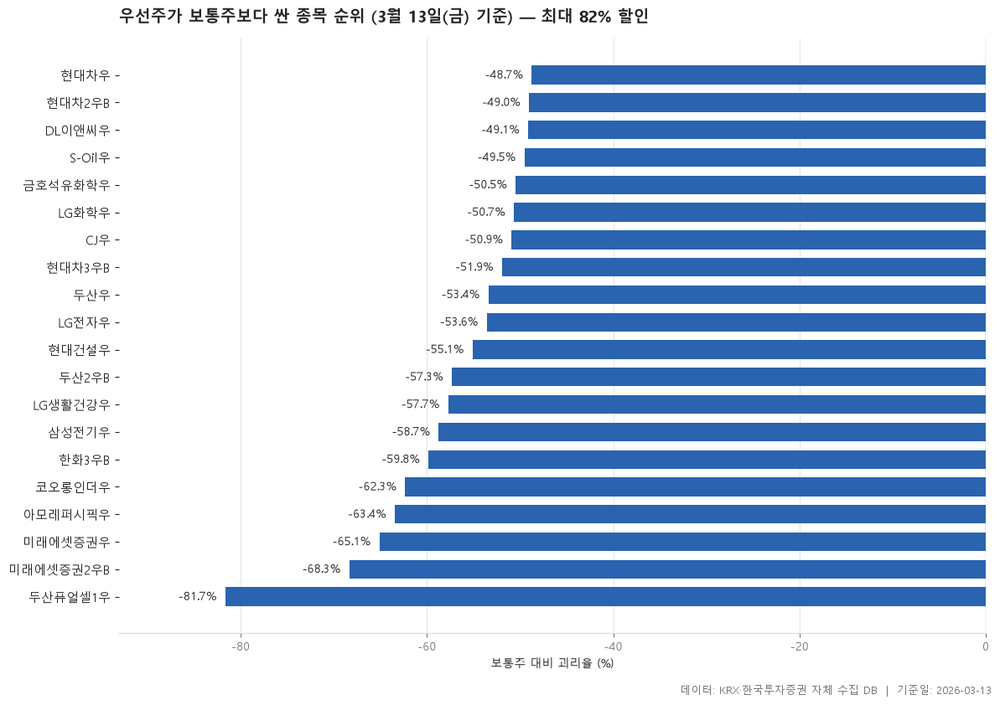

2026-03-13 종가 기준 우선주와 보통주의 가격 차이입니다. 괴리율이 음수면 우선주가 더 싸다는 뜻이고, 0개 종목은 오히려 우선주가 더 비쌉니다.

> 기준일: 2026-03-13 · 집계: 자체 수집 데이터베이스

## 핵심 내용

- 보통주 대비 괴리율이 가장 높은 항목은 현대차우(-48.74%)입니다.
- 보통주 대비 괴리율이 가장 낮은 항목은 두산퓨얼셀1우(-81.65%)입니다.
- 표에 포함된 항목의 보통주 대비 괴리율 중위값은 -54.34%입니다.

## 전체 표

| 우선주 | 우선주코드 | 보통주 | 보통주코드 | 우선주종가 | 보통주종가 | 괴리율 | 우선주배당수익률 | 우선주거래대금 |
|---|---|---|---|---|---|---|---|---|
| 두산퓨얼셀1우 | 33626K | 두산퓨얼셀 | 336260 | 8,450 | 46,050 | -81.65 | 0 | 4.40 |
| 미래에셋증권2우B | 00680K | 미래에셋증권 | 006800 | 22,000 | 69,500 | -68.35 | 1.14 | 145.30 |
| 미래에셋증권우 | 006805 | 미래에셋증권 | 006800 | 24,250 | 69,500 | -65.11 | 1.13 | 40.10 |
| 아모레퍼시픽우 | 090435 | 아모레퍼시픽 | 090430 | 47,900 | 131,000 | -63.44 | 2.36 | 8.70 |
| 코오롱인더우 | 120115 | 코오롱인더 | 120110 | 28,250 | 75,000 | -62.33 | 4.78 | 3.90 |
| 한화3우B | 00088K | 한화 | 000880 | 49,050 | 122,100 | -59.83 | 1.73 | 23.50 |
| 삼성전기우 | 009155 | 삼성전기 | 009150 | 165,300 | 400,500 | -58.73 | 1.12 | 52.60 |
| LG생활건강우 | 051905 | LG생활건강 | 051900 | 105,500 | 249,500 | -57.72 | 3.36 | 8.60 |
| 두산2우B | 000157 | 두산 | 000150 | 469,000 | 1,099,000 | -57.32 | 0.43 | 5 |
| 현대건설우 | 000725 | 현대건설 | 000720 | 73,800 | 164,400 | -55.11 | 0.88 | 17.40 |
| LG전자우 | 066575 | LG전자 | 066570 | 52,500 | 113,100 | -53.58 | 2 | 42.20 |
| 두산우 | 000155 | 두산 | 000150 | 512,000 | 1,099,000 | -53.41 | 0.40 | 70.90 |
| 현대차3우B | 005389 | 현대차 | 005380 | 248,500 | 517,000 | -51.93 | 4.85 | 32.60 |
| CJ우 | 001045 | CJ | 001040 | 86,600 | 176,400 | -50.91 | 3.52 | 4.40 |
| LG화학우 | 051915 | LG화학 | 051910 | 146,800 | 297,500 | -50.66 | 0.72 | 76.40 |
| 금호석유화학우 | 011785 | 금호석유화학 | 011780 | 57,600 | 116,300 | -50.47 | 3.91 | 5.30 |
| S-Oil우 | 010955 | S-Oil | 010950 | 54,500 | 108,000 | -49.54 | 0.28 | 19.90 |
| DL이앤씨우 | 37550K | DL이앤씨 | 375500 | 24,950 | 49,050 | -49.13 | 2.36 | 3.20 |
| 현대차2우B | 005387 | 현대차 | 005380 | 263,500 | 517,000 | -49.03 | 4.59 | 288.60 |
| 현대차우 | 005385 | 현대차 | 005380 | 265,000 | 517,000 | -48.74 | 4.55 | 206.60 |

## 집계 기준

- **기준**: (우선주 종가 - 보통주 종가) / 보통주 종가 × 100
- **짝짓기**: 우선주 코드 6자리 중 앞 5자리가 같고 끝자리가 0 인 종목을 보통주로 봅니다.
- **필터**: 우선주 거래대금 3억 이상
- **단위**: 종가=원, 괴리율·배당수익률=%, 거래대금=억원

## 데이터 출처 및 유의사항

- **데이터출처**: 한국거래소(KRX) 공시 데이터와 한국투자증권 OpenAPI 를 직접 수집해 구축한 자체 데이터베이스
- **집계방식**: 수집·집계·차트 생성을 직접 구현한 파이프라인에서 자동 산출
- **작성고지**: 본문의 표·통계·차트는 자체 데이터베이스에서 계산된 값이며, 문장 작성 과정에 AI 도구를 활용했습니다.
- **면책**: 본 글은 정보 제공을 목적으로 하며 특정 종목의 매수·매도를 추천하지 않습니다. 제시된 수치는 과거 데이터이고 미래 수익을 보장하지 않습니다. 투자 판단과 그 결과에 대한 책임은 투자자 본인에게 있습니다.

