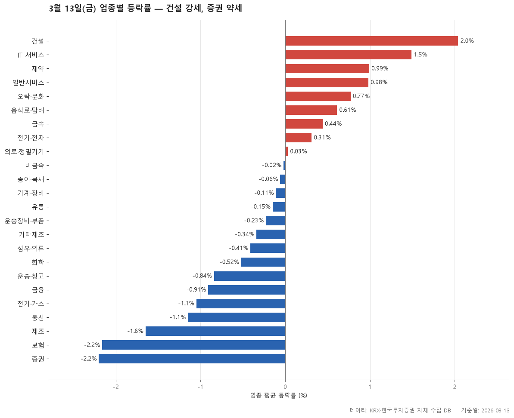

2026-03-13 기준 24개 업종의 평균 등락률입니다. 가장 강한 업종은 건설(2.04%), 가장 약한 업종은 증권(-2.2%).

> 기준일: 2026-03-13 · 집계: 자체 수집 데이터베이스

## 핵심 내용

- 업종 평균 등락률이 가장 높은 항목은 건설(2.04%)입니다.
- 업종 평균 등락률이 가장 낮은 항목은 증권(-2.20%)입니다.
- 표에 포함된 항목의 업종 평균 등락률 중위값은 -0.13%입니다.
- 표 24개 항목 중 9개가 양(+), 15개가 음(-)입니다.
- 업종은 24개로 나뉘고, 가장 많은 업종은 건설(1개)입니다.

## 전체 표

| 업종 | 종목수 | 평균등락률 | 상승비율 | 거래대금합계 |
|---|---|---|---|---|
| 건설 | 56 | 2.04 | 71.40 | 23,878.60 |
| IT 서비스 | 249 | 1.49 | 59 | 17,023.20 |
| 제약 | 178 | 0.99 | 59.60 | 14,086.80 |
| 일반서비스 | 172 | 0.98 | 58.70 | 21,665.80 |
| 오락·문화 | 68 | 0.77 | 69.10 | 1,872.70 |
| 음식료·담배 | 85 | 0.61 | 47.10 | 3,909.80 |
| 금속 | 135 | 0.44 | 40.70 | 15,760 |
| 전기·전자 | 380 | 0.31 | 44.50 | 146,165.80 |
| 의료·정밀기기 | 103 | 0.03 | 42.70 | 3,783.20 |
| 비금속 | 36 | -0.02 | 55.60 | 3,264.20 |
| 종이·목재 | 27 | -0.06 | 51.90 | 73.90 |
| 기계·장비 | 214 | -0.11 | 37.90 | 30,264.10 |
| 유통 | 161 | -0.15 | 37.90 | 8,103.50 |
| 운송장비·부품 | 137 | -0.23 | 39.40 | 26,647.10 |
| 기타제조 | 15 | -0.34 | 46.70 | 241.20 |
| 섬유·의류 | 49 | -0.41 | 38.80 | 451.40 |
| 화학 | 228 | -0.52 | 36 | 18,123.30 |
| 운송·창고 | 28 | -0.84 | 17.90 | 5,558.40 |
| 금융 | 110 | -0.91 | 23.60 | 20,015.30 |
| 전기·가스 | 10 | -1.05 | 20 | 2,868.50 |
| 통신 | 14 | -1.15 | 35.70 | 1,430.20 |
| 제조 | 8 | -1.65 | 50 | 17.80 |
| 보험 | 12 | -2.16 | 0 | 2,462.30 |
| 증권 | 18 | -2.20 | 0 | 4,335.30 |

## 집계 기준

- **기준**: 2026-03-12 종가 → 2026-03-13 종가, 업종 내 단순평균
- **필터**: 업종 내 보통주 5종목 이상
- **전체업종중위등락률**: -0.13
- **단위**: 등락률·상승비율=%, 거래대금합계=억원

## 데이터 출처 및 유의사항

- **데이터출처**: 한국거래소(KRX) 공시 데이터와 한국투자증권 OpenAPI 를 직접 수집해 구축한 자체 데이터베이스
- **집계방식**: 수집·집계·차트 생성을 직접 구현한 파이프라인에서 자동 산출
- **작성고지**: 본문의 표·통계·차트는 자체 데이터베이스에서 계산된 값이며, 문장 작성 과정에 AI 도구를 활용했습니다.
- **면책**: 본 글은 정보 제공을 목적으로 하며 특정 종목의 매수·매도를 추천하지 않습니다. 제시된 수치는 과거 데이터이고 미래 수익을 보장하지 않습니다. 투자 판단과 그 결과에 대한 책임은 투자자 본인에게 있습니다.

