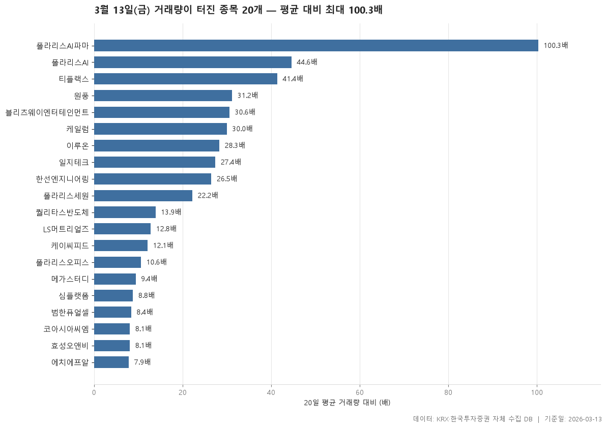

2026-03-13 거래량이 직전 20거래일 평균의 5배를 넘은 보통주 20개입니다.

> 기준일: 2026-03-13 · 집계: 자체 수집 데이터베이스

## 핵심 내용

- 20일 평균 거래량 대비 배수가 가장 높은 항목은 폴라리스AI파마(100.30배)입니다.
- 20일 평균 거래량 대비 배수가 가장 낮은 항목은 에치에프알(7.90배)입니다.
- 표에 포함된 항목의 20일 평균 거래량 대비 배수 중위값은 18.05배입니다.
- 시가총액이 가장 큰 항목은 LS머트리얼즈(15,458.6억원)입니다.
- 시장별로는 KOSPI 0개, KOSDAQ 20개입니다.
- 업종은 9개로 나뉘고, 가장 많은 업종은 IT 서비스(4개)입니다.

## 전체 표

| 종목명 | 종목코드 | 시장 | 업종 | 종가 | 등락률 | 거래량 | 평균거래량 | 배수 | 거래대금 | 시가총액 |
|---|---|---|---|---|---|---|---|---|---|---|
| 폴라리스AI파마 | 041910 | KOSDAQ | 제약 | 8,190 | 30 | 11,112,088 | 110,791 | 100.30 | 866.80 | 1,105.80 |
| 폴라리스AI | 039980 | KOSDAQ | IT 서비스 | 2,045 | 16.52 | 101,540,219 | 2,278,175 | 44.60 | 2,067.80 | 1,488.30 |
| 티플랙스 | 081150 | KOSDAQ | 금속 | 3,215 | 4.05 | 8,913,463 | 215,150 | 41.40 | 311.80 | 780.20 |
| 원풍 | 008370 | KOSDAQ | 화학 | 4,835 | -1.33 | 260,505 | 8,351 | 31.20 | 13.40 | 580.20 |
| 블리츠웨이엔터테인먼트 | 369370 | KOSDAQ | 오락·문화 | 1,705 | 7.37 | 17,722,632 | 578,605 | 30.60 | 335.30 | 850.30 |
| 케일럼 | 258610 | KOSDAQ | 금속 | 1,497 | 29.95 | 1,528,282 | 50,890 | 30 | 21.90 | 546.20 |
| 이루온 | 065440 | KOSDAQ | IT 서비스 | 2,205 | 0.46 | 25,051,009 | 886,457 | 28.30 | 583.40 | 601.40 |
| 일지테크 | 019540 | KOSDAQ | 운송장비·부품 | 6,330 | -0.16 | 9,562,828 | 348,868 | 27.40 | 677 | 855.40 |
| 한선엔지니어링 | 452280 | KOSDAQ | 금속 | 16,580 | 16.51 | 10,774,531 | 406,542 | 26.50 | 1,777.90 | 2,962.30 |
| 폴라리스세원 | 234100 | KOSDAQ | 운송장비·부품 | 1,149 | 8.81 | 16,093,441 | 723,476 | 22.20 | 189.10 | 813.40 |
| 퀄리타스반도체 | 432720 | KOSDAQ | 전기·전자 | 14,000 | 8.02 | 4,662,781 | 334,573 | 13.90 | 684.40 | 1,981.90 |
| LS머트리얼즈 | 417200 | KOSDAQ | 전기·전자 | 22,850 | 22.13 | 38,409,873 | 3,001,385 | 12.80 | 8,650.90 | 15,458.60 |
| 케이씨피드 | 025880 | KOSDAQ | 음식료·담배 | 3,020 | 3.42 | 5,820,010 | 481,018 | 12.10 | 180.80 | 504.80 |
| 폴라리스오피스 | 041020 | KOSDAQ | IT 서비스 | 5,100 | 29.94 | 7,977,220 | 752,276 | 10.60 | 385.60 | 2,536 |
| 메가스터디 | 072870 | KOSDAQ | 오락·문화 | 12,570 | 8.55 | 516,025 | 54,650 | 9.40 | 64.20 | 1,498.50 |
| 심플랫폼 | 444530 | KOSDAQ | IT 서비스 | 8,450 | 16.55 | 557,296 | 63,426 | 8.80 | 46.10 | 540.60 |
| 범한퓨얼셀 | 382900 | KOSDAQ | 전기·전자 | 35,150 | 11.41 | 815,108 | 96,964 | 8.40 | 279.40 | 3,079.50 |
| 코아시아씨엠 | 196450 | KOSDAQ | 의료·정밀기기 | 1,840 | 29.94 | 6,726,775 | 825,569 | 8.10 | 117.30 | 833.90 |
| 효성오앤비 | 097870 | KOSDAQ | 화학 | 6,560 | 0.61 | 3,291,934 | 408,278 | 8.10 | 239.30 | 556.90 |
| 에치에프알 | 230240 | KOSDAQ | 전기·전자 | 28,550 | 3.44 | 3,384,416 | 427,822 | 7.90 | 941.10 | 3,799.70 |

## 집계 기준

- **기준**: 당일 거래량 ≥ 직전 20거래일 평균 × 5
- **관측구간**: 2026-02-09 ~ 2026-03-12 (20거래일)
- **필터**: 시가총액 500억 이상, 거래대금 3억 이상, 보통주
- **단위**: 종가=원, 거래대금·시가총액=억원, 등락률=%

## 데이터 출처 및 유의사항

- **데이터출처**: 한국거래소(KRX) 공시 데이터와 한국투자증권 OpenAPI 를 직접 수집해 구축한 자체 데이터베이스
- **집계방식**: 수집·집계·차트 생성을 직접 구현한 파이프라인에서 자동 산출
- **작성고지**: 본문의 표·통계·차트는 자체 데이터베이스에서 계산된 값이며, 문장 작성 과정에 AI 도구를 활용했습니다.
- **면책**: 본 글은 정보 제공을 목적으로 하며 특정 종목의 매수·매도를 추천하지 않습니다. 제시된 수치는 과거 데이터이고 미래 수익을 보장하지 않습니다. 투자 판단과 그 결과에 대한 책임은 투자자 본인에게 있습니다.

