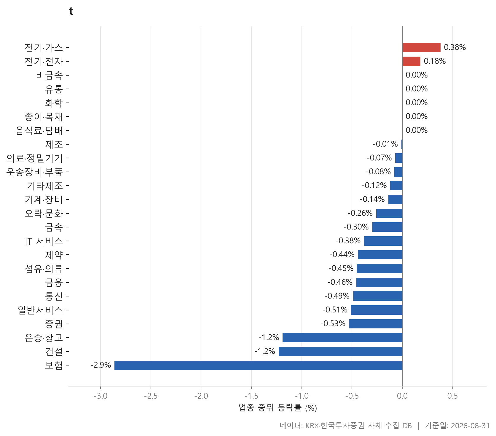
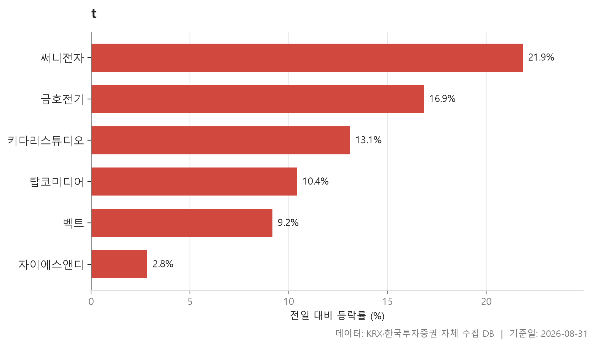
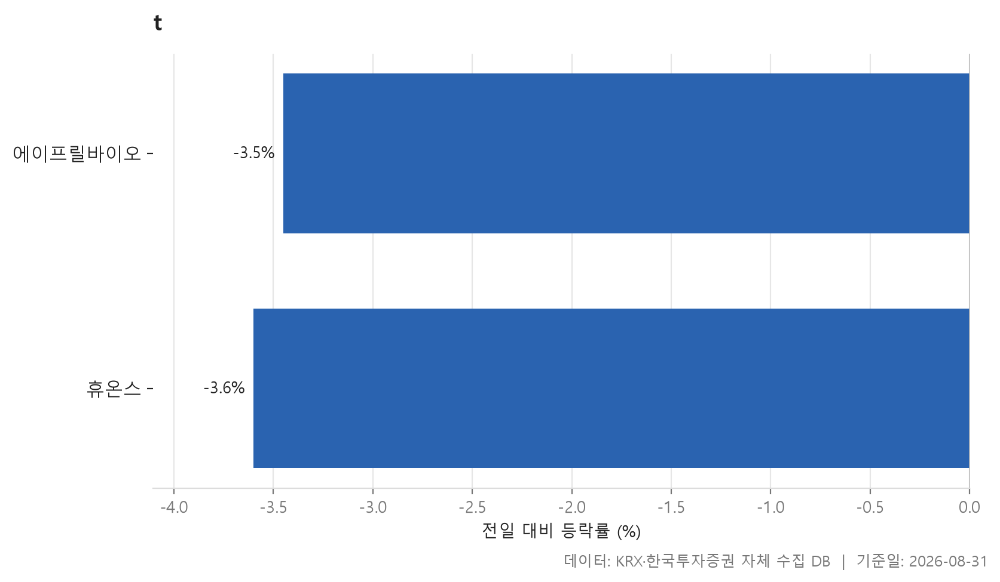
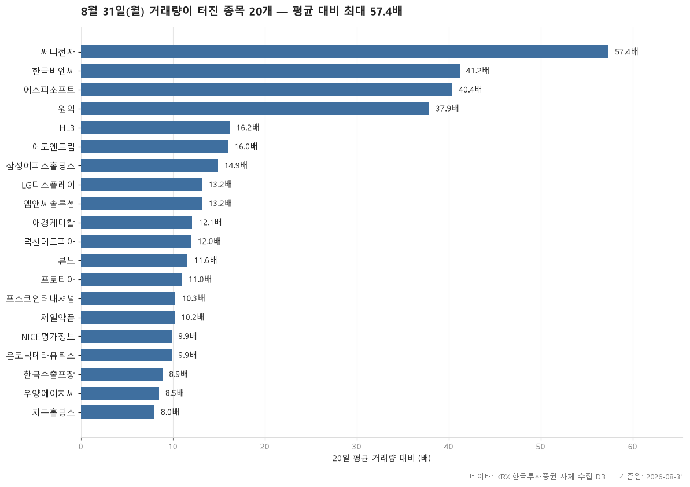

8월 31일 월요일 장을 데이터로 훑어봅니다. 먼저 전체 그림부터 말하면, 이날은 조용히 눌린 하루였습니다. 24개 업종의 중위 등락률을 늘어놓았을 때 그 한가운데에 놓인 값이 -0.20%였고, 양(+)으로 마감한 업종은 2개, 음(-)은 17개였습니다. 지수 한 줄로는 "약보합" 정도로 요약될 흐름이지만, 업종 단위로 쪼개 보면 위아래 폭이 꽤 벌어져 있습니다.

가장 강한 쪽은 전기·가스로 중위 0.38%, 가장 약한 쪽은 보험으로 -2.86%였습니다. 강세라고 해도 1%에 못 미치는 반면 약세 쪽은 3% 가까이 밀렸으니, 위쪽은 얕고 아래쪽은 깊은 비대칭입니다. 이런 날은 "무엇이 올랐나"보다 "무엇이 얼마나 눌렸나"를 보는 편이 시장의 모양을 이해하는 데 도움이 됩니다.

이어서 52주 신고가 6종목과 신저가 2종목, 그리고 20일 평균 거래량의 5배를 넘긴 20종목을 차례로 봅니다. 신고가·신저가 명단이 양쪽 모두 한 자릿수라는 점, 그런데 거래량이 터진 종목은 스무 개나 잡혔다는 점 — 이 대비 자체가 오늘 장의 성격을 어느 정도 말해 줍니다.

> 기준일: 2026-08-31 · 집계: 자체 수집 데이터베이스

## 업종 등락률 — 24개 중 17개 하락

표를 위에서부터 훑으면 상단이 매우 평평합니다. 1위 전기·가스가 0.38%, 2위 전기·전자가 0.18%이고, 그 아래로 비금속·유통·화학·종이·목재·음식료·담배가 나란히 0.00%입니다. 즉 '오른 업종'이라 부를 만한 곳은 사실상 둘뿐이고, 나머지 상위권은 보합에 걸쳐 있을 뿐입니다. 반대로 하단은 -1.19%(운송·창고), -1.23%(건설), -2.86%(보험)로 뚝뚝 떨어집니다. 위쪽은 붙어 있고 아래쪽은 벌어져 있는, 전형적으로 눌린 날의 분포입니다.

중위값과 평균이 어긋나는 곳들이 이 표의 볼거리입니다. 1위 전기·가스는 중위 0.38%인데 평균은 -0.90%로 뒤집혀 있습니다. 주도종목 SGC에너지가 -11.62%였고 이 한 종목의 평균기여도가 -1.16%p니, 중위와 평균의 격차를 사실상 이 종목 하나가 만들어 냈다고 볼 수 있습니다. 종목수 10개짜리 업종에서 한 종목이 두 자릿수로 밀리면 평균은 이렇게 쉽게 흔들립니다. 제조 업종은 더 극단적인데, 중위 -0.01%에 평균 -3.55%, 그리고 에넥스 한 종목의 기여도가 -3.74%p입니다. 종목수 8개짜리 업종의 평균은 사실상 한 종목의 하한가 기록일 뿐입니다. 순위를 중위값으로 매긴 이유가 이 두 줄에 다 들어 있습니다.

반대 방향의 어긋남도 있습니다. 건설은 중위 -1.23%로 밑에서 두 번째인데 평균은 -0.43%로 훨씬 낫습니다. 엑사이엔씨가 30.00%로 상한가를 기록하면서 평균에 0.61%p를 얹었기 때문입니다. 상승비율은 22.40%에 그쳤으니, 업종 안 대부분은 내렸고 소수가 크게 오른 구조입니다. 운송·창고도 비슷합니다. 상승비율이 11.10%로 표 안에서 가장 낮은 축인데 평균(-0.88%)은 중위(-1.19%)보다 위에 있고, STX그린로지스가 9.27%로 0.34%p를 보탰습니다.

반면 보험은 어긋남이 없습니다. 중위 -2.86%, 평균 -2.74%로 두 값이 붙어 있고 상승비율은 0.00% — 11개 종목 중 오른 것이 하나도 없었습니다. 주도종목 미래에셋생명이 -7.11%로 기여도 -0.65%p인데, 중위와 평균의 간격이 이보다 훨씬 작으니 한 종목이 끌어내린 게 아니라 업종 전체가 함께 내려앉은 모양입니다. 증권(상승비율 17.60%)과 통신(25.00%)도 참여율이 낮았습니다. 한편 거래대금 쪽을 보면 전기·전자가 168,921.30억원으로 압도적이고 금융이 28,766.80억원으로 뒤를 잇는데, 등락 순위와 돈이 몰린 곳은 반드시 같지 않다는 점도 함께 확인됩니다.

| 업종 | 종목수(개) | 중위등락률(%) | 평균등락률(%) | 상승비율(%) | 주도종목 | 주도종목등락률(%) | 평균기여도(%p) | 거래대금합계(억원) |
|---|---|---|---|---|---|---|---|---|
| 전기·가스 | 10 | 0.38 | -0.90 | 50.00 | SGC에너지 | -11.62 | -1.16 | 654.90 |
| 전기·전자 | 369 | 0.18 | 0.60 | 52.80 | 우리이앤엘하루틴 | 29.95 | 0.08 | 168,921.30 |
| 비금속 | 36 | 0.00 | 0.98 | 47.20 | 강동씨앤엘 | 29.94 | 0.83 | 748.10 |
| 유통 | 154 | 0.00 | 0.44 | 48.70 | 사토시홀딩스 | 30.00 | 0.19 | 7,604.60 |
| 화학 | 218 | 0.00 | 0.42 | 46.80 | 티케이지애강 | 30.00 | 0.14 | 14,090.40 |
| 종이·목재 | 27 | 0.00 | 0.03 | 48.10 | 동화기업 | 3.46 | 0.13 | 62.50 |
| 음식료·담배 | 82 | 0.00 | -0.24 | 41.50 | 휴럼 | -5.38 | -0.07 | 2,339.70 |
| 제조 | 8 | -0.01 | -3.55 | 50.00 | 에넥스 | -29.91 | -3.74 | 36.00 |
| 의료·정밀기기 | 99 | -0.07 | 0.38 | 42.40 | LK삼양 | 29.99 | 0.30 | 2,640.90 |
| 운송장비·부품 | 132 | -0.08 | 0.00 | 46.20 | 한국피아이엠 | 6.53 | 0.05 | 12,643.90 |
| 기타제조 | 14 | -0.12 | -0.33 | 35.70 | 브이씨 | 3.55 | 0.25 | 12.30 |
| 기계·장비 | 207 | -0.14 | 0.22 | 44.90 | 엠앤씨솔루션 | 21.11 | 0.10 | 15,080.60 |
| 오락·문화 | 66 | -0.26 | 0.07 | 43.90 | 캔버스엔 | 29.96 | 0.45 | 1,209.20 |
| 금속 | 129 | -0.30 | -0.57 | 35.70 | 에이에프더블류 | -18.39 | -0.14 | 4,603.40 |
| IT 서비스 | 244 | -0.38 | -0.50 | 34.80 | 뷰노 | -24.46 | -0.10 | 8,133.40 |
| 제약 | 168 | -0.44 | -0.51 | 38.10 | 한국비엔씨 | 9.96 | 0.06 | 14,360.60 |
| 섬유·의류 | 50 | -0.45 | -0.94 | 34.00 | 우성머티리얼스 | -21.15 | -0.42 | 252.80 |
| 금융 | 111 | -0.46 | -0.46 | 36.90 | TS인베스트먼트 | 9.20 | 0.08 | 28,766.80 |
| 통신 | 12 | -0.49 | -0.47 | 25.00 | SK텔레콤 | -4.46 | -0.37 | 2,479.90 |
| 일반서비스 | 164 | -0.51 | -0.32 | 34.10 | 셀리드 | 27.15 | 0.17 | 7,890.00 |
| 증권 | 17 | -0.53 | -0.75 | 17.60 | 미래에셋증권 | -4.01 | -0.24 | 1,342.40 |
| 운송·창고 | 27 | -1.19 | -0.88 | 11.10 | STX그린로지스 | 9.27 | 0.34 | 1,675.90 |
| 건설 | 49 | -1.23 | -0.43 | 22.40 | 엑사이엔씨 | 30.00 | 0.61 | 6,759.60 |
| 보험 | 11 | -2.86 | -2.74 | 0.00 | 미래에셋생명 | -7.11 | -0.65 | 3,446.30 |

## 52주 신고가 6개 — 최고 써니전자 21.85%

52주 신고가는 6개뿐입니다. 시가총액 500억, 거래대금 3억이라는 필터를 감안해도 적은 숫자고, 앞서 본 '양(+) 업종 2개'와 맞물려 보면 오늘 위로 뻗은 자리가 넓지 않았다는 뜻이 됩니다.

명단 안쪽은 성격이 둘로 갈립니다. 시가총액이 가장 큰 자이에스앤디(4,487억원)는 종가 11,570원, 직전 52주 최고가가 11,560원이었습니다. 딱 넘어선 수준이고 등락률도 2.84%로 명단 최저입니다. 반대편에는 써니전자(21.85%), 금호전기(16.85%), 키다리스튜디오(13.11%)처럼 두 자릿수로 뛰면서 이전 고점을 확실히 벗어난 종목들이 있습니다. 명단의 중위 등락률은 11.77%로, 6개 중 절반 이상이 두 자릿수 상승이었던 셈입니다.

거래대금의 쏠림도 눈에 띕니다. 금호전기가 3,397.50억원으로 나머지를 크게 앞서는데, 시가총액은 1,545억원입니다. 시총보다 하루 거래대금이 큰 상황이니 손바뀜이 상당히 격했다고 볼 수 있습니다. 반면 벡트는 신고가 명단에 있으면서도 거래대금이 15.80억원에 그칩니다. 같은 '신고가'라는 딱지가 붙어도 그 안의 밀도는 이렇게 다릅니다. 업종은 3개로만 나뉘고 전기·전자가 3개로 가장 많은데, 전기·전자는 업종 표에서도 중위 0.18%로 2위였습니다. 다만 6개짜리 표에서 업종 편중을 읽는 데는 한계가 있으니, 참고 수준으로만 보는 게 맞겠습니다.

| 종목명 | 종목코드 | 시장 | 업종 | 종가(원) | 등락률(%) | 이전52주최고(원) | 거래대금(억원) | 시가총액(억원) |
|---|---|---|---|---|---|---|---|---|
| 자이에스앤디 | 317400 | KOSPI | 부동산 | 11,570 | 2.84 | 11,560 | 107.00 | 4,487 |
| 키다리스튜디오 | 020120 | KOSPI | IT 서비스 | 6,990 | 13.11 | 6,390 | 84.60 | 2,591 |
| 탑코미디어 | 134580 | KOSDAQ | IT 서비스 | 3,810 | 10.43 | 3,695 | 70.10 | 1,878 |
| 금호전기 | 001210 | KOSPI | 전기·전자 | 12,480 | 16.85 | 10,680 | 3,397.50 | 1,545 |
| 써니전자 | 004770 | KOSPI | 전기·전자 | 2,370 | 21.85 | 2,045 | 414.10 | 842 |
| 벡트 | 457600 | KOSDAQ | 전기·전자 | 5,470 | 9.18 | 5,200 | 15.80 | 750 |

## 52주 신저가 2개 — 최저 휴온스 -3.60%

신저가는 단 2개입니다. 업종 17개가 마이너스로 끝난 날치고는 적은 수인데, 이는 오늘의 하락이 대체로 '얕게 넓은' 형태였다는 뜻으로 읽을 수 있습니다. 개별 종목을 52주 바닥 아래로 밀어낼 만큼의 낙폭은 흔치 않았던 것이죠.

두 종목 모두 KOSDAQ이고, 하락폭도 에이프릴바이오 -3.45%, 휴온스 -3.60%로 거의 같습니다. 중위값 -3.52%가 그 사이에 놓입니다. 3%대 하락은 그 자체로 대단한 낙폭은 아니지만, 이미 52주 최저가 부근까지 내려와 있던 종목이라면 이 정도로도 바닥을 갈아치웁니다. 실제로 에이프릴바이오는 종가 17,910원에 직전 52주 최저가가 18,410원, 휴온스는 종가 21,400원에 직전 최저 21,950원이었습니다.

두 종목은 각각 일반서비스와 제약으로 업종이 갈립니다. 업종 표에서 제약은 중위 -0.44%, 일반서비스는 -0.51%로 표 하단에 걸쳐 있긴 하지만 바닥권은 아니었습니다. 즉 이날 신저가는 업종 전체가 무너져서 나온 결과라기보다 개별 종목 사정에 가까워 보입니다. 다만 그 사정이 무엇인지는 이 표만으로는 알 수 없고, 표가 말해 주는 것은 '52주 저점 아래로 내려갔다'는 사실까지입니다.

| 종목명 | 종목코드 | 시장 | 업종 | 종가(원) | 등락률(%) | 이전52주최저(원) | 거래대금(억원) | 시가총액(억원) |
|---|---|---|---|---|---|---|---|---|
| 에이프릴바이오 | 397030 | KOSDAQ | 일반서비스 | 17,910 | -3.45 | 18,410 | 135.60 | 4,936 |
| 휴온스 | 243070 | KOSDAQ | 제약 | 21,400 | -3.60 | 21,950 | 23.40 | 2,564 |

## 거래량 급증 20개 — 최고 써니전자 57.40배

거래량이 20일 평균의 5배를 넘긴 종목은 20개, 배수 중위값은 12.05배입니다. 상위 몇 개는 이 중위값과 자릿수가 다릅니다. 써니전자 57.40배, 한국비엔씨 41.20배, 에스피소프트 40.40배, 원익 37.90배까지가 한 덩어리고, 그 아래 HLB 16.20배부터는 완만하게 내려와 지구홀딩스 8.00배로 끝납니다. 위쪽 네 종목만 유난히 떨어져 있는 구조입니다.

거래량이 터졌다고 방향이 같지는 않다는 점이 이 표의 핵심입니다. 배수 1위 써니전자는 21.85%로 신고가 명단에도 이름을 올렸지만, 배수 3위 에스피소프트는 40.40배에도 -1.06%로 사실상 제자리입니다. 거래량이 평소의 수십 배로 몰리고도 가격이 거의 움직이지 않았다는 뜻이니, 사는 쪽과 파는 쪽이 팽팽했다고 볼 수 있습니다. HLB도 16.20배에 -1.11%로 비슷한 모양이고, 뷰노는 11.60배에 -24.46%로 표에서 가장 크게 밀렸습니다. 지구홀딩스 역시 8.00배에 -13.30%입니다. 급증 명단은 상승 명단이 아닙니다.

규모의 차이도 큽니다. 시가총액 최대는 삼성에피스홀딩스로 96,297억원, 14.90배 급증에 3.61% 상승이었고, 포스코인터내셔널(94,471억원)은 10.30배에 1.90%였습니다. 대형주는 배수가 커도 등락률은 한 자릿수 초반에 머무는 반면, 시가총액이 수천억원에 미치지 못하는 종목들은 20%대 등락이 흔합니다. 덕산테코피아 23.34%, 온코닉테라퓨틱스 22.07%, 엠앤씨솔루션 21.11%, 원익 19.40% 같은 숫자가 그렇습니다. 같은 '5배 초과'라도 그 안에서 벌어지는 일은 규모에 따라 전혀 다릅니다.

한편 배수가 높은 것과 실제로 돈이 많이 오간 것도 구분해서 볼 필요가 있습니다. 뷰노는 11.60배지만 거래대금은 14.40억원, 프로티아는 11.00배에 10.30억원, 한국수출포장은 8.90배에 8.20억원입니다. 평소가 워낙 한산했던 종목이라 배수만 커진 경우죠. 반대로 HLB(4,781.00억원), LG디스플레이(3,903.70억원), 삼성에피스홀딩스(3,030.90억원)는 배수는 중간권이어도 실제 거래대금은 압도적입니다. 시장은 KOSPI 9개, KOSDAQ 11개로 갈렸고 업종은 11개로 흩어졌는데, 특정 테마가 한 방향으로 몰렸다기보다 여기저기서 개별적으로 터진 하루로 보입니다.

| 종목명 | 종목코드 | 시장 | 업종 | 종가(원) | 등락률(%) | 거래량(주) | 평균거래량(주) | 배수(배) | 거래대금(억원) | 시가총액(억원) |
|---|---|---|---|---|---|---|---|---|---|---|
| 써니전자 | 004770 | KOSPI | 전기·전자 | 2,370 | 21.85 | 17,443,215 | 303,834 | 57.40 | 414.10 | 842 |
| 한국비엔씨 | 256840 | KOSDAQ | 제약 | 2,650 | 9.96 | 9,803,049 | 238,131 | 41.20 | 267.90 | 1,812 |
| 에스피소프트 | 443670 | KOSDAQ | IT 서비스 | 3,740 | -1.06 | 7,173,483 | 177,393 | 40.40 | 285.10 | 898 |
| 원익 | 032940 | KOSDAQ | 유통 | 8,000 | 19.40 | 9,987,994 | 263,678 | 37.90 | 778.10 | 1,455 |
| HLB | 028300 | KOSDAQ | 제약 | 35,600 | -1.11 | 13,415,253 | 827,763 | 16.20 | 4,781.00 | 47,419 |
| 에코앤드림 | 101360 | KOSDAQ | 전기·전자 | 9,330 | 12.14 | 589,823 | 36,844 | 16.00 | 55.10 | 1,659 |
| 삼성에피스홀딩스 | 0126Z0 | KOSPI | 금융 | 387,000 | 3.61 | 784,461 | 52,575 | 14.90 | 3,030.90 | 96,297 |
| LG디스플레이 | 034220 | KOSPI | 전기·전자 | 9,440 | -1.87 | 41,287,780 | 3,135,998 | 13.20 | 3,903.70 | 47,200 |
| 엠앤씨솔루션 | 484870 | KOSPI | 기계·장비 | 18,300 | 21.11 | 1,314,238 | 99,242 | 13.20 | 243.10 | 5,025 |
| 애경케미칼 | 161000 | KOSPI | 화학 | 11,020 | 8.04 | 2,238,632 | 184,841 | 12.10 | 248.20 | 5,361 |
| 덕산테코피아 | 317330 | KOSDAQ | 화학 | 13,530 | 23.34 | 765,236 | 63,532 | 12.00 | 98.10 | 2,770 |
| 뷰노 | 338220 | KOSDAQ | IT 서비스 | 5,590 | -24.46 | 256,284 | 22,167 | 11.60 | 14.40 | 783 |
| 프로티아 | 303360 | KOSDAQ | 의료·정밀기기 | 5,340 | 7.55 | 196,497 | 17,818 | 11.00 | 10.30 | 688 |
| 포스코인터내셔널 | 047050 | KOSPI | 유통 | 53,700 | 1.90 | 5,435,721 | 529,208 | 10.30 | 2,915.70 | 94,471 |
| 제일약품 | 271980 | KOSPI | 제약 | 10,680 | 5.74 | 718,171 | 70,113 | 10.20 | 79.70 | 1,570 |
| NICE평가정보 | 030190 | KOSPI | IT 서비스 | 16,030 | 0.12 | 776,761 | 78,756 | 9.90 | 124.60 | 9,444 |
| 온코닉테라퓨틱스 | 476060 | KOSDAQ | 일반서비스 | 18,030 | 22.07 | 6,389,230 | 646,000 | 9.90 | 1,120.90 | 8,187 |
| 한국수출포장 | 002200 | KOSPI | 종이·목재 | 2,695 | 1.13 | 307,682 | 34,399 | 8.90 | 8.20 | 903 |
| 우양에이치씨 | 101970 | KOSDAQ | 금속 | 11,250 | -0.44 | 116,641 | 13,695 | 8.50 | 14.10 | 1,664 |
| 지구홀딩스 | 221800 | KOSDAQ | 일반서비스 | 4,630 | -13.30 | 589,469 | 73,778 | 8.00 | 29.80 | 756 |

## 정리

정리하면 8월 31일은 24개 업종 중 17개가 마이너스로 끝난, 위쪽은 얕고 아래쪽은 깊었던 하루였습니다. 전기·가스가 중위 0.38%로 가장 위에 섰지만 평균은 -0.90%로 뒤집혀 있었고, 보험은 중위 -2.86%에 상승비율 0.00%로 예외 없이 눌렸습니다. 52주 신고가 6개와 신저가 2개는 양쪽 모두 소수였던 반면 거래량 급증은 20개가 걸렸는데, 그 안에서도 오른 종목과 내린 종목이 뒤섞여 있었습니다.

다만 이 글이 다룬 것은 하루치 가격과 거래량 숫자뿐입니다. 왜 보험 업종이 한 종목도 남기지 않고 밀렸는지, 왜 특정 종목에 평소의 수십 배 거래량이 들어왔는지 — 그 이유는 이 표 안에 없습니다. 표가 보여 주는 것은 '무엇이 얼마나 움직였는가'까지이고, 그 너머는 각자 확인하실 몫으로 남겨 둡니다. 또한 중위와 평균이 크게 벌어진 업종, 종목수가 10개 안팎인 업종의 통계는 한두 종목에 좌우되므로 해석에 주의가 필요합니다.

## 집계 기준

**업종 등락률**

- **기준**: 2026-08-28 종가 → 2026-08-31 종가
- **순위**: 업종 내 종목 등락률의 중위값 (평균은 참고용으로 함께 표시)
- **주도종목**: 그 업종에서 등락률 절대값이 가장 큰 종목 (동점이면 거래대금이 큰 쪽)
- **평균기여도**: 그 종목 하나가 업종 평균을 움직인 폭 (등락률 ÷ 종목수). 중위값과 평균의 격차가 이 값에 가까우면 평균을 만든 것이 그 종목이고, 훨씬 크면 다른 종목들도 함께 움직인 것입니다
- **필터**: 업종 내 보통주 5종목 이상
- **전체업종중위등락률(%)**: -0.2

**52주 신고가**

- **기준**: 종가 > 직전 52주 최고가
- **관측구간**: 2025-08-18 ~ 2026-08-28 (252거래일)
- **필터**: 시가총액 500억 이상, 거래대금 3억 이상, 보통주

**52주 신저가**

- **기준**: 종가 < 직전 52주 최저가
- **관측구간**: 2025-08-18 ~ 2026-08-28 (252거래일)
- **필터**: 시가총액 500억 이상, 거래대금 3억 이상, 보통주

**거래량 급증**

- **기준**: 당일 거래량 ≥ 직전 20거래일 평균 × 5
- **관측구간**: 2026-07-31 ~ 2026-08-28 (20거래일)
- **필터**: 시가총액 500억 이상, 거래대금 3억 이상, 보통주

## 데이터 출처 및 유의사항

- **데이터출처**: 한국거래소(KRX) 공시 데이터와 한국투자증권 OpenAPI 를 직접 수집해 구축한 자체 데이터베이스
- **집계방식**: 수집·집계·차트 생성을 직접 구현한 파이프라인에서 자동 산출
- **작성고지**: 본문의 표·통계·차트는 자체 데이터베이스에서 계산된 값이며, 문장 작성 과정에 AI 도구를 활용했습니다.
- **면책**: 본 글은 정보 제공을 목적으로 하며 특정 종목의 매수·매도를 추천하지 않습니다. 제시된 수치는 과거 데이터이고 미래 수익을 보장하지 않습니다. 투자 판단과 그 결과에 대한 책임은 투자자 본인에게 있습니다.

