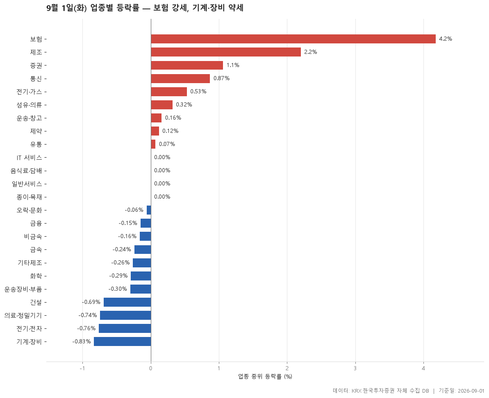
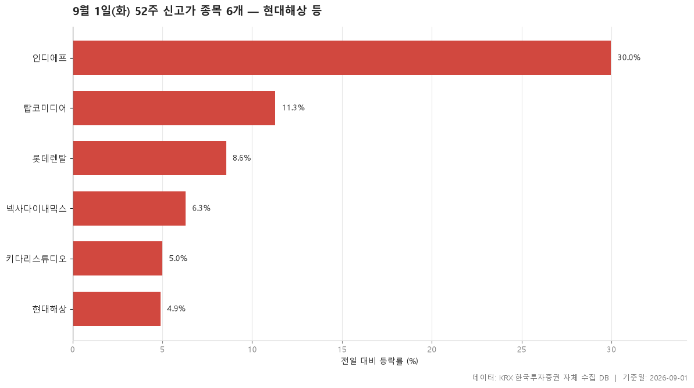
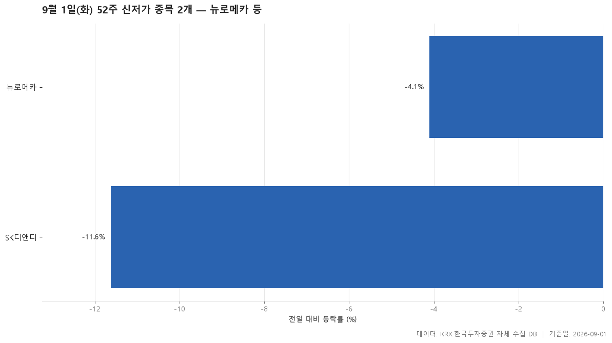
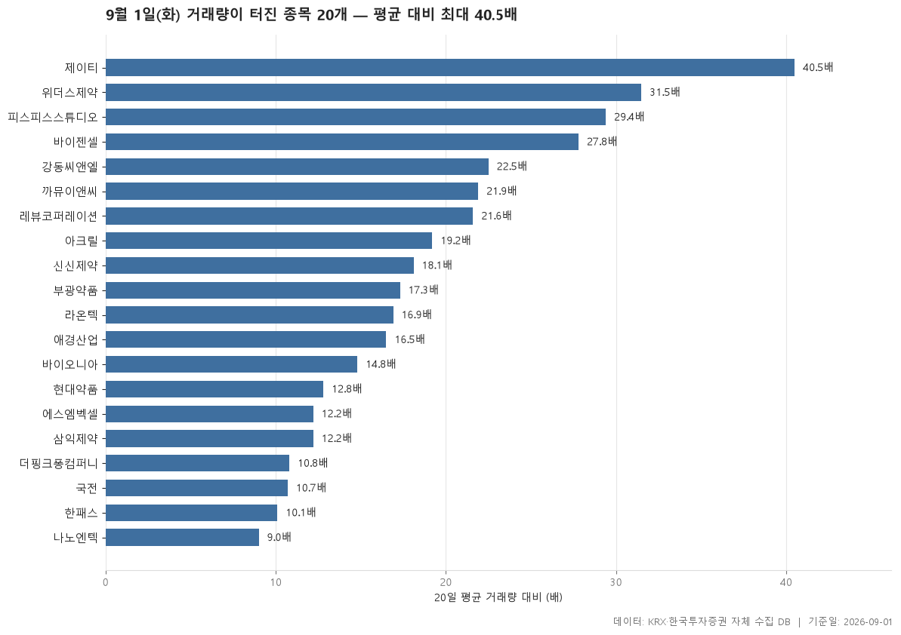

9월 1일 화요일 장이 끝났습니다. 오늘 시장은 한마디로 정리하기가 애매한 날이었습니다. 24개 업종 중 9개가 플러스, 11개가 마이너스였고, 업종 중위 등락률을 줄 세웠을 때 딱 가운데 놓인 값이 0%였습니다. 지수 한 방향으로 쏠린 날이 아니라, 업종별로 갈라진 날이라는 뜻입니다.

다만 양쪽 끝은 분명했습니다. 위쪽 끝은 보험(4.18%), 아래쪽 끝은 기계·장비(-0.83%). 보험은 11개 종목 전부가 올랐고, 기계·장비는 207개 종목 중 상승비율이 32.90%에 그쳤습니다. 같은 날 신고가 명단 맨 위에도 보험 종목이 있고, 신저가 명단 맨 위에도 기계·장비 종목이 있으니 업종 표와 신고·신저가 표가 서로 같은 방향을 가리킨 셈입니다.

아래에서는 업종 등락률, 52주 신고가 6개, 52주 신저가 2개, 그리고 거래량이 20일 평균의 5배를 넘은 20개 종목을 차례로 봅니다. 표에 적힌 숫자 안에서만 이야기하고, 왜 그렇게 움직였는지는 이 자료로 알 수 없으니 짐작하지 않겠습니다.

> 기준일: 2026-09-01 · 집계: 자체 수집 데이터베이스

## 업종 등락률 — 24개 중 11개 하락

보시면 상위권이 유별나게 두껍지 않습니다. 보험이 4.18%로 혼자 앞서 있고, 그다음 제조가 2.20%, 그 아래 증권 1.06%로 뚝 떨어집니다. 4위 통신부터는 이미 0%대이고, 10위권에 들어서면 0.00%가 세 업종이나 나옵니다. 즉 오늘 '강했다'고 말할 수 있는 업종은 사실상 세 개 정도이고, 중간층은 거의 제자리였습니다. 반대로 하위권은 -0.06%부터 -0.83%까지 완만하게 내려가, 특별히 무너진 업종 없이 얕고 넓게 눌린 형태입니다.

보험은 이 표에서 가장 깔끔한 항목입니다. 종목수 11개에 상승비율 100.00%, 중위 4.18%인데 평균은 3.53%로 오히려 중위보다 낮습니다. 주도종목 DB손해보험이 6.35%였지만 평균기여도는 0.58%p에 불과하니, 한 종목이 끌어올린 그림이 아니라 업종 전체가 함께 올라간 뒤 상단이 조금 더 벌어진 모습으로 읽힙니다. 이런 형태는 오늘 표에서 보험 말고는 찾기 어렵습니다.

어긋나 보이는 대목은 중위값과 평균이 벌어진 업종들입니다. 섬유·의류는 중위 0.32%인데 평균이 1.81%입니다. 주도종목 인디에프가 29.98%로 상한가 수준이고 평균기여도가 0.60%p인데, 격차는 그보다 큽니다. 인디에프 하나만으로 설명되지 않고 다른 종목들도 함께 올랐다는 뜻이죠. 통신도 중위 0.87%에 평균 2.03%, 주도종목 더즌 10.70%에 기여도 0.89%p로 비슷한 구조입니다. 반대로 전기·가스는 중위 0.53%에 평균 0.01%, 주도종목 SGC에너지가 -6.31%로 기여도 -0.63%p이니, 여기서는 아래쪽 한 종목이 평균을 눌러 놓은 쪽에 가깝습니다.

하위권에서는 건설이 눈에 걸립니다. 중위 -0.69%로 최하위는 아닌데 상승비율이 24.50%로 표 전체에서 가장 낮습니다. 오르는 종목이 넷 중 하나뿐이었다는 뜻입니다. 그런데 주도종목은 우진아이엔에스로 11.12% 상승이었습니다. 폭이 큰 종목은 위쪽에 있는데 종목 대부분은 내린, 안이 갈린 업종입니다. 기계·장비 역시 중위는 -0.83%로 최하위지만 주도종목 한울반도체는 29.94%였습니다. 거래대금 쪽에서는 전기·전자가 115,673.80억원으로 압도적인데 중위 등락률은 -0.76%. 돈이 가장 많이 오간 자리가 가장 강한 자리는 아니었습니다.

| 업종 | 종목수(개) | 중위등락률(%) | 평균등락률(%) | 상승비율(%) | 주도종목 | 주도종목등락률(%) | 평균기여도(%p) | 거래대금합계(억원) |
|---|---|---|---|---|---|---|---|---|
| 보험 | 11 | 4.18 | 3.53 | 100.00 | DB손해보험 | 6.35 | 0.58 | 2,556.40 |
| 제조 | 7 | 2.20 | 2.39 | 71.40 | 지누스 | 6.21 | 0.89 | 8.80 |
| 증권 | 17 | 1.06 | 0.69 | 70.60 | 다올투자증권 | 2.49 | 0.15 | 912.50 |
| 통신 | 12 | 0.87 | 2.03 | 75.00 | 더즌 | 10.70 | 0.89 | 1,103.70 |
| 전기·가스 | 10 | 0.53 | 0.01 | 70.00 | SGC에너지 | -6.31 | -0.63 | 516.40 |
| 섬유·의류 | 50 | 0.32 | 1.81 | 60.00 | 인디에프 | 29.98 | 0.60 | 1,045.50 |
| 운송·창고 | 28 | 0.16 | -0.23 | 57.10 | STX그린로지스 | -6.79 | -0.24 | 1,509.70 |
| 제약 | 168 | 0.12 | 0.88 | 52.40 | JW신약 | 30.00 | 0.18 | 10,345.00 |
| 유통 | 153 | 0.07 | 0.48 | 50.30 | 온타이드 | 30.00 | 0.20 | 5,478.90 |
| IT 서비스 | 244 | 0.00 | 0.16 | 43.90 | 아이크래프트 | -25.60 | -0.10 | 5,928.50 |
| 음식료·담배 | 82 | 0.00 | 0.16 | 46.30 | 체리부로 | 7.46 | 0.09 | 1,461.40 |
| 일반서비스 | 165 | 0.00 | 0.07 | 43.00 | 박셀바이오 | 26.59 | 0.16 | 6,315.50 |
| 종이·목재 | 27 | 0.00 | -0.18 | 48.10 | 페이퍼코리아 | 5.11 | 0.19 | 68.00 |
| 오락·문화 | 65 | -0.06 | 0.42 | 47.70 | 더핑크퐁컴퍼니 | 16.64 | 0.26 | 732.10 |
| 금융 | 111 | -0.15 | 0.04 | 44.10 | SK | 7.52 | 0.07 | 16,968.30 |
| 비금속 | 36 | -0.16 | 0.06 | 38.90 | 강동씨앤엘 | 22.98 | 0.64 | 1,336.90 |
| 금속 | 130 | -0.24 | -0.30 | 39.20 | 세아메카닉스 | 13.79 | 0.11 | 4,488.90 |
| 기타제조 | 14 | -0.26 | 0.30 | 42.90 | 제이에스티나 | 9.61 | 0.69 | 29.80 |
| 화학 | 219 | -0.29 | -0.51 | 38.40 | 코이즈 | -15.72 | -0.07 | 13,237.00 |
| 운송장비·부품 | 132 | -0.30 | -0.09 | 43.20 | 네오티스 | -10.24 | -0.08 | 8,281.80 |
| 건설 | 49 | -0.69 | -0.49 | 24.50 | 우진아이엔에스 | 11.12 | 0.23 | 4,762.80 |
| 의료·정밀기기 | 99 | -0.74 | -0.81 | 31.30 | 마이크로디지탈 | -29.99 | -0.30 | 1,881.80 |
| 전기·전자 | 370 | -0.76 | -0.39 | 34.10 | 비에이치 | 20.68 | 0.06 | 115,673.80 |
| 기계·장비 | 207 | -0.83 | -0.31 | 32.90 | 한울반도체 | 29.94 | 0.14 | 10,461.90 |

## 52주 신고가 6개 — 최고 인디에프 29.98%

필터를 통과해 52주 최고가를 넘은 보통주는 6개뿐입니다. 시가총액 500억, 거래대금 3억 기준을 걸었으니 아주 작은 종목은 빠져 있고, 그래도 6개면 넉넉한 숫자는 아닙니다. 앞 섹션에서 본 '반은 오르고 반은 내린' 시장과 어울리는 규모입니다.

명단을 크기 순으로 보면 위아래 차이가 큽니다. 현대해상이 45,523억원으로 가장 크고, 그다음 롯데렌탈이 18,663억원이며, 나머지는 훨씬 작은 구간입니다. 그런데 등락률 순서는 크기 순서와 반대에 가깝습니다. 가장 큰 현대해상이 4.91%로 이 표에서 가장 낮고, 가장 작은 인디에프(602억원)가 29.98%로 가장 높습니다. 표 전체의 등락률 중위값은 7.42%. 큰 종목은 최고가를 살짝 넘어섰고, 작은 종목은 크게 뛰면서 넘어섰다는 정도로 읽는 편이 안전합니다.

종가와 이전 52주 최고가의 간격도 종목마다 다릅니다. 현대해상은 53,400원 종가에 이전 최고가 53,000원, 탑코미디어는 4,240원에 이전 최고 4,200원으로 겨우 넘긴 쪽입니다. 반면 롯데렌탈은 51,400원 종가에 이전 최고가가 48,750원이었으니 여유가 있습니다. '신고가'라는 한 단어 안에 아슬아슬한 경우와 훌쩍 넘은 경우가 같이 들어 있다는 점은 기억해 둘 만합니다.

업종은 5개로 갈렸고 IT 서비스가 2개로 가장 많습니다. 시장별로는 KOSPI 4개, KOSDAQ 2개. 그리고 오늘 가장 강했던 보험에서 현대해상이, 가장 약했던 기계·장비에서 넥사다이내믹스가 동시에 이 명단에 있습니다. 업종 전체가 눌려도 그 안에서 최고가를 새로 쓰는 종목은 나온다는 얘기고, 업종 중위값만으로 개별 종목을 덮어씌워 볼 수는 없다는 뜻입니다.

| 종목명 | 종목코드 | 시장 | 업종 | 종가(원) | 등락률(%) | 이전52주최고(원) | 거래대금(억원) | 시가총액(억원) |
|---|---|---|---|---|---|---|---|---|
| 현대해상 | 001450 | KOSPI | 보험 | 53,400 | 4.91 | 53,000 | 286.70 | 45,523 |
| 롯데렌탈 | 089860 | KOSPI | 일반서비스 | 51,400 | 8.55 | 48,750 | 221.90 | 18,663 |
| 키다리스튜디오 | 020120 | KOSPI | IT 서비스 | 7,340 | 5.01 | 7,050 | 33.90 | 2,720 |
| 탑코미디어 | 134580 | KOSDAQ | IT 서비스 | 4,240 | 11.29 | 4,200 | 40.40 | 2,090 |
| 넥사다이내믹스 | 351320 | KOSDAQ | 기계·장비 | 3,120 | 6.30 | 2,990 | 44.70 | 927 |
| 인디에프 | 014990 | KOSPI | 섬유·의류 | 4,010 | 29.98 | 3,945 | 97.90 | 602 |

## 52주 신저가 2개 — 최저 SK디앤디 -11.62%

신저가는 단 2개입니다. 앞 섹션의 신고가 6개와 비교하면 수는 적지만, 폭은 오히려 신저가 쪽이 거칩니다. 등락률 중위값이 -7.86%로, 신고가 명단의 중위값보다 절대값이 크죠. 오늘 아래쪽으로 밀린 종목은 수가 적은 대신 한 번에 크게 밀렸습니다.

뉴로메카는 17,760원으로 마감해 이전 52주 최저가 17,860원을 밑돌았습니다. 등락률은 -4.10%로 두 종목 중 덜 빠진 쪽인데, 이전 최저가와의 간격이 좁아 하락폭이 크지 않아도 기준선을 넘어섰습니다. SK디앤디는 -11.62%로 훨씬 크게 내려 3,650원, 이전 최저 3,685원 아래로 갔습니다. 하락률과 최저가 돌파 사이에 정해진 비례가 없다는 점을 보여주는 대비입니다.

업종을 보면 뉴로메카가 기계·장비입니다. 오늘 중위 등락률이 가장 낮았던 업종이 신저가 명단에도 이름을 올린 셈이고, 뒤에 볼 거래량 급증 표에서도 기계·장비가 등장합니다. 같은 업종 안에서 신저가와 급등이 함께 나오는 상황인데, 그 이유는 이 자료에 없으니 여기서 멈추겠습니다. SK디앤디의 부동산 업종은 종목수 5개 이상 조건에 걸려 섹션 1의 업종 표에는 들어 있지 않습니다.

| 종목명 | 종목코드 | 시장 | 업종 | 종가(원) | 등락률(%) | 이전52주최저(원) | 거래대금(억원) | 시가총액(억원) |
|---|---|---|---|---|---|---|---|---|
| 뉴로메카 | 348340 | KOSDAQ | 기계·장비 | 17,760 | -4.10 | 17,860 | 54.70 | 4,157 |
| SK디앤디 | 210980 | KOSPI | 부동산 | 3,650 | -11.62 | 3,685 | 42.50 | 680 |

## 거래량 급증 20개 — 최고 제이티 40.50배

여기가 오늘 표 중에서 가장 시끄러운 자리입니다. 20거래일 평균 거래량의 5배를 기준으로 걸렀는데, 통과한 20개 종목의 배수 중위값이 17.10배입니다. 5배 문턱을 겨우 넘은 종목들이 아니라, 대체로 10배가 넘는 종목들만 남았다는 뜻이죠. 가장 높은 제이티가 40.50배, 가장 낮은 나노엔텍이 9배로 아래쪽조차 9배입니다.

다만 배수가 크다는 것과 돈이 많이 오갔다는 것은 다릅니다. 배수 1위 제이티의 거래대금은 77.80억원이고 시가총액은 502억원으로 이 표에서 가장 작은 편입니다. 반대로 배수 순서로 중간쪽에 있는 현대약품은 거래대금이 1,498.10억원으로 표에서 가장 많습니다. 레뷰코퍼레이션은 21.60배인데 거래대금이 6.20억원, 거래량은 99,484주에 불과합니다. 평소 거래가 워낙 적었던 종목이라 배수가 크게 나온 경우로 보이니, 배수만 보고 '큰 손이 들어왔다'고 읽으면 어긋납니다. 시가총액에서도 가장 큰 종목이 부광약품 4,322억원이니, 이 표는 전반적으로 중소형 구간의 이야기입니다.

방향도 한쪽이 아닙니다. 대부분은 상승이지만 레뷰코퍼레이션은 -2.90%로 거래량만 21.60배 늘었습니다. 신신제약(0.75%)과 애경산업(1.26%)은 배수가 각각 18.10배, 16.50배인데 등락률은 1% 안팎에 머물렀습니다. 거래가 몰렸어도 종가가 크게 움직이지 않은 경우가 섞여 있다는 뜻입니다. 반면 현대약품 29.94%, 삼익제약 26.72%, 바이오니아 25.14%처럼 상한가 근처까지 간 종목들도 있습니다.

업종 분포는 13개로 흩어져 있지만 제약이 7개로 눈에 띕니다. 정작 섹션 1에서 제약 업종의 중위 등락률은 0.12%였습니다. 168개 종목의 중간값은 거의 제자리인데, 거래량이 터진 종목은 이 업종에서 가장 많이 나오는 겁니다. 업종 전체가 들썩인 게 아니라 몇 종목에 거래가 몰린 형태로 읽힙니다. 시장별로는 KOSDAQ이 15개, KOSPI가 5개.

| 종목명 | 종목코드 | 시장 | 업종 | 종가(원) | 등락률(%) | 거래량(주) | 평균거래량(주) | 배수(배) | 거래대금(억원) | 시가총액(억원) |
|---|---|---|---|---|---|---|---|---|---|---|
| 제이티 | 089790 | KOSDAQ | 기계·장비 | 4,870 | 20.25 | 1,568,033 | 38,674 | 40.50 | 77.80 | 502 |
| 위더스제약 | 330350 | KOSDAQ | 제약 | 8,320 | 5.85 | 9,349,014 | 296,821 | 31.50 | 812.00 | 1,098 |
| 피스피스스튜디오 | 0117P0 | KOSDAQ | 유통 | 5,500 | 10.00 | 4,662,451 | 158,588 | 29.40 | 264.90 | 779 |
| 바이젠셀 | 308080 | KOSDAQ | 일반서비스 | 7,280 | 20.33 | 2,442,165 | 87,723 | 27.80 | 183.00 | 1,492 |
| 강동씨앤엘 | 198440 | KOSDAQ | 비금속 | 2,135 | 22.98 | 35,263,870 | 1,569,188 | 22.50 | 769.00 | 1,301 |
| 까뮤이앤씨 | 013700 | KOSPI | 건설 | 1,693 | 9.65 | 8,720,727 | 398,043 | 21.90 | 156.60 | 1,012 |
| 레뷰코퍼레이션 | 443250 | KOSDAQ | 일반서비스 | 5,700 | -2.90 | 99,484 | 4,610 | 21.60 | 6.20 | 616 |
| 아크릴 | 0007C0 | KOSDAQ | IT 서비스 | 17,190 | 14.07 | 892,508 | 46,474 | 19.20 | 154.90 | 1,380 |
| 신신제약 | 002800 | KOSDAQ | 제약 | 4,700 | 0.75 | 1,161,855 | 64,101 | 18.10 | 56.40 | 713 |
| 부광약품 | 003000 | KOSPI | 제약 | 4,380 | 4.66 | 4,803,497 | 277,199 | 17.30 | 219.80 | 4,322 |
| 라온텍 | 418420 | KOSDAQ | 전기·전자 | 4,415 | 9.69 | 2,286,922 | 135,504 | 16.90 | 105.70 | 1,359 |
| 애경산업 | 018250 | KOSPI | 화학 | 12,060 | 1.26 | 609,449 | 36,926 | 16.50 | 75.90 | 3,185 |
| 바이오니아 | 064550 | KOSDAQ | 제약 | 11,000 | 25.14 | 5,502,757 | 372,008 | 14.80 | 566.60 | 2,839 |
| 현대약품 | 004310 | KOSPI | 제약 | 8,290 | 29.94 | 19,587,043 | 1,527,004 | 12.80 | 1,498.10 | 2,653 |
| 에스엠벡셀 | 010580 | KOSPI | 운송장비·부품 | 1,796 | 9.05 | 3,273,711 | 267,802 | 12.20 | 60.70 | 1,998 |
| 삼익제약 | 014950 | KOSDAQ | 제약 | 6,830 | 26.72 | 6,187,358 | 507,977 | 12.20 | 403.20 | 688 |
| 더핑크퐁컴퍼니 | 403850 | KOSDAQ | 오락·문화 | 13,670 | 16.64 | 737,691 | 68,568 | 10.80 | 97.80 | 1,962 |
| 국전 | 307750 | KOSDAQ | 제약 | 2,380 | 5.54 | 2,473,913 | 230,465 | 10.70 | 61.50 | 1,285 |
| 한패스 | 408470 | KOSDAQ | 금융 | 5,560 | 6.11 | 427,621 | 42,484 | 10.10 | 24.50 | 588 |
| 나노엔텍 | 039860 | KOSDAQ | 의료·정밀기기 | 4,170 | 6.24 | 1,859,540 | 207,045 | 9.00 | 79.40 | 1,588 |

## 정리

정리하면 오늘은 방향이 아니라 분화가 특징인 날이었습니다. 업종 중위 등락률의 가운데 값이 0%, 양이 9개 음이 11개로 시장 전체는 어느 쪽도 아니었고, 대신 보험처럼 11개 종목 전부가 오른 업종과 건설처럼 상승비율이 24.50%에 그친 업종이 같은 날 함께 존재했습니다. 신고가 6개와 신저가 2개, 그리고 거래량 배수 중위값 17.10배의 급증 종목 20개도 특정 업종으로 수렴하지 않고 흩어져 있었습니다.

마지막으로 한계를 분명히 해 두겠습니다. 이 글의 숫자는 하루치 종가 기준 집계일 뿐이고, 왜 그렇게 움직였는지에 대한 정보는 여기에 전혀 담겨 있지 않습니다. 상승비율이나 중위값과 평균의 격차 같은 지표는 그날의 모양을 보여줄 뿐 앞날을 말해 주지 않습니다. 거래량 급증 표처럼 시가총액이 작은 구간이 많은 자료는 하루의 표가 다음 날 그대로 이어지지 않는 경우가 흔하다는 점도 함께 감안해서 봐 주시기 바랍니다.

## 집계 기준

**업종 등락률**

- **기준**: 2026-08-31 종가 → 2026-09-01 종가
- **순위**: 업종 내 종목 등락률의 중위값 (평균은 참고용으로 함께 표시)
- **주도종목**: 그 업종에서 등락률 절대값이 가장 큰 종목 (동점이면 거래대금이 큰 쪽)
- **평균기여도**: 그 종목 하나가 업종 평균을 움직인 폭 (등락률 ÷ 종목수). 중위값과 평균의 격차가 이 값에 가까우면 평균을 만든 것이 그 종목이고, 훨씬 크면 다른 종목들도 함께 움직인 것입니다
- **필터**: 업종 내 보통주 5종목 이상
- **전체업종중위등락률(%)**: 0.0

**52주 신고가**

- **기준**: 종가 > 직전 52주 최고가
- **관측구간**: 2025-08-19 ~ 2026-08-31 (252거래일)
- **필터**: 시가총액 500억 이상, 거래대금 3억 이상, 보통주

**52주 신저가**

- **기준**: 종가 < 직전 52주 최저가
- **관측구간**: 2025-08-19 ~ 2026-08-31 (252거래일)
- **필터**: 시가총액 500억 이상, 거래대금 3억 이상, 보통주

**거래량 급증**

- **기준**: 당일 거래량 ≥ 직전 20거래일 평균 × 5
- **관측구간**: 2026-08-03 ~ 2026-08-31 (20거래일)
- **필터**: 시가총액 500억 이상, 거래대금 3억 이상, 보통주

## 데이터 출처 및 유의사항

- **데이터출처**: 한국거래소(KRX) 공시 데이터와 한국투자증권 OpenAPI 를 직접 수집해 구축한 자체 데이터베이스
- **집계방식**: 수집·집계·차트 생성을 직접 구현한 파이프라인에서 자동 산출
- **작성고지**: 본문의 표·통계·차트는 자체 데이터베이스에서 계산된 값이며, 문장 작성 과정에 AI 도구를 활용했습니다.
- **면책**: 본 글은 정보 제공을 목적으로 하며 특정 종목의 매수·매도를 추천하지 않습니다. 제시된 수치는 과거 데이터이고 미래 수익을 보장하지 않습니다. 투자 판단과 그 결과에 대한 책임은 투자자 본인에게 있습니다.

