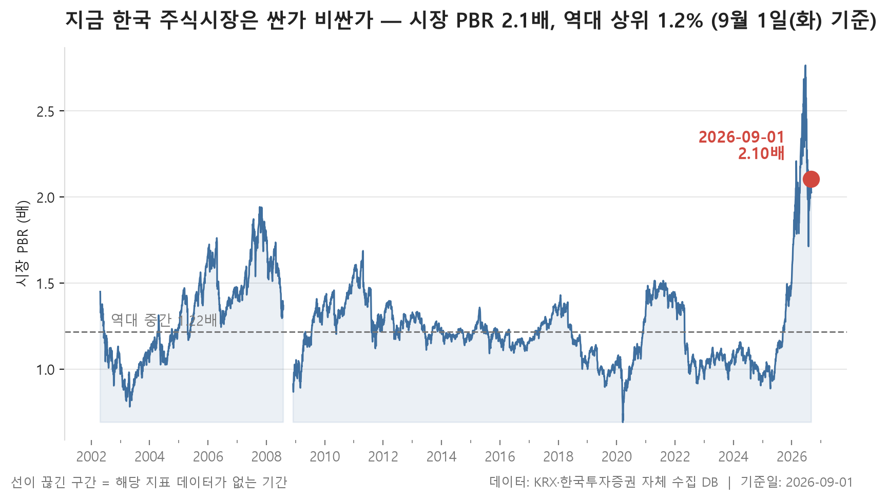
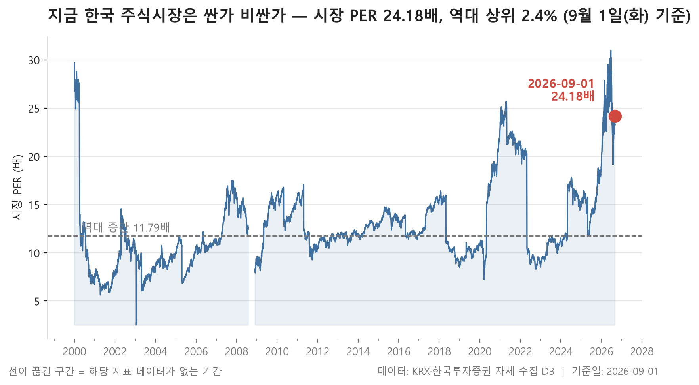
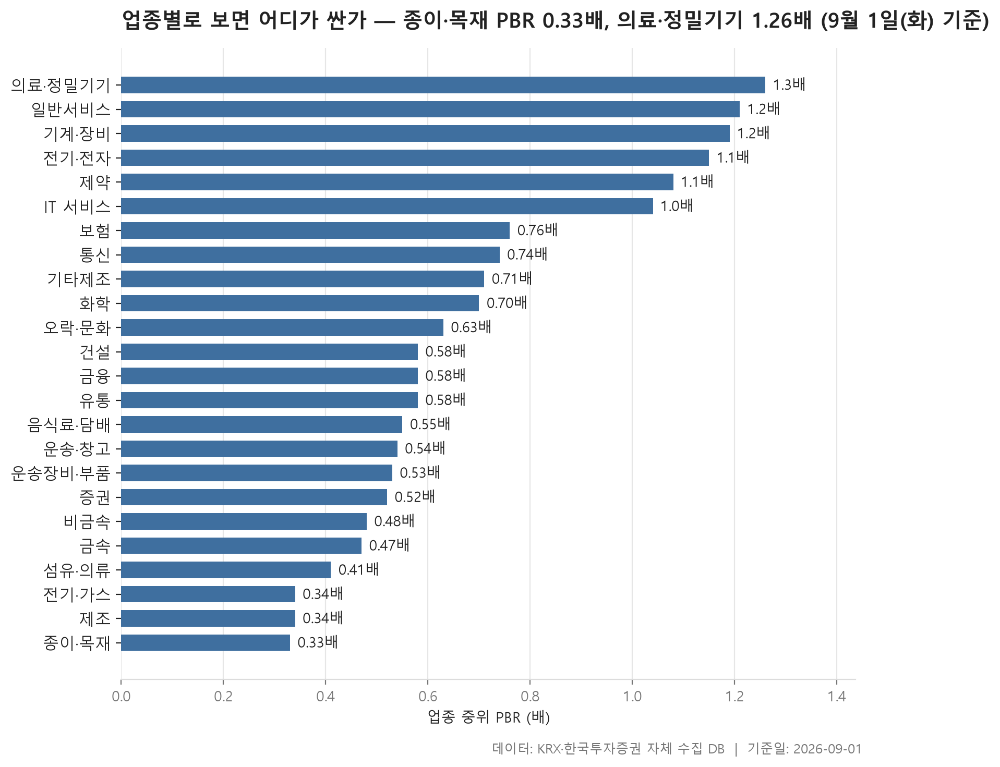
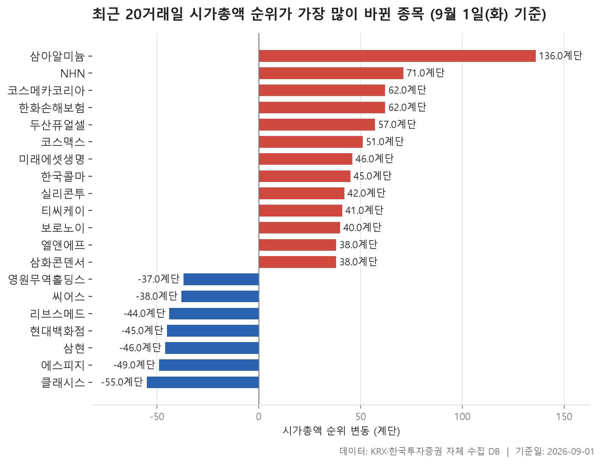

오늘은 개별 종목의 하루 등락 대신, 조금 더 긴 자를 꺼내 봅니다. 2002년 4월 23일부터 쌓아 온 5,922거래일치 기록과 지금을 나란히 놓으면, 2026년 9월 1일의 시장이 과거 어디쯤에 서 있는지가 한 줄로 정리됩니다. 결론부터 말하면 꽤 위쪽입니다.

글은 세 부분으로 나뉩니다. 먼저 시장 전체의 이익 대비 가격과 순자산 대비 가격이 역대 분포에서 어느 자리에 있는지 확인하고, 다음으로 그 수준을 만들어 내는 24개 업종의 속을 들여다봅니다. 마지막으로 8월 3일부터 9월 1일까지 한 달 동안 시가총액 300위권 안에서 자리를 크게 옮긴 종목 20개를 봅니다.

미리 한 가지 일러둘 것이 있습니다. 집계에 잡히는 종목 수가 관측 초기 약 800개에서 지금은 2,385개까지 늘었습니다. 20년 전과 오늘을 같은 저울에 올리는 일이 완전히 깔끔할 수는 없다는 뜻입니다. 백분위는 그런 한계를 안고 보는 참고선이지, 정답표가 아닙니다.

> 기준일: 2026-09-01 · 집계: 자체 수집 데이터베이스

## 시장 밸류에이션 백분위 2개 — 최고 시장 PBR 98.80%

두 지표가 가리키는 방향은 같지만 강도는 다릅니다. 이익 기준으로 본 시장 가격은 24.18배로, 역대 기록 가운데 97.60%가 지금보다 낮았던 자리입니다. 순자산 기준으로 본 값은 2.10배이고 백분위는 98.80으로 더 위쪽입니다. 역대 한가운데 값이 각각 11.97배와 1.22배였다는 점을 함께 놓고 보면, 지금 시장은 이익으로 재도 자산으로 재도 과거 대부분의 날들보다 비싼 가격을 받고 있습니다.

눈여겨볼 대목은 상위 1% 선과의 거리입니다. 이익 기준 지표의 상위 1% 경계는 25.92배인데 현재값은 24.18배로 그 아래에 있습니다. 반면 순자산 기준 지표는 상위 1% 경계가 2.19배, 현재값이 2.10배로 역시 아래이긴 하나 둘의 간격이 훨씬 좁습니다. 백분위가 98.80까지 올라간 것도 이 좁은 간격과 맞물립니다. 자산 대비 가격 쪽이 더 극단에 붙어 있다고 읽는 편이 자연스럽습니다.

반대편 끝도 함께 보면 분포의 모양이 잡힙니다. 하위 1% 선은 이익 기준 7.07배, 순자산 기준 0.87배입니다. 지난 20여 년 동안 이 시장은 순자산의 0.87배에서 2.19배 사이를 오갔고, 그 절반쯤 되는 지점이 1.22배였던 셈입니다. 지금은 그 위쪽 끝 근처에 있습니다.

다만 이 표는 '높다'까지만 말해 줍니다. 왜 높아졌는지, 얼마나 더 갈 수 있는지는 여기에 들어 있지 않습니다. 백분위가 높다는 사실과 앞으로의 방향은 별개의 이야기이고, 이 자료로는 뒤쪽을 알 수 없습니다.

| 지표 | 현재값 | 백분위(%) | 하위1% | 역대중간 | 상위1% | 단위 |
|---|---|---|---|---|---|---|
| 시장 PER | 24.18 | 97.60 | 7.07 | 11.97 | 25.92 | 배 |
| 시장 PBR | 2.10 | 98.80 | 0.87 | 1.22 | 2.19 | 배 |

## 업종별 밸류에이션 — 가장 싼 종이·목재 0.33배, 가장 비싼 의료·정밀기기 1.26배

업종별로 흩어 놓으면 전혀 다른 그림이 나옵니다. 24개 업종의 중위 순자산 대비 주가를 낮은 순으로 세웠을 때 한가운데 값은 0.58배입니다. 시장 전체 값이 2.10배인데 업종 중간이 0.58배라는 건, 표에 실린 업종 대다수가 순자산에 못 미치는 가격에 거래되는 종목들로 채워져 있다는 뜻입니다. 가장 낮은 종이·목재가 0.33배, 가장 높은 의료·정밀기기가 1.26배로, 위아래 폭 자체도 그리 넓지 않습니다.

이 괴리를 설명하는 열쇠는 비중 칸에 있습니다. 전기·전자 한 업종이 표에 실린 전체 시가총액의 57.28%를 차지합니다. 나머지 23개 업종이 남은 몫을 나눠 갖는 구조인데, 그다음으로 큰 금융이 10.19%, 운송장비·부품이 6.38%입니다. 앞 섹션의 시장 지표는 규모로 가중한 값이니, 결국 절반이 넘는 무게를 지닌 한 업종의 수준이 시장 전체 숫자를 끌고 간다고 봐야 합니다. 그런데 그 전기·전자의 중위값은 1.15배입니다. 업종 중에서는 위쪽이지만 시장 전체의 2.10배와 견주면 낮습니다. 업종 안에서도 큰 종목과 작은 종목의 격차가 상당하다는 신호로 읽힙니다.

어긋나 보이는 조합도 몇 군데 있습니다. 종이·목재는 순자산 대비로는 가장 싼 자리인데 흑자 종목만 모아 계산한 이익 대비 값은 15.21배로 표 안에서 높은 축입니다. 27개 종목 중 흑자가 11개뿐이라는 점과 무관하지 않아 보입니다. 반대로 전기·가스는 0.34배에 4.89배로 두 잣대 모두 표에서 가장 낮은 쪽에 자리합니다. 제조 역시 0.34배로 낮지만 7개 중 흑자가 3개라 표본이 얇습니다.

덩치가 큰 업종들끼리도 성격이 갈립니다. 금융은 104개 종목 중 89개가 흑자인데 중위값은 0.58배로 표의 한가운데에 머뭅니다. 보험은 10개 전부 흑자, 통신도 11개 전부 흑자입니다. 반면 화학은 208개 중 151개, 제약은 152개 중 86개로 흑자 비율이 제각각입니다. 업종마다 회계와 사업 구조가 다르니 이 숫자들을 같은 잣대로 줄 세우는 건 무리입니다. 낮다고 싸다는 뜻도, 높다고 비싸다는 뜻도 아닙니다.

| 업종 | 종목수(개) | 중위PBR(배) | 중위PER(배) | 흑자종목수(개) | 시총비중(%) |
|---|---|---|---|---|---|
| 종이·목재 | 27 | 0.33 | 15.21 | 11 | 0.05 |
| 전기·가스 | 10 | 0.34 | 4.89 | 9 | 0.47 |
| 제조 | 7 | 0.34 | 8.99 | 3 | 0.01 |
| 섬유·의류 | 48 | 0.41 | 7.44 | 28 | 0.14 |
| 금속 | 114 | 0.47 | 13.50 | 67 | 1.67 |
| 비금속 | 34 | 0.48 | 17.20 | 18 | 0.17 |
| 증권 | 17 | 0.52 | 9.18 | 17 | 0.93 |
| 운송장비·부품 | 127 | 0.53 | 7.63 | 95 | 6.38 |
| 운송·창고 | 28 | 0.54 | 6.29 | 20 | 0.98 |
| 음식료·담배 | 81 | 0.55 | 9.02 | 55 | 0.92 |
| 건설 | 48 | 0.58 | 8.11 | 38 | 0.69 |
| 금융 | 104 | 0.58 | 8.75 | 89 | 10.19 |
| 유통 | 146 | 0.58 | 12.48 | 92 | 2.19 |
| 오락·문화 | 63 | 0.63 | 12.63 | 31 | 0.38 |
| 화학 | 208 | 0.70 | 13.13 | 151 | 3.34 |
| 기타제조 | 11 | 0.71 | 6.85 | 4 | 0.02 |
| 통신 | 11 | 0.74 | 12.60 | 11 | 0.72 |
| 보험 | 10 | 0.76 | 8.45 | 10 | 2.13 |
| IT 서비스 | 229 | 1.04 | 13.39 | 137 | 2.46 |
| 제약 | 152 | 1.08 | 15.82 | 86 | 3.37 |
| 전기·전자 | 350 | 1.15 | 15.94 | 206 | 57.28 |
| 기계·장비 | 201 | 1.19 | 15.72 | 118 | 3.24 |
| 일반서비스 | 152 | 1.21 | 11.88 | 82 | 1.89 |
| 의료·정밀기기 | 95 | 1.26 | 21.44 | 57 | 0.39 |

## 시총 순위 변동 20개 — 최고 삼아알미늄 136계단

한 달 사이 300위권에서 자리를 크게 옮긴 20개를 모았더니 올라간 쪽이 13개, 내려간 쪽이 7개였습니다. 변동 폭의 한가운데 값은 40.50계단입니다. 올라간 쪽의 이동 폭이 대체로 더 컸다는 점부터 눈에 들어옵니다. 가장 크게 오른 삼아알미늄이 136계단인데, 가장 크게 내린 클래시스는 -55계단입니다. 위로 튄 사례가 아래로 밀린 사례보다 진폭이 넓습니다.

시가총액 증감률을 함께 보면 왜 그런지 짐작이 갑니다. 순위가 오른 종목들의 증감률은 41.51%에서 103.74%까지 걸쳐 있는 반면, 내려간 종목들은 -12.15%에서 -23.43% 사이에 모여 있습니다. 한쪽은 배 가까이 불어난 사례가 있고 다른 쪽은 최대 낙폭이 20%대 초반입니다. 순위표에서 위로 올라가려면 아래로 밀리는 것보다 훨씬 큰 폭의 변화가 필요하다는 이야기이기도 합니다.

순위와 규모가 따로 노는 대목도 있습니다. 삼아알미늄은 이동 폭이 가장 컸지만 시가총액은 10,723억원으로 표 안에서 작은 축이고, 순위도 286위입니다. 반대로 표에서 시가총액이 가장 큰 엘앤에프는 53,378억원인데 이동 폭은 38계단입니다. 등락률로는 80.47%로 상당한데도 계단 수가 크지 않은 건, 위로 갈수록 순위 사이의 간격이 두터워지기 때문일 겁니다. 300위 근처에서는 조금만 움직여도 순위가 크게 흔들리고, 100위권에서는 시가총액이 크게 변해도 몇십 계단에 그칩니다.

업종 구성은 11개로 흩어져 있고 전기·전자가 4개로 가장 많습니다. 다만 그 4개가 한 방향은 아닙니다. 두산퓨얼셀·엘앤에프·삼화콘덴서는 올라갔고 에스피지는 -49계단으로 내려갔습니다. 의료·정밀기기 쪽은 표에 실린 세 종목이 모두 내림 방향이라는 점이 조금 눈에 띕니다. 화학은 코스메카코리아·코스맥스·한국콜마 셋이 모두 오름 방향이고요. 시장별로는 KOSPI 11개, KOSDAQ 9개로 얼추 반씩입니다. 왜 이런 묶임이 생겼는지는 이 표만으로 알 수 없습니다. 한 달치 순위 이동을 기록한 자료일 뿐, 그 뒤의 사정은 담겨 있지 않습니다.

| 종목명 | 종목코드 | 시장 | 업종 | 현재순위(위) | 과거순위(위) | 순위변동(계단) | 시총증감률(%) | 시가총액(억원) |
|---|---|---|---|---|---|---|---|---|
| 삼아알미늄 | 006110 | KOSPI | 금속 | 286 | 422 | 136 | 103.74 | 10,723 |
| NHN | 181710 | KOSPI | IT 서비스 | 191 | 262 | 71 | 89.50 | 23,058 |
| 코스메카코리아 | 241710 | KOSDAQ | 화학 | 244 | 306 | 62 | 77.83 | 15,080 |
| 한화손해보험 | 000370 | KOSPI | 보험 | 293 | 355 | 62 | 58.47 | 10,378 |
| 두산퓨얼셀 | 336260 | KOSPI | 전기·전자 | 159 | 216 | 57 | 70.90 | 29,046 |
| 클래시스 | 214150 | KOSDAQ | 의료·정밀기기 | 203 | 148 | -55 | -22.80 | 21,430 |
| 코스맥스 | 192820 | KOSPI | 화학 | 143 | 194 | 51 | 54.72 | 32,573 |
| 에스피지 | 058610 | KOSDAQ | 전기·전자 | 214 | 165 | -49 | -16.93 | 20,026 |
| 미래에셋생명 | 085620 | KOSPI | 보험 | 153 | 199 | 46 | 49.37 | 30,348 |
| 삼현 | 437730 | KOSDAQ | 운송장비·부품 | 300 | 254 | -46 | -23.43 | 9,845 |
| 한국콜마 | 161890 | KOSPI | 화학 | 132 | 177 | 45 | 60.12 | 36,588 |
| 현대백화점 | 069960 | KOSPI | 유통 | 206 | 161 | -45 | -15.69 | 21,090 |
| 리브스메드 | 491000 | KOSDAQ | 의료·정밀기기 | 324 | 280 | -44 | -19.44 | 8,423 |
| 실리콘투 | 257720 | KOSDAQ | 유통 | 137 | 179 | 42 | 50.43 | 34,034 |
| 티씨케이 | 064760 | KOSDAQ | 비금속 | 167 | 208 | 41 | 41.51 | 26,942 |
| 보로노이 | 310210 | KOSDAQ | 일반서비스 | 150 | 190 | 40 | 44.10 | 30,749 |
| 엘앤에프 | 066970 | KOSPI | 전기·전자 | 103 | 141 | 38 | 80.47 | 53,378 |
| 삼화콘덴서 | 001820 | KOSPI | 전기·전자 | 283 | 321 | 38 | 51.00 | 11,694 |
| 씨어스 | 458870 | KOSDAQ | 의료·정밀기기 | 334 | 296 | -38 | -12.93 | 8,053 |
| 영원무역홀딩스 | 009970 | KOSPI | 금융 | 201 | 164 | -37 | -12.15 | 21,633 |

## 정리

정리하면 이렇습니다. 규모로 가중한 시장 지표는 20여 년 기록의 위쪽 끝에 붙어 있는데, 업종을 하나씩 펼쳐 보면 중간값이 0.58배로 순자산 아래에 놓인 곳이 훨씬 많습니다. 그 간극의 상당 부분은 표 전체 시가총액의 57.28%를 차지하는 한 업종이 만들고 있습니다. 시장이 비싸다는 말과 대부분의 종목이 비싸다는 말은 같지 않다는 것이 오늘 표의 요점입니다.

한계는 분명합니다. 집계 종목 수가 800개 남짓에서 2,385개로 늘어난 만큼 과거와 현재를 같은 선상에 놓기 어렵고, 업종별 지표는 서로 비교할 수 있는 성격의 숫자가 아닙니다. 순위 변동 표도 한 달 사이 자리가 얼마나 바뀌었는지를 기록했을 뿐, 그 이유는 담고 있지 않습니다. 여기 적힌 것은 어디까지나 데이터의 모양이며, 투자 판단의 근거로 삼기에는 부족합니다.

## 집계 기준

**시장 밸류에이션 백분위**

- **기준**: 시가총액 가중 — 시장 PER = Σ시가총액 / Σ(시가총액÷PER)
- **관측구간**: 2002-04-23 ~ 2026-09-03 (5,922거래일)
- **모집단**: KOSPI·KOSDAQ 보통주
- **백분위해석**: 백분위 30 = 역대 기록 중 30% 만이 현재보다 낮았다는 뜻
- **표본제외**: 집계 종목이 100개 미만인 0일은 모집단에서 제외 (전체 5,922일 중)
- **범위표시**: 절대 최소·최대는 하루치 오류 데이터에 흔들리므로 1~99 분위로 표시
- **표본변화**: 집계 종목 수는 관측 초기 약 800개에서 현재 2,385개로 늘어났습니다. 시점 간 비교 시 참고가 필요합니다.

**업종별 밸류에이션**

- **기준**: 2026-09-01 종가와 같은 날 재무 지표
- **순위**: 업종 내 종목 PBR 의 중위값 (낮은 순)
- **중위PER**: 흑자 종목(PER > 0)만으로 계산합니다. 적자 종목은 PER 이 음수라 순위에 섞으면 가장 싼 업종이 뒤집힙니다
- **시총비중**: 표에 실린 업종 전체를 100 으로 본 비중
- **필터**: PBR 이 있는 보통주 5종목 이상인 업종
- **주의**: PBR·PER 은 업종마다 성격이 달라 서로 다른 업종을 같은 잣대로 비교하기 어렵습니다. 낮다고 싼 것도, 높다고 비싼 것도 아닙니다

**시총 순위 변동**

- **기준**: 2026-08-03 대비 2026-09-01 시가총액 순위 변동 (양수 = 순위 상승)
- **모집단**: 양쪽 날짜 중 한 번이라도 시총 300위 이내였던 보통주

## 데이터 출처 및 유의사항

- **데이터출처**: 한국거래소(KRX) 공시 데이터와 한국투자증권 OpenAPI 를 직접 수집해 구축한 자체 데이터베이스
- **집계방식**: 수집·집계·차트 생성을 직접 구현한 파이프라인에서 자동 산출
- **작성고지**: 본문의 표·통계·차트는 자체 데이터베이스에서 계산된 값이며, 문장 작성 과정에 AI 도구를 활용했습니다.
- **면책**: 본 글은 정보 제공을 목적으로 하며 특정 종목의 매수·매도를 추천하지 않습니다. 제시된 수치는 과거 데이터이고 미래 수익을 보장하지 않습니다. 투자 판단과 그 결과에 대한 책임은 투자자 본인에게 있습니다.

