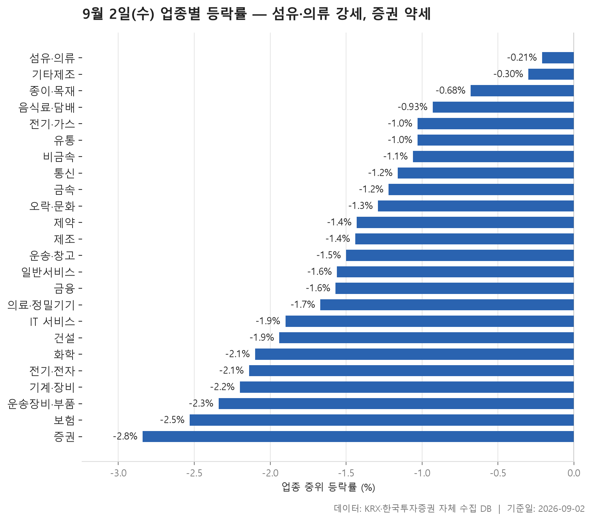
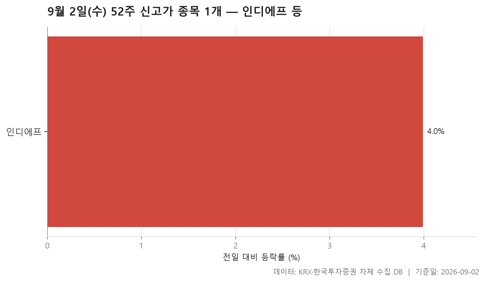
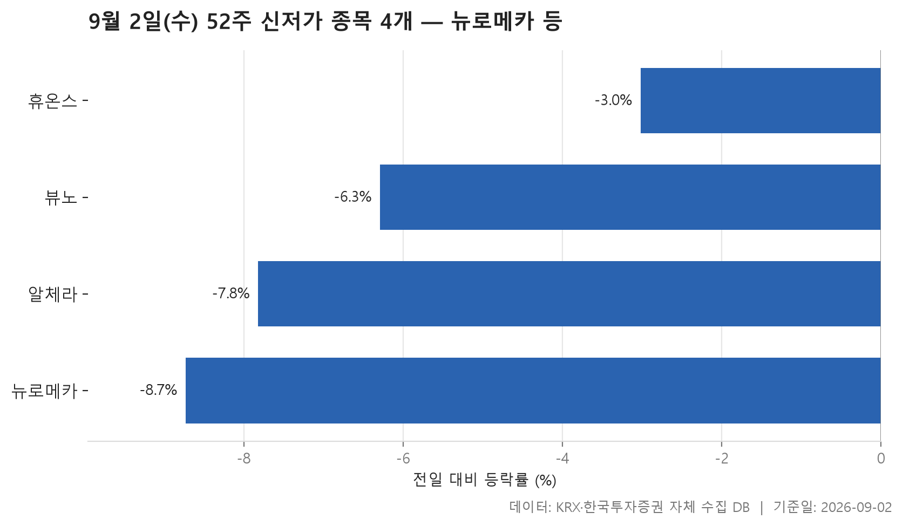
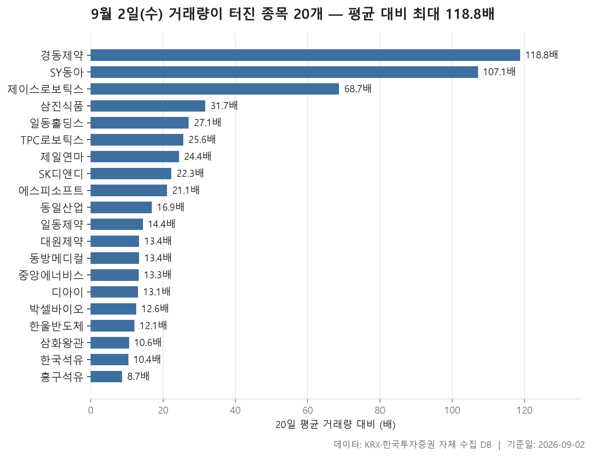

9월 2일 수요일 장을 데이터로 훑어봤습니다. 오늘 표를 한 장씩 넘기기 전에 먼저 눈에 들어오는 것은 색깔이 거의 한쪽으로 쏠려 있다는 점입니다. 24개 업종을 중위 등락률 순으로 줄 세웠는데, 맨 위에 놓인 섬유·의류조차 -0.21%였습니다. 다시 말해 오늘은 플러스로 마감한 업종이 하나도 없었다는 뜻입니다.

가장 강한 업종이 마이너스인 날은 순위표의 의미가 조금 달라집니다. 어디가 올랐는지를 보는 표가 아니라, 어디가 덜 밀렸는지를 보는 표가 되는 것이죠. 그래서 오늘은 상위권보다 하위권 쪽, 특히 가장 약했던 증권 근처에서 읽을 거리가 더 많습니다.

이어서 52주 신고가와 신저가, 그리고 거래량이 평소의 몇 배로 튄 종목들을 차례로 봅니다. 신고가 목록이 단 한 종목으로 줄어든 것도, 거래량 급증 목록에는 오히려 하락 종목이 섞여 있는 것도 오늘 시장의 성격을 보여 주는 대목입니다.

> 기준일: 2026-09-02 · 집계: 자체 수집 데이터베이스

## 업종 등락률

먼저 전체 모양입니다. 24개 업종의 중위 등락률을 늘어놓았을 때 한가운데 놓인 값이 -1.47%였습니다. 위쪽 끝인 섬유·의류가 -0.21%, 아래쪽 끝인 증권이 -2.84%이니 전체가 그리 넓지 않은 폭 안에 갇혀 있었던 셈입니다. 특정 업종만 무너진 날이 아니라 전반적으로 한 뼘씩 눌린 날에 가깝습니다.

그런데 중위값과 평균이 크게 어긋나는 업종이 몇 군데 있습니다. 비금속은 업종 안 종목의 한가운데 값이 -1.06%인데 평균은 0.77%로 플러스입니다. 이 업종을 대표하는 움직임이었던 동양파일이 29.93% 올랐고, 이 한 종목이 업종 평균을 0.83%p 끌어올린 것으로 계산돼 있습니다. 격차의 상당 부분을 종목 하나가 만든 구조라는 이야기죠. 기타제조도 비슷합니다. 한가운데 값은 -0.30%인데 평균은 0.44%, 제이에스티나 한 종목의 몫이 1.25%p입니다. 운송·창고 역시 중위 -1.50%와 평균 -0.35% 사이의 거리를 STX그린로지스 한 종목이 1.07%p로 메우고 있습니다. 평균만 보고 '그 업종은 괜찮았다'고 읽으면 안 되는 전형적인 사례들입니다.

반대 방향도 있습니다. 일반서비스는 중위 -1.56%보다 평균 -2.25%가 더 낮고, 화학도 중위 -2.10%에 평균 -2.57%입니다. 두 업종 모두 오른 종목이 열에 하나 남짓에 그쳤습니다. 특히 화학은 오른 종목 비중이 10.50%로 표에서 가장 낮은 축이었고, 가장 크게 움직인 케이엠제약이 하한가인 -30.00%인데도 그 한 종목이 평균에 미친 몫은 -0.14%p에 불과합니다. 219개나 되는 종목이 담긴 업종이라 하나의 영향이 희석된 것이고, 평균이 중위값보다 낮은 것은 여러 종목이 함께 밀렸다는 뜻으로 읽는 편이 맞습니다.

맨 아래 증권은 성격이 또 다릅니다. 17개 종목 중 오른 종목이 하나도 없었고, 중위값과 평균이 -2.84%로 정확히 같습니다. 가장 크게 움직인 미래에셋증권도 -5.44%로, 극단값 없이 업종 전체가 고르게 내려앉은 모습이죠. 보험도 오른 종목 비중이 9.10%로 낮아 금융 계열 전반이 비슷한 흐름이었습니다. 반면 종목 수가 369개로 가장 많은 전기·전자는 중위 -2.14%로 하위권이면서도 거래대금 합계가 116,203.50억원으로 압도적입니다. 알에프세미가 75.68%라는 큰 폭으로 올랐지만 업종 평균에 얹은 몫은 0.21%p, 규모가 큰 업종에서 개별 종목 한둘이 방향을 바꾸기는 어렵다는 것을 보여 줍니다.

| 업종 | 종목수(개) | 중위등락률(%) | 평균등락률(%) | 상승비율(%) | 주도종목 | 주도종목등락률(%) | 평균기여도(%p) | 거래대금합계(억원) |
|---|---|---|---|---|---|---|---|---|
| 섬유·의류 | 50 | -0.21 | 0.12 | 36.00 | 좋은사람들 | 29.94 | 0.60 | 1,149.70 |
| 기타제조 | 14 | -0.30 | 0.44 | 35.70 | 제이에스티나 | 17.53 | 1.25 | 126.40 |
| 종이·목재 | 26 | -0.68 | -0.50 | 26.90 | 페이퍼코리아 | 8.30 | 0.32 | 42.80 |
| 음식료·담배 | 82 | -0.93 | -1.10 | 22.00 | 체리부로 | -5.71 | -0.07 | 1,777.20 |
| 전기·가스 | 10 | -1.03 | -0.60 | 20.00 | SGC에너지 | 4.62 | 0.46 | 490.00 |
| 유통 | 154 | -1.03 | -1.30 | 23.40 | 신라에스지 | -26.74 | -0.17 | 5,505.50 |
| 비금속 | 36 | -1.06 | 0.77 | 36.10 | 동양파일 | 29.93 | 0.83 | 1,362.50 |
| 통신 | 12 | -1.16 | -1.02 | 16.70 | 아이즈비전 | 3.91 | 0.33 | 1,289.20 |
| 금속 | 130 | -1.22 | -1.43 | 16.90 | KBI메탈 | -11.85 | -0.09 | 4,622.10 |
| 오락·문화 | 65 | -1.29 | -1.69 | 27.70 | 골드앤에스 | -29.94 | -0.46 | 974.40 |
| 제약 | 168 | -1.43 | -1.41 | 18.50 | 경남제약 | 29.77 | 0.18 | 10,067.00 |
| 제조 | 7 | -1.44 | -0.40 | 28.60 | 이월드 | 5.56 | 0.79 | 11.60 |
| 운송·창고 | 28 | -1.50 | -0.35 | 17.90 | STX그린로지스 | 29.97 | 1.07 | 2,383.70 |
| 일반서비스 | 165 | -1.56 | -2.25 | 12.70 | 모아라이프플러스 | -30.00 | -0.18 | 11,494.80 |
| 금융 | 111 | -1.57 | -1.88 | 11.70 | OCI홀딩스 | -8.54 | -0.08 | 20,160.50 |
| 의료·정밀기기 | 99 | -1.67 | -1.87 | 14.10 | 마이크로디지탈 | -29.99 | -0.30 | 3,547.40 |
| IT 서비스 | 243 | -1.90 | -1.91 | 18.10 | 엠아이큐브솔루션 | 30.00 | 0.12 | 6,022.50 |
| 건설 | 50 | -1.94 | -1.50 | 20.00 | 베노티앤알 | -21.64 | -0.43 | 7,161.60 |
| 화학 | 219 | -2.10 | -2.57 | 10.50 | 케이엠제약 | -30.00 | -0.14 | 9,934.10 |
| 전기·전자 | 369 | -2.14 | -1.79 | 21.10 | 알에프세미 | 75.68 | 0.21 | 116,203.50 |
| 기계·장비 | 207 | -2.20 | -1.70 | 17.40 | 인베니아 | 20.29 | 0.10 | 13,336.80 |
| 운송장비·부품 | 132 | -2.34 | -2.17 | 14.40 | 태원물산 | 14.23 | 0.11 | 11,167.30 |
| 보험 | 11 | -2.53 | -2.74 | 9.10 | 미래에셋생명 | -8.91 | -0.81 | 2,438.00 |
| 증권 | 17 | -2.84 | -2.84 | 0.00 | 미래에셋증권 | -5.44 | -0.32 | 1,161.90 |

## 52주 신고가 1개 — 인디에프 3.99%

52주 최고가를 넘어선 보통주는 오늘 단 한 종목이었습니다. 인디에프, 종목코드 014990, KOSPI 상장이고 업종은 섬유·의류입니다. 종가 4,170원으로 직전 52주 최고가였던 4,010원을 넘었고 전일 대비 3.99% 올랐습니다.

숫자 자체보다 위치가 눈에 띕니다. 오늘 중위 등락률 기준으로 가장 덜 밀린 업종이 섬유·의류였는데, 유일한 신고가 종목도 그 업종에서 나왔습니다. 다만 이 업종 역시 오른 종목은 36.00%로 절반이 안 됩니다. 업종 전체가 좋았다기보다, 상대적으로 덜 눌린 자리에서 한 종목이 고점을 갱신했다고 보는 편이 사실에 가깝습니다.

규모는 크지 않습니다. 시가총액은 626억원, 거래대금은 262.90억원입니다. 시가총액에 견주면 거래대금 쪽이 작지 않은 편인데, 그 이유가 무엇인지는 이 표만으로는 알 수 없습니다. 신고가 목록이 한 종목으로 줄었다는 사실 자체가 오늘 장의 폭이 얼마나 좁았는지를 말해 줍니다.

| 종목명 | 종목코드 | 시장 | 업종 | 종가(원) | 등락률(%) | 이전52주최고(원) | 거래대금(억원) | 시가총액(억원) |
|---|---|---|---|---|---|---|---|---|
| 인디에프 | 014990 | KOSPI | 섬유·의류 | 4,170 | 3.99 | 4,010 | 262.90 | 626 |

## 52주 신저가 4개 — 최저 뉴로메카 -8.73%

반대쪽인 52주 최저가 이탈은 4종목입니다. 신고가가 1개, 신저가가 4개. 숫자만 놓고 보면 크게 벌어진 것은 아니지만, 두 목록의 등락률 분포는 확연히 다릅니다. 신저가 네 종목의 하락률을 늘어놓으면 한가운데 값이 -7.05%로, 최저가를 살짝 밑돌 정도가 아니라 그날 하루에 꽤 크게 밀린 종목들이 모여 있습니다.

네 종목 모두 KOSDAQ이고, 시가총액이 가장 큰 것은 뉴로메카로 3,795억원입니다. 이 종목이 하락폭도 가장 컸습니다. -8.73%로 마감했고 종가 16,210원은 직전 52주 최저가 17,380원보다 눈에 띄게 아래입니다. 반면 휴온스는 -3.02%로 상대적으로 완만했고, 종가 20,900원과 이전 최저가 21,050원의 거리도 좁습니다. 같은 신저가라도 최저선을 크게 벗어난 경우와 아슬아슬하게 걸친 경우가 섞여 있는 셈이죠.

업종은 셋으로 나뉘는데 IT 서비스가 2개로 가장 많습니다. 뷰노와 알체라인데, 둘 다 이 목록에서 시가총액이 작은 쪽에 속하고 거래대금도 각각 3.90억원, 7.80억원에 그칩니다. 거래가 크게 실리지 않은 상태에서 최저가를 갈아치웠다는 뜻입니다. 왜 이 네 종목이 오늘 하필 최저선을 밑돌았는지는 이 표에 담긴 정보가 아닙니다.

| 종목명 | 종목코드 | 시장 | 업종 | 종가(원) | 등락률(%) | 이전52주최저(원) | 거래대금(억원) | 시가총액(억원) |
|---|---|---|---|---|---|---|---|---|
| 뉴로메카 | 348340 | KOSDAQ | 기계·장비 | 16,210 | -8.73 | 17,380 | 65.60 | 3,795 |
| 휴온스 | 243070 | KOSDAQ | 제약 | 20,900 | -3.02 | 21,050 | 15.40 | 2,504 |
| 뷰노 | 338220 | KOSDAQ | IT 서비스 | 5,210 | -6.29 | 5,390 | 3.90 | 729 |
| 알체라 | 347860 | KOSDAQ | IT 서비스 | 1,226 | -7.82 | 1,250 | 7.80 | 517 |

## 거래량 급증 20개 — 최고 경동제약 118.80배

거래량이 직전 20거래일 평균의 5배를 넘긴 보통주는 20개입니다. 배수 분포가 꽤 극단적인데, 한가운데 값이 15.65배인 반면 맨 위 경동제약은 118.80배입니다. 상위 두 종목인 경동제약과 SY동아가 100배를 넘고, 그다음 제이스로보틱스가 68.70배로 뚝 떨어진 뒤로는 30배 안쪽에 대부분이 몰려 있습니다. 앞머리 두세 종목만 따로 노는 모양입니다.

흥미로운 것은 거래량이 폭증했다고 해서 주가가 함께 뛴 것은 아니라는 점입니다. 배수 상위인 경동제약과 SY동아는 각각 -0.39%, -0.40%로 사실상 제자리에서 마감했습니다. 100배가 넘는 거래량이 오갔는데 종가는 거의 움직이지 않은 것이죠. 한울반도체는 12.10배의 거래량을 동반하면서 -8.61%로 밀렸습니다. 거래량 급증은 방향이 아니라 관심의 크기를 알려 주는 지표라는 점을 오늘 표가 잘 보여 줍니다.

크게 오른 쪽을 보면 SK디앤디 15.62%, 디아이 14.82%, 에스피소프트 13.87%, 일동제약 13.72%, 흥구석유 13.32%, TPC로보틱스 11.30% 정도가 두 자릿수입니다. 이 가운데 흥구석유는 배수가 8.70배로 목록에서 가장 낮은데 거래대금은 1,047.70억원으로 가장 큽니다. 평소에도 거래가 활발했던 종목이 오늘 더 붐볐다는 뜻이지, 갑자기 발견된 종목은 아니라는 이야기입니다. 반대로 제일연마는 24.40배라는 높은 배수에도 거래대금은 3.70억원에 그칩니다. 평소 거래가 워낙 적었던 탓에 조금만 늘어도 배수가 크게 튀는 경우죠. 배수와 거래대금은 같은 것을 재는 잣대가 아닙니다.

시장은 KOSPI 9개, KOSDAQ 11개로 갈렸고 업종은 11개로 흩어져 있습니다. 그중 제약이 4개로 가장 많은데, 정작 제약 업종의 중위 등락률은 -1.43%로 중간 언저리였습니다. 시가총액이 가장 큰 종목은 디아이로 8,660억원인데, 이 목록에서는 독보적인 규모입니다. 나머지는 대체로 수백억원대 종목들이어서, 오늘 거래가 몰린 자리가 주로 중소형 쪽이었음을 알 수 있습니다.

| 종목명 | 종목코드 | 시장 | 업종 | 종가(원) | 등락률(%) | 거래량(주) | 평균거래량(주) | 배수(배) | 거래대금(억원) | 시가총액(억원) |
|---|---|---|---|---|---|---|---|---|---|---|
| 경동제약 | 011040 | KOSDAQ | 제약 | 5,060 | -0.39 | 2,771,174 | 23,326 | 118.80 | 152.20 | 1,557 |
| SY동아 | 041930 | KOSDAQ | 화학 | 4,940 | -0.40 | 2,704,544 | 25,245 | 107.10 | 151.10 | 751 |
| 제이스로보틱스 | 090470 | KOSDAQ | 기계·장비 | 4,950 | 7.38 | 1,634,525 | 23,779 | 68.70 | 91.90 | 865 |
| 삼진식품 | 0013V0 | KOSDAQ | 음식료·담배 | 5,070 | 1.71 | 722,963 | 22,827 | 31.70 | 40.10 | 503 |
| 일동홀딩스 | 000230 | KOSPI | 제약 | 6,550 | 0.77 | 524,752 | 19,396 | 27.10 | 37.40 | 756 |
| TPC로보틱스 | 048770 | KOSDAQ | 기계·장비 | 3,200 | 11.30 | 2,731,810 | 106,697 | 25.60 | 92.00 | 502 |
| 제일연마 | 001560 | KOSPI | 비금속 | 9,080 | -0.98 | 40,591 | 1,664 | 24.40 | 3.70 | 690 |
| SK디앤디 | 210980 | KOSPI | 부동산 | 4,220 | 15.62 | 6,242,339 | 279,303 | 22.30 | 274.90 | 786 |
| 에스피소프트 | 443670 | KOSDAQ | IT 서비스 | 4,350 | 13.87 | 15,624,403 | 741,633 | 21.10 | 696.50 | 1,044 |
| 동일산업 | 004890 | KOSPI | 금속 | 36,050 | -2.04 | 13,244 | 784 | 16.90 | 4.80 | 874 |
| 일동제약 | 249420 | KOSPI | 제약 | 16,490 | 13.72 | 3,844,701 | 267,416 | 14.40 | 656.70 | 5,217 |
| 대원제약 | 003220 | KOSPI | 제약 | 8,100 | 1.63 | 371,679 | 27,638 | 13.40 | 31.20 | 1,817 |
| 동방메디컬 | 240550 | KOSDAQ | 의료·정밀기기 | 5,940 | 0.51 | 927,764 | 69,065 | 13.40 | 58.90 | 1,243 |
| 중앙에너비스 | 000440 | KOSDAQ | 유통 | 12,050 | 3.08 | 295,673 | 22,243 | 13.30 | 37.20 | 750 |
| 디아이 | 003160 | KOSPI | 의료·정밀기기 | 30,600 | 14.82 | 2,942,808 | 224,423 | 13.10 | 890.40 | 8,660 |
| 박셀바이오 | 323990 | KOSDAQ | 일반서비스 | 5,020 | -0.99 | 1,319,503 | 104,515 | 12.60 | 71.90 | 1,168 |
| 한울반도체 | 320000 | KOSDAQ | 기계·장비 | 10,510 | -8.61 | 2,344,745 | 194,005 | 12.10 | 265.30 | 727 |
| 삼화왕관 | 004450 | KOSPI | 금속 | 26,950 | 0.75 | 19,406 | 1,829 | 10.60 | 5.10 | 581 |
| 한국석유 | 004090 | KOSPI | 비금속 | 11,250 | 0.36 | 931,081 | 89,703 | 10.40 | 108.50 | 1,428 |
| 흥구석유 | 024060 | KOSDAQ | 유통 | 11,570 | 13.32 | 9,080,913 | 1,041,620 | 8.70 | 1,047.70 | 1,736 |

## 정리

정리하면 9월 2일은 24개 업종 전부가 마이너스로 끝난 날이었고, 가장 덜 밀린 섬유·의류조차 -0.21%였습니다. 이런 날에는 상한가 한두 종목이 업종 평균을 플러스로 돌려놓는 착시가 생기기 쉬운데, 비금속과 기타제조, 운송·창고에서 그 모습이 뚜렷했습니다. 반대로 증권은 17개 종목 중 오른 것이 없이 중위값과 평균이 같은 값으로 맞아떨어졌죠. 52주 최고가를 넘은 종목은 하나뿐이었고 최저가를 밑돈 종목은 넷, 거래량이 크게 튄 20종목 중에서도 상당수는 주가가 거의 움직이지 않거나 오히려 내렸습니다.

다만 이 글에서 다룬 것은 하루치 가격과 거래량 집계뿐입니다. 어떤 종목이 왜 올랐고 왜 내렸는지, 거래량이 왜 그렇게 늘었는지에 대한 답은 이 표 안에 없습니다. 업종 분류나 필터 기준(보통주 5종목 이상, 시가총액 500억 이상, 거래대금 3억 이상 등)에 따라 순위와 목록은 달라질 수 있고, 하루의 숫자를 추세로 읽는 것도 무리입니다. 판단은 각자의 몫으로 남겨 둡니다.

## 집계 기준

**업종 등락률**

- **기준**: 2026-09-01 종가 → 2026-09-02 종가
- **순위**: 업종 내 종목 등락률의 중위값 (평균은 참고용으로 함께 표시)
- **주도종목**: 그 업종에서 등락률 절대값이 가장 큰 종목 (동점이면 거래대금이 큰 쪽)
- **평균기여도**: 그 종목 하나가 업종 평균을 움직인 폭 (등락률 ÷ 종목수). 중위값과 평균의 격차가 이 값에 가까우면 평균을 만든 것이 그 종목이고, 훨씬 크면 다른 종목들도 함께 움직인 것입니다
- **필터**: 업종 내 보통주 5종목 이상
- **전체업종중위등락률(%)**: -1.47

**52주 신고가**

- **기준**: 종가 > 직전 52주 최고가
- **관측구간**: 2025-08-20 ~ 2026-09-01 (252거래일)
- **필터**: 시가총액 500억 이상, 거래대금 3억 이상, 보통주

**52주 신저가**

- **기준**: 종가 < 직전 52주 최저가
- **관측구간**: 2025-08-20 ~ 2026-09-01 (252거래일)
- **필터**: 시가총액 500억 이상, 거래대금 3억 이상, 보통주

**거래량 급증**

- **기준**: 당일 거래량 ≥ 직전 20거래일 평균 × 5
- **관측구간**: 2026-08-04 ~ 2026-09-01 (20거래일)
- **필터**: 시가총액 500억 이상, 거래대금 3억 이상, 보통주

## 데이터 출처 및 유의사항

- **데이터출처**: 한국거래소(KRX) 공시 데이터와 한국투자증권 OpenAPI 를 직접 수집해 구축한 자체 데이터베이스
- **집계방식**: 수집·집계·차트 생성을 직접 구현한 파이프라인에서 자동 산출
- **작성고지**: 본문의 표·통계·차트는 자체 데이터베이스에서 계산된 값이며, 문장 작성 과정에 AI 도구를 활용했습니다.
- **면책**: 본 글은 정보 제공을 목적으로 하며 특정 종목의 매수·매도를 추천하지 않습니다. 제시된 수치는 과거 데이터이고 미래 수익을 보장하지 않습니다. 투자 판단과 그 결과에 대한 책임은 투자자 본인에게 있습니다.

