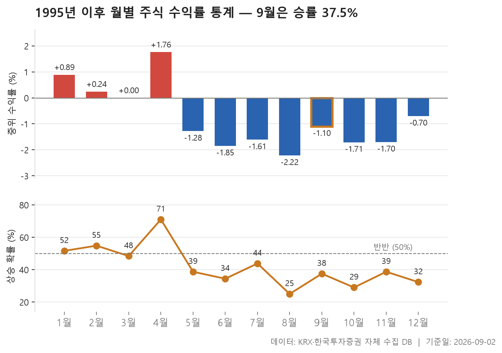
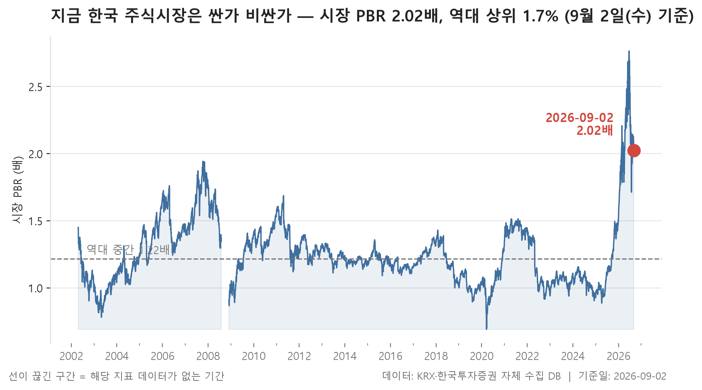
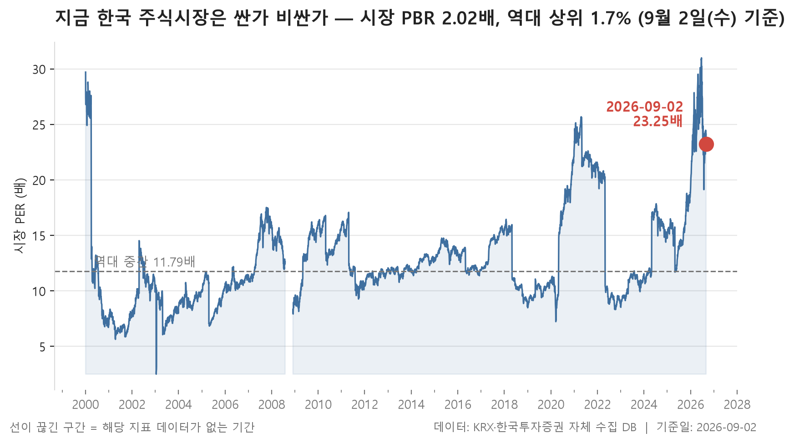

9월의 첫 거래주가 시작됐습니다. 오늘은 개별 종목의 등락을 훑는 대신, 조금 물러서서 두 장의 표를 놓고 봅니다. 하나는 1995년 6월부터 2026년 9월까지 376개월의 월별 기록이고, 다른 하나는 2002년 4월 23일 이후 5,921거래일 동안의 시장 전체 밸류에이션 위치입니다. 둘 다 오늘 하루가 어땠는지를 말해주는 자료가 아니라, 오늘이 긴 기록 어디쯤에 놓여 있는지를 말해주는 자료입니다.

먼저 결론에 해당하는 두 문장만 미리 적어두겠습니다. 31년 남짓한 기록에서 9월은 오른 해가 12번, 승률로는 37.5%인 달입니다. 그리고 2026년 9월 2일 기준으로 시장 전체의 주가순자산비율은 역대 상위 1.7% 수준에 놓여 있습니다. 계절성은 시원치 않은 자리, 가격 수준은 상당히 높은 자리 — 그 두 가지가 겹쳐 있는 지점에서 이번 달이 시작됩니다.

다만 미리 밝혀둘 것이 있습니다. 아래 표들은 과거 기록의 분포일 뿐이고, 특정 달이 되면 무슨 일이 벌어진다는 예언이 아닙니다. 뒤에서 다시 말하겠지만 집계 방식 자체에 알아둬야 할 한계도 몇 가지 있습니다.

> 기준일: 2026-09-02 · 집계: 자체 수집 데이터베이스

## 월별 계절성 12개 — 최고 4월 1.76%

표를 위에서 아래로 훑으면 모양이 꽤 뚜렷합니다. 1월부터 4월까지는 한가운데 놓인 종목의 수익률이 0 위나 0 근처에 머물다가, 5월을 넘어서면서 줄줄이 마이너스로 내려갑니다. 12개 달 가운데 중위값이 양수인 달은 3개뿐이고 8개가 음수입니다. 열두 달의 중위값을 늘어놓았을 때 그 중간에 오는 값이 -1.19%라는 것도 같은 이야기입니다. 즉 이 표에서 '보통의 달'은 살짝 마이너스인 달입니다.

두 극단이 4월과 8월입니다. 4월은 중위값 1.76%에 오른 해가 22번, 열 번 중 일곱 번꼴로 플러스였습니다. 반대편의 8월은 중위값 -2.22%에 오른 해가 8번뿐이니 넷 중 하나 정도만 플러스로 끝난 셈이죠. 이번 달인 9월은 중위값 -1.10%, 오른 해 12번으로 37.5%. 하위권이지만 최하위는 아닌, 5월·11월과 비슷한 자리입니다.

**흥미로운 건 중위값과 평균이 어긋나는 대목**입니다. 9월은 한가운데 값이 -1.10%인데 평균은 -2.73%까지 내려갑니다. 크게 빠진 해가 평균을 아래로 끌어당겼다는 뜻이고, 실제로 이 달의 최저 기록은 -17.69%, 최고 기록은 12.96%로 위아래 폭이 넓습니다. 반대 방향으로 어긋난 달도 있습니다. 11월은 중위값이 -1.70%인데 평균은 -0.02%로 거의 0에 붙어 있고, 7월도 중위 -1.61%에 평균 -0.48%입니다. 절반 이상의 종목은 내렸지만 오른 쪽의 폭이 컸던 해들이 섞여 있었다고 읽는 게 자연스럽습니다. 1월도 마찬가지로 중위 0.89%에 평균 1.97%, 최고 기록은 31.15%까지 올라갑니다.

그래서 이 표는 '9월은 나쁜 달'이라고 단정하는 데 쓰기보다, 승률과 폭을 따로 보는 데 쓰는 편이 낫습니다. 승률이 낮은 달과 평균이 크게 깎인 달이 반드시 같은 달은 아니거든요. 한 가지 더 짚어둘 것은 생존편향입니다. 상장폐지된 종목은 지금의 종목 목록에 남아 있지 않아 집계에서 빠지므로, 과거 수익률은 실제보다 높게 나올 여지가 있습니다. 표에 적힌 마이너스들이 오히려 후하게 계산된 값일 수 있다는 뜻이죠. 또 집계 대상 종목 수 자체가 관측 초기와 지금이 크게 다릅니다. 초기의 몇 해와 최근의 몇 해를 같은 무게로 놓고 보는 데는 조심할 필요가 있습니다.

| 월 | 관측연수(년) | 중위수익률(%) | 평균수익률(%) | 상승한해(년) | 승률(%) | 최고 | 최저 |
|---|---|---|---|---|---|---|---|
| 1월 | 31 | 0.89 | 1.97 | 16 | 51.60 | 31.15 | -10.99 |
| 2월 | 31 | 0.24 | 0.23 | 17 | 54.80 | 11.82 | -9.63 |
| 3월 | 31 | 0.00 | -0.22 | 15 | 48.40 | 12.08 | -16.87 |
| 4월 | 31 | 1.76 | 2.00 | 22 | 71.00 | 19.57 | -20.30 |
| 5월 | 31 | -1.28 | -2.09 | 12 | 38.70 | 10.51 | -18.98 |
| 6월 | 32 | -1.85 | -2.77 | 11 | 34.40 | 9.00 | -17.76 |
| 7월 | 32 | -1.61 | -0.48 | 14 | 43.80 | 9.91 | -12.65 |
| 8월 | 32 | -2.22 | -2.04 | 8 | 25.00 | 8.39 | -10.90 |
| 9월 | 32 | -1.10 | -2.73 | 12 | 37.50 | 12.96 | -17.69 |
| 10월 | 31 | -1.71 | -3.28 | 9 | 29.00 | 14.85 | -31.63 |
| 11월 | 31 | -1.70 | -0.02 | 12 | 38.70 | 17.05 | -12.82 |
| 12월 | 31 | -0.70 | -2.16 | 10 | 32.30 | 16.67 | -25.49 |

## 시장 밸류에이션 백분위 2개 — 최고 시장 PBR 98.30%

두 번째 표는 오늘 시장이 과거와 비교해 어느 가격대에 있는지를 봅니다. 시가총액을 가중해 계산한 시장 주가수익비율이 23.25배로 역대 상위 3.4% 수준, 주가순자산비율은 2.02배로 역대 상위 1.7% 수준입니다. 5,921거래일 중 지금보다 높았던 날이 손에 꼽을 정도라는 이야기입니다.

**두 지표 중 더 눈에 걸리는 쪽은 순자산 기준입니다.** 이익 기준으로는 현재값 23.25배가 상위 1% 경계인 25.92배 아래에 있어 그 선까지 아직 여유가 남아 있는데, 순자산 기준은 현재 2.02배가 상위 1% 경계인 2.19배에 훨씬 가깝게 붙어 있습니다. 역대 중간값과 비교해도 그렇습니다. 순자산 기준의 중간값은 1.22배, 이익 기준의 중간값은 11.96배. 어느 쪽이든 지금은 중간값에서 한참 위로 올라온 자리입니다.

다만 이 표를 읽을 때도 조건이 붙습니다. 하나는 표본이 변했다는 점입니다. 집계 종목 수가 관측 초기 약 800개에서 지금은 2,385개로 늘었습니다. 20여 년 전의 한 줄과 오늘의 한 줄이 같은 구성의 시장을 재고 있지 않다는 뜻이죠. 다른 하나는 이익 기준 지표의 성질입니다. 분모가 되는 이익이 줄면 지표는 저절로 올라가므로, 높은 값이 곧 '주가가 비싸다'만을 가리키는 것은 아닙니다.

그리고 이 표는 방향을 말해주지 않습니다. 백분위가 높다는 것은 과거 기록 대부분이 현재보다 낮았다는 서술일 뿐이고, 여기서 앞으로 어떻게 될지는 이 자료로 알 수 없습니다. 앞 섹션의 계절성과 나란히 놓으면 '승률이 낮은 편인 달에 가격 수준은 높은 편'이라는 정도로 정리되는데, 두 표는 서로 다른 기간과 다른 기준으로 만든 것이라 곱해서 무언가를 도출할 성격은 아닙니다.

| 지표 | 현재값 | 백분위(%) | 하위1% | 역대중간 | 상위1% | 단위 |
|---|---|---|---|---|---|---|
| 시장 PER | 23.25 | 96.60 | 7.07 | 11.96 | 25.92 | 배 |
| 시장 PBR | 2.02 | 98.30 | 0.87 | 1.22 | 2.19 | 배 |

## 정리

오늘 두 표를 한 문장으로 묶으면 이렇습니다. 31년 기록에서 9월은 열 번 중 네 번이 안 되게 플러스로 끝난 달이고, 지금 시장의 가격 수준은 24년 남짓한 기록에서 위쪽 끝에 가까운 자리입니다. 그게 전부이고, 그 이상은 이 자료가 말해주지 않습니다.

한계는 본문에서 짚은 그대로입니다. 계절성 표는 상장폐지 종목이 빠진 탓에 과거가 실제보다 후하게 계산될 수 있고, 종목별 수정주가 반영이 달라 개별 수익률에 오차가 있을 수 있어 평균이 아니라 중위값을 씁니다. 밸류에이션 표는 집계 종목 수가 크게 늘어난 만큼 시점 간 비교에 주의가 필요하고, 극단값에 흔들리지 않도록 범위를 1~99 분위로만 표시했습니다. 두 표 모두 과거 분포를 보여줄 뿐, 이번 달의 결과를 미리 알려주는 자료가 아닙니다.

## 집계 기준

**월별 계절성**

- **기준**: 매월 말 거래일 종가 기준, 전 종목 개별 수익률의 중위값
- **관측구간**: 1995-06 ~ 2026-09 (유효 376개월)
- **모집단**: 종목 마스터에 등재된 KOSPI·KOSDAQ 보통주 (ETF·ETN·우선주 제외)
- **생존편향**: 상장폐지된 종목은 종목 마스터에 남지 않아 집계에서 빠집니다. 따라서 과거 수익률은 실제보다 높게 나올 수 있습니다. 집계 종목 수는 그달 거래된 전체 종목(ETF·우선주 포함) 대비 1995-06 360/955종목, 2026-09 2,533/4,280종목 입니다.
- **표본제외**: 집계 종목이 300개 미만인 0개월은 제외 (전체 376개월 중)
- **이상치처리**: 월 수익률은 절대값 100% 상한으로 절삭합니다(액면분할·병합 왜곡 완화). 버리지 않고 자르는 이유는, 버리면 하한이 -100%로 막힌 수익률 분포에서 급등만 사라져 통계가 아래로 치우치기 때문입니다.
- **주의**: 종가는 수정주가 여부가 종목별로 다를 수 있어 개별 종목 수익률에는 오차가 있을 수 있습니다. 중위값을 쓰는 이유입니다.

**시장 밸류에이션 백분위**

- **기준**: 시가총액 가중 — 시장 PER = Σ시가총액 / Σ(시가총액÷PER)
- **관측구간**: 2002-04-23 ~ 2026-09-02 (5,921거래일)
- **모집단**: KOSPI·KOSDAQ 보통주
- **백분위해석**: 백분위 30 = 역대 기록 중 30% 만이 현재보다 낮았다는 뜻
- **표본제외**: 집계 종목이 100개 미만인 0일은 모집단에서 제외 (전체 5,921일 중)
- **범위표시**: 절대 최소·최대는 하루치 오류 데이터에 흔들리므로 1~99 분위로 표시
- **표본변화**: 집계 종목 수는 관측 초기 약 800개에서 현재 2,385개로 늘어났습니다. 시점 간 비교 시 참고가 필요합니다.

## 데이터 출처 및 유의사항

- **데이터출처**: 한국거래소(KRX) 공시 데이터와 한국투자증권 OpenAPI 를 직접 수집해 구축한 자체 데이터베이스
- **집계방식**: 수집·집계·차트 생성을 직접 구현한 파이프라인에서 자동 산출
- **작성고지**: 본문의 표·통계·차트는 자체 데이터베이스에서 계산된 값이며, 문장 작성 과정에 AI 도구를 활용했습니다.
- **면책**: 본 글은 정보 제공을 목적으로 하며 특정 종목의 매수·매도를 추천하지 않습니다. 제시된 수치는 과거 데이터이고 미래 수익을 보장하지 않습니다. 투자 판단과 그 결과에 대한 책임은 투자자 본인에게 있습니다.

