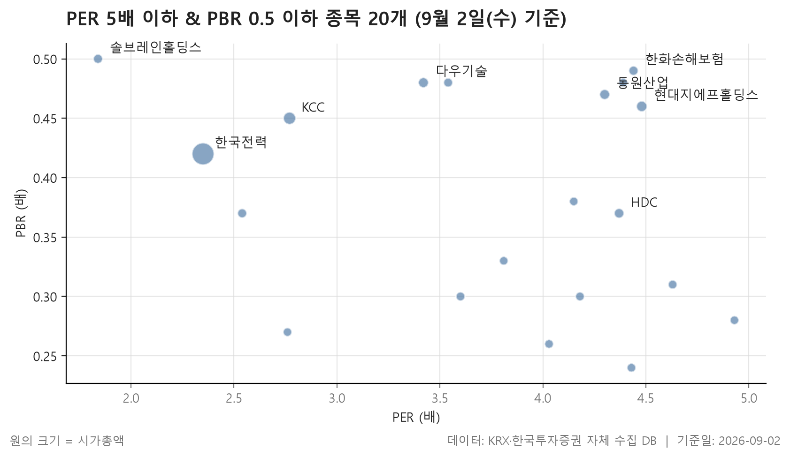
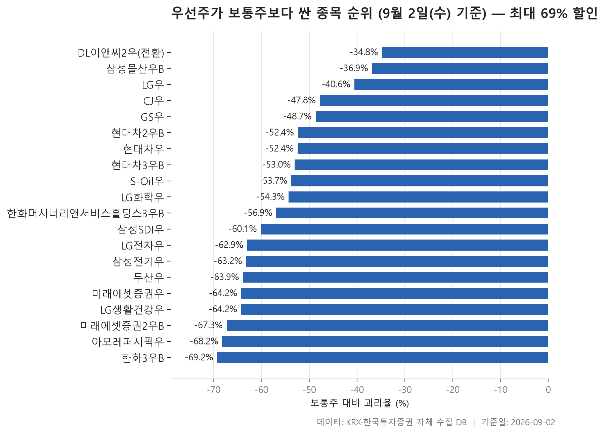

오늘은 시세가 아니라 재무제표가 만드는 숫자를 봅니다. 주가수익비율(PER)과 주가순자산비율(PBR)은 분모가 실적과 자본이라, 하루하루 흔들리는 값이 아니라 분기 실적이 갱신될 때 계단처럼 움직입니다. 그래서 이 화면은 매일이 아니라 분기마다 한 번 정리합니다. 2026년 9월 2일 종가를 기준으로 두 지표를 동시에 낮게 유지하고 있는 보통주가 어디에 몰려 있는지, 그리고 같은 회사 안에서 우선주와 보통주의 가격이 얼마나 벌어져 있는지를 나란히 놓았습니다.

첫 번째 표는 이익 대비 가격이 5배 이하이면서 순자산 대비 가격이 절반 이하인 종목만 걸러낸 것입니다. 두 조건을 한꺼번에 통과해야 하니 목록은 짧아지고, 대신 남은 종목들끼리는 성격이 꽤 닮아 보입니다. 두 번째 표는 조금 다른 종류의 저평가입니다. 회사는 같은데 주식의 종류가 다르다는 이유만으로 가격이 얼마나 달라지는지, 그 차이를 백분율로 세워 놓았습니다.

미리 밝혀 둘 것이 있습니다. 여기 실린 지표는 모두 한국거래소 공시 기준이고, 적자를 낸 회사는 애초에 이익 대비 가격이 산출되지 않아 목록에 오르지 못합니다. 즉 이 표는 "싼 회사 전부"가 아니라 "이익이 나면서도 지표가 낮게 찍힌 회사"의 명단입니다. 숫자가 낮다는 사실 자체는 이유를 설명해 주지 않는다는 점도 함께 기억해 두시면 좋겠습니다.

> 기준일: 2026-09-02 · 집계: 자체 수집 데이터베이스

## 저PER·저PBR 20개 — 가장 싼 솔브레인홀딩스 1.84배

목록의 모양부터 보겁니다. 20개 종목의 이익 대비 가격을 늘어놓았을 때 한가운데 놓인 값이 4.09배입니다. 걸러낸 상한이 5.0배이니, 절반 이상이 상한 근처에 쓸리지 않고 4배 안쪽에 자리를 잡고 있다는 뜻이 됩니다. 가장 높은 쪽은 삼천리의 4.93배로 걸러낸 선에 거의 붙어 있고, 가장 낮은 쪽은 솔브레인홀딩스의 1.84배입니다. 아래쪽 끝과 위쪽 끝이 배수로 세어도 상당히 멀리 떨어진 사이이니, 같은 화면에 걸렸다고 해서 모두 버슯한 수준으로 받아들이기는 어렵습니다.

눈에 걸리는 대목은 순자산 대비 가격 쪽입니다. 이쪽 기준은 0.5배 이하인데, 실제로 0.50배에 정확히 닿아 있는 종목은 솔브레인홀딩스 하나뿐이고 나머지는 그보다 아랫단에 넓게 퍼져 있습니다. F&F홀딩스가 0.24배, KG스틸이 0.26배, 성우하이텍이 0.27배로 목록 아래쪽에 낮은 값이 모여 있다는 점도 흥미롭습니다. 시가총액 순으로 정렬한 표인데 순자산 대비 가격은 그 순서를 전혀 따라가지 않습니다. 규모가 큰 쪽이 더 싸게 매겨진다거나 그 반대라는 규칙은 이 표에서 읽힐 수 없다는 말입니다.

업종 분포도 짚어 둘 만합니다. 11개 업종에 흩어져 있지만 금융으로 분류된 종목이 6개로 가장 많습니다. 현대지에프홀딩스, HDC, LX홀딩스, F&F홀딩스, 농심홀딩스처럼 이름에서 지주 성격이 드러나는 회사들이 여기에 들어와 있는데, 지주회사가 순자산에 보다 낮은 가격에 거래되는 모습은 이 화면에서 반복적으로 관찰됩니다. 전기·가스도 한국전력, 지역난방공사, 삼천리로 세 곳이 걸렸습니다. 시장별로는 유가증권시장 16개, 코스닥 4개로 유가증권시장 쪽이 압도적입니다.

주당순자산(BPS)과 주가를 함께 보면 왜 순자산 대비 가격이 낮게 나오는지가 눈으로 확인됩니다. KCC는 주당순자산이 1,063,952원인데 종가는 479,500원, 삼천리는 491,062원에 종가 135,700원입니다. 시가총액 기준 최대인 한국전력도 주당순자산 75,035원에 종가는 31,250원이죠. 다만 이 표에는 배당수익률이 채워진 종목이 하나도 없습니다. 배당을 보러 오신 분이라면 이 화면만으로는 답이 나오지 않는다는 점을 분명히 말씀드려 둡니다.

| 종목명 | 종목코드 | 시장 | 업종 | 종가(원) | PER(배) | PBR(배) | 배당수익률(%) | BPS(원) | 시가총액(억원) |
|---|---|---|---|---|---|---|---|---|---|
| 한국전력 | 015760 | KOSPI | 전기·가스 | 31,250 | 2.35 | 0.42 | - | 75,035 | 200,614 |
| KCC | 002380 | KOSPI | 화학 | 479,500 | 2.77 | 0.45 | - | 1,063,952 | 41,203 |
| 현대지에프홀딩스 | 005440 | KOSPI | 금융 | 11,850 | 4.48 | 0.46 | - | 25,658 | 21,733 |
| 다우기술 | 023590 | KOSPI | IT 서비스 | 38,550 | 3.42 | 0.48 | - | 79,869 | 16,687 |
| 동원산업 | 006040 | KOSPI | 금융 | 37,800 | 4.30 | 0.47 | - | 79,927 | 16,685 |
| HDC | 012630 | KOSPI | 금융 | 22,000 | 4.37 | 0.37 | - | 59,006 | 13,143 |
| 한화손해보험 | 000370 | KOSPI | 보험 | 8,580 | 4.44 | 0.49 | - | 17,378 | 10,016 |
| 솔브레인홀딩스 | 036830 | KOSDAQ | 일반서비스 | 42,800 | 1.84 | 0.50 | - | 86,410 | 8,776 |
| 지역난방공사 | 071320 | KOSPI | 전기·가스 | 74,300 | 2.54 | 0.37 | - | 198,762 | 8,603 |
| 다우데이타 | 032190 | KOSDAQ | 유통 | 20,200 | 3.54 | 0.48 | - | 42,047 | 7,737 |
| 대한해운 | 005880 | KOSPI | 운송·창고 | 2,010 | 3.60 | 0.30 | - | 6,684 | 6,487 |
| LX홀딩스 | 383800 | KOSPI | 금융 | 8,080 | 4.63 | 0.31 | - | 25,746 | 6,163 |
| 넥센타이어 | 002350 | KOSPI | 화학 | 6,050 | 4.18 | 0.30 | - | 19,967 | 5,909 |
| F&F홀딩스 | 007700 | KOSPI | 금융 | 14,250 | 4.43 | 0.24 | - | 59,179 | 5,574 |
| KG스틸 | 016380 | KOSPI | 금속 | 5,440 | 4.03 | 0.26 | - | 21,234 | 5,440 |
| 쿠쿠홈시스 | 284740 | KOSPI | 일반서비스 | 23,400 | 4.39 | 0.48 | - | 48,373 | 5,250 |
| 삼천리 | 004690 | KOSPI | 전기·가스 | 135,700 | 4.93 | 0.28 | - | 491,062 | 4,922 |
| 성우하이텍 | 015750 | KOSDAQ | 운송장비·부품 | 5,830 | 2.76 | 0.27 | - | 21,208 | 4,664 |
| 서희건설 | 035890 | KOSDAQ | 건설 | 2,200 | 4.15 | 0.38 | - | 5,846 | 4,567 |
| 농심홀딩스 | 072710 | KOSPI | 금융 | 94,200 | 3.81 | 0.33 | - | 284,823 | 4,369 |

## 우선주 괴리율 20개 — 할인이 가장 큰 한화3우B -69.25%

두 번째 표는 성격이 단순합니다. 같은 회사의 우선주가 보통주보다 얼마나 싼지, 그 하나만 봅니다. 20개 항목 전부가 음수입니다. 즉 모든 짝에서 우선주가 보통주보다 낮은 가격에 거래되고 있고, 우선주가 더 비싼 사례는 이번 화면에 한 건도 없었습니다. 값을 늘어놓았을 때 한가운데 놓인 값이 -55.60%인데, 이 정도면 우선주 가격이 보통주의 절반에 못 미치는 상태가 목록의 중간 풍경이라는 뜻입니다.

벌어진 폭이 가장 큰 쪽은 한화3우B로 -69.25%, 가장 작은 쪽은 DL이앤씨2우(전환)로 -34.79%입니다. 양 끝의 거리가 상당하여, 우선주라는 한 단어로 묶기에는 내부 사정이 꽤 다릅니다. 표 아래쪽의 LG우(-40.59%), 삼성물산우B(-36.86%), DL이앤씨2우(전환)처럼 격차가 상대적으로 좁은 구간이 있고, 위쪽에는 아모레퍼시픽우(-68.20%), 미래에셋증권2우B(-67.27%), LG생활건강우(-64.24%)가 몰려 있습니다. 단새가 끝에서 끝으로 골고로 이어지는 모양이 아니라, 아랫단에 여러 건이 몰려 있고 위로 가면서 들율해집니다.

같은 회사 안에서 종류별로 값이 갈리는 사례도 보입니다. 현대차는 세 종류의 우선주가 모두 표에 올라 있는데 -53.04%, -52.43%, -52.38%로 서로 거의 붙어 있습니다. 반면 미래에셋증권은 -67.27%와 -64.21%로 눈에 보이게 갈라집니다. 같은 보통주를 기준으로 계산했는데도 차이가 생기는 것이니, 우선주 종류별로 가격이 따로 매겨진다는 사실을 그대로 보여 줍니다.

거래대금을 함께 보면 표가 더 입체적으로 읽힙니다. 이 화면은 우선주 거래대금 3억원 이상만 통과시키는데, 실제 값은 3.10억원부터 335.90억원까지 막엄하게 벌어져 있습니다. 현대차2우B가 335.90억원, 현대차우가 195.10억원으로 거래가 뚜렷이 몰린 반면, 벌어진 폭이 가장 큰 한화3우B는 9.70억원, 아모레퍼시픽우는 5.00억원에 그칩니다. 격차가 크다고 거래가 활발한 것도, 그 반대도 아니라는 얘기입니다. 여기서도 배당수익률 칸은 비어 있어, 우선주의 배당 조건을 확인하려면 별도 자료가 필요합니다.

| 우선주 | 우선주코드 | 보통주 | 보통주코드 | 우선주종가(원) | 보통주종가(원) | 괴리율(%) | 우선주배당수익률(%) | 우선주거래대금(억원) |
|---|---|---|---|---|---|---|---|---|
| 한화3우B | 00088K | 한화 | 000880 | 38,900 | 126,500 | -69.25 | - | 9.70 |
| 아모레퍼시픽우 | 090435 | 아모레퍼시픽 | 090430 | 45,250 | 142,300 | -68.20 | - | 5.00 |
| 미래에셋증권2우B | 00680K | 미래에셋증권 | 006800 | 10,800 | 33,000 | -67.27 | - | 18.30 |
| LG생활건강우 | 051905 | LG생활건강 | 051900 | 106,200 | 297,000 | -64.24 | - | 6.00 |
| 미래에셋증권우 | 006805 | 미래에셋증권 | 006800 | 11,810 | 33,000 | -64.21 | - | 4.20 |
| 두산우 | 000155 | 두산 | 000150 | 405,000 | 1,121,000 | -63.87 | - | 14.20 |
| 삼성전기우 | 009155 | 삼성전기 | 009150 | 515,000 | 1,400,000 | -63.21 | - | 76.40 |
| LG전자우 | 066575 | LG전자 | 066570 | 74,300 | 200,500 | -62.94 | - | 45.80 |
| 삼성SDI우 | 006405 | 삼성SDI | 006400 | 214,500 | 538,000 | -60.13 | - | 14.70 |
| 한화머시너리앤서비스홀딩스3우B | 0220WL | 한화머시너리앤서비스홀딩스 | 0220W0 | 2,970 | 6,890 | -56.89 | - | 34.30 |
| LG화학우 | 051915 | LG화학 | 051910 | 122,900 | 269,000 | -54.31 | - | 24.50 |
| S-Oil우 | 010955 | S-Oil | 010950 | 69,800 | 150,900 | -53.74 | - | 13.70 |
| 현대차3우B | 005389 | 현대차 | 005380 | 177,500 | 378,000 | -53.04 | - | 32.00 |
| 현대차우 | 005385 | 현대차 | 005380 | 179,800 | 378,000 | -52.43 | - | 195.10 |
| 현대차2우B | 005387 | 현대차 | 005380 | 180,000 | 378,000 | -52.38 | - | 335.90 |
| GS우 | 078935 | GS | 078930 | 61,600 | 120,000 | -48.67 | - | 4.10 |
| CJ우 | 001045 | CJ | 001040 | 68,000 | 130,300 | -47.81 | - | 3.10 |
| LG우 | 003555 | LG | 003550 | 70,400 | 118,500 | -40.59 | - | 3.50 |
| 삼성물산우B | 02826K | 삼성물산 | 028260 | 235,500 | 373,000 | -36.86 | - | 10.20 |
| DL이앤씨2우(전환) | 37550L | DL이앤씨 | 375500 | 45,650 | 70,000 | -34.79 | - | 7.00 |

## 정리

정리하면, 이익과 순자산 대비 가격이 동시에 낮은 보통주 20개는 지주 성격의 금융 분류와 전기·가스 쪽에 눈에 띄게 몰려 있고, 순자산 대비 가격은 걸러낸 상한선인 0.5배보다 훨씬 아래에 넓게 퍼져 있습니다. 우선주 쪽은 20개 전부가 보통주보다 싸고, 그 한가운데 값이 -55.60%로 절반 아래에 놓여 있습니다. 두 표가 말해 주는 것은 "여기에 낮은 숫자가 있다"는 사실까지이고, 왜 낮은지는 말해 주지 않습니다.

한계도 분명합니다. 이익과 순자산 대비 가격은 지난 재무제표를 분모로 쓰기 때문에 회사의 최근 사정이 아직 반영되지 않았을 수 있고, 적자를 낸 회사는 애초에 화면에 들어오지 못합니다. 우선주 격차도 의결권 유무나 배당 조건 같은 요소를 계산에 넣지 않은 단순 가격 비교입니다. 숫자가 낮다는 것과 그 숫자가 좁혀진다는 것은 전혀 다른 이야기이니, 이 글은 오늘 시장의 모양을 훑는 자료로만 읽어 주시길 바랍니다. 다음 정리는 분기 실적이 갱신된 뒤에 다시 올리겠습니다.

## 집계 기준

**저PER·저PBR**

- **기준**: 0 < PER ≤ 5.0, 0 < PBR ≤ 0.5
- **필터**: 시가총액 500억 이상, 보통주
- **주의**: PER/PBR 은 KRX 공시 기준이며 적자 종목은 PER 이 산출되지 않습니다.

**우선주 괴리율**

- **기준**: (우선주 종가 - 보통주 종가) / 보통주 종가 × 100
- **짝짓기**: 우선주 코드 6자리 중 앞 5자리가 같고 끝자리가 0 인 종목을 보통주로 봅니다.
- **필터**: 우선주 거래대금 3억 이상

## 데이터 출처 및 유의사항

- **데이터출처**: 한국거래소(KRX) 공시 데이터와 한국투자증권 OpenAPI 를 직접 수집해 구축한 자체 데이터베이스
- **집계방식**: 수집·집계·차트 생성을 직접 구현한 파이프라인에서 자동 산출
- **작성고지**: 본문의 표·통계·차트는 자체 데이터베이스에서 계산된 값이며, 문장 작성 과정에 AI 도구를 활용했습니다.
- **면책**: 본 글은 정보 제공을 목적으로 하며 특정 종목의 매수·매도를 추천하지 않습니다. 제시된 수치는 과거 데이터이고 미래 수익을 보장하지 않습니다. 투자 판단과 그 결과에 대한 책임은 투자자 본인에게 있습니다.

