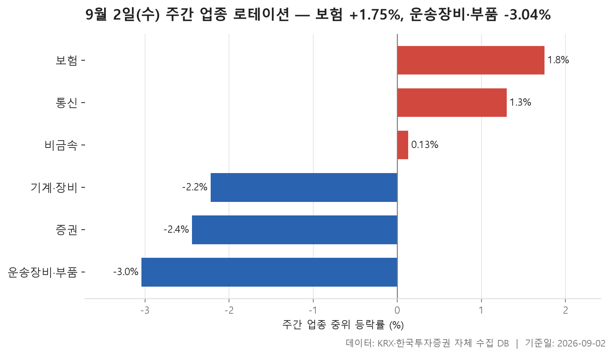
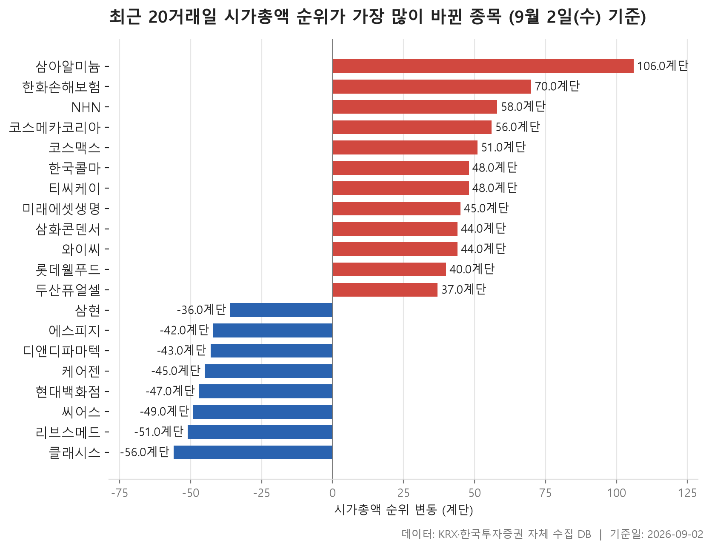

9월 2일 수요일 종가를 기준으로, 지난 한 주와 지난 한 달의 시장 모양을 두 장의 표로 나눠 봅니다. 앞의 표는 8월 26일 종가에서 9월 2일 종가까지 닷새 동안 업종별로 주가가 어느 쪽으로 기울었는지, 뒤의 표는 8월 4일에서 9월 2일 사이 시가총액 순위가 크게 흔들린 종목들이 어디에 몰려 있는지를 보여 줍니다.

먼저 짚어 둘 것이 하나 있습니다. 업종 순위는 그 업종에 속한 종목들의 등락률을 늘어놓고 한가운데 값을 뽑아 매겼습니다. 평균이 아니라 중위값을 쓴 이유는 단순합니다. 한두 종목이 크게 튀면 평균은 그쪽으로 끌려가지만, 중위값은 "이 업종에 있는 보통의 종목이 어땠나"를 더 정직하게 보여 주기 때문입니다. 그래서 이번 표에서는 중위값과 평균이 서로 다른 방향을 가리키는 업종이 여럿 나옵니다. 오히려 그 어긋남이 볼거리입니다.

한 주간 업종의 한가운데 값이 가장 높았던 곳은 보험으로 1.75%, 가장 낮았던 곳은 운송장비·부품으로 -3.04%였습니다. 폭으로 보면 크게 벌어진 한 주는 아니지만, 그 안을 들여다보면 업종마다 사정이 꽤 다릅니다.

> 기준일: 2026-09-02 · 집계: 자체 수집 데이터베이스

## 주간 업종 로테이션 — 6개 중 3개 상승

가장 눈에 걸리는 건 맨 윗줄입니다. 보험은 24개 업종 중 한가운데 값이 가장 높았고, 11개 종목 가운데 열에 일곱 꼴로 올랐습니다. 그런데 같은 업종의 평균 등락률은 -1.07%로 마이너스입니다. 한가운데 값과 평균이 반대 부호로 갈린 셈인데, 이유는 표 안에 그대로 적혀 있습니다. 이 업종에서 한 주간 가장 크게 움직인 종목이 -29.73%였고, 종목 수가 11개뿐이라 이 한 종목만으로 업종 평균이 2.70%포인트 내려앉았습니다. 대부분 조금씩 올랐는데 한 종목이 크게 빠지면서 평균만 아래로 끌려간 모습입니다. 보험 업종이 강했다는 말과 보험 종목들의 평균이 마이너스였다는 말이 동시에 참일 수 있는 이유가 여기 있습니다.

비금속은 반대 방향으로 어긋나 있습니다. 한가운데 값은 0.13%로 사실상 제자리인데 평균은 3.46%까지 올라와 있습니다. 오른 종목 비율도 51.40%, 거의 절반씩 갈렸습니다. 35개 종목 중 보통의 종목은 움직이지 않았지만 몇몇이 크게 오르면서 평균을 밀어 올린 구조입니다. 실제로 이 업종에서 가장 크게 움직인 종목의 한 주간 등락률이 64.99%였고, 그 한 종목이 업종 평균에 1.86%포인트를 보탰습니다. 통신은 이런 어긋남이 가장 적은 축입니다. 한가운데 값 1.30%, 평균 1.99%로 둘이 같은 방향을 보고 있고 오른 종목도 절반을 넘습니다. 폭은 크지 않아도 업종 안이 비교적 고르게 움직였다고 볼 수 있는 형태입니다.

아래쪽 세 업종은 성격이 조금씩 다릅니다. 증권은 17개 종목 중 오른 종목이 5.90%, 사실상 거의 전부가 내렸습니다. 한가운데 값이 -2.44%인데 평균은 그보다 더 낮은 -3.30%로, 낙폭이 큰 쪽이 무게를 더 실었습니다. 오르내림이 갈리지 않고 한 방향으로 쏠린, 가장 단순한 형태의 약세입니다.

기계·장비와 운송장비·부품은 종목 수가 각각 206개, 130개로 표에서 가장 큰 두 업종입니다. 둘 다 한가운데 값보다 평균이 위에 있습니다. 기계·장비는 보통의 종목이 -2.22%인데 평균은 -0.98%, 운송장비·부품은 -3.04%에 평균 -2.29%입니다. 오른 종목 비율은 각각 30.60%, 24.60%로 넷 중 하나에서 셋 중 하나 사이. 넓게 내리는 가운데 소수가 크게 올라 평균만 덜 빠진 그림입니다. 기계·장비의 주도 종목은 53.34% 올랐지만 종목이 200개를 넘다 보니 업종 평균에 더한 몫은 0.26%포인트에 그칩니다. 운송장비·부품 쪽 주도 종목은 -17.06%로 방향이 아예 반대인데, 여기서도 130개로 나뉘면서 평균에 미친 몫은 -0.13%포인트뿐입니다. 큰 업종에서는 한 종목이 뭘 하든 전체 그림을 바꾸지 못한다는 점이 숫자로 확인됩니다.

| 업종 | 종목수(개) | 주간중위등락률(%) | 주간평균등락률(%) | 상승비율(%) | 주도종목 | 주도종목등락률(%) | 평균기여도(%p) |
|---|---|---|---|---|---|---|---|
| 보험 | 11 | 1.75 | -1.07 | 72.70 | 미래에셋생명 | -29.73 | -2.70 |
| 통신 | 12 | 1.30 | 1.99 | 58.30 | 더즌 | 17.66 | 1.47 |
| 비금속 | 35 | 0.13 | 3.46 | 51.40 | 강동씨앤엘 | 64.99 | 1.86 |
| 기계·장비 | 206 | -2.22 | -0.98 | 30.60 | 넥사다이내믹스 | 53.34 | 0.26 |
| 증권 | 17 | -2.44 | -3.30 | 5.90 | 미래에셋증권 | -9.09 | -0.53 |
| 운송장비·부품 | 130 | -3.04 | -2.29 | 24.60 | 금호에이치티 | -17.06 | -0.13 |

## 시총 순위 변동 20개 — 최고 삼아알미늄 106계단

뒤의 표는 시간 축이 다릅니다. 8월 4일과 9월 2일, 한 달 간격으로 시가총액 순위를 비교해 변동이 컸던 20개를 뽑았습니다. 오른 쪽이 12개, 내린 쪽이 8개이고 변동폭의 한가운데 값은 42계단입니다. 300위권 안에서 40계단 넘게 움직였다는 건 시가총액이 수십 퍼센트 단위로 바뀌었다는 뜻이기도 합니다. 실제로 표의 시가총액 증감률을 보면 오른 쪽은 31.69%에서 74.45% 사이에, 내린 쪽은 -21.59%에서 -28.86% 사이에 몰려 있습니다.

가장 크게 올라선 건 삼아알미늄으로 106계단, 395위에서 289위로 자리를 옮겼습니다. 시가총액은 74.45% 늘었는데 금액 자체는 10,329억원으로 표 안에서는 작은 편입니다. 순위 하단에서는 조금만 몸집이 불어도 계단을 많이 올라가기 때문입니다. 반대로 한국콜마는 시가총액 36,588억원으로 표 안에서 가장 큰데, 오른 계단은 48계단으로 삼아알미늄의 절반에 못 미칩니다. 순위 변동폭과 회사 크기를 같은 잣대로 읽으면 안 되는 이유가 여기 있습니다. 상위권으로 갈수록 같은 계단을 올라가는 데 훨씬 큰 금액이 필요합니다.

업종을 세어 보면 13개로 흩어져 있어 어느 한 곳이 표를 지배하지는 않습니다. 다만 눈에 띄는 묶음은 있습니다. 화학으로 분류된 세 종목은 모두 순위가 올랐고, 오른 계단도 56·51·48로 비슷한 구간에 몰려 있습니다. 시가총액 증감률도 46.26%, 53.01%, 62.09%로 서로 멀지 않습니다. 반면 가장 많은 종목이 들어간 의료·정밀기기 3개는 방향이 정반대입니다. 셋 다 순위가 내렸고, 계단으로는 -56, -51, -49입니다. 표에는 그 이유가 담겨 있지 않으니 원인은 말할 수 없지만, 같은 업종 안에서 세 종목이 비슷한 폭으로 함께 밀려난 모양만은 분명합니다. 전기·전자 3개는 또 다릅니다. 두 종목은 44계단, 37계단 올랐고 한 종목은 42계단 내렸습니다. 같은 업종이라도 방향이 갈릴 수 있다는 걸 보여 주는 사례입니다.

시장별로는 KOSPI 10개, KOSDAQ 10개로 정확히 반씩입니다. 다만 내려간 8개 쪽을 따로 세어 보면 KOSDAQ 종목이 눈에 띄게 많습니다. 마지막으로 앞의 표와 겹치는 대목 하나. 한 주간 보험 업종에서 -29.73%로 가장 크게 움직였던 미래에셋생명은, 한 달 기준 순위로 보면 204위에서 159위로 45계단 올라온 상태입니다. 시가총액도 그 기간 34.72% 늘었습니다. 한 주를 보느냐 한 달을 보느냐에 따라 같은 종목이 전혀 다르게 보인다는 걸 그대로 보여 주는 예입니다. 창을 어디에 놓느냐가 결론을 바꿉니다.

| 종목명 | 종목코드 | 시장 | 업종 | 현재순위(위) | 과거순위(위) | 순위변동(계단) | 시총증감률(%) | 시가총액(억원) |
|---|---|---|---|---|---|---|---|---|
| 삼아알미늄 | 006110 | KOSPI | 금속 | 289 | 395 | 106 | 74.45 | 10,329 |
| 한화손해보험 | 000370 | KOSPI | 보험 | 292 | 362 | 70 | 48.96 | 10,016 |
| NHN | 181710 | KOSPI | IT 서비스 | 190 | 248 | 58 | 55.61 | 22,272 |
| 클래시스 | 214150 | KOSDAQ | 의료·정밀기기 | 203 | 147 | -56 | -28.86 | 21,071 |
| 코스메카코리아 | 241710 | KOSDAQ | 화학 | 245 | 301 | 56 | 62.09 | 14,888 |
| 코스맥스 | 192820 | KOSPI | 화학 | 141 | 192 | 51 | 46.26 | 32,403 |
| 리브스메드 | 491000 | KOSDAQ | 의료·정밀기기 | 328 | 277 | -51 | -28.59 | 8,107 |
| 씨어스 | 458870 | KOSDAQ | 의료·정밀기기 | 330 | 281 | -49 | -26.90 | 7,957 |
| 한국콜마 | 161890 | KOSPI | 화학 | 130 | 178 | 48 | 53.01 | 36,588 |
| 티씨케이 | 064760 | KOSDAQ | 비금속 | 160 | 208 | 48 | 39.55 | 27,613 |
| 현대백화점 | 069960 | KOSPI | 유통 | 210 | 163 | -47 | -21.70 | 19,991 |
| 미래에셋생명 | 085620 | KOSPI | 보험 | 159 | 204 | 45 | 34.72 | 27,644 |
| 케어젠 | 214370 | KOSDAQ | 제약 | 175 | 130 | -45 | -26.44 | 25,407 |
| 삼화콘덴서 | 001820 | KOSPI | 전기·전자 | 280 | 324 | 44 | 43.50 | 11,590 |
| 와이씨 | 232140 | KOSDAQ | 기계·장비 | 296 | 340 | 44 | 31.69 | 9,886 |
| 디앤디파마텍 | 347850 | KOSDAQ | 일반서비스 | 189 | 146 | -43 | -24.31 | 22,483 |
| 에스피지 | 058610 | KOSDAQ | 전기·전자 | 218 | 176 | -42 | -21.60 | 18,917 |
| 롯데웰푸드 | 280360 | KOSPI | 음식료·담배 | 257 | 297 | 40 | 43.85 | 13,678 |
| 두산퓨얼셀 | 336260 | KOSPI | 전기·전자 | 176 | 213 | 37 | 35.31 | 25,346 |
| 삼현 | 437730 | KOSDAQ | 운송장비·부품 | 305 | 269 | -36 | -21.59 | 9,385 |

## 정리

정리하면 이번 주 업종 표에서 가장 중요한 건 순위 자체보다 한가운데 값과 평균이 갈라진 자리입니다. 보험처럼 대부분이 올랐는데 평균만 마이너스인 경우, 비금속처럼 보통의 종목은 제자리인데 평균이 3%대인 경우, 그리고 기계·장비와 운송장비·부품처럼 종목 수가 많아 개별 종목의 영향이 희석되는 경우. 세 가지가 한 표 안에 다 들어 있습니다. 한 달 순위 표에서는 화학 세 종목이 함께 올라오고 의료·정밀기기 세 종목이 함께 내려간 대비가 눈에 띄었고, 같은 계단 수라도 시가총액 규모에 따라 의미가 다르다는 점도 확인했습니다.

다만 이 글은 가격과 시가총액이라는 결과값만 놓고 쓴 것입니다. 왜 그런 움직임이 나왔는지, 그 뒤에 무엇이 있었는지는 이 데이터에 담겨 있지 않아 말할 수 없습니다. 중위값과 평균, 오른 종목 비율은 모두 같은 기간을 다르게 요약한 수치일 뿐이고, 기간을 하루만 옮겨도 순위는 얼마든지 바뀔 수 있습니다. 표를 판단의 근거가 아니라 지난 기간을 되짚는 참고 자료로 봐 주시면 좋겠습니다.

## 집계 기준

**주간 업종 로테이션**

- **기준**: 2026-08-26 종가 → 2026-09-02 종가 (5거래일)
- **순위**: 업종 내 종목 등락률의 중위값 (평균은 참고용으로 함께 표시)
- **선정**: 전체 24개 업종 중 상위 3개 · 하위 3개
- **주도종목**: 그 업종에서 같은 기간 등락률 절대값이 가장 큰 종목 (동점이면 거래대금이 큰 쪽)
- **평균기여도**: 그 종목 하나가 업종 평균을 움직인 폭 (등락률 ÷ 종목수)
- **필터**: 업종 내 보통주 5종목 이상

**시총 순위 변동**

- **기준**: 2026-08-04 대비 2026-09-02 시가총액 순위 변동 (양수 = 순위 상승)
- **모집단**: 양쪽 날짜 중 한 번이라도 시총 300위 이내였던 보통주

## 데이터 출처 및 유의사항

- **데이터출처**: 한국거래소(KRX) 공시 데이터와 한국투자증권 OpenAPI 를 직접 수집해 구축한 자체 데이터베이스
- **집계방식**: 수집·집계·차트 생성을 직접 구현한 파이프라인에서 자동 산출
- **작성고지**: 본문의 표·통계·차트는 자체 데이터베이스에서 계산된 값이며, 문장 작성 과정에 AI 도구를 활용했습니다.
- **면책**: 본 글은 정보 제공을 목적으로 하며 특정 종목의 매수·매도를 추천하지 않습니다. 제시된 수치는 과거 데이터이고 미래 수익을 보장하지 않습니다. 투자 판단과 그 결과에 대한 책임은 투자자 본인에게 있습니다.

