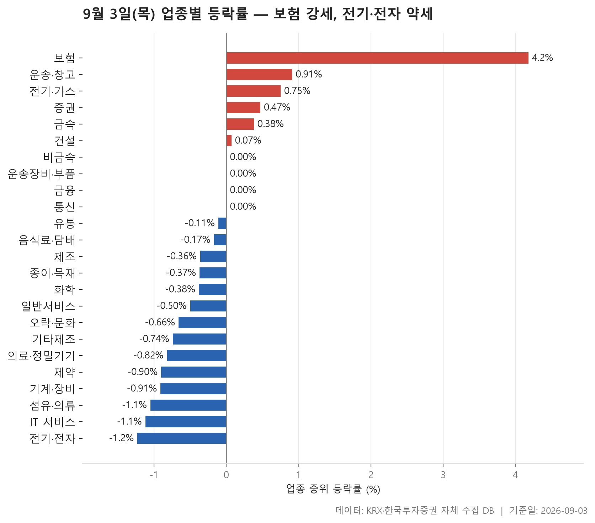
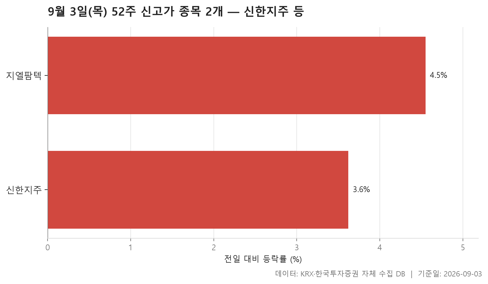
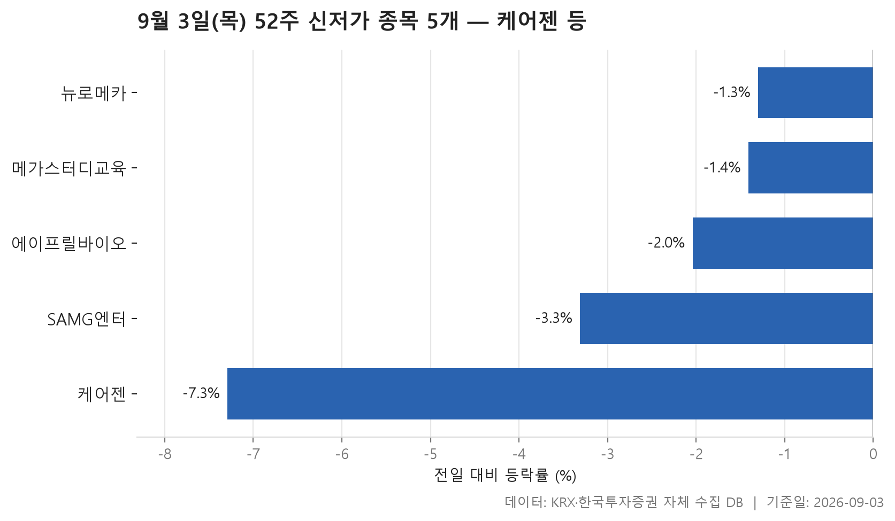
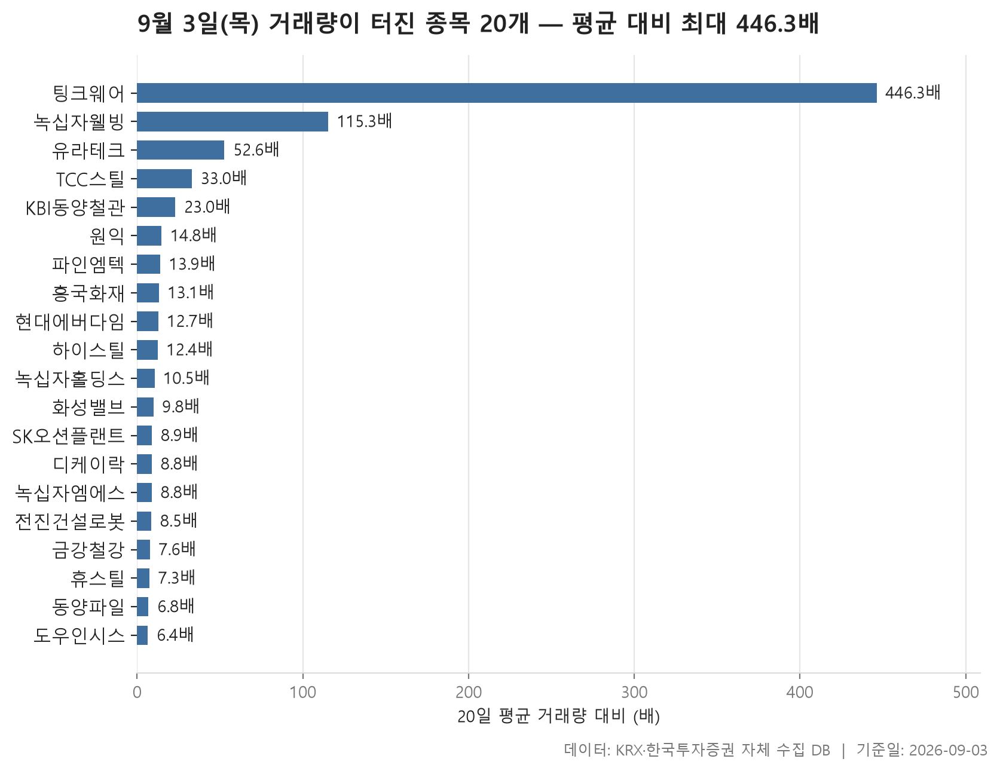

9월 3일 시장은 한쪽으로 크게 쏠렸다기보다, 위아래가 또렷하게 갈린 하루였습니다. 24개 업종의 중위 등락률을 늘어놓고 한가운데 값을 보면 -0.27%. 크게 무너진 날은 아니지만, 오른 업종보다 내린 업종이 확실히 많았습니다. 양의 값을 기록한 업종이 6개, 음의 값이 14개니까 내린 쪽이 두 배가 넘습니다.

맨 위와 맨 아래의 간격도 눈여겨볼 만합니다. 가장 강한 보험이 4.18%, 가장 약한 전기·전자가 -1.23%. 아래쪽은 1%대에서 멈춘 반면 위쪽은 4%를 넘겼으니, 하락은 넓고 얕게 퍼졌고 상승은 좁은 곳에 몰렸다는 그림이 됩니다.

오늘 글에서는 업종별 흐름을 먼저 훑고, 52주 최고가를 새로 쓴 종목과 최저가를 밑돈 종목을 나눠 본 다음, 거래량이 평소의 몇 배로 튄 종목들을 정리합니다. 각 표가 서로 다른 각도에서 같은 하루를 비추기 때문에, 겹치는 이름이 어디서 나오는지 보는 것도 하나의 재미입니다.

> 기준일: 2026-09-03 · 집계: 자체 수집 데이터베이스

## 업종 등락률 — 24개 중 14개 하락

순위표 맨 위의 보험은 다른 업종과 성격이 다릅니다. 11개 종목이 모두 올랐습니다. 한 종목도 빠짐없이 상승한 업종은 이 표에서 보험뿐이고, 그래서 중위값 4.18%와 평균 4.62%가 서로 크게 벌어지지 않습니다. 가장 크게 오른 종목이 이 업종 평균을 0.88%p 밀어올린 것으로 계산되는데, 중위값과 평균의 차이보다 큽니다. 한 종목이 끌고 간 상승이 아니라 업종 전체가 함께 움직였다는 뜻으로 읽힙니다.

반대로 금속을 보면 성격이 전혀 다릅니다. 중위 등락률은 0.38%로 소폭 플러스인데 평균은 0.85%까지 올라가 있고, 130개나 되는 종목이 담긴 업종에서 상한가 부근까지 오른 종목 하나가 평균을 0.23%p 들어 올렸습니다. IT 서비스도 비슷한 어긋남을 보입니다. 중위값은 이 표에서 아래에서 두 번째인데 평균은 그보다 덜 나쁘고, 상한가 부근까지 간 종목이 하나 섞여 있습니다. 오른 종목이 열에 셋도 안 되는 업종에서 평균이 중위값보다 위에 있다면, 그 차이를 만든 것은 소수의 큰 상승입니다.

거래대금 쪽은 완전히 한쪽으로 기울어 있습니다. 전기·전자 한 업종의 거래대금 합계가 113,834.10억원으로, 두 번째로 많은 곳과 견줘도 차원이 다릅니다. 그런데 이 업종의 중위 등락률은 표에서 가장 낮고, 오른 종목은 넷에 하나 정도. 돈은 가장 많이 오갔는데 종목 대부분은 내린 자리였습니다.

하락 쪽에서 눈에 띄는 것은 섬유·의류입니다. 중위 등락률은 -1.05%로 최하위권까지는 아니지만, 오른 종목 비율이 이 표에서 가장 낮습니다. 다섯 곳 중 한 곳도 채 오르지 못했다는 뜻이니, 낙폭보다 폭이 넓은 하락이었던 셈입니다. 통신과 금융, 운송장비·부품처럼 중위값이 0.00%로 찍힌 업종들도 있는데, 이건 조용했다는 뜻이라기보다 한가운데 종목이 제자리였을 뿐 안에서는 위아래가 갈렸다고 보는 편이 맞습니다. 금융에서는 두 자릿수로 내린 종목이 주도 자리에 올라 있습니다.

| 업종 | 종목수(개) | 중위등락률(%) | 평균등락률(%) | 상승비율(%) | 주도종목 | 주도종목등락률(%) | 평균기여도(%p) | 거래대금합계(억원) |
|---|---|---|---|---|---|---|---|---|
| 보험 | 11 | 4.18 | 4.62 | 100.00 | 흥국화재 | 9.70 | 0.88 | 4,984.30 |
| 운송·창고 | 28 | 0.91 | 0.70 | 60.70 | 팬오션 | 7.80 | 0.28 | 2,875.60 |
| 전기·가스 | 10 | 0.75 | 0.94 | 60.00 | 한국전력 | 3.84 | 0.38 | 998.00 |
| 증권 | 17 | 0.47 | -0.04 | 52.90 | 부국증권 | -2.61 | -0.15 | 1,424.40 |
| 금속 | 130 | 0.38 | 0.85 | 61.50 | 신스틸 | 29.86 | 0.23 | 6,526.30 |
| 건설 | 50 | 0.07 | 0.42 | 50.00 | CNT85 | 8.24 | 0.16 | 5,291.50 |
| 비금속 | 36 | 0.00 | 0.63 | 47.20 | 서산 | 11.49 | 0.32 | 2,655.80 |
| 운송장비·부품 | 132 | 0.00 | 0.33 | 47.70 | 삼성중공업 | 8.58 | 0.06 | 11,119.80 |
| 금융 | 111 | 0.00 | -0.16 | 46.80 | 한화머시너리앤서비스홀딩스 | -10.16 | -0.09 | 19,392.50 |
| 통신 | 12 | 0.00 | -0.34 | 41.70 | 나이스정보통신 | -6.49 | -0.54 | 1,501.50 |
| 유통 | 153 | -0.11 | -0.63 | 42.50 | 원익 | 18.84 | 0.12 | 6,320.20 |
| 음식료·담배 | 83 | -0.17 | 0.02 | 41.00 | 선진 | 7.88 | 0.09 | 2,008.10 |
| 제조 | 8 | -0.36 | -0.17 | 37.50 | 이월드 | -6.96 | -0.87 | 22.80 |
| 종이·목재 | 27 | -0.37 | -0.47 | 33.30 | 페이퍼코리아 | -7.29 | -0.27 | 38.80 |
| 화학 | 219 | -0.38 | -0.53 | 38.40 | 케이엠제약 | -18.15 | -0.08 | 10,969.70 |
| 일반서비스 | 165 | -0.50 | -1.01 | 32.70 | 모아라이프플러스 | -19.15 | -0.12 | 8,439.30 |
| 오락·문화 | 66 | -0.66 | -1.37 | 27.30 | 골드앤에스 | -27.12 | -0.41 | 754.90 |
| 기타제조 | 14 | -0.74 | -0.60 | 28.60 | 리튬포어스 | 3.73 | 0.27 | 67.90 |
| 의료·정밀기기 | 98 | -0.82 | -1.43 | 26.50 | 마이크로디지탈 | -29.95 | -0.31 | 1,676.90 |
| 제약 | 167 | -0.90 | -0.97 | 27.50 | 녹십자웰빙 | 16.47 | 0.10 | 11,202.80 |
| 기계·장비 | 207 | -0.91 | -0.84 | 34.30 | 수성웹툰 | -28.70 | -0.14 | 14,426.60 |
| 섬유·의류 | 49 | -1.05 | -1.23 | 18.40 | 원풍물산 | -7.99 | -0.16 | 358.90 |
| IT 서비스 | 244 | -1.12 | -0.88 | 29.10 | 라온피플 | 29.84 | 0.12 | 5,648.70 |
| 전기·전자 | 367 | -1.23 | -0.95 | 25.60 | 알트 | 29.86 | 0.08 | 113,834.10 |

## 52주 신고가 2개 — 최고 지엘팜텍 4.55%

52주 최고가를 새로 쓴 종목은 두 개뿐입니다. 시가총액 500억 이상, 거래대금 3억 이상이라는 조건을 걸고 나면 이 정도만 남았습니다. 앞 섹션에서 본 대로 오른 업종보다 내린 업종이 많았던 날이니, 신고가 명단이 얇은 것 자체는 이상한 일이 아닙니다.

두 종목의 대비가 흥미롭습니다. 하나는 시가총액 537,521억원의 대형주이고, 다른 하나는 819억원. 규모로 보면 서로 비교하기 어려운 두 종목이 같은 표에 나란히 있습니다. 거래대금도 한쪽은 1,703.30억원, 다른 쪽은 5.50억원으로 벌어져 있죠. 시장도 코스피와 코스닥으로 하나씩 갈렸고, 업종도 서로 다릅니다.

등락률만 놓고 보면 둘 다 3~4%대로 비슷한 폭입니다. 다만 종가가 직전 52주 최고가를 넘어선 정도는 크지 않습니다. 두 종목 모두 이전 고점을 살짝 웃돈 수준이어서, 기록을 크게 갈아치웠다기보다 간신히 넘겼다는 표현이 어울립니다. 신고가 표는 그날의 강세를 확인하는 용도이지 그 이상을 말해 주지는 않으니, 여기서 더 나아간 해석은 삼가겠습니다.

| 종목명 | 종목코드 | 시장 | 업종 | 종가(원) | 등락률(%) | 이전52주최고(원) | 거래대금(억원) | 시가총액(억원) |
|---|---|---|---|---|---|---|---|---|
| 신한지주 | 055550 | KOSPI | 금융 | 114,500 | 3.62 | 113,900 | 1,703.30 | 537,521 |
| 지엘팜텍 | 204840 | KOSDAQ | 유통 | 5,280 | 4.55 | 5,200 | 5.50 | 819 |

## 52주 신저가 5개 — 최저 케어젠 -7.29%

최저가를 밑돈 종목은 5개. 신고가보다는 많지만 이쪽도 많은 숫자는 아닙니다. 다섯 종목 모두 코스닥이라는 점이 먼저 눈에 들어옵니다. 코스피에서는 같은 조건을 통과한 종목이 하나도 없었습니다.

낙폭은 고르지 않습니다. 가장 크게 내린 종목이 -7.29%인 반면 가장 덜 내린 쪽은 -1.30%로, 다섯 종목 사이 편차가 제법 큽니다. 중위값은 -2.04%. 즉 대부분은 2% 안팎에서 조용히 최저가를 갈아치웠고, 한 종목만 유독 크게 밀렸습니다. 그 한 종목이 이 명단에서 시가총액도 가장 큽니다. 23,554억원으로 나머지와 자릿수가 다릅니다.

업종은 넷으로 나뉘는데 일반서비스가 둘로 가장 많습니다. 다만 두 종목뿐이라 업종 쏠림이라 부르기는 어렵고, 오히려 서로 다른 업종에 흩어져 있다는 쪽이 정확합니다. 여기서 짚어 둘 것은, 앞서 본 업종 표에서 가장 약했던 전기·전자가 이 명단에는 한 종목도 없다는 점입니다. 업종 전체가 내렸다고 해서 그 안의 종목들이 곧바로 52주 최저가까지 내려간 것은 아니라는 뜻이 됩니다.

| 종목명 | 종목코드 | 시장 | 업종 | 종가(원) | 등락률(%) | 이전52주최저(원) | 거래대금(억원) | 시가총액(억원) |
|---|---|---|---|---|---|---|---|---|
| 케어젠 | 214370 | KOSDAQ | 제약 | 43,850 | -7.29 | 46,350 | 55.20 | 23,554 |
| 에이프릴바이오 | 397030 | KOSDAQ | 일반서비스 | 16,770 | -2.04 | 17,030 | 33.60 | 4,622 |
| 뉴로메카 | 348340 | KOSDAQ | 기계·장비 | 16,000 | -1.30 | 16,150 | 30.60 | 3,745 |
| 메가스터디교육 | 215200 | KOSDAQ | 일반서비스 | 34,850 | -1.41 | 34,900 | 13.20 | 3,612 |
| SAMG엔터 | 419530 | KOSDAQ | 오락·문화 | 18,720 | -3.31 | 19,250 | 11.80 | 1,911 |

## 거래량 급증 20개 — 최고 팅크웨어 446.30배

거래량이 20거래일 평균의 5배를 넘은 종목이 20개 잡혔습니다. 배수의 중위값은 11.45배인데, 맨 위는 446.30배입니다. 중간값과 최대값 사이가 이만큼 벌어지면 분포가 한쪽 꼬리로 길게 늘어져 있다는 뜻이고, 실제로 100배를 넘은 종목이 둘, 50배를 넘은 종목이 셋이며 나머지는 대부분 10배 안팎에 몰려 있습니다.

그런데 배수가 크다고 주가가 크게 올랐느냐 하면 그렇지 않습니다. 가장 높은 배수를 기록한 종목은 -5.13%로 내렸습니다. 거래량이 평소의 수백 배로 튀었는데 종가는 하락한 자리죠. 이 표에서 배수와 등락률은 나란히 움직이지 않습니다. 배수가 한 자릿수인데 두 자릿수로 오른 종목도 있고, 배수가 10배를 넘겼는데 등락률이 0.00%인 종목도 있습니다. 거래량이 늘었다는 사실은 사람이 몰렸다는 것만 말해 줄 뿐, 방향은 따로 봐야 합니다.

업종 구성을 보면 금속이 6개로 가장 많습니다. 앞의 업종 표에서 금속은 중위 등락률 0.38%로 상위권에 있었고, 상승 종목 비율도 절반을 넘었습니다. 거래가 붙은 자리와 오른 자리가 어느 정도 겹칩니다. 다만 금속에 속한 여섯 종목 안에서도 편차가 큽니다. 17%대까지 오른 종목이 있는가 하면 0%대에 머문 종목도 둘 있습니다. 업종이 같다고 같은 폭으로 움직이지는 않았습니다.

규모 면에서는 작은 종목이 대부분입니다. 이 명단에서 시가총액이 가장 큰 종목이 8,060억원이니, 하루 거래량이 평소의 몇 배로 튀는 일 자체가 주로 중소형 종목에서 일어난다는 점을 다시 확인하게 됩니다. 앞 섹션들과 겹치는 이름도 보입니다. 보험 업종을 이끈 종목과 제약에서 크게 오른 종목, 유통에서 크게 오른 종목이 모두 여기 들어와 있습니다. 업종 표의 주도 종목 자리와 거래량이 튄 자리가 같다는 것은, 그 움직임에 거래가 실제로 따라붙었다는 정도로 읽으면 되겠습니다.

| 종목명 | 종목코드 | 시장 | 업종 | 종가(원) | 등락률(%) | 거래량(주) | 평균거래량(주) | 배수(배) | 거래대금(억원) | 시가총액(억원) |
|---|---|---|---|---|---|---|---|---|---|---|
| 팅크웨어 | 084730 | KOSDAQ | 전기·전자 | 6,290 | -5.13 | 3,481,806 | 7,800 | 446.30 | 257.90 | 699 |
| 녹십자웰빙 | 234690 | KOSDAQ | 제약 | 10,750 | 16.47 | 10,472,462 | 90,860 | 115.30 | 1,139.40 | 1,931 |
| 유라테크 | 048430 | KOSDAQ | 전기·전자 | 6,330 | 5.68 | 814,126 | 15,465 | 52.60 | 54.30 | 729 |
| TCC스틸 | 002710 | KOSPI | 금속 | 11,700 | 7.83 | 1,692,419 | 51,275 | 33.00 | 216.70 | 3,067 |
| KBI동양철관 | 008970 | KOSPI | 금속 | 1,140 | 8.26 | 10,200,295 | 443,860 | 23.00 | 121.20 | 1,183 |
| 원익 | 032940 | KOSDAQ | 유통 | 8,580 | 18.84 | 14,657,361 | 990,689 | 14.80 | 1,260.10 | 1,561 |
| 파인엠텍 | 441270 | KOSDAQ | 전기·전자 | 9,220 | 18.81 | 7,024,688 | 504,203 | 13.90 | 641.10 | 3,891 |
| 흥국화재 | 000540 | KOSPI | 보험 | 3,960 | 9.70 | 569,944 | 43,514 | 13.10 | 22.00 | 2,544 |
| 현대에버다임 | 041440 | KOSDAQ | 기계·장비 | 6,570 | 2.34 | 895,534 | 70,351 | 12.70 | 61.40 | 1,172 |
| 하이스틸 | 071090 | KOSPI | 금속 | 3,090 | 0.98 | 3,293,438 | 265,780 | 12.40 | 110.30 | 624 |
| 녹십자홀딩스 | 005250 | KOSPI | 일반서비스 | 9,850 | 0.00 | 883,161 | 83,867 | 10.50 | 92.30 | 4,632 |
| 화성밸브 | 039610 | KOSDAQ | 기계·장비 | 5,650 | 3.29 | 1,080,496 | 109,929 | 9.80 | 66.30 | 588 |
| SK오션플랜트 | 100090 | KOSPI | 금속 | 12,900 | 7.50 | 7,862,815 | 879,176 | 8.90 | 1,068.30 | 8,060 |
| 디케이락 | 105740 | KOSDAQ | 기계·장비 | 7,970 | 1.40 | 640,691 | 73,154 | 8.80 | 52.50 | 810 |
| 녹십자엠에스 | 142280 | KOSDAQ | 제약 | 3,135 | 5.03 | 7,903,109 | 897,761 | 8.80 | 270.60 | 751 |
| 전진건설로봇 | 079900 | KOSPI | 기계·장비 | 41,750 | 11.78 | 963,752 | 112,848 | 8.50 | 405.60 | 6,092 |
| 금강철강 | 053260 | KOSDAQ | 금속 | 6,390 | 17.68 | 7,347,445 | 964,977 | 7.60 | 487.20 | 1,196 |
| 휴스틸 | 005010 | KOSPI | 금속 | 3,790 | 0.40 | 1,920,691 | 263,196 | 7.30 | 74.50 | 2,130 |
| 동양파일 | 228340 | KOSDAQ | 비금속 | 3,950 | 1.67 | 9,396,926 | 1,373,657 | 6.80 | 380.70 | 790 |
| 도우인시스 | 484120 | KOSDAQ | 전기·전자 | 20,950 | 12.27 | 209,725 | 32,862 | 6.40 | 43.80 | 2,296 |

## 정리

정리하면 9월 3일은 내린 업종이 오른 업종의 두 배가 넘었지만 낙폭 자체는 얕았고, 오름세는 보험처럼 좁은 구역에 몰려 있던 날입니다. 52주 최고가를 새로 쓴 종목은 둘, 최저가를 밑돈 종목은 다섯. 거래량이 크게 튄 자리는 주로 중소형 종목이었고, 그중에서도 금속 업종에 여럿 몰렸습니다.\n\n다만 오늘 다룬 것은 모두 하루치 종가로 만든 표입니다. 왜 그렇게 움직였는지는 이 자료 안에 없고, 저도 알지 못합니다. 상승비율이 높다거나 중위값과 평균이 벌어져 있다는 정도까지가 표가 말해 주는 범위이고, 그 너머는 각자 확인하실 몫으로 남겨 둡니다. 하루 데이터는 하루만큼만 말해 준다는 점도 함께 기억해 두시면 좋겠습니다.

## 집계 기준

**업종 등락률**

- **기준**: 2026-09-02 종가 → 2026-09-03 종가
- **순위**: 업종 내 종목 등락률의 중위값 (평균은 참고용으로 함께 표시)
- **주도종목**: 그 업종에서 등락률 절대값이 가장 큰 종목 (동점이면 거래대금이 큰 쪽)
- **평균기여도**: 그 종목 하나가 업종 평균을 움직인 폭 (등락률 ÷ 종목수). 중위값과 평균의 격차가 이 값에 가까우면 평균을 만든 것이 그 종목이고, 훨씬 크면 다른 종목들도 함께 움직인 것입니다
- **필터**: 업종 내 보통주 5종목 이상
- **전체업종중위등락률(%)**: -0.27

**52주 신고가**

- **기준**: 종가 > 직전 52주 최고가
- **관측구간**: 2025-08-21 ~ 2026-09-02 (252거래일)
- **필터**: 시가총액 500억 이상, 거래대금 3억 이상, 보통주

**52주 신저가**

- **기준**: 종가 < 직전 52주 최저가
- **관측구간**: 2025-08-21 ~ 2026-09-02 (252거래일)
- **필터**: 시가총액 500억 이상, 거래대금 3억 이상, 보통주

**거래량 급증**

- **기준**: 당일 거래량 ≥ 직전 20거래일 평균 × 5
- **관측구간**: 2026-08-05 ~ 2026-09-02 (20거래일)
- **필터**: 시가총액 500억 이상, 거래대금 3억 이상, 보통주

## 데이터 출처 및 유의사항

- **데이터출처**: 한국거래소(KRX) 공시 데이터와 한국투자증권 OpenAPI 를 직접 수집해 구축한 자체 데이터베이스
- **집계방식**: 수집·집계·차트 생성을 직접 구현한 파이프라인에서 자동 산출
- **작성고지**: 본문의 표·통계·차트는 자체 데이터베이스에서 계산된 값이며, 문장 작성 과정에 AI 도구를 활용했습니다.
- **면책**: 본 글은 정보 제공을 목적으로 하며 특정 종목의 매수·매도를 추천하지 않습니다. 제시된 수치는 과거 데이터이고 미래 수익을 보장하지 않습니다. 투자 판단과 그 결과에 대한 책임은 투자자 본인에게 있습니다.

