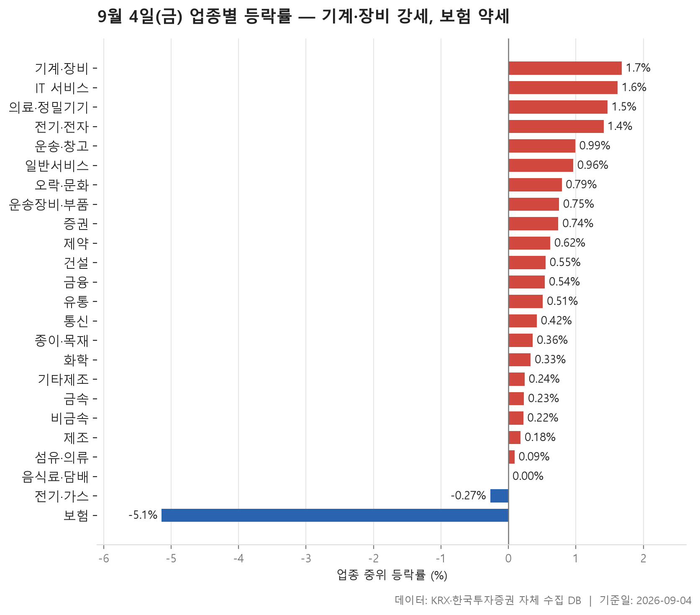
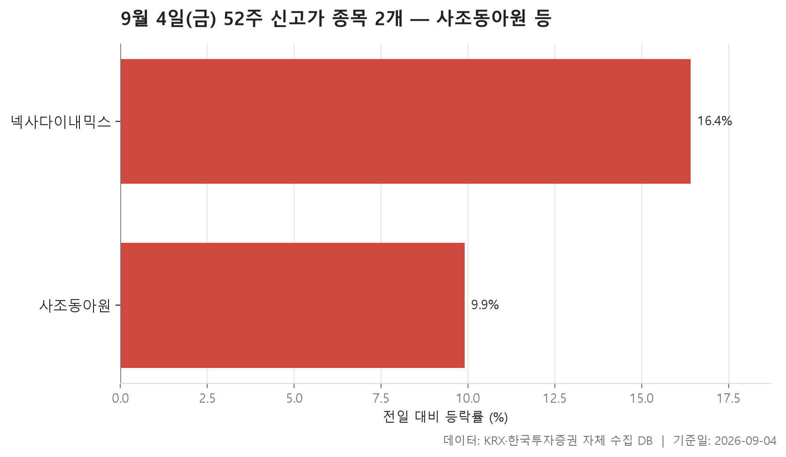
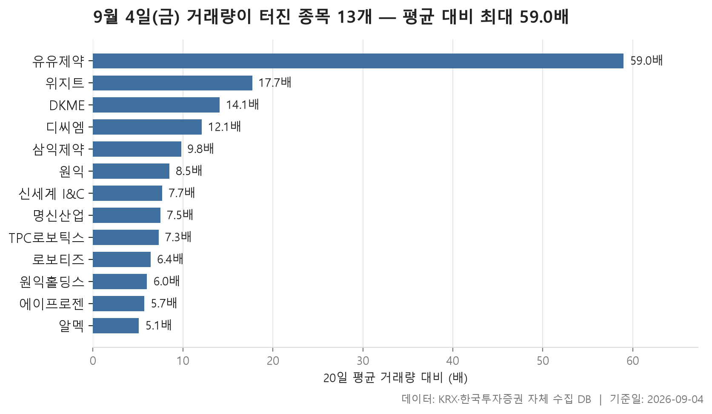

9월 4일 금요일 시장은 한쪽으로 기운 하루였습니다. 24개 업종을 중위 등락률로 줄 세워 보면 한가운데 놓인 값이 +0.53%, 그리고 24개 가운데 21개가 플러스입니다. 마이너스로 마감한 업종은 두 개뿐. 이 정도면 어느 업종을 골라 봐도 오른 종목이 더 많았던 날에 가깝습니다.

다만 표를 위아래로 훑으면 균질한 상승은 아니었다는 것도 보입니다. 위쪽은 기계·장비(+1.68%)를 필두로 기술 쪽 업종들이 촘촘히 붙어 있고, 아래쪽은 보험(-5.14%) 하나가 다른 업종들과 뚝 떨어진 자리에 홀로 놓여 있습니다. 가운데 구간은 0%대 초중반에 여러 업종이 겹쳐 있어 사실상 순위를 매기는 의미가 크지 않을 정도로 촘촘합니다.

오늘은 이 업종 표를 먼저 보고, 52주 최고가를 새로 쓴 종목 두 개, 그리고 평소 거래량의 다섯 배를 넘긴 13개 종목을 차례로 살펴봅니다. 각 표가 서로 다른 각도에서 같은 하루를 비추고 있어서, 세 개를 겹쳐 놓으면 오늘 시장의 무게중심이 어디에 있었는지가 조금 더 또렷해집니다.

> 기준일: 2026-09-04 · 집계: 자체 수집 데이터베이스

## 업종 등락률 — 24개 중 21개 상승

맨 위 네 자리를 기계·장비, IT 서비스, 의료·정밀기기, 전기·전자가 차지했습니다. 네 업종 모두 중위 등락률이 +1.4%를 넘고, 업종 안에서 오른 종목이 열 곳 중 일곱 곳 이상입니다. 특히 기계·장비는 207개 종목 가운데 상승비율이 80.20%로, 열 곳 중 여덟 곳가량이 올랐다는 뜻입니다. 이런 경우 순위를 만든 것은 몇몇 급등주가 아니라 업종 전체의 무게입니다. 실제로 기계·장비의 주도종목인 TPC로보틱스가 +30.00% 상한가를 기록했지만, 이 한 종목이 업종 평균을 밀어올린 폭은 0.14%p에 그칩니다. 중위값과 평균의 차이는 그보다 훨씬 크니, 상한가 한 종목이 만든 그림이 아니라는 이야기지요.

거래대금 쪽을 보면 무게중심이 더 분명합니다. 전기·전자 한 업종에 116,066.30억원이 몰렸는데, 이는 다른 어느 업종과도 견주기 어려운 규모입니다. 그 뒤로 기계·장비와 금융이 따라붙습니다. 종목수가 368개로 가장 많은 업종이라는 점을 감안해도, 돈이 어디에 모여 있었는지는 어렵지 않게 읽힙니다. 반대로 종이·목재나 기타제조처럼 거래대금이 수십억원 수준에 머문 업종도 있어서, 같은 '플러스 마감'이라도 시장의 관심 정도는 하늘과 땅 차이였습니다.

중간 구간에서 눈에 걸리는 것은 중위값과 평균이 반대 방향을 가리키는 업종들입니다. 비금속은 한가운데 값이 +0.22%인데 평균은 -0.01%, 섬유·의류는 중위 +0.09%에 평균 -0.46%입니다. 두 업종의 주도종목이 각각 -11.10%, -30.00%로 크게 밀렸고, 그 한 종목이 업종 평균을 끌어내린 폭이 -0.31%p와 -0.61%p로 계산됩니다. 즉 대다수 종목은 소폭이나마 올랐는데 소수의 큰 하락이 평균을 아래로 당긴 구조입니다. 평균만 보고 '약했다'고 판단하면 놓치는 대목이지요.

바닥 쪽은 성격이 다릅니다. 보험은 11개 종목 가운데 오른 종목이 하나도 없었습니다. 상승비율이 0.00%라는 것은 예외 없이 전부 내렸다는 뜻이고, 중위값 -5.14%와 평균 -4.79%가 서로 가까운 것도 특정 종목이 아니라 업종 전체가 함께 움직였음을 보여 줍니다. 주도종목으로 잡힌 흥국화재의 -6.69%조차 업종 안에서 유별난 값이라기보다 무리 안의 한 사례에 가깝습니다. 전기·가스도 마이너스였지만 -0.27%로 폭이 작고 10개 중 넷이 올라, 보험과는 결이 다릅니다. 왜 보험만 이렇게 따로 떨어졌는지는 이 표만으로는 알 수 없습니다.

| 업종 | 종목수(개) | 중위등락률(%) | 평균등락률(%) | 상승비율(%) | 주도종목 | 주도종목등락률(%) | 평균기여도(%p) | 거래대금합계(억원) |
|---|---|---|---|---|---|---|---|---|
| 기계·장비 | 207 | +1.68 | +2.83 | 80.20 | TPC로보틱스 | +30.00 | 0.14 | 19,215.10 |
| IT 서비스 | 244 | +1.62 | +2.36 | 78.70 | E8 | +30.00 | 0.12 | 6,778.10 |
| 의료·정밀기기 | 97 | +1.47 | +1.84 | 72.20 | 케이엔알시스템 | +16.08 | 0.17 | 2,137.80 |
| 전기·전자 | 368 | +1.41 | +1.79 | 75.80 | 디케이티 | +16.67 | 0.05 | 116,066.30 |
| 운송·창고 | 28 | +0.99 | +1.31 | 78.60 | 제주항공 | +5.72 | 0.20 | 2,474.00 |
| 일반서비스 | 165 | +0.96 | +1.29 | 65.50 | 큐리언트 | +17.30 | 0.10 | 5,495.10 |
| 오락·문화 | 66 | +0.79 | +0.96 | 66.70 | 아티스트컴퍼니 | +9.38 | 0.14 | 636.40 |
| 운송장비·부품 | 132 | +0.75 | +1.20 | 71.20 | 디와이씨 | +15.02 | 0.11 | 7,479.20 |
| 증권 | 17 | +0.74 | +1.23 | 82.40 | 한화투자증권 | +8.97 | 0.53 | 1,194.40 |
| 제약 | 166 | +0.62 | +1.01 | 68.10 | 삼익제약 | +19.22 | 0.12 | 7,220.40 |
| 건설 | 50 | +0.55 | +0.73 | 66.00 | 한신공영 | +4.76 | 0.10 | 3,008.50 |
| 금융 | 111 | +0.54 | +1.12 | 61.30 | 헥토파이낸셜 | +13.48 | 0.12 | 18,988.30 |
| 유통 | 153 | +0.51 | +0.81 | 59.50 | 원익 | +17.13 | 0.11 | 5,493.00 |
| 통신 | 12 | +0.42 | +0.54 | 75.00 | SK텔레콤 | +3.93 | 0.33 | 1,209.50 |
| 종이·목재 | 27 | +0.36 | +0.53 | 66.70 | 아세아제지 | +2.67 | 0.10 | 30.30 |
| 화학 | 221 | +0.33 | +0.57 | 62.00 | 원익홀딩스 | +29.91 | 0.14 | 11,069.90 |
| 기타제조 | 14 | +0.24 | +0.13 | 57.10 | 제이에스티나 | +4.16 | 0.30 | 35.90 |
| 금속 | 130 | +0.23 | +0.68 | 58.50 | 알멕 | +20.07 | 0.15 | 3,495.40 |
| 비금속 | 36 | +0.22 | -0.01 | 55.60 | 서산 | -11.10 | -0.31 | 1,094.20 |
| 제조 | 8 | +0.18 | +0.22 | 62.50 | 이월드 | -3.10 | -0.39 | 24.70 |
| 섬유·의류 | 49 | +0.09 | -0.46 | 53.10 | 원풍물산 | -30.00 | -0.61 | 291.50 |
| 음식료·담배 | 83 | 0.00 | +0.24 | 45.80 | 사조동아원 | +9.90 | 0.12 | 1,423.70 |
| 전기·가스 | 10 | -0.27 | -0.36 | 40.00 | 한국가스공사 | -6.90 | -0.69 | 604.40 |
| 보험 | 11 | -5.14 | -4.79 | 0.00 | 흥국화재 | -6.69 | -0.61 | 3,269.30 |

## 52주 신고가 2개 — 최고 넥사다이내믹스 16.41%

52주 최고가를 새로 쓴 종목은 단 둘이었습니다. 업종의 여덟 곳 중 하나꼴이 오른 날치고는 적은 숫자인데, 이는 오늘의 상승이 폭은 넓었어도 개별 종목을 1년 최고 수준까지 밀어올릴 만큼 깊지는 않았다는 뜻으로 읽을 수 있습니다. 신고가는 하루치 상승이 아니라 지난 1년의 가격대를 통째로 넘어서야 나오는 기록이니까요.

두 종목 다 오늘 두 자릿수에 가까운 상승을 기록했습니다. 사조동아원이 +9.90%, 넥사다이내믹스가 +16.41%. 시가총액은 1,207억원과 1,106억원으로 비슷한 체급이고, 한 곳은 KOSPI, 다른 한 곳은 KOSDAQ으로 시장도 갈립니다. 업종도 음식료·담배와 기계·장비로 서로 다릅니다.

흥미로운 것은 두 종목의 거래대금 차이입니다. 사조동아원은 12.80억원, 넥사다이내믹스는 82.20억원. 비슷한 시가총액에서 신고가를 냈는데 손바뀐 규모는 크게 벌어져 있습니다. 앞선 업종 표에서 사조동아원은 음식료·담배의 주도종목으로도 잡혀 있었는데, 그 업종은 오른 종목이 절반에 못 미쳤던 곳입니다. 약한 업종 안에서 홀로 1년 고점을 넘긴 셈이지요. 넥사다이내믹스 쪽은 반대로, 오늘 가장 강했던 업종 안에서 나온 신고가입니다.

| 종목명 | 종목코드 | 시장 | 업종 | 종가(원) | 등락률(%) | 이전52주최고(원) | 거래대금(억원) | 시가총액(억원) |
|---|---|---|---|---|---|---|---|---|
| 사조동아원 | 008040 | KOSPI | 음식료·담배 | 8,550 | +9.90 | 8,460 | 12.80 | 1,207 |
| 넥사다이내믹스 | 351320 | KOSDAQ | 기계·장비 | 3,725 | +16.41 | 3,445 | 82.20 | 1,106 |

## 거래량 급증 13개 — 최고 유유제약 59배

거래량이 직전 20거래일 평균의 다섯 배를 넘긴 종목은 13개였습니다. 배수의 한가운데 값이 7.70배이니 대부분은 평소의 여덟 배 안팎 수준에 몰려 있고, 위쪽 끝에 유유제약이 59배로 홀로 떨어져 있습니다. 그런데 이 종목의 등락률은 +0.92%에 그칩니다. 거래량이 평소의 수십 배로 뛰었는데 가격은 거의 제자리였다는 것, 표에서 가장 어긋나 보이는 대목입니다. 사는 쪽과 파는 쪽이 그만큼 팽팽하게 맞섰다고 볼 수도 있고, 다른 사정이 있었을 수도 있지만 이 표로는 거기까지입니다.

반대로 배수는 낮은데 가격이 크게 움직인 경우도 있습니다. 알멕은 5.10배로 목록에서 가장 낮은 자리인데 +20.07%, 원익홀딩스는 6.00배에 +29.91%, 로보티즈는 6.40배에 +22.54%입니다. 거래량 배수와 등락률이 나란히 가지 않는다는 것을 이 세 종목이 잘 보여 줍니다. 평소보다 조금 더 거래되면서도 가격은 크게 뛴 쪽이 있고, 폭발적으로 거래되면서도 가격은 붙박이인 쪽이 있는 것이지요.

체급 차이도 큽니다. 로보티즈의 시가총액이 44,661억원으로 목록에서 압도적으로 크고, 그다음 원익홀딩스가 17,379억원. 나머지는 대체로 그보다 한콜 작은 체급에 흩어져 있습니다. 거래대금으로 봐도 로보티즈가 4,281.80억원으로 가장 크고, 원익이 1,450.40억원, 원익홀딩스가 1,449.50억원으로 뒤를 잇습니다. 나머지는 대부분 수십억원대에 머뭅니다. 같은 '거래량 급증'이라도 실제로 오간 돈의 규모는 두세 종목에 크게 치우쳐 있었습니다.

업종 구성은 앞의 표와 맞물립니다. 13개가 7개 업종에 나뉘는데 기계·장비가 4개로 가장 많고, 제약이 3개로 그 뒤를 잇습니다. 오늘 중위 등락률 1위였던 업종에서 거래량 급증 종목도 가장 많이 나온 셈입니다. 시장별로는 KOSPI 6개, KOSDAQ 7개로 거의 반반. 목록에서 유일하게 내린 종목은 디씨엠으로 -0.26%인데, 거래량은 12.10배로 뛰었습니다. 이 역시 거래가 몰렸다고 해서 가격이 한 방향으로 간다는 보장은 없다는 사례입니다.

| 종목명 | 종목코드 | 시장 | 업종 | 종가(원) | 등락률(%) | 거래량(주) | 평균거래량(주) | 배수(배) | 거래대금(억원) | 시가총액(억원) |
|---|---|---|---|---|---|---|---|---|---|---|
| 유유제약 | 000220 | KOSPI | 제약 | 3,840 | +0.92 | 2,777,715 | 47,060 | 59.00 | 114.40 | 605 |
| 위지트 | 036090 | KOSDAQ | 기계·장비 | 1,361 | +8.53 | 6,481,980 | 366,256 | 17.70 | 96.20 | 579 |
| DKME | 015590 | KOSPI | 기계·장비 | 1,492 | +11.26 | 720,970 | 51,136 | 14.10 | 10.70 | 797 |
| 디씨엠 | 024090 | KOSPI | 금속 | 11,730 | -0.26 | 47,505 | 3,929 | 12.10 | 5.50 | 1,337 |
| 삼익제약 | 014950 | KOSDAQ | 제약 | 6,760 | +19.22 | 8,790,580 | 900,027 | 9.80 | 600.20 | 681 |
| 원익 | 032940 | KOSDAQ | 유통 | 10,050 | +17.13 | 14,611,607 | 1,715,974 | 8.50 | 1,450.40 | 1,828 |
| 신세계 I&C | 035510 | KOSPI | IT 서비스 | 13,860 | +6.70 | 300,736 | 38,847 | 7.70 | 42.20 | 1,938 |
| 명신산업 | 009900 | KOSPI | 운송장비·부품 | 8,630 | +11.07 | 1,467,289 | 196,555 | 7.50 | 129.70 | 4,528 |
| TPC로보틱스 | 048770 | KOSDAQ | 기계·장비 | 3,965 | +30.00 | 1,859,689 | 256,301 | 7.30 | 70.10 | 622 |
| 로보티즈 | 108490 | KOSDAQ | 기계·장비 | 304,500 | +22.54 | 1,433,047 | 223,824 | 6.40 | 4,281.80 | 44,661 |
| 원익홀딩스 | 030530 | KOSDAQ | 화학 | 22,500 | +29.91 | 7,136,648 | 1,190,428 | 6.00 | 1,449.50 | 17,379 |
| 에이프로젠 | 007460 | KOSPI | 제약 | 2,160 | +3.85 | 2,885,194 | 502,796 | 5.70 | 69.30 | 536 |
| 알멕 | 354320 | KOSDAQ | 금속 | 32,300 | +20.07 | 293,805 | 57,912 | 5.10 | 94.10 | 2,064 |

## 정리

정리하면 9월 4일은 폭은 넓고 깊이는 얕았던 하루입니다. 24개 업종 중 21개가 플러스로 마감했고 한가운데 값도 +0.53%였지만, 1년 최고가를 새로 쓴 종목은 둘뿐이었습니다. 강한 쪽에서는 기계·장비를 중심으로 상승이 업종 전반에 고르게 퍼졌고, 약한 쪽에서는 보험 11개 종목이 예외 없이 함께 내리며 홀로 다른 그림을 만들었습니다.

다만 이 세 표는 모두 하루치 가격과 거래량을 정리한 것일 뿐입니다. 어떤 업종이 왜 그렇게 움직였는지, 거래량이 평소의 수십 배로 뛴 종목에 무슨 일이 있었는지는 여기 담긴 숫자로 답할 수 없습니다. 특히 거래량 급증은 방향을 알려 주는 신호가 아니라 관심이 몰렸다는 사실만 보여 준다는 점, 오늘 목록 안에서도 등락률이 제각각이었다는 점을 함께 기억해 두시면 좋겠습니다.

## 집계 기준

**업종 등락률**

- **기준**: 2026-09-03 종가 → 2026-09-04 종가
- **순위**: 업종 내 종목 등락률의 중위값 (평균은 참고용으로 함께 표시)
- **주도종목**: 그 업종에서 등락률 절대값이 가장 큰 종목 (동점이면 거래대금이 큰 쪽)
- **평균기여도**: 그 종목 하나가 업종 평균을 움직인 폭 (등락률 ÷ 종목수). 중위값과 평균의 격차가 이 값에 가까우면 평균을 만든 것이 그 종목이고, 훨씬 크면 다른 종목들도 함께 움직인 것입니다
- **필터**: 업종 내 보통주 5종목 이상
- **전체업종중위등락률(%)**: 0.53

**52주 신고가**

- **기준**: 종가 > 직전 52주 최고가
- **관측구간**: 2025-08-22 ~ 2026-09-03 (252거래일)
- **필터**: 시가총액 500억 이상, 거래대금 3억 이상, 보통주

**거래량 급증**

- **기준**: 당일 거래량 ≥ 직전 20거래일 평균 × 5
- **관측구간**: 2026-08-06 ~ 2026-09-03 (20거래일)
- **필터**: 시가총액 500억 이상, 거래대금 3억 이상, 보통주

## 데이터 출처 및 유의사항

- **데이터출처**: 한국거래소(KRX) 공시 데이터와 한국투자증권 OpenAPI 를 직접 수집해 구축한 자체 데이터베이스
- **집계방식**: 수집·집계·차트 생성을 직접 구현한 파이프라인에서 자동 산출
- **작성고지**: 본문의 표·통계·차트는 자체 데이터베이스에서 계산된 값이며, 문장 작성 과정에 AI 도구를 활용했습니다.
- **면책**: 본 글은 정보 제공을 목적으로 하며 특정 종목의 매수·매도를 추천하지 않습니다. 제시된 수치는 과거 데이터이고 미래 수익을 보장하지 않습니다. 투자 판단과 그 결과에 대한 책임은 투자자 본인에게 있습니다.

