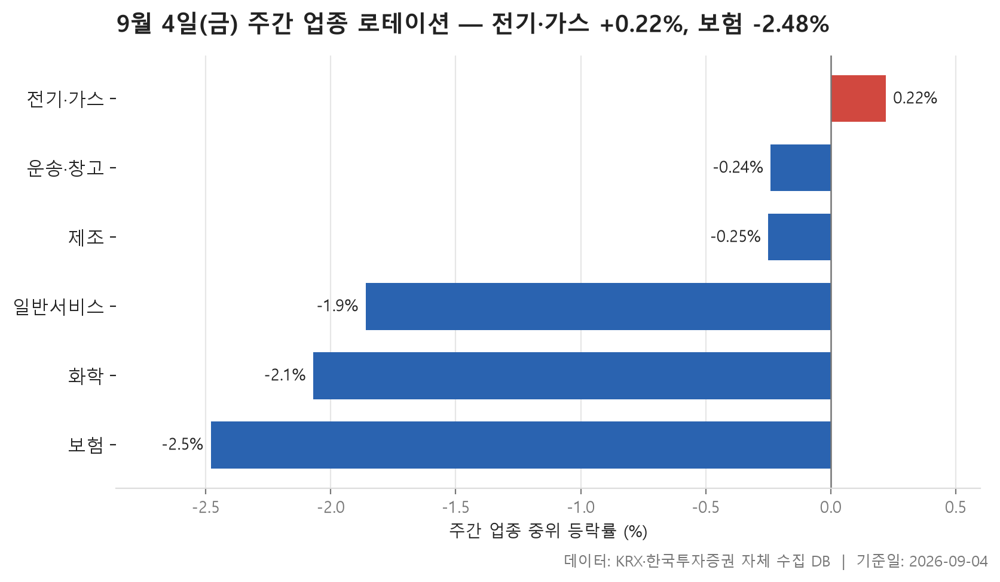
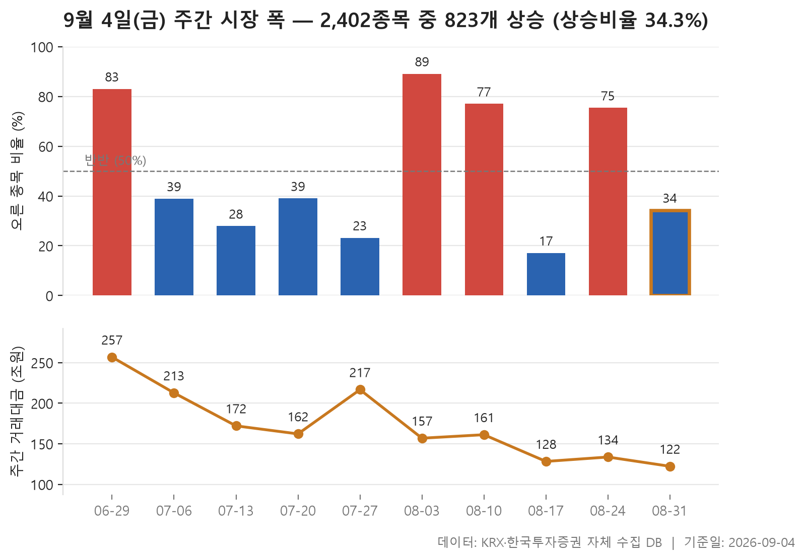
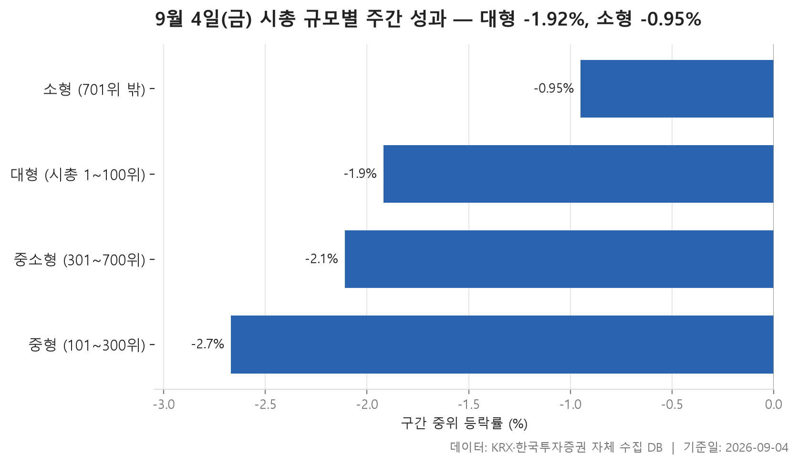

9월 4일 금요일로 한 주가 끝났습니다. 이번 주간 리뷰는 세 장의 표를 놓고 봅니다. 첫째, 지난주 마지막 거래일 종가를 출발선으로 삼아 5거래일 동안 24개 업종이 어떻게 갈렸는지. 둘째, 최근 10주 동안 오른 종목과 내린 종목의 머릿수가 어떻게 오갔는지. 셋째, 같은 기간을 시가총액 순위로 네 토막 내어 큰 종목과 작은 종목 중 어느 쪽이 덜 밀렸는지입니다.

먼저 결론에 해당하는 그림을 말해 두는 편이 읽기 편할 것 같습니다. 이번 주는 오른 쪽을 찾기가 쉽지 않은 주였습니다. 업종 표에서 상위 3개에 든 업종들조차 중위 등락률이 0 언저리에 걸쳐 있고, 그중 플러스는 하나뿐입니다. 규모별로 나눈 표는 네 구간이 전부 마이너스입니다. 그래서 이번 주 표는 "어디가 얼마나 올랐나"보다 "어디가 덜 내렸나"를 읽는 쪽이 실제에 가깝습니다.

다만 표 안에는 방향만으로 정리되지 않는 대목이 몇 군데 있습니다. 업종 전체가 밀렸는데 그 안에서 크게 튄 종목이 주도종목으로 잡힌 곳, 중위값과 평균이 서로 다른 얘기를 하는 구간, 그리고 지난 열 주 동안 시장의 방향이 거의 격주로 뒤집힌 흔적 같은 것들입니다. 하나씩 짚어 보겠습니다.

> 기준일: 2026-09-04 · 집계: 자체 수집 데이터베이스

## 주간 업종 로테이션 — 6개 중 5개 하락

가장 눈에 먼저 들어오는 것은 상위권의 높이입니다. 24개 업종을 중위 등락률로 줄 세웠을 때 맨 위에 놓인 전기·가스가 +0.22%. 위쪽 세 자리 중 나머지 둘은 이미 마이너스로 내려와 있습니다. 보통 주간 로테이션 표에서 상위 3개는 '이번 주 돈이 몰린 곳'을 뜻하지만, 이번 주에 한해서는 '내림세를 가장 적게 맞은 곳' 정도로 읽는 편이 맞습니다. 반대편 끝, 가장 낮은 자리에 놓인 보험이 -2.48%인데, 위아래 끝의 간격 자체가 그리 넓지 않다는 점도 함께 봐 둘 만합니다.

표에서 어긋나 보이는 대목은 상위 세 업종입니다. 전기·가스는 한가운데 값이 플러스인데 평균은 -1.01%로 내려가 있습니다. 열 종목 중 다섯이 올랐으니 머릿수로는 반반인데, 평균만 아래로 끌려간 셈입니다. 이 업종의 주도종목으로 잡힌 곳이 -10.67%를 기록했고, 그 한 종목이 업종 평균을 -1.07%p 움직였습니다. 종목 수가 열 개뿐인 업종에서는 크게 빠진 한 곳이 평균 전체를 아래로 당깁니다. 제조는 같은 현상이 더 극단적으로 나타납니다. 여덟 종목 중 절반이 올랐는데 평균은 -4.03%, 주도종목 한 곳이 -40.28%로 밀리면서 평균에 -5.04%p를 얹었습니다. 즉 이 업종의 평균은 사실상 한 종목의 기록입니다.

반대 방향의 어긋남도 있습니다. 운송·창고는 한가운데 값이 -0.24%로 살짝 마이너스인데 평균은 +0.75%로 올라가 있습니다. 오른 종목 비율도 절반에는 못 미치고요. 위로 크게 튄 소수가 평균을 끌어올린 모양인데, 주도종목이 +26.48%로 업종 평균에 0.98%p를 보탠 것이 그 일부를 설명합니다. 이런 업종은 '업종이 좋았다'기보다 '몇 종목이 좋았다'에 가깝습니다.

아래쪽 세 업종은 성격이 다릅니다. 일반서비스는 종목이 163개, 화학은 218개로 덩치가 큰데, 이 규모에서는 한 종목이 평균을 흔들기 어렵습니다. 실제로 두 업종 모두 중위값과 평균이 크게 벌어지지 않았고, 오른 종목 비율도 셋 중 하나에 조금 못 미치는 수준으로 비슷합니다. 화학의 주도종목은 -55.11%까지 밀렸지만 업종 평균에 준 영향은 -0.25%p에 그쳤고, 일반서비스의 주도종목은 +38.30%로 크게 올랐어도 평균 기여는 0.23%p뿐입니다. 폭이 넓은 업종에서는 개별 종목의 큰 움직임이 이렇게 희석됩니다. 보험은 열한 종목 중 오른 곳이 다섯 중 하나꼴에 그쳤고, 중위와 평균이 나란히 마이너스 2%대라 위아래 어느 쪽으로도 예외가 크지 않았던 업종으로 보입니다.

| 업종 | 종목수(개) | 주간중위등락률(%) | 주간평균등락률(%) | 상승비율(%) | 주도종목 | 주도종목등락률(%) | 평균기여도(%p) |
|---|---|---|---|---|---|---|---|
| 전기·가스 | 10 | +0.22 | -1.01 | 50.00 | SGC에너지 | -10.67 | -1.07 |
| 운송·창고 | 27 | -0.24 | +0.75 | 48.10 | STX그린로지스 | +26.48 | 0.98 |
| 제조 | 8 | -0.25 | -4.03 | 50.00 | 에넥스 | -40.28 | -5.04 |
| 일반서비스 | 163 | -1.86 | -1.88 | 29.40 | 페니트리움바이오 | +38.30 | 0.23 |
| 화학 | 218 | -2.07 | -2.63 | 30.30 | 코이즈 | -55.11 | -0.25 |
| 보험 | 11 | -2.48 | -2.42 | 18.20 | 미래에셋생명 | -14.14 | -1.29 |

## 주간 시장 폭 — 10주 중 이번 주는 2,402개 중 823개 상승

이번 주는 2,402개 종목 가운데 823개가 오르고 1,545개가 내렸습니다. 오른 종목을 내린 종목으로 나눈 값이 0.53배이니, 내린 쪽이 오른 쪽의 두 배 가까이 됩니다. 상승 비율로는 34.30%. 열 곳 중 서너 곳이 오른 셈입니다.

그런데 10주를 늘어놓고 보면 이 주가 특별히 나쁜 주라고 말하기도 애매합니다. 지난 열 주 동안 이 배수의 한가운데 값이 0.65배였으니, 표에 담긴 기간 전체로 보면 내린 종목이 더 많은 주가 오히려 기본값에 가까웠습니다. 눈에 띄는 것은 값의 폭입니다. 가장 높았던 주는 2026-08-03로 8.54배, 가장 낮았던 주는 2026-08-17로 0.21배. 같은 8월 안에서 이 정도로 뒤집혔습니다.

순서대로 따라가 보면 방향이 거의 한 주 걸러 바뀝니다. 6월 마지막 주에 오른 종목이 1,995개로 압도적이었다가, 7월 들어 세 주 연속 내린 종목이 더 많은 상태가 이어집니다. 8월 초에 다시 2,136개가 오르며 크게 뒤집히고, 그다음 주에 1,963개가 내리며 또 뒤집히고, 그다음 주에 1,800개가 오르며 다시 뒤집힙니다. 이런 패턴에서는 어느 한 주의 숫자만 떼어 놓고 방향을 말하기가 어렵습니다.

거래대금 쪽은 조금 다른 얘기를 합니다. 6월 마지막 주 256.80조원이 표에서 가장 큰 값이고, 그 뒤로 주차 오르낙가림은 있었지만 대체로 줄어드는 흐름입니다. 이번 주는 122.30조원으로 표에 실린 열 주 중 가장 적습니다. 오른 종목이 많았던 주와 적었던 주가 번갈아 나타나는 동안 거래대금은 방향과 무관하게 완만히 줄어든 셈인데, 왜 그런지는 이 표만으로 알 수 없습니다.

| 주 | 거래일수(일) | 종목수(개) | 상승(개) | 보합(개) | 하락(개) | 상승비율(%) | ADR(배) | 총거래대금(조원) |
|---|---|---|---|---|---|---|---|---|
| 2026-08-31 | 5 | 2,402 | 823 | 34 | 1,545 | 34.30 | 0.53 | 122.30 |
| 2026-08-24 | 5 | 2,387 | 1,800 | 28 | 559 | 75.40 | 3.22 | 133.70 |
| 2026-08-17 | 4 | 2,388 | 409 | 16 | 1,963 | 17.10 | 0.21 | 128.30 |
| 2026-08-10 | 5 | 2,386 | 1,838 | 22 | 526 | 77.00 | 3.49 | 161.20 |
| 2026-08-03 | 5 | 2,396 | 2,136 | 10 | 250 | 89.10 | 8.54 | 156.90 |
| 2026-07-27 | 5 | 2,402 | 557 | 21 | 1,824 | 23.20 | 0.31 | 216.70 |
| 2026-07-20 | 5 | 2,404 | 937 | 28 | 1,439 | 39.00 | 0.65 | 162.20 |
| 2026-07-13 | 4 | 2,416 | 673 | 26 | 1,717 | 27.90 | 0.39 | 172.10 |
| 2026-07-06 | 5 | 2,411 | 937 | 35 | 1,439 | 38.90 | 0.65 | 212.70 |
| 2026-06-29 | 5 | 2,404 | 1,995 | 3 | 406 | 83.00 | 4.91 | 256.80 |

## 시총 규모별 주간 성과 — 소형이 0.97%p 앞섬

네 구간이 전부 마이너스입니다. 그래서 여기서도 순서는 '덜 내린 순서'입니다. 가장 위에 놓인 것은 소형 구간으로 -0.95%, 가장 아래는 중형 구간으로 -2.67%. 네 값의 가운데에 놓이는 값은 -2.02%이니, 소형 구간만 홀로 위로 떨어져 있고 나머지 셋은 마이너스 2% 안팎에 몰려 있는 모양입니다. 대형과 소형의 차이를 하나로 줄인 값이 -0.97로, 이번 주는 작은 쪽이 앞섰습니다.

순위가 커질수록 좋아지는 단순한 그림은 아니라는 점도 봐 둘 만합니다. 시총 1~100위 구간보다 101~300위 구간이 더 많이 밀렸고, 그다음 구간에서 다시 조금 회복됩니다. 오른 종목 비율도 앞의 세 구간은 넷 중 하나 안팎으로 거의 붙어 있다가 마지막 구간에서만 눈에 띄게 올라갑니다. 결국 이번 주 규모별 차이는 '위쪽 700위 안'과 '그 밖'의 대비에 가깝습니다.

중위값과 평균이 갈라지는 방향도 구간마다 다릅니다. 위의 두 구간은 평균이 중위보다 더 아래에 있고, 아래 두 구간은 평균이 중위보다 위에 있습니다. 큰 종목 쪽에서는 크게 밀린 종목이 평균을 더 끌어내렸고, 작은 종목 쪽에서는 크게 오른 소수가 평균을 위로 밀어 올렸다는 뜻으로 읽힙니다. 실제로 각 구간에서 등락 폭이 가장 컸던 종목을 보면 대형 구간이 +18.31%, 중형이 +25.83%, 중소형이 +51.11%, 소형이 +55.48%로, 아래로 내려갈수록 위쪽 꼬리가 길어집니다. 다만 구간 전체가 마이너스라는 사실은 그대로입니다.

거래대금은 규모 순서를 그대로 따릅니다. 시총 상위 100개 종목에 84.10조원이 몰렸고, 그 아래 200개가 17.60조원, 400개가 8.90조원, 나머지 1,702개를 다 합쳐도 9.90조원입니다. 종목 수로는 소형 구간이 압도적인데 돈이 도는 규모로는 대형 구간과 비교가 되지 않습니다. 이번 주 중위 등락률에서 소형이 앞섰다고 해도, 그 값이 대변하는 거래의 크기는 이 정도라는 점은 함께 놓고 봐야 합니다.

| 구간 | 종목수(개) | 주간중위등락률(%) | 주간평균등락률(%) | 상승비율(%) | 주도종목 | 주도종목등락률(%) | 주간거래대금(조원) |
|---|---|---|---|---|---|---|---|
| 대형 (시총 1~100위) | 100 | -1.92 | -2.32 | 25.00 | SK이노베이션 | +18.31 | 84.10 |
| 중형 (101~300위) | 200 | -2.67 | -2.94 | 24.50 | 로보티즈 | +25.83 | 17.60 |
| 중소형 (301~700위) | 400 | -2.11 | -1.52 | 27.00 | 피노 | +51.11 | 8.90 |
| 소형 (701위 밖) | 1,702 | -0.95 | -0.54 | 37.70 | JW신약 | +55.48 | 9.90 |

## 정리

정리하면 이번 주는 업종으로 보나 규모로 보나 대부분의 칸이 마이너스였고, 그 안에서 전기·가스가 +0.22%로 유일하게 한가운데 값이 플러스였으며, 시총 순위 700위 밖 구간이 -0.95%로 상대적으로 덜 밀렸습니다. 다만 열 주짜리 표를 함께 보면 이런 주가 최근에 드문 일은 아니었습니다. 오른 종목이 더 많은 주와 적은 주가 거의 번갈아 나타났으니까요.

한계도 분명합니다. 이 표들은 5거래일이라는 짧은 창을 잘라 본 것이고, 왜 그런 움직임이 나왔는지에 대한 정보는 하나도 담고 있지 않습니다. 특히 종목 수가 열 개 안팎인 업종의 평균값은 한 종목의 기록에 좌우되므로, 그 숫자를 업종 전체의 성격으로 읽으면 곤란합니다. 여기 적힌 것은 지나간 5일과 지나간 10주의 기록일 뿐, 다음 주에 대해서는 아무것도 말해 주지 않습니다.

## 집계 기준

**주간 업종 로테이션**

- **기준**: 2026-08-28 종가 → 2026-09-04 종가
- **구간**: 2026-08-31 시작 주 — 직전 주 마지막 거래일 종가를 출발선으로 삼습니다
- **거래일수**: 5
- **순위**: 업종 내 종목 등락률의 중위값 (평균은 참고용으로 함께 표시)
- **선정**: 전체 24개 업종 중 상위 3개 · 하위 3개
- **주도종목**: 그 업종에서 같은 기간 등락률 절대값이 가장 큰 종목 (동점이면 거래대금이 큰 쪽)
- **평균기여도**: 그 종목 하나가 업종 평균을 움직인 폭 (등락률 ÷ 종목수)
- **필터**: 업종 내 보통주 5종목 이상

**주간 시장 폭**

- **기준**: 각 주의 마지막 거래일 종가를 직전 주 마지막 거래일 종가와 비교
- **주**: 그 주의 월요일 (달력 기준). 거래일 수는 연휴에 따라 다릅니다
- **ADR**: 상승 종목 수 ÷ 하락 종목 수. 1 이면 반반, 2 면 오른 종목이 두 배
- **총거래대금**: 그 주 거래일 전체의 거래대금 합계
- **모집단**: 거래가 있었던 보통주 (거래정지·액면 변경 종목 제외)

**시총 규모별 주간 성과**

- **기준**: 2026-08-28 종가 → 2026-09-04 종가
- **구간**: 기준일 시가총액 순위로 자릅니다 (금액으로 자르면 장이 오른 해에 전부 위 구간으로 올라가 해마다 다른 표가 됩니다)
- **순위**: 구간 내 종목 등락률의 중위값 (평균은 참고용으로 함께 표시)
- **주도종목**: 그 구간에서 같은 기간 등락률 절대값이 가장 큰 종목 (동점이면 거래대금이 큰 쪽)
- **대형소형격차**: -0.97
- **모집단**: 거래가 있었던 보통주 (거래정지·액면 변경 종목 제외)

## 데이터 출처 및 유의사항

- **데이터출처**: 한국거래소(KRX) 공시 데이터와 한국투자증권 OpenAPI 를 직접 수집해 구축한 자체 데이터베이스
- **집계방식**: 수집·집계·차트 생성을 직접 구현한 파이프라인에서 자동 산출
- **작성고지**: 본문의 표·통계·차트는 자체 데이터베이스에서 계산된 값이며, 문장 작성 과정에 AI 도구를 활용했습니다.
- **면책**: 본 글은 정보 제공을 목적으로 하며 특정 종목의 매수·매도를 추천하지 않습니다. 제시된 수치는 과거 데이터이고 미래 수익을 보장하지 않습니다. 투자 판단과 그 결과에 대한 책임은 투자자 본인에게 있습니다.

