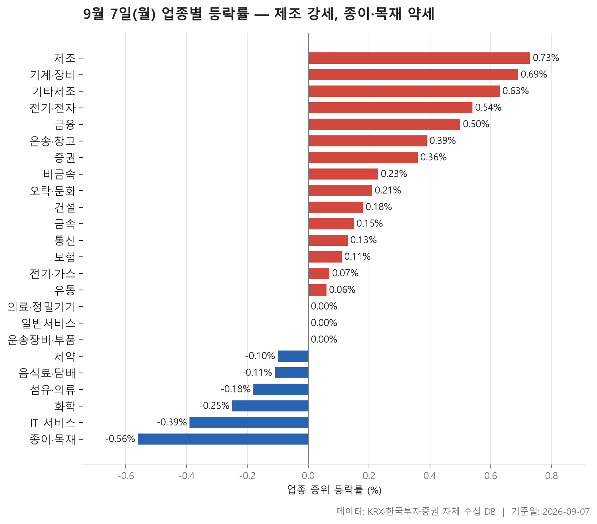
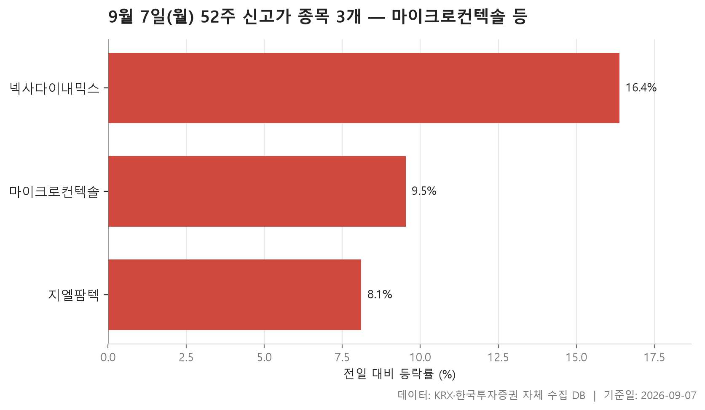
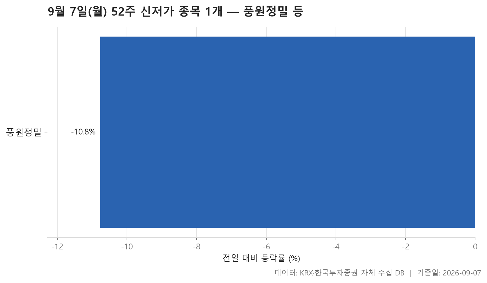
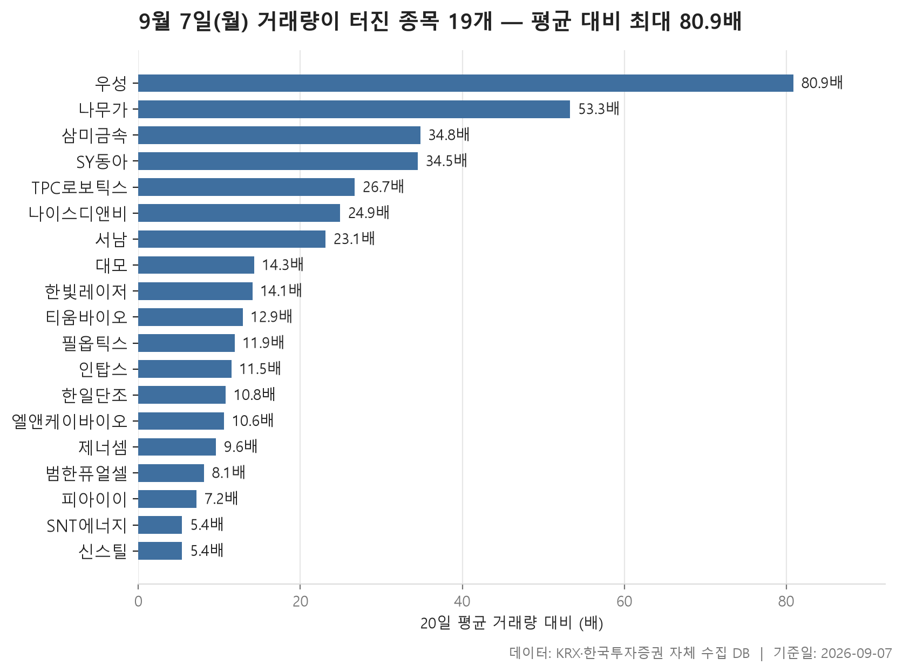

9월 7일 월요일 시장은 한쪽으로 확 기울지 않았습니다. 24개 업종의 중위 등락률을 늘어놓았을 때 한가운데 놓인 값이 +0.12%였고, 양의 값이 15개, 음의 값이 6개였습니다. 방향은 위쪽이 조금 더 많았지만 폭은 크지 않았다는 뜻입니다.

대신 표를 조금 더 들여다보면 그림이 갈립니다. 위쪽에는 제조·기계·장비·전기·전자처럼 물건을 만드는 쪽이 모여 있고, 아래쪽에는 종이·목재, IT 서비스, 화학, 섬유·의류가 붙어 있습니다. 그리고 업종마다 중위값과 평균이 벌어진 정도가 제각각인데, 이 격차가 오늘 시장의 성격을 가장 잘 보여 줍니다.

오늘은 업종 등락률, 52주 최고가를 넘어선 종목과 최저가를 밑돈 종목, 그리고 거래량이 평소보다 크게 늘어난 종목까지 네 갈래로 나눠 보겠습니다. 어느 표든 "왜"는 자료에 없습니다. 표가 말해 주는 범위까지만 짚습니다.

> 기준일: 2026-09-07 · 집계: 자체 수집 데이터베이스

## 업종 등락률 — 24개 중 15개 상승

업종 중위 등락률이 가장 높은 항목은 제조(+0.73%)이고, 가장 낮은 항목은 종이·목재(-0.56%)입니다. 양 끝의 거리가 1%대 초반에 머물러 있으니 업종 간 편차 자체가 크게 벌어진 날은 아니었습니다. 그런데 순위표 위쪽이 제조, 기계·장비(+0.69%), 기타제조(+0.63%), 전기·전자(+0.54%)로 이어지는 모양은 눈여겨볼 만합니다. 그 아래로는 금융, 운송·창고, 증권이 붙고, 중간 지점을 지나면 등락률이 0에 눌린 업종들이 줄줄이 나옵니다. 의료·정밀기기, 일반서비스, 운송장비·부품은 중위 등락률이 0.00%로 딱 멈춰 있었습니다.

가장 강한 제조는 조금 특이합니다. 여덟 종목 가운데 넷 중 셋꼴이 올랐는데도 업종 평균은 +0.23%로 중위값보다 낮게 내려앉았습니다. 이 업종에서 등락률 절대값이 가장 컸던 종목은 시디즈로 -2.23%였고, 이 종목 하나가 업종 평균을 -0.28%p만큼 끌어내린 셈입니다. 종목 수가 여덟 개뿐이면 한 종목의 하락이 평균을 이만큼 흔듭니다. 중위값과 평균의 격차가 그 기여도와 비슷한 크기라면, 평균을 만든 것은 다른 종목들이 아니라 사실상 그 한 종목이라는 뜻이 됩니다.

반대 방향의 어긋남도 있습니다. 기계·장비는 중위값이 +0.69%인데 평균은 +1.47%까지 올라가 있습니다. 이 업종에서 가장 크게 움직인 종목은 수성웹툰(+29.87%)이었지만 종목 수가 206개라 평균에 얹은 폭은 0.15%p에 불과합니다. 격차가 한 종목의 기여도보다 훨씬 크다는 것은, 위로 크게 튄 종목이 여럿 있었다는 이야기입니다. 전기·전자도 비슷한 모양입니다. 중위값 +0.54%에 평균 +1.24%, 그런데 더코디의 +29.97%가 평균에 보탠 것은 0.08%p뿐입니다. 이 업종의 거래대금 합계는 152,672.30억원으로 표에서 압도적으로 큽니다.

아래쪽은 결이 다릅니다. 화학은 중위값이 -0.25%인데 평균은 -0.12%로 덜 내려가 있고, 케이엠제약이 +30.00%를 기록했습니다. 즉 업종 안 대부분은 밀렸지만 몇 종목이 크게 올라 평균만 위로 당겨 놓은 모양입니다. 오른 종목이 열 곳 중 넷꼴이었다는 점도 이를 뒷받침합니다. 반면 IT 서비스는 중위값 -0.39%, 평균 -0.38%로 둘이 거의 붙어 있습니다. 튀는 종목 없이 업종 전체가 고르게 밀렸다는 뜻이죠. 가장 약했던 종이·목재는 오른 종목이 셋 중 하나꼴이었고 거래대금 합계가 33.80억원에 그쳐, 표 안에서 가장 조용한 업종이기도 했습니다. 섬유·의류는 원풍물산이 -29.98%로 하한가 수준까지 밀렸는데, 이 종목 하나가 업종 평균을 -0.60%p 끌어내린 셈입니다.

| 업종 | 종목수(개) | 중위등락률(%) | 평균등락률(%) | 상승비율(%) | 주도종목 | 주도종목등락률(%) | 평균기여도(%p) | 거래대금합계(억원) |
|---|---|---|---|---|---|---|---|---|
| 제조 | 8 | +0.73 | +0.23 | 75.00 | 시디즈 | -2.23 | -0.28 | 9.00 |
| 기계·장비 | 206 | +0.69 | +1.47 | 61.70 | 수성웹툰 | +29.87 | 0.15 | 24,590.90 |
| 기타제조 | 14 | +0.63 | +1.11 | 71.40 | 엑스플러스 | +11.86 | 0.85 | 41.70 |
| 전기·전자 | 368 | +0.54 | +1.24 | 59.50 | 더코디 | +29.97 | 0.08 | 152,672.30 |
| 금융 | 111 | +0.50 | +0.74 | 60.40 | SK스퀘어 | +8.07 | 0.07 | 16,143.80 |
| 운송·창고 | 28 | +0.39 | +0.30 | 64.30 | 에어부산 | +2.02 | 0.07 | 1,877.40 |
| 증권 | 17 | +0.36 | +0.34 | 64.70 | 한화투자증권 | -3.63 | -0.21 | 821.40 |
| 비금속 | 36 | +0.23 | +0.60 | 52.80 | 티씨케이 | +6.55 | 0.18 | 1,035.00 |
| 오락·문화 | 66 | +0.21 | +0.31 | 53.00 | 골드앤에스 | -8.36 | -0.13 | 571.30 |
| 건설 | 50 | +0.18 | +0.81 | 58.00 | 대우건설 | +9.26 | 0.19 | 4,711.30 |
| 금속 | 130 | +0.15 | +0.50 | 54.60 | 삼미금속 | +22.16 | 0.17 | 5,871.60 |
| 통신 | 12 | +0.13 | +0.16 | 50.00 | LG유플러스 | +2.24 | 0.19 | 875.30 |
| 보험 | 11 | +0.11 | +0.52 | 54.50 | 삼성생명 | +4.87 | 0.44 | 2,201.60 |
| 전기·가스 | 10 | +0.07 | -0.10 | 50.00 | SGC에너지 | -3.57 | -0.36 | 606.90 |
| 유통 | 153 | +0.06 | +0.66 | 50.30 | 신라에스지 | +30.00 | 0.20 | 3,891.90 |
| 의료·정밀기기 | 98 | 0.00 | +0.71 | 48.00 | 스카이랩스 | +30.00 | 0.31 | 10,684.40 |
| 일반서비스 | 165 | 0.00 | +0.68 | 46.70 | 매드업 | +14.18 | 0.09 | 7,246.50 |
| 운송장비·부품 | 131 | 0.00 | +0.59 | 48.90 | 네오오토 | +29.98 | 0.23 | 8,847.10 |
| 제약 | 166 | -0.10 | +0.32 | 41.60 | 삼익제약 | +29.88 | 0.18 | 8,259.10 |
| 음식료·담배 | 83 | -0.11 | -0.22 | 45.80 | 우성 | +14.55 | 0.18 | 2,711.40 |
| 섬유·의류 | 50 | -0.18 | -0.20 | 36.00 | 원풍물산 | -29.98 | -0.60 | 837.70 |
| 화학 | 221 | -0.25 | -0.12 | 40.30 | 케이엠제약 | +30.00 | 0.14 | 10,061.60 |
| IT 서비스 | 243 | -0.39 | -0.38 | 37.40 | DB | +10.95 | 0.05 | 5,140.20 |
| 종이·목재 | 27 | -0.56 | -0.24 | 33.30 | 페이퍼코리아 | +4.27 | 0.16 | 33.80 |

## 52주 신고가 3개 — 최고 넥사다이내믹스 16.38%

52주 최고가를 넘어선 보통주는 세 개뿐입니다. 시가총액 500억원 이상, 거래대금 3억원 이상이라는 조건을 걸었더니 남은 것이 이 정도라는 이야기입니다. 앞서 본 것처럼 업종 흐름이 위쪽으로 조금 기운 날이었는데, 그 상승이 신고가까지 밀어 올린 경우는 드물었던 셈입니다.

세 종목 모두 KOSDAQ이고 KOSPI는 없습니다. 업종도 전기·전자, 기계·장비, 유통으로 각각 하나씩 흩어져 있어 특정 분야가 몰려 올라온 모양은 아닙니다. 등락률은 넥사다이내믹스가 +16.38%로 가장 컸고, 지엘팜텍이 +8.11%로 가장 작았으며 가운데 값은 +9.53%였습니다. 세 종목 모두 하루 만에 8%를 넘겨 오르면서 최고가 선을 통과한 것입니다.

다만 규모와 거래는 서로 어긋납니다. 시가총액이 가장 큰 것은 마이크로컨텍솔(3,870억원)인데 이 종목의 거래대금은 64.30억원이고, 시가총액이 그보다 훨씬 작은 넥사다이내믹스(1,287억원)의 거래대금은 66.10억원으로 오히려 조금 더 많았습니다. 지엘팜텍은 거래대금이 7.30억원에 머물러, 신고가 통과 자체가 두꺼운 거래를 동반한 것은 아니었습니다. 신고가라는 신호와 거래의 크기를 같은 것으로 보면 안 된다는 점을 이 표가 보여 줍니다.

| 종목명 | 종목코드 | 시장 | 업종 | 종가(원) | 등락률(%) | 이전52주최고(원) | 거래대금(억원) | 시가총액(억원) |
|---|---|---|---|---|---|---|---|---|
| 마이크로컨텍솔 | 098120 | KOSDAQ | 전기·전자 | 46,550 | +9.53 | 43,700 | 64.30 | 3,870 |
| 넥사다이내믹스 | 351320 | KOSDAQ | 기계·장비 | 4,335 | +16.38 | 3,890 | 66.10 | 1,287 |
| 지엘팜텍 | 204840 | KOSDAQ | 유통 | 5,730 | +8.11 | 5,450 | 7.30 | 889 |

## 52주 신저가 1개 — 풍원정밀 -10.77%

반대쪽은 더 단순합니다. 52주 최저가를 밑돈 종목은 풍원정밀 하나였습니다. 최고가를 넘어선 종목이 셋, 최저가를 밑돈 종목이 하나. 숫자가 워낙 작아 비율을 따질 만한 표는 아니지만, 적어도 아래로 새로 뚫린 쪽이 위로 뚫린 쪽보다 적었다는 사실은 남습니다.

이 종목은 KOSDAQ의 전기·전자 업종이고, 종가 2,900원으로 직전 52주 최저였던 3,100원 아래로 내려갔습니다. 하루 등락률은 -10.77%입니다. 흥미로운 대목은 업종 자리입니다. 전기·전자는 오늘 중위 등락률 +0.54%로 상위권에 있었고 거래대금도 가장 두꺼웠던 업종인데, 같은 업종에서 신고가 종목과 신저가 종목이 하나씩 나왔습니다. 업종이 올랐다는 말이 그 안의 종목들이 같이 움직였다는 뜻은 아니라는 점을 이보다 잘 보여 주는 조합은 드뭅니다.

시가총액은 683억원으로, 필터 기준선인 500억원을 겨우 넘긴 수준입니다. 거래대금도 9억원에 머물렀습니다. 왜 이 종목만 최저가 밑으로 내려갔는지는 이 자료에 없습니다.

| 종목명 | 종목코드 | 시장 | 업종 | 종가(원) | 등락률(%) | 이전52주최저(원) | 거래대금(억원) | 시가총액(억원) |
|---|---|---|---|---|---|---|---|---|
| 풍원정밀 | 371950 | KOSDAQ | 전기·전자 | 2,900 | -10.77 | 3,100 | 9 | 683 |

## 거래량 급증 19개 — 최고 우성 80.90배

거래량이 직전 20거래일 평균의 5배를 넘긴 종목은 19개입니다. 배수의 가운데 값이 12.90배인데, 이는 목록에 오른 종목의 절반 이상이 평소의 열 배 넘게 거래됐다는 뜻입니다. 가장 높은 것은 우성으로 80.90배, 가장 낮은 것은 신스틸의 5.40배였습니다. 위쪽 몇 종목이 유난히 높고 그 아래로는 완만하게 낮아지는 모양입니다.

방향은 거의 한쪽입니다. 19개 가운데 내린 종목이 하나도 없습니다. 거래가 터지면서 값도 함께 올랐다는 뜻인데, 오름폭은 제각각입니다. 필옵틱스가 +29.84%로 가장 컸고, 삼미금속 +22.16%, 엘앤케이바이오 +20.05%, 나무가 +18.73%가 그 뒤를 잇습니다. 반대로 신스틸은 거래량이 13,918,571주까지 늘었는데도 종가는 +0.95%에 그쳤습니다. 거래가 늘어난 정도와 가객이 움직인 정도가 나란히 가지 않는 대표적인 예입니다. 배수가 가장 높았던 우성도 등락률은 +14.55%로, 오름폭 순위로 보면 중상위권입니다. 이 종목의 거래대금은 27.80억원, 시가총액은 565억원이었습니다.

업종은 8개로 나뉘는데 기계·장비가 7개로 가장 많고, 전기·전자가 그다음으로 여럿 보입니다. 업종 표에서 중위 등락률 상위권을 차지한 두 업종이 거래 급증 목록에서도 가장 많은 자리를 차지한 셈입니다. 앞서 기계·장비와 전기·전자의 평균이 중위값보다 크게 높았던 이유가 어디에서 왔는지, 이 표가 어느 정도 답을 겹쳐 보여 줍니다.

시장별로는 KOSPI가 2개, KOSDAQ이 17개입니다. 거래가 평소보다 몇 배씩 늘어나는 현상은 코스닥 쪽에 훨씬 몰려 있었습니다. 규모로 보면 필옵틱스가 7,853억원으로 가장 크고 SNT에너지가 7,776억원인데, 이 두 종목만 수직으로 돌출되어 있고 나버지는 그보다 훨씬 아래에 몰려 있습니다. 배수가 높은 쪽에 작은 종목이 많다는 점은, 평소 거래가 얇으면 배수가 쉽게 커진다는 사실도 함께 감안해서 읽어야 한다는 뜻입니다.

| 종목명 | 종목코드 | 시장 | 업종 | 종가(원) | 등락률(%) | 거래량(주) | 평균거래량(주) | 배수(배) | 거래대금(억원) | 시가총액(억원) |
|---|---|---|---|---|---|---|---|---|---|---|
| 우성 | 006980 | KOSPI | 음식료·담배 | 18,270 | +14.55 | 141,997 | 1,754 | 80.90 | 27.80 | 565 |
| 나무가 | 190510 | KOSDAQ | 전기·전자 | 16,480 | +18.73 | 1,852,875 | 34,769 | 53.30 | 313.00 | 2,321 |
| 삼미금속 | 012210 | KOSDAQ | 금속 | 10,200 | +22.16 | 17,029,085 | 488,972 | 34.80 | 1,713.70 | 2,351 |
| SY동아 | 041930 | KOSDAQ | 화학 | 5,170 | +3.92 | 5,893,320 | 170,652 | 34.50 | 344.70 | 786 |
| TPC로보틱스 | 048770 | KOSDAQ | 기계·장비 | 4,375 | +10.34 | 9,118,799 | 341,015 | 26.70 | 423.40 | 687 |
| 나이스디앤비 | 130580 | KOSDAQ | 일반서비스 | 6,020 | +7.69 | 92,075 | 3,696 | 24.90 | 5.50 | 927 |
| 서남 | 294630 | KOSDAQ | 전기·전자 | 3,050 | +6.46 | 2,720,429 | 117,673 | 23.10 | 89.70 | 808 |
| 대모 | 317850 | KOSDAQ | 기계·장비 | 6,140 | +5.68 | 503,768 | 35,331 | 14.30 | 32.40 | 511 |
| 한빛레이저 | 452190 | KOSDAQ | 기계·장비 | 4,065 | +8.84 | 4,282,977 | 303,905 | 14.10 | 178.90 | 972 |
| 티움바이오 | 321550 | KOSDAQ | 일반서비스 | 4,725 | +8.12 | 1,184,974 | 91,808 | 12.90 | 58.60 | 1,419 |
| 필옵틱스 | 161580 | KOSDAQ | 기계·장비 | 33,500 | +29.84 | 1,025,064 | 85,814 | 11.90 | 321.60 | 7,853 |
| 인탑스 | 049070 | KOSDAQ | 전기·전자 | 19,280 | +8.74 | 578,543 | 50,489 | 11.50 | 114.40 | 3,035 |
| 한일단조 | 024740 | KOSDAQ | 운송장비·부품 | 2,275 | +10.44 | 1,146,765 | 105,983 | 10.80 | 26.20 | 748 |
| 엘앤케이바이오 | 156100 | KOSDAQ | 의료·정밀기기 | 5,090 | +20.05 | 1,128,970 | 106,966 | 10.60 | 58.00 | 1,138 |
| 제너셈 | 217190 | KOSDAQ | 기계·장비 | 6,450 | +6.79 | 2,143,533 | 224,323 | 9.60 | 147.20 | 848 |
| 범한퓨얼셀 | 382900 | KOSDAQ | 전기·전자 | 18,540 | +9.12 | 560,668 | 69,532 | 8.10 | 107.20 | 1,624 |
| 피아이이 | 452450 | KOSDAQ | 기계·장비 | 4,185 | +8.84 | 599,999 | 83,616 | 7.20 | 25.20 | 1,508 |
| SNT에너지 | 100840 | KOSPI | 기계·장비 | 37,600 | +14.98 | 1,163,848 | 217,013 | 5.40 | 420.10 | 7,776 |
| 신스틸 | 162300 | KOSDAQ | 금속 | 2,125 | +0.95 | 13,918,571 | 2,565,129 | 5.40 | 313.80 | 881 |

## 정리

정리하면, 9월 7일은 업종 절반 이상이 위쪽으로 기울었지만 폭은 얕았고, 강했던 기계·장비와 전기·전자는 중위값보다 평균이 훨씬 높아 안에서 크게 튄 종목이 여럿 있었던 날입니다. 반대편의 IT 서비스는 중위값과 평균이 거의 붙어 고르게 밀렸고, 가장 약했던 종이·목재는 거래 자체가 얇았습니다. 52주 최고가 통과는 셋, 최저가 이탈은 하나였으며, 거래량이 터진 19개 종목은 전부 오름세로 마감했습니다.

다만 이 글의 숫자는 하루치 종가를 기준으로 뽑은 것이고, 왜 그렇게 움직였는지에 대한 정보는 자료에 들어 있지 않습니다. 중위값과 평균의 격차, 배수와 등락률의 어긋남 같은 것은 표의 모양을 읽는 단서일 뿐 앞날을 가리키는 신호가 아닙니다. 필터 조건(시가총액·거래대금 하한, 보통주, 업종 내 5종목 이상)에 따라 목록에서 빠진 종목도 있다는 점을 함께 감안해 주시기 바랍니다.

## 집계 기준

**업종 등락률**

- **기준**: 2026-09-04 종가 → 2026-09-07 종가
- **순위**: 업종 내 종목 등락률의 중위값 (평균은 참고용으로 함께 표시)
- **주도종목**: 그 업종에서 등락률 절대값이 가장 큰 종목 (동점이면 거래대금이 큰 쪽)
- **평균기여도**: 그 종목 하나가 업종 평균을 움직인 폭 (등락률 ÷ 종목수). 중위값과 평균의 격차가 이 값에 가까우면 평균을 만든 것이 그 종목이고, 훨씬 크면 다른 종목들도 함께 움직인 것입니다
- **필터**: 업종 내 보통주 5종목 이상
- **전체업종중위등락률(%)**: 0.12

**52주 신고가**

- **기준**: 종가 > 직전 52주 최고가
- **관측구간**: 2025-08-25 ~ 2026-09-04 (252거래일)
- **필터**: 시가총액 500억 이상, 거래대금 3억 이상, 보통주

**52주 신저가**

- **기준**: 종가 < 직전 52주 최저가
- **관측구간**: 2025-08-25 ~ 2026-09-04 (252거래일)
- **필터**: 시가총액 500억 이상, 거래대금 3억 이상, 보통주

**거래량 급증**

- **기준**: 당일 거래량 ≥ 직전 20거래일 평균 × 5
- **관측구간**: 2026-08-07 ~ 2026-09-04 (20거래일)
- **필터**: 시가총액 500억 이상, 거래대금 3억 이상, 보통주

## 데이터 출처 및 유의사항

- **데이터출처**: 한국거래소(KRX) 공시 데이터와 한국투자증권 OpenAPI 를 직접 수집해 구축한 자체 데이터베이스
- **집계방식**: 수집·집계·차트 생성을 직접 구현한 파이프라인에서 자동 산출
- **작성고지**: 본문의 표·통계·차트는 자체 데이터베이스에서 계산된 값이며, 문장 작성 과정에 AI 도구를 활용했습니다.
- **면책**: 본 글은 정보 제공을 목적으로 하며 특정 종목의 매수·매도를 추천하지 않습니다. 제시된 수치는 과거 데이터이고 미래 수익을 보장하지 않습니다. 투자 판단과 그 결과에 대한 책임은 투자자 본인에게 있습니다.

