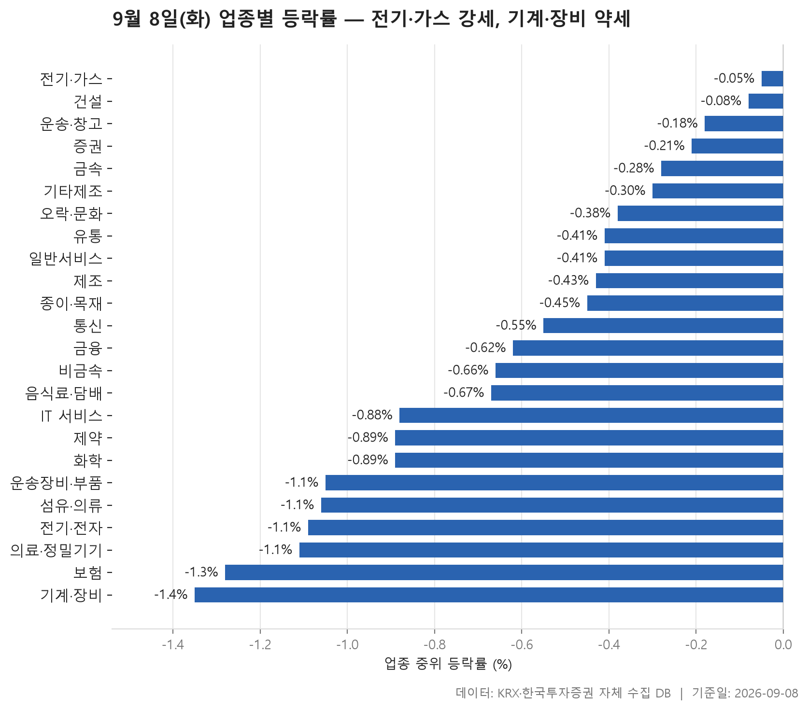
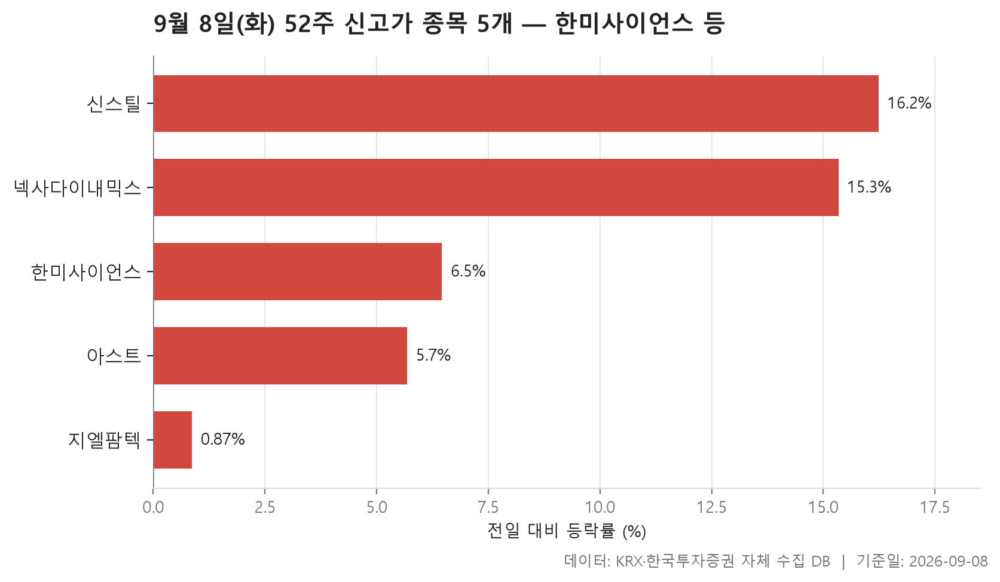
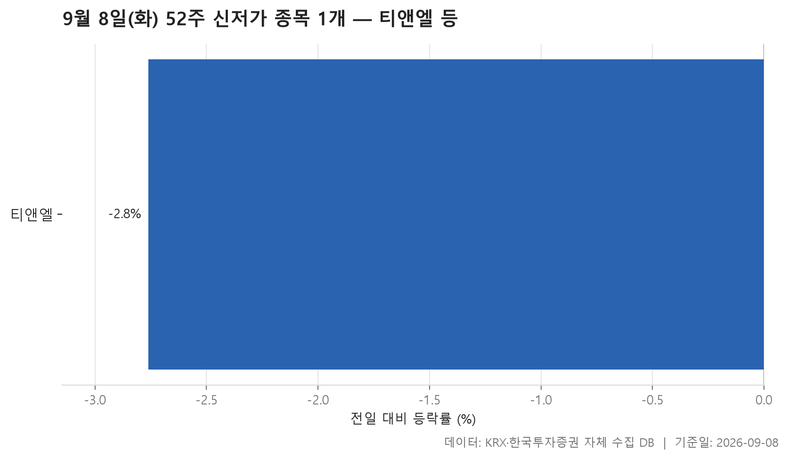
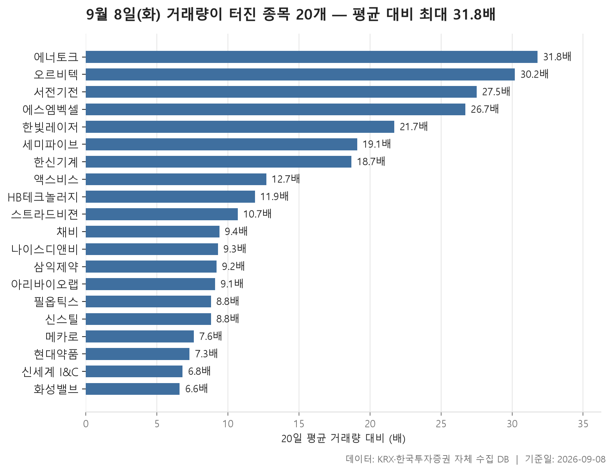

9월 8일 장은 한쪽으로 기울어 있었습니다. 24개 업종의 중위 등락률을 한 줄로 늘어놓았을 때 한가운데 놓인 값이 -0.58%였고, 가장 강했다는 전기·가스조차 -0.05%로 마이너스였습니다. 오늘은 오른 업종과 내린 업종이 갈린 날이 아니라, 거의 모든 업종이 내림 쪽에 서 있고 그중 덜 내린 곳과 더 내린 곳이 나뉜 날이었습니다.

그런데 표를 자세히 보면 조금 다른 이야기도 함께 읽힙니다. 업종의 중위값은 대부분 마이너스인데, 개별 종목 단위로 내려가면 20% 넘게 오른 종목도 있고 하한가에 가까운 종목도 있습니다. 시장 전체가 조용히 내려앉은 가운데, 몇몇 종목만 따로 크게 흔들린 모양입니다.

아래에서는 업종별 흐름을 먼저 보고, 52주 최고가를 넘은 종목과 최저가를 밑돈 종목, 그리고 평소보다 거래량이 크게 불어난 종목을 차례로 정리했습니다. 표가 말해 주는 범위 안에서만 설명하고, 왜 그랬는지에 대한 짐작은 넣지 않았습니다.

> 기준일: 2026-09-08 · 집계: 자체 수집 데이터베이스

## 업종 등락률

먼저 눈에 들어오는 것은 위아래 폭이 좁다는 점입니다. 가장 강한 전기·가스가 -0.05%, 가장 약한 기계·장비가 -1.35%로, 스물네 업종이 이 사이에 촘촘히 들어차 있습니다. 하루 사이에 업종끼리 크게 갈라진 날은 아니었다는 뜻입니다. 상위권에 전기·가스, 건설, 운송·창고가 자리했는데 이들 역시 모두 마이너스였고, 24개 업종의 중위값 한가운데가 -0.58%였으니 절반 넘는 업종이 그보다 더 내렸다는 이야기가 됩니다.

방향을 더 분명하게 보여 주는 것은 오른 종목의 비율 쪽입니다. 상위권인 건설이 45.10%로 가장 높은데, 그래도 절반에 못 미칩니다. 하위권으로 내려가면 기계·장비가 21.70%, 화학이 18.60%, 종이·목재가 18.50%까지 떨어지고, 보험은 열한 종목 가운데 오른 종목이 하나도 없어 0.00%입니다. 보험의 중위 등락률은 -1.28%로 최하위는 아닌데 오른 종목이 전무하다는 점이 특이합니다. 크게 빠진 종목 없이 열한 곳이 다 함께 조금씩 내린 모양으로, 가장 크게 움직인 종목조차 -2.65%에 그쳤습니다.

반대로 중위값과 평균이 벌어진 업종들이 여럿 보입니다. 제조는 중위값이 -0.43%인데 평균은 +0.53%로 위쪽에 있고, 여덟 종목뿐인 업종이라 한 종목이 평균을 0.87%p 끌어올린 것으로 계산됩니다. 격차의 대부분을 그 한 종목이 만든 셈입니다. 비금속도 중위값 -0.66%에 평균 -0.03%로 벌어져 있고, 여기서도 한 종목의 기여가 0.40%p입니다. 전기·가스 역시 중위값은 -0.05%지만 평균은 +0.43%로, 열 종목짜리 업종에서 한국전력의 +4.12%가 0.41%p를 보탰습니다. 종목 수가 적은 업종일수록 평균이 한 종목에 쉽게 끌려간다는 점을 그대로 보여 줍니다.

종목 수가 많은 업종은 사정이 다릅니다. 전기·전자는 368개 종목에 중위값 -1.09%인데, 이 업종에서 가장 크게 움직인 종목은 +30.00%로 상한가입니다. 그런데도 업종 평균에 보탠 몫은 0.08%p에 그칩니다. 기계·장비, 제약, IT 서비스도 마찬가지로 두 자릿수로 오른 종목을 하나씩 안고 있으면서 업종 중위값은 -0.88%에서 -1.35% 사이에 머물렀습니다. 거래대금 쪽에서는 전기·전자가 186,733.40억원으로 다른 업종과 자릿수가 다르고, 그다음이 기계·장비 26,599.60억원, 금융 17,566.70억원 순입니다. 돈이 몰린 곳과 성적이 좋았던 곳이 같지 않았던 하루입니다.

| 업종 | 종목수(개) | 중위등락률(%) | 평균등락률(%) | 상승비율(%) | 주도종목 | 주도종목등락률(%) | 평균기여도(%p) | 거래대금합계(억원) |
|---|---|---|---|---|---|---|---|---|
| 전기·가스 | 10 | -0.05 | +0.43 | 40.00 | 한국전력 | +4.12 | 0.41 | 1,336.90 |
| 건설 | 51 | -0.08 | +0.14 | 45.10 | 대우건설 | +8.47 | 0.17 | 11,025.00 |
| 운송·창고 | 27 | -0.18 | +0.27 | 33.30 | 제주항공 | +7.46 | 0.28 | 1,616.00 |
| 증권 | 17 | -0.21 | -0.25 | 35.30 | 현대차증권 | -2.32 | -0.14 | 1,094.00 |
| 금속 | 130 | -0.28 | -0.04 | 38.50 | 신스틸 | +16.24 | 0.12 | 6,266.40 |
| 기타제조 | 14 | -0.30 | -1.20 | 28.60 | 제이에스티나 | -8.70 | -0.62 | 23.70 |
| 오락·문화 | 66 | -0.38 | -0.28 | 36.40 | 한주에이알티 | +15.50 | 0.23 | 823.30 |
| 유통 | 154 | -0.41 | -0.44 | 35.70 | 신라에스지 | -26.42 | -0.17 | 5,081.60 |
| 일반서비스 | 165 | -0.41 | -0.22 | 38.80 | 오르비텍 | +29.83 | 0.18 | 11,606.30 |
| 제조 | 8 | -0.43 | +0.53 | 37.50 | 코아스 | +6.92 | 0.87 | 9.10 |
| 종이·목재 | 27 | -0.45 | -0.60 | 18.50 | 리더스코스메틱 | +3.88 | 0.14 | 37.90 |
| 통신 | 12 | -0.55 | -0.85 | 25.00 | 더즌 | -6.85 | -0.57 | 1,058.60 |
| 금융 | 111 | -0.62 | -0.52 | 27.90 | 헥토파이낸셜 | -7.14 | -0.06 | 17,566.70 |
| 비금속 | 36 | -0.66 | -0.03 | 22.20 | 서산 | +14.46 | 0.40 | 2,493.10 |
| 음식료·담배 | 84 | -0.67 | -0.96 | 22.60 | 한탑 | +14.77 | 0.18 | 2,335.90 |
| IT 서비스 | 244 | -0.88 | -0.88 | 29.90 | 스트라드비젼 | +19.22 | 0.08 | 6,841.80 |
| 제약 | 166 | -0.89 | -0.78 | 22.90 | 현대약품 | +23.99 | 0.14 | 12,489.40 |
| 화학 | 221 | -0.89 | -1.19 | 18.60 | 케이엠제약 | -29.58 | -0.13 | 11,018.30 |
| 운송장비·부품 | 131 | -1.05 | -0.78 | 22.10 | 에스엠벡셀 | +23.53 | 0.18 | 8,948.20 |
| 섬유·의류 | 50 | -1.06 | -1.21 | 24.00 | 원풍물산 | -17.06 | -0.34 | 482.60 |
| 전기·전자 | 368 | -1.09 | -0.78 | 26.10 | 빛과전자 | +30.00 | 0.08 | 186,733.40 |
| 의료·정밀기기 | 99 | -1.11 | -0.96 | 24.20 | 솔디펜스 | +10.15 | 0.10 | 13,409.10 |
| 보험 | 11 | -1.28 | -1.06 | 0.00 | DB손해보험 | -2.65 | -0.24 | 2,257.50 |
| 기계·장비 | 207 | -1.35 | -0.79 | 21.70 | 넥사다이내믹스 | +15.34 | 0.07 | 26,599.60 |

## 52주 신고가 5개 — 최고 신스틸 16.24%

52주 최고가를 넘어선 종목은 다섯 개뿐입니다. 시가총액 500억원 이상, 거래대금 3억원 이상이라는 조건을 걸었으니 아주 작은 종목은 걸러진 결과인데, 그 조건에서 다섯 개면 많은 수는 아닙니다. 업종 표에서 본 대로 시장 전반이 눌린 날이었다는 점과 어긋나지 않습니다.

다섯 종목의 성격은 제각각입니다. 시가총액이 가장 큰 한미사이언스가 39,462억원인데, 나머지 넷은 2,350억원 아래에 몰려 있습니다. 상승 폭도 넓게 벌어져서, 신스틸이 +16.24%로 가장 크고 지엘팜텍은 +0.87%에 그칩니다. 다섯 종목 등락률의 한가운데 값은 6.46%로, 한미사이언스가 정확히 그 자리에 있습니다.

특히 지엘팜텍은 하루 상승 폭이 1%에도 못 미치는데 최고가를 넘었습니다. 종가 5,780원, 직전 52주 최고가 5,730원으로 차이가 크지 않습니다. 한미사이언스도 57,700원 종가에 이전 고점이 57,500원이라 간발의 차입니다. 반면 넥사다이내믹스는 종가 5,000원에 이전 고점이 4,450원으로, 기존 고점을 여유 있게 넘어섰습니다. 같은 '신고가'라도 문턱을 겨우 넘은 경우와 훌쩍 넘은 경우가 섞여 있다는 뜻입니다.

시장별로는 KOSPI 1개, KOSDAQ 4개로 코스닥 쪽이 많고, 업종은 다섯 종목이 모두 다른 업종에 흩어져 있습니다. 특정 업종이 함께 밀어 올린 신고가가 아니라 종목별로 따로 나온 결과라는 이야기입니다. 거래대금을 보면 신스틸이 664.00억원, 한미사이언스가 477.20억원으로 두드러지고, 아스트와 지엘팜텍은 8.90억원으로 필터 기준을 조금 넘긴 수준입니다.

| 종목명 | 종목코드 | 시장 | 업종 | 종가(원) | 등락률(%) | 이전52주최고(원) | 거래대금(억원) | 시가총액(억원) |
|---|---|---|---|---|---|---|---|---|
| 한미사이언스 | 008930 | KOSPI | 금융 | 57,700 | +6.46 | 57,500 | 477.20 | 39,462 |
| 아스트 | 067390 | KOSDAQ | 운송장비·부품 | 5,580 | +5.68 | 5,520 | 8.90 | 2,350 |
| 넥사다이내믹스 | 351320 | KOSDAQ | 기계·장비 | 5,000 | +15.34 | 4,450 | 75.40 | 1,485 |
| 신스틸 | 162300 | KOSDAQ | 금속 | 2,470 | +16.24 | 2,435 | 664.00 | 1,024 |
| 지엘팜텍 | 204840 | KOSDAQ | 유통 | 5,780 | +0.87 | 5,730 | 8.90 | 896 |

## 52주 신저가 1개 — 티앤엘 -2.76%

반대편은 훨씬 한산합니다. 같은 조건에서 52주 최저가를 밑돈 종목은 티앤엘 하나뿐이었습니다. 업종 중위 등락률이 스물네 개 모두 마이너스였던 날치고는 의외로 보일 수 있는데, 신저가는 하루의 낙폭이 아니라 1년치 최저 구간을 갱신했느냐를 묻는 지표라 성격이 다릅니다. 오늘처럼 폭넓게 조금씩 내린 장에서는 신저가가 잘 늘지 않습니다.

티앤엘은 코스닥 제약 업종이고, 종가 28,200원에 하루 등락률은 -2.76%입니다. 직전 52주 최저가가 28,750원이었으니 그 아래로 내려앉았습니다. 시가총액은 4,532억원, 거래대금은 29.10억원입니다. 낙폭 자체는 오늘 업종 표에서 본 개별 종목들의 움직임에 비하면 크지 않은데, 이미 낮아져 있던 자리에서 한 칸 더 내려간 형태로 읽힙니다.

한쪽에서 다섯 종목이 1년 최고가를 새로 쓰고 다른 쪽에서 한 종목이 최저가를 새로 쓴 날이라면, 적어도 1년 기준선에서 보면 아래로 무너진 장은 아니었습니다. 다만 표에 담긴 것은 조건을 통과한 종목뿐이라, 시가총액이나 거래대금이 기준에 못 미친 종목까지 포함하면 그림이 달라질 수 있다는 점은 감안해야 합니다.

| 종목명 | 종목코드 | 시장 | 업종 | 종가(원) | 등락률(%) | 이전52주최저(원) | 거래대금(억원) | 시가총액(억원) |
|---|---|---|---|---|---|---|---|---|
| 티앤엘 | 340570 | KOSDAQ | 제약 | 28,200 | -2.76 | 28,750 | 29.10 | 4,532 |

## 거래량 급증 20개 — 최고 에너토크 31.80배

거래량이 직전 20거래일 평균의 5배를 넘은 종목은 스무 개입니다. 배수의 한가운데 값이 10.05배이니, 절반은 평소의 열 배 넘게 거래됐다는 뜻입니다. 가장 높은 에너토크가 31.80배, 가장 낮은 화성밸브가 6.60배로, 위쪽 몇 종목이 유독 튀어 있고 아래로는 완만하게 낮아지는 모양입니다.

눈에 띄는 것은 거래량이 늘어난 종목 대부분이 오른 쪽이었다는 점입니다. 스무 종목 가운데 하락으로 마감한 것은 삼익제약 한 곳(-0.34%)뿐이고, 나머지는 모두 상승입니다. 상한가 근처까지 간 종목도 여럿이어서 액스비스가 +29.94%, 오르비텍이 +29.83%, 서전기전이 +29.80%로 나란히 붙어 있습니다. 업종 표에서 전 업종의 중위값이 마이너스였던 날에, 거래가 몰린 자리에서는 이렇게 반대 방향의 움직임이 나왔습니다.

배수와 실제 거래 규모가 따로 논다는 점도 짚어 둘 만합니다. 배수 1위인 에너토크의 거래대금은 71.70억원인데, 배수가 7.30배로 하위권인 현대약품은 3,197.70억원으로 이 표에서 가장 큽니다. 평소 거래가 적던 종목은 조금만 손이 타도 배수가 크게 뛰고, 원래 거래가 활발한 종목은 돈이 많이 들어와도 배수는 낮게 나옵니다. 나이스디앤비가 9.30배인데 거래대금은 4.60억원인 것도 같은 이유로 읽힙니다. 배수만 보고 '얼마나 큰일이 났나'를 판단하기 어렵다는 이야기입니다.

업종은 일곱 개로 나뉘는데 기계·장비가 6개로 가장 많습니다. 업종 중위 등락률에서 최하위였던 바로 그 업종에서 거래가 터진 종목이 가장 많이 나왔다는 점은 다시 봐도 어긋나 보입니다. 업종 전체는 눌려 있는데 그 안의 몇 종목만 따로 움직였다는 뜻이고, 앞서 본 대로 기계·장비의 중위값이 -1.35%인데도 이 업종에서 가장 크게 움직인 종목은 +15.34%였습니다. 시장별로는 KOSPI 4개, KOSDAQ 16개이고, 시가총액이 가장 큰 필옵틱스가 8,299억원, 그 아래로는 5,420억원 이하에 몰려 있어 대체로 중소형 쪽에서 나온 움직임입니다.

| 종목명 | 종목코드 | 시장 | 업종 | 종가(원) | 등락률(%) | 거래량(주) | 평균거래량(주) | 배수(배) | 거래대금(억원) | 시가총액(억원) |
|---|---|---|---|---|---|---|---|---|---|---|
| 에너토크 | 019990 | KOSDAQ | 기계·장비 | 5,500 | +13.05 | 1,230,172 | 38,628 | 31.80 | 71.70 | 537 |
| 오르비텍 | 046120 | KOSDAQ | 일반서비스 | 6,050 | +29.83 | 7,811,295 | 258,859 | 30.20 | 456.00 | 2,048 |
| 서전기전 | 189860 | KOSDAQ | 전기·전자 | 5,750 | +29.80 | 5,307,586 | 193,033 | 27.50 | 291.90 | 558 |
| 에스엠벡셀 | 010580 | KOSPI | 운송장비·부품 | 2,095 | +23.53 | 13,782,022 | 515,401 | 26.70 | 284.50 | 2,331 |
| 한빛레이저 | 452190 | KOSDAQ | 기계·장비 | 4,500 | +10.70 | 11,158,602 | 514,058 | 21.70 | 515.90 | 1,076 |
| 세미파이브 | 490470 | KOSDAQ | 일반서비스 | 15,930 | +10.78 | 3,994,207 | 208,971 | 19.10 | 660.60 | 5,420 |
| 한신기계 | 011700 | KOSPI | 기계·장비 | 2,630 | +10.74 | 2,555,760 | 136,640 | 18.70 | 69.00 | 853 |
| 액스비스 | 0011A0 | KOSDAQ | 전기·전자 | 11,110 | +29.94 | 464,825 | 36,715 | 12.70 | 50.00 | 1,037 |
| HB테크놀러지 | 078150 | KOSDAQ | 기계·장비 | 1,995 | +3.96 | 6,745,424 | 568,122 | 11.90 | 139.60 | 1,894 |
| 스트라드비젼 | 475040 | KOSDAQ | IT 서비스 | 3,350 | +19.22 | 10,721,733 | 1,002,068 | 10.70 | 358.50 | 1,803 |
| 채비 | 0011T0 | KOSDAQ | 전기·전자 | 5,310 | +13.10 | 1,151,626 | 122,505 | 9.40 | 62.90 | 2,493 |
| 나이스디앤비 | 130580 | KOSDAQ | 일반서비스 | 6,120 | +1.66 | 74,628 | 8,052 | 9.30 | 4.60 | 942 |
| 삼익제약 | 014950 | KOSDAQ | 제약 | 8,750 | -0.34 | 13,007,680 | 1,418,453 | 9.20 | 1,163.90 | 881 |
| 아리바이오랩 | 261780 | KOSDAQ | 일반서비스 | 3,350 | +15.52 | 2,702,069 | 295,368 | 9.10 | 87.40 | 970 |
| 필옵틱스 | 161580 | KOSDAQ | 기계·장비 | 35,400 | +5.67 | 1,146,556 | 130,890 | 8.80 | 422.00 | 8,299 |
| 신스틸 | 162300 | KOSDAQ | 금속 | 2,470 | +16.24 | 26,598,597 | 3,008,892 | 8.80 | 664.00 | 1,024 |
| 메카로 | 241770 | KOSDAQ | 전기·전자 | 42,350 | +12.48 | 101,264 | 13,337 | 7.60 | 42.40 | 4,317 |
| 현대약품 | 004310 | KOSPI | 제약 | 10,440 | +23.99 | 31,962,413 | 4,374,977 | 7.30 | 3,197.70 | 3,341 |
| 신세계 I&C | 035510 | KOSPI | IT 서비스 | 15,300 | +10.15 | 369,497 | 54,038 | 6.80 | 54.90 | 2,139 |
| 화성밸브 | 039610 | KOSDAQ | 기계·장비 | 6,010 | +4.89 | 1,125,078 | 169,510 | 6.60 | 71.20 | 626 |

## 정리

정리하면 9월 8일은 스물네 업종이 모두 마이너스 중위값을 기록한 가운데, 거래가 몰린 소수 종목만 반대 방향으로 크게 움직인 하루였습니다. 업종 전체는 -0.58%를 가운데 두고 좁게 눌려 있었고, 그 안에서 상한가와 하한가 부근이 동시에 나왔습니다. 52주 기준선으로 보면 최고가를 새로 쓴 종목이 다섯, 최저가를 밑돈 종목이 하나였습니다.\n\n다만 여기 쓴 숫자는 모두 하루치 종가 기준 집계이고, 시가총액과 거래대금 조건을 통과한 종목만 표에 들어갔습니다. 거래량 배수나 신고가 여부는 그 종목에 무슨 일이 있었는지를 알려 주지 않습니다. 이 글은 데이터 정리이며, 특정 종목의 매매를 권하는 내용이 아닙니다.

## 집계 기준

**업종 등락률**

- **기준**: 2026-09-07 종가 → 2026-09-08 종가
- **순위**: 업종 내 종목 등락률의 중위값 (평균은 참고용으로 함께 표시)
- **주도종목**: 그 업종에서 등락률 절대값이 가장 큰 종목 (동점이면 거래대금이 큰 쪽)
- **평균기여도**: 그 종목 하나가 업종 평균을 움직인 폭 (등락률 ÷ 종목수). 중위값과 평균의 격차가 이 값에 가까우면 평균을 만든 것이 그 종목이고, 훨씬 크면 다른 종목들도 함께 움직인 것입니다
- **필터**: 업종 내 보통주 5종목 이상
- **전체업종중위등락률(%)**: -0.58

**52주 신고가**

- **기준**: 종가 > 직전 52주 최고가
- **관측구간**: 2025-08-26 ~ 2026-09-07 (252거래일)
- **필터**: 시가총액 500억 이상, 거래대금 3억 이상, 보통주

**52주 신저가**

- **기준**: 종가 < 직전 52주 최저가
- **관측구간**: 2025-08-26 ~ 2026-09-07 (252거래일)
- **필터**: 시가총액 500억 이상, 거래대금 3억 이상, 보통주

**거래량 급증**

- **기준**: 당일 거래량 ≥ 직전 20거래일 평균 × 5
- **관측구간**: 2026-08-10 ~ 2026-09-07 (20거래일)
- **필터**: 시가총액 500억 이상, 거래대금 3억 이상, 보통주

## 데이터 출처 및 유의사항

- **데이터출처**: 한국거래소(KRX) 공시 데이터와 한국투자증권 OpenAPI 를 직접 수집해 구축한 자체 데이터베이스
- **집계방식**: 수집·집계·차트 생성을 직접 구현한 파이프라인에서 자동 산출
- **작성고지**: 본문의 표·통계·차트는 자체 데이터베이스에서 계산된 값이며, 문장 작성 과정에 AI 도구를 활용했습니다.
- **면책**: 본 글은 정보 제공을 목적으로 하며 특정 종목의 매수·매도를 추천하지 않습니다. 제시된 수치는 과거 데이터이고 미래 수익을 보장하지 않습니다. 투자 판단과 그 결과에 대한 책임은 투자자 본인에게 있습니다.

