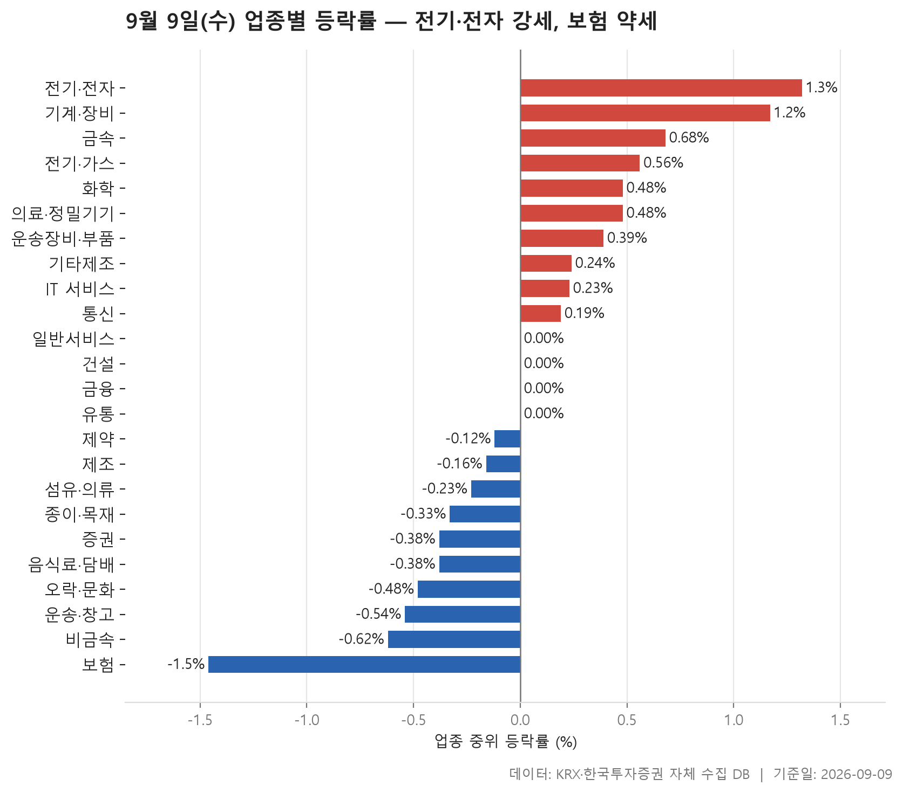
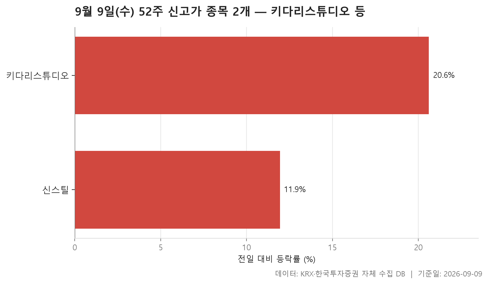
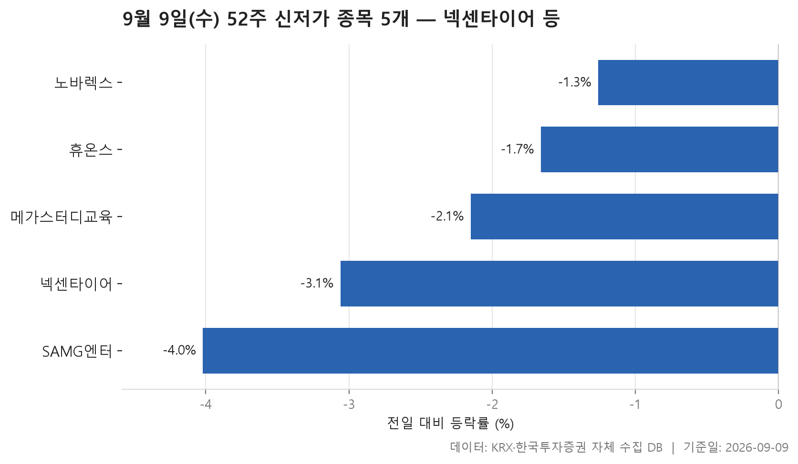
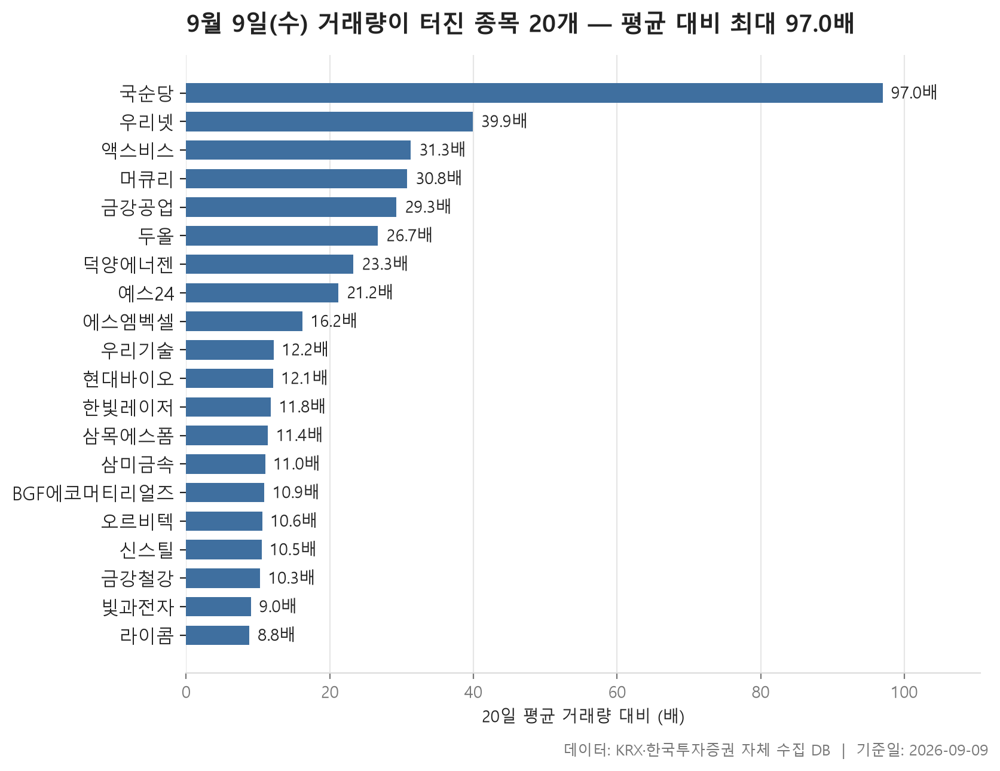

9월 9일 수요일 장을 데이터로 훑어봅니다. 오늘 표는 네 장입니다. 업종별로 어디가 강했고 어디가 눌렸는지, 52주 최고가를 새로 쓴 종목과 최저가를 밑돈 종목, 그리고 거래량이 평소와 전혀 다른 규모로 터진 종목들입니다.

먼저 전체 그림부터 말하면, 오늘은 한쪽으로 확 기운 장이 아니었습니다. 24개 업종의 중위 등락률을 순서대로 늘어놓았을 때 한가운데 놓인 값이 0%입니다. 양(+)으로 끝난 업종이 10개, 음(-)으로 끝난 업종이 10개, 나머지는 0.00%에 걸려 있습니다. 지수 한 줄로는 "별일 없었다"고 요약될 만한 날인데, 표를 열어 보면 안쪽 사정은 그렇게 조용하지 않았습니다.

가장 강한 업종과 가장 약한 업종의 이름은 제목에 이미 적혀 있습니다. 전기·전자가 +1.32%로 맨 위, 보험이 -1.46%로 맨 아래. 다만 오늘 표에서 더 눈여겨볼 대목은 순위 자체가 아니라, 업종 안에서 오른 종목의 비중이 위아래로 얼마나 갈렸는지, 그리고 거래량이 터진 자리가 어느 업종에 몰렸는지입니다.

> 기준일: 2026-09-09 · 집계: 자체 수집 데이터베이스

## 업종 등락률 — 24개 중 10개 상승

표를 위에서 아래로 읽으면 상단부는 폭이 좁습니다. 맨 위 전기·전자가 +1.32%, 그다음 기계·장비가 +1.17%로 붙어 있고, 이후로는 +0.68%, +0.56%, +0.48% 순으로 완만하게 내려옵니다. 즉 '아주 세게 오른 업종'이 따로 있는 게 아니라, 오른 업종들이 1% 안쪽에 대체로 모여 있는 모양입니다. 반대쪽 끝도 비슷합니다. 보험만 -1.46%로 조금 떨어져 있고, 그 위로는 -0.62%, -0.54%, -0.48%가 이어집니다. 중간 지대에는 중위 등락률이 0.00%로 찍힌 업종이 네 개나 있습니다.

같은 방향이라도 업종 안 사정은 다릅니다. 오른 종목 비중을 보면 기계·장비는 넷 중 셋가량이 올랐고 전기·전자도 그에 가깝습니다. 반면 하단부로 가면 운송·창고는 다섯 곳 중 한 곳가량만 올랐고, 보험은 상승비율이 0.00%입니다. 열한 종목 가운데 오른 것이 하나도 없었다는 뜻이고, 그러면 중위값이 가장 낮은 자리에 놓인 것도 자연스럽습니다. 주도종목으로 잡힌 한화손해보험이 -3.19%인데, 업종 평균을 -0.29%p 움직인 정도입니다. 이 한 종목이 업종을 끌어내린 게 아니라 열한 곳이 다 같이 내렸다는 쪽으로 읽는 편이 맞습니다.

반대로 중위값과 평균이 크게 벌어진 업종도 있습니다. 화학은 한가운데 값이 +0.48%인데 평균은 +1.71%입니다. 주도종목 코이즈가 +140.00%로 잡혔고, 이 종목 하나가 업종 평균을 0.63%p 밀어올린 셈입니다. 격차의 절반쯤을 한 종목이 만든 구조이니, 이 업종의 평균만 보고 '화학이 강했다'고 정리하면 실제 체감과 어긋날 수 있습니다. 전기·전자도 한가운데 값보다 평균이 위에 있지만, 주도종목 머큐리가 상한가인 +30.00%임에도 업종 평균에 준 몫은 0.08%p뿐입니다. 366개라는 종목 수에 나눠지면 상한가 한 종목도 이 정도로 희석됩니다. 이쪽은 평균을 올린 것이 특정 한 종목이 아니라 여러 종목이었다고 볼 근거가 됩니다.

어긋나 보이는 자리를 하나 더 짚자면 비금속입니다. 한가운데 값은 -0.62%로 하단부에 있는데 평균은 -0.05%에 그칩니다. 오른 종목 비중도 셋 중 하나에 못 미칩니다. 대다수가 눌린 가운데 소수가 크게 올라 평균을 끌어올린 형태인데, 주도종목 쎄노텍이 +13.45%로 업종 평균에 0.37%p를 보탠 것이 그 흔적입니다. 기계·장비는 이 구조가 뒤집혀 있습니다. 주도종목이 -22.24%로 평균을 -0.11%p 깎았는데도 업종 전체는 상단부에 있습니다. 크게 빠진 종목이 눈에 띄더라도 업종의 방향과는 별개일 수 있다는 예입니다.

| 업종 | 종목수(개) | 중위등락률(%) | 평균등락률(%) | 상승비율(%) | 주도종목 | 주도종목등락률(%) | 평균기여도(%p) | 거래대금합계(억원) |
|---|---|---|---|---|---|---|---|---|
| 전기·전자 | 366 | +1.32 | +2.28 | 71.90 | 머큐리 | +30.00 | 0.08 | 168,387.30 |
| 기계·장비 | 205 | +1.17 | +1.68 | 74.60 | 수성웹툰 | -22.24 | -0.11 | 22,531.60 |
| 금속 | 130 | +0.68 | +1.39 | 69.20 | 삼미금속 | +29.91 | 0.23 | 9,074.30 |
| 전기·가스 | 10 | +0.56 | +1.05 | 60.00 | SGC에너지 | +7.25 | 0.72 | 1,097.60 |
| 화학 | 221 | +0.48 | +1.71 | 58.80 | 코이즈 | +140.00 | 0.63 | 13,398.60 |
| 의료·정밀기기 | 99 | +0.48 | +0.90 | 62.60 | 우진 | +9.13 | 0.09 | 7,027.70 |
| 운송장비·부품 | 132 | +0.39 | +0.65 | 59.80 | 에스엠벡셀 | +21.24 | 0.16 | 8,614.50 |
| 기타제조 | 14 | +0.24 | +0.37 | 50.00 | 피코그램 | +2.92 | 0.21 | 15.30 |
| IT 서비스 | 244 | +0.23 | +0.67 | 55.70 | 키다리스튜디오 | +20.61 | 0.08 | 6,717.30 |
| 통신 | 12 | +0.19 | +1.42 | 66.70 | 나이스정보통신 | +6.63 | 0.55 | 1,093.20 |
| 일반서비스 | 166 | 0.00 | +0.51 | 47.60 | 페니트리움바이오 | +29.95 | 0.18 | 7,091.70 |
| 건설 | 51 | 0.00 | +0.39 | 45.10 | 세종텔레콤 | +13.45 | 0.26 | 6,787.60 |
| 금융 | 111 | 0.00 | +0.36 | 44.10 | LS | +9.09 | 0.08 | 17,639.00 |
| 유통 | 154 | 0.00 | -0.01 | 46.10 | 우리로 | +29.84 | 0.19 | 5,253.50 |
| 제약 | 166 | -0.12 | -0.16 | 41.60 | 삼일제약 | +12.56 | 0.08 | 7,703.80 |
| 제조 | 8 | -0.16 | -0.09 | 37.50 | 이월드 | +3.10 | 0.39 | 9.80 |
| 섬유·의류 | 49 | -0.23 | -0.57 | 34.70 | 좋은사람들 | -16.31 | -0.33 | 253.40 |
| 종이·목재 | 27 | -0.33 | -0.28 | 33.30 | 동화기업 | +4.02 | 0.15 | 37.90 |
| 증권 | 17 | -0.38 | -0.30 | 29.40 | 부국증권 | -3.50 | -0.21 | 786.50 |
| 음식료·담배 | 84 | -0.38 | -0.23 | 36.90 | 국순당 | +5.57 | 0.07 | 1,640.60 |
| 오락·문화 | 67 | -0.48 | -1.28 | 28.40 | 골드앤에스 | -24.96 | -0.37 | 740.10 |
| 운송·창고 | 27 | -0.54 | -0.79 | 18.50 | 진에어 | -5.38 | -0.20 | 1,777.80 |
| 비금속 | 36 | -0.62 | -0.05 | 30.60 | 쎄노텍 | +13.45 | 0.37 | 1,929.90 |
| 보험 | 11 | -1.46 | -1.76 | 0.00 | 한화손해보험 | -3.19 | -0.29 | 2,200.20 |

## 52주 신고가 2개 — 최고 키다리스튜디오 20.61%

52주 최고가를 새로 넘어선 보통주는 두 개뿐입니다. 시가총액 500억 이상, 거래대금 3억 이상이라는 조건을 걸어 걸러낸 결과이니, 오늘 장에서 신고가를 낼 만큼 밀어올려진 종목은 손에 꼽을 정도였다는 얘기가 됩니다. 업종 표에서 오른 업종이 열 개였던 것과 견주면, 강세의 폭은 넓었어도 깊이는 얕았던 셈입니다.

두 종목 모두 하루 상승폭이 두 자릿수입니다. 키다리스튜디오가 +20.61%, 신스틸이 +11.94%. 다만 성격은 조금 다릅니다. 키다리스튜디오는 시가총액이 2,950억원으로 둘 중 크지만 거래대금은 120.70억원이고, 신스틸은 시가총액 1,147억원에 거래대금이 1,062.50억원입니다. 몸집이 작은 쪽에 훨씬 많은 돈이 돌았다는 뜻입니다. 이전 52주 최고가와 오늘 종가를 비교하면 신스틸은 2,720원 선을 2,765원으로 갓 넘어선 정도인데, 넘어서는 과정에서 거래가 크게 붙었습니다.

시장도 하나씩 갈렸고 업종도 IT 서비스와 금속으로 나뉩니다. 두 종목이라 경향을 말하기는 어렵지만, 신스틸이 속한 금속이 업종 표에서 +0.68%로 상단부에 있었던 것, 그리고 거래량 급증 표에도 금속이 여러 곳 등장하는 것은 함께 놓고 볼 만합니다.

| 종목명 | 종목코드 | 시장 | 업종 | 종가(원) | 등락률(%) | 이전52주최고(원) | 거래대금(억원) | 시가총액(억원) |
|---|---|---|---|---|---|---|---|---|
| 키다리스튜디오 | 020120 | KOSPI | IT 서비스 | 7,960 | +20.61 | 7,340 | 120.70 | 2,950 |
| 신스틸 | 162300 | KOSDAQ | 금속 | 2,765 | +11.94 | 2,720 | 1,062.50 | 1,147 |

## 52주 신저가 5개 — 최저 SAMG엔터 -4.02%

52주 최저가를 밑돈 종목은 다섯 개입니다. 신고가 쪽보다 수가 많은데, 하루 낙폭은 훨씬 얕습니다. 가장 많이 내린 SAMG엔터가 -4.02%, 가장 덜 내린 노바렉스가 -1.26%, 다섯 종목의 한가운데 값이 -2.15%입니다. 신고가 두 종목이 두 자릿수로 뛴 것과 대비하면, 이쪽은 하루 만에 무너진 게 아니라 이미 낮았던 자리에서 조금 더 내려앉아 최저가 선을 건드린 모양입니다.

실제로 종가와 이전 52주 최저가를 비교해 보면 그 차이가 아주 작습니다. 넥센타이어는 5,710원이던 최저가 밑으로 5,700원에 마감했고, 휴온스는 20,800원 아래 20,750원입니다. 갱신 폭이 이렇게 좁다는 것은 앞선 기간의 저점 근처에서 오래 머물러 있었다는 뜻으로 읽힙니다.

다섯 종목의 업종이 화학·일반서비스·제약·음식료·담배·오락·문화로 전부 다릅니다. 특정 업종이 한꺼번에 저점을 깬 그림은 아닙니다. 다만 이 가운데 제약, 음식료·담배, 오락·문화는 업종 표에서도 한가운데 값이 음(-)이었던 쪽입니다. 거래대금은 대체로 작은데, 가장 많은 곳이 23.20억원이고 가장 적은 곳은 4.70억원입니다. 팔려는 힘이 몰려서 밀린 자리라기보다는, 거래가 얇은 채로 조금씩 흘러내린 자리에 가깝습니다.

| 종목명 | 종목코드 | 시장 | 업종 | 종가(원) | 등락률(%) | 이전52주최저(원) | 거래대금(억원) | 시가총액(억원) |
|---|---|---|---|---|---|---|---|---|
| 넥센타이어 | 002350 | KOSPI | 화학 | 5,700 | -3.06 | 5,710 | 23.20 | 5,567 |
| 메가스터디교육 | 215200 | KOSDAQ | 일반서비스 | 34,200 | -2.15 | 34,700 | 11.80 | 3,545 |
| 휴온스 | 243070 | KOSDAQ | 제약 | 20,750 | -1.66 | 20,800 | 7.00 | 2,486 |
| 노바렉스 | 194700 | KOSDAQ | 음식료·담배 | 10,220 | -1.26 | 10,340 | 4.70 | 1,866 |
| SAMG엔터 | 419530 | KOSDAQ | 오락·문화 | 17,680 | -4.02 | 18,010 | 23.10 | 1,805 |

## 거래량 급증 20개 — 최고 국순당 97배

오늘 표에서 가장 활기가 있는 쪽은 여기입니다. 거래량이 직전 20거래일 평균의 5배를 넘은 종목 20개인데, 배수의 한가운데 값이 12.15배입니다. 5배 기준을 겨우 넘긴 종목들이 채운 목록이 아니라, 열 배 넘게 튄 종목이 절반을 차지하는 목록이라는 뜻입니다. 맨 위 국순당은 97배입니다. 평균 거래량이 26,975주였던 종목에 2,616,403주가 오갔습니다. 그다음이 39.90배, 31.30배, 30.80배 순으로 뚝 떨어지니, 국순당은 이 표 안에서도 혼자 떨어져 있는 값입니다.

업종은 여덟 개로 갈리는데 전기·전자가 6개로 가장 많습니다. 업종 등락률에서 맨 위에 있던 업종에 거래량 급증 종목도 가장 많이 몰린 셈입니다. 금속도 다섯 곳이 이름을 올렸습니다. 다만 배수가 높다고 다 오른 것은 아닙니다. 액스비스는 31.30배가 붙은 채 -6.39%, 예스24는 21.20배에 -8.71%로 마감했습니다. 거래량이 터졌다는 사실 자체는 방향을 말해 주지 않습니다.

배수와 돈의 규모가 따로 노는 것도 이 표의 특징입니다. 배수 1위인 국순당의 거래대금은 106.90억원이고 시가총액은 677억원으로 목록에서 작은 편입니다. 반대로 배수가 가장 낮은 라이콤 바로 위, 9.00배에 걸린 빛과전자는 거래대금이 2,790.00억원입니다. 시가총액이 가장 큰 우리기술은 24,743억원인데 배수는 12.20배로 한가운데 값 근처입니다. 몸집이 큰 종목은 평소 거래량도 많으니 같은 배수를 만들려면 훨씬 많은 주식이 오가야 하고, 그래서 배수 순위와 거래대금 순위는 이렇게 엇갈립니다.

앞 표들과 겹쳐 보면 연결되는 자리가 몇 군데 있습니다. 신고가 두 종목 중 신스틸이 여기 10.50배로 들어와 있고, 업종별 주도종목으로 잡혔던 머큐리·에스엠벡셀·삼미금속·국순당도 이 목록에 있습니다. 오늘 업종 안에서 가장 크게 움직인 종목들이 거래량에서도 평소와 다른 모습을 보였다는 정도까지가 표로 확인되는 범위입니다. 왜 그랬는지는 이 자료에 없습니다.

| 종목명 | 종목코드 | 시장 | 업종 | 종가(원) | 등락률(%) | 거래량(주) | 평균거래량(주) | 배수(배) | 거래대금(억원) | 시가총액(억원) |
|---|---|---|---|---|---|---|---|---|---|---|
| 국순당 | 043650 | KOSDAQ | 음식료·담배 | 3,790 | +5.57 | 2,616,403 | 26,975 | 97.00 | 106.90 | 677 |
| 우리넷 | 115440 | KOSDAQ | 전기·전자 | 8,200 | +12.18 | 2,536,251 | 63,640 | 39.90 | 218.80 | 885 |
| 액스비스 | 0011A0 | KOSDAQ | 전기·전자 | 10,400 | -6.39 | 1,803,511 | 57,656 | 31.30 | 186.20 | 971 |
| 머큐리 | 100590 | KOSDAQ | 전기·전자 | 4,355 | +30.00 | 3,747,038 | 121,833 | 30.80 | 158.00 | 746 |
| 금강공업 | 014280 | KOSPI | 금속 | 4,745 | +9.21 | 3,301,363 | 112,619 | 29.30 | 164.20 | 1,392 |
| 두올 | 016740 | KOSPI | 운송장비·부품 | 3,980 | +8.15 | 998,911 | 37,455 | 26.70 | 42.00 | 1,141 |
| 덕양에너젠 | 0001A0 | KOSDAQ | - | 9,910 | +10.36 | 1,363,169 | 58,469 | 23.30 | 139.20 | 2,524 |
| 예스24 | 053280 | KOSDAQ | 유통 | 2,830 | -8.71 | 259,054 | 12,197 | 21.20 | 7.60 | 708 |
| 에스엠벡셀 | 010580 | KOSPI | 운송장비·부품 | 2,540 | +21.24 | 19,494,189 | 1,203,125 | 16.20 | 486.80 | 2,826 |
| 우리기술 | 032820 | KOSDAQ | 전기·전자 | 14,320 | +21.25 | 38,503,568 | 3,160,672 | 12.20 | 5,313.70 | 24,743 |
| 현대바이오 | 048410 | KOSDAQ | 화학 | 7,130 | +13.90 | 10,061,532 | 833,833 | 12.10 | 722.00 | 6,881 |
| 한빛레이저 | 452190 | KOSDAQ | 기계·장비 | 5,000 | +11.11 | 12,578,188 | 1,065,331 | 11.80 | 629.70 | 1,196 |
| 삼목에스폼 | 018310 | KOSDAQ | 금속 | 14,320 | +4.68 | 98,108 | 8,612 | 11.40 | 14.30 | 2,105 |
| 삼미금속 | 012210 | KOSDAQ | 금속 | 13,030 | +29.91 | 19,584,774 | 1,774,075 | 11.00 | 2,335.10 | 3,004 |
| BGF에코머티리얼즈 | 126600 | KOSDAQ | 화학 | 3,110 | +7.61 | 385,278 | 35,223 | 10.90 | 11.90 | 1,952 |
| 오르비텍 | 046120 | KOSDAQ | 일반서비스 | 6,180 | +2.15 | 6,714,430 | 634,243 | 10.60 | 414.80 | 2,092 |
| 신스틸 | 162300 | KOSDAQ | 금속 | 2,765 | +11.94 | 38,776,109 | 3,681,135 | 10.50 | 1,062.50 | 1,147 |
| 금강철강 | 053260 | KOSDAQ | 금속 | 7,990 | +19.97 | 17,027,075 | 1,660,957 | 10.30 | 1,339.90 | 1,496 |
| 빛과전자 | 069540 | KOSDAQ | 전기·전자 | 3,810 | +4.67 | 69,532,164 | 7,759,648 | 9.00 | 2,790.00 | 4,294 |
| 라이콤 | 388790 | KOSDAQ | 전기·전자 | 4,815 | +14.10 | 2,547,413 | 289,770 | 8.80 | 124.90 | 1,474 |

## 정리

정리하면 9월 9일은 위아래가 반반으로 갈린 날이었습니다. 24개 업종 가운데 열 곳이 오르고 열 곳이 내렸고, 한가운데 값은 0%. 그 안에서 전기·전자와 기계·장비 쪽은 오른 종목 비중이 높았고, 보험은 열한 종목이 하나도 오르지 못했습니다. 신고가는 두 종목뿐이었지만 둘 다 두 자릿수로 뛰었고, 신저가 다섯 종목은 이미 낮았던 자리를 얕게 갱신하는 모습이었습니다. 거래량이 터진 자리는 전기·전자와 금속에 몰려 있었습니다.\n\n다만 이 글에서 확인한 것은 하루치 가격과 거래량이 만든 모양뿐입니다. 왜 그 업종이 강했고 어느 종목에 거래가 붙었는지, 그 이유는 오늘 자료에 담겨 있지 않습니다. 표를 넘어서는 해석은 하지 않았습니다. 특히 배수가 높은 종목 중에도 내린 곳이 있었던 것처럼, 한 지표만으로 방향을 읽으려 하면 어긋나는 경우가 많습니다. 이 글은 데이터 정리이며 투자 판단의 근거로 쓰기에는 부족합니다.

## 집계 기준

**업종 등락률**

- **기준**: 2026-09-08 종가 → 2026-09-09 종가
- **순위**: 업종 내 종목 등락률의 중위값 (평균은 참고용으로 함께 표시)
- **주도종목**: 그 업종에서 등락률 절대값이 가장 큰 종목 (동점이면 거래대금이 큰 쪽)
- **평균기여도**: 그 종목 하나가 업종 평균을 움직인 폭 (등락률 ÷ 종목수). 중위값과 평균의 격차가 이 값에 가까우면 평균을 만든 것이 그 종목이고, 훨씬 크면 다른 종목들도 함께 움직인 것입니다
- **필터**: 업종 내 보통주 5종목 이상
- **전체업종중위등락률(%)**: 0.0

**52주 신고가**

- **기준**: 종가 > 직전 52주 최고가
- **관측구간**: 2025-08-27 ~ 2026-09-08 (252거래일)
- **필터**: 시가총액 500억 이상, 거래대금 3억 이상, 보통주

**52주 신저가**

- **기준**: 종가 < 직전 52주 최저가
- **관측구간**: 2025-08-27 ~ 2026-09-08 (252거래일)
- **필터**: 시가총액 500억 이상, 거래대금 3억 이상, 보통주

**거래량 급증**

- **기준**: 당일 거래량 ≥ 직전 20거래일 평균 × 5
- **관측구간**: 2026-08-11 ~ 2026-09-08 (20거래일)
- **필터**: 시가총액 500억 이상, 거래대금 3억 이상, 보통주

## 데이터 출처 및 유의사항

- **데이터출처**: 한국거래소(KRX) 공시 데이터와 한국투자증권 OpenAPI 를 직접 수집해 구축한 자체 데이터베이스
- **집계방식**: 수집·집계·차트 생성을 직접 구현한 파이프라인에서 자동 산출
- **작성고지**: 본문의 표·통계·차트는 자체 데이터베이스에서 계산된 값이며, 문장 작성 과정에 AI 도구를 활용했습니다.
- **면책**: 본 글은 정보 제공을 목적으로 하며 특정 종목의 매수·매도를 추천하지 않습니다. 제시된 수치는 과거 데이터이고 미래 수익을 보장하지 않습니다. 투자 판단과 그 결과에 대한 책임은 투자자 본인에게 있습니다.

