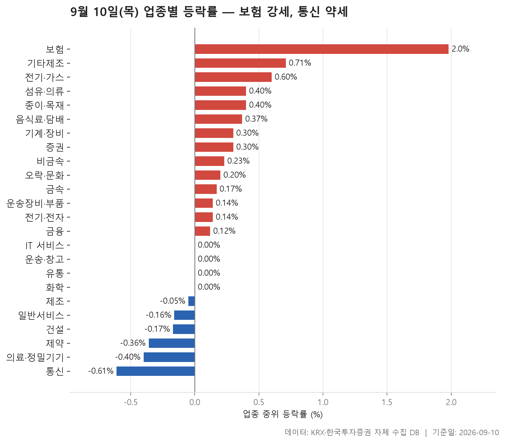
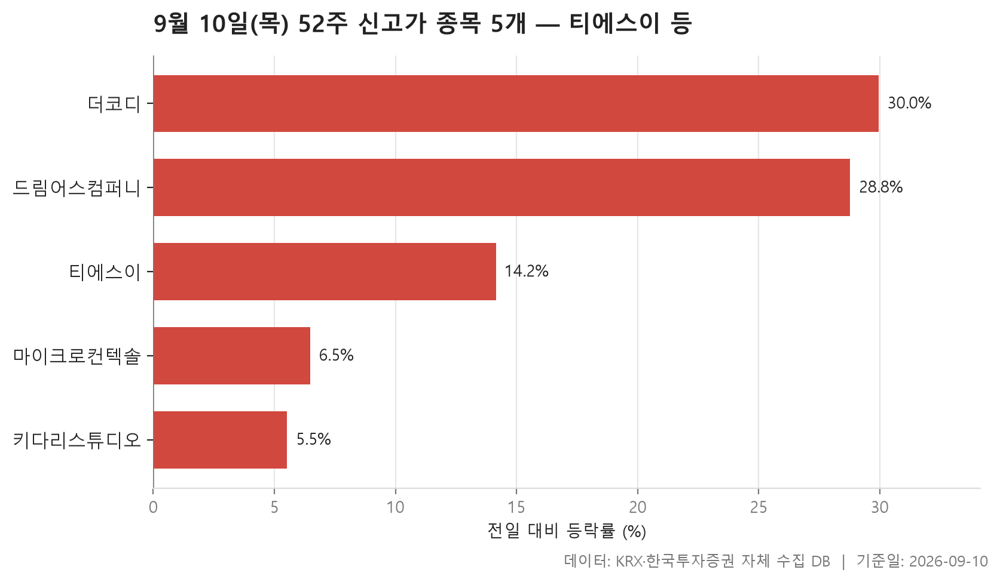
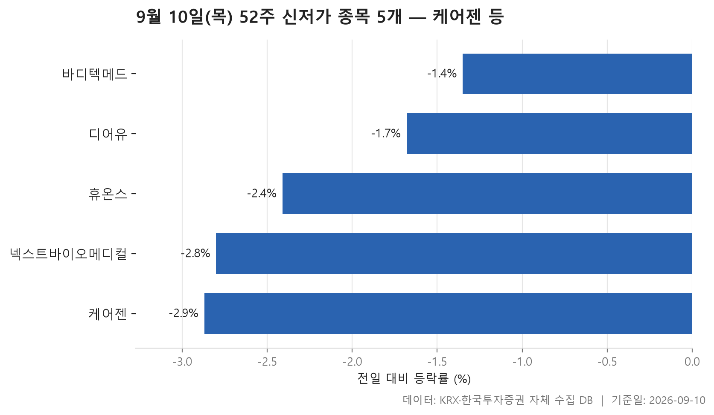
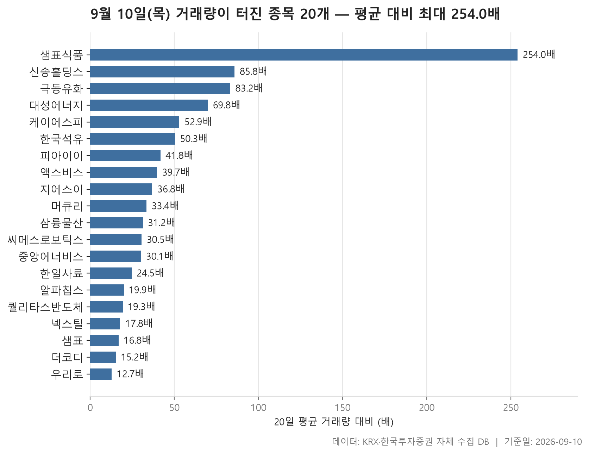

9월 10일 장이 끝난 뒤 데이터베이스에서 네 가지를 뽑았습니다. 업종별로 종목들이 어느 쪽으로 기울었는지, 52주 최고가를 넘어선 종목과 최저가를 밑돈 종목, 그리고 평소보다 거래량이 유난히 많았던 종목들입니다.

먼저 전체 그림부터. 24개 업종의 중위 등락률을 늘어놓았을 때 한가운데 놓인 값이 +0.14%입니다. 0을 살짝 넘긴 정도이니 시장 전체가 한 방향으로 쏠린 날은 아니었습니다. 다만 업종별로는 편차가 있었고, 맨 위 보험과 맨 아래 통신 사이의 온도차가 눈에 들어옵니다.

한편 눈에 띄는 대목은 개별 종목 쪽입니다. 업종 중위값은 대체로 0 근처에 머물렀는데, 상한가에 가까운 종목이 여럿 나왔고 20일 평균의 수십 배가 넘는 거래량이 찍힌 종목도 스무 개나 걸렸습니다. 지수가 조용한 날에도 종목 단위에서는 꽤 시끄러운 일이 벌어질 수 있다는 것을, 오늘 표들이 그대로 보여 줍니다.

> 기준일: 2026-09-10 · 집계: 자체 수집 데이터베이스

## 업종 등락률 — 24개 중 14개 상승

순위는 업종 안 종목들의 중위 등락률로 매겼습니다. 평균을 쓰면 상한가 한 종목에 업종 전체가 끌려가 버리기 때문입니다. 그 기준으로 가장 위에 놓인 것이 보험(+1.98%), 가장 아래가 통신(-0.61%)입니다. 24개 업종 가운데 14개가 플러스, 6개가 마이너스였고 나머지는 0에 붙어 있습니다.

보험은 표에서 가장 깔끔한 모양을 하고 있습니다. 중위값이 +1.98%인데 평균도 +2.32%로 비슷한 자리에 있고, 오른 종목 비율이 90.90%입니다. 열한 종목 중 거의 전부가 같은 방향으로 움직였다는 뜻이지요. 가장 크게 오른 한화손해보험이 +6.21%였지만 이 종목 하나가 업종 평균을 밀어올린 폭은 0.56%p로, 중위값과 평균의 간격을 설명하기에는 오히려 큽니다. 다시 말해 한 종목이 만든 강세가 아니라 업종 전체가 함께 올라간 쪽입니다. 전기·가스도 비슷합니다. 오른 종목이 열 곳 중 일곱 곳이었고, 중위값과 평균이 나란히 놓여 있습니다.

반대로 어긋난 곳들이 더 흥미롭습니다. 기타제조는 중위 등락률이 +0.71%로 위쪽인데 평균은 +0.09%까지 내려앉아 있습니다. 대부분 조금씩 올랐지만 크게 빠진 몇 종목이 평균을 끌어내린 형태입니다. 기계·장비와 음식료·담배는 그 반대인데, 중위값은 각각 +0.30%, +0.37%인데 평균이 +1.04%, +0.98%로 벌어져 있습니다. 상한가 부근까지 오른 종목이 평균을 들어올린 자리입니다. 의료·정밀기기는 더 눈에 띕니다. 중위값이 -0.40%로 아래쪽에 있는데 평균은 -0.15%이고, 그 업종에서 가장 크게 움직인 종목은 오히려 +14.15%로 올랐습니다. 업종 안에서 방향이 갈렸다는 신호입니다.

아래쪽 끝에는 통신이 있습니다. 열두 종목 중 오른 것이 여섯에 하나꼴로, 표 전체에서 상승 비율이 가장 낮습니다. 중위값 -0.61%와 평균 -0.79%가 모두 마이너스이고 방향도 일치합니다. 제약, 건설, 일반서비스도 중위값과 평균이 함께 마이너스인 구간에 모여 있습니다. 다만 화학은 중위값이 0.00%인데 평균이 -0.29%로, 가장 크게 빠진 종목이 -44.79%였다는 점을 함께 보면 평균이 어디서 깎였는지 짐작이 갑니다. 거래대금 쪽에서는 전기·전자가 압도적으로 컸는데, 정작 중위 등락률은 +0.14%로 표 한가운데였습니다. 돈이 많이 오간 것과 업종이 한 방향으로 움직인 것은 별개라는 이야기입니다.

| 업종 | 종목수(개) | 중위등락률(%) | 평균등락률(%) | 상승비율(%) | 주도종목 | 주도종목등락률(%) | 평균기여도(%p) | 거래대금합계(억원) |
|---|---|---|---|---|---|---|---|---|
| 보험 | 11 | +1.98 | +2.32 | 90.90 | 한화손해보험 | +6.21 | 0.56 | 3,642.20 |
| 기타제조 | 14 | +0.71 | +0.09 | 57.10 | 피코그램 | -2.70 | -0.19 | 12.20 |
| 전기·가스 | 10 | +0.60 | +0.85 | 70.00 | 대성에너지 | +4.45 | 0.45 | 1,380.90 |
| 섬유·의류 | 49 | +0.40 | +0.51 | 59.20 | 좋은사람들 | -9.45 | -0.19 | 336.10 |
| 종이·목재 | 27 | +0.40 | +0.76 | 59.30 | 동화기업 | +6.49 | 0.24 | 82.10 |
| 음식료·담배 | 84 | +0.37 | +0.98 | 64.30 | 샘표식품 | +29.96 | 0.36 | 2,607.30 |
| 기계·장비 | 205 | +0.30 | +1.04 | 57.60 | 원익피앤이 | +29.98 | 0.15 | 49,589.10 |
| 증권 | 18 | +0.30 | +0.14 | 61.10 | 상상인증권 | -6.22 | -0.35 | 2,323.60 |
| 비금속 | 36 | +0.23 | +0.73 | 61.10 | 한국석유 | +10.30 | 0.29 | 2,981.00 |
| 오락·문화 | 67 | +0.20 | +0.48 | 55.20 | 드림어스컴퍼니 | +28.78 | 0.43 | 945.20 |
| 금속 | 130 | +0.17 | -0.10 | 52.30 | 에이에프더블류 | -26.21 | -0.20 | 7,417.20 |
| 운송장비·부품 | 132 | +0.14 | +0.32 | 52.30 | 삼현 | +13.68 | 0.10 | 14,653.30 |
| 전기·전자 | 365 | +0.14 | +0.62 | 51.20 | 알파칩스 | +29.98 | 0.08 | 196,706.20 |
| 금융 | 111 | +0.12 | +0.29 | 51.40 | 샘표 | +29.99 | 0.27 | 23,163.60 |
| IT 서비스 | 244 | 0.00 | +0.39 | 46.30 | 핀텔 | +20.01 | 0.08 | 7,266.50 |
| 운송·창고 | 28 | 0.00 | +0.25 | 46.40 | 흥아해운 | +8.01 | 0.29 | 4,583.00 |
| 유통 | 154 | 0.00 | +0.01 | 45.50 | 흥구석유 | +20.02 | 0.13 | 11,295.80 |
| 화학 | 220 | 0.00 | -0.29 | 42.30 | 코이즈 | -44.79 | -0.20 | 16,633.80 |
| 제조 | 7 | -0.05 | +0.13 | 28.60 | 에넥스 | +1.46 | 0.21 | 5.50 |
| 일반서비스 | 167 | -0.16 | -0.16 | 40.70 | 바이오인프라 | -13.09 | -0.08 | 10,174.80 |
| 건설 | 51 | -0.17 | -0.15 | 37.30 | 세종텔레콤 | -7.34 | -0.14 | 4,743.90 |
| 제약 | 166 | -0.36 | -0.62 | 36.10 | 삼익제약 | -7.88 | -0.05 | 8,296.70 |
| 의료·정밀기기 | 98 | -0.40 | -0.15 | 36.70 | 티에스이 | +14.15 | 0.14 | 6,223.60 |
| 통신 | 12 | -0.61 | -0.79 | 16.70 | 더즌 | -5.87 | -0.49 | 1,575.90 |

## 52주 신고가 5개 — 최고 더코디 29.96%

52주 최고가를 넘어선 종목은 다섯 개입니다. 시가총액 500억원, 거래대금 3억원 이상의 보통주만 걸렀으니 아주 작은 종목들은 빠져 있습니다. 다섯 중 넷이 KOSDAQ이고, 업종은 넷으로 나뉘는데 전기·전자가 둘로 가장 많습니다.

올라간 폭은 제법 넓게 퍼져 있습니다. 가운데 놓인 값이 14.15%인데, 위로는 더코디가 29.96%까지 갔고 아래로는 키다리스튜디오가 5.53%입니다. 신고가라고 해서 전부 급등으로 뚫은 것은 아니라는 뜻입니다. 키다리스튜디오와 마이크로컨텍솔은 이전 최고가와 오늘 종가가 그리 멀지 않은 자리에 있어, 가격대를 한 칸 밀어 올린 정도로 보입니다.

규모 차이도 큽니다. 시가총액이 가장 큰 티에스이가 33,903억원인데, 목록 아래쪽의 더코디는 510억원입니다. 티에스이는 거래대금도 2,368.30억원으로 다섯 종목 중 유일하게 천억 단위이고, 앞서 업종 표에서 의료·정밀기기의 가장 큰 변동 종목으로 이름이 올랐던 그 종목입니다. 업종 중위값은 마이너스였는데 그 안에서 신고가를 낸 종목이 있었던 셈이지요. 반대로 드림어스컴퍼니는 28.78% 올라 신고가를 냈지만 거래대금은 6.40억원에 그칩니다. 오른 폭과 오간 돈의 크기가 나란히 가지 않는다는 점은 이 표에서 꼭 짚어 둘 대목입니다.

| 종목명 | 종목코드 | 시장 | 업종 | 종가(원) | 등락률(%) | 이전52주최고(원) | 거래대금(억원) | 시가총액(억원) |
|---|---|---|---|---|---|---|---|---|
| 티에스이 | 131290 | KOSDAQ | 의료·정밀기기 | 306,500 | +14.15 | 294,000 | 2,368.30 | 33,903 |
| 마이크로컨텍솔 | 098120 | KOSDAQ | 전기·전자 | 51,000 | +6.47 | 49,500 | 104.30 | 4,240 |
| 키다리스튜디오 | 020120 | KOSPI | IT 서비스 | 8,400 | +5.53 | 8,100 | 79.90 | 3,113 |
| 드림어스컴퍼니 | 060570 | KOSDAQ | 오락·문화 | 4,900 | +28.78 | 4,535 | 6.40 | 726 |
| 더코디 | 224060 | KOSDAQ | 전기·전자 | 9,890 | +29.96 | 7,610 | 103.30 | 510 |

## 52주 신저가 5개 — 최저 케어젠 -2.87%

최저가를 밑돈 종목도 다섯 개인데, 신고가 쪽과는 표의 결이 완전히 다릅니다. 하락 폭이 가장 큰 케어젠이 -2.87%, 가장 작은 바디텍메드가 -1.35%로, 다섯 종목 모두 좁은 구간에 몰려 있습니다. 가운데 놓인 값은 -2.41%. 하루에 크게 무너져서 최저가를 깬 것이 아니라, 이미 바닥 근처에 있던 가격이 조금 더 내려가면서 선을 넘은 모양입니다.

실제로 종가와 이전 52주 최저가를 나란히 보면 그 간격이 아주 좁습니다. 디어유는 17,580원 종가에 이전 최저가가 17,610원, 바디텍메드는 9,520원에 9,530원입니다. 몇십 원 차이로 기록을 갈아 쓴 셈이지요.

구성도 한쪽으로 쏠려 있습니다. 다섯 종목 전부 KOSDAQ이고, 업종은 셋으로 나뉘는데 제약이 셋입니다. 앞선 업종 표에서 제약의 중위 등락률이 -0.36%로 아래쪽에 있었고 오른 종목이 열 곳 중 넷도 안 됐던 점과 방향이 맞아떨어집니다. 시가총액이 가장 큰 케어젠이 22,721억원인데 거래대금은 43.50억원, 나머지는 그보다도 적습니다. 거래가 많지 않은 상태에서 조용히 아래로 밀렸다는 정도까지가, 이 표에서 읽을 수 있는 범위입니다.

| 종목명 | 종목코드 | 시장 | 업종 | 종가(원) | 등락률(%) | 이전52주최저(원) | 거래대금(억원) | 시가총액(억원) |
|---|---|---|---|---|---|---|---|---|
| 케어젠 | 214370 | KOSDAQ | 제약 | 42,300 | -2.87 | 42,950 | 43.50 | 22,721 |
| 디어유 | 376300 | KOSDAQ | IT 서비스 | 17,580 | -1.68 | 17,610 | 20.40 | 4,173 |
| 넥스트바이오메디컬 | 389650 | KOSDAQ | 의료·정밀기기 | 29,550 | -2.80 | 30,050 | 5.70 | 2,446 |
| 휴온스 | 243070 | KOSDAQ | 제약 | 20,250 | -2.41 | 20,700 | 6.40 | 2,426 |
| 바디텍메드 | 206640 | KOSDAQ | 제약 | 9,520 | -1.35 | 9,530 | 4.90 | 2,086 |

## 거래량 급증 20개 — 최고 샘표식품 254배

당일 거래량이 직전 20거래일 평균의 5배를 넘은 종목 중 스무 개를 뽑았습니다. 배수의 분포가 상당히 기울어져 있는데, 가운데 놓인 값이 32.30배인 반면 맨 위 샘표식품은 254배입니다. 아래쪽 우리로가 12.70배이니, 위쪽 한두 종목이 유독 멀리 떨어져 있는 형태입니다.

방향은 거의 한쪽입니다. 스무 종목 모두 플러스로 끝났고, 그중 샘표식품·알파칩스·샘표·더코디는 각각 29.96%, 29.98%, 29.99%, 29.96%로 상한가 부근입니다. 다만 배수와 등락률이 나란히 가지는 않습니다. 샘표식품은 배수와 등락률이 모두 맨 위에 있지만, 극동유화는 83.20배가 찍히고도 +3.33%에 머물렀고 대성에너지는 69.80배에 +4.45%였습니다. 반대로 알파칩스는 배수가 19.90배로 목록 중하위인데 상한가 부근까지 올랐습니다. 거래가 몰린 것과 가격이 튄 것은 같은 이야기가 아닙니다.

거래대금 쪽을 보면 규모의 차이도 드러납니다. 배수가 가장 높은 샘표식품의 거래대금은 493.30억원인데, 배수가 가장 낮은 우리로는 864.10억원입니다. 원래 거래가 많던 종목은 배수가 크게 나오기 어렵고, 평소 거래가 적던 종목은 조금만 늘어도 배수가 크게 잡힌다는 점을 감안해서 읽어야 합니다. 샘표는 44,523주 거래에 24.80억원이 오갔는데 배수는 16.80배로 목록 아래쪽입니다. 한 주 가격이 높으면 주식 수 기준 배수와 금액 기준 규모가 어긋날 수 있습니다.

구성은 KOSPI 7개, KOSDAQ 13개로 갈리고, 업종은 열 개로 흩어졌습니다. 가장 많은 것이 전기·전자 5개인데, 그 업종의 중위 등락률은 +0.14%로 표 한가운데였습니다. 업종 전체가 움직인 것이 아니라 그 안의 일부 종목에 거래가 몰렸다는 뜻입니다. 이 목록에는 앞선 표에 나왔던 이름들도 겹쳐 있습니다. 대성에너지와 한국석유는 각자 업종에서 가장 크게 움직인 종목이었고, 더코디는 52주 신고가 목록에도 올랐습니다. 시가총액은 넥스틸이 3,736억원으로 가장 크지만 배수는 17.80배로 아래쪽입니다. 규모가 큰 쪽보다 작은 쪽에서 배수가 크게 찍힌 날이었습니다.

| 종목명 | 종목코드 | 시장 | 업종 | 종가(원) | 등락률(%) | 거래량(주) | 평균거래량(주) | 배수(배) | 거래대금(억원) | 시가총액(억원) |
|---|---|---|---|---|---|---|---|---|---|---|
| 샘표식품 | 248170 | KOSPI | 음식료·담배 | 30,150 | +29.96 | 1,725,193 | 6,793 | 254.00 | 493.30 | 1,377 |
| 신송홀딩스 | 006880 | KOSPI | 유통 | 4,730 | +7.50 | 1,330,102 | 15,504 | 85.80 | 66.10 | 560 |
| 극동유화 | 014530 | KOSPI | 화학 | 3,415 | +3.33 | 6,476,572 | 77,847 | 83.20 | 237.70 | 1,191 |
| 대성에너지 | 117580 | KOSPI | 전기·가스 | 7,510 | +4.45 | 4,936,530 | 70,736 | 69.80 | 396.90 | 2,065 |
| 케이에스피 | 073010 | KOSDAQ | 기계·장비 | 3,350 | +20.07 | 6,247,857 | 118,153 | 52.90 | 207.30 | 1,346 |
| 한국석유 | 004090 | KOSPI | 비금속 | 12,740 | +10.30 | 7,463,721 | 148,387 | 50.30 | 1,013.90 | 1,617 |
| 피아이이 | 452450 | KOSDAQ | 기계·장비 | 4,925 | +13.48 | 5,449,744 | 130,472 | 41.80 | 281.70 | 1,774 |
| 액스비스 | 0011A0 | KOSDAQ | 전기·전자 | 11,700 | +12.50 | 5,802,794 | 146,276 | 39.70 | 682.20 | 1,092 |
| 지에스이 | 053050 | KOSDAQ | - | 2,065 | +5.90 | 3,900,385 | 106,039 | 36.80 | 84.70 | 619 |
| 머큐리 | 100590 | KOSDAQ | 전기·전자 | 4,970 | +14.12 | 10,088,459 | 302,142 | 33.40 | 500.20 | 852 |
| 삼륭물산 | 014970 | KOSDAQ | 종이·목재 | 4,590 | +4.56 | 774,928 | 24,870 | 31.20 | 37.50 | 680 |
| 씨메스로보틱스 | 475400 | KOSDAQ | 기계·장비 | 19,460 | +13.07 | 952,659 | 31,191 | 30.50 | 197.40 | 2,298 |
| 중앙에너비스 | 000440 | KOSDAQ | 유통 | 13,550 | +9.89 | 1,114,119 | 37,038 | 30.10 | 159.90 | 844 |
| 한일사료 | 005860 | KOSDAQ | 음식료·담배 | 2,490 | +3.32 | 9,212,719 | 375,464 | 24.50 | 242.50 | 981 |
| 알파칩스 | 117670 | KOSDAQ | 전기·전자 | 10,450 | +29.98 | 250,059 | 12,576 | 19.90 | 24.30 | 696 |
| 퀄리타스반도체 | 432720 | KOSDAQ | 전기·전자 | 10,080 | +12.37 | 1,547,109 | 80,194 | 19.30 | 157.00 | 1,430 |
| 넥스틸 | 092790 | KOSPI | 금속 | 14,370 | +7.96 | 8,222,879 | 462,305 | 17.80 | 1,228.20 | 3,736 |
| 샘표 | 007540 | KOSPI | 금융 | 55,700 | +29.99 | 44,523 | 2,646 | 16.80 | 24.80 | 1,602 |
| 더코디 | 224060 | KOSDAQ | 전기·전자 | 9,890 | +29.96 | 1,120,348 | 73,489 | 15.20 | 103.30 | 510 |
| 우리로 | 046970 | KOSDAQ | 유통 | 6,700 | +1.98 | 12,804,582 | 1,005,389 | 12.70 | 864.10 | 2,936 |

## 정리

정리하면, 24개 업종의 중위 등락률 중간값이 +0.14%인 조용한 장이었지만 업종 안쪽과 종목 단위에서는 방향이 꽤 갈렸습니다. 보험은 열한 종목 중 거의 전부가 함께 오른 드문 모양이었고, 통신과 제약은 반대쪽 끝에 있었습니다. 52주 신저가 다섯 종목이 모두 KOSDAQ이고 그중 셋이 제약이라는 점, 거래량이 터진 스무 종목이 열 개 업종에 흩어져 있으면서도 전부 상승으로 끝났다는 점이 오늘 표에서 가장 또렷한 대목입니다.\n\n다만 이 글은 종가 기준으로 집계한 결과를 설명한 것일 뿐, 왜 그렇게 움직였는지에 대한 정보는 데이터에 들어 있지 않습니다. 상승 비율이 높다거나 중위값과 평균이 벌어져 있다는 정도까지가 표가 말해 주는 범위이고, 그 이상은 여기서 알 수 없습니다. 신고가·신저가와 거래량 배수는 모두 정해진 관측 구간과 시가총액·거래대금 조건을 걸어 뽑은 것이므로, 조건을 달리하면 목록도 달라집니다.

## 집계 기준

**업종 등락률**

- **기준**: 2026-09-09 종가 → 2026-09-10 종가
- **순위**: 업종 내 종목 등락률의 중위값 (평균은 참고용으로 함께 표시)
- **주도종목**: 그 업종에서 등락률 절대값이 가장 큰 종목 (동점이면 거래대금이 큰 쪽)
- **평균기여도**: 그 종목 하나가 업종 평균을 움직인 폭 (등락률 ÷ 종목수). 중위값과 평균의 격차가 이 값에 가까우면 평균을 만든 것이 그 종목이고, 훨씬 크면 다른 종목들도 함께 움직인 것입니다
- **필터**: 업종 내 보통주 5종목 이상
- **전체업종중위등락률(%)**: 0.14

**52주 신고가**

- **기준**: 종가 > 직전 52주 최고가
- **관측구간**: 2025-08-28 ~ 2026-09-09 (252거래일)
- **필터**: 시가총액 500억 이상, 거래대금 3억 이상, 보통주

**52주 신저가**

- **기준**: 종가 < 직전 52주 최저가
- **관측구간**: 2025-08-28 ~ 2026-09-09 (252거래일)
- **필터**: 시가총액 500억 이상, 거래대금 3억 이상, 보통주

**거래량 급증**

- **기준**: 당일 거래량 ≥ 직전 20거래일 평균 × 5
- **관측구간**: 2026-08-12 ~ 2026-09-09 (20거래일)
- **필터**: 시가총액 500억 이상, 거래대금 3억 이상, 보통주

## 데이터 출처 및 유의사항

- **데이터출처**: 한국거래소(KRX) 공시 데이터와 한국투자증권 OpenAPI 를 직접 수집해 구축한 자체 데이터베이스
- **집계방식**: 수집·집계·차트 생성을 직접 구현한 파이프라인에서 자동 산출
- **작성고지**: 본문의 표·통계·차트는 자체 데이터베이스에서 계산된 값이며, 문장 작성 과정에 AI 도구를 활용했습니다.
- **면책**: 본 글은 정보 제공을 목적으로 하며 특정 종목의 매수·매도를 추천하지 않습니다. 제시된 수치는 과거 데이터이고 미래 수익을 보장하지 않습니다. 투자 판단과 그 결과에 대한 책임은 투자자 본인에게 있습니다.

