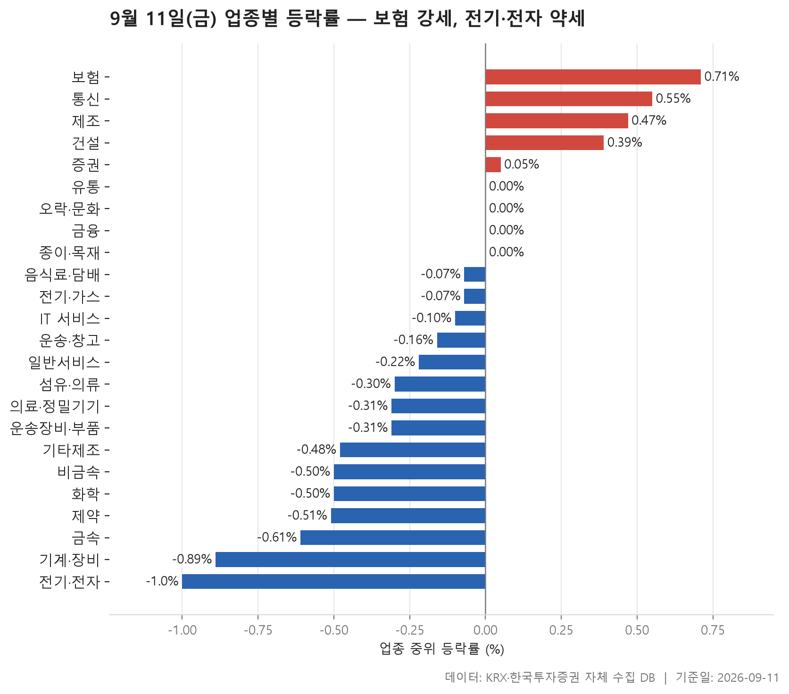
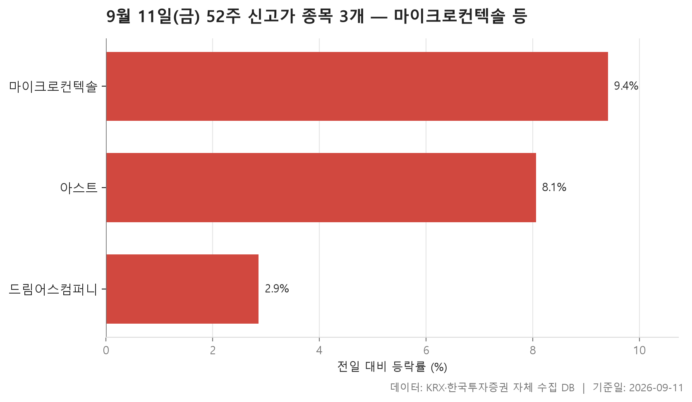
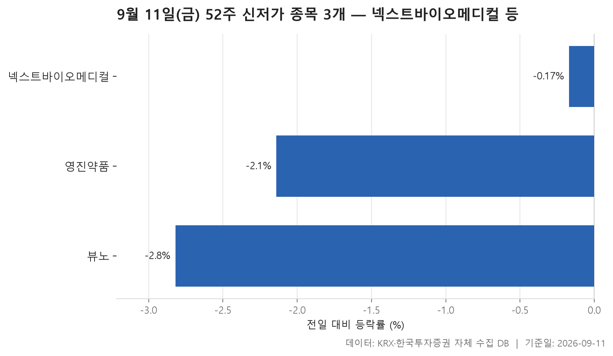
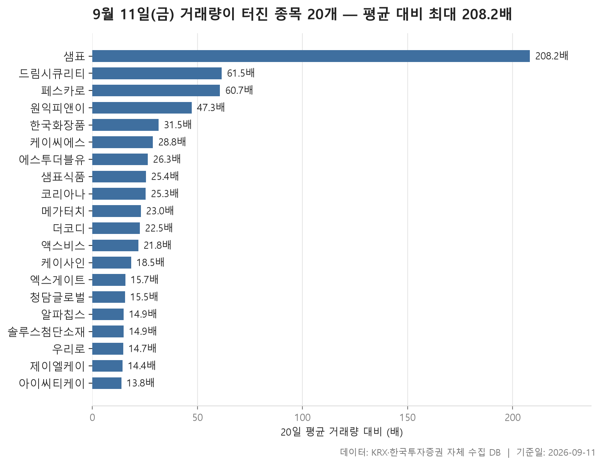

9월 11일 금요일 장이 끝났습니다. 오늘은 업종별 흐름, 52주 최고가와 최저가를 갈아치운 종목, 그리고 평소보다 거래가 크게 늘어난 종목을 차례로 놓고 봅니다.

먼저 전체 그림부터 말해 두면, 하루를 지배한 것은 완만한 내림세였습니다. 24개 업종의 중위 등락률을 한 줄로 늘어놓았을 때 한가운데 놓인 값이 -0.13%. 큰 폭은 아니지만 방향은 아래쪽이었고, 양수를 기록한 업종이 5개, 음수가 15개로 아래쪽이 세 배쯤 많았습니다. 가장 강한 쪽이 보험(+0.71%), 가장 약한 쪽이 전기·전자(-1%)였으니 위아래로 벌어진 폭 자체는 그렇게 크지 않습니다.

그런데 개별 종목 단위로 내려가면 그림이 꽤 다릅니다. 오늘 거래량이 직전 20거래일 평균의 5배를 넘긴 종목이 20개 잡혔고, 그 안에는 하루 만에 두 자릿수로 움직인 이름들이 여럿 섞여 있습니다. 업종 지표는 조용한데 종목 단위에서는 소란스러웠던 하루, 그 어긋남을 따라가 보겠습니다.

참고로 업종 순위는 평균이 아니라 업종 안 종목들의 중위 등락률로 매겼습니다. 상한가 한 종목이 평균을 들어 올리는 일이 흔하기 때문입니다. 오늘 표에는 바로 그런 사례가 여럿 보이므로, 중위값과 평균을 나란히 놓고 보는 것이 이 글의 출발점입니다.

> 기준일: 2026-09-11 · 집계: 자체 수집 데이터베이스

## 업종 등락률 — 24개 중 15개 하락

위쪽 다섯 칸을 보면 보험, 통신, 제조, 건설, 증권 순입니다. 보험은 중위 등락률 +0.71%에 평균 +1.36%, 그리고 11개 종목 가운데 오른 종목이 81.80%로 이 표에서 가장 높습니다. 즉 한두 종목이 끌어올린 모양이 아니라 업종 안이 고르게 위쪽을 향했다는 뜻이죠. 가장 크게 움직인 삼성화재가 +6.03%였고, 이 종목 하나가 업종 평균을 0.55%p 밀어 올린 몫으로 계산됩니다. 중위값과 평균의 간격을 이 값이 상당 부분 설명하기는 하지만, 상승비율이 워낙 높으니 나머지 종목도 함께 걸었다고 읽는 편이 자연스럽습니다.

반면 통신은 결이 다릅니다. 중위 등락률은 +0.55%인데 평균은 +2.26%로 훌쩍 뛰고, 오른 종목은 절반을 겨우 넘는 수준입니다. 이 업종에서 가장 크게 오른 프리티가 +29.89%였고 그 한 종목이 평균에 얹은 몫이 2.30%p입니다. 중위값과 평균이 벌어진 폭을 거의 이 종목 하나로 설명할 수 있다는 이야기입니다. 제조도 비슷하게 평균이 중위값보다 높은데, 종목수가 7개뿐이라 에넥스의 +10.85%가 평균을 1.55%p 움직였습니다. 종목수가 적은 업종의 평균은 이렇게 한 종목에 쉽게 휘둘립니다.

건설은 반대쪽 사례입니다. 중위 등락률이 +0.39%인데 평균은 +0.22%로 오힐려 낮고, 51개 종목 중 오른 종목이 62.70%였습니다. 가장 크게 움직인 종목이 -8.02%로 내린 쪽이었으니, 다수가 조금씩 오르고 일부가 크게 빠져 평균이 눌린 구조입니다. 증권도 중위값은 +0.05%로 간신하게 양수인데 평균은 -0.18%이고, 오른 종목과 내린 종목이 정확하게 반으로 갈렸습니다.

아래쪽은 상승비율이 눈에 들어옵니다. 비금속, 화학, 제약, 금속, 기계·장비, 전기·전자가 모두 셋 중 하나 안팎만 올랐고, 특히 전기·전자는 364개 종목 중 28.00%만 상승해 이 표에서 가장 낮습니다. 그런데 전기·전자의 평균은 -0.47%로 중위값 -1%보다 높습니다. 아모텍이 +29.98%로 크게 올랐지만 평균에 얹은 몫은 0.08%p에 불과하니, 평균이 중위값보다 높은 이유를 그 한 종목으로 다 넣기는 어렵습니다. 오른 쪽 종목들의 폭이 대제로 컸다고 보는 편이 맞을 겁니다. 거래대금 합계 129,362.20억원도 다른 업종과 비교가 안 되는 규모라, 오늘 돈이 가장 많이 오간 곳이 중위값으로는 가장 약했다는 점은 기억해 둘 만합니다.

한 가지 더. 화학에서는 코이즈가 -49.06%를 기록했는데, 222개 종목에 나눠지면서 평균을 -0.22%p 끌어내린 정도로 희석됐습니다. 기계·장비도 가장 크게 움직인 종목이 -25.47%였지만 평균에 남긴 흔적은 -0.12%p에 그칩니다. 중위값이 -0.89%, 평균이 -1.02%로 나란하게 낮았으니 이건 한 종목의 문제가 아니라 업종 전승이 같이 밀린 날이었습니다. 거래대금도 20,965.30억원으로 적지 않았습니다. 반대로 유통과 오락·문화, 금융, 종이·목재는 중위 등락률이 0.00%로 정하게 가운데에 멈추어, 업종 전체가 뚜렷한 방향을 잡지 못했다는 인상을 거듭니다.

| 업종 | 종목수(개) | 중위등락률(%) | 평균등락률(%) | 상승비율(%) | 주도종목 | 주도종목등락률(%) | 평균기여도(%p) | 거래대금합계(억원) |
|---|---|---|---|---|---|---|---|---|
| 보험 | 11 | +0.71 | +1.36 | 81.80 | 삼성화재 | +6.03 | 0.55 | 2,662.10 |
| 통신 | 13 | +0.55 | +2.26 | 53.80 | 프리티 | +29.89 | 2.30 | 773.40 |
| 제조 | 7 | +0.47 | +2.27 | 71.40 | 에넥스 | +10.85 | 1.55 | 22.10 |
| 건설 | 51 | +0.39 | +0.22 | 62.70 | 세종텔레콤 | -8.02 | -0.16 | 6,128.20 |
| 증권 | 18 | +0.05 | -0.18 | 50.00 | 미래에셋증권 | -3.74 | -0.21 | 916.30 |
| 유통 | 154 | 0.00 | +0.31 | 42.90 | 비엘팜텍 | +29.83 | 0.19 | 8,912.00 |
| 오락·문화 | 67 | 0.00 | +0.12 | 46.30 | 아티스트스튜디오 | -13.90 | -0.21 | 770.10 |
| 금융 | 111 | 0.00 | -0.18 | 45.00 | 한미사이언스 | -8.71 | -0.08 | 15,659.10 |
| 종이·목재 | 27 | 0.00 | -0.23 | 37.00 | 동화기업 | -6.61 | -0.24 | 62.50 |
| 음식료·담배 | 84 | -0.07 | -0.37 | 42.90 | 샘표식품 | -14.76 | -0.18 | 2,358.80 |
| 전기·가스 | 10 | -0.07 | +0.23 | 40.00 | SGC에너지 | +3.90 | 0.39 | 846.00 |
| IT 서비스 | 244 | -0.10 | +1.19 | 44.30 | 에스피소프트 | +29.99 | 0.12 | 10,279.40 |
| 운송·창고 | 28 | -0.16 | -0.50 | 42.90 | STX그린로지스 | -4.50 | -0.16 | 1,856.20 |
| 일반서비스 | 168 | -0.22 | -0.35 | 36.30 | 페스카로 | +13.51 | 0.08 | 8,542.30 |
| 섬유·의류 | 49 | -0.30 | -0.22 | 36.70 | 씨싸이트 | -8.48 | -0.17 | 172.00 |
| 의료·정밀기기 | 99 | -0.31 | -0.83 | 38.40 | 티에스이 | -15.01 | -0.15 | 5,154.50 |
| 운송장비·부품 | 133 | -0.31 | -0.39 | 36.10 | 코다코 | +10.24 | 0.08 | 10,165.70 |
| 기타제조 | 14 | -0.48 | -0.18 | 42.90 | 브이씨 | +4.82 | 0.34 | 9.40 |
| 비금속 | 36 | -0.50 | -0.98 | 30.60 | 서산 | -10.95 | -0.30 | 805.80 |
| 화학 | 222 | -0.50 | -0.87 | 32.00 | 코이즈 | -49.06 | -0.22 | 13,062.30 |
| 제약 | 166 | -0.51 | -0.55 | 30.10 | 로킷헬스케어 | +11.79 | 0.07 | 5,830.20 |
| 금속 | 130 | -0.61 | -0.46 | 30.00 | 이렘 | +29.83 | 0.23 | 5,267.60 |
| 기계·장비 | 206 | -0.89 | -1.02 | 32.50 | 수성웹툰 | -25.47 | -0.12 | 20,965.30 |
| 전기·전자 | 364 | -1.00 | -0.47 | 28.00 | 아모텍 | +29.98 | 0.08 | 129,362.20 |

## 52주 신고가 3개 — 최고 마이크로컨텍솔 9.41%

52주 최고가를 넘어선 종목은 3개뿐입니다. 시가총액 500억 이상, 거래대금 3억 이상이라는 조건을 걸었으니 아주 작은 종목은 보이지 않는 집계인데, 그렇다 해도 셋은 적은 숫자입니다. 업종 전체가 아래쪽으로 기울었던 하루임을 감안하면 어댑지 않은 결과입니다.

셋 모두 코스닥이고, 업종도 전기·전자, 운송장비·부품, 오락·문화로 제각각입니다. 특정 테마가 한꺼번에 신고가를 낸 모습은 아니라는 뜻이죠. 오름폭이 가장 큰 마이크로컨텍솔이 +9.41%, 가장 작은 드림어스컴퍼니가 +2.86%이고, 중간에 놓인 값은 8.06%입니다. 셋뿐이니 중간값은 가운데 종목의 등락률 그 자신이기도 합니다.

눈여겨볼 것은 드림어스컴퍼니입니다. 종가 5,040원에 이전 52주 최고가가 4,945원이니 간신하게 턱을 넘긴 정도이고, 오름폭도 셋 중 가장 작습니다. 신고가라는 말이 항상 가팼른 상승을 뜻하지는 않는다는 예입니다. 아스트도 종가 6,300원에 이전 고점이 5,900원이었습니다.

반대로 마이크로컨텍솔은 종가 55,800원으로 이전 고점 52,000원을 여유 있게 넘겼고, 시가총액도 4,639억원으로 이 표에서 가장 큽니다. 거래대금은 160.20억원으로 셋 중 가장 많은데, 아스트와 드림어스컴퍼니는 각각 15.90억원, 14.90억원에 머물러 사실상 한 종목에 거래가 몰렸습니다. 시가총액로 보면 드림어스컴퍼니는 747억원으로 셋 중 가장 작지만 거래대금은 아스트와 크게 다르지 않습니다. 시가총액 순서와 오름폭 순서가 공교롭게 맞아떨어진 세 종목이기도 합니다.

| 종목명 | 종목코드 | 시장 | 업종 | 종가(원) | 등락률(%) | 이전52주최고(원) | 거래대금(억원) | 시가총액(억원) |
|---|---|---|---|---|---|---|---|---|
| 마이크로컨텍솔 | 098120 | KOSDAQ | 전기·전자 | 55,800 | +9.41 | 52,000 | 160.20 | 4,639 |
| 아스트 | 067390 | KOSDAQ | 운송장비·부품 | 6,300 | +8.06 | 5,900 | 15.90 | 2,653 |
| 드림어스컴퍼니 | 060570 | KOSDAQ | 오락·문화 | 5,040 | +2.86 | 4,945 | 14.90 | 747 |

## 52주 신저가 3개 — 최저 뷰노 -2.82%

신저가 쪽도 3개입니다. 신고가와 개수가 같다는 점이 조금 뜻밖인데, 업종 상승비율이 전반적으로 낮았던 하루치고는 최저가를 깨고 내려간 종목이 많지 않았다는 이야기입니다. 시장 전체가 얕게 눌렸을 뿐 새로 바닥을 갈아치울 만큼 밀린 종목은 드봈었다고 읽을 수 있습니다.

내림폭 자체도 크지 않습니다. 가장 많이 내린 뷰노가 -2.82%, 가장 덜 내린 넥스트바이오메디컬이 -0.17%이고 가운데 값은 -2.14%입니다. 특히 넥스트바이오메디컬은 종가 29,500원에 이전 52주 최저가가 29,550원으로, 얇은 차이로 기준선 아래로 내려갔습니다. 영진약품도 종가 1,050원에 이전 저점이 1,054원이었습니다. 하루 급락이 아니라 이미 낮은 자리에 머물러 있던 종목이 조금 더 밀리면서 기준을 건드린 형태입니다. 이것이 신고가 쪽과 가장 다른 대목으로, 위로 뚫려나간 종목은 분명한 오름폭을 동반한 반면 아래로 떨어진 종목은 조금씩 밀려 기준을 넘어갔습니다.

업종은 의료·정밀기기, 제약, IT 서비스로 셋 다 다릅니다. 앞서 업종 표에서 제약의 상승비율이 30.10%, 의료·정밀기기가 38.40%로 낮았던 것과 방향은 맞물립니다. 반대로 IT 서비스는 중위값이 -0.10%지만 평균은 +1.19%로 오힐려 위로 들렸던 업종이니, 업종 하나가 한 방향으로만 움직이지는 않는다는 확인이기도 합니다.

시장별로는 영진약품만 코스피이고 나머지 둘은 코스닥이며, 거래대금은 셋 모두 다해서 10억원을 넘지 않아 신고가 쪽보다 한참 적습니다. 시가총액은 넥스트바이오메디컬이 2,442억원으로 가장 큽니다. 내려앉는 자리에는 거래가 생갑게 붙지 않았다는 점, 이것도 표가 보여 주는 사실입니다.

| 종목명 | 종목코드 | 시장 | 업종 | 종가(원) | 등락률(%) | 이전52주최저(원) | 거래대금(억원) | 시가총액(억원) |
|---|---|---|---|---|---|---|---|---|
| 넥스트바이오메디컬 | 389650 | KOSDAQ | 의료·정밀기기 | 29,500 | -0.17 | 29,550 | 5.20 | 2,442 |
| 영진약품 | 003520 | KOSPI | 제약 | 1,050 | -2.14 | 1,054 | 4.80 | 1,920 |
| 뷰노 | 338220 | KOSDAQ | IT 서비스 | 4,820 | -2.82 | 4,895 | 6.80 | 675 |

## 거래량 급증 20개 — 최고 샘표 208.20배

이 섹션이 오늘 표 가운데 가장 소란스럽습니다. 거래량이 직전 20거래일 평균의 5배를 넘긴 종목이 20개인데, 실제로는 배수가 훨쎝 높은 이름들이 모여 있습니다. 가운데에 놓인 값이 22.75배, 가장 낮은 아이씨티케이도 13.80배입니다. 5배로 받처를 걸었는데 걸린 종목들이 모두 열 배 넘게 늘었다는 건, 어중간하게 거래가 붙은 경우는 드봈고 붙은 곳에는 확실하게 붙었다는 뜻입니다.

맨 위 샘표는 208.20배로 두 번째와도 격차가 큽니다. 평소 거래량이 4,606주였던 종목에 959,104주가 오갔으니 자릿수가 달라진 셈인데, 등락률은 +3.23%에 그쳤습니다. 거래가 어리둥절하게 늘어난 것과 가게가 크게 움직이는 것은 별개라는 점을 보여 주는 대목입니다. 같은 맥락에서 더코디는 22.50배로 거래가 늘었는데 등락률은 0.00%, 코리아나도 25.30배에 +1.22%였습니다. 반대로 배수가 표에서 가장 낮은 편에 속하는 알파칩스는 +29.95%, 엑스게이트는 15.70배에 +29.94%로 오름폭이 가장 컸습니다. 배수와 등락률이 나란하게 가지 않는다는 점을 기억해 두면 이 표를 덜 오해하게 됩니다.

방향도 거의 한쪽입니다. 20개 중 내린 종목은 샘표식품 하나뿐인데, 그 폭이 -14.76%로 표에서 가장 큽니다. 업종 표에서 음식료·담배의 가장 크게 움직인 종목으로 잡힌 것과 같은 이름입니다. 흥미로운 것은 이름이 비슷한 샘표가 같은 표에서 가장 높은 배수로 +3.23% 올랐다는 점이고, 두 종목은 시장과 업종 분룬도 서로 다르게 잡혀 있습니다. 같은 날 거래가 트지면서 하나는 위로, 하나는 아래로 갔습니다.

구성을 보면 코스닥이 16개, 코스피가 4개이고 업종은 8개로 나뉩니다. 가장 많은 곳은 IT 서비스 6개, 그다음이 전기·전자입니다. 앞서 IT 서비스는 중위 등락률이 -0.10%인데 평균은 +1.19%였고, 전기·전자도 중위값보다 평균이 높았습니다. 업종의 가운데가 내려앉은 상태에서 평균을 위로 끌어당긴 종목들이 바로 이 거래 급증 목록에 모여 있는 구조입니다. 앞의 업종 표와 이 표를 함께 봐야 하루가 제대로 보이는 이유입니다.

시가총액으로는 솔루스첨단소재가 5,975억원으로 가장 큽고, 나머지는 수백 억원대에서 수천 억원대 사이에 흩어져 있습니다. 거래대금이 가장 큰 쪽은 엑스게이트 2,086.30억원과 우리로 1,764.50억원입니다. 우리로는 23,403,598주가 오갔지만 배수는 14.70배로 아래쪽에 머물렀는데, 평소 거래량이 1,593,330주로 이미 상당했기 때문입니다. 배수는 평소와 비교한 값이니, 거래가 원래 한적하던 종목은 설짝 붐어도 배수가 후하게 나온다는 점을 잭어 둔 후에 이 표를 보는 것이 좋습니다.

| 종목명 | 종목코드 | 시장 | 업종 | 종가(원) | 등락률(%) | 거래량(주) | 평균거래량(주) | 배수(배) | 거래대금(억원) | 시가총액(억원) |
|---|---|---|---|---|---|---|---|---|---|---|
| 샘표 | 007540 | KOSPI | 금융 | 57,500 | +3.23 | 959,104 | 4,606 | 208.20 | 634.50 | 1,654 |
| 드림시큐리티 | 203650 | KOSDAQ | IT 서비스 | 2,620 | +23.29 | 51,382,983 | 835,472 | 61.50 | 1,296.50 | 2,665 |
| 페스카로 | 0015S0 | KOSDAQ | 일반서비스 | 7,900 | +13.51 | 777,135 | 12,805 | 60.70 | 62.10 | 779 |
| 원익피앤이 | 217820 | KOSDAQ | 기계·장비 | 2,820 | +6.62 | 11,088,580 | 234,513 | 47.30 | 330.50 | 1,338 |
| 한국화장품 | 123690 | KOSPI | 유통 | 6,610 | +5.25 | 3,435,248 | 109,039 | 31.50 | 240.00 | 1,062 |
| 케이씨에스 | 115500 | KOSDAQ | IT 서비스 | 9,950 | +9.94 | 2,116,175 | 73,445 | 28.80 | 213.50 | 1,194 |
| 에스투더블유 | 488280 | KOSDAQ | IT 서비스 | 14,850 | +26.38 | 3,412,259 | 129,661 | 26.30 | 485.30 | 1,608 |
| 샘표식품 | 248170 | KOSPI | 음식료·담배 | 25,700 | -14.76 | 2,350,653 | 92,640 | 25.40 | 744.00 | 1,174 |
| 코리아나 | 027050 | KOSDAQ | 화학 | 1,330 | +1.22 | 2,668,991 | 105,649 | 25.30 | 38.50 | 532 |
| 메가터치 | 446540 | KOSDAQ | 전기·전자 | 8,430 | +3.06 | 5,455,996 | 236,813 | 23.00 | 485.30 | 2,451 |
| 더코디 | 224060 | KOSDAQ | 전기·전자 | 9,890 | 0.00 | 2,885,860 | 128,401 | 22.50 | 312.20 | 510 |
| 액스비스 | 0011A0 | KOSDAQ | 전기·전자 | 13,100 | +11.97 | 9,490,973 | 434,835 | 21.80 | 1,281.70 | 1,223 |
| 케이사인 | 192250 | KOSDAQ | IT 서비스 | 7,800 | +10.80 | 230,668 | 12,480 | 18.50 | 17.80 | 551 |
| 엑스게이트 | 356680 | KOSDAQ | IT 서비스 | 16,060 | +29.94 | 14,330,184 | 909,988 | 15.70 | 2,086.30 | 4,584 |
| 청담글로벌 | 362320 | KOSDAQ | 유통 | 4,580 | +5.65 | 1,041,000 | 67,033 | 15.50 | 50.20 | 948 |
| 알파칩스 | 117670 | KOSDAQ | 전기·전자 | 13,580 | +29.95 | 370,768 | 24,941 | 14.90 | 48.60 | 905 |
| 솔루스첨단소재 | 336370 | KOSPI | 전기·전자 | 8,510 | +12.57 | 1,236,304 | 82,721 | 14.90 | 106.80 | 5,975 |
| 우리로 | 046970 | KOSDAQ | 유통 | 7,190 | +7.31 | 23,403,598 | 1,593,330 | 14.70 | 1,764.50 | 3,151 |
| 제이엘케이 | 322510 | KOSDAQ | IT 서비스 | 5,280 | +17.20 | 1,234,608 | 85,671 | 14.40 | 65.80 | 1,358 |
| 아이씨티케이 | 456010 | KOSDAQ | 전기·전자 | 17,200 | +13.53 | 2,447,457 | 177,774 | 13.80 | 418.30 | 2,494 |

## 집계 기준

**업종 등락률**

- **기준**: 2026-09-10 종가 → 2026-09-11 종가
- **순위**: 업종 내 종목 등락률의 중위값 (평균은 참고용으로 함께 표시)
- **주도종목**: 그 업종에서 등락률 절대값이 가장 큰 종목 (동점이면 거래대금이 큰 쪽)
- **평균기여도**: 그 종목 하나가 업종 평균을 움직인 폭 (등락률 ÷ 종목수). 중위값과 평균의 격차가 이 값에 가까우면 평균을 만든 것이 그 종목이고, 훨씬 크면 다른 종목들도 함께 움직인 것입니다
- **필터**: 업종 내 보통주 5종목 이상
- **전체업종중위등락률(%)**: -0.13

**52주 신고가**

- **기준**: 종가 > 직전 52주 최고가
- **관측구간**: 2025-08-29 ~ 2026-09-10 (252거래일)
- **필터**: 시가총액 500억 이상, 거래대금 3억 이상, 보통주

**52주 신저가**

- **기준**: 종가 < 직전 52주 최저가
- **관측구간**: 2025-08-29 ~ 2026-09-10 (252거래일)
- **필터**: 시가총액 500억 이상, 거래대금 3억 이상, 보통주

**거래량 급증**

- **기준**: 당일 거래량 ≥ 직전 20거래일 평균 × 5
- **관측구간**: 2026-08-13 ~ 2026-09-10 (20거래일)
- **필터**: 시가총액 500억 이상, 거래대금 3억 이상, 보통주

## 데이터 출처 및 유의사항

- **데이터출처**: 한국거래소(KRX) 공시 데이터와 한국투자증권 OpenAPI 를 직접 수집해 구축한 자체 데이터베이스
- **집계방식**: 수집·집계·차트 생성을 직접 구현한 파이프라인에서 자동 산출
- **작성고지**: 본문의 표·통계·차트는 자체 데이터베이스에서 계산된 값이며, 문장 작성 과정에 AI 도구를 활용했습니다.
- **면책**: 본 글은 정보 제공을 목적으로 하며 특정 종목의 매수·매도를 추천하지 않습니다. 제시된 수치는 과거 데이터이고 미래 수익을 보장하지 않습니다. 투자 판단과 그 결과에 대한 책임은 투자자 본인에게 있습니다.

