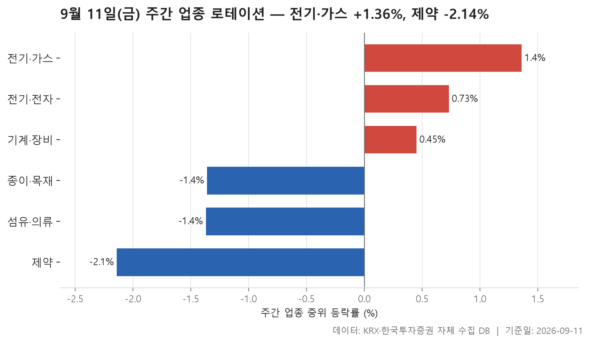
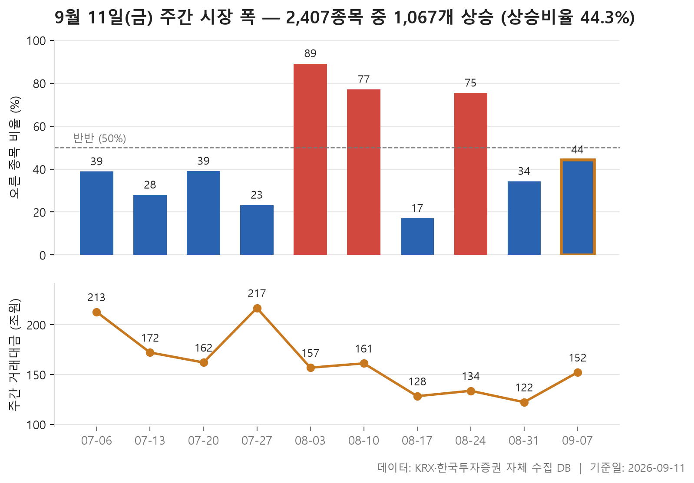
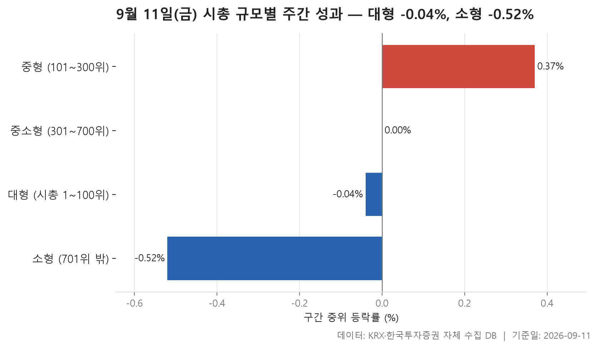

9월 11일 금요일까지의 한 주를 정리합니다. 출발선은 직전 주 마지막 거래일인 9월 4일 종가, 도착점은 9월 11일 종가이고, 그 사이 거래일은 5일입니다. 같은 기간을 세 가지 각도에서 나눠 봤습니다. 업종별로 어디가 강했고 어디가 약했는지, 시장 전체에서 오른 종목이 얼마나 많았는지, 그리고 큰 종목과 작은 종목 중 어느 쪽이 앞섰는지입니다.

먼저 큰 그림부터 말해 두면, 이번 주는 오른 종목보다 내린 종목이 많았던 주입니다. 그런데 업종 표의 상위권을 보면 평균 등락률이 모두 플러스이고, 규모별 표에서도 네 구간의 평균이 전부 양수입니다. 중위값은 아래로, 평균은 위로 — 이 어긋남이 이번 주 표를 읽는 열쇠입니다. 크게 오른 소수의 종목이 평균을 끌어올리는 동안, 한가운데 놓인 종목은 제자리이거나 조금 내려앉은 모양입니다.

이런 주에는 "시장이 올랐다, 내렸다"는 한마디로 정리하기가 어렵습니다. 지수 한 줄만 보면 놓치는 것이 많고, 반대로 몇몇 급등 종목만 보면 시장 전체가 뜨거웠다고 착각하게 됩니다. 그래서 중위값과 평균을 나란히 놓고, 여기에 오른 종목의 비율까지 함께 보는 편이 낫습니다. 세 숫자가 서로 다른 방향을 가리킬 때, 그 차이 자체가 정보가 됩니다.

숫자가 왜 그렇게 나왔는지에 대한 이유는 이 표에 담겨 있지 않습니다. 실적이나 정책 같은 배경은 자료에 없으니 짚지 않고, 표가 말해 주는 범위 안에서만 설명하겠습니다.

> 기준일: 2026-09-11 · 집계: 자체 수집 데이터베이스

## 주간 업종 로테이션 — 6개 중 3개 상승

24개 업종 가운데 한 주간 중위 등락률이 가장 높았던 곳은 전기·가스로 +1.36%, 가장 낮았던 곳은 제약으로 -2.14%였습니다. 상위 세 곳과 하위 세 곳의 폭이 이 정도이니, 업종 간 격차가 유별나게 벌어진 주는 아닙니다. 상위권은 전기·가스에서 전기·전자(+0.73%), 기계·장비(+0.45%)로 완만하게 내려오고, 하위권도 종이·목재(-1.36%)와 섬유·의류(-1.37%)가 거의 붙어 있다가 제약에서 한 단계 더 떨어집니다.

눈에 먼저 걸리는 것은 전기·가스의 짜임새입니다. 종목 수가 10개뿐인 작은 업종인데, 그중 열 곳 가운데 여덟 곳이 올랐습니다. 이 정도 비율이면 몇몇 종목이 끌어올린 게 아니라 업종 안이 고르게 위를 향했다는 뜻이고, 실제로 중위값과 평균(+2.45%)의 간격도 상위 세 업종 중 가장 좁습니다. 주도종목의 등락률이 +9.09%인데, 이 한 종목이 업종 평균을 0.91%p 끌어올린 셈이니 종목 수가 적어 한 종목의 무게가 큰 업종이라는 점도 함께 봐야 합니다.

반대로 전기·전자와 기계·장비는 중위값과 평균이 크게 벌어져 있습니다. 전기·전자는 한가운데 종목이 +0.73%인데 평균은 +3.18%입니다. 363개 종목이 들어 있는 업종에서 이만큼 차이가 나는 건, 일부 종목이 아주 크게 올라 평균만 위로 밀어 올렸다는 신호입니다. 주도종목 등락률이 +185.01%로 찍혀 있는 것이 그 단서입니다. 기계·장비도 비슷한 구조인데, 여기서는 주도종목이 -49.62%로 방향이 반대입니다. 절대값이 가장 큰 종목이 크게 내렸는데도 업종 평균은 +2.32%로 남았다는 건, 그 종목을 빼고 보면 나머지가 그만큼 버텼다는 말이 됩니다.

하위 세 업종 중에서는 제약과 섬유·의류의 결이 다릅니다. 섬유·의류는 중위값과 평균이 모두 아래에 있고 주도종목도 -68.62%로 크게 내려, 업종 평균을 1.40%p 끌어내린 쪽으로 계산됩니다. 방향이 한쪽으로 일관됩니다. 제약은 그렇지 않습니다. 166개 종목 중 오른 곳이 다섯에 하나꼴로 이번 표에서 가장 낮은데, 정작 절대값이 가장 큰 종목은 +23.52%로 올랐습니다. 업종 전체가 무거웠지만 그 안에서 따로 움직인 종목이 있었다는 뜻이고, 그 하나가 평균을 0.14%p 올려놓는 데 그쳤습니다. 왜 그런 조합이 나왔는지는 이 표로는 알 수 없습니다.

| 업종 | 종목수(개) | 주간중위등락률(%) | 주간평균등락률(%) | 상승비율(%) | 주도종목 | 주도종목등락률(%) | 평균기여도(%p) |
|---|---|---|---|---|---|---|---|
| 전기·가스 | 10 | +1.36 | +2.45 | 80.00 | SGC에너지 | +9.09 | 0.91 |
| 전기·전자 | 363 | +0.73 | +3.18 | 56.50 | 더코디 | +185.01 | 0.51 |
| 기계·장비 | 205 | +0.45 | +2.32 | 54.10 | 수성웹툰 | -49.62 | -0.24 |
| 종이·목재 | 27 | -1.36 | -0.61 | 37.00 | 페이퍼코리아 | -8.94 | -0.33 |
| 섬유·의류 | 49 | -1.37 | -1.75 | 32.70 | 원풍물산 | -68.62 | -1.40 |
| 제약 | 166 | -2.14 | -1.81 | 21.70 | 현대약품 | +23.52 | 0.14 |

## 주간 시장 폭 — 10주 중 이번 주는 2,407개 중 1,067개 상승

이번 주는 2,407개 종목 중 1,067개가 오르고 1,300개가 내렸습니다. 오른 종목이 열 곳 중 넷을 조금 넘은 44.30%였고, 상승 종목 수를 하락 종목 수로 나눈 값은 0.82배입니다. 1보다 작으니 내린 종목이 더 많았던 주로 분류되지만, 최근 10주를 늘어놓고 보면 그렇게까지 나쁜 쪽은 아닙니다. 열 개 주의 이 배수를 줄 세웠을 때 한가운데 놓인 값이 0.65배이니, 이번 주는 그보다 위에 있습니다.

표를 위에서 아래로 훑으면 가장 먼저 느껴지는 건 진폭입니다. 열 개 주 가운데 가장 높았던 주는 8월 3일 주의 8.54배로, 2,396개 중 2,136개가 오르고 내린 종목이 250개뿐이었습니다. 가장 낮았던 주는 8월 17일 주의 0.21배인데, 이때는 거래일이 4일뿐이었고 오른 종목이 409개, 내린 종목이 1,963개였습니다. 두 주의 간격이 2주밖에 안 되는데 방향이 정반대로 뒤집힌 셈입니다. 8월 10일 주는 3.49배, 8월 24일 주는 3.22배로 다시 위쪽이었고, 그 사이에 낀 8월 17일 주만 아래로 꺾였습니다. 오르는 주와 내리는 주가 길게 이어지지 않고 짧게 번갈아 나타나는 모양입니다.

7월 쪽을 보면 결이 또 다릅니다. 7월 6일 주와 7월 20일 주가 모두 0.65배로 같고, 그 사이의 7월 13일 주는 0.39배, 그 뒤의 7월 27일 주는 0.30배입니다. 넉 주 내내 1을 넘지 못했으니 내린 종목이 계속 많았던 구간입니다. 그러다 8월로 넘어가며 8.54배까지 튀어 오르고, 다시 0.21배까지 내려앉고, 8월 31일 주에 0.53배, 이번 주 0.82배로 올라오는 흐름입니다.

거래대금은 방향과 나란히 움직이지 않습니다. 오른 종목이 가장 적었던 7월 27일 주의 총거래대금이 216.70조원으로 열 개 주 중 가장 컸고, 7월 6일 주도 212.70조원입니다. 반대로 오른 종목이 가장 많았던 8월 3일 주는 156.90조원이었습니다. 이번 주는 152.20조원으로, 직전 주 122.30조원보다는 늘었지만 7월 구간에 비하면 낮은 편입니다. 돈이 많이 돌았다고 해서 오른 종목이 많아지는 건 아니라는 점이 이 열 줄에 그대로 남아 있습니다.

| 주 | 거래일수(일) | 종목수(개) | 상승(개) | 보합(개) | 하락(개) | 상승비율(%) | ADR(배) | 총거래대금(조원) |
|---|---|---|---|---|---|---|---|---|
| 2026-09-07 | 5 | 2,407 | 1,067 | 40 | 1,300 | 44.30 | 0.82 | 152.20 |
| 2026-08-31 | 5 | 2,402 | 823 | 34 | 1,545 | 34.30 | 0.53 | 122.30 |
| 2026-08-24 | 5 | 2,387 | 1,800 | 28 | 559 | 75.40 | 3.22 | 133.70 |
| 2026-08-17 | 4 | 2,388 | 409 | 16 | 1,963 | 17.10 | 0.21 | 128.30 |
| 2026-08-10 | 5 | 2,386 | 1,838 | 22 | 526 | 77.00 | 3.49 | 161.20 |
| 2026-08-03 | 5 | 2,396 | 2,136 | 10 | 250 | 89.10 | 8.54 | 156.90 |
| 2026-07-27 | 5 | 2,401 | 556 | 21 | 1,824 | 23.20 | 0.30 | 216.70 |
| 2026-07-20 | 5 | 2,403 | 937 | 28 | 1,438 | 39.00 | 0.65 | 162.10 |
| 2026-07-13 | 4 | 2,415 | 673 | 26 | 1,716 | 27.90 | 0.39 | 172.10 |
| 2026-07-06 | 5 | 2,410 | 936 | 35 | 1,439 | 38.80 | 0.65 | 212.70 |

## 시총 규모별 주간 성과 — 대형이 0.48%p 앞섬

시가총액 순위로 네 구간을 갈라 보면, 중위 등락률이 가장 높은 곳은 중형인 101~300위 구간의 +0.37%이고 가장 낮은 곳은 701위 밖 소형 구간의 -0.52%입니다. 네 구간 중 양수는 하나, 음수는 둘이고, 301~700위 구간은 0.00%로 딱 제자리입니다. 네 값을 줄 세웠을 때 중간에 놓인 값은 -0.02%이니, 규모별로 봐도 한가운데 종목은 사실상 움직이지 않은 주였습니다.

그런데 평균은 네 구간 모두 플러스입니다. 대형이 +1.44%, 중형이 +1.54%, 중소형이 +1.62%, 소형이 +0.39%입니다. 중위값이 마이너스거나 0인데 평균이 1% 대로 올라오는 구조는 앞서 업종 표에서 본 것과 같습니다. 특히 소형 구간이 극단적입니다. 1,707개 종목 중 오른 곳이 열에 넷가량인 41.90%로 가장 낮고 한가운데 종목은 -0.52%인데, 평균은 +0.39%로 플러스를 지켰습니다. 이 구간 주도종목의 등락률이 +185.01%로 표 전체에서 가장 큰 값이라는 점과 겹쳐 읽어야 할 대목입니다.

대형 구간도 앞뒤가 조금 어긋나 보입니다. 한가운데 종목이 -0.04%로 미세하게 마이너스이고 오른 종목도 절반에 못 미치는 48.00%인데, 평균은 +1.44%이고 주도종목은 +41.26%입니다. 이번 주 대형 쪽이 앞섰다고 정리되지만, 100개 종목이 다 같이 올라서 그런 건 아니라는 뜻입니다. 중형 구간이 오히려 오른 종목 비율(53.50%)과 중위값 모두 네 구간 중 가장 위에 있어, 구간 안이 그나마 고르게 움직인 쪽으로 보입니다.

거래대금 분포는 훨씬 단정합니다. 대형 100개 종목에 102.00조원이 몰렸고, 그 아래로 24.80조원, 14.30조원, 10.90조원으로 급하게 줄어듭니다. 종목 수는 소형이 1,707개로 압도적으로 많은데 거래대금은 가장 적습니다. 종목 하나하나로 보면 아래 구간에 훨씬 얇게 나뉘어 있다는 말이고, 앞서 본 소형 구간의 낮은 상승 비율과 큰 주도종목 등락률이 함께 나타나는 배경으로 읽을 만합니다. 참고로 대형과 소형의 격차는 0.48로 집계됐습니다.

| 구간 | 종목수(개) | 주간중위등락률(%) | 주간평균등락률(%) | 상승비율(%) | 주도종목 | 주도종목등락률(%) | 주간거래대금(조원) |
|---|---|---|---|---|---|---|---|
| 대형 (시총 1~100위) | 100 | -0.04 | +1.44 | 48.00 | 한전기술 | +41.26 | 102.00 |
| 중형 (101~300위) | 200 | +0.37 | +1.54 | 53.50 | 우리기술 | +32.17 | 24.80 |
| 중소형 (301~700위) | 400 | 0.00 | +1.62 | 49.30 | 에스엠벡셀 | +50.68 | 14.30 |
| 소형 (701위 밖) | 1,707 | -0.52 | +0.39 | 41.90 | 더코디 | +185.01 | 10.90 |

## 정리

정리하면, 이번 주는 오른 종목보다 내린 종목이 많았지만 평균만 보면 플러스로 보이는 주였습니다. 업종에서는 전기·가스가 +1.36%로 가장 위, 제약이 -2.14%로 가장 아래였고, 규모로는 101~300위 구간만 중위값이 플러스였습니다. 어느 쪽 표를 봐도 한가운데 종목은 조용한데 평균은 위로 들려 있는 같은 모양이 반복됩니다.

다만 이 표들은 가격의 결과만 담고 있습니다. 왜 특정 업종의 중위값이 아래로 내려갔는지, 왜 몇몇 종목이 크게 튀었는지에 대한 설명은 자료에 없으니 짐작해 쓰지 않았습니다. 주도종목은 등락률 절대값이 가장 큰 종목을 뽑은 것이어서 방향과 무관하게 선정되고, 업종 표는 보통주 5종목 이상인 업종만 대상이라는 점도 함께 감안해 주시기 바랍니다. 여기 적은 내용은 지난 한 주의 집계이며 앞으로의 방향을 말하는 자료가 아닙니다.

## 집계 기준

**주간 업종 로테이션**

- **기준**: 2026-09-04 종가 → 2026-09-11 종가
- **구간**: 2026-09-07 시작 주 — 직전 주 마지막 거래일 종가를 출발선으로 삼습니다
- **거래일수**: 5
- **순위**: 업종 내 종목 등락률의 중위값 (평균은 참고용으로 함께 표시)
- **선정**: 전체 24개 업종 중 상위 3개 · 하위 3개
- **주도종목**: 그 업종에서 같은 기간 등락률 절대값이 가장 큰 종목 (동점이면 거래대금이 큰 쪽)
- **평균기여도**: 그 종목 하나가 업종 평균을 움직인 폭 (등락률 ÷ 종목수)
- **필터**: 업종 내 보통주 5종목 이상

**주간 시장 폭**

- **기준**: 각 주의 마지막 거래일 종가를 직전 주 마지막 거래일 종가와 비교
- **주**: 그 주의 월요일 (달력 기준). 거래일 수는 연휴에 따라 다릅니다
- **ADR**: 상승 종목 수 ÷ 하락 종목 수. 1 이면 반반, 2 면 오른 종목이 두 배
- **총거래대금**: 그 주 거래일 전체의 거래대금 합계
- **모집단**: 거래가 있었던 보통주 (거래정지·액면 변경 종목 제외)

**시총 규모별 주간 성과**

- **기준**: 2026-09-04 종가 → 2026-09-11 종가
- **구간**: 기준일 시가총액 순위로 자릅니다 (금액으로 자르면 장이 오른 해에 전부 위 구간으로 올라가 해마다 다른 표가 됩니다)
- **순위**: 구간 내 종목 등락률의 중위값 (평균은 참고용으로 함께 표시)
- **주도종목**: 그 구간에서 같은 기간 등락률 절대값이 가장 큰 종목 (동점이면 거래대금이 큰 쪽)
- **대형소형격차**: 0.48
- **모집단**: 거래가 있었던 보통주 (거래정지·액면 변경 종목 제외)

## 데이터 출처 및 유의사항

- **데이터출처**: 한국거래소(KRX) 공시 데이터와 한국투자증권 OpenAPI 를 직접 수집해 구축한 자체 데이터베이스
- **집계방식**: 수집·집계·차트 생성을 직접 구현한 파이프라인에서 자동 산출
- **작성고지**: 본문의 표·통계·차트는 자체 데이터베이스에서 계산된 값이며, 문장 작성 과정에 AI 도구를 활용했습니다.
- **면책**: 본 글은 정보 제공을 목적으로 하며 특정 종목의 매수·매도를 추천하지 않습니다. 제시된 수치는 과거 데이터이고 미래 수익을 보장하지 않습니다. 투자 판단과 그 결과에 대한 책임은 투자자 본인에게 있습니다.

