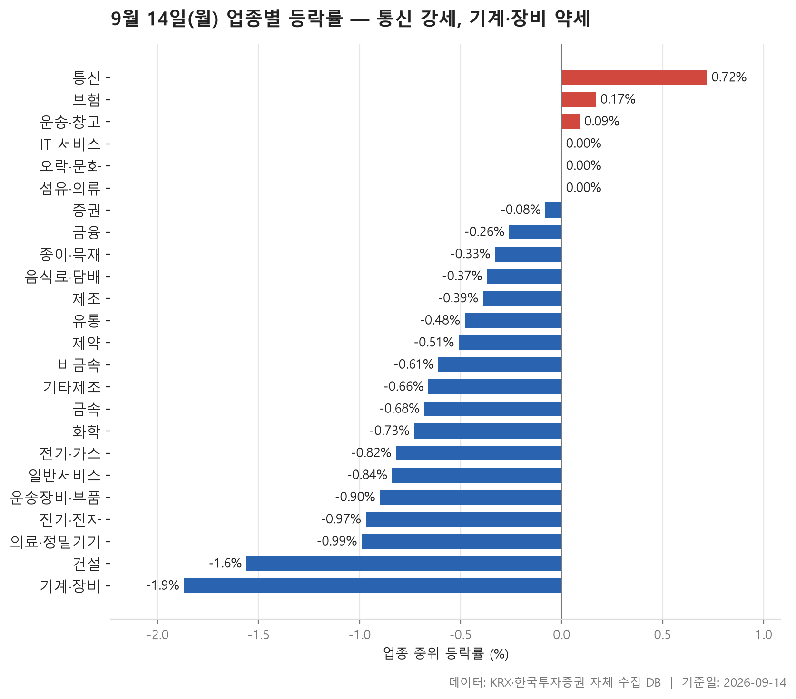
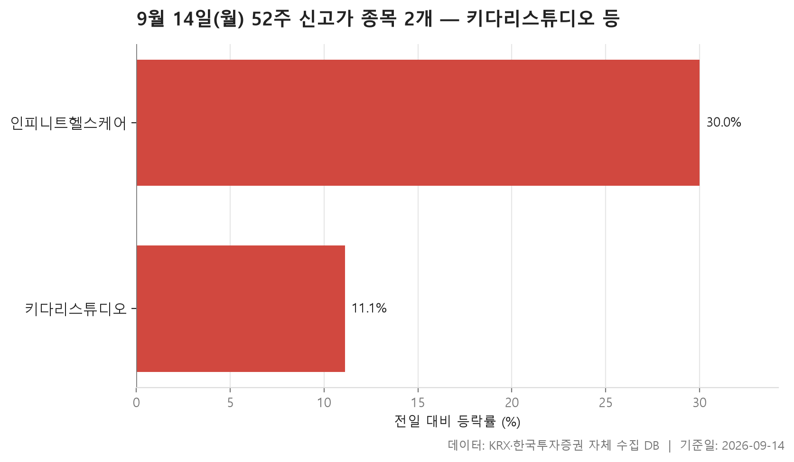
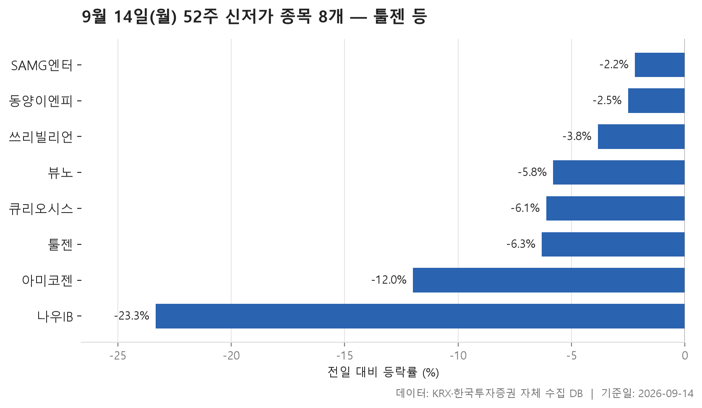
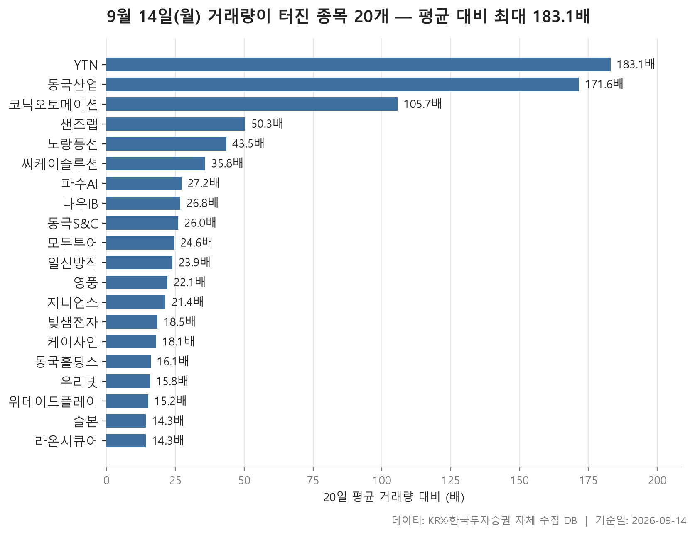

한 주의 첫 거래일이 끝났습니다. 2026년 9월 14일 종가를 9월 11일 종가와 비교해 24개 업종을 늘어놓고 보면, 화면 대부분이 마이너스 쪽으로 기울어 있습니다. 업종별 중위 등락률을 순서대로 세웠을 때 한가운데 놓인 값이 -0.49%. 24개 가운데 플러스로 마감한 업종은 3개뿐이고 18개가 마이너스였으니, 오르는 쪽보다 내리는 쪽이 훨씬 넓었던 하루입니다.

가장 위에 놓인 업종은 통신으로 중위 등락률 +0.72%, 가장 아래는 기계·장비로 -1.87%였습니다. 양 끝의 폭 자체가 크게 벌어진 날은 아니지만, 아래쪽이 두껍다는 점이 이날의 성격을 말해 줍니다. 지수 한두 개로는 잘 보이지 않는 대목이라, 업종 안쪽에서 몇 종목이나 올랐는지를 함께 봐야 그림이 잡힙니다.

오늘 글에서는 네 가지를 차례로 훑습니다. 먼저 업종별 흐름, 다음으로 52주 최고가를 넘어선 종목과 52주 최저가를 밑돈 종목, 마지막으로 평소 거래량의 몇 배가 터진 종목들입니다. 어느 쪽이든 표가 말해 주는 범위 안에서만 읽겠습니다. 왜 그렇게 움직였는지는 이 자료에 들어 있지 않습니다.

> 기준일: 2026-09-14 · 집계: 자체 수집 데이터베이스

## 업종 등락률 — 24개 중 18개 하락

순위는 업종 안 종목들의 등락률을 늘어놓았을 때 한가운데 놓인 값으로 매겼습니다. 평균은 상한가 한 종목에 크게 흔들리기 때문입니다. 이 기준으로 보면 위쪽에 통신, 보험, 운송·창고가 있고, 그 아래 IT 서비스·오락·문화·섬유·의류가 0.00%로 붙어 있습니다. 즉 플러스 구간이 아주 얇습니다. 반대로 아래쪽은 건설 -1.56%, 기계·장비 -1.87%로 떨어지면서 꼬리가 길게 늘어져 있고요.

업종 안에서 오른 종목의 비중을 같이 보면 차이가 더 선명합니다. 통신은 열 곳 중 일고여덟 곳이 올라 76.90%였던 반면, 전기·가스는 10.00%, 건설은 15.70%, 기계·장비는 16.50%에 그쳤습니다. 아래쪽 업종들은 몇몇 종목이 크게 빠져서 내려간 게 아니라, 업종 전체가 고르게 밀린 모양입니다.

중위값과 평균이 어긋난 자리를 짚어 보면 읽을 거리가 생깁니다. 통신은 한가운데 값이 +0.72%인데 평균은 +1.93%까지 올라가 있고, 이 업종에서 가장 크게 움직인 프리티 한 종목이 업종 평균을 0.64%p 끌어올린 것으로 계산됩니다. 격차의 상당 부분이 이 한 종목에서 나온 셈입니다. 제조는 더 극단적입니다. 종목 수가 7개뿐인데 오른 종목은 14.30%에 불과한데도 평균은 +0.28%로 플러스입니다. 에넥스 한 종목이 평균에 얹은 몫이 2.30%p로, 이 표에서 가장 큰 값입니다. 반대로 기계·장비는 KS인더스트리가 +29.97%로 평균을 0.15%p 밀어 올렸지만 업종 전체가 -1.72%였습니다. 한 종목의 상한가가 200개 넘는 종목의 약세를 가리지 못한 겁니다.

거래대금 쪽은 또 다른 이야기입니다. 전기·전자가 148,541.60억원으로 압도적인데, 정작 중위 등락률은 -0.97%이고 오른 종목은 셋 중 하나에 못 미쳤습니다. 돈이 가장 많이 오간 업종이 가장 강했던 업종은 아니었다는 뜻이죠. 화학에서는 카프로가 -40.83%로 표 전체에서 가장 큰 하락폭을 기록했는데, 업종 평균에 얹은 몫은 -0.18%p에 그쳤습니다. 222개짜리 업종에서는 한 종목의 급락도 평균에 별 자국을 남기지 못합니다.

| 업종 | 종목수(개) | 중위등락률(%) | 평균등락률(%) | 상승비율(%) | 주도종목 | 주도종목등락률(%) | 평균기여도(%p) | 거래대금합계(억원) |
|---|---|---|---|---|---|---|---|---|
| 통신 | 13 | +0.72 | +1.93 | 76.90 | 프리티 | +8.37 | 0.64 | 1,120.60 |
| 보험 | 11 | +0.17 | -0.22 | 54.50 | 삼성생명 | -3.09 | -0.28 | 2,421.40 |
| 운송·창고 | 28 | +0.09 | +0.03 | 53.60 | 흥아해운 | -5.64 | -0.20 | 1,343.80 |
| IT 서비스 | 244 | 0.00 | +1.04 | 48.80 | 인피니트헬스케어 | +30.00 | 0.12 | 11,809.30 |
| 오락·문화 | 67 | 0.00 | +0.40 | 49.30 | 골드앤에스 | -26.35 | -0.39 | 924.50 |
| 섬유·의류 | 49 | 0.00 | -0.98 | 42.90 | 원풍물산 | -26.12 | -0.53 | 291.80 |
| 증권 | 18 | -0.08 | +0.02 | 44.40 | 부국증권 | +2.20 | 0.12 | 781.10 |
| 금융 | 111 | -0.26 | -0.32 | 42.30 | 나우IB | -23.33 | -0.21 | 17,215.10 |
| 종이·목재 | 27 | -0.33 | -0.32 | 33.30 | 유니드비티플러스 | +4.08 | 0.15 | 37.80 |
| 음식료·담배 | 84 | -0.37 | -0.78 | 33.30 | 아미코젠 | -11.99 | -0.14 | 1,766.90 |
| 제조 | 7 | -0.39 | +0.28 | 14.30 | 에넥스 | +16.08 | 2.30 | 26.60 |
| 유통 | 153 | -0.48 | -0.59 | 35.90 | 조이웍스앤코 | -11.44 | -0.07 | 6,187.90 |
| 제약 | 166 | -0.51 | -0.45 | 30.70 | 삼익제약 | +15.55 | 0.09 | 7,050.00 |
| 비금속 | 36 | -0.61 | -0.82 | 38.90 | 유니온머티리얼 | +11.26 | 0.31 | 568.90 |
| 기타제조 | 14 | -0.66 | -0.08 | 35.70 | 리튬포어스 | +3.82 | 0.27 | 13.60 |
| 금속 | 131 | -0.68 | -0.76 | 29.80 | 영풍 | +29.91 | 0.23 | 5,158.10 |
| 화학 | 222 | -0.73 | -0.89 | 31.10 | 카프로 | -40.83 | -0.18 | 10,331.10 |
| 전기·가스 | 10 | -0.82 | -1.28 | 10.00 | SGC에너지 | -4.08 | -0.41 | 588.30 |
| 일반서비스 | 168 | -0.84 | -0.93 | 28.60 | 모아라이프플러스 | +11.56 | 0.07 | 6,480.10 |
| 운송장비·부품 | 134 | -0.90 | -1.14 | 31.30 | 코다코 | -33.63 | -0.25 | 9,677.30 |
| 전기·전자 | 363 | -0.97 | -0.68 | 28.90 | 광전자 | +30.00 | 0.08 | 148,541.60 |
| 의료·정밀기기 | 99 | -0.99 | -1.08 | 32.30 | 코셈 | +14.18 | 0.14 | 1,717.90 |
| 건설 | 51 | -1.56 | -1.97 | 15.70 | 금호건설 | -7.55 | -0.15 | 3,273.60 |
| 기계·장비 | 206 | -1.87 | -1.72 | 16.50 | KS인더스트리 | +29.97 | 0.15 | 13,331.60 |

## 52주 신고가 2개 — 최고 인피니트헬스케어 30%

시가총액 500억원 이상, 거래대금 3억원 이상인 보통주 가운데 종가가 직전 52주 최고가를 넘어선 종목은 단 2개였습니다. 하락 업종이 18개였던 날이니 이 정도 숫자는 이상하지 않습니다.

둘 다 IT 서비스 업종이라는 점이 눈에 띕니다. 시장은 하나씩 나뉘어 키다리스튜디오가 KOSPI, 인피니트헬스케어가 KOSDAQ이고요. 등락률은 인피니트헬스케어가 30%로 가장 높고 키다리스튜디오가 11.11%로 가장 낮은데, 표에 두 종목뿐이라 중위값 20.55%는 두 값 사이를 가리키는 숫자에 가깝습니다.

두 종목 모두 직전 최고가를 아슬아슬하게 넘긴 게 아니라 당일 큰 폭으로 오르면서 한 번에 통과한 모양입니다. 종가와 이전 최고가를 나란히 보면 그 차이가 보입니다. 다만 시가총액은 키다리스튜디오가 3,336억원으로 가장 크고 나머지 한 종목도 비슷한 규모대라, 신고가가 대형주 쪽에서 나온 날은 아니었습니다. 거래대금도 두 종목 모두 100억원에 못 미칩니다.

| 종목명 | 종목코드 | 시장 | 업종 | 종가(원) | 등락률(%) | 이전52주최고(원) | 거래대금(억원) | 시가총액(억원) |
|---|---|---|---|---|---|---|---|---|
| 키다리스튜디오 | 020120 | KOSPI | IT 서비스 | 9,000 | +11.11 | 8,670 | 61.00 | 3,336 |
| 인피니트헬스케어 | 071200 | KOSDAQ | IT 서비스 | 11,310 | +30.00 | 10,980 | 62.60 | 2,759 |

## 52주 신저가 8개 — 최저 나우IB -23.33%

반대쪽, 즉 52주 최저가를 밑돈 종목은 8개입니다. 신고가 2개와 견주면 네 배 수. 앞서 본 업종 표의 기울기와 방향이 같습니다.

여덟 종목 전부 KOSDAQ입니다. 같은 필터를 적용했는데 KOSPI 쪽에서는 한 종목도 걸리지 않았다는 점은 기억해 둘 만합니다. 업종은 7개로 흩어져 있고 일반서비스가 2개로 가장 많은데, 사실상 특정 업종에 몰렸다기보다 여기저기서 하나씩 나온 모양입니다.

하락폭은 고르지 않습니다. 한가운데 값이 -5.96%인데, 가장 덜 빠진 SAMG엔터가 -2.21%, 가장 많이 빠진 나우IB가 -23.33%로 한쪽 끝이 크게 벌어져 있습니다. SAMG엔터나 동양이엔피처럼 종가가 직전 최저가를 근소하게 밑돈 경우가 있는가 하면, 아미코젠은 -11.99%로 밀리며 이전 최저가에서 제법 내려온 자리에 종가를 찍었습니다. 나우IB는 거래량 급증 표에도 이름이 올라 있어, 오늘 하루 움직임이 특히 컸던 종목입니다. 시가총액은 툴젠이 2,740억원으로 가장 크고, 581억원인 종목까지 있어 전반적으로 작은 편입니다.

| 종목명 | 종목코드 | 시장 | 업종 | 종가(원) | 등락률(%) | 이전52주최저(원) | 거래대금(억원) | 시가총액(억원) |
|---|---|---|---|---|---|---|---|---|
| 툴젠 | 199800 | KOSDAQ | 일반서비스 | 30,450 | -6.31 | 32,350 | 19.90 | 2,740 |
| SAMG엔터 | 419530 | KOSDAQ | 오락·문화 | 17,250 | -2.21 | 17,320 | 6.40 | 1,761 |
| 쓰리빌리언 | 394800 | KOSDAQ | 일반서비스 | 4,135 | -3.84 | 4,245 | 5.40 | 1,316 |
| 동양이엔피 | 079960 | KOSDAQ | 전기·전자 | 17,060 | -2.51 | 17,350 | 8.60 | 1,288 |
| 큐리오시스 | 494120 | KOSDAQ | 의료·정밀기기 | 7,820 | -6.12 | 7,990 | 11.10 | 1,193 |
| 나우IB | 293580 | KOSDAQ | 금융 | 1,078 | -23.33 | 1,092 | 40.00 | 1,023 |
| 뷰노 | 338220 | KOSDAQ | IT 서비스 | 4,540 | -5.81 | 4,680 | 7.20 | 636 |
| 아미코젠 | 092040 | KOSDAQ | 음식료·담배 | 822 | -11.99 | 923 | 10.00 | 581 |

## 거래량 급증 20개 — 최고 YTN 183.10배

당일 거래량이 직전 20거래일 평균의 5배를 넘은 보통주가 20개 잡혔습니다. 배수만 놓고 보면 위쪽이 유난히 가파릅니다. YTN이 183.10배로 가장 높고 동국산업 171.60배, 코닉오토메이션 105.70배까지 세 종목이 세 자릿수인데, 한가운데 값은 24.25배, 가장 낮은 라온시큐어는 14.30배입니다. 상위 몇 종목이 분포를 멀찍이 벗어나 있는 구조죠.

흥미로운 건 배수 순위와 실제 등락이 따로 논다는 점입니다. 배수가 가장 큰 YTN의 등락률은 +2.99%로 표 안에서 오히려 조용한 축이고, 두 번째인 동국산업은 +23.03%로 크게 올랐습니다. 거래량이 평소의 몇 배로 터졌다는 사실 자체가 가격 방향을 알려 주지는 않는다는 이야기입니다. 실제로 20개 중 19개가 플러스인데 나우IB 하나만 -23.33%로 반대 방향이고, 이 종목은 앞 섹션의 52주 최저가 명단에도 들어 있습니다.

규모 면에서도 순위가 엇갈립니다. 시가총액이 가장 큰 영풍은 9,196억원에 등락률 +29.91%, 거래대금 301.60억원인데 배수는 22.10배로 중간쯤입니다. 반면 배수 최상단의 YTN은 시가총액 968억원, 거래대금 56.70억원이고요. 배수가 큰 종목일수록 평소 거래가 한산했던 작은 종목인 경우가 많습니다. 거래대금 기준으로 다시 줄을 세우면 샌즈랩 788.90억원, 빛샘전자 608.10억원, 라온시큐어 533.30억원, 지니언스 504.10억원 순으로, 배수 순위와는 전혀 다른 얼굴이 나옵니다.

업종은 8개로 나뉘고 IT 서비스가 6개로 가장 많습니다. 52주 신고가 두 종목도 같은 업종이었던 걸 떠올리면, 업종 표에서 IT 서비스의 중위 등락률이 0.00%였던 것이 조용해서가 아니라 위아래로 크게 갈렸기 때문이라는 해석도 가능합니다. 실제로 이 업종의 평균 등락률은 +1.04%로 한가운데 값보다 위에 있습니다. 시장 구성은 KOSDAQ 16개, KOSPI 4개로 중소형주 쪽에 치우쳐 있습니다.

| 종목명 | 종목코드 | 시장 | 업종 | 종가(원) | 등락률(%) | 거래량(주) | 평균거래량(주) | 배수(배) | 거래대금(억원) | 시가총액(억원) |
|---|---|---|---|---|---|---|---|---|---|---|
| YTN | 040300 | KOSDAQ | 오락·문화 | 2,030 | +2.99 | 2,497,665 | 13,644 | 183.10 | 56.70 | 968 |
| 동국산업 | 005160 | KOSDAQ | 금속 | 3,125 | +23.03 | 4,409,963 | 25,699 | 171.60 | 138.90 | 1,695 |
| 코닉오토메이션 | 391710 | KOSDAQ | 기계·장비 | 1,201 | +11.51 | 3,521,137 | 33,323 | 105.70 | 47.10 | 512 |
| 샌즈랩 | 411080 | KOSDAQ | IT 서비스 | 6,870 | +24.68 | 11,528,166 | 229,040 | 50.30 | 788.90 | 1,049 |
| 노랑풍선 | 104620 | KOSDAQ | 일반서비스 | 3,245 | +3.02 | 2,720,925 | 62,483 | 43.50 | 97.20 | 546 |
| 씨케이솔루션 | 480370 | KOSPI | 기계·장비 | 1,952 | +9.54 | 4,315,446 | 120,472 | 35.80 | 88.60 | 634 |
| 파수AI | 150900 | KOSDAQ | IT 서비스 | 4,300 | +13.91 | 1,407,707 | 51,732 | 27.20 | 61.40 | 503 |
| 나우IB | 293580 | KOSDAQ | 금융 | 1,078 | -23.33 | 3,848,174 | 143,798 | 26.80 | 40.00 | 1,023 |
| 동국S&C | 100130 | KOSDAQ | 금속 | 1,412 | +4.90 | 5,506,340 | 211,458 | 26.00 | 86.50 | 807 |
| 모두투어 | 080160 | KOSDAQ | 일반서비스 | 9,870 | +4.11 | 1,010,696 | 41,038 | 24.60 | 104.40 | 1,865 |
| 일신방직 | 003200 | KOSPI | 섬유·의류 | 12,140 | +17.52 | 666,798 | 27,854 | 23.90 | 78.80 | 2,787 |
| 영풍 | 000670 | KOSPI | 금속 | 49,950 | +29.91 | 609,343 | 27,543 | 22.10 | 301.60 | 9,196 |
| 지니언스 | 263860 | KOSDAQ | IT 서비스 | 19,370 | +14.28 | 2,638,208 | 123,356 | 21.40 | 504.10 | 1,759 |
| 빛샘전자 | 072950 | KOSDAQ | 전기·전자 | 11,570 | +30.00 | 5,693,986 | 307,346 | 18.50 | 608.10 | 932 |
| 케이사인 | 192250 | KOSDAQ | IT 서비스 | 8,100 | +3.85 | 415,191 | 22,924 | 18.10 | 34.60 | 572 |
| 동국홀딩스 | 001230 | KOSPI | 금융 | 2,130 | +2.65 | 6,400,320 | 397,644 | 16.10 | 142.60 | 3,312 |
| 우리넷 | 115440 | KOSDAQ | 전기·전자 | 8,890 | +7.11 | 5,113,697 | 324,367 | 15.80 | 478.30 | 960 |
| 위메이드플레이 | 123420 | KOSDAQ | IT 서비스 | 6,410 | +0.94 | 285,830 | 18,803 | 15.20 | 18.90 | 667 |
| 솔본 | 035610 | KOSDAQ | 일반서비스 | 5,090 | +0.99 | 575,826 | 40,251 | 14.30 | 30.90 | 1,392 |
| 라온시큐어 | 042510 | KOSDAQ | IT 서비스 | 11,230 | +19.72 | 4,760,356 | 332,206 | 14.30 | 533.30 | 1,247 |

## 정리

정리하면, 9월 14일은 업종 24개 중 18개가 마이너스로 마감하고 한가운데 값이 -0.49%였던, 아래로 기운 하루였습니다. 52주 최고가를 넘은 종목은 2개, 최저가를 밑돈 종목은 8개로 그 기울기가 개별 종목 쪽에서도 확인됩니다. 다만 거래량이 크게 터진 20개 종목 가운데 19개가 오른 데서 보이듯, 전체가 밀리는 와중에도 국지적으로 돈이 몰린 자리는 따로 있었습니다. 통신과 제조처럼 한가운데 값과 평균이 어긋난 업종, 배수와 거래대금 순위가 엇갈린 종목들이 그 흔적입니다.\n\n마지막으로 한계를 밝혀 둡니다. 이 글의 숫자는 모두 종가 기준 하루치 집계이고, 왜 그렇게 움직였는지에 대한 정보는 자료에 들어 있지 않습니다. 52주 신고가·신저가와 거래량 급증 표는 시가총액 500억원, 거래대금 3억원이라는 필터를 통과한 보통주만 담고 있어 그 아래 구간은 보이지 않습니다. 업종 순위도 보통주 5종목 이상인 업종만 대상으로 했습니다. 어디까지나 하루의 단면이며, 특정 종목의 매매를 권하는 글이 아닙니다.

## 집계 기준

**업종 등락률**

- **기준**: 2026-09-11 종가 → 2026-09-14 종가
- **순위**: 업종 내 종목 등락률의 중위값 (평균은 참고용으로 함께 표시)
- **주도종목**: 그 업종에서 등락률 절대값이 가장 큰 종목 (동점이면 거래대금이 큰 쪽)
- **평균기여도**: 그 종목 하나가 업종 평균을 움직인 폭 (등락률 ÷ 종목수). 중위값과 평균의 격차가 이 값에 가까우면 평균을 만든 것이 그 종목이고, 훨씬 크면 다른 종목들도 함께 움직인 것입니다
- **필터**: 업종 내 보통주 5종목 이상
- **전체업종중위등락률(%)**: -0.49

**52주 신고가**

- **기준**: 종가 > 직전 52주 최고가
- **관측구간**: 2025-09-01 ~ 2026-09-11 (252거래일)
- **필터**: 시가총액 500억 이상, 거래대금 3억 이상, 보통주

**52주 신저가**

- **기준**: 종가 < 직전 52주 최저가
- **관측구간**: 2025-09-01 ~ 2026-09-11 (252거래일)
- **필터**: 시가총액 500억 이상, 거래대금 3억 이상, 보통주

**거래량 급증**

- **기준**: 당일 거래량 ≥ 직전 20거래일 평균 × 5
- **관측구간**: 2026-08-14 ~ 2026-09-11 (20거래일)
- **필터**: 시가총액 500억 이상, 거래대금 3억 이상, 보통주

## 데이터 출처 및 유의사항

- **데이터출처**: 한국거래소(KRX) 공시 데이터와 한국투자증권 OpenAPI 를 직접 수집해 구축한 자체 데이터베이스
- **집계방식**: 수집·집계·차트 생성을 직접 구현한 파이프라인에서 자동 산출
- **작성고지**: 본문의 표·통계·차트는 자체 데이터베이스에서 계산된 값이며, 문장 작성 과정에 AI 도구를 활용했습니다.
- **면책**: 본 글은 정보 제공을 목적으로 하며 특정 종목의 매수·매도를 추천하지 않습니다. 제시된 수치는 과거 데이터이고 미래 수익을 보장하지 않습니다. 투자 판단과 그 결과에 대한 책임은 투자자 본인에게 있습니다.

