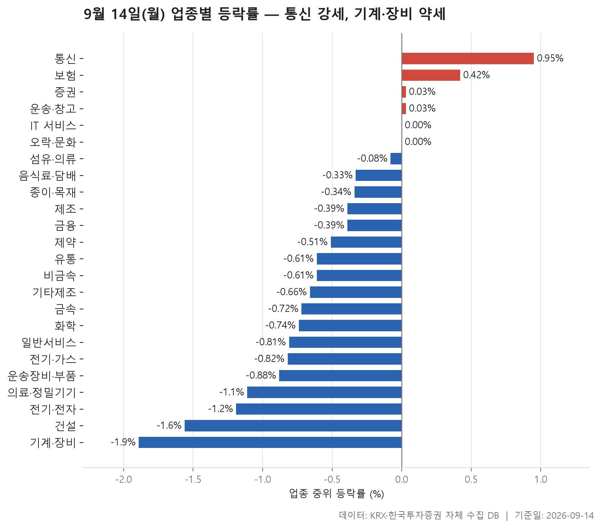
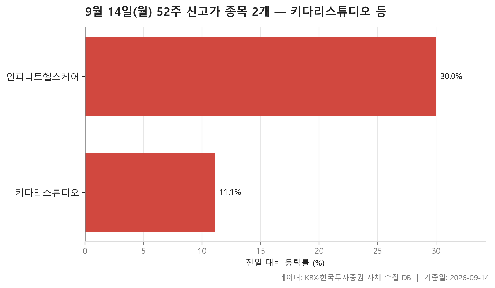
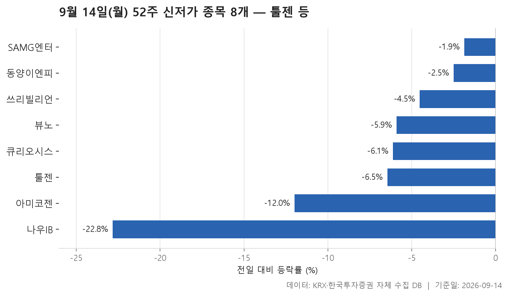
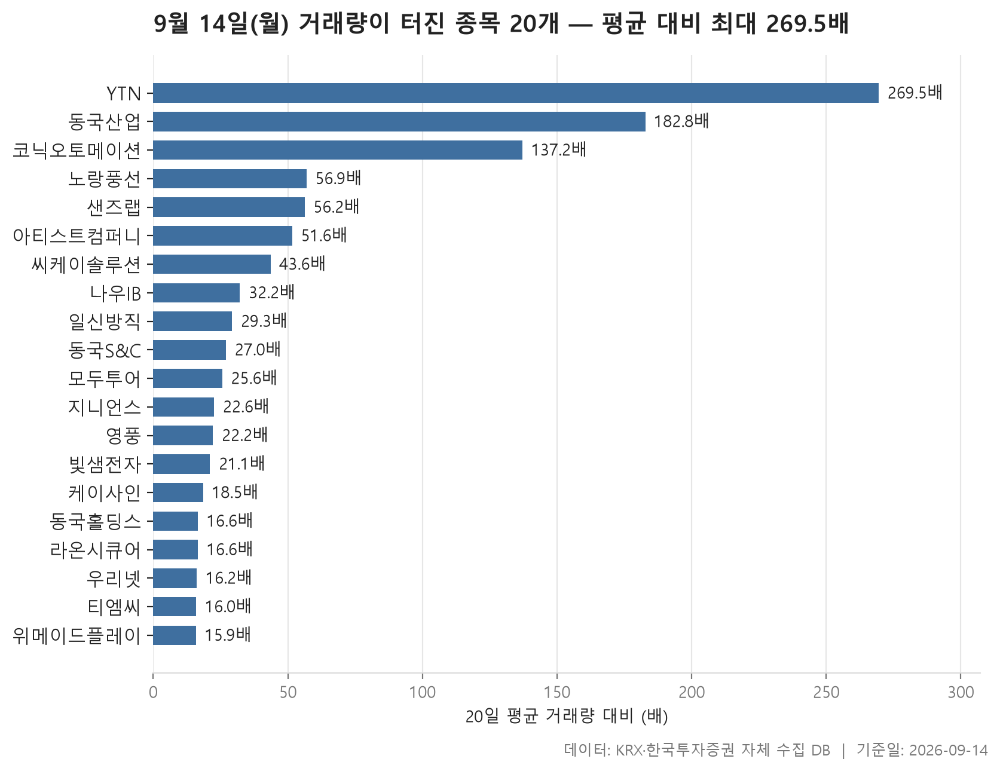

9월 14일 월요일 장은 한마디로 **넓게 약한 하루**였습니다. 24개 업종 가운데 중위 등락률이 플러스인 곳은 4개, 마이너스인 곳은 18개였습니다. 업종별 중위 등락률을 한 줄로 세우면 한가운데 값이 -0.56%입니다. 크게 무너진 날은 아니었지만, 대부분 업종에서 내린 종목이 오른 종목보다 많았습니다.

표를 조금 더 들여다보면 다른 그림이 하나 더 보입니다. 업종 전체는 가라앉았는데, 거래량이 평소의 수십 배로 불어난 종목은 거의 다 올랐습니다. 52주 신고가는 두 종목뿐이었고 신저가는 여덟 종목이었는데, 신저가 종목은 모두 코스닥 종목이었습니다.

오늘은 업종 등락, 신고가, 신저가, 거래량 급증 순서로 살펴봅니다. 평균만 보면 오른 것처럼 보이지만 실제로는 종목 대부분이 내린 업종도 있어서, 그런 대목을 중심으로 짚어 보겠습니다.

> 기준일: 2026-09-14 · 집계: 자체 수집 데이터베이스

## 업종 등락률 — 24개 중 18개 하락

맨 위는 통신입니다. 중위 등락률이 +0.95%이고, 13개 종목 가운데 76.90%가 올랐습니다. 넷 중 셋 넘게 오른 셈이라 몇 종목만 튄 결과는 아닙니다. 평균은 +1.84%로 중위값보다 높은데, 여기에는 프리티(+8.37%)의 몫이 큽니다. 이 종목 하나가 업종 평균을 0.64%p 끌어올렸습니다. 그 뒤로 보험과 증권, 운송·창고가 따라왔지만 증권과 운송·창고는 +0.03%에 그쳐 사실상 제자리였습니다.

눈여겨볼 곳은 중위값과 평균이 반대로 움직인 업종입니다. 보험은 중위값이 +0.42%인데 평균은 -0.19%입니다. 삼성생명(-3.09%) 하나가 평균을 -0.28%p 끌어내리면서 부호가 뒤집혔습니다. **제조**는 방향이 거꾸로입니다. 7개 종목 가운데 오른 종목이 14.30%뿐이고 중위값도 -0.39%인데, 평균은 +0.28%로 플러스입니다. 에넥스(+16.08%) 하나가 평균을 2.30%p 밀어 올렸기 때문입니다. 평균만 보면 오른 업종으로 착각하기 쉽습니다. IT 서비스도 중위값은 0.00%인데 평균은 +0.93%입니다. 다만 인피니트헬스케어(+30.00%)가 평균을 올린 폭은 0.12%p에 그쳐, 이 종목 말고도 크게 오른 종목이 여럿이었다고 읽는 편이 맞습니다.

아래쪽에서는 기계·장비가 -1.89%로 가장 약했습니다. 206개 종목 가운데 오른 종목은 15.50%로, 여섯 곳 중 한 곳도 되지 않습니다. KS인더스트리가 +29.97% 올랐지만 업종 흐름을 바꾸지는 못했습니다. 건설(-1.56%)도 오른 종목이 15.70%로 비슷하게 얇았고, 전기·가스는 10개 종목 가운데 10.00%만 올랐습니다. 전기·전자는 363개 종목에 거래대금이 159,017.60억원으로 다른 업종과 비교가 안 될 만큼 컸는데, 중위값은 -1.19%였습니다. 화학의 카프로(-40.83%)나 운송장비·부품의 코다코(-33.63%)처럼 크게 빠진 종목도 있었습니다. 다만 종목 수가 많은 업종이라 각 업종 평균을 움직인 폭은 -0.18%p, -0.25%p에 머물렀습니다.

| 업종 | 종목수(개) | 중위등락률(%) | 평균등락률(%) | 상승비율(%) | 주도종목 | 주도종목등락률(%) | 평균기여도(%p) | 거래대금합계(억원) |
|---|---|---|---|---|---|---|---|---|
| 통신 | 13 | +0.95 | +1.84 | 76.90 | 프리티 | +8.37 | 0.64 | 1,179.50 |
| 보험 | 11 | +0.42 | -0.19 | 54.50 | 삼성생명 | -3.09 | -0.28 | 2,735.70 |
| 증권 | 18 | +0.03 | +0.06 | 50.00 | 부국증권 | +2.20 | 0.12 | 857.30 |
| 운송·창고 | 28 | +0.03 | 0.00 | 50.00 | STX그린로지스 | -5.60 | -0.20 | 1,444.00 |
| IT 서비스 | 244 | 0.00 | +0.93 | 47.50 | 인피니트헬스케어 | +30.00 | 0.12 | 12,664.40 |
| 오락·문화 | 67 | 0.00 | +0.53 | 47.80 | 아티스트컴퍼니 | +29.94 | 0.45 | 990.10 |
| 섬유·의류 | 49 | -0.08 | -0.96 | 40.80 | 원풍물산 | -26.12 | -0.53 | 316.50 |
| 음식료·담배 | 84 | -0.33 | -0.73 | 34.50 | 아미코젠 | -11.99 | -0.14 | 1,824.00 |
| 종이·목재 | 27 | -0.34 | -0.63 | 25.90 | 무림SP | -2.61 | -0.10 | 40.30 |
| 제조 | 7 | -0.39 | +0.28 | 14.30 | 에넥스 | +16.08 | 2.30 | 26.70 |
| 금융 | 111 | -0.39 | -0.36 | 41.40 | 나우IB | -22.83 | -0.21 | 17,946.20 |
| 제약 | 166 | -0.51 | -0.44 | 33.10 | 삼익제약 | +17.19 | 0.10 | 7,571.90 |
| 유통 | 153 | -0.61 | -0.64 | 34.00 | 조이웍스앤코 | -11.44 | -0.07 | 6,862.90 |
| 비금속 | 36 | -0.61 | -0.95 | 38.90 | 유니온머티리얼 | +11.26 | 0.31 | 604.30 |
| 기타제조 | 14 | -0.66 | -0.08 | 35.70 | 리튬포어스 | +3.82 | 0.27 | 117.70 |
| 금속 | 131 | -0.72 | -0.79 | 28.20 | 영풍 | +29.91 | 0.23 | 5,388.50 |
| 화학 | 222 | -0.74 | -0.90 | 30.60 | 카프로 | -40.83 | -0.18 | 11,420.90 |
| 일반서비스 | 168 | -0.81 | -1.02 | 29.20 | 모아라이프플러스 | +11.56 | 0.07 | 7,057.80 |
| 전기·가스 | 10 | -0.82 | -1.30 | 10.00 | SGC에너지 | -4.08 | -0.41 | 610.60 |
| 운송장비·부품 | 134 | -0.88 | -1.13 | 32.10 | 코다코 | -33.63 | -0.25 | 10,180.30 |
| 의료·정밀기기 | 99 | -1.11 | -1.18 | 29.30 | 코셈 | +14.18 | 0.14 | 1,849.30 |
| 전기·전자 | 363 | -1.19 | -0.82 | 27.00 | 광전자 | +30.00 | 0.08 | 159,017.60 |
| 건설 | 51 | -1.56 | -1.97 | 15.70 | 금호건설 | -7.55 | -0.15 | 3,533.50 |
| 기계·장비 | 206 | -1.89 | -1.81 | 15.50 | KS인더스트리 | +29.97 | 0.15 | 14,698.60 |

## 52주 신고가 2개 — 최고 인피니트헬스케어 30%

종가가 지난 52주 최고가를 넘어선 종목은 두 개뿐이고, 둘 다 IT 서비스 업종입니다. 시장이 넓게 약했던 날이라 신고가가 드문 것은 어색하지 않습니다. 오히려 두 종목이 한 업종에서 나왔다는 점이 더 눈에 띕니다.

인피니트헬스케어는 코스닥에서 +30.00% 올라 11,310원에 마감하며 직전 최고가 10,980원을 넘었습니다. 앞 섹션에서 IT 서비스 업종 안에서 가장 크게 움직인 종목으로 나온 바로 그 종목입니다. 코스피의 키다리스튜디오는 +11.11% 올라 9,000원으로 직전 최고가 8,670원을 넘어섰습니다. 두 종목의 등락률 중위값은 20.55%입니다.

상승 폭은 인피니트헬스케어가 훨씬 컸지만 시가총액은 키다리스튜디오가 3,335.70억원으로 더 큽니다. 거래대금은 61.00억원과 63.30억원으로 비슷했습니다. IT 서비스 업종 전체의 중위 등락률은 0.00%였으니, 업종이 함께 오른 결과라기보다 개별 종목이 따로 움직인 결과로 보입니다.

| 종목명 | 종목코드 | 시장 | 업종 | 종가(원) | 등락률(%) | 이전52주최고(원) | 거래대금(억원) | 시가총액(억원) |
|---|---|---|---|---|---|---|---|---|
| 키다리스튜디오 | 020120 | KOSPI | IT 서비스 | 9,000 | +11.11 | 8,670 | 61.00 | 3,335.70 |
| 인피니트헬스케어 | 071200 | KOSDAQ | IT 서비스 | 11,310 | +30.00 | 10,980 | 63.30 | 2,759.20 |

## 52주 신저가 8개 — 최저 나우IB -22.83%

신저가는 여덟 종목이고 모두 코스닥입니다. 업종은 7개로 흩어져 있고, 두 종목이 나온 곳은 일반서비스(툴젠, 쓰리빌리언)뿐입니다. 특정 업종이 한꺼번에 무너졌다기보다 여러 업종에서 약한 종목이 하나씩 바닥을 새로 쓴 모양입니다. 등락률 중위값은 -6.01%입니다.

하락 폭은 종목마다 크게 달랐습니다. SAMG엔터는 -1.87%만 내렸는데도 종가 17,310원이 직전 최저가 17,320원을 간신히 밑돌아 표에 올랐습니다. 동양이엔피(-2.51%)도 크지 않은 하락으로 경계선을 넘었습니다. 반대로 나우IB는 -22.83% 급락해 1,085원에 마감했고, 아미코젠은 -11.99% 빠져 822원으로 직전 최저가 923원보다 한참 아래에서 끝났습니다. 두 종목은 업종 표에서도 금융과 음식료·담배 안에서 가장 크게 움직인 종목이었습니다.

나우IB는 거래량 급증 표에도 이름이 있습니다. 평소보다 훨씬 많은 물량이 오가며 급락한 경우입니다. 시가총액이 가장 큰 신저가 종목은 툴젠(2,735.30억원, -6.46%)입니다.

| 종목명 | 종목코드 | 시장 | 업종 | 종가(원) | 등락률(%) | 이전52주최저(원) | 거래대금(억원) | 시가총액(억원) |
|---|---|---|---|---|---|---|---|---|
| 툴젠 | 199800 | KOSDAQ | 일반서비스 | 30,400 | -6.46 | 32,350 | 20.50 | 2,735.30 |
| SAMG엔터 | 419530 | KOSDAQ | 오락·문화 | 17,310 | -1.87 | 17,320 | 7.10 | 1,766.90 |
| 쓰리빌리언 | 394800 | KOSDAQ | 일반서비스 | 4,105 | -4.53 | 4,245 | 5.60 | 1,306.30 |
| 동양이엔피 | 079960 | KOSDAQ | 전기·전자 | 17,060 | -2.51 | 17,350 | 8.70 | 1,288.30 |
| 큐리오시스 | 494120 | KOSDAQ | 의료·정밀기기 | 7,820 | -6.12 | 7,990 | 11.30 | 1,193.30 |
| 나우IB | 293580 | KOSDAQ | 금융 | 1,085 | -22.83 | 1,092 | 49.20 | 1,030.00 |
| 뷰노 | 338220 | KOSDAQ | IT 서비스 | 4,535 | -5.91 | 4,680 | 7.40 | 635.00 |
| 아미코젠 | 092040 | KOSDAQ | 음식료·담배 | 822 | -11.99 | 923 | 10.30 | 580.80 |

## 거래량 급증 20개 — 최고 YTN 269.50배

거래량이 직전 20거래일 평균의 5배를 넘은 종목은 20개로, 코스피 5개와 코스닥 15개입니다. 배수의 중위값이 26.30배이니 기준선인 5배를 훌쩍 넘은 종목이 대부분입니다. 가장 두드러진 점은 **방향**입니다. 20개 가운데 내린 종목은 나우IB(-22.83%) 하나뿐이고 나머지는 모두 올랐습니다. 업종 대부분이 약했던 날, 거래가 몰린 곳은 오른 쪽이었습니다.

다만 거래량 배수와 등락률이 같이 가지는 않았습니다. 배수가 가장 높은 YTN은 269.50배였지만 주가는 +2.99% 오르는 데 그쳤습니다. 동국산업은 182.80배에 +23.03%, 코닉오토메이션은 137.20배에 +11.79%였습니다. 코닉오토메이션과 씨케이솔루션(+9.65%)은 오늘 가장 약했던 기계·장비 업종 종목이라 업종 흐름과 반대로 움직였습니다. 동국산업·동국S&C·동국홀딩스가 나란히 표에 올랐고, 여행사인 노랑풍선과 모두투어도 함께 보입니다. 다만 이유는 이 자료로 알 수 없습니다.

업종별로는 IT 서비스가 5개로 가장 많았습니다. 시가총액이 가장 큰 종목은 영풍(9,196.10억원)으로, +29.91% 오르며 거래량이 평소의 22.20배로 불었습니다. 거래대금은 샌즈랩(883.00억원)과 티엠씨(882.80억원)가 거의 같은 수준으로 가장 컸습니다.

| 종목명 | 종목코드 | 시장 | 업종 | 종가(원) | 등락률(%) | 거래량(주) | 평균거래량(주) | 배수(배) | 거래대금(억원) | 시가총액(억원) |
|---|---|---|---|---|---|---|---|---|---|---|
| YTN | 040300 | KOSDAQ | 오락·문화 | 2,030 | +2.99 | 3,676,758 | 13,644 | 269.50 | 82.70 | 967.80 |
| 동국산업 | 005160 | KOSDAQ | 금속 | 3,125 | +23.03 | 4,698,344 | 25,699 | 182.80 | 147.70 | 1,695.10 |
| 코닉오토메이션 | 391710 | KOSDAQ | 기계·장비 | 1,204 | +11.79 | 4,572,959 | 33,323 | 137.20 | 60.80 | 513.20 |
| 노랑풍선 | 104620 | KOSDAQ | 일반서비스 | 3,340 | +6.03 | 3,555,237 | 62,483 | 56.90 | 126.20 | 561.50 |
| 샌즈랩 | 411080 | KOSDAQ | IT 서비스 | 6,900 | +25.23 | 12,870,934 | 229,040 | 56.20 | 883.00 | 1,053.50 |
| 아티스트컴퍼니 | 321820 | KOSDAQ | 오락·문화 | 3,385 | +29.94 | 1,100,588 | 21,322 | 51.60 | 35.90 | 527.80 |
| 씨케이솔루션 | 480370 | KOSPI | 기계·장비 | 1,954 | +9.65 | 5,248,785 | 120,472 | 43.60 | 107.60 | 634.70 |
| 나우IB | 293580 | KOSDAQ | 금융 | 1,085 | -22.83 | 4,635,941 | 143,798 | 32.20 | 49.20 | 1,030.00 |
| 일신방직 | 003200 | KOSPI | 섬유·의류 | 12,250 | +18.59 | 816,519 | 27,854 | 29.30 | 97.30 | 2,812.60 |
| 동국S&C | 100130 | KOSDAQ | 금속 | 1,412 | +4.90 | 5,716,102 | 211,458 | 27.00 | 89.40 | 806.90 |
| 모두투어 | 080160 | KOSDAQ | 일반서비스 | 9,870 | +4.11 | 1,050,121 | 41,038 | 25.60 | 108.30 | 1,865.40 |
| 지니언스 | 263860 | KOSDAQ | IT 서비스 | 19,400 | +14.45 | 2,792,121 | 123,356 | 22.60 | 533.70 | 1,761.40 |
| 영풍 | 000670 | KOSPI | 금속 | 49,950 | +29.91 | 612,720 | 27,543 | 22.20 | 303.30 | 9,196.10 |
| 빛샘전자 | 072950 | KOSDAQ | 전기·전자 | 11,240 | +26.29 | 6,495,327 | 307,346 | 21.10 | 699.20 | 905.10 |
| 케이사인 | 192250 | KOSDAQ | IT 서비스 | 8,000 | +2.56 | 423,834 | 22,924 | 18.50 | 35.30 | 565.40 |
| 동국홀딩스 | 001230 | KOSPI | 금융 | 2,135 | +2.89 | 6,607,229 | 397,644 | 16.60 | 146.90 | 3,320.10 |
| 라온시큐어 | 042510 | KOSDAQ | IT 서비스 | 11,300 | +20.47 | 5,506,473 | 332,206 | 16.60 | 618.90 | 1,255.00 |
| 우리넷 | 115440 | KOSDAQ | 전기·전자 | 8,890 | +7.11 | 5,239,052 | 324,367 | 16.20 | 489.50 | 959.60 |
| 티엠씨 | 217590 | KOSPI | 전기·전자 | 12,770 | +17.37 | 6,987,241 | 436,855 | 16.00 | 882.80 | 3,076.80 |
| 위메이드플레이 | 123420 | KOSDAQ | IT 서비스 | 6,570 | +3.46 | 298,423 | 18,803 | 15.90 | 19.70 | 683.30 |

## 정리

정리하면, 9월 14일은 업종 대부분이 약보합에서 약세였고, 거래가 몰린 일부 종목만 크게 오른 날이었습니다. 통신은 넓게 올랐고 기계·장비는 넓게 내렸습니다. 제조와 보험처럼 중위값과 평균이 반대 방향을 가리킨 업종도 있어서, 평균만 보면 시장을 잘못 읽을 수 있습니다.

이 글은 하루치 종가만 비교한 결과입니다. 신고가·신저가와 거래량 급증 표는 시가총액 500억원 이상 보통주만 걸러 낸 것이라 작은 종목의 움직임은 빠져 있습니다. 종목이 왜 움직였는지는 자료에 없어 다루지 않았고, 여기 나온 종목들이 앞으로 어떻게 움직일지도 이 표만으로는 알 수 없습니다.

## 집계 기준

**업종 등락률**

- **기준**: 2026-09-11 종가 → 2026-09-14 종가
- **순위**: 업종 내 종목 등락률의 중위값 (평균은 참고용으로 함께 표시)
- **주도종목**: 그 업종에서 등락률 절대값이 가장 큰 종목 (동점이면 거래대금이 큰 쪽)
- **평균기여도**: 그 종목 하나가 업종 평균을 움직인 폭 (등락률 ÷ 종목수). 중위값과 평균의 격차가 이 값에 가까우면 평균을 만든 것이 그 종목이고, 훨씬 크면 다른 종목들도 함께 움직인 것입니다
- **필터**: 업종 내 보통주 5종목 이상
- **전체업종중위등락률(%)**: -0.56

**52주 신고가**

- **기준**: 종가 > 직전 52주 최고가
- **관측구간**: 2025-09-01 ~ 2026-09-11 (252거래일)
- **필터**: 시가총액 500억 이상, 거래대금 3억 이상, 보통주

**52주 신저가**

- **기준**: 종가 < 직전 52주 최저가
- **관측구간**: 2025-09-01 ~ 2026-09-11 (252거래일)
- **필터**: 시가총액 500억 이상, 거래대금 3억 이상, 보통주

**거래량 급증**

- **기준**: 당일 거래량 ≥ 직전 20거래일 평균 × 5
- **관측구간**: 2026-08-14 ~ 2026-09-11 (20거래일)
- **필터**: 시가총액 500억 이상, 거래대금 3억 이상, 보통주

## 데이터 출처 및 유의사항

- **데이터출처**: 한국거래소(KRX) 공시 데이터와 한국투자증권 OpenAPI 를 직접 수집해 구축한 자체 데이터베이스
- **집계방식**: 수집·집계·차트 생성을 직접 구현한 파이프라인에서 자동 산출
- **작성고지**: 본문의 표·통계·차트는 자체 데이터베이스에서 계산된 값이며, 문장 작성 과정에 AI 도구를 활용했습니다.
- **면책**: 본 글은 정보 제공을 목적으로 하며 특정 종목의 매수·매도를 추천하지 않습니다. 제시된 수치는 과거 데이터이고 미래 수익을 보장하지 않습니다. 투자 판단과 그 결과에 대한 책임은 투자자 본인에게 있습니다.

