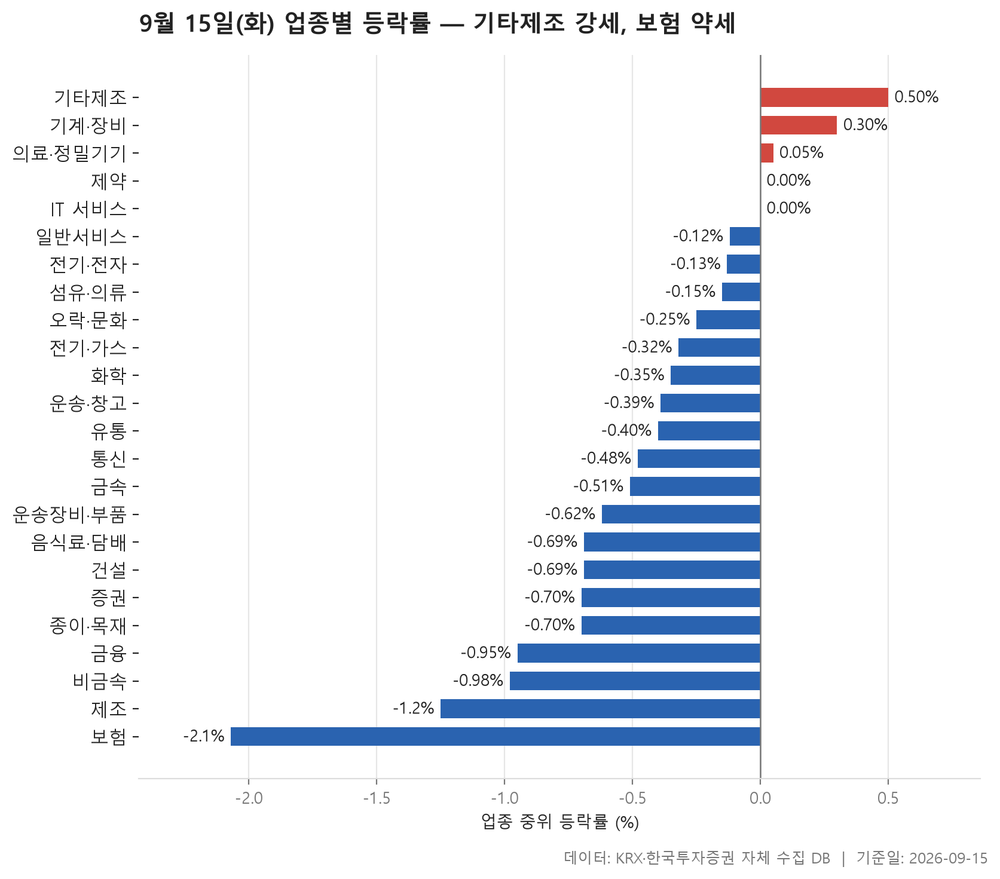
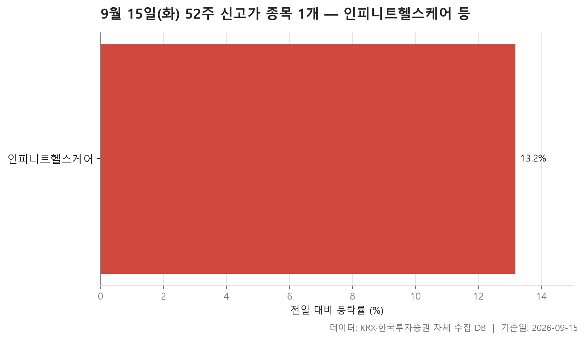
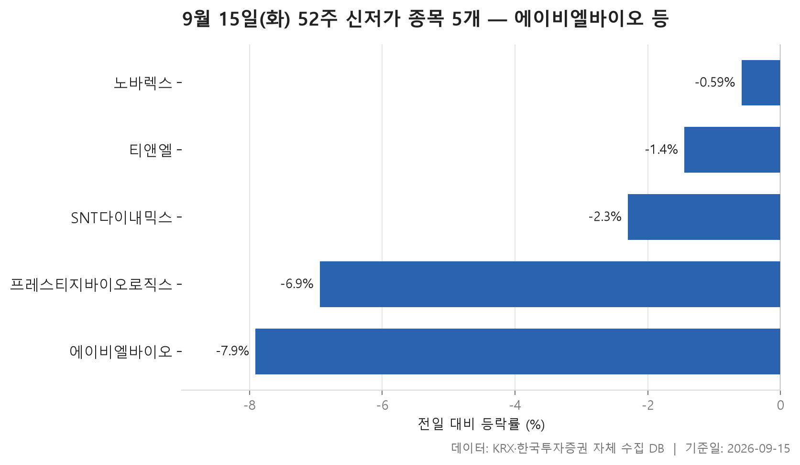
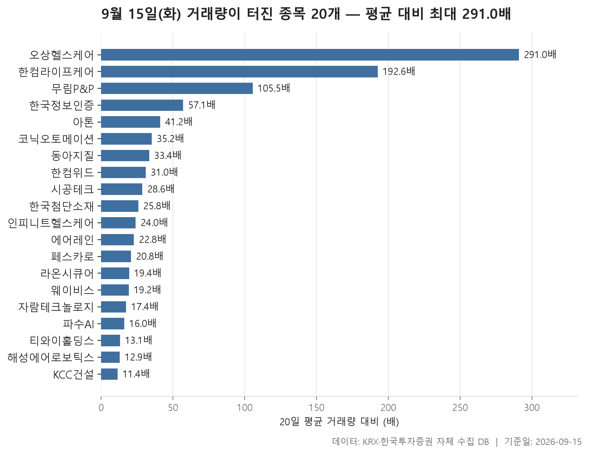

9월 15일 화요일 장이 끝났습니다. 24개 업종을 늘어놓고 각 업종 안 종목들의 중위 등락률로 줄을 세워 보면, 한가운데 놓인 값이 -0.40%입니다. 오른 업종보다 내린 업종이 훨씬 많았고, 24개 중 3개만 플러스, 19개가 마이너스였습니다. 큰 폭으로 무너진 날은 아니지만 방향은 분명히 아래쪽이었던 셈이죠.

그런데 업종별 숫자를 조금 더 들여다보면 이야기가 단순하지 않습니다. 중위값은 마이너스인데 평균은 플러스인 업종이 여럿 있고, 반대로 한 종목이 크게 빠지면서 업종 평균을 혼자 끌어내린 곳도 보입니다. 시장 전체가 한 방향으로 움직였다기보다, 아래로 눌린 바닥 위에서 몇몇 종목만 따로 튀어 올랐다고 보는 편이 표에 가깝습니다.

오늘 글에서는 업종 등락률로 전체 그림을 잡고, 52주 최고가를 넘어선 종목과 최저가를 밑돈 종목으로 양쪽 끝을 확인한 뒤, 거래량이 평소의 다섯 배를 넘긴 종목들로 마무리하겠습니다. 어느 표든 숫자가 말해 주는 범위까지만 설명하고, 이유를 지어내지는 않겠습니다.

> 기준일: 2026-09-15 · 집계: 자체 수집 데이터베이스

## 업종 등락률 — 24개 중 19개 하락

가장 강했던 곳은 기타제조로 중위 등락률이 +0.50%, 가장 약했던 곳은 보험으로 -2.07%입니다. 위아래 폭이 그리 넓지 않습니다. 플러스로 마감한 업종은 기타제조, 기계·장비(+0.30%), 의료·정밀기기(+0.05%) 셋뿐이고, 제약과 IT 서비스가 0.00%로 정확히 제자리, 그 아래로는 완만하게 마이너스가 이어집니다. 표의 대부분이 일점 밑에 촘촘히 모여 있어서, 업종 간 차이보다는 '전반적으로 조금씩 밀렸다'는 인상이 먼저 옵니다.

눈에 띄는 건 중위값과 평균이 어긋난 업종들입니다. 일반서비스는 한가운데 값이 -0.12%인데 평균은 +0.42%이고, 오락·문화도 중위값 -0.25%에 평균 +0.38%입니다. 두 업종 모두 가장 크게 움직인 종목이 상한가 언저리까지 올랐는데, 그 한 종목이 업종 평균을 각각 0.18%p, 0.44%p 끌어올린 것으로 집계됩니다. 중위값과 평균의 벌어진 폭을 생각하면 그 종목 하나만으로 설명되지는 않고, 다른 몇몇 종목도 함께 위로 움직였다고 읽는 편이 맞겠습니다. 건설도 비슷합니다. 중위값은 -0.69%로 낮은 편인데 평균은 -0.18%에 그칩니다.

반대 방향으로 어긋난 곳도 있습니다. 섬유·의류는 중위값이 -0.15%로 무난한데 평균은 -0.82%까지 내려가 있고, 가장 크게 움직인 종목이 -29.29%로 하한가 부근까지 밀리면서 업종 평균을 0.61%p 깎았습니다. 통신 역시 중위값 -0.48% 대비 평균이 -1.69%로 크게 벌어져 있는데, 13개 종목뿐인 업종에서 -13.13%짜리 한 종목이 평균을 1.01%p 끌어내렸으니 평균 쪽 숫자는 거의 그 종목이 만든 값입니다. 화학에서는 -38.03%까지 빠진 종목이 있었지만 222개 종목이 나눠 받다 보니 평균 기여는 -0.17%p에 그쳤습니다. 업종 규모에 따라 한 종목의 무게가 얼마나 달라지는지 보여 주는 대목이죠.

상승비율도 같이 보면 좋습니다. 보험은 11개 종목 중 오른 종목이 하나도 없어 상승비율이 0.00%입니다. 운송·창고와 제조는 일곱 중 하나꼴, 음식료·담배·증권·비금속도 다섯에 하나 안팎에 머물렀습니다. 반면 기타제조는 열 곳 중 여섯 곳 이상이 올랐고, 기계·장비는 절반을 조금 넘겼습니다. 거래대금이 112,808.60억원으로 압도적인 전기·전자는 중위값 -0.13%, 평균 -0.01%로 사실상 제자리에 가까웠습니다. 돈이 가장 많이 오간 곳이 가장 조용했던 셈입니다.

| 업종 | 종목수(개) | 중위등락률(%) | 평균등락률(%) | 상승비율(%) | 주도종목 | 주도종목등락률(%) | 평균기여도(%p) | 거래대금합계(억원) |
|---|---|---|---|---|---|---|---|---|
| 기타제조 | 14 | +0.50 | +1.43 | 64.30 | 에이럭스 | +9.83 | 0.70 | 162.30 |
| 기계·장비 | 206 | +0.30 | +0.64 | 54.40 | 코닉오토메이션 | +22.65 | 0.11 | 16,200.00 |
| 의료·정밀기기 | 100 | +0.05 | +0.24 | 50.00 | 케이엔알시스템 | +17.87 | 0.18 | 2,421.30 |
| 제약 | 165 | 0.00 | +0.48 | 43.60 | 삼익제약 | +27.46 | 0.17 | 10,468.80 |
| IT 서비스 | 243 | 0.00 | +0.45 | 46.90 | 아이티센피엔에스 | +29.78 | 0.12 | 11,610.30 |
| 일반서비스 | 168 | -0.12 | +0.42 | 42.90 | 엔젠바이오 | +29.94 | 0.18 | 6,884.20 |
| 전기·전자 | 363 | -0.13 | -0.01 | 46.30 | 한국첨단소재 | +29.98 | 0.08 | 112,808.60 |
| 섬유·의류 | 48 | -0.15 | -0.82 | 41.70 | 원풍물산 | -29.29 | -0.61 | 182.60 |
| 오락·문화 | 67 | -0.25 | +0.38 | 44.80 | YTN | +29.80 | 0.44 | 719.50 |
| 전기·가스 | 10 | -0.32 | -1.09 | 40.00 | SGC에너지 | -5.79 | -0.58 | 514.50 |
| 화학 | 222 | -0.35 | -0.29 | 40.50 | 카프로 | -38.03 | -0.17 | 11,032.20 |
| 운송·창고 | 28 | -0.39 | -1.11 | 14.30 | 대한해운 | -7.31 | -0.26 | 927.30 |
| 유통 | 154 | -0.40 | -0.42 | 37.00 | 인콘 | -9.65 | -0.06 | 4,469.30 |
| 통신 | 13 | -0.48 | -1.69 | 15.40 | 프리티 | -13.13 | -1.01 | 1,276.90 |
| 금속 | 131 | -0.51 | -0.50 | 35.10 | SHD | +29.97 | 0.23 | 4,337.90 |
| 운송장비·부품 | 134 | -0.62 | -0.36 | 30.60 | 삼현 | +30.45 | 0.23 | 9,731.70 |
| 음식료·담배 | 84 | -0.69 | -0.98 | 19.00 | 우리바이오 | +5.66 | 0.07 | 1,135.00 |
| 건설 | 51 | -0.69 | -0.18 | 33.30 | KCC건설 | +6.24 | 0.12 | 3,583.40 |
| 증권 | 18 | -0.70 | -0.92 | 16.70 | 미래에셋증권 | -3.17 | -0.18 | 881.10 |
| 종이·목재 | 27 | -0.70 | -0.39 | 37.00 | 모나리자 | +6.06 | 0.22 | 112.00 |
| 금융 | 111 | -0.95 | -0.74 | 27.90 | 나우IB | +9.46 | 0.09 | 13,546.20 |
| 비금속 | 36 | -0.98 | -1.09 | 16.70 | 동국알앤에스 | -5.00 | -0.14 | 429.70 |
| 제조 | 7 | -1.25 | -0.63 | 14.30 | 에넥스 | +4.36 | 0.62 | 7.60 |
| 보험 | 11 | -2.07 | -2.15 | 0.00 | 삼성생명 | -4.03 | -0.37 | 2,235.60 |

## 52주 신고가 1개 — 인피니트헬스케어 13.17%

52주 최고가를 넘어선 종목은 시가총액 500억원, 거래대금 3억원이라는 조건을 걸고 셌을 때 단 하나였습니다. 인피니트헬스케어가 12,800원에 마감하며 +13.17% 올랐고, 직전 52주 최고가였던 11,310원을 넘겼습니다. 시가총액은 3,123억원, 시장은 코스닥, 업종 구분은 IT 서비스입니다.

신고가 종목이 하루에 하나뿐이라는 것은 그 자체로 정보입니다. 업종 대부분이 마이너스로 마감한 날이었으니 어울리는 결과이기도 하고요. 다만 이 종목은 뒤에 나올 거래량 급증 명단에도 이름을 올리는데, 평소 거래량의 24.00배가 오간 날이었습니다. 왜 그랬는지는 이 표가 말해 주지 않습니다. 오늘 확인할 수 있는 건 가격이 지난 1년 구간의 위쪽을 처음 뚫었고, 거래가 평소보다 크게 늘었다는 두 가지 사실뿐입니다.

| 종목명 | 종목코드 | 시장 | 업종 | 종가(원) | 등락률(%) | 이전52주최고(원) | 거래대금(억원) | 시가총액(억원) |
|---|---|---|---|---|---|---|---|---|
| 인피니트헬스케어 | 071200 | KOSDAQ | IT 서비스 | 12,800 | +13.17 | 11,310 | 287.70 | 3,123 |

## 52주 신저가 5개 — 최저 에이비엘바이오 -7.91%

아래쪽 끝에는 다섯 종목이 있습니다. 위쪽이 하나였던 것과 비교하면 숫자로도 오늘 시장의 기울기가 드러나는 셈이죠. 다섯 중 넷이 코스닥, 하나가 코스피이고, 업종은 셋으로 나뉘는데 제약이 3개로 가장 많습니다.

낙폭은 종목마다 꽤 다릅니다. 가장 많이 내린 에이비엘바이오가 -7.91%, 프레스티지바이오로직스가 -6.94%로 두 자릿수에 가까운 반면, 노바렉스는 -0.59%에 그쳤습니다. 한가운데 놓인 값은 -2.30%입니다. 즉 '크게 무너져서 신저가'인 종목과 '살짝 밀렸는데 마침 그 자리가 1년 최저'인 종목이 섞여 있습니다. 노바렉스의 종가가 10,030원, 직전 52주 최저가가 10,040원이라는 점을 보면 후자가 어떤 모습인지 짐작이 갑니다. 이미 바닥 언저리에 오래 머물러 있던 가격이 아주 조금 더 내려가면서 기록이 갱신된 것이죠. SNT다이내믹스(27,600원, 직전 최저 27,700원)와 티앤엘(27,100원, 직전 최저 27,300원)도 비슷한 모양입니다.

시가총액에서는 에이비엘바이오가 33,257억원으로 나머지와 자릿수가 다릅니다. 이 종목만 거래대금이 555.40억원으로 두드러지고, 나머지 넷은 몇 억원에서 십여 억원 수준에 머물러 있습니다. 같은 '신저가'라는 이름으로 묶였지만 거래가 몰린 곳은 한 곳뿐이었다는 뜻입니다.

| 종목명 | 종목코드 | 시장 | 업종 | 종가(원) | 등락률(%) | 이전52주최저(원) | 거래대금(억원) | 시가총액(억원) |
|---|---|---|---|---|---|---|---|---|
| 에이비엘바이오 | 298380 | KOSDAQ | 제약 | 59,400 | -7.91 | 59,800 | 555.40 | 33,257 |
| SNT다이내믹스 | 003570 | KOSPI | 운송장비·부품 | 27,600 | -2.30 | 27,700 | 6.10 | 9,178 |
| 티앤엘 | 340570 | KOSDAQ | 제약 | 27,100 | -1.45 | 27,300 | 13.60 | 4,355 |
| 노바렉스 | 194700 | KOSDAQ | 음식료·담배 | 10,030 | -0.59 | 10,040 | 3.20 | 1,831 |
| 프레스티지바이오로직스 | 334970 | KOSDAQ | 제약 | 1,528 | -6.94 | 1,616 | 6.00 | 1,188 |

## 거래량 급증 20개 — 최고 오상헬스케어 291배

당일 거래량이 직전 20거래일 평균의 5배를 넘은 종목 가운데 시가총액·거래대금 조건을 통과한 것이 20개입니다. 배수의 분포가 상당히 치우쳐 있습니다. 오상헬스케어가 291.00배, 한컴라이프케어가 192.60배, 무림P&P가 105.50배로 세 종목만 세 자릿수이고, 그 아래는 57.10배에서 11.40배까지 완만하게 내려옵니다. 한가운데 값은 24.90배입니다. 위쪽 몇 종목이 평균을 통째로 왜곡하는 전형적인 모양이라, 배수는 순위보다 '어디서 끊기는가'를 보는 게 낫습니다.

거래가 터졌다고 해서 다 오른 것은 아닙니다. 20개 중 대부분이 플러스지만 자람테크놀로지는 -25.25%, 해성에어로보틱스는 -7.05%, 티와이홀딩스는 -0.94%로 마이너스입니다. 특히 자람테크놀로지는 평소의 17.40배가 거래되면서 크게 밀렸습니다. 거래량 급증은 방향이 아니라 관심의 크기를 재는 지표라는 점을 이 세 종목이 보여 줍니다.

배수와 거래대금이 따로 노는 것도 눈여겨볼 만합니다. 배수 1위인 오상헬스케어의 거래대금은 277.10억원인데, 배수로는 25.80배에 불과한 한국첨단소재가 1,339.30억원, 19.40배인 라온시큐어가 1,448.30억원으로 훨씬 큽니다. 배수는 그 종목의 평소 거래량 대비 몇 배인지를 볼 뿐이라, 원래 조용하던 종목일수록 숫자가 쉽게 커집니다. 실제로 오간 돈의 크기는 별개인 셈이죠. 반대편 끝에 있는 KCC건설은 11.40배로 명단 맨 아래인데 거래대금도 10.40억원, 티와이홀딩스는 3.70억원으로 필터 하한 근처입니다.

업종은 9개로 나뉘고 IT 서비스가 6개로 가장 많습니다. 앞서 업종 표에서 IT 서비스의 중위 등락률은 0.00%였는데, 그 안에서 거래가 크게 늘어난 종목이 여섯이나 나왔다는 조합입니다. 업종 전체가 움직인 게 아니라 일부 종목에 거래가 몰린 하루였다고 읽을 수 있겠습니다. 시장별로는 코스닥이 16개, 코스피가 4개였습니다.

| 종목명 | 종목코드 | 시장 | 업종 | 종가(원) | 등락률(%) | 거래량(주) | 평균거래량(주) | 배수(배) | 거래대금(억원) | 시가총액(억원) |
|---|---|---|---|---|---|---|---|---|---|---|
| 오상헬스케어 | 036220 | KOSDAQ | 의료·정밀기기 | 7,230 | +10.89 | 3,560,381 | 12,235 | 291.00 | 277.10 | 1,035 |
| 한컴라이프케어 | 372910 | KOSPI | 의료·정밀기기 | 2,040 | +7.26 | 11,828,188 | 61,412 | 192.60 | 262.10 | 565 |
| 무림P&P | 009580 | KOSPI | 종이·목재 | 1,670 | +2.96 | 4,471,771 | 42,393 | 105.50 | 80.00 | 1,042 |
| 한국정보인증 | 053300 | KOSDAQ | IT 서비스 | 5,470 | +5.60 | 5,813,274 | 101,893 | 57.10 | 336.80 | 2,164 |
| 아톤 | 158430 | KOSDAQ | IT 서비스 | 6,310 | +29.70 | 11,715,725 | 284,053 | 41.20 | 671.50 | 1,545 |
| 코닉오토메이션 | 391710 | KOSDAQ | 기계·장비 | 1,473 | +22.65 | 7,239,555 | 205,682 | 35.20 | 106.00 | 628 |
| 동아지질 | 028100 | KOSPI | 건설 | 18,330 | +3.38 | 555,352 | 16,629 | 33.40 | 106.30 | 2,057 |
| 한컴위드 | 054920 | KOSDAQ | IT 서비스 | 5,230 | +29.78 | 10,083,905 | 325,639 | 31.00 | 490.10 | 1,476 |
| 시공테크 | 020710 | KOSDAQ | 일반서비스 | 3,900 | +1.43 | 2,825,248 | 98,806 | 28.60 | 116.50 | 782 |
| 한국첨단소재 | 062970 | KOSDAQ | 전기·전자 | 3,360 | +29.98 | 43,587,698 | 1,691,184 | 25.80 | 1,339.30 | 1,012 |
| 인피니트헬스케어 | 071200 | KOSDAQ | IT 서비스 | 12,800 | +13.17 | 2,240,518 | 93,524 | 24.00 | 287.70 | 3,123 |
| 에어레인 | 163280 | KOSDAQ | 기계·장비 | 3,965 | +11.06 | 1,507,101 | 65,995 | 22.80 | 63.10 | 539 |
| 페스카로 | 0015S0 | KOSDAQ | 일반서비스 | 9,200 | +17.20 | 1,224,233 | 58,793 | 20.80 | 111.90 | 908 |
| 라온시큐어 | 042510 | KOSDAQ | IT 서비스 | 12,850 | +14.43 | 11,018,141 | 567,427 | 19.40 | 1,448.30 | 1,427 |
| 웨이비스 | 289930 | KOSDAQ | 전기·전자 | 7,450 | +3.47 | 910,836 | 47,518 | 19.20 | 73.20 | 980 |
| 자람테크놀로지 | 389020 | KOSDAQ | 전기·전자 | 16,370 | -25.25 | 422,061 | 24,243 | 17.40 | 70.60 | 1,130 |
| 파수AI | 150900 | KOSDAQ | IT 서비스 | 4,385 | +1.98 | 1,933,696 | 120,786 | 16.00 | 90.10 | 513 |
| 티와이홀딩스 | 363280 | KOSPI | 금융 | 2,100 | -0.94 | 171,727 | 13,130 | 13.10 | 3.70 | 955 |
| 해성에어로보틱스 | 059270 | KOSDAQ | 금속 | 4,880 | -7.05 | 579,910 | 45,007 | 12.90 | 26.50 | 545 |
| KCC건설 | 021320 | KOSDAQ | 건설 | 5,960 | +6.24 | 171,796 | 15,128 | 11.40 | 10.40 | 1,275 |

## 정리

정리하면, 24개 업종 중 19개가 마이너스로 끝났고 중간에 놓인 값이 -0.40%인 완만한 하락 장세였습니다. 52주 최고가를 새로 쓴 종목은 하나, 최저가를 밑돈 종목은 다섯이었고, 거래량이 평소의 다섯 배를 넘긴 종목은 스무 개였는데 그중 셋은 오히려 내렸습니다. 전체가 밀리는 와중에 일부 종목에만 거래와 가격이 몰린 날이었다고 요약할 수 있겠습니다.

다만 이 글의 표들은 모두 하루치 가격과 거래량을 집계한 결과일 뿐입니다. 왜 그렇게 움직였는지는 이 자료 안에 없고, 저도 추측해서 채우지 않았습니다. 업종 순위는 보통주 5종목 이상인 업종만, 신고가·신저가와 거래량 급증은 시가총액 500억원·거래대금 3억원 이상인 보통주만 대상으로 했으니, 조건을 바꾸면 명단도 달라집니다. 숫자를 읽을 때 그 범위를 함께 봐 주시기 바랍니다.

## 집계 기준

**업종 등락률**

- **기준**: 2026-09-14 종가 → 2026-09-15 종가
- **순위**: 업종 내 종목 등락률의 중위값 (평균은 참고용으로 함께 표시)
- **주도종목**: 그 업종에서 등락률 절대값이 가장 큰 종목 (동점이면 거래대금이 큰 쪽)
- **평균기여도**: 그 종목 하나가 업종 평균을 움직인 폭 (등락률 ÷ 종목수). 중위값과 평균의 격차가 이 값에 가까우면 평균을 만든 것이 그 종목이고, 훨씬 크면 다른 종목들도 함께 움직인 것입니다
- **필터**: 업종 내 보통주 5종목 이상
- **전체업종중위등락률(%)**: -0.4

**52주 신고가**

- **기준**: 종가 > 직전 52주 최고가
- **관측구간**: 2025-09-02 ~ 2026-09-14 (252거래일)
- **필터**: 시가총액 500억 이상, 거래대금 3억 이상, 보통주

**52주 신저가**

- **기준**: 종가 < 직전 52주 최저가
- **관측구간**: 2025-09-02 ~ 2026-09-14 (252거래일)
- **필터**: 시가총액 500억 이상, 거래대금 3억 이상, 보통주

**거래량 급증**

- **기준**: 당일 거래량 ≥ 직전 20거래일 평균 × 5
- **관측구간**: 2026-08-18 ~ 2026-09-14 (20거래일)
- **필터**: 시가총액 500억 이상, 거래대금 3억 이상, 보통주

## 데이터 출처 및 유의사항

- **데이터출처**: 한국거래소(KRX) 공시 데이터와 한국투자증권 OpenAPI 를 직접 수집해 구축한 자체 데이터베이스
- **집계방식**: 수집·집계·차트 생성을 직접 구현한 파이프라인에서 자동 산출
- **작성고지**: 본문의 표·통계·차트는 자체 데이터베이스에서 계산된 값이며, 문장 작성 과정에 AI 도구를 활용했습니다.
- **면책**: 본 글은 정보 제공을 목적으로 하며 특정 종목의 매수·매도를 추천하지 않습니다. 제시된 수치는 과거 데이터이고 미래 수익을 보장하지 않습니다. 투자 판단과 그 결과에 대한 책임은 투자자 본인에게 있습니다.

