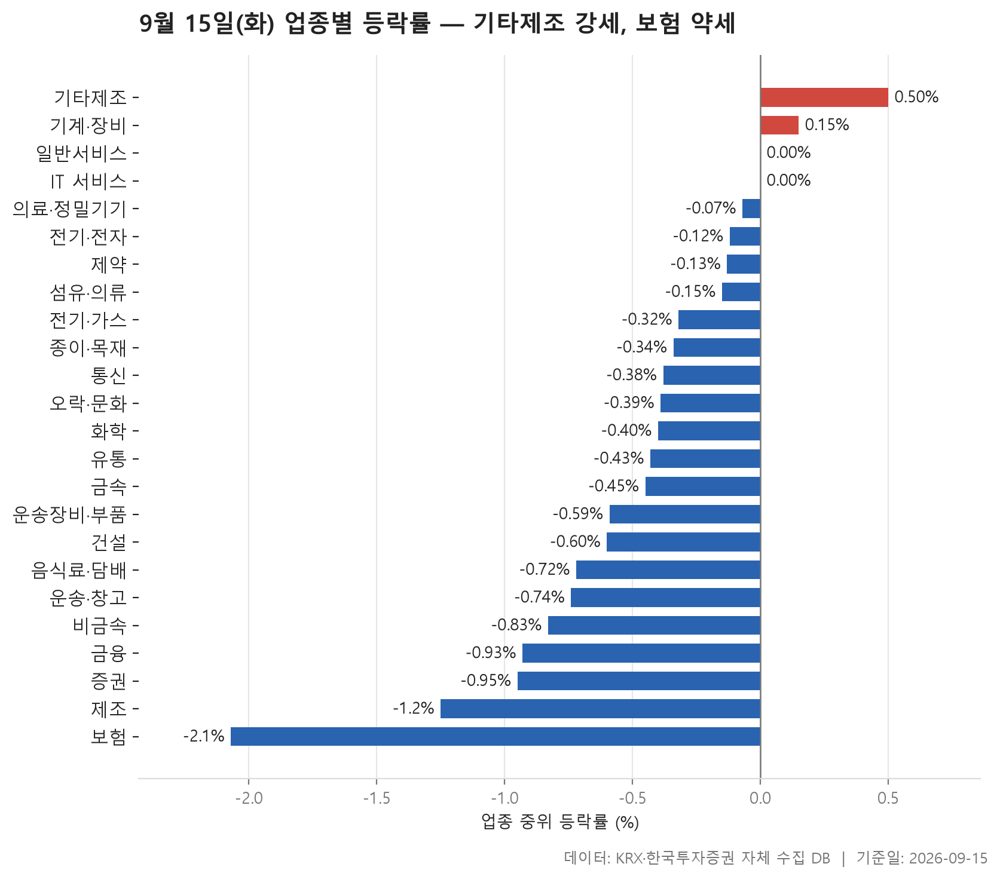
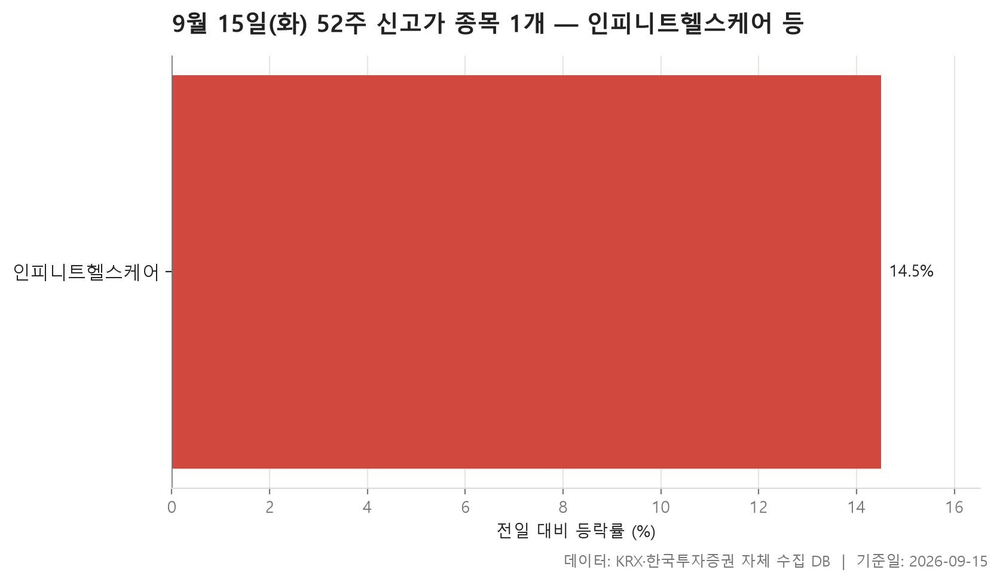
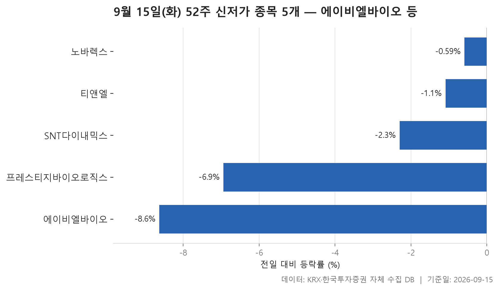
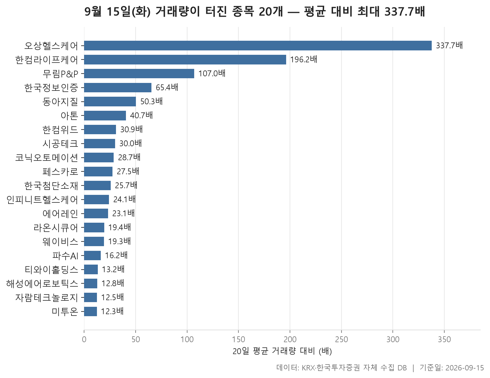

9월 15일 시장은 크게 무너졌다기보다 넓게 조금씩 밀린 하루였습니다. 24개 업종 가운데 중위 등락률이 플러스로 끝난 곳은 2개, 마이너스로 끝난 곳은 20개였습니다. 업종들의 중위 등락률을 한 줄로 세우면 한가운데 값이 -0.40%입니다. 낙폭 자체는 크지 않았지만, 오른 쪽에 선 업종이 드물었다는 점이 이날의 모습을 잘 보여 줍니다.

가장 잘 버틴 업종은 기타제조(+0.50%)였고, 가장 약한 업종은 보험(-2.07%)이었습니다. 52주 신고가와 신저가 목록도 같은 방향을 가리킵니다. 신고가를 새로 쓴 종목은 1개, 신저가로 내려앉은 종목은 5개였습니다. 한편 평소보다 거래량이 5배 넘게 터진 종목은 20개나 됐고, 이 가운데 대부분은 올랐습니다. 시장 전체가 가라앉은 가운데 일부 종목에만 매매가 몰린 날이었다고 보시면 됩니다.

아래에서는 업종 흐름부터 보고, 신고가·신저가를 거쳐 거래량이 급증한 종목으로 차례로 넘어갑니다. 각 표에서 숫자가 서로 맞지 않아 보이는 곳을 중심으로 짚어 보겠습니다.

> 기준일: 2026-09-15 · 집계: 자체 수집 데이터베이스

## 업종 등락률 — 24개 중 20개 하락

맨 위에 선 업종부터 힘이 약했습니다. 플러스로 끝난 곳은 기타제조(+0.50%)와 기계·장비(+0.15%) 둘뿐이고, 일반서비스와 IT 서비스는 중위값이 0.00%로 제자리였습니다. 맨 아래의 보험은 조금 다른 문제입니다. 11개 종목 가운데 오른 종목이 하나도 없었고, 평균(-2.21%)도 중위값과 거의 붙어 있습니다. 한두 종목이 끌어내린 게 아니라 업종 전체가 고르게 빠졌다는 뜻이죠. 가장 크게 움직인 삼성생명도 -4.19%에 그쳐 눈에 띄게 튄 종목이 없었습니다.

중위값과 평균이 벌어진 업종에서는 대개 한 종목이 평균을 움직였습니다. 기타제조는 중위값이 +0.50%인데 평균은 +1.26%입니다. 에이럭스(+9.69%) 하나가 업종 평균을 0.69%p 끌어올렸으니, 격차의 대부분은 이 종목 몫입니다. 오락·문화는 방향까지 뒤집혔습니다. 중위값은 -0.39%인데 평균은 +0.15%로 플러스이고, YTN(+29.80%) 한 종목이 평균을 0.44%p 올려놓았습니다. 통신은 그 반대입니다. 중위값은 -0.38%로 무난했지만 평균은 -1.57%까지 내려갔고, 프리티(-13.13%)가 혼자서 평균을 1.01%p 끌어내렸습니다. 이런 업종에서는 평균만 봐서는 업종 전체의 분위기를 읽기 어렵습니다.

종목 수가 많은 업종에서는 한 종목의 영향이 묻힙니다. 화학의 카프로는 -38.03%로 표 전체에서 낙폭이 가장 컸지만, 222개 종목 속에서 업종 평균을 움직인 폭은 0.17%p에 머물렀습니다. 거래대금으로 보면 전기·전자가 118,720.60억원으로 다른 업종을 크게 앞섰는데, 중위값 -0.12%에 평균 +0.01%로 거의 움직이지 않았습니다. 하단에서는 오른 종목이 드문 업종이 눈에 띕니다. 운송·창고는 오른 종목이 10.70%로 열 곳에 한 곳꼴이었고, 증권(11.10%)과 음식료·담배(17.90%)도 비슷하게 한쪽으로 쏠려 있었습니다.

| 업종 | 종목수(개) | 중위등락률(%) | 평균등락률(%) | 상승비율(%) | 주도종목 | 주도종목등락률(%) | 평균기여도(%p) | 거래대금합계(억원) |
|---|---|---|---|---|---|---|---|---|
| 기타제조 | 14 | +0.50 | +1.26 | 64.30 | 에이럭스 | +9.69 | 0.69 | 165.40 |
| 기계·장비 | 206 | +0.15 | +0.53 | 51.90 | 코닉오토메이션 | +24.75 | 0.12 | 17,060.50 |
| 일반서비스 | 168 | 0.00 | +0.45 | 44.00 | 엔젠바이오 | +29.94 | 0.18 | 7,334.90 |
| IT 서비스 | 243 | 0.00 | +0.34 | 46.50 | 아톤 | +29.84 | 0.12 | 12,909.30 |
| 의료·정밀기기 | 100 | -0.07 | +0.26 | 49.00 | 케이엔알시스템 | +17.75 | 0.18 | 2,754.50 |
| 전기·전자 | 363 | -0.12 | +0.01 | 46.00 | 한국첨단소재 | +29.98 | 0.08 | 118,720.60 |
| 제약 | 165 | -0.13 | +0.41 | 41.80 | 삼익제약 | +26.11 | 0.16 | 10,876.00 |
| 섬유·의류 | 48 | -0.15 | -0.90 | 41.70 | 원풍물산 | -29.29 | -0.61 | 187.60 |
| 전기·가스 | 10 | -0.32 | -1.13 | 40.00 | SGC에너지 | -5.79 | -0.58 | 533.30 |
| 종이·목재 | 27 | -0.34 | -0.29 | 37.00 | 무림P&P | +2.96 | 0.11 | 114.90 |
| 통신 | 13 | -0.38 | -1.57 | 23.10 | 프리티 | -13.13 | -1.01 | 1,392.40 |
| 오락·문화 | 67 | -0.39 | +0.15 | 41.80 | YTN | +29.80 | 0.44 | 732.20 |
| 화학 | 222 | -0.40 | -0.43 | 37.80 | 카프로 | -38.03 | -0.17 | 11,562.20 |
| 유통 | 154 | -0.43 | -0.44 | 36.40 | 인콘 | -9.65 | -0.06 | 4,643.80 |
| 금속 | 131 | -0.45 | -0.52 | 35.10 | SHD | +29.97 | 0.23 | 4,522.30 |
| 운송장비·부품 | 134 | -0.59 | -0.40 | 30.60 | 삼현 | +29.80 | 0.22 | 10,150.00 |
| 건설 | 51 | -0.60 | -0.20 | 33.30 | KCC건설 | +6.24 | 0.12 | 3,822.70 |
| 음식료·담배 | 84 | -0.72 | -1.03 | 17.90 | 우리바이오 | +5.66 | 0.07 | 1,281.90 |
| 운송·창고 | 28 | -0.74 | -1.10 | 10.70 | 팬오션 | -5.96 | -0.21 | 971.80 |
| 비금속 | 36 | -0.83 | -1.00 | 16.70 | 강동씨앤엘 | -5.06 | -0.14 | 461.40 |
| 금융 | 111 | -0.93 | -0.74 | 28.80 | 린드먼아시아 | +8.79 | 0.08 | 14,247.50 |
| 증권 | 18 | -0.95 | -1.14 | 11.10 | 미래에셋증권 | -3.32 | -0.18 | 910.50 |
| 제조 | 7 | -1.25 | -0.63 | 14.30 | 에넥스 | +4.36 | 0.62 | 7.70 |
| 보험 | 11 | -2.07 | -2.21 | 0.00 | 삼성생명 | -4.19 | -0.38 | 2,341.20 |

## 52주 신고가 1개 — 인피니트헬스케어 14.50%

이날 52주 신고가를 새로 쓴 종목은 인피니트헬스케어 하나뿐입니다. 코스닥 IT 서비스 종목으로, 종가 12,950원에 +14.50% 올라 직전 52주 최고가였던 11,310원을 넉넉하게 넘어섰습니다. 시가총액은 3,159.30억원, 거래대금은 290.40억원이었습니다.

이 종목은 뒤에 나오는 거래량 급증 표에도 다시 등장합니다. 평소보다 24.10배 많은 거래량이 실리면서 신고가를 뚫은 셈이죠. 흥미로운 건 이 종목이 속한 IT 서비스 업종의 중위 등락률이 0.00%였다는 점입니다. 업종 전체는 보합이었는데 그 안에서 몇몇 종목만 크게 움직였고, 인피니트헬스케어가 그중 하나였습니다. 왜 올랐는지는 자료에 없으니 여기서 판단하지 않겠습니다.

신고가가 하나에 그친 것 자체도 이날 시장을 말해 줍니다. 신저가 쪽이 5개였으니 새로운 고점보다 새로운 저점이 더 많이 나온 하루였습니다.

| 종목명 | 종목코드 | 시장 | 업종 | 종가(원) | 등락률(%) | 이전52주최고(원) | 거래대금(억원) | 시가총액(억원) |
|---|---|---|---|---|---|---|---|---|
| 인피니트헬스케어 | 071200 | KOSDAQ | IT 서비스 | 12,950 | +14.50 | 11,310 | 290.40 | 3,159.30 |

## 52주 신저가 5개 — 최저 에이비엘바이오 -8.63%

52주 신저가로 내려간 종목은 5개이고, 이 중 3개가 제약 업종입니다. 코스닥이 4개, 코스피가 1개입니다. 규모가 가장 큰 곳은 시가총액 33,200.60억원의 에이비엘바이오입니다. 하루 -8.63% 빠지면서 종가 59,300원으로 직전 52주 최저가 59,800원을 밑돌았습니다. 거래대금도 578.20억원으로 이 표에서 홀로 많았습니다.

나머지 종목들은 결이 좀 다릅니다. 노바렉스는 -0.59%만 내렸는데도 종가 10,030원이 이전 최저가 10,040원을 간신히 밑돌면서 신저가가 됐습니다. 유일한 코스피 종목인 SNT다이내믹스 역시 27,700원이던 이전 저점을 27,600원으로 살짝 낮췄을 뿐입니다. 두 종목의 거래대금은 각각 3.40억원, 6.50억원으로 적었습니다. 크게 팔렸다기보다 한산한 거래 속에서 저점이 조금씩 내려온 모습입니다. 반면 프레스티지바이오로직스는 -6.94% 급락하며 1,616원이던 이전 저점을 1,528원으로 확실히 끌어내렸습니다.

다섯 종목의 하루 등락률을 모아 보면 가운데 값이 -2.30%입니다. 큰 폭으로 빠져 저점을 깬 종목과 조금 밀려 경계선을 넘은 종목이 섞여 있다는 뜻입니다. 그래서 신저가라는 결과는 같아도 무게는 종목마다 다르게 봐야 합니다.

| 종목명 | 종목코드 | 시장 | 업종 | 종가(원) | 등락률(%) | 이전52주최저(원) | 거래대금(억원) | 시가총액(억원) |
|---|---|---|---|---|---|---|---|---|
| 에이비엘바이오 | 298380 | KOSDAQ | 제약 | 59,300 | -8.63 | 59,800 | 578.20 | 33,200.60 |
| SNT다이내믹스 | 003570 | KOSPI | 운송장비·부품 | 27,600 | -2.30 | 27,700 | 6.50 | 9,177.70 |
| 티앤엘 | 340570 | KOSDAQ | 제약 | 27,200 | -1.09 | 27,300 | 13.90 | 4,371.10 |
| 노바렉스 | 194700 | KOSDAQ | 음식료·담배 | 10,030 | -0.59 | 10,040 | 3.40 | 1,831.00 |
| 프레스티지바이오로직스 | 334970 | KOSDAQ | 제약 | 1,528 | -6.94 | 1,616 | 6.10 | 1,188.10 |

## 거래량 급증 20개 — 최고 오상헬스케어 337.70배

평소의 5배를 넘는 거래량이 실린 종목은 20개였고, 배수를 늘어놓았을 때 한가운데 값이 26.60배입니다. 기준선인 5배를 한참 웃도는 종목이 대부분이었다는 얘기입니다. 맨 위의 오상헬스케어는 20일 평균이 하루 12,246주였는데 이날은 4,135,650주가 거래돼 337.70배를 기록했고, 주가는 +10.58% 올랐습니다. 한컴라이프케어(196.20배)와 종이·목재 업종에서 가장 크게 움직인 무림P&P(107.00배)까지, 100배를 넘긴 종목이 세 곳입니다.

업종으로는 IT 서비스가 7개로 가장 많습니다. 아톤(+29.84%)과 한컴위드(+29.78%)가 급등했고, 라온시큐어(+14.69%)는 거래대금이 1,542.90억원으로 이 표에서 가장 컸습니다. 앞에서 봤듯이 IT 서비스 업종 전체의 중위 등락률은 0.00%였습니다. 업종이 함께 오른 게 아니라 몇몇 종목에 매매가 집중됐다고 읽는 편이 맞습니다. 전기·전자의 한국첨단소재(+29.98%)는 거래대금이 1,342.20억원이었는데, 시가총액 1,012.10억원보다도 많습니다. 라온시큐어 역시 거래대금이 시가총액 1,439.30억원을 웃돌았습니다. 하루 사이에 회사 몸집보다 큰 금액이 손바뀜된 셈입니다.

표 맨 아래 네 종목만 빼면 모두 올랐습니다. 다만 거래량이 터졌다고 늘 오른 것은 아닙니다. 자람테크놀로지는 거래량이 12.50배로 늘면서 -23.93% 급락했습니다. 미투온은 배수가 12.30배로 표에서 가장 낮은데, 평소 거래량 자체가 하루 1,880,261주로 많았기 때문입니다. 이날 거래대금은 868.10억원으로 상위권이었고 주가는 -4.98% 내렸습니다. 시장별로는 코스닥이 16개, 코스피가 4개로 코스닥 쪽에 크게 몰렸습니다.

| 종목명 | 종목코드 | 시장 | 업종 | 종가(원) | 등락률(%) | 거래량(주) | 평균거래량(주) | 배수(배) | 거래대금(억원) | 시가총액(억원) |
|---|---|---|---|---|---|---|---|---|---|---|
| 오상헬스케어 | 036220 | KOSDAQ | 의료·정밀기기 | 7,210 | +10.58 | 4,135,650 | 12,246 | 337.70 | 320.10 | 1,031.70 |
| 한컴라이프케어 | 372910 | KOSPI | 의료·정밀기기 | 2,065 | +8.57 | 12,053,363 | 61,429 | 196.20 | 266.70 | 571.50 |
| 무림P&P | 009580 | KOSPI | 종이·목재 | 1,670 | +2.96 | 4,557,129 | 42,597 | 107.00 | 81.50 | 1,041.60 |
| 한국정보인증 | 053300 | KOSDAQ | IT 서비스 | 5,500 | +7.42 | 6,680,180 | 102,158 | 65.40 | 385.90 | 2,176.10 |
| 동아지질 | 028100 | KOSPI | 건설 | 18,690 | +5.41 | 836,336 | 16,636 | 50.30 | 162.40 | 2,097.40 |
| 아톤 | 158430 | KOSDAQ | IT 서비스 | 6,310 | +29.84 | 11,780,434 | 289,444 | 40.70 | 675.50 | 1,544.80 |
| 한컴위드 | 054920 | KOSDAQ | IT 서비스 | 5,230 | +29.78 | 10,102,187 | 327,418 | 30.90 | 491.00 | 1,475.80 |
| 시공테크 | 020710 | KOSDAQ | 일반서비스 | 3,895 | +1.30 | 2,962,733 | 98,838 | 30.00 | 121.70 | 780.90 |
| 코닉오토메이션 | 391710 | KOSDAQ | 기계·장비 | 1,502 | +24.75 | 7,410,959 | 258,273 | 28.70 | 108.60 | 640.20 |
| 페스카로 | 0015S0 | KOSDAQ | 일반서비스 | 9,200 | +17.20 | 1,624,283 | 58,973 | 27.50 | 149.30 | 907.70 |
| 한국첨단소재 | 062970 | KOSDAQ | 전기·전자 | 3,360 | +29.98 | 43,673,913 | 1,700,776 | 25.70 | 1,342.20 | 1,012.10 |
| 인피니트헬스케어 | 071200 | KOSDAQ | IT 서비스 | 12,950 | +14.50 | 2,261,895 | 93,835 | 24.10 | 290.40 | 3,159.30 |
| 에어레인 | 163280 | KOSDAQ | 기계·장비 | 3,965 | +11.06 | 1,525,996 | 66,052 | 23.10 | 63.80 | 539.40 |
| 라온시큐어 | 042510 | KOSDAQ | IT 서비스 | 12,960 | +14.69 | 11,757,859 | 604,733 | 19.40 | 1,542.90 | 1,439.30 |
| 웨이비스 | 289930 | KOSDAQ | 전기·전자 | 7,430 | +7.06 | 919,613 | 47,536 | 19.30 | 73.80 | 977.00 |
| 파수AI | 150900 | KOSDAQ | IT 서비스 | 4,285 | +0.47 | 1,974,230 | 122,153 | 16.20 | 91.80 | 501.50 |
| 티와이홀딩스 | 363280 | KOSPI | 금융 | 2,100 | -0.94 | 173,100 | 13,132 | 13.20 | 3.70 | 955.40 |
| 해성에어로보틱스 | 059270 | KOSDAQ | 금속 | 4,880 | -7.05 | 594,097 | 46,361 | 12.80 | 27.20 | 544.90 |
| 자람테크놀로지 | 389020 | KOSDAQ | 전기·전자 | 16,240 | -23.93 | 445,607 | 35,618 | 12.50 | 74.40 | 1,121.40 |
| 미투온 | 201490 | KOSDAQ | IT 서비스 | 2,955 | -4.98 | 23,076,550 | 1,880,261 | 12.30 | 868.10 | 967.00 |

## 정리

정리하면 9월 15일은 대부분의 업종이 조금씩 밀린 가운데, 거래량이 터진 몇몇 종목만 크게 오른 하루였습니다. 보험은 오른 종목 없이 고르게 내렸고, 기타제조와 오락·문화처럼 평균이 좋아 보이는 업종도 들여다보면 한 종목이 숫자를 만든 경우가 많았습니다. 신고가가 1개, 신저가가 5개였다는 점도 전반적으로 약했던 분위기와 맞아떨어집니다.

다만 이 글은 하루치 종가만 비교한 것입니다. 오르고 내린 이유는 자료에 없어서 다루지 않았습니다. 신고가·신저가와 거래량 표는 시가총액 500억원 이상, 거래대금 3억원 이상인 보통주만 걸러 낸 결과라서 그보다 작은 종목의 움직임은 빠져 있습니다. 업종 순위도 5종목 이상인 업종의 중위값을 기준으로 매긴 것이니, 종목 수가 적은 업종은 한두 종목에 따라 순위가 크게 바뀔 수 있다는 점을 감안해 읽어 주세요.

## 집계 기준

**업종 등락률**

- **기준**: 2026-09-14 종가 → 2026-09-15 종가
- **순위**: 업종 내 종목 등락률의 중위값 (평균은 참고용으로 함께 표시)
- **주도종목**: 그 업종에서 등락률 절대값이 가장 큰 종목 (동점이면 거래대금이 큰 쪽)
- **평균기여도**: 그 종목 하나가 업종 평균을 움직인 폭 (등락률 ÷ 종목수). 중위값과 평균의 격차가 이 값에 가까우면 평균을 만든 것이 그 종목이고, 훨씬 크면 다른 종목들도 함께 움직인 것입니다
- **필터**: 업종 내 보통주 5종목 이상
- **전체업종중위등락률(%)**: -0.4

**52주 신고가**

- **기준**: 종가 > 직전 52주 최고가
- **관측구간**: 2025-09-02 ~ 2026-09-14 (252거래일)
- **필터**: 시가총액 500억 이상, 거래대금 3억 이상, 보통주

**52주 신저가**

- **기준**: 종가 < 직전 52주 최저가
- **관측구간**: 2025-09-02 ~ 2026-09-14 (252거래일)
- **필터**: 시가총액 500억 이상, 거래대금 3억 이상, 보통주

**거래량 급증**

- **기준**: 당일 거래량 ≥ 직전 20거래일 평균 × 5
- **관측구간**: 2026-08-18 ~ 2026-09-14 (20거래일)
- **필터**: 시가총액 500억 이상, 거래대금 3억 이상, 보통주

## 데이터 출처 및 유의사항

- **데이터출처**: 한국거래소(KRX) 공시 데이터와 한국투자증권 OpenAPI 를 직접 수집해 구축한 자체 데이터베이스
- **집계방식**: 수집·집계·차트 생성을 직접 구현한 파이프라인에서 자동 산출
- **작성고지**: 본문의 표·통계·차트는 자체 데이터베이스에서 계산된 값이며, 문장 작성 과정에 AI 도구를 활용했습니다.
- **면책**: 본 글은 정보 제공을 목적으로 하며 특정 종목의 매수·매도를 추천하지 않습니다. 제시된 수치는 과거 데이터이고 미래 수익을 보장하지 않습니다. 투자 판단과 그 결과에 대한 책임은 투자자 본인에게 있습니다.

