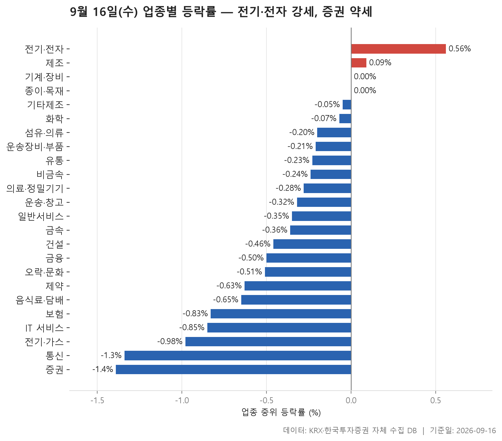
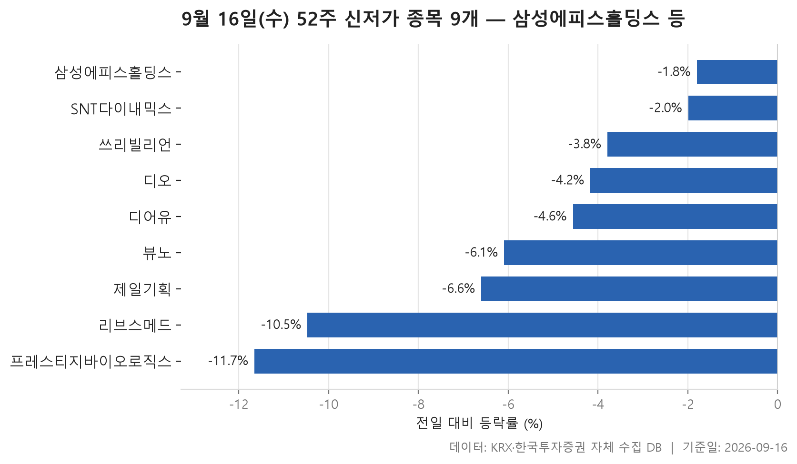
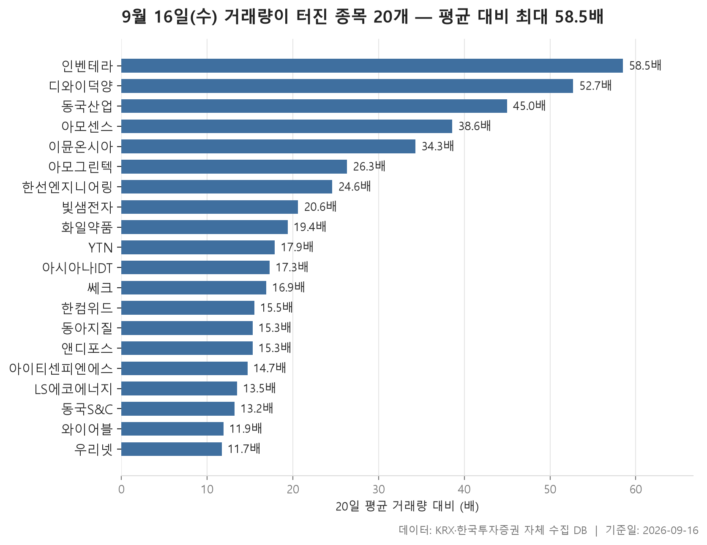

9월 16일 장을 업종 흐름, 52주 최저가를 새로 쓴 종목, 그리고 거래량이 평소와 전혀 다른 수준으로 불어난 종목 순으로 훑어봅니다. 세 표 모두 같은 하루를 다르게 잘라 본 것이라, 겹쳐 놓고 보면 시장이 어느 쪽으로 기울어 있었는지가 비교적 또렷하게 드러납니다.

먼저 큰 그림부터 말하면, 오늘은 내린 쪽이 압도적이었습니다. 집계 대상 24개 업종 가운데 업종 안 종목들의 중위 등락률이 플러스로 끝난 곳은 단 둘. 24개 업종의 중위 등락률을 한 줄로 늘어놓았을 때 한가운데 놓이는 값은 -0.34%였고, 전체 종목 기준으로 계산한 값도 -0.33%로 거의 같습니다. 기울기가 일부 업종에 몰린 게 아니라 시장 전반에 얕게 깔려 있었다는 뜻입니다.

그런데 표를 한 칸씩 들여다보면 얘기가 단순하지 않습니다. 중위값은 마이너스인데 평균은 플러스인 업종이 여럿이고, 반대로 하루 사이에 30% 가까이 오른 종목과 40% 내린 종목이 같은 날 같은 표 안에 나란히 앉아 있습니다. 오늘 글은 그 어긋난 대목들을 짚는 데 시간을 좀 쓰겠습니다.

> 기준일: 2026-09-16 · 집계: 자체 수집 데이터베이스

## 업종 등락률 — 24개 중 20개 하락

가장 강했던 곳은 전기·전자로, 업종 안 종목들의 중위 등락률이 +0.56%였습니다. 종목수가 363개로 표에서 가장 많은 업종인데도 오른 종목 비율이 58.10%에 이르렀으니, 몇 종목이 끌어올린 모양이 아니라 업종 전반이 버틴 쪽에 가깝습니다. 다만 평균은 +1.58%로 중위값보다 한참 위입니다. 이 업종에서 등락률 절대값이 가장 컸던 종목은 상한가로 끝났지만, 그 한 종목이 업종 평균에 더한 폭은 0.08%p에 불과합니다. 중위값과 평균의 격차를 한 종목으로는 설명할 수 없다는 뜻이고, 크게 오른 종목이 여럿 있었다고 읽는 편이 자연스럽습니다.

반대편 끝은 증권입니다. 중위 등락률 -1.39%, 평균 -1.40%로 두 값이 거의 붙어 있고, 무엇보다 오른 종목 비율이 0.00%입니다. 표에 올라온 18개 종목 가운데 상승 마감한 곳이 하나도 없었다는 얘기. 이 업종에서 가장 크게 움직인 종목의 등락률도 -3.27%에 그치니, 특정 종목이 무너진 게 아니라 업종 전체가 고르게 한 칸씩 내려앉은 모습입니다. 전기·가스(오른 종목 비율 10.00%)와 통신(15.40%), 보험(18.20%)도 상승 종목을 찾기 어려운 쪽이었습니다.

표에서 가장 눈에 걸리는 건 통신입니다. 중위 등락률은 -1.34%인데 평균은 -2.76%로 두 배 넘게 벌어져 있고, 이 업종에서 가장 크게 움직인 종목 하나가 업종 평균을 -1.41%p 끌어내렸습니다. 격차의 대부분을 그 한 종목이 만들었다는 신호입니다. 종목수가 13개뿐이라 한 종목의 무게가 그만큼 크게 실린 셈이죠. 화학도 비슷한 구조인데 방향은 반대입니다. 중위값은 -0.07%로 약간의 마이너스지만 평균은 +0.13%로 플러스, 그런데 이 업종의 주도 종목은 -40.00%로 하한가였습니다. 내린 종목 하나가 평균을 -0.18%p 눌렀는데도 평균이 중위값보다 위에 있다는 건, 그 반대 방향으로 움직인 종목들이 따로 있었다는 뜻입니다.

IT 서비스는 또 다른 경우입니다. 중위 -0.85%, 평균 -1.18%, 오른 종목은 셋 중 하나꼴. 이 업종에서 가장 크게 움직인 종목은 -68.52%로 표 전체를 통틀어 가장 큰 낙폭인데, 종목수가 244개라 업종 평균에 미친 영향은 -0.28%p입니다. 숫자의 크기와 업종에 남긴 자국의 크기가 늘 같지는 않다는 걸 보여 주는 사례로 적당합니다. 거래대금 쪽으로 보면 전기·전자가 131,760.70억원으로 다른 업종과 자릿수가 다릅니다. 오늘 시장의 관심이 어디 쏠려 있었는지는 이 한 칸이 말해 줍니다.

| 업종 | 종목수(개) | 중위등락률(%) | 평균등락률(%) | 상승비율(%) | 주도종목 | 주도종목등락률(%) | 평균기여도(%p) | 거래대금합계(억원) |
|---|---|---|---|---|---|---|---|---|
| 전기·전자 | 363 | +0.56 | +1.58 | 58.10 | 에이스테크 | +29.97 | 0.08 | 131,760.70 |
| 제조 | 7 | +0.09 | +1.70 | 57.10 | 코아스 | +9.00 | 1.29 | 6.60 |
| 기계·장비 | 205 | 0.00 | +0.39 | 47.30 | 쎄크 | +11.03 | 0.05 | 13,781.00 |
| 종이·목재 | 27 | 0.00 | +0.05 | 44.40 | 국일제지 | +2.80 | 0.10 | 35.20 |
| 기타제조 | 14 | -0.05 | -0.05 | 42.90 | 리튬포어스 | +5.04 | 0.36 | 30.50 |
| 화학 | 221 | -0.07 | +0.13 | 43.00 | 코스나인 | -40.00 | -0.18 | 10,763.20 |
| 섬유·의류 | 48 | -0.20 | -0.52 | 39.60 | 원풍물산 | -20.00 | -0.42 | 228.50 |
| 운송장비·부품 | 134 | -0.21 | +0.01 | 39.60 | 디와이덕양 | +18.52 | 0.14 | 8,009.70 |
| 유통 | 154 | -0.23 | +0.01 | 40.90 | 블루엠텍 | +14.54 | 0.09 | 4,756.30 |
| 비금속 | 36 | -0.24 | +0.23 | 38.90 | 동양파일 | +13.87 | 0.39 | 702.90 |
| 의료·정밀기기 | 100 | -0.28 | -0.14 | 44.00 | 라메디텍 | +10.98 | 0.11 | 2,007.30 |
| 운송·창고 | 28 | -0.32 | -0.37 | 28.60 | STX그린로지스 | -3.01 | -0.11 | 1,190.40 |
| 일반서비스 | 168 | -0.35 | -0.27 | 37.50 | 큐라티스 | +30.00 | 0.18 | 6,069.00 |
| 금속 | 131 | -0.36 | -0.49 | 37.40 | SHD | -27.14 | -0.21 | 4,330.90 |
| 건설 | 51 | -0.46 | -0.45 | 33.30 | 동아지질 | +5.19 | 0.10 | 3,136.30 |
| 금융 | 111 | -0.50 | -0.72 | 28.80 | 헥토파이낸셜 | -16.32 | -0.15 | 14,868.60 |
| 오락·문화 | 67 | -0.51 | -1.04 | 31.30 | 한주에이알티 | -17.41 | -0.26 | 736.70 |
| 제약 | 165 | -0.63 | -0.79 | 32.70 | 엠에프씨 | +29.96 | 0.18 | 6,132.70 |
| 음식료·담배 | 84 | -0.65 | -0.41 | 27.40 | 마니커 | -7.31 | -0.09 | 1,519.40 |
| 보험 | 11 | -0.83 | -0.82 | 18.20 | 한화손해보험 | -2.88 | -0.26 | 2,068.10 |
| IT 서비스 | 244 | -0.85 | -1.18 | 31.10 | 미트박스 | -68.52 | -0.28 | 9,837.90 |
| 전기·가스 | 10 | -0.98 | -1.06 | 10.00 | SGC에너지 | -3.62 | -0.36 | 503.00 |
| 통신 | 13 | -1.34 | -2.76 | 15.40 | 더즌 | -18.31 | -1.41 | 887.20 |
| 증권 | 18 | -1.39 | -1.40 | 0.00 | 한화투자증권 | -3.27 | -0.18 | 715.00 |

## 52주 신저가 9개 — 최저 프레스티지바이오로직스 -11.65%

52주 최저가를 새로 밑돈 종목은 필터를 통과한 기준으로 9개였습니다. 유가증권시장 3개, 코스닥 6개로 한쪽에 몰려 있지 않고, 업종도 6개로 흩어져 있습니다. 가장 많은 업종이 일반서비스인데 그마저 2개니, 특정 업종이 무너지면서 만들어진 목록은 아닙니다.

내림폭의 결은 두 갈래로 나뉩니다. 오늘 하루 등락률의 중위값은 -4.56%인데, 위쪽 끝은 -1.80%, 아래쪽 끝은 -11.65%로 폭이 꽤 넓습니다. 즉 오늘 크게 밀려서 신저가에 닿은 종목이 있는가 하면, 잡힐 정도로만 빠졌는데 이미 바닥선에 걸려 있던 종목도 섞여 있습니다. 시가총액이 81,367.60억원으로 이 표에서 압도적으로 큰 종목의 등락률이 -1.80%라는 점이 그렇습니다. 종가 327,000원과 직전 52주 최저 327,500원의 간격이 아주 얇으니, 큰 하락 없이 선을 살짝 넘어선 경우로 읽힙니다.

그와 대조적인 쪽은 오늘 하루에만 두 자릿수로 밀린 종목들입니다. -10.47%와 -11.65% 두 곳인데, 둘 다 코스닥이고 시가총액도 표 안에서 중간 이하입니다. 거래대금을 함께 보면 이 목록의 성격이 더 분명해집니다. 대부분은 수억원에서 수십억원 사이에 머물러 있고, 가장 큰 곳이 218.90억원입니다. 신저가라는 사실 자체가 곧 거래가 몰렸다는 뜻은 아니라는 것. 왜 이 종목들이 최저가를 밑돌았는지는 이 표만으로는 알 수 없고, 여기서는 그 범위를 넘지 않겠습니다.

| 종목명 | 종목코드 | 시장 | 업종 | 종가(원) | 등락률(%) | 이전52주최저(원) | 거래대금(억원) | 시가총액(억원) |
|---|---|---|---|---|---|---|---|---|
| 삼성에피스홀딩스 | 0126Z0 | KOSPI | 금융 | 327,000 | -1.80 | 327,500 | 77.00 | 81,367.60 |
| 제일기획 | 030000 | KOSPI | 일반서비스 | 17,550 | -6.60 | 17,760 | 218.90 | 20,189.70 |
| SNT다이내믹스 | 003570 | KOSPI | 운송장비·부품 | 27,050 | -1.99 | 27,500 | 7.40 | 8,994.90 |
| 리브스메드 | 491000 | KOSDAQ | 의료·정밀기기 | 27,350 | -10.47 | 29,900 | 137.50 | 6,907.30 |
| 디어유 | 376300 | KOSDAQ | IT 서비스 | 17,180 | -4.56 | 17,210 | 10.40 | 4,078.30 |
| 디오 | 039840 | KOSDAQ | 의료·정밀기기 | 10,120 | -4.17 | 10,380 | 6.30 | 1,357.70 |
| 쓰리빌리언 | 394800 | KOSDAQ | 일반서비스 | 4,060 | -3.79 | 4,100 | 6.00 | 1,292.00 |
| 프레스티지바이오로직스 | 334970 | KOSDAQ | 제약 | 1,350 | -11.65 | 1,454 | 9.30 | 1,049.70 |
| 뷰노 | 338220 | KOSDAQ | IT 서비스 | 4,320 | -6.09 | 4,485 | 5.50 | 604.90 |

## 거래량 급증 20개 — 최고 인벤테라 58.50배

거래량이 직전 20거래일 평균의 5배를 넘은 종목은 20개였습니다. 배수의 중위값이 17.60배니, 기준선인 5배를 겨우 넘긴 종목들이 아니라 평소의 열 몇 배를 훌쩍 넘은 종목들이 목록을 채웠습니다. 위쪽 끝은 58.50배, 아래쪽 끝도 11.70배입니다. 스무 곳 가운데 열여섯이 코스닥이고, 업종은 12개로 흩어졌는데 그중 전기·전자가 4개로 가장 많습니다. 앞서 업종 표에서 가장 강했던 곳과 겹치는 대목이라 우연이라 보긴 어렵습니다.

방향은 위쪽으로 크게 기울었습니다. 스무 종목 중 내린 건 셋뿐이고, 나머지는 모두 올랐습니다. 오른 쪽에서도 두 자릿수 상승이 대다수라, 거래가 터진 종목과 크게 오른 종목이 상당 부분 같은 집단이었습니다. 특히 상한가 언저리까지 간 종목이 셋 있는데, +29.85%, +26.45%, +26.03%로 모두 코스닥입니다. 반면 내린 셋 중 가장 크게 밀린 종목은 -24.27%였고, 거래대금은 28.90억원에 그쳤습니다. 배수는 19.40배로 높은데 정작 오간 돈은 크지 않았다는 얘기죠. 거래량 배수와 거래대금은 별개로 봐야 한다는 걸 이 한 줄이 보여 줍니다.

규모로 보면 이 목록은 작은 종목들 쪽에 확실히 쏠려 있습니다. 시가총액이 가장 큰 종목이 17,333.70억원이고, 그 아래로는 천억원대 안팔에 사실상 모두 들어갑니다. 평소 거래가 얇은 종목일수록 같은 양의 매매로도 배수가 크게 튄다는 점을 감안하면 자연스러운 결과입니다. 다만 배수가 가장 높은 58.50배 종목의 거래대금이 116.70억원인 반면, 배수가 20.60배인 종목의 거래대금은 1,954.60억원으로 이 표에서 가장 큽니다. 배수 순위와 실제 자금이 몰린 순위는 따로 논다는 것. 표를 볼 때 두 칸을 나란히 놓고 봐야 하는 이유입니다.

업종 표와 겹쳤 읽으면 몇 종목은 앞서 이미 이름이 나왔습니다. 운송장비·부품, 기계·장비, 건설에서 각각 등락률 절대값이 가장 컸던 종목들이 이 거래량 목록에도 올라와 있습니다. 해당 업종의 중위 등락률은 모두 0.00% 이하였으니, 업종 전체가 밀리는 와중에 한두 종목에만 거래가 몰린 그림이었던 셈입니다.

| 종목명 | 종목코드 | 시장 | 업종 | 종가(원) | 등락률(%) | 거래량(주) | 평균거래량(주) | 배수(배) | 거래대금(억원) | 시가총액(억원) |
|---|---|---|---|---|---|---|---|---|---|---|
| 인벤테라 | 0007J0 | KOSDAQ | 일반서비스 | 10,500 | +10.29 | 1,036,678 | 17,718 | 58.50 | 116.70 | 825.90 |
| 디와이덕양 | 024900 | KOSPI | 운송장비·부품 | 1,990 | +18.52 | 2,596,957 | 49,314 | 52.70 | 52.80 | 648.00 |
| 동국산업 | 005160 | KOSDAQ | 금속 | 3,490 | +13.50 | 14,816,818 | 329,096 | 45.00 | 532.50 | 1,893.10 |
| 아모센스 | 357580 | KOSDAQ | 전기·전자 | 6,440 | +26.03 | 2,007,708 | 52,060 | 38.60 | 127.40 | 759.30 |
| 이뮨온시아 | 424870 | KOSDAQ | 일반서비스 | 3,520 | +0.14 | 5,986,367 | 174,466 | 34.30 | 226.80 | 3,217.40 |
| 아모그린텍 | 125210 | KOSDAQ | 전기·전자 | 6,160 | +10.39 | 2,410,374 | 91,673 | 26.30 | 154.80 | 1,016.20 |
| 한선엔지니어링 | 452280 | KOSDAQ | 금속 | 13,000 | +21.61 | 7,604,178 | 308,794 | 24.60 | 966.80 | 2,502.20 |
| 빛샘전자 | 072950 | KOSDAQ | 전기·전자 | 13,530 | +26.45 | 14,950,961 | 727,441 | 20.60 | 1,954.60 | 1,089.50 |
| 화일약품 | 061250 | KOSDAQ | 제약 | 7,020 | -24.27 | 387,142 | 19,984 | 19.40 | 28.90 | 590.90 |
| YTN | 040300 | KOSDAQ | 오락·문화 | 2,390 | -9.30 | 4,425,959 | 246,876 | 17.90 | 117.80 | 1,139.50 |
| 아시아나IDT | 267850 | KOSPI | IT 서비스 | 9,100 | -0.33 | 121,002 | 7,003 | 17.30 | 11.40 | 1,010.10 |
| 쎄크 | 081180 | KOSDAQ | 기계·장비 | 5,840 | +11.03 | 853,639 | 50,583 | 16.90 | 51.30 | 515.40 |
| 한컴위드 | 054920 | KOSDAQ | IT 서비스 | 5,290 | +1.15 | 12,776,780 | 824,204 | 15.50 | 692.20 | 1,492.70 |
| 동아지질 | 028100 | KOSPI | 건설 | 19,660 | +5.19 | 876,074 | 57,157 | 15.30 | 182.40 | 2,206.30 |
| 앤디포스 | 238090 | KOSDAQ | 화학 | 1,967 | +14.03 | 255,090 | 16,694 | 15.30 | 5.10 | 599.70 |
| 아이티센피엔에스 | 232830 | KOSDAQ | IT 서비스 | 3,480 | +29.85 | 520,405 | 35,473 | 14.70 | 18.10 | 575.40 |
| LS에코에너지 | 229640 | KOSPI | 금융 | 56,600 | +13.54 | 1,038,798 | 77,233 | 13.50 | 606.00 | 17,333.70 |
| 동국S&C | 100130 | KOSDAQ | 금속 | 1,448 | +6.00 | 6,920,129 | 526,011 | 13.20 | 103.00 | 827.40 |
| 와이어블 | 065530 | KOSDAQ | 통신 | 1,288 | +3.04 | 1,164,825 | 97,588 | 11.90 | 15.60 | 616.20 |
| 우리넷 | 115440 | KOSDAQ | 전기·전자 | 9,670 | +11.02 | 8,527,379 | 728,301 | 11.70 | 845.90 | 1,043.80 |

## 정리

정리하면 오늘은 업종 스물넷 가운데 스물이 마이너스로 끝난, 방향이 한쪽으로 분명했던 하루였습니다. 그 안에서 전기·전자만 오른 종목이 절반을 넘겼고 거래대금도 다른 업종과 자릿수를 달리했으며, 증권은 상승 종목이 하나도 없이 업종 전체가 고르게 내려앉았습니다. 거래량이 터진 종목들은 대체로 코스닥 중소형주에 몰렸고 방향은 위쪽이었는데, 전반적인 하락 흐름과는 따로 움직인 부분입니다.

다만 이 글은 하루치 종가와 거래량을 집계한 표를 읽은 것일 뿐입니다. 왜 어떤 업종이 밀렸고 어떤 종목에 거래가 몰렸는지, 그 이유는 여기 있는 자료로는 알 수 없습니다. 52주 최저가나 거래량 배수 목록도 시가총액·거래대금 하한을 통과한 보통주만 담겨 있어 시장 전체를 대표하지 않습니다. 숫자가 말해 주는 범위까지만 읽고, 그 너머는 각자 확인하시는 편이 좋겠습니다.

## 집계 기준

**업종 등락률**

- **기준**: 2026-09-15 종가 → 2026-09-16 종가
- **순위**: 업종 내 종목 등락률의 중위값 (평균은 참고용으로 함께 표시)
- **주도종목**: 그 업종에서 등락률 절대값이 가장 큰 종목 (동점이면 거래대금이 큰 쪽)
- **평균기여도**: 그 종목 하나가 업종 평균을 움직인 폭 (등락률 ÷ 종목수). 중위값과 평균의 격차가 이 값에 가까우면 평균을 만든 것이 그 종목이고, 훨씬 크면 다른 종목들도 함께 움직인 것입니다
- **필터**: 업종 내 보통주 5종목 이상
- **전체업종중위등락률(%)**: -0.33

**52주 신저가**

- **기준**: 종가 < 직전 52주 최저가
- **관측구간**: 2025-09-03 ~ 2026-09-15 (252거래일)
- **필터**: 시가총액 500억 이상, 거래대금 3억 이상, 보통주

**거래량 급증**

- **기준**: 당일 거래량 ≥ 직전 20거래일 평균 × 5
- **관측구간**: 2026-08-19 ~ 2026-09-15 (20거래일)
- **필터**: 시가총액 500억 이상, 거래대금 3억 이상, 보통주

## 데이터 출처 및 유의사항

- **데이터출처**: 한국거래소(KRX) 공시 데이터와 한국투자증권 OpenAPI 를 직접 수집해 구축한 자체 데이터베이스
- **집계방식**: 수집·집계·차트 생성을 직접 구현한 파이프라인에서 자동 산출
- **작성고지**: 본문의 표·통계·차트는 자체 데이터베이스에서 계산된 값이며, 문장 작성 과정에 AI 도구를 활용했습니다.
- **면책**: 본 글은 정보 제공을 목적으로 하며 특정 종목의 매수·매도를 추천하지 않습니다. 제시된 수치는 과거 데이터이고 미래 수익을 보장하지 않습니다. 투자 판단과 그 결과에 대한 책임은 투자자 본인에게 있습니다.

