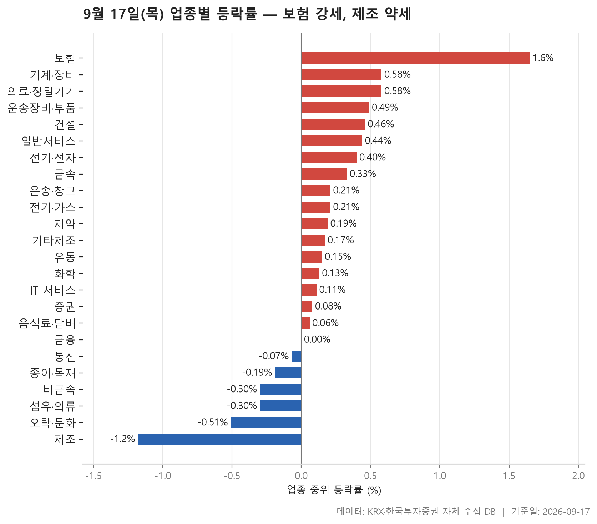
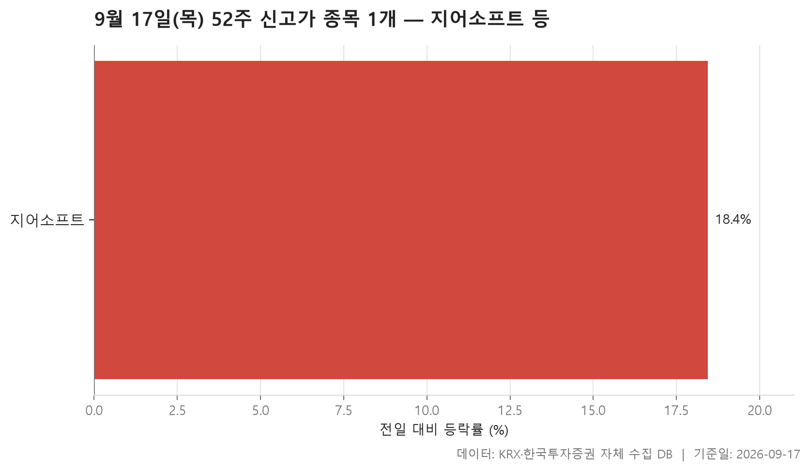
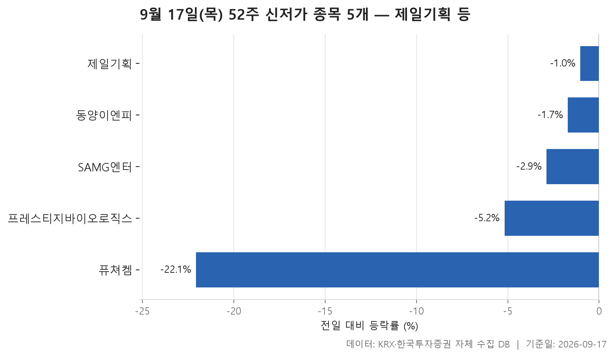
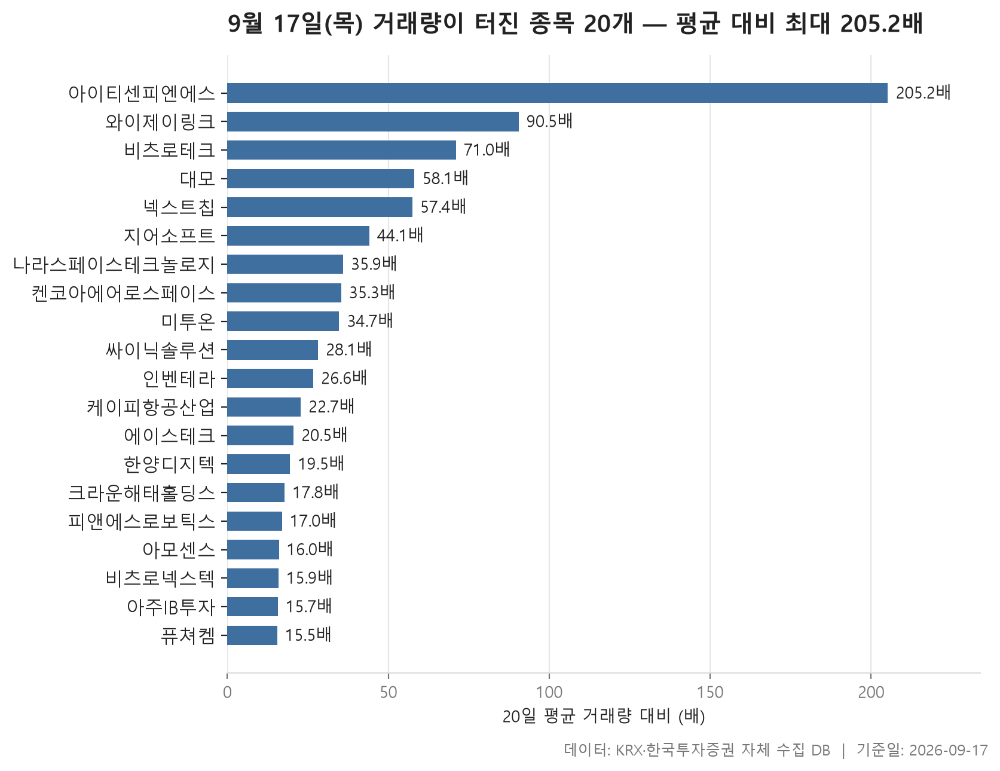

9월 17일 목요일 장을 마친 뒤 데이터베이스에서 네 갈래로 자료를 뽑았습니다. 업종별로 어디가 강하고 어디가 밀렸는지, 52주 고점을 넘어선 종목과 저점을 깨고 내려간 종목, 그리고 평소보다 거래량이 유독 많이 실린 종목입니다.

먼저 전체 모양을 말하자면, 이날은 오른 쪽이 우세했지만 그 폭이 크지는 않았습니다. 24개 업종의 중위 등락률을 한 줄로 늘어놓았을 때 가운데 놓인 값이 +0.16%였고, 24개 가운데 17개가 플러스, 6개가 마이너스였습니다. 지수 한두 개만 보면 조용한 날처럼 보이겠지만, 개별 종목 단위로 내려가면 상한가 근처까지 간 종목과 하한가 근처까지 밀린 종목이 같은 날 안에 섞여 있습니다.

그래서 이 글은 업종의 평균과 중위값이 어긋난 지점, 신고가·신저가 명단의 비대칭, 거래량이 터진 종목들의 쏠림을 차례로 짚습니다. 왜 그런 움직임이 나왔는지는 이 자료에 담겨 있지 않으니, 표가 말해 주는 범위까지만 설명하겠습니다.

> 기준일: 2026-09-17 · 집계: 자체 수집 데이터베이스

## 업종 등락률 — 24개 중 17개 상승

가장 강했던 업종은 보험으로, 업종 안 종목들의 중위 등락률이 +1.65%였습니다. 눈에 띄는 건 이 업종은 평균이 오히려 중위값보다 낮은 +1.50%라는 점입니다. 평균을 끌어올릴 만한 한 종목이 튀지 않았다는 뜻이고, 실제로 이 업종에서 등락 폭이 가장 컸던 종목도 +3.46%에 그쳤습니다. 오른 종목이 열 곳 중 여섯 곳을 넘었으니, 한두 종목이 만든 강세가 아니라 업종 전체가 고르게 올라간 모양입니다. 종목 수가 11개, 거래대금 합계가 1,940.30억원인 작은 묶음이라는 점도 함께 봐 둘 만합니다.

반대편은 제조였습니다. 중위 등락률 -1.18%, 평균 -2.04%인데 더 직관적인 숫자는 상승비율입니다. 이 업종에서 오른 종목이 하나도 없었습니다. 다만 종목 수가 7개, 거래대금 합계가 9.50억원이라 이 한 줄을 시장 전체의 제조업 상황으로 읽으면 곤란합니다. 등락 폭이 가장 컸던 종목 하나가 업종 평균을 -1.11%p 움직였다는 값은, 중위값과 평균의 격차 대부분이 그 종목에서 나왔음을 보여 줍니다.

표에서 정작 흥미로운 대목은 중간 순위권입니다. 기계·장비는 중위 +0.58%인데 평균은 +1.16%, 운송장비·부품은 중위 +0.49%에 평균 +1.48%, 전기·전자는 중위 +0.40%에 평균 +1.38%로 평균이 훨씬 위에 있습니다. 그런데 이 업종들에서 가장 크게 움직인 종목 하나가 평균에 보탠 몫은 각각 0.12%p, 0.22%p, 0.08%p뿐입니다. 격차가 이 값보다 크게 벌어져 있다는 것은 크게 오른 종목이 한 개가 아니라 여럿이었다는 신호로 읽힙니다. 특히 전기·전자는 종목 수가 364개, 거래대금 합계가 117,559.80억원으로 이 표에서 가장 두꺼운 업종인데, 그 안에서도 위로 튄 종목들이 평균을 밀어올렸습니다.

방향이 엇갈린 줄도 있습니다. 금융은 중위값이 0.00%이고 평균은 +0.41%인데 오른 종목은 열 곳 중 네 곳이 채 되지 않습니다. 오른 쪽의 폭이 컸다는 뜻이고, 여기서 가장 크게 움직인 종목은 +30.00%로 업종 평균에 0.27%p를 보탰습니다. 통신도 중위 -0.07%인데 평균은 +0.56%, 상승비율은 38.50%입니다. 오락·문화는 오른 종목이 셋 중 하나꼴이었는데 가장 크게 움직인 종목은 +15.86%로 위를 향했습니다 — 소수가 크게 오르고 다수가 조용히 밀린 전형적인 모양입니다. 증권은 중위값이 플러스(+0.08%)인데 평균이 -0.25%로 부호가 반대인 드문 경우입니다.

| 업종 | 종목수(개) | 중위등락률(%) | 평균등락률(%) | 상승비율(%) | 주도종목 | 주도종목등락률(%) | 평균기여도(%p) | 거래대금합계(억원) |
|---|---|---|---|---|---|---|---|---|
| 보험 | 11 | +1.65 | +1.50 | 63.60 | 미래에셋생명 | +3.46 | 0.31 | 1,940.30 |
| 기계·장비 | 204 | +0.58 | +1.16 | 61.80 | 씨케이솔루션 | +23.96 | 0.12 | 12,962.30 |
| 의료·정밀기기 | 100 | +0.58 | +1.27 | 62.00 | 에스오에스랩 | +23.86 | 0.24 | 1,326.90 |
| 운송장비·부품 | 134 | +0.49 | +1.48 | 66.40 | 나라스페이스테크놀로지 | +29.92 | 0.22 | 9,454.30 |
| 건설 | 51 | +0.46 | +0.37 | 62.70 | 일진파워 | +6.07 | 0.12 | 2,250.90 |
| 일반서비스 | 168 | +0.44 | +0.98 | 61.30 | 큐라티스 | +29.96 | 0.18 | 4,562.00 |
| 전기·전자 | 364 | +0.40 | +1.38 | 56.30 | 앤씨앤 | +29.89 | 0.08 | 117,559.80 |
| 금속 | 130 | +0.33 | +0.77 | 60.00 | SHD | -26.47 | -0.20 | 4,427.30 |
| 운송·창고 | 28 | +0.21 | +0.33 | 60.70 | 동양고속 | +4.26 | 0.15 | 1,084.90 |
| 전기·가스 | 10 | +0.21 | +0.46 | 50.00 | 지역난방공사 | +2.04 | 0.20 | 342.10 |
| 제약 | 165 | +0.19 | +0.23 | 57.60 | 퓨쳐켐 | -22.06 | -0.13 | 6,806.60 |
| 기타제조 | 14 | +0.17 | +0.16 | 64.30 | 브이씨 | +2.85 | 0.20 | 23.80 |
| 유통 | 153 | +0.15 | +0.28 | 51.00 | 케이피엠테크 | +10.83 | 0.07 | 3,348.50 |
| 화학 | 221 | +0.13 | +0.81 | 52.00 | 코스나인 | -33.33 | -0.15 | 9,295.70 |
| IT 서비스 | 244 | +0.11 | +0.62 | 51.20 | 크라우드웍스 | +19.66 | 0.08 | 10,389.00 |
| 증권 | 18 | +0.08 | -0.25 | 50.00 | 신영증권 | -1.82 | -0.10 | 869.90 |
| 음식료·담배 | 83 | +0.06 | +0.19 | 50.60 | 오에스피 | +8.89 | 0.11 | 1,256.20 |
| 금융 | 111 | 0.00 | +0.41 | 43.20 | 비츠로테크 | +30.00 | 0.27 | 15,098.90 |
| 통신 | 13 | -0.07 | +0.56 | 38.50 | 프리티 | +7.88 | 0.61 | 636.60 |
| 종이·목재 | 26 | -0.19 | -0.04 | 38.50 | 국일제지 | +4.03 | 0.15 | 28.50 |
| 비금속 | 36 | -0.30 | -0.33 | 41.70 | 강동씨앤엘 | -5.62 | -0.16 | 343.20 |
| 섬유·의류 | 47 | -0.30 | -0.76 | 42.60 | 원풍물산 | -23.21 | -0.49 | 122.40 |
| 오락·문화 | 66 | -0.51 | -0.54 | 33.30 | 아티스트스튜디오 | +15.86 | 0.24 | 752.50 |
| 제조 | 7 | -1.18 | -2.04 | 0.00 | 에넥스 | -7.78 | -1.11 | 9.50 |

## 52주 신고가 1개 — 지어소프트 18.45%

52주 최고가를 넘어선 종목은 딱 하나였습니다. 시가총액 500억원, 거래대금 3억원이라는 문턱을 두고 걸렀을 때 남은 것이 지어소프트 한 종목이고, KOSPI에서는 해당 종목이 없었습니다.

종가 11,750원으로 이전 52주 최고가 11,640원을 넘었는데, 전일 대비 +18.45%라는 폭이 눈에 걸립니다. 직전 고점과 종가 사이의 거리는 크지 않은데 하루 상승률은 컸다는 건, 며칠에 걸쳐 고점 근처를 다지다 뚫은 모양이 아니라 하루 만에 올라와 갱신했다는 이야기에 가깝습니다. 거래대금은 409.40억원, 시가총액은 1,818억원입니다.

업종 표와 겹쳐 보면 이 종목이 속한 IT 서비스는 중위 등락률이 +0.11%로 24개 업종 가운데 중간 아래였습니다. 업종 전체가 밀어올린 흐름 속의 신고가가 아니라, 업종 흐름과 따로 움직인 한 종목이라고 보는 편이 자료에 맞습니다. 하루 기준 신고가 명단이 한 종목뿐이라는 사실 자체가, 이날 지수의 플러스가 위로 크게 뻗은 종목들에서 나온 것이 아니라는 점을 말해 줍니다.

| 종목명 | 종목코드 | 시장 | 업종 | 종가(원) | 등락률(%) | 이전52주최고(원) | 거래대금(억원) | 시가총액(억원) |
|---|---|---|---|---|---|---|---|---|
| 지어소프트 | 051160 | KOSDAQ | IT 서비스 | 11,750 | +18.45 | 11,640 | 409.40 | 1,818 |

## 52주 신저가 5개 — 최저 퓨쳐켐 -22.06%

52주 최저가를 밑돈 종목은 5개로, 신고가 쪽보다 많았습니다. 시장별로는 KOSPI 1개, KOSDAQ 4개이고 업종은 4개로 나뉘는데 제약이 2개로 가장 많습니다. 신고가 한 종목 대 신저가 다섯 종목이라는 비대칭은, 업종 중위값이 대체로 플러스였던 이날의 인상과는 조금 다른 이야기를 합니다.

명단 안의 편차가 꽤 큽니다. 전일 대비로 가장 덜 빠진 종목은 제일기획으로 -1.03%, 가장 많이 빠진 종목은 퓨쳐켐으로 -22.06%였고, 다섯 종목의 가운데 값은 -2.88%입니다. 앞쪽 종목들은 하루 하락 폭이 1%대에 머물렀는데도 저점을 깼습니다. 종가 17,380원과 이전 52주 최저가 17,460원의 거리, 또는 16,700원과 16,900원의 거리를 보면 알 수 있듯이, 이미 바닥 근처에 붙어 있던 주가가 작은 하락으로 선을 넘은 경우입니다. 반대로 퓨쳐켐은 6,360원으로 이전 저점 6,410원을 하루 만에 큰 폭으로 지나쳐 내려갔습니다.

덩치도 한쪽으로 몰려 있지 않습니다. 시가총액이 가장 큰 제일기획이 19,994억원인데 나머지는 1,024억원부터 1,719억원 사이에 있습니다. 즉 이 명단은 소형주만의 이야기가 아니고, 규모가 있는 종목도 한 칸 섞여 있습니다. 다만 거래대금을 보면 3.50억원, 4.50억원처럼 문턱을 겨우 넘은 종목들이 포함돼 있어, 저점 갱신이 활발한 거래 속에서 일어난 것인지는 종목별로 다릅니다.

| 종목명 | 종목코드 | 시장 | 업종 | 종가(원) | 등락률(%) | 이전52주최저(원) | 거래대금(억원) | 시가총액(억원) |
|---|---|---|---|---|---|---|---|---|
| 제일기획 | 030000 | KOSPI | 일반서비스 | 17,380 | -1.03 | 17,460 | 101.50 | 19,994 |
| SAMG엔터 | 419530 | KOSDAQ | 오락·문화 | 16,840 | -2.88 | 17,010 | 13.40 | 1,719 |
| 퓨쳐켐 | 220100 | KOSDAQ | 제약 | 6,360 | -22.06 | 6,410 | 55.00 | 1,426 |
| 동양이엔피 | 079960 | KOSDAQ | 전기·전자 | 16,700 | -1.71 | 16,900 | 4.50 | 1,261 |
| 프레스티지바이오로직스 | 334970 | KOSDAQ | 제약 | 1,317 | -5.18 | 1,320 | 3.50 | 1,024 |

## 거래량 급증 20개 — 최고 아이티센피엔에스 205.20배

마지막은 거래량입니다. 직전 20거래일 평균의 5배를 넘긴 종목 중 상위 20개를 뽑았는데, 배수의 분포가 위쪽으로 길게 늘어져 있습니다. 가장 높은 아이티센피엔에스가 205.20배이고, 그다음이 90.50배, 71.00배로 뚝 떨어집니다. 20개의 가운데 값은 27.35배입니다. 상위 한두 종목이 평균 대비 배수에서 확연히 떨어져 나와 있다는 뜻이죠.

그런데 배수가 크다는 것과 주가가 올랐다는 것은 별개입니다. 배수 1위인 아이티센피엔에스는 -1.01%로 오히려 소폭 하락이었습니다. 20개 명단 안에는 -9.18%, -8.17%, -22.06% 같은 하락 종목도 섞여 있습니다. 거래량이 터진 방향이 한쪽이 아니었다는 점은 이 표에서 꼭 짚어야 할 대목입니다. 물론 +30.00%, +29.92%, +26.33%처럼 크게 오른 종목이 더 많기는 합니다.

거래대금 규모도 배수와는 따로 움직입니다. 미투온은 배수가 34.70배로 중간권이지만 거래대금 3,195.40억원으로 명단에서 가장 큽니다. 아주IB투자는 배수가 15.70배로 하위권인데 거래대금은 1,012.60억원이고 시가총액 4,682억원으로 이 표에서 가장 큰 종목입니다. 반대로 배수 28.10배인 싸이닉솔루션의 거래대금은 35.40억원, 22.70배인 케이피항공산업은 31.40억원입니다. 평소 거래가 거의 없던 종목은 작은 금액으로도 배수가 크게 나온다는 사실을 함께 염두에 둬야 합니다.

시장과 업종 구성은 한쪽으로 쏠려 있습니다. KOSPI 1개, KOSDAQ 19개이고, 업종은 8개로 나뉘는데 전기·전자가 5개로 가장 많습니다. 여기에 운송장비·부품, 기계·장비, IT 서비스가 여러 칸을 차지하고 있어, 앞선 업종 표에서 중위값 대비 평균이 크게 벌어졌던 업종들과 상당 부분 겹칩니다. 또 퓨쳐켐은 저점을 깬 명단과 거래량이 터진 명단에 동시에 올라 있고, 지어소프트는 신고가 명단과 이 명단에 함께 있습니다. 같은 종목이 서로 다른 표에 잡히는 건 그 종목의 하루가 여러 기준에서 평범하지 않았다는 신호입니다.

| 종목명 | 종목코드 | 시장 | 업종 | 종가(원) | 등락률(%) | 거래량(주) | 평균거래량(주) | 배수(배) | 거래대금(억원) | 시가총액(억원) |
|---|---|---|---|---|---|---|---|---|---|---|
| 아이티센피엔에스 | 232830 | KOSDAQ | IT 서비스 | 3,445 | -1.01 | 12,295,856 | 59,929 | 205.20 | 436.10 | 570 |
| 와이제이링크 | 209640 | KOSDAQ | 기계·장비 | 3,780 | +23.53 | 6,510,203 | 71,901 | 90.50 | 245.20 | 1,075 |
| 비츠로테크 | 042370 | KOSDAQ | 금융 | 11,440 | +30.00 | 8,916,157 | 125,592 | 71.00 | 955.30 | 2,997 |
| 대모 | 317850 | KOSDAQ | 기계·장비 | 6,310 | +6.77 | 3,973,782 | 68,384 | 58.10 | 271.30 | 525 |
| 넥스트칩 | 396270 | KOSDAQ | 전기·전자 | 2,410 | +13.15 | 6,094,155 | 106,175 | 57.40 | 153.50 | 793 |
| 지어소프트 | 051160 | KOSDAQ | IT 서비스 | 11,750 | +18.45 | 3,428,202 | 77,695 | 44.10 | 409.40 | 1,818 |
| 나라스페이스테크놀로지 | 478340 | KOSDAQ | 운송장비·부품 | 13,850 | +29.92 | 1,383,745 | 38,524 | 35.90 | 188.60 | 1,602 |
| 켄코아에어로스페이스 | 274090 | KOSDAQ | 운송장비·부품 | 11,440 | +12.38 | 2,511,243 | 71,075 | 35.30 | 300.10 | 1,576 |
| 미투온 | 201490 | KOSDAQ | IT 서비스 | 4,595 | +19.66 | 71,832,621 | 2,070,529 | 34.70 | 3,195.40 | 1,504 |
| 싸이닉솔루션 | 234030 | KOSDAQ | 전기·전자 | 3,460 | +19.93 | 1,032,785 | 36,690 | 28.10 | 35.40 | 817 |
| 인벤테라 | 0007J0 | KOSDAQ | 일반서비스 | 10,850 | +3.33 | 1,755,462 | 66,072 | 26.60 | 205.70 | 853 |
| 케이피항공산업 | 288180 | KOSDAQ | 운송장비·부품 | 8,170 | +14.11 | 373,115 | 16,444 | 22.70 | 31.40 | 604 |
| 에이스테크 | 088800 | KOSDAQ | 전기·전자 | 2,225 | -9.18 | 3,151,068 | 153,615 | 20.50 | 76.50 | 1,680 |
| 한양디지텍 | 078350 | KOSDAQ | 전기·전자 | 22,500 | +26.33 | 2,033,412 | 104,233 | 19.50 | 431.00 | 3,430 |
| 크라운해태홀딩스 | 005740 | KOSPI | 금융 | 5,170 | -8.17 | 263,673 | 14,838 | 17.80 | 13.70 | 768 |
| 피앤에스로보틱스 | 460940 | KOSDAQ | 의료·정밀기기 | 5,240 | +6.94 | 711,662 | 41,906 | 17.00 | 39.60 | 705 |
| 아모센스 | 357580 | KOSDAQ | 전기·전자 | 6,870 | +7.85 | 2,133,450 | 133,212 | 16.00 | 147.80 | 810 |
| 비츠로넥스텍 | 488900 | KOSDAQ | 운송장비·부품 | 11,960 | +12.83 | 860,025 | 54,236 | 15.90 | 101.00 | 3,466 |
| 아주IB투자 | 027360 | KOSDAQ | 금융 | 3,865 | +10.43 | 26,343,463 | 1,680,184 | 15.70 | 1,012.60 | 4,682 |
| 퓨쳐켐 | 220100 | KOSDAQ | 제약 | 6,360 | -22.06 | 812,206 | 52,410 | 15.50 | 55.00 | 1,426 |

## 정리

정리하면 9월 17일은 업종 대부분이 소폭 플러스였지만 그 안에서는 위로 크게 튄 종목과 저점을 깬 종목이 동시에 나온 날이었습니다. 보험처럼 종목들이 고르게 오른 업종이 맨 위에 올라왔고, 평균이 중위값보다 한참 높은 업종들은 상승분이 일부 종목에 몰려 있었습니다. 신고가는 한 종목, 신저가는 다섯 종목이었다는 점도 같이 기억해 둘 만합니다.\n\n다만 이 글에 쓴 모든 숫자는 하루치 종가 기준이고, 왜 그렇게 움직였는지에 대한 정보는 자료에 들어 있지 않습니다. 업종별 집계는 보통주 5종목 이상이라는 조건으로 걸렀으니 종목 수가 적은 업종의 중위값은 한두 종목에 쉽게 흔들립니다. 신고가·신저가와 거래량 표도 시가총액 500억원, 거래대금 3억원이라는 문턱을 통과한 종목만 담고 있어, 그 밑에 있는 종목들은 애초에 보이지 않습니다. 표를 읽을 때 이 범위를 함께 놓고 보시길 권합니다.

## 집계 기준

**업종 등락률**

- **기준**: 2026-09-16 종가 → 2026-09-17 종가
- **순위**: 업종 내 종목 등락률의 중위값 (평균은 참고용으로 함께 표시)
- **주도종목**: 그 업종에서 등락률 절대값이 가장 큰 종목 (동점이면 거래대금이 큰 쪽)
- **평균기여도**: 그 종목 하나가 업종 평균을 움직인 폭 (등락률 ÷ 종목수). 중위값과 평균의 격차가 이 값에 가까우면 평균을 만든 것이 그 종목이고, 훨씬 크면 다른 종목들도 함께 움직인 것입니다
- **필터**: 업종 내 보통주 5종목 이상
- **전체업종중위등락률(%)**: 0.16

**52주 신고가**

- **기준**: 종가 > 직전 52주 최고가
- **관측구간**: 2025-09-04 ~ 2026-09-16 (252거래일)
- **필터**: 시가총액 500억 이상, 거래대금 3억 이상, 보통주

**52주 신저가**

- **기준**: 종가 < 직전 52주 최저가
- **관측구간**: 2025-09-04 ~ 2026-09-16 (252거래일)
- **필터**: 시가총액 500억 이상, 거래대금 3억 이상, 보통주

**거래량 급증**

- **기준**: 당일 거래량 ≥ 직전 20거래일 평균 × 5
- **관측구간**: 2026-08-20 ~ 2026-09-16 (20거래일)
- **필터**: 시가총액 500억 이상, 거래대금 3억 이상, 보통주

## 데이터 출처 및 유의사항

- **데이터출처**: 한국거래소(KRX) 공시 데이터와 한국투자증권 OpenAPI 를 직접 수집해 구축한 자체 데이터베이스
- **집계방식**: 수집·집계·차트 생성을 직접 구현한 파이프라인에서 자동 산출
- **작성고지**: 본문의 표·통계·차트는 자체 데이터베이스에서 계산된 값이며, 문장 작성 과정에 AI 도구를 활용했습니다.
- **면책**: 본 글은 정보 제공을 목적으로 하며 특정 종목의 매수·매도를 추천하지 않습니다. 제시된 수치는 과거 데이터이고 미래 수익을 보장하지 않습니다. 투자 판단과 그 결과에 대한 책임은 투자자 본인에게 있습니다.

