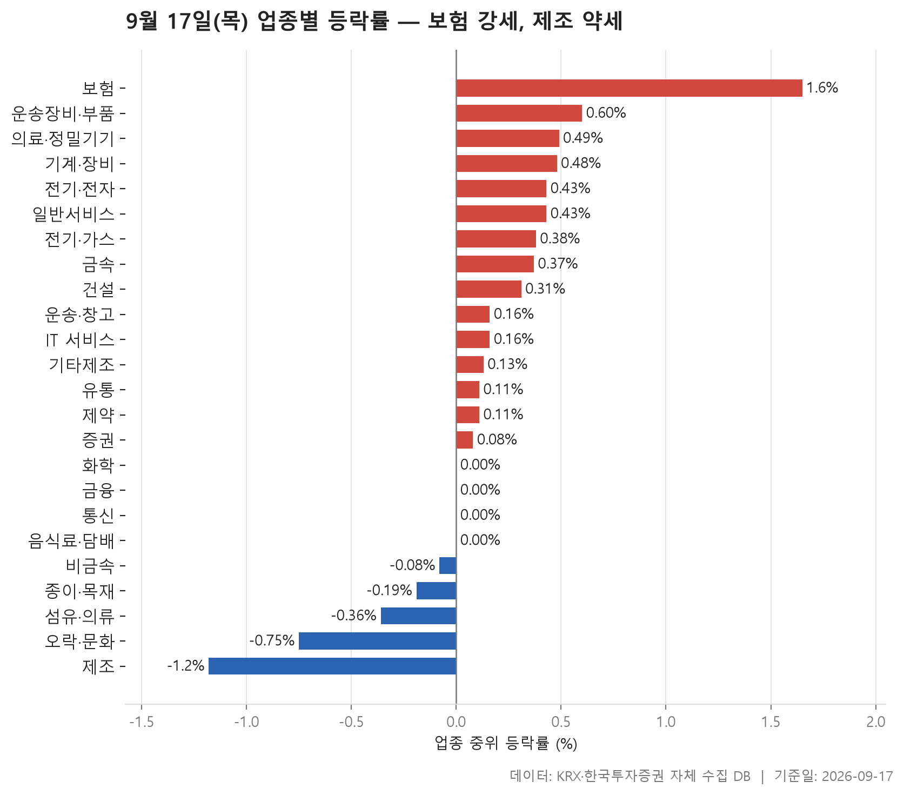
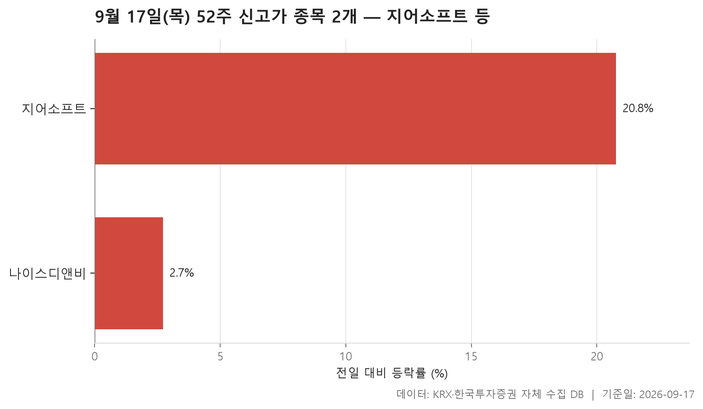
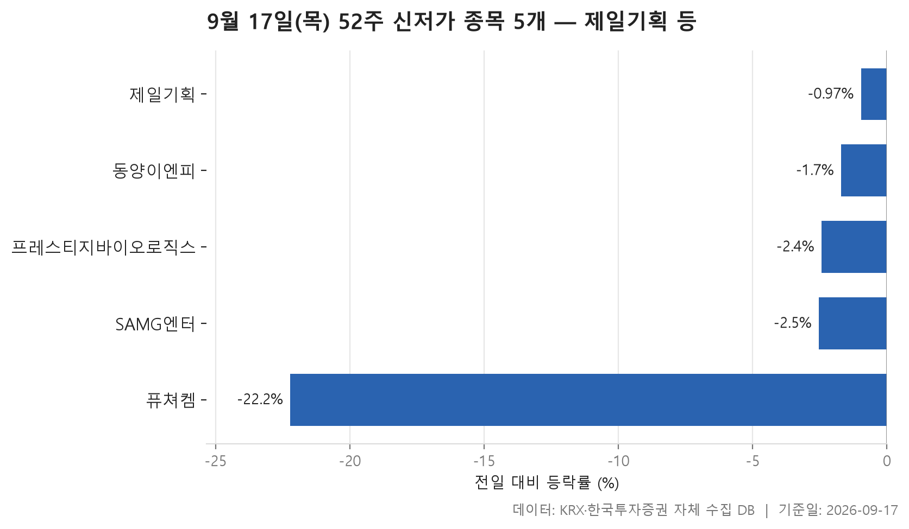
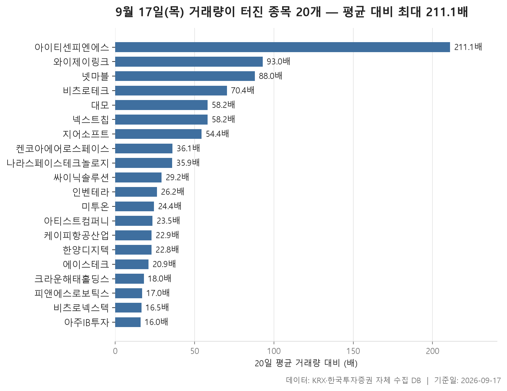

9월 17일 시장은 업종 단위로 보면 조용히 오른 날에 가깝습니다. 24개 업종마다 종목 등락률의 한가운데 값을 구해 늘어놓으면, 그 가운데 놓인 값이 +0.12%입니다. 위쪽으로 기운 업종이 15개, 아래쪽이 5개였고, 나머지는 한가운데 종목이 보합에 머물렀습니다. 움직임은 크지 않았지만 방향은 분명히 위였습니다.

맨 위는 보험(+1.65%), 맨 아래는 제조(-1.18%)입니다. 다만 오늘 표에서 더 흥미로운 건 양 끝보다 중간입니다. 한가운데 값은 소폭인데 평균은 훨씬 높게 나온 업종이 여럿 있고, 52주 신고가보다 신저가가 더 많이 나왔으며, 거래량이 평소의 수십 배로 불어난 종목들은 코스닥에 몰려 있습니다.

아래에서 업종 흐름, 52주 신고가와 신저가, 거래량 급증 종목을 차례로 봅니다. 각 표에서 숫자끼리 어긋나는 대목을 중심으로 짚어 보겠습니다.

> 기준일: 2026-09-17 · 집계: 자체 수집 데이터베이스

## 업종 등락률 — 24개 중 15개 상승

보험은 11개 종목 가운데 오른 곳이 63.60%로, 열 곳 중 여섯 곳 남짓이 올랐습니다. 한가운데 값 +1.65%와 평균 +1.48%가 거의 붙어 있다는 점이 눈여겨볼 만합니다. 가장 크게 움직인 미래에셋생명도 +3.46%에 그쳤으니, 한 종목이 끌어올린 강세가 아니라 업종 전체가 고르게 오른 모양입니다.

반대로 운송장비·부품과 전기·전자는 한가운데 값보다 평균이 훨씬 높습니다. 운송장비·부품은 한가운데 값이 +0.60%인데 평균은 +1.52%입니다. 나라스페이스테크놀로지가 +29.92% 올랐지만 이 종목 하나가 업종 평균을 끌어올린 폭은 0.22%p에 그쳐, 두 값의 차이를 혼자 설명하지 못합니다. 크게 뛴 종목이 여럿 함께 있었다는 뜻이죠. 전기·전자도 한가운데 값 +0.43%, 평균 +1.24%로 같은 모양인데, 앤씨앤 한 종목의 몫은 0.08%p뿐입니다. 이 업종의 거래대금은 126,552.00억원으로 다른 업종과 자릿수가 다를 만큼 컸습니다.

어긋남이 더 뚜렷한 곳은 화학입니다. 한가운데 종목은 보합(0.00%)이고 가장 크게 움직인 코스나인은 -33.33% 급락했는데, 평균은 +0.75%로 플러스입니다. 가장 큰 폭의 하락을 다른 종목들의 상승이 덮고도 남았다는 얘기입니다. 증권은 거꾸로 한가운데 값이 +0.08%인데 평균은 -0.28%로, 두 값의 방향이 엇갈렸습니다.

아래쪽을 보면 제조는 7개 종목 가운데 오른 곳이 하나도 없었습니다. 평균은 -2.47%이고, 에넥스(-7.78%) 하나가 평균을 1.11%p 끌어내린 몫이 커서 종목 수가 적은 업종이라는 점을 감안하고 읽어야 합니다. 오락·문화는 오른 종목이 28.80%로 열 곳 중 세 곳이 채 안 됐는데, 이 업종에서 가장 크게 움직인 건 +15.63% 오른 아티스트컴퍼니였습니다. 업종 전반의 약세와 개별 종목의 급등이 한 칸에 같이 들어 있는 셈입니다.

| 업종 | 종목수(개) | 중위등락률(%) | 평균등락률(%) | 상승비율(%) | 주도종목 | 주도종목등락률(%) | 평균기여도(%p) | 거래대금합계(억원) |
|---|---|---|---|---|---|---|---|---|
| 보험 | 11 | +1.65 | +1.48 | 63.60 | 미래에셋생명 | +3.46 | 0.31 | 1,998.10 |
| 운송장비·부품 | 134 | +0.60 | +1.52 | 67.20 | 나라스페이스테크놀로지 | +29.92 | 0.22 | 10,079.80 |
| 의료·정밀기기 | 100 | +0.49 | +0.84 | 58.00 | 한컴라이프케어 | +10.61 | 0.11 | 1,404.60 |
| 기계·장비 | 204 | +0.48 | +1.14 | 59.80 | 와이제이링크 | +23.62 | 0.12 | 14,549.20 |
| 전기·전자 | 364 | +0.43 | +1.24 | 56.30 | 앤씨앤 | +29.89 | 0.08 | 126,552.00 |
| 일반서비스 | 168 | +0.43 | +0.92 | 60.70 | 큐라티스 | +29.96 | 0.18 | 4,936.30 |
| 전기·가스 | 10 | +0.38 | +0.49 | 60.00 | 지역난방공사 | +2.04 | 0.20 | 356.90 |
| 금속 | 130 | +0.37 | +0.83 | 61.50 | SHD | -26.47 | -0.20 | 4,616.30 |
| 건설 | 51 | +0.31 | +0.31 | 58.80 | 일진파워 | +6.07 | 0.12 | 2,397.30 |
| 운송·창고 | 28 | +0.16 | +0.33 | 60.70 | 동양고속 | +4.26 | 0.15 | 1,119.00 |
| IT 서비스 | 244 | +0.16 | +0.69 | 53.30 | 지어소프트 | +20.77 | 0.09 | 14,973.50 |
| 기타제조 | 14 | +0.13 | +0.17 | 57.10 | 브이씨 | +4.18 | 0.30 | 25.00 |
| 유통 | 153 | +0.11 | +0.25 | 51.00 | 케이피엠테크 | +10.83 | 0.07 | 3,545.70 |
| 제약 | 165 | +0.11 | +0.19 | 53.30 | 퓨쳐켐 | -22.22 | -0.13 | 7,034.00 |
| 증권 | 18 | +0.08 | -0.28 | 50.00 | 신영증권 | -1.82 | -0.10 | 899.30 |
| 화학 | 221 | 0.00 | +0.75 | 49.80 | 코스나인 | -33.33 | -0.15 | 9,678.50 |
| 금융 | 111 | 0.00 | +0.38 | 43.20 | 비츠로테크 | +30.00 | 0.27 | 15,791.40 |
| 통신 | 13 | 0.00 | +0.28 | 46.20 | 프리티 | +7.88 | 0.61 | 667.40 |
| 음식료·담배 | 83 | 0.00 | +0.13 | 49.40 | 오에스피 | +8.89 | 0.11 | 1,280.40 |
| 비금속 | 36 | -0.08 | -0.18 | 47.20 | 아이에스동서 | -3.50 | -0.10 | 360.70 |
| 종이·목재 | 26 | -0.19 | -0.09 | 38.50 | 국일제지 | +2.73 | 0.10 | 30.10 |
| 섬유·의류 | 47 | -0.36 | -0.88 | 38.30 | 원풍물산 | -23.21 | -0.49 | 151.50 |
| 오락·문화 | 66 | -0.75 | -0.66 | 28.80 | 아티스트컴퍼니 | +15.63 | 0.24 | 834.40 |
| 제조 | 7 | -1.18 | -2.47 | 0.00 | 에넥스 | -7.78 | -1.11 | 9.60 |

## 52주 신고가 2개 — 최고 지어소프트 20.77%

52주 신고가를 새로 쓴 종목은 2개뿐이고 둘 다 코스닥입니다. 업종 대부분이 올랐는데도 52주 고점을 넘어선 종목이 이렇게 적다는 건, 상승이 넓게 퍼졌지만 폭은 크지 않았다는 앞의 그림과 맞아떨어집니다.

지어소프트는 +20.77% 올라 11,980원에 마감하며 직전 52주 최고가 11,640원을 넘었습니다. 거래대금이 507.10억원으로 컸고, 뒤의 거래량 급증 표에도 다시 등장합니다. IT 서비스 업종에서 가장 크게 움직인 종목도 바로 이 종목이었습니다.

나이스디앤비는 성격이 다릅니다. +2.72%의 비교적 작은 상승으로 6,800원에 닫으며 이전 고점 6,640원을 넘었는데, 거래대금은 3.10억원으로 집계 하한인 3억을 간신히 넘긴 수준입니다. 거래가 한산한 가운데 조용히 고점을 넘어선 경우로 읽는 편이 맞겠습니다.

| 종목명 | 종목코드 | 시장 | 업종 | 종가(원) | 등락률(%) | 이전52주최고(원) | 거래대금(억원) | 시가총액(억원) |
|---|---|---|---|---|---|---|---|---|
| 지어소프트 | 051160 | KOSDAQ | IT 서비스 | 11,980 | +20.77 | 11,640 | 507.10 | 1,853.80 |
| 나이스디앤비 | 130580 | KOSDAQ | 일반서비스 | 6,800 | +2.72 | 6,640 | 3.10 | 1,047.20 |

## 52주 신저가 5개 — 최저 퓨쳐켐 -22.22%

52주 신저가는 5개로 신고가보다 많습니다. 코스닥이 4개, 코스피가 1개이고, 업종으로는 제약이 2개로 가장 많습니다.

시가총액이 가장 큰 제일기획(19,994.20억원)은 하루 -0.97% 내렸을 뿐인데 신저가가 됐습니다. 종가 17,380원이 직전 최저 17,460원을 살짝 밑돈 것입니다. 하루의 급락이라기보다 그동안 조금씩 밀려 내려온 흐름이 선을 건드린 모양입니다. 프레스티지바이오로직스도 1,317원으로 이전 최저 1,320원을 겨우 밑돌았습니다.

반면 퓨쳐켐은 -22.22%의 급락으로 한 번에 신저가로 내려앉았습니다. 이 종목은 제약 업종에서 가장 크게 움직인 종목이기도 한데, 제약 업종 전체는 한가운데 값이 +0.11%로 소폭 플러스였습니다. 업종 흐름과 따로 움직인 개별 종목이라는 점이 분명합니다. 다섯 종목 등락률의 한가운데 값은 -2.44%여서, 퓨쳐켐을 빼면 대체로 작은 하락이 저점을 건드린 사례들입니다. SAMG엔터(-2.54%)가 오늘 가장 약했던 업종 가운데 하나인 오락·문화 소속이라는 점도 함께 볼 만합니다.

| 종목명 | 종목코드 | 시장 | 업종 | 종가(원) | 등락률(%) | 이전52주최저(원) | 거래대금(억원) | 시가총액(억원) |
|---|---|---|---|---|---|---|---|---|
| 제일기획 | 030000 | KOSPI | 일반서비스 | 17,380 | -0.97 | 17,460 | 102.90 | 19,994.20 |
| SAMG엔터 | 419530 | KOSDAQ | 오락·문화 | 16,900 | -2.54 | 17,010 | 13.70 | 1,725.00 |
| 퓨쳐켐 | 220100 | KOSDAQ | 제약 | 6,300 | -22.22 | 6,410 | 56.00 | 1,412.90 |
| 동양이엔피 | 079960 | KOSDAQ | 전기·전자 | 16,700 | -1.71 | 16,900 | 4.90 | 1,261.10 |
| 프레스티지바이오로직스 | 334970 | KOSDAQ | 제약 | 1,317 | -2.44 | 1,320 | 3.50 | 1,024.00 |

## 거래량 급증 20개 — 최고 아이티센피엔에스 211.10배

거래량이 직전 20거래일 평균의 5배를 넘은 종목은 20개이고, 이 가운데 18개가 코스닥입니다. 평소 대비 배수의 한가운데 값이 27.70배이니, 기준선인 5배를 훌쩍 넘긴 종목이 대부분입니다.

가장 극단적인 건 아이티센피엔에스입니다. 평소의 211.10배에 이르는 거래가 터졌는데 주가는 +0.14%로 거의 움직이지 않았습니다. 넷마블도 88.00배의 거래에 등락률은 0.00%였습니다. 이 표에서 시가총액이 가장 크고(28,398.60억원) 거래대금도 3,769.20억원으로 가장 컸지만 가격은 제자리였습니다. 거래가 폭증했다고 가격이 반드시 한 방향으로 움직이지는 않는다는 것을 두 종목이 보여 줍니다.

나머지는 대체로 크게 올랐습니다. 비츠로테크(+30.00%), 나라스페이스테크놀로지(+29.92%), 한양디지텍(+25.49%)처럼 20%를 넘는 상승이 여럿이고, 켄코아에어로스페이스·케이피항공산업·비츠로넥스텍 등 운송장비·부품 종목이 줄지어 있는 것도 눈에 띕니다. 앞의 업종 표에서 한가운데 값과 평균이 크게 벌어졌던 업종과 겹치는 대목입니다. 거꾸로 에이스테크(-9.18%)와 크라운해태홀딩스(-8.17%)는 거래가 불어나면서 내렸습니다.

배수만으로 거래 규모를 가늠하면 안 된다는 점도 드러납니다. 미투온은 배수가 24.40배로 중간쯤이지만 거래대금은 3,385.10억원이고, 배수가 가장 낮은 아주IB투자(16배)도 거래대금이 1,045.30억원에 이릅니다. 두 종목 모두 평소 거래량이 이미 많았기 때문에 배수가 상대적으로 작게 나왔습니다.

| 종목명 | 종목코드 | 시장 | 업종 | 종가(원) | 등락률(%) | 거래량(주) | 평균거래량(주) | 배수(배) | 거래대금(억원) | 시가총액(억원) |
|---|---|---|---|---|---|---|---|---|---|---|
| 아이티센피엔에스 | 232830 | KOSDAQ | IT 서비스 | 3,485 | +0.14 | 12,766,429 | 60,480 | 211.10 | 451.80 | 576.20 |
| 와이제이링크 | 209640 | KOSDAQ | 기계·장비 | 3,820 | +23.62 | 6,741,063 | 72,464 | 93.00 | 253.90 | 1,086.50 |
| 넷마블 | 251270 | KOSPI | IT 서비스 | 34,150 | 0.00 | 11,237,286 | 127,696 | 88.00 | 3,769.20 | 28,398.60 |
| 비츠로테크 | 042370 | KOSDAQ | 금융 | 11,440 | +30.00 | 8,927,607 | 126,861 | 70.40 | 956.60 | 2,997.30 |
| 대모 | 317850 | KOSDAQ | 기계·장비 | 6,300 | +6.60 | 4,008,235 | 68,908 | 58.20 | 273.50 | 524.40 |
| 넥스트칩 | 396270 | KOSDAQ | 전기·전자 | 2,405 | +12.91 | 6,238,874 | 107,110 | 58.20 | 157.00 | 790.90 |
| 지어소프트 | 051160 | KOSDAQ | IT 서비스 | 11,980 | +20.77 | 4,229,915 | 77,791 | 54.40 | 507.10 | 1,853.80 |
| 켄코아에어로스페이스 | 274090 | KOSDAQ | 운송장비·부품 | 11,530 | +13.26 | 2,578,948 | 71,439 | 36.10 | 307.90 | 1,588.20 |
| 나라스페이스테크놀로지 | 478340 | KOSDAQ | 운송장비·부품 | 13,850 | +29.92 | 1,387,435 | 38,663 | 35.90 | 189.10 | 1,602.50 |
| 싸이닉솔루션 | 234030 | KOSDAQ | 전기·전자 | 3,460 | +19.93 | 1,084,296 | 37,132 | 29.20 | 37.20 | 816.70 |
| 인벤테라 | 0007J0 | KOSDAQ | 일반서비스 | 10,850 | +3.33 | 1,801,195 | 68,696 | 26.20 | 210.60 | 853.40 |
| 미투온 | 201490 | KOSDAQ | IT 서비스 | 4,635 | +20.70 | 75,950,952 | 3,114,759 | 24.40 | 3,385.10 | 1,516.70 |
| 아티스트컴퍼니 | 321820 | KOSDAQ | 오락·문화 | 3,920 | +15.63 | 2,678,816 | 113,994 | 23.50 | 88.30 | 611.20 |
| 케이피항공산업 | 288180 | KOSDAQ | 운송장비·부품 | 8,170 | +14.11 | 378,365 | 16,511 | 22.90 | 31.80 | 604.00 |
| 한양디지텍 | 078350 | KOSDAQ | 전기·전자 | 22,350 | +25.49 | 2,398,704 | 105,153 | 22.80 | 514.70 | 3,407.10 |
| 에이스테크 | 088800 | KOSDAQ | 전기·전자 | 2,225 | -9.18 | 3,247,552 | 155,356 | 20.90 | 78.60 | 1,680.00 |
| 크라운해태홀딩스 | 005740 | KOSPI | 금융 | 5,170 | -8.17 | 269,126 | 14,923 | 18.00 | 14.00 | 767.60 |
| 피앤에스로보틱스 | 460940 | KOSDAQ | 의료·정밀기기 | 5,240 | +6.94 | 718,787 | 42,173 | 17.00 | 40.00 | 705.10 |
| 비츠로넥스텍 | 488900 | KOSDAQ | 운송장비·부품 | 12,130 | +13.68 | 918,076 | 55,653 | 16.50 | 108.00 | 3,514.80 |
| 아주IB투자 | 027360 | KOSDAQ | 금융 | 3,855 | +10.14 | 27,191,260 | 1,695,989 | 16.00 | 1,045.30 | 4,670.20 |

## 정리

정리하면 9월 17일은 업종 대부분이 소폭 오른 가운데, 코스닥 일부 종목의 급등이 여러 업종의 평균을 한가운데 값보다 크게 끌어올린 날이었습니다. 신고가는 둘, 신저가는 다섯으로, 넓게 퍼진 상승이 52주 고점을 넘을 만큼 강하지는 않았습니다.

이 글은 하루치 종가만 비교한 것이고, 각 종목이 왜 움직였는지는 자료에 담겨 있지 않습니다. 보험이나 제조처럼 종목 수가 적은 업종은 한두 종목에 순위가 크게 흔들릴 수 있다는 점도 감안해 읽어 주시기 바랍니다.

## 집계 기준

**업종 등락률**

- **기준**: 2026-09-16 종가 → 2026-09-17 종가
- **순위**: 업종 내 종목 등락률의 중위값 (평균은 참고용으로 함께 표시)
- **주도종목**: 그 업종에서 등락률 절대값이 가장 큰 종목 (동점이면 거래대금이 큰 쪽)
- **평균기여도**: 그 종목 하나가 업종 평균을 움직인 폭 (등락률 ÷ 종목수). 중위값과 평균의 격차가 이 값에 가까우면 평균을 만든 것이 그 종목이고, 훨씬 크면 다른 종목들도 함께 움직인 것입니다
- **필터**: 업종 내 보통주 5종목 이상
- **전체업종중위등락률(%)**: 0.12

**52주 신고가**

- **기준**: 종가 > 직전 52주 최고가
- **관측구간**: 2025-09-04 ~ 2026-09-16 (252거래일)
- **필터**: 시가총액 500억 이상, 거래대금 3억 이상, 보통주

**52주 신저가**

- **기준**: 종가 < 직전 52주 최저가
- **관측구간**: 2025-09-04 ~ 2026-09-16 (252거래일)
- **필터**: 시가총액 500억 이상, 거래대금 3억 이상, 보통주

**거래량 급증**

- **기준**: 당일 거래량 ≥ 직전 20거래일 평균 × 5
- **관측구간**: 2026-08-20 ~ 2026-09-16 (20거래일)
- **필터**: 시가총액 500억 이상, 거래대금 3억 이상, 보통주

## 데이터 출처 및 유의사항

- **데이터출처**: 한국거래소(KRX) 공시 데이터와 한국투자증권 OpenAPI 를 직접 수집해 구축한 자체 데이터베이스
- **집계방식**: 수집·집계·차트 생성을 직접 구현한 파이프라인에서 자동 산출
- **작성고지**: 본문의 표·통계·차트는 자체 데이터베이스에서 계산된 값이며, 문장 작성 과정에 AI 도구를 활용했습니다.
- **면책**: 본 글은 정보 제공을 목적으로 하며 특정 종목의 매수·매도를 추천하지 않습니다. 제시된 수치는 과거 데이터이고 미래 수익을 보장하지 않습니다. 투자 판단과 그 결과에 대한 책임은 투자자 본인에게 있습니다.

