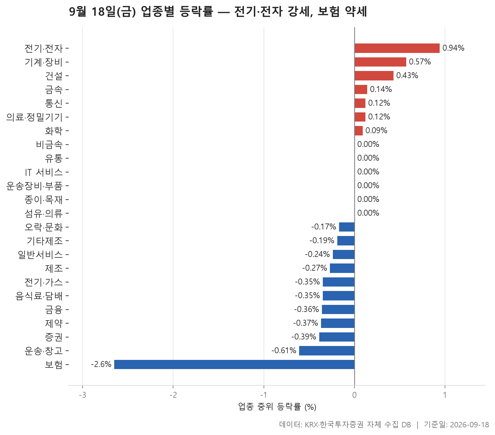
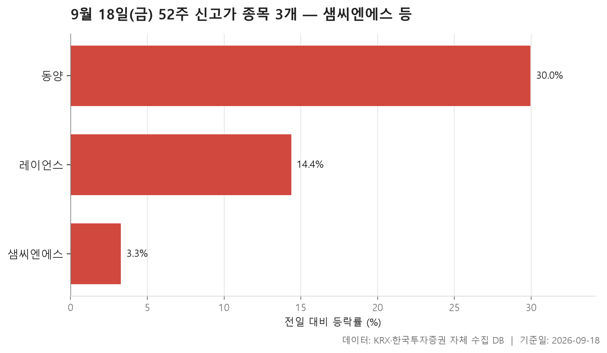
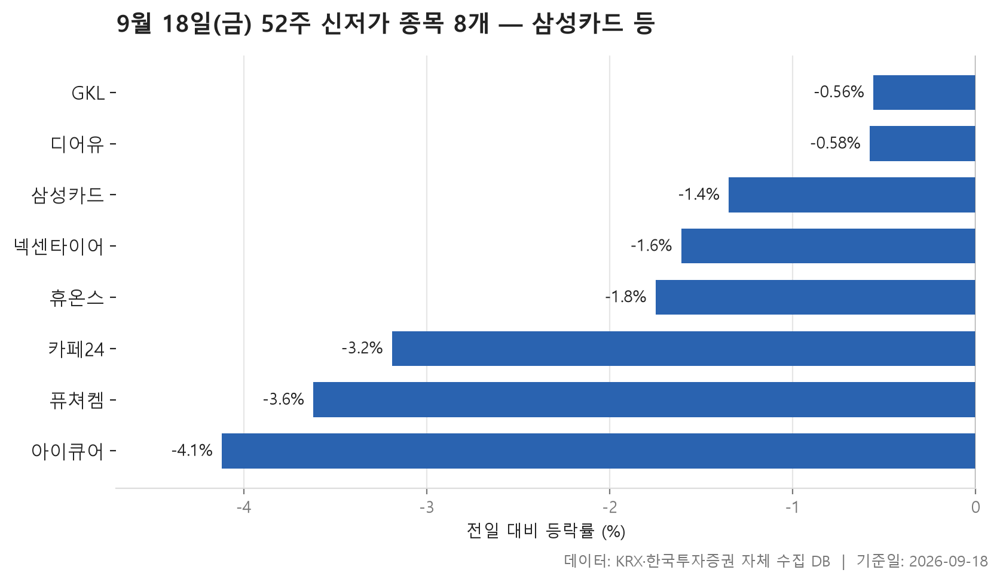
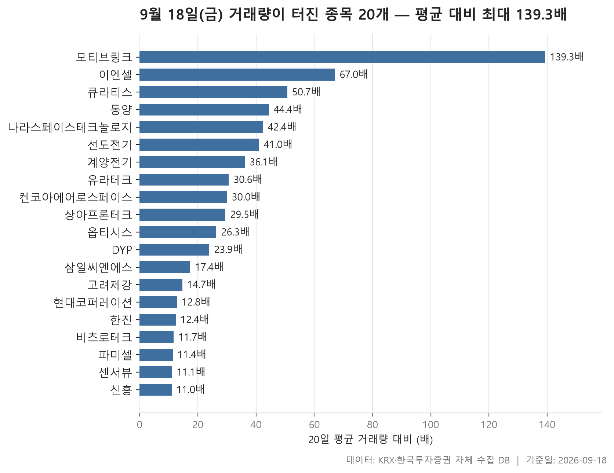

9월 18일 금요일 장이 끝났습니다. 24개 업종의 중위 등락률을 한 줄로 늘어놓고 그 한가운데 값을 보면 0%입니다. 오른 업종과 내린 업종이 대충 반반씩 나뉘어 있고, 지수 한쪽으로 확 쏠린 날은 아니었다는 뜻이죠. 다만 양 끝은 조금 벌어져 있습니다. 가장 강한 쪽인 전기·전자가 +0.94%, 가장 약한 쪽인 보험이 -2.65%로, 아래쪽이 더 깊게 내려갔습니다.

오늘 정리한 표는 넷입니다. 업종별로 중위 등락률과 평균 등락률, 상승 종목 비율을 함께 본 표가 하나. 52주 최고가를 넘어선 종목과 52주 최저가를 밑돈 종목이 각각 하나씩. 마지막으로 직전 20거래일 평균 거래량의 5배를 넘긴 종목들을 모은 표입니다.

숫자를 하나씩 읽기보다는, 표의 모양이 어떻게 생겼는지를 먼저 보는 편이 빠릅니다. 특히 오늘은 중위값과 평균이 어긋나 있는 업종이 몇 군데 눈에 띄고, 그 어긋남의 이유가 표 안에 같이 적혀 있습니다. 그 대목부터 짚어 보겠습니다.

> 기준일: 2026-09-18 · 집계: 자체 수집 데이터베이스

## 업종 등락률 — 24개 중 11개 하락

24개 업종 가운데 중위 등락률이 플러스인 곳이 7개, 마이너스인 곳이 11개입니다. 나머지는 정확히 0인 자리에 걸려 있습니다. 위쪽을 보면 전기·전자가 +0.94%로 가장 높고 기계·장비가 +0.57%, 건설이 +0.43%로 이어지는데, 오른 종목 비율도 이 순서를 따라 나란히 낮아집니다. 중위값 순서와 상승 비율 순서가 어긋나지 않는다는 건, 이 업종들이 몇 종목의 힘으로 밀려 올라간 게 아니라 안에 든 종목 다수가 함께 올랐다는 이야기입니다.

반대로 아래쪽 끝의 보험은 중위 -2.65%에 평균 -2.16%로, 평균 쪽이 오히려 덜 내렸습니다. 열한 곳 가운데 오른 종목이 한 곳꼴에 그쳤고, 이 업종에서 등락 폭이 가장 컸던 미래에셋생명조차 -3.74%로 특별히 튀는 수준은 아닙니다. 이 종목 하나가 업종 평균을 움직인 폭은 -0.34%p 정도. 즉 한 종목이 끌어내린 게 아니라 열한 종목이 대체로 같이 내려간 모양입니다. 운송·창고도 비슷합니다. 중위 -0.61%로 낙폭 자체는 크지 않은데 오른 종목이 열에 하나 정도밖에 없었습니다.

어긋나 보이는 자리는 통신입니다. 중위 등락률은 +0.12%로 플러스인데 평균은 -2.20%. 종목이 13개뿐인 업종에서 프리티가 -29.91%로 빠졌고, 이 한 종목이 업종 평균을 -2.30%p 움직인 것으로 나옵니다. 중위값과 평균의 격차가 거의 이 값만큼이니, 평균을 아래로 끌고 간 것은 사실상 그 한 종목이라고 읽어도 무리가 없습니다. 비금속은 방향만 반대인 같은 구조예요. 중위는 0인데 평균은 +0.89%이고, 상한가까지 오른 동양 하나가 평균을 +0.86%p 올린 것으로 집계됩니다.

종이·목재도 눈여겨볼 만합니다. 중위값은 0이지만 오른 종목이 넷 중 하나를 조금 넘는 수준에 그쳤고, 거래대금 합계는 26.70억원으로 표 전체에서 가장 작습니다. 거래가 거의 붙지 않아 가격이 전일과 같은 채로 남은 종목이 많으면 이런 모양이 나옵니다. 반대로 전기·전자는 거래대금 합계가 219,612.20억원으로 압도적입니다. 두 번째인 금융이 23,210.80억원이니, 오늘 돈이 어디에 몰렸는지는 이 한 줄로 충분히 설명됩니다.

| 업종 | 종목수(개) | 중위등락률(%) | 평균등락률(%) | 상승비율(%) | 주도종목 | 주도종목등락률(%) | 평균기여도(%p) | 거래대금합계(억원) |
|---|---|---|---|---|---|---|---|---|
| 전기·전자 | 364 | +0.94 | +1.73 | 64.30 | 선도전기 | +29.96 | 0.08 | 219,612.20 |
| 기계·장비 | 205 | +0.57 | +0.95 | 59.50 | 기가비스 | +13.10 | 0.06 | 16,324.80 |
| 건설 | 51 | +0.43 | +0.70 | 58.80 | LS마린솔루션 | +6.42 | 0.13 | 6,149.40 |
| 금속 | 132 | +0.14 | +0.69 | 53.80 | 엔비알모션 | +13.57 | 0.10 | 5,558.40 |
| 통신 | 13 | +0.12 | -2.20 | 53.80 | 프리티 | -29.91 | -2.30 | 2,191.50 |
| 의료·정밀기기 | 100 | +0.12 | +0.22 | 53.00 | 에스오에스랩 | -18.35 | -0.18 | 1,779.10 |
| 화학 | 221 | +0.09 | -0.03 | 50.20 | 코스나인 | -50.00 | -0.23 | 11,649.50 |
| 비금속 | 35 | 0.00 | +0.89 | 48.60 | 동양 | +29.97 | 0.86 | 554.20 |
| 유통 | 152 | 0.00 | +0.46 | 48.00 | 오션인더블유 | +20.13 | 0.13 | 6,361.20 |
| IT 서비스 | 244 | 0.00 | +0.34 | 49.20 | 이삭엔지니어링 | +16.61 | 0.07 | 9,816.20 |
| 운송장비·부품 | 134 | 0.00 | +0.20 | 48.50 | 코다코 | -45.10 | -0.34 | 14,367.70 |
| 종이·목재 | 25 | 0.00 | -0.42 | 28.00 | 페이퍼코리아 | -6.45 | -0.26 | 26.70 |
| 섬유·의류 | 47 | 0.00 | -0.58 | 48.90 | 원풍물산 | -53.49 | -1.14 | 400.60 |
| 오락·문화 | 66 | -0.17 | -0.07 | 36.40 | 아이오케이이엔엠 | +29.86 | 0.45 | 760.60 |
| 기타제조 | 14 | -0.19 | +0.20 | 42.90 | 리튬포어스 | +6.94 | 0.50 | 22.10 |
| 일반서비스 | 168 | -0.24 | -0.33 | 42.30 | 지노믹트리 | +17.37 | 0.10 | 9,766.80 |
| 제조 | 7 | -0.27 | -1.32 | 28.60 | 코아스 | -4.39 | -0.63 | 12.50 |
| 전기·가스 | 10 | -0.35 | -0.53 | 20.00 | 한국가스공사 | -2.76 | -0.28 | 625.30 |
| 음식료·담배 | 82 | -0.35 | -0.10 | 39.00 | 뉴온 | +16.37 | 0.20 | 2,249.40 |
| 금융 | 111 | -0.36 | -0.27 | 37.80 | LS에코에너지 | +13.72 | 0.12 | 23,210.80 |
| 제약 | 165 | -0.37 | -0.75 | 32.70 | 오름테라퓨틱 | -29.96 | -0.18 | 7,101.70 |
| 증권 | 18 | -0.39 | -0.81 | 33.30 | 유안타증권 | -3.89 | -0.22 | 1,118.30 |
| 운송·창고 | 28 | -0.61 | -0.93 | 10.70 | STX그린로지스 | -5.76 | -0.21 | 1,875.50 |
| 보험 | 11 | -2.65 | -2.16 | 9.10 | 미래에셋생명 | -3.74 | -0.34 | 3,574.20 |

## 52주 신고가 3개 — 최고 동양 29.97%

52주 최고가를 넘어선 종목은 3개뿐입니다. 시가총액 500억 이상, 거래대금 3억 이상이라는 문턱을 두긴 했지만 그래도 적은 숫자죠. 시장별로는 코스피 1개, 코스닥 2개로 갈렸고 업종도 셋 다 다릅니다.

세 종목의 상승 폭 편차가 꽤 큽니다. 동양이 +29.97%로 상한가까지 올라 신고가를 만들었고, 레이언스가 +14.38%, 샘씨엔에스는 +3.28%입니다. 샘씨엔에스는 직전 52주 최고가가 17,250원인데 종가가 17,320원이니, 기존 고점을 아주 살짝 넘어선 경우입니다. 같은 '신고가'라는 이름이 붙어도 한쪽은 하루 만에 가격대를 통째로 갈아치운 것이고, 다른 쪽은 오래 눌려 있던 선을 조금 넘긴 것이라 성격이 다릅니다.

시가총액으로 보면 순서가 또 뒤집힙니다. 가장 큰 쪽은 샘씨엔에스로 10,429.70억원이고, 나머지 둘은 그에 훨씬 미칩니다. 가장 적게 오른 종목이 규모는 가장 크다는 뜻인데, 무거운 종목이 52주 고점을 넘는 데 큰 폭이 필요하지 않다는 것 정도만 확인해 두면 되겠습니다. 거래대금은 셋 다 크지 않습니다. 동양의 경우 거래량 기준으로는 오늘 표 어디서나 눈에 띄는 종목이지만, 주가 자체가 1,353원이라 대금으로 환산하면 66.40억원에 그칩니다.

| 종목명 | 종목코드 | 시장 | 업종 | 종가(원) | 등락률(%) | 이전52주최고(원) | 거래대금(억원) | 시가총액(억원) |
|---|---|---|---|---|---|---|---|---|
| 샘씨엔에스 | 252990 | KOSDAQ | 전기·전자 | 17,320 | +3.28 | 17,250 | 115.70 | 10,429.70 |
| 동양 | 001520 | KOSPI | 비금속 | 1,353 | +29.97 | 1,330 | 66.40 | 1,449.40 |
| 레이언스 | 228850 | KOSDAQ | 의료·정밀기기 | 8,350 | +14.38 | 8,020 | 34.60 | 1,385.30 |

## 52주 신저가 8개 — 최저 아이큐어 -4.12%

52주 최저가를 밑돈 종목은 8개로, 신고가 쪽보다 많습니다. 다만 개수가 많다고 해서 낙폭이 컸던 건 아니에요. 여덟 종목의 하루 등락률을 늘어놓으면 한가운데가 -1.68%이고, 가장 크게 내린 아이큐어가 -4.12%, 가장 덜 내린 GKL이 -0.56%입니다. 하루에 몇 퍼센트씩 무너진 종목들이 아니라, 조금씩 내리다 결국 1년 바닥 아래로 발을 디딘 쪽에 가깝습니다.

GKL이 좋은 예입니다. 직전 52주 최저가가 8,990원인데 오늘 종가가 8,950원. 아주 간백한 차이로 선을 넘었습니다. 디어유도 -0.58%로 비슷한 모양이고요. 이런 종목들은 하루 움직임만 보면 별일 없어 보이지만, 1년 치 가격대와 겹쳐 놓았을 때 위치가 달라집니다. 반대로 카페24는 -3.19%, 퓨쳐켐은 -3.62%로 하루 낙폭도 함께 컸습니다.

규모로 보면 삼성카드가 50,688.30억원으로 이 표에서 압도적으로 크고, 나머지는 그보다 한참 아래에 흩어져 있습니다. 코스피 3개, 코스닥 5개로 시장도 한쪽에 쏠려 있지 않습니다. 업종은 다섯으로 나뉘는데 화학과 정보기술 서비스, 제약이 각각 둘씩 걸쳐 있는 정도라 특정 업종이 통째로 바닥을 친 그림은 아닙니다. 섹션 1에서 제약의 중위 등락률이 -0.37%로 아래쪽에 있었던 것과는 느슨하게 이어지는 정도로만 봐 두면 되겠습니다.

| 종목명 | 종목코드 | 시장 | 업종 | 종가(원) | 등락률(%) | 이전52주최저(원) | 거래대금(억원) | 시가총액(억원) |
|---|---|---|---|---|---|---|---|---|
| 삼성카드 | 029780 | KOSPI | 금융 | 43,750 | -1.35 | 44,050 | 54.00 | 50,688.30 |
| GKL | 114090 | KOSPI | 오락·문화 | 8,950 | -0.56 | 8,990 | 5.80 | 5,536.10 |
| 넥센타이어 | 002350 | KOSPI | 화학 | 5,500 | -1.61 | 5,540 | 8.60 | 5,371.70 |
| 디어유 | 376300 | KOSDAQ | IT 서비스 | 17,080 | -0.58 | 17,140 | 7.00 | 4,054.50 |
| 카페24 | 042000 | KOSDAQ | IT 서비스 | 14,890 | -3.19 | 15,010 | 11.40 | 3,600.10 |
| 휴온스 | 243070 | KOSDAQ | 제약 | 19,700 | -1.75 | 19,920 | 22.10 | 2,360.00 |
| 퓨쳐켐 | 220100 | KOSDAQ | 제약 | 6,130 | -3.62 | 6,230 | 8.10 | 1,374.80 |
| 아이큐어 | 175250 | KOSDAQ | 화학 | 1,584 | -4.12 | 1,648 | 3.70 | 977.90 |

## 거래량 급증 20개 — 최고 모티브링크 139.30배

직전 20거래일 평균 거래량의 5배를 넘긴 종목 20개입니다. 배수만 보면 위아래 격차가 큽니다. 모티브링크가 139.30배로 맨 위에 있고 신흥이 11배로 맨 아래인데, 전체의 한가운데는 27.90배. 상위 몇 종목이 유난히 높고 아래로는 완만하게 내려가는, 흔한 모양입니다.

주목할 건 배수와 등락률이 같이 가지 않는다는 점입니다. 가장 많이 튄 모티브링크의 등락률은 +4.98%로 표 안에서 중간 정도이고, 상한가까지 간 동양(+29.97%)과 선도전기(+29.96%), DYP(+29.95%)의 배수는 각각 44.40배, 41.00배, 23.90배로 순위가 제각각입니다. 거래량이 평소의 몇 배로 늘었다는 사실과 가격이 얼마나 움직였다는 사실은 별개로 기록되는 셈이죠. 아예 가격이 움직이지 않은 종목도 둘 있습니다. 한진과 비츠로테크는 등락률 0.00%인데 거래량은 각각 12.40배, 11.70배로 늘었습니다. 특히 비츠로테크는 거래대금이 752.50억원에 달하는데 종가는 전일과 같습니다. 사고판 양이 많았다고 해서 가격이 따라 움직이는 건 아니라는 걸 그대로 보여 주는 줄이에요.

내린 종목도 섞여 있습니다. 큐라티스가 -5.71%, 현대코퍼레이션이 -0.93%. 거래량 급증 목록을 상승 종목 목록으로 오해하기 쉬운데, 기준 자체가 방향과 무관하다는 점은 짚어 둘 만합니다.

구성을 보면 코스피 10개, 코스닥 10개로 정확히 반씩이고 업종은 11개로 흩어져 있습니다. 그중 전기·전자가 6개로 가장 많은데, 업종 표에서 오늘 가장 강했던 곳도 전기·전자였습니다. 두 표가 같은 방향을 가리키는 지점이 여기입니다. 거래대금으로는 파미셀이 1,349.10억원으로 가장 크고, 시가총액도 7,518.50억원으로 이 표에서 가장 무겁습니다. 그런데 배수는 11.40배로 아래쪽. 원래 거래가 활발한 종목일수록 같은 관심이 붙어도 배수는 작게 나옵니다. 반대로 신흥은 11배로 최하위인데 하루 거래대금이 4.00억원, 거래량은 27,180주입니다. 평소 거래가 거의 없던 종목이라 적은 양으로도 문턱을 넘은 경우고요. 배수라는 숫자를 볼 때 늘 함께 봐야 하는 게 원래의 거래 규모라는 걸 이 두 종목이 양 끝에서 보여 줍니다.

| 종목명 | 종목코드 | 시장 | 업종 | 종가(원) | 등락률(%) | 거래량(주) | 평균거래량(주) | 배수(배) | 거래대금(억원) | 시가총액(억원) |
|---|---|---|---|---|---|---|---|---|---|---|
| 모티브링크 | 463480 | KOSDAQ | 전기·전자 | 4,325 | +4.98 | 1,355,828 | 9,735 | 139.30 | 64.60 | 535.90 |
| 이엔셀 | 456070 | KOSDAQ | 제약 | 6,620 | +26.10 | 2,924,086 | 43,610 | 67.00 | 192.80 | 730.20 |
| 큐라티스 | 348080 | KOSDAQ | 일반서비스 | 4,540 | -5.71 | 2,552,429 | 50,349 | 50.70 | 128.10 | 582.40 |
| 동양 | 001520 | KOSPI | 비금속 | 1,353 | +29.97 | 5,029,523 | 113,283 | 44.40 | 66.40 | 1,449.40 |
| 나라스페이스테크놀로지 | 478340 | KOSDAQ | 운송장비·부품 | 14,460 | +4.40 | 4,465,172 | 105,427 | 42.40 | 637.30 | 1,673.00 |
| 선도전기 | 007610 | KOSPI | 전기·전자 | 4,945 | +29.96 | 8,263,126 | 201,680 | 41.00 | 396.60 | 890.10 |
| 계양전기 | 012200 | KOSPI | 기계·장비 | 3,935 | +9.00 | 5,690,415 | 157,801 | 36.10 | 241.90 | 1,071.20 |
| 유라테크 | 048430 | KOSDAQ | 전기·전자 | 6,670 | +9.17 | 1,835,579 | 60,017 | 30.60 | 125.30 | 768.40 |
| 켄코아에어로스페이스 | 274090 | KOSDAQ | 운송장비·부품 | 13,220 | +15.56 | 5,797,940 | 193,321 | 30.00 | 770.20 | 1,821.00 |
| 상아프론테크 | 089980 | KOSDAQ | 화학 | 16,840 | +12.12 | 425,621 | 14,438 | 29.50 | 73.70 | 2,692.60 |
| 옵티시스 | 109080 | KOSDAQ | 전기·전자 | 9,780 | +7.24 | 314,031 | 11,954 | 26.30 | 31.60 | 551.20 |
| DYP | 092780 | KOSPI | 운송장비·부품 | 4,100 | +29.95 | 428,101 | 17,890 | 23.90 | 17.00 | 539.90 |
| 삼일씨엔에스 | 004440 | KOSPI | 비금속 | 5,270 | +5.82 | 343,561 | 19,737 | 17.40 | 18.60 | 671.00 |
| 고려제강 | 002240 | KOSPI | 금속 | 16,900 | +0.12 | 225,189 | 15,309 | 14.70 | 38.10 | 4,563.00 |
| 현대코퍼레이션 | 011760 | KOSPI | 유통 | 26,500 | -0.93 | 218,243 | 17,036 | 12.80 | 57.90 | 3,505.70 |
| 한진 | 002320 | KOSPI | 운송·창고 | 14,370 | 0.00 | 207,539 | 16,758 | 12.40 | 29.80 | 2,230.00 |
| 비츠로테크 | 042370 | KOSDAQ | 금융 | 11,440 | 0.00 | 6,606,173 | 566,152 | 11.70 | 752.50 | 2,997.30 |
| 파미셀 | 005690 | KOSPI | 전기·전자 | 12,530 | +7.92 | 10,334,474 | 905,704 | 11.40 | 1,349.10 | 7,518.50 |
| 센서뷰 | 321370 | KOSDAQ | 전기·전자 | 1,863 | +10.56 | 44,905,559 | 4,038,254 | 11.10 | 815.80 | 1,315.70 |
| 신흥 | 004080 | KOSPI | 유통 | 14,540 | +3.49 | 27,180 | 2,477 | 11.00 | 4.00 | 1,352.20 |

## 정리

정리하면 오늘은 업종 중위 등락률의 한가운데가 0%인, 방향이 뚜렷하지 않은 날이었습니다. 다만 그 안에서 전기·전자 쪽으로 거래대금이 몰렸고 보험과 운송·창고는 소수 종목이 아니라 업종 전체가 함께 눌렸습니다. 52주 신고가는 3개, 신저가는 8개. 신저가 쪽은 하루 낙폭보다 1년 바닥선을 조금씩 넘어선 경우가 많았습니다. 거래량이 터진 20개 종목에서는 배수와 가격 움직임이 따로 논다는 점이 가장 눈에 띄었고요.

다만 이 표들은 하루치 종가와 거래량을 기계적으로 집계한 결과일 뿐입니다. 어떤 종목이 왜 올랐고 왜 내렸는지, 신고가나 신저가가 무엇을 뜻하는지는 이 자료 안에 들어 있지 않습니다. 거래량 배수도 직전 20거래일이라는 짧은 구간을 기준으로 삼았으니, 그 기간에 거래가 유난히 한산했던 종목은 배수가 크게 잡힐 수 있습니다. 숫자가 말해 주는 범위를 넘어선 해석은 각자의 몫으로 남겨 두겠습니다.

## 집계 기준

**업종 등락률**

- **기준**: 2026-09-17 종가 → 2026-09-18 종가
- **순위**: 업종 내 종목 등락률의 중위값 (평균은 참고용으로 함께 표시)
- **주도종목**: 그 업종에서 등락률 절대값이 가장 큰 종목 (동점이면 거래대금이 큰 쪽)
- **평균기여도**: 그 종목 하나가 업종 평균을 움직인 폭 (등락률 ÷ 종목수). 중위값과 평균의 격차가 이 값에 가까우면 평균을 만든 것이 그 종목이고, 훨씬 크면 다른 종목들도 함께 움직인 것입니다
- **필터**: 업종 내 보통주 5종목 이상
- **전체업종중위등락률(%)**: 0.0

**52주 신고가**

- **기준**: 종가 > 직전 52주 최고가
- **관측구간**: 2025-09-05 ~ 2026-09-17 (252거래일)
- **필터**: 시가총액 500억 이상, 거래대금 3억 이상, 보통주

**52주 신저가**

- **기준**: 종가 < 직전 52주 최저가
- **관측구간**: 2025-09-05 ~ 2026-09-17 (252거래일)
- **필터**: 시가총액 500억 이상, 거래대금 3억 이상, 보통주

**거래량 급증**

- **기준**: 당일 거래량 ≥ 직전 20거래일 평균 × 5
- **관측구간**: 2026-08-21 ~ 2026-09-17 (20거래일)
- **필터**: 시가총액 500억 이상, 거래대금 3억 이상, 보통주

## 데이터 출처 및 유의사항

- **데이터출처**: 한국거래소(KRX) 공시 데이터와 한국투자증권 OpenAPI 를 직접 수집해 구축한 자체 데이터베이스
- **집계방식**: 수집·집계·차트 생성을 직접 구현한 파이프라인에서 자동 산출
- **작성고지**: 본문의 표·통계·차트는 자체 데이터베이스에서 계산된 값이며, 문장 작성 과정에 AI 도구를 활용했습니다.
- **면책**: 본 글은 정보 제공을 목적으로 하며 특정 종목의 매수·매도를 추천하지 않습니다. 제시된 수치는 과거 데이터이고 미래 수익을 보장하지 않습니다. 투자 판단과 그 결과에 대한 책임은 투자자 본인에게 있습니다.

