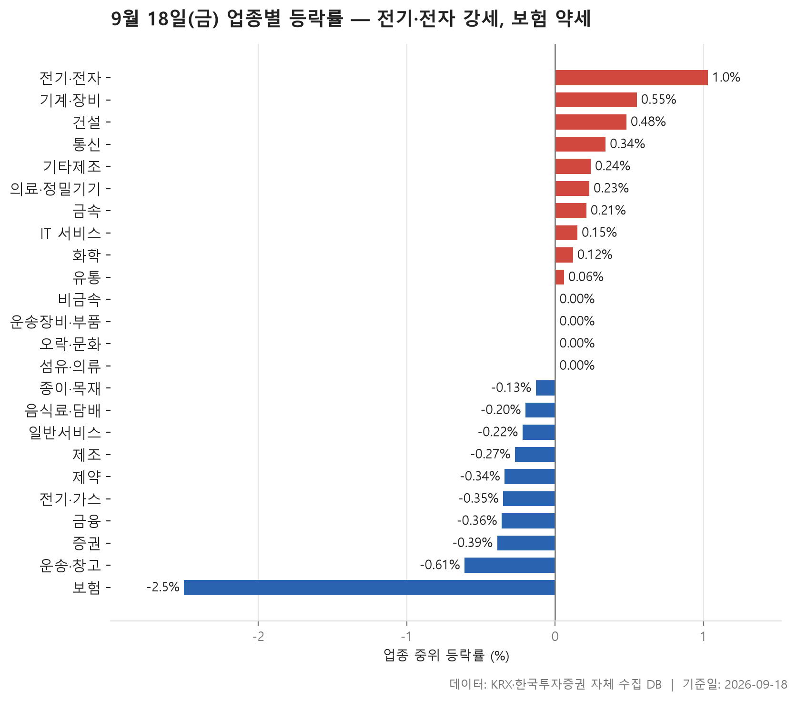
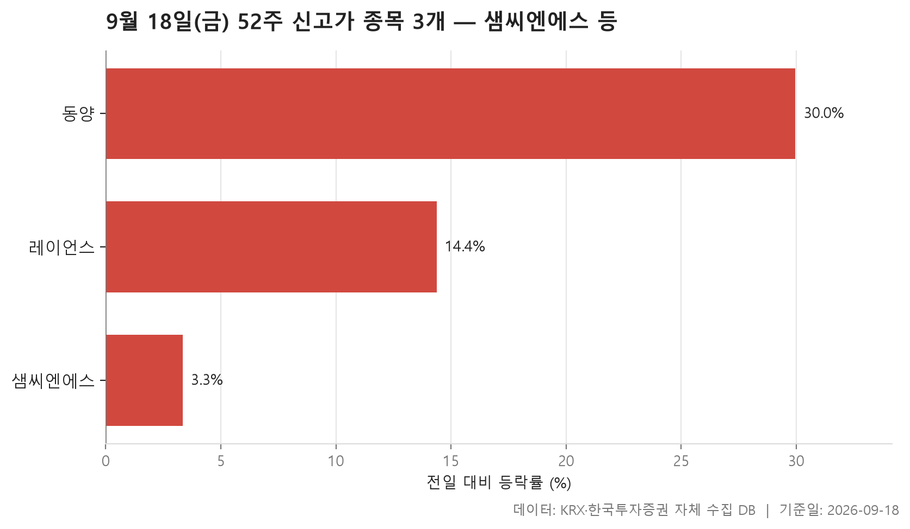
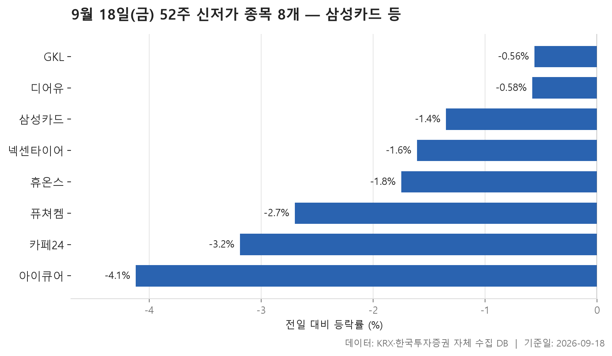
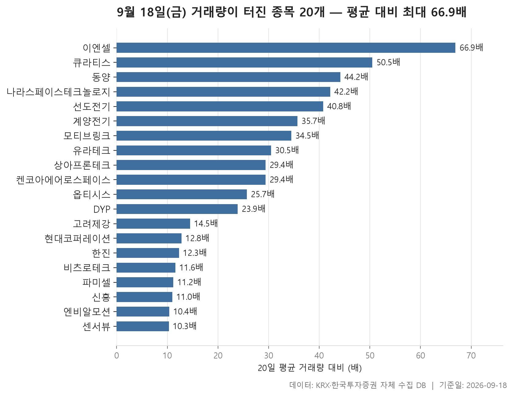

9월 18일 금요일 시장은 어느 한쪽으로 기울지 않았습니다. 24개 업종을 각 업종의 중위 등락률로 줄 세우면 오른 업종이 10개, 내린 업종이 10개로 정확히 갈렸고, 한가운데 놓인 값은 0%였습니다. 시장 전체로 보면 방향이 없었던 셈입니다. 그래도 양 끝은 뚜렷했습니다. 맨 위에는 전기·전자(+1.03%), 맨 아래에는 보험(-2.50%)이 섰습니다.

오늘은 업종 흐름부터 보고, 52주 신고가와 신저가, 거래량이 평소의 다섯 배를 넘은 종목 순서로 짚어 봅니다. 신고가는 3개, 신저가는 8개로 신저가 쪽이 더 많았습니다. 다만 신저가 종목들이 내린 폭은 대체로 작았습니다. 거래량이 터진 20개 종목은 대부분 올랐는데, 예외 몇 곳이 오히려 눈여겨볼 만합니다.

> 기준일: 2026-09-18 · 집계: 자체 수집 데이터베이스

## 업종 등락률 — 24개 중 10개 상승

전기·전자는 364종목으로 표에서 가장 큰 업종인데, 그중 65.90%가 올랐습니다. 덩치가 큰 업종에서 셋 중 둘꼴로 올랐다는 점이 중위값보다 더 많은 것을 말해 줍니다. 평균(+1.95%)이 중위값보다 높게 나왔지만, 이 업종에서 가장 크게 움직인 선도전기(+29.96%)가 평균을 끌어올린 폭은 0.08%p에 그칩니다. 평균을 높인 것은 한 종목이 아니라 여러 종목이 함께 오른 결과로 봐야 합니다. 이 업종의 거래대금도 219,612.20억원으로 다른 업종과 비교가 안 되는 규모였습니다.

반대로 **평균만 보면 오해하기 쉬운 업종**도 있습니다. 통신은 13종목 가운데 61.50%가 올랐고 중위값도 +0.34%인데, 평균은 -1.80%로 뒤집혀 있습니다. 프리티(-29.91%) 한 종목이 업종 평균을 -2.30%p 끌어내렸기 때문입니다. 비금속은 방향이 거꾸로입니다. 중위값은 0.00%인데 평균은 +1.06%이고, 동양(+29.97%) 혼자 평균을 0.86%p 밀어 올렸습니다. 화학의 코스나인(-50.00%), 섬유·의류의 원풍물산(-53.49%)처럼 개별 종목이 크게 흔들린 곳도 있지만, 중위값으로 매긴 순위에는 거의 흔적이 남지 않았습니다.

아래쪽은 폭보다 넓이가 문제였습니다. 보험은 11종목 가운데 오른 종목이 9.10%, 열에 하나꼴이었습니다. 운송·창고(14.30%), 전기·가스(20.00%), 종이·목재(24.00%)도 오른 종목이 드물었습니다. 금융(-0.36%)과 증권(-0.39%)까지 하위권에 모여 있어 금융권 전반이 약했던 날로 읽힙니다. 보험을 빼면 하위 업종들의 중위 하락폭은 크지 않았고, 대신 여러 종목이 조금씩 내린 모양이었습니다.

| 업종 | 종목수(개) | 중위등락률(%) | 평균등락률(%) | 상승비율(%) | 주도종목 | 주도종목등락률(%) | 평균기여도(%p) | 거래대금합계(억원) |
|---|---|---|---|---|---|---|---|---|
| 전기·전자 | 364 | +1.03 | +1.95 | 65.90 | 선도전기 | +29.96 | 0.08 | 219,612.20 |
| 기계·장비 | 205 | +0.55 | +1.03 | 60.50 | 기가비스 | +13.10 | 0.06 | 16,324.80 |
| 건설 | 51 | +0.48 | +0.84 | 60.80 | LS마린솔루션 | +6.42 | 0.13 | 6,149.40 |
| 통신 | 13 | +0.34 | -1.80 | 61.50 | 프리티 | -29.91 | -2.30 | 2,191.50 |
| 기타제조 | 14 | +0.24 | +0.21 | 50.00 | 리튬포어스 | +6.94 | 0.50 | 22.10 |
| 의료·정밀기기 | 100 | +0.23 | +0.58 | 58.00 | 레이언스 | +14.38 | 0.14 | 1,779.10 |
| 금속 | 132 | +0.21 | +0.73 | 56.10 | 엔비알모션 | +13.57 | 0.10 | 5,558.40 |
| IT 서비스 | 244 | +0.15 | +0.44 | 52.00 | 이삭엔지니어링 | +16.61 | 0.07 | 9,816.20 |
| 화학 | 221 | +0.12 | +0.06 | 52.50 | 코스나인 | -50.00 | -0.23 | 11,649.50 |
| 유통 | 152 | +0.06 | +0.53 | 50.00 | 오션인더블유 | +20.13 | 0.13 | 6,361.20 |
| 비금속 | 35 | 0.00 | +1.06 | 48.60 | 동양 | +29.97 | 0.86 | 554.20 |
| 운송장비·부품 | 134 | 0.00 | +0.19 | 49.30 | 코다코 | -45.10 | -0.34 | 14,367.70 |
| 오락·문화 | 66 | 0.00 | +0.08 | 42.40 | 아이오케이이엔엠 | +29.86 | 0.45 | 760.60 |
| 섬유·의류 | 47 | 0.00 | -0.52 | 48.90 | 원풍물산 | -53.49 | -1.14 | 400.60 |
| 종이·목재 | 25 | -0.13 | -0.53 | 24.00 | 페이퍼코리아 | -6.45 | -0.26 | 26.70 |
| 음식료·담배 | 82 | -0.20 | -0.03 | 41.50 | 뉴온 | +16.37 | 0.20 | 2,249.40 |
| 일반서비스 | 168 | -0.22 | -0.21 | 43.50 | 지노믹트리 | +17.37 | 0.10 | 9,766.80 |
| 제조 | 7 | -0.27 | -0.89 | 28.60 | 에넥스 | -3.03 | -0.43 | 12.50 |
| 제약 | 165 | -0.34 | -0.67 | 33.30 | 오름테라퓨틱 | -29.96 | -0.18 | 7,101.70 |
| 전기·가스 | 10 | -0.35 | -0.57 | 20.00 | 한국가스공사 | -3.16 | -0.32 | 625.30 |
| 금융 | 111 | -0.36 | -0.18 | 39.60 | LS에코에너지 | +14.15 | 0.13 | 23,210.80 |
| 증권 | 18 | -0.39 | -0.77 | 33.30 | 유안타증권 | -3.26 | -0.18 | 1,118.30 |
| 운송·창고 | 28 | -0.61 | -0.89 | 14.30 | STX그린로지스 | -5.76 | -0.21 | 1,875.50 |
| 보험 | 11 | -2.50 | -2.14 | 9.10 | 미래에셋생명 | -3.74 | -0.34 | 3,574.20 |

## 52주 신고가 3개 — 최고 동양 29.97%

신고가는 세 종목뿐이었습니다. 전기·전자가 가장 강한 업종이었는데도 이 목록에 든 전기·전자 종목은 샘씨엔에스 하나입니다. 업종 전체가 올랐다고 해서 신고가가 쏟아진 것은 아니었다는 뜻입니다.

샘씨엔에스는 시가총액 10,429.70억원으로 셋 중 가장 크지만 등락률은 +3.34%로 가장 작았습니다. 종가 17,320원이 이전 52주 최고가 17,250원을 근소하게 넘어선 정도라, 급등보다는 고점 부근에서 한 발 더 나간 모양입니다.

나머지 두 종목은 앞의 업종 표에서 이미 본 이름입니다. 동양(+29.97%)은 비금속 업종 평균을 혼자 끌어올린 종목이고, 아래 거래량 급증 표에도 44.20배로 다시 등장합니다. 레이언스(+14.38%)는 의료·정밀기기 업종에서 가장 크게 움직인 종목이었습니다. 시장별로는 KOSPI 1개, KOSDAQ 2개입니다.

| 종목명 | 종목코드 | 시장 | 업종 | 종가(원) | 등락률(%) | 이전52주최고(원) | 거래대금(억원) | 시가총액(억원) |
|---|---|---|---|---|---|---|---|---|
| 샘씨엔에스 | 252990 | KOSDAQ | 전기·전자 | 17,320 | +3.34 | 17,250 | 115.70 | 10,429.70 |
| 동양 | 001520 | KOSPI | 비금속 | 1,353 | +29.97 | 1,330 | 66.40 | 1,449.40 |
| 레이언스 | 228850 | KOSDAQ | 의료·정밀기기 | 8,350 | +14.38 | 8,020 | 34.60 | 1,385.30 |

## 52주 신저가 8개 — 최저 아이큐어 -4.12%

신저가는 8개로 신고가보다 많았지만, 모양은 조용했습니다. 가장 적게 내린 GKL이 -0.56%, 가장 많이 내린 아이큐어가 -4.12%이고 중위값은 -1.68%입니다. 하루에 무너졌다기보다 오래 밀려 온 종목들이 한 칸 더 내려선 경우에 가깝습니다. 거래대금도 GKL 5.80억원, 아이큐어 3.70억원처럼 작은 편이었습니다.

가장 큰 종목은 시가총액 50,688.30억원의 삼성카드(-1.35%)입니다. 오늘 약했던 금융 업종에 속해 있어 업종 흐름과 방향은 같습니다. 다만 표만으로 그 이유까지 말할 수는 없습니다.

업종으로는 화학, IT 서비스, 제약이 두 종목씩입니다. 이 가운데 화학(+0.12%)과 IT 서비스(+0.15%)는 업종 중위값이 소폭 플러스였습니다. 업종 전체가 버틴 날에도 개별 종목은 저점을 새로 쓸 수 있다는 점을 보여 줍니다. 시장별로는 KOSPI 3개, KOSDAQ 5개입니다.

| 종목명 | 종목코드 | 시장 | 업종 | 종가(원) | 등락률(%) | 이전52주최저(원) | 거래대금(억원) | 시가총액(억원) |
|---|---|---|---|---|---|---|---|---|
| 삼성카드 | 029780 | KOSPI | 금융 | 43,750 | -1.35 | 44,050 | 54.00 | 50,688.30 |
| GKL | 114090 | KOSPI | 오락·문화 | 8,950 | -0.56 | 8,990 | 5.80 | 5,536.10 |
| 넥센타이어 | 002350 | KOSPI | 화학 | 5,500 | -1.61 | 5,540 | 8.60 | 5,371.70 |
| 디어유 | 376300 | KOSDAQ | IT 서비스 | 17,080 | -0.58 | 17,140 | 7.00 | 4,054.50 |
| 카페24 | 042000 | KOSDAQ | IT 서비스 | 14,890 | -3.19 | 15,010 | 11.40 | 3,600.10 |
| 휴온스 | 243070 | KOSDAQ | 제약 | 19,700 | -1.75 | 19,920 | 22.10 | 2,360.00 |
| 퓨쳐켐 | 220100 | KOSDAQ | 제약 | 6,130 | -2.70 | 6,230 | 8.10 | 1,374.80 |
| 아이큐어 | 175250 | KOSDAQ | 화학 | 1,584 | -4.12 | 1,648 | 3.70 | 977.90 |

## 거래량 급증 20개 — 최고 이엔셀 66.90배

거래량이 평소의 다섯 배를 넘은 종목은 20개였고, 한가운데 종목의 배수가 27.55배였습니다. 기준선보다 훨씬 위에서 몰린 셈입니다. 업종으로는 전기·전자가 6개로 가장 많아, 업종 표의 강세와 겹칩니다. 선도전기(+29.96%, 40.80배), 동양(+29.97%), DYP(+29.95%)처럼 하루 만에 크게 뛴 종목도 여기 모여 있습니다.

맨 위는 이엔셀로, 평소의 66.90배가 거래되며 +26.10% 올랐습니다. 시가총액이 730.20억원인 작은 종목이라 거래가 조금만 몰려도 배수가 크게 뛸 수 있다는 점은 감안해야 합니다.

**거래량 폭증이 곧 상승은 아니었습니다.** 두 번째로 배수가 높은 큐라티스(50.50배)는 -5.71% 내렸고, 현대코퍼레이션(-0.93%)도 내렸습니다. 한진과 비츠로테크는 0.00%로 제자리였는데, 비츠로테크는 거래대금이 752.50억원이나 됐습니다. 사고판 물량은 컸지만 가격은 움직이지 않은 드문 경우입니다.

배수와 절대 규모가 따로 노는 점도 볼 만합니다. 센서뷰는 44,905,559주로 표에서 거래량이 가장 많았지만 평소 거래량이 이미 4,361,904주라 배수는 10.30배로 가장 낮았습니다. 거래대금이 가장 큰 곳은 시가총액도 가장 큰 파미셀(1,349.10억원)이었고, 신흥은 거래대금이 4.00억원에 불과한데도 배수로는 기준을 넘었습니다.

| 종목명 | 종목코드 | 시장 | 업종 | 종가(원) | 등락률(%) | 거래량(주) | 평균거래량(주) | 배수(배) | 거래대금(억원) | 시가총액(억원) |
|---|---|---|---|---|---|---|---|---|---|---|
| 이엔셀 | 456070 | KOSDAQ | 제약 | 6,620 | +26.10 | 2,924,086 | 43,724 | 66.90 | 192.80 | 730.20 |
| 큐라티스 | 348080 | KOSDAQ | 일반서비스 | 4,540 | -5.71 | 2,552,429 | 50,578 | 50.50 | 128.10 | 582.40 |
| 동양 | 001520 | KOSPI | 비금속 | 1,353 | +29.97 | 5,029,523 | 113,835 | 44.20 | 66.40 | 1,449.40 |
| 나라스페이스테크놀로지 | 478340 | KOSDAQ | 운송장비·부품 | 14,460 | +4.40 | 4,465,172 | 105,751 | 42.20 | 637.30 | 1,673.00 |
| 선도전기 | 007610 | KOSPI | 전기·전자 | 4,945 | +29.96 | 8,263,126 | 202,677 | 40.80 | 396.60 | 890.10 |
| 계양전기 | 012200 | KOSPI | 기계·장비 | 3,935 | +9.00 | 5,690,415 | 159,487 | 35.70 | 241.90 | 1,071.20 |
| 모티브링크 | 463480 | KOSDAQ | 전기·전자 | 4,325 | +8.94 | 1,355,828 | 39,322 | 34.50 | 64.60 | 535.90 |
| 유라테크 | 048430 | KOSDAQ | 전기·전자 | 6,670 | +9.17 | 1,835,579 | 60,126 | 30.50 | 125.30 | 768.40 |
| 상아프론테크 | 089980 | KOSDAQ | 화학 | 16,840 | +12.12 | 425,621 | 14,479 | 29.40 | 73.70 | 2,692.60 |
| 켄코아에어로스페이스 | 274090 | KOSDAQ | 운송장비·부품 | 13,220 | +14.66 | 5,797,940 | 197,070 | 29.40 | 770.20 | 1,821.00 |
| 옵티시스 | 109080 | KOSDAQ | 전기·전자 | 9,780 | +7.24 | 314,031 | 12,241 | 25.70 | 31.60 | 551.20 |
| DYP | 092780 | KOSPI | 운송장비·부품 | 4,100 | +29.95 | 428,101 | 17,915 | 23.90 | 17.00 | 539.90 |
| 고려제강 | 002240 | KOSPI | 금속 | 16,900 | +0.12 | 225,189 | 15,491 | 14.50 | 38.10 | 4,563.00 |
| 현대코퍼레이션 | 011760 | KOSPI | 유통 | 26,500 | -0.93 | 218,243 | 17,097 | 12.80 | 57.90 | 3,505.70 |
| 한진 | 002320 | KOSPI | 운송·창고 | 14,370 | 0.00 | 207,539 | 16,807 | 12.30 | 29.80 | 2,230.00 |
| 비츠로테크 | 042370 | KOSDAQ | 금융 | 11,440 | 0.00 | 6,606,173 | 567,993 | 11.60 | 752.50 | 2,997.30 |
| 파미셀 | 005690 | KOSPI | 전기·전자 | 12,530 | +8.20 | 10,334,474 | 918,759 | 11.20 | 1,349.10 | 7,518.50 |
| 신흥 | 004080 | KOSPI | 유통 | 14,540 | +3.49 | 27,180 | 2,477 | 11.00 | 4.00 | 1,352.20 |
| 엔비알모션 | 0004V0 | KOSDAQ | 금속 | 6,530 | +13.57 | 1,432,697 | 138,258 | 10.40 | 92.50 | 719.00 |
| 센서뷰 | 321370 | KOSDAQ | 전기·전자 | 1,863 | +10.50 | 44,905,559 | 4,361,904 | 10.30 | 815.80 | 1,315.70 |

## 정리

한 줄로 줄이면, 시장 전체로는 방향이 없었지만 업종 사이는 뚜렷하게 갈린 하루였습니다. 전기·전자는 여러 종목이 함께 올랐고, 보험을 비롯한 금융권은 조금씩 내린 종목이 넓게 퍼져 있었습니다. 신저가는 신고가보다 많았어도 내린 폭은 작았고, 거래량이 터진 종목 중에는 가격이 오르지 않은 곳도 섞여 있었습니다.

이 글은 하루치 종가만 비교한 기록이고, 각 종목이 왜 움직였는지는 자료에 없어 다루지 않았습니다. 신고가·신저가와 거래량 급증 표는 시가총액 500억원 이상, 거래대금 3억원 이상 보통주만 걸렀기 때문에 그보다 작은 종목의 움직임은 들어 있지 않습니다. 업종 순위도 중위값 기준이라, 평균으로 매기면 순서가 달라질 수 있습니다.

## 집계 기준

**업종 등락률**

- **기준**: 2026-09-17 종가 → 2026-09-18 종가
- **순위**: 업종 내 종목 등락률의 중위값 (평균은 참고용으로 함께 표시)
- **주도종목**: 그 업종에서 등락률 절대값이 가장 큰 종목 (동점이면 거래대금이 큰 쪽)
- **평균기여도**: 그 종목 하나가 업종 평균을 움직인 폭 (등락률 ÷ 종목수). 중위값과 평균의 격차가 이 값에 가까우면 평균을 만든 것이 그 종목이고, 훨씬 크면 다른 종목들도 함께 움직인 것입니다
- **필터**: 업종 내 보통주 5종목 이상
- **전체업종중위등락률(%)**: 0.0

**52주 신고가**

- **기준**: 종가 > 직전 52주 최고가
- **관측구간**: 2025-09-05 ~ 2026-09-17 (252거래일)
- **필터**: 시가총액 500억 이상, 거래대금 3억 이상, 보통주

**52주 신저가**

- **기준**: 종가 < 직전 52주 최저가
- **관측구간**: 2025-09-05 ~ 2026-09-17 (252거래일)
- **필터**: 시가총액 500억 이상, 거래대금 3억 이상, 보통주

**거래량 급증**

- **기준**: 당일 거래량 ≥ 직전 20거래일 평균 × 5
- **관측구간**: 2026-08-21 ~ 2026-09-17 (20거래일)
- **필터**: 시가총액 500억 이상, 거래대금 3억 이상, 보통주

## 데이터 출처 및 유의사항

- **데이터출처**: 한국거래소(KRX) 공시 데이터와 한국투자증권 OpenAPI 를 직접 수집해 구축한 자체 데이터베이스
- **집계방식**: 수집·집계·차트 생성을 직접 구현한 파이프라인에서 자동 산출
- **작성고지**: 본문의 표·통계·차트는 자체 데이터베이스에서 계산된 값이며, 문장 작성 과정에 AI 도구를 활용했습니다.
- **면책**: 본 글은 정보 제공을 목적으로 하며 특정 종목의 매수·매도를 추천하지 않습니다. 제시된 수치는 과거 데이터이고 미래 수익을 보장하지 않습니다. 투자 판단과 그 결과에 대한 책임은 투자자 본인에게 있습니다.

