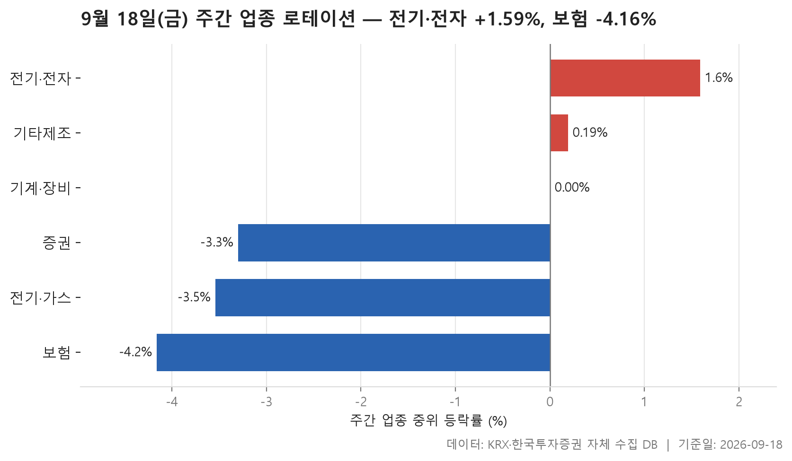
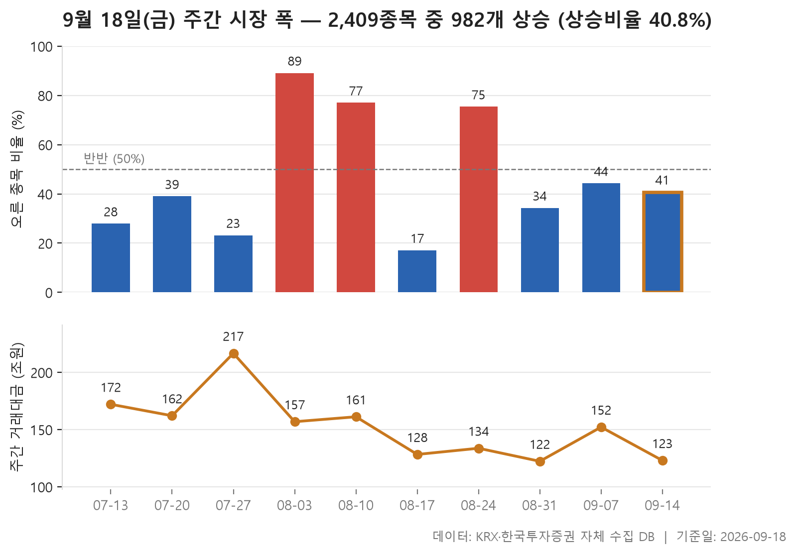
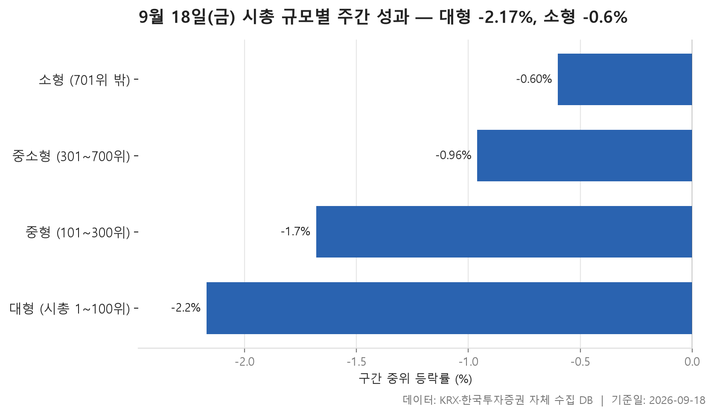

9월 14일 월요일부터 18일 금요일까지, 거래일로 닷새가 지났습니다. 이번 주를 한 장으로 요약하면 '내린 종목이 더 많았던 주'입니다. 다만 그 하락이 시장 전체에 고르게 퍼진 것은 아니어서, 업종별로도 규모별로도 제법 뚜렷한 갈림이 보입니다.

오늘 보는 표는 세 가지입니다. 먼저 24개 업종을 한 주간 등락률의 중위값으로 줄 세워 위아래 세 개씩 뽑았고, 다음으로 최근 10주 동안 매주 오른 종목과 내린 종목이 몇 개였는지를 이어 붙였습니다. 마지막은 시가총액 순위를 네 구간으로 잘라 어느 덩치가 앞섰는지 본 표입니다.

업종 표가 '돈이 어느 산업 쪽에 머물렀나'를 보여준다면, 규모별 표는 '큰 종목 쪽이었나 작은 종목 쪽이었나'를 봅니다. 그리고 그 사이에 놓인 시장 폭 표는 이번 주의 분위기가 최근 두 달 반 안에서 어느 정도 위치인지를 알려줍니다. 순서대로 짚어 보겠습니다.

> 기준일: 2026-09-18 · 집계: 자체 수집 데이터베이스

## 주간 업종 로테이션 — 6개 중 3개 하락

위쪽 세 업종과 아래쪽 세 업종 사이의 간격이 꽤 벌어져 있습니다. 한 주간 중위 등락률이 가장 높은 곳은 전기·전자로 +1.59%, 가장 낮은 곳은 보험으로 -4.16%였습니다. 그런데 상위 세 곳 중에서도 중위값이 실제로 플러스인 곳은 두 곳뿐이고, 세 번째인 기계·장비는 0.00으로 딱 제자리였습니다. 즉 이번 주에 업종 단위로 확실히 올라간 구간은 사실상 좁았다는 이야기입니다.

눈에 띄는 어긋남은 전기·전자입니다. 한가운데 종목은 +1.59%인데 업종 전체를 평균 내면 +4.20%로, 두 값이 크게 벌어져 있습니다. 소속 종목이 362개나 되는 큰 업종에서 이 정도 차이가 난다면, 몇몇 종목이 크게 오르며 평균을 끌어올렸다는 뜻으로 읽는 편이 자연스럽습니다. 이 업종의 주도종목인 센서뷰는 한 주 동안 +60.47%였지만, 종목 수가 워낙 많아 이 종목 하나가 업종 평균에 더한 몫은 0.17%p에 그칩니다. 반대로 기타제조는 14개 종목뿐이라 리튬포어스의 +15.30%가 업종 평균을 1.09%p 끌어올린 것으로 잡힙니다. 같은 '주도종목'이라도 업종 크기에 따라 무게가 전혀 다르다는 점은 기억해 둘 만합니다.

아래쪽 세 업종은 성격이 좀 다릅니다. 증권·전기·가스·보험 모두 중위값과 평균이 거의 붙어 있습니다. 위쪽처럼 소수가 끌어올린 모양이 아니라, 업종 안 종목들이 비슷하게 밀렸다는 뜻입니다. 특히 보험은 11개 종목 중 오른 종목이 하나도 없었습니다. 전기·가스도 열 곳 중 한 곳만 올랐고, 증권 역시 오른 종목이 열에 하나꼴이었습니다. 전기·가스는 종목 수가 10개로 적은 만큼 SGC에너지의 -11.11%가 업종 평균을 1.11%p 끌어내린 것으로 계산되는데, 업종이 작을수록 한 종목의 존재감이 커진다는 점이 여기서도 그대로 보입니다.

| 업종 | 종목수(개) | 주간중위등락률(%) | 주간평균등락률(%) | 상승비율(%) | 주도종목 | 주도종목등락률(%) | 평균기여도(%p) |
|---|---|---|---|---|---|---|---|
| 전기·전자 | 362 | +1.59 | +4.20 | 59.70 | 센서뷰 | +60.47 | 0.17 |
| 기타제조 | 14 | +0.19 | +1.51 | 57.10 | 리튬포어스 | +15.30 | 1.09 |
| 기계·장비 | 206 | 0.00 | +1.27 | 49.00 | KS인더스트리 | +41.64 | 0.20 |
| 증권 | 18 | -3.30 | -3.49 | 11.10 | 다올투자증권 | -7.16 | -0.40 |
| 전기·가스 | 10 | -3.54 | -3.51 | 10.00 | SGC에너지 | -11.11 | -1.11 |
| 보험 | 11 | -4.16 | -3.89 | 0.00 | 삼성생명 | -7.80 | -0.71 |

## 주간 시장 폭 — 10주 중 이번 주는 2,409개 중 982개 상승

이번 주는 2,409개 종목 가운데 982개가 오르고 1,396개가 내렸습니다. 상승 종목을 하락 종목으로 나눈 값은 0.70배. 표에 담긴 10주치의 한가운데 값이 0.68배이니, 이번 주는 최근 두 달 반의 평범한 주와 크게 다르지 않은 자리에 놓여 있는 셈입니다. 내린 쪽이 우세했지만 유별나게 나쁜 주는 아니었다는 말이기도 합니다.

정작 이 표에서 눈에 들어오는 것은 주간 편차의 크기입니다. 이 값이 가장 높았던 주는 8월 3일 주로 8.54배, 가장 낮았던 주는 8월 17일 주로 0.21배였습니다. 오른 종목이 하락 종목의 여덟 배를 넘던 주와, 다섯 중 하나도 오르지 못한 주가 2주 간격으로 붙어 있습니다. 그 사이 8월 10일 주는 3.49배, 바로 다음인 8월 24일 주는 3.22배로, 넉 주 동안 위아래를 오가는 모습이 이어졌습니다.

그에 비하면 9월 들어서는 움직임의 폭이 줄었습니다. 8월 31일 주가 0.53배, 9월 7일 주가 0.82배, 이번 주가 0.70배로, 세 주 연속 1을 밑돌되 서로 큰 차이 없이 붙어 있습니다. 여름에 보이던 급격한 방향 전환이 잦아들고 완만한 약세가 이어지는 모양새로 보입니다.

거래대금 쪽도 함께 보면 흐름이 조금 더 선명해집니다. 7월 27일 주의 216.70조원이 표 안에서 가장 큰 값이고, 이후로는 대체로 내려와 이번 주가 123.00조원입니다. 직전 주의 152.20조원과 비교하면 한 주 만에 눈에 띄게 줄었습니다. 다만 거래대금이 왜 줄었는지는 이 표가 말해 주지 않습니다.

| 주 | 거래일수(일) | 종목수(개) | 상승(개) | 보합(개) | 하락(개) | 상승비율(%) | ADR(배) | 총거래대금(조원) |
|---|---|---|---|---|---|---|---|---|
| 2026-09-14 | 5 | 2,409 | 982 | 31 | 1,396 | 40.80 | 0.70 | 123.00 |
| 2026-09-07 | 5 | 2,407 | 1,067 | 40 | 1,300 | 44.30 | 0.82 | 152.20 |
| 2026-08-31 | 5 | 2,402 | 823 | 34 | 1,545 | 34.30 | 0.53 | 122.30 |
| 2026-08-24 | 5 | 2,387 | 1,800 | 28 | 559 | 75.40 | 3.22 | 133.70 |
| 2026-08-17 | 4 | 2,388 | 409 | 16 | 1,963 | 17.10 | 0.21 | 128.30 |
| 2026-08-10 | 5 | 2,386 | 1,838 | 22 | 526 | 77.00 | 3.49 | 161.20 |
| 2026-08-03 | 5 | 2,396 | 2,136 | 10 | 250 | 89.10 | 8.54 | 156.90 |
| 2026-07-27 | 5 | 2,401 | 556 | 21 | 1,824 | 23.20 | 0.30 | 216.70 |
| 2026-07-20 | 5 | 2,403 | 937 | 28 | 1,438 | 39.00 | 0.65 | 162.10 |
| 2026-07-13 | 4 | 2,415 | 673 | 26 | 1,716 | 27.90 | 0.39 | 172.10 |

## 시총 규모별 주간 성과 — 소형이 1.57%p 앞섬

네 구간 모두 중위값이 마이너스입니다. 이번 주에는 어느 덩치에 있었든 절반 이상의 종목이 내렸다는 뜻입니다. 다만 그 정도가 규모에 따라 가지런히 달라집니다. 대형이 -2.17%로 가장 깊고, 중형 -1.68%, 중소형 -0.96%, 소형 -0.60% 순으로 순위가 내려갈수록 낙폭이 얕아집니다. 대형과 소형의 격차는 -1.57로 기록돼 있습니다. 오른 종목의 비율도 같은 방향으로 움직여, 대형에서는 넷 중 하나꼴이었던 것이 소형에서는 열에 넷 남짓까지 올라갑니다.

그런데 중위값과 평균을 나란히 놓으면 이야기가 조금 달라집니다. 대형은 중위값과 평균이 모두 마이너스로 방향이 같은 반면, 중형·중소형·소형은 한가운데 종목이 내렸는데 평균은 플러스입니다. 특히 중소형은 중위값 -0.96%에 평균 +1.15%로 벌어짐이 가장 큽니다. 대다수는 조금씩 밀렸는데 일부가 크게 올라 평균을 끌어올린 모양입니다. 규모가 작은 쪽이 '앞섰다'고 할 때, 그것이 고르게 오른 것과는 다르다는 점을 이 두 열의 차이가 보여줍니다.

주도종목 칸도 한 번 더 볼 만합니다. 앞의 세 구간은 모두 크게 오른 종목이 뽑혔지만, 소형 구간의 주도종목은 코스나인으로 -90.00%였습니다. 이 칸은 등락률의 절댓값이 가장 큰 종목을 고르기 때문에, 크게 내린 종목이 뽑히기도 합니다. 종목 수가 1,709개로 압도적으로 많은 구간인 만큼 양극단 모두 두텁다고 보는 편이 맞겠습니다.

거래대금은 규모 순서를 그대로 따릅니다. 대형 100개 종목에 80.10조원이 몰린 반면, 1,709개가 들어 있는 소형 구간은 10.70조원입니다. 종목 수는 훨씬 많지만 돈이 오간 규모는 그렇지 않습니다. 이번 주 수익률에서는 작은 쪽이 덜 밀렸어도, 거래 자체는 여전히 위쪽에 쏠려 있었습니다.

| 구간 | 종목수(개) | 주간중위등락률(%) | 주간평균등락률(%) | 상승비율(%) | 주도종목 | 주도종목등락률(%) | 주간거래대금(조원) |
|---|---|---|---|---|---|---|---|
| 대형 (시총 1~100위) | 100 | -2.17 | -1.43 | 24.00 | 가온전선 | +28.74 | 80.10 |
| 중형 (101~300위) | 200 | -1.68 | +0.29 | 37.50 | 성호전자 | +53.32 | 19.90 |
| 중소형 (301~700위) | 400 | -0.96 | +1.15 | 40.80 | 한양디지텍 | +45.50 | 12.30 |
| 소형 (701위 밖) | 1,709 | -0.60 | +0.33 | 42.10 | 코스나인 | -90.00 | 10.70 |

## 정리

정리하면 이번 주는 내린 종목이 더 많았던 평범한 약세 주였고, 그 안에서 전기·전자를 비롯한 몇몇 업종과 시총 하위 구간이 상대적으로 덜 밀렸습니다. 다만 그 '덜 밀림'은 대체로 소수 종목이 크게 움직여 평균을 들어 올린 형태였지, 구간 전체가 고르게 오른 모습은 아니었습니다. 중위값과 평균이 벌어진 자리마다 그 흔적이 남아 있습니다.

이 표들은 가격과 종목 수, 거래대금만으로 만든 것입니다. 왜 보험 업종에서 오른 종목이 한 곳도 없었는지, 왜 거래대금이 한 주 만에 줄었는지는 여기 담긴 숫자로는 알 수 없습니다. 또한 한 주는 짧은 구간이라 다음 주에 순서가 뒤집혀도 이상할 것이 없습니다. 최근 10주의 등락 폭이 그 점을 잘 보여 줍니다.

## 집계 기준

**주간 업종 로테이션**

- **기준**: 2026-09-11 종가 → 2026-09-18 종가
- **구간**: 2026-09-14 시작 주 — 직전 주 마지막 거래일 종가를 출발선으로 삼습니다
- **거래일수**: 5
- **순위**: 업종 내 종목 등락률의 중위값 (평균은 참고용으로 함께 표시)
- **선정**: 전체 24개 업종 중 상위 3개 · 하위 3개
- **주도종목**: 그 업종에서 같은 기간 등락률 절대값이 가장 큰 종목 (동점이면 거래대금이 큰 쪽)
- **평균기여도**: 그 종목 하나가 업종 평균을 움직인 폭 (등락률 ÷ 종목수)
- **필터**: 업종 내 보통주 5종목 이상

**주간 시장 폭**

- **기준**: 각 주의 마지막 거래일 종가를 직전 주 마지막 거래일 종가와 비교
- **주**: 그 주의 월요일 (달력 기준). 거래일 수는 연휴에 따라 다릅니다
- **ADR**: 상승 종목 수 ÷ 하락 종목 수. 1 이면 반반, 2 면 오른 종목이 두 배
- **총거래대금**: 그 주 거래일 전체의 거래대금 합계
- **모집단**: 거래가 있었던 보통주 (거래정지·액면 변경 종목 제외)

**시총 규모별 주간 성과**

- **기준**: 2026-09-11 종가 → 2026-09-18 종가
- **구간**: 기준일 시가총액 순위로 자릅니다 (금액으로 자르면 장이 오른 해에 전부 위 구간으로 올라가 해마다 다른 표가 됩니다)
- **순위**: 구간 내 종목 등락률의 중위값 (평균은 참고용으로 함께 표시)
- **주도종목**: 그 구간에서 같은 기간 등락률 절대값이 가장 큰 종목 (동점이면 거래대금이 큰 쪽)
- **대형소형격차**: -1.57
- **모집단**: 거래가 있었던 보통주 (거래정지·액면 변경 종목 제외)

## 데이터 출처 및 유의사항

- **데이터출처**: 한국거래소(KRX) 공시 데이터와 한국투자증권 OpenAPI 를 직접 수집해 구축한 자체 데이터베이스
- **집계방식**: 수집·집계·차트 생성을 직접 구현한 파이프라인에서 자동 산출
- **작성고지**: 본문의 표·통계·차트는 자체 데이터베이스에서 계산된 값이며, 문장 작성 과정에 AI 도구를 활용했습니다.
- **면책**: 본 글은 정보 제공을 목적으로 하며 특정 종목의 매수·매도를 추천하지 않습니다. 제시된 수치는 과거 데이터이고 미래 수익을 보장하지 않습니다. 투자 판단과 그 결과에 대한 책임은 투자자 본인에게 있습니다.

