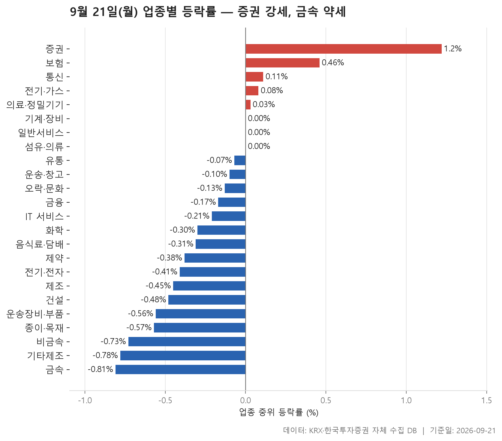
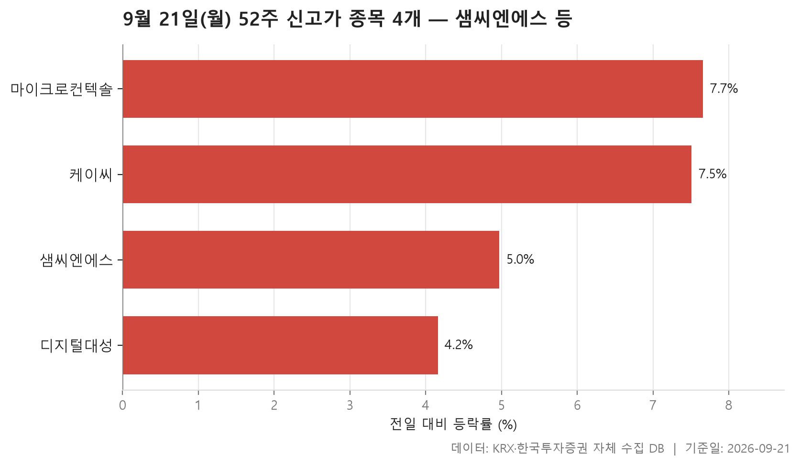
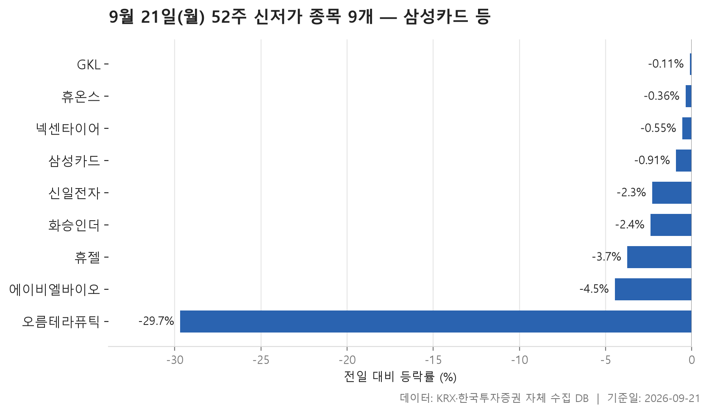
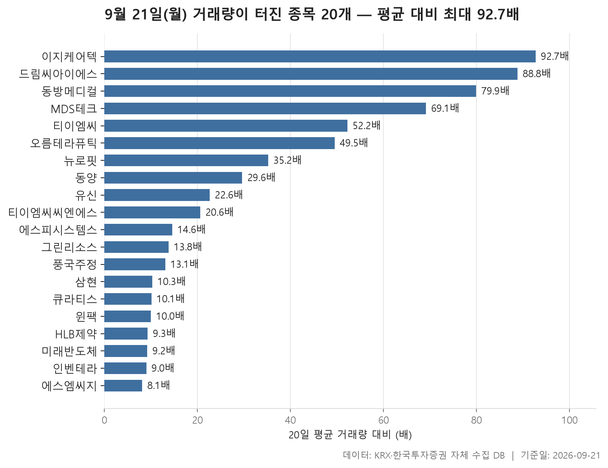

9월 21일 월요일 시장은 한쪽으로 크게 기운 날은 아니었습니다. 다만 방향은 아래쪽이었습니다. 24개 업종의 중위 등락률을 늘어놓고 한가운데 값을 보면 -0.19%, 그리고 그 24개 가운데 오른 쪽이 5개, 내린 쪽이 16개였습니다. 폭은 좁고 개수는 한쪽으로 쏠린, 그런 모양의 하루입니다.

강한 곳과 약한 곳은 비교적 또렷했습니다. 가장 강한 업종은 증권으로 중위 등락률 +1.22%, 가장 약한 업종은 금속으로 -0.81%. 두 끝 사이의 거리가 그다지 크지 않다는 점도 이 하루의 성격을 말해 줍니다. 지수를 뒤흔든 사건이 있었다기보다, 업종마다 조금씩 눌린 종목이 많았던 쪽에 가깝습니다.

아래에서는 업종 등락률 표를 먼저 훑고, 52주 최고가를 넘어선 종목과 최저가를 밑돈 종목을 차례로 봅니다. 마지막으로 직전 20거래일 평균 거래량의 5배를 넘긴 종목들을 정리했습니다. 왜 그렇게 움직였는지는 이 자료에 없습니다. 여기서는 표가 보여 주는 모양까지만 짚겠습니다.

> 기준일: 2026-09-21 · 집계: 자체 수집 데이터베이스

## 업종 등락률 — 24개 중 16개 하락

위쪽 다섯 칸은 증권, 보험, 통신, 전기·가스, 의료·정밀기기입니다. 그런데 이 다섯 중에서 업종 전체가 고르게 올랐다고 말할 수 있는 곳은 사실 위의 둘뿐입니다. 증권은 중위 +1.22%에 평균 +1.26%로 두 값이 거의 붙어 있고, 오른 종목 비율도 77.80%. 보험도 중위 +0.46%, 평균 +0.51%에 상승비율 72.70%로 비슷한 구조입니다. 업종 안 대부분이 같은 방향으로 조금씩 움직일 때 이런 그림이 나옵니다.

반대로 통신은 중위 +0.11%인데 평균은 +0.99%까지 벌어져 있습니다. 이 업종에서 등락률 절대값이 가장 큰 종목은 +18.32%를 기록했고, 그 한 종목이 업종 평균을 1.41%p 끌어올린 셈입니다. 즉 중위와 평균의 차이보다 한 종목의 몫이 더 큽니다. 업종이 오른 게 아니라 한 종목이 오른 것에 가깝다는 뜻이고, 표 순위를 중위값으로 매긴 이유도 여기에 있습니다. 오락·문화도 비슷한 사례입니다. 중위는 -0.13%로 마이너스인데 평균은 +0.44%, 상승비율은 39.40%에 그칩니다. 열 곳 중 네 곳도 오르지 않았는데 평균만 플러스인 셈이죠.

아래쪽은 좀 더 단순합니다. 금속은 중위 -0.81%, 평균 -0.82%로 두 값이 붙어 있고 상승비율은 32.60%. 비금속은 중위 -0.73%에 상승비율 22.90%로 이 표에서 오른 종목 비율이 가장 낮은 축입니다. 건설도 -0.48%에 27.50%, 종이·목재는 -0.57%에 28.00%. 한두 종목이 끌어내린 게 아니라 업종 전반이 조금씩 눌린 모양입니다.

거래대금은 완전히 따로 읽어야 합니다. 전기·전자가 159,862.30억원으로 압도적인데 중위 등락률은 -0.41%였습니다. 돈이 가장 많이 돈 곳이 가장 많이 오른 곳은 아니었다는 말입니다. 반대쪽 끝에는 제조가 있는데, 종목수 7개에 거래대금 4.20억원. 이렇게 표본이 얇은 업종의 순위는 숫자 몇 개에 쉽게 흔들리니 함께 감안하는 편이 좋습니다.

| 업종 | 종목수(개) | 중위등락률(%) | 평균등락률(%) | 상승비율(%) | 주도종목 | 주도종목등락률(%) | 평균기여도(%p) | 거래대금합계(억원) |
|---|---|---|---|---|---|---|---|---|
| 증권 | 18 | +1.22 | +1.26 | 77.80 | 한화투자증권 | +3.34 | 0.19 | 810.80 |
| 보험 | 11 | +0.46 | +0.51 | 72.70 | 삼성생명 | +2.65 | 0.24 | 1,719.60 |
| 통신 | 13 | +0.11 | +0.99 | 61.50 | 더즌 | +18.32 | 1.41 | 1,522.10 |
| 전기·가스 | 10 | +0.08 | +0.33 | 50.00 | 지역난방공사 | +4.41 | 0.44 | 355.10 |
| 의료·정밀기기 | 100 | +0.03 | +0.99 | 50.00 | 스카이랩스 | +29.89 | 0.30 | 4,532.30 |
| 기계·장비 | 206 | 0.00 | +0.57 | 47.60 | 와이씨 | +20.24 | 0.10 | 15,478.60 |
| 일반서비스 | 168 | 0.00 | +0.52 | 45.20 | 인벤테라 | +24.73 | 0.15 | 6,161.00 |
| 섬유·의류 | 47 | 0.00 | +0.01 | 46.80 | 형지엘리트 | -7.12 | -0.15 | 209.90 |
| 유통 | 154 | -0.07 | +0.18 | 47.40 | 디모아 | +11.90 | 0.08 | 3,722.30 |
| 운송·창고 | 28 | -0.10 | +0.13 | 46.40 | STX그린로지스 | -4.50 | -0.16 | 929.60 |
| 오락·문화 | 66 | -0.13 | +0.44 | 39.40 | 캔버스엔 | +30.00 | 0.45 | 661.00 |
| 금융 | 111 | -0.17 | +0.13 | 39.60 | 우리기술투자 | +9.39 | 0.08 | 15,469.30 |
| IT 서비스 | 245 | -0.21 | +0.38 | 46.10 | 토마토시스템 | +29.97 | 0.12 | 7,137.70 |
| 화학 | 220 | -0.30 | -0.13 | 38.20 | 티이엠씨 | +24.27 | 0.11 | 8,770.60 |
| 음식료·담배 | 82 | -0.31 | -0.37 | 35.40 | 우성 | +7.61 | 0.09 | 1,081.40 |
| 제약 | 165 | -0.38 | -0.16 | 38.80 | 오름테라퓨틱 | -29.68 | -0.18 | 5,378.00 |
| 전기·전자 | 362 | -0.41 | +0.25 | 42.30 | 시그네틱스 | +30.00 | 0.08 | 159,862.30 |
| 제조 | 7 | -0.45 | -0.78 | 28.60 | 지누스 | -3.20 | -0.46 | 4.20 |
| 건설 | 51 | -0.48 | -0.75 | 27.50 | 국보디자인 | -4.66 | -0.09 | 2,778.50 |
| 운송장비·부품 | 133 | -0.56 | -0.34 | 35.30 | 에스엠벡셀 | +11.60 | 0.09 | 10,746.20 |
| 종이·목재 | 25 | -0.57 | -0.38 | 28.00 | 페이퍼코리아 | +3.45 | 0.14 | 29.50 |
| 비금속 | 35 | -0.73 | -0.88 | 22.90 | 동양 | -11.01 | -0.31 | 506.90 |
| 기타제조 | 14 | -0.78 | -0.35 | 35.70 | 휴엠앤씨 | +4.04 | 0.29 | 16.90 |
| 금속 | 132 | -0.81 | -0.82 | 32.60 | 에이에프더블류 | -16.82 | -0.13 | 4,025.30 |

## 52주 신고가 4개 — 최고 마이크로컨텍솔 7.66%

52주 최고가를 넘어선 종목은 네 개뿐입니다. 시가총액 500억, 거래대금 3억이라는 문턱을 둔 조건이지만, 그래도 네 개는 적은 숫자입니다. 업종이 내린 쪽으로 기운 하루였다는 앞 섹션의 그림과 어긋나지 않습니다.

네 종목의 전일 대비 등락률 중위값은 6.24%로, 넘어서긴 넘어섰는데 종가가 이전 최고가를 아슬아슬하게 웃도는 정도는 아닙니다. 가장 많이 오른 마이크로컨텍솔이 +7.66%, 가장 덜 오른 디지털대성이 +4.16%. 네 종목이 4%대에서 7%대까지 비교적 좁은 구간에 모여 있습니다.

덩치는 서로 다릅니다. 시가총액이 가장 큰 샘씨엔에스가 10,948억원이고, 나머지는 그보다 한참 아래입니다. 시장별로는 코스피 1개, 코스닥 3개. 업종은 세 개로 나뉘는데 전기·전자가 2개로 가장 많습니다. 흥미로운 대목은 앞 섹션에서 전기·전자의 중위 등락률이 -0.41%였다는 점입니다. 업종 전체가 눌린 가운데서도 신고가를 낸 종목은 그 업종에서 나왔습니다. 업종 평균과 개별 종목이 항상 같은 이야기를 하지 않는다는, 익숙하지만 자주 잊힐는 사실입니다.

거래대금은 크지 않습니다. 가장 많은 쪽이 149.60억원이고 가장 적은 디지털대성은 5.20억원. 신고가라는 사건 자체와 자금이 몰렸는지는 별개로 봐야 합니다.

| 종목명 | 종목코드 | 시장 | 업종 | 종가(원) | 등락률(%) | 이전52주최고(원) | 거래대금(억원) | 시가총액(억원) |
|---|---|---|---|---|---|---|---|---|
| 샘씨엔에스 | 252990 | KOSDAQ | 전기·전자 | 18,180 | +4.97 | 17,800 | 149.60 | 10,948 |
| 케이씨 | 029460 | KOSPI | 의료·정밀기기 | 44,400 | +7.51 | 43,000 | 42.10 | 4,893 |
| 마이크로컨텍솔 | 098120 | KOSDAQ | 전기·전자 | 57,600 | +7.66 | 56,500 | 114.80 | 4,788 |
| 디지털대성 | 068930 | KOSDAQ | 일반서비스 | 9,270 | +4.16 | 9,180 | 5.20 | 2,566 |

## 52주 신저가 9개 — 최저 오름테라퓨틱 -29.68%

52주 최저가를 밑돈 종목은 아홉 개로, 신고가 쪽보다 많습니다. 다만 이 표에서 눈에 먼저 들어오는 것은 개수가 아니라 등락률의 분포입니다. 아홉 종목의 전일 대비 등락률 중위값은 -2.30%인데, 가장 낮은 오름테라퓨틱이 -29.68%, 가장 높은 GKL이 -0.11%. 한쪽 끝만 유독 멀리 떨어져 있습니다.

다시 말해 대부분은 조금 내렸는데 그 조금이 마침 52주 최저가를 건드린 경우입니다. GKL은 종가 8,940원에 이전 52주 최저가가 8,950원이었습니다. 넥센타이어도 5,470원에 이전 최저 5,500원, 휴온스는 19,630원에 19,700원. 이런 종목들은 오늘 크게 밀린 게 아니라, 이미 낮은 자리에 있던 가격이 마지막 한 칸을 내려선 쪽입니다. 반대로 오름테라퓨틱은 하루 만에 -29.68%를 기록하며 최저가를 크게 밑돌았고, 거래대금도 1,284.50억원으로 이 표에서 가장 큽니다. 성격이 다른 두 유형이 한 표에 섞여 있는 셈입니다.

업종은 다섯 개로 나뉘는데 제약이 4개로 가장 많습니다. 앞 섹션에서 제약의 중위 등락률은 -0.38%였고, 그 업종에서 등락률 절대값이 가장 큰 종목이 -29.68%였습니다. 같은 종목이 두 표에 함께 등장합니다. 시가총액이 가장 큰 항목은 삼성카드로 50,225억원인데, 등락률은 -0.91%. 큰 종목이 살짝 내려앉으며 52주 최저 구간에 들어간 경우입니다. 시장별로는 코스피 5개, 코스닥 4개로 갈렸습니다.

| 종목명 | 종목코드 | 시장 | 업종 | 종가(원) | 등락률(%) | 이전52주최저(원) | 거래대금(억원) | 시가총액(억원) |
|---|---|---|---|---|---|---|---|---|
| 삼성카드 | 029780 | KOSPI | 금융 | 43,350 | -0.91 | 43,750 | 45.70 | 50,225 |
| 에이비엘바이오 | 298380 | KOSDAQ | 제약 | 53,500 | -4.46 | 54,100 | 292.30 | 29,953 |
| 휴젤 | 145020 | KOSDAQ | 제약 | 206,000 | -3.74 | 208,500 | 120.90 | 25,781 |
| 오름테라퓨틱 | 475830 | KOSDAQ | 제약 | 26,300 | -29.68 | 30,400 | 1,284.50 | 5,721 |
| GKL | 114090 | KOSPI | 오락·문화 | 8,940 | -0.11 | 8,950 | 4.10 | 5,530 |
| 넥센타이어 | 002350 | KOSPI | 화학 | 5,470 | -0.55 | 5,500 | 5.10 | 5,342 |
| 휴온스 | 243070 | KOSDAQ | 제약 | 19,630 | -0.36 | 19,700 | 4.20 | 2,352 |
| 화승인더 | 006060 | KOSPI | 유통 | 2,245 | -2.39 | 2,280 | 3.40 | 1,242 |
| 신일전자 | 002700 | KOSPI | 유통 | 933 | -2.30 | 947 | 5.30 | 640 |

## 거래량 급증 20개 — 최고 이지케어텍 92.70배

직전 20거래일 평균 거래량의 5배를 넘긴 종목 20개입니다. 배수의 분포가 상당히 치우쳐 있습니다. 중위값이 17.60배인데 가장 높은 이지케어텍이 92.70배, 가장 낮은 에스엠씨지가 8.10배. 위쪽 몇 종목이 유난히 멀리 나가 있고, 그 아래로는 10.00배 안팎에 촘촘하게 몰려 있는 모양입니다.

배수가 크다고 가격이 크게 움직인 것은 아닙니다. 배수 1위 이지케어텍의 등락률은 +8.61%였고, 티이엠씨씨엔에스는 20.60배를 기록했지만 종가는 +0.94% 변동에 그쳤습니다. 거래가 평소의 스무 배 넘게 터져도 가격은 거의 제자리인 경우가 있다는 뜻입니다. 반대로 등락률이 큰 쪽을 보면 인벤테라 +24.73%, 티이엠씨 +24.27%, HLB제약 +20.61%, 드림씨아이에스 +18.82%처럼 폭이 큰 종목이 여러 개 있는데, 이들의 배수는 9.00배에서 88.80배까지 흩어져 있습니다. 두 값 사이에 일정한 관계를 읽어내기는 어렵습니다.

방향도 한쪽만은 아닙니다. 20개 중 대다수가 오른 쪽이지만 오름테라퓨틱 -29.68%, 동양 -11.01%, 큐라티스 -4.52%, 풍국주정 -2.06%처럼 내린 종목도 섞여 있습니다. 거래량 급증은 사고자 하는 쪽이든 팔고자 하는 쪽이든 평소보다 많은 손이 오갔다는 사실만 말해 줍니다.

시장과 덩치는 꽤 한쪽으로 쏠립니다. 코스피 1개, 코스닥 19개. 시가총액이 가장 큰 삼현이 17,661억원이고, 그 아래는 대부분 한참 작은 쪽에 모여 있습니다. 삼현은 거래대금도 1,799.30억원으로 이 표에서 가장 컸는데 배수는 10.30배에 머물렀습니다. 원래 거래가 활발한 종목은 배수가 크게 나오기 어렵다는 점을 감안해서 읽어야 합니다. 업종은 11개로 흩어졌고, 일반서비스가 5개로 가장 많습니다.

| 종목명 | 종목코드 | 시장 | 업종 | 종가(원) | 등락률(%) | 거래량(주) | 평균거래량(주) | 배수(배) | 거래대금(억원) | 시가총액(억원) |
|---|---|---|---|---|---|---|---|---|---|---|
| 이지케어텍 | 099750 | KOSDAQ | IT 서비스 | 7,570 | +8.61 | 1,474,088 | 15,910 | 92.70 | 118.80 | 1,034 |
| 드림씨아이에스 | 223250 | KOSDAQ | 일반서비스 | 3,725 | +18.82 | 6,064,342 | 68,262 | 88.80 | 236.70 | 916 |
| 동방메디컬 | 240550 | KOSDAQ | 의료·정밀기기 | 6,340 | +8.75 | 6,997,187 | 87,556 | 79.90 | 478.40 | 1,327 |
| MDS테크 | 086960 | KOSDAQ | IT 서비스 | 2,100 | +6.17 | 8,902,254 | 128,873 | 69.10 | 198.10 | 893 |
| 티이엠씨 | 425040 | KOSDAQ | 화학 | 12,750 | +24.27 | 7,865,086 | 150,609 | 52.20 | 968.00 | 2,795 |
| 오름테라퓨틱 | 475830 | KOSDAQ | 제약 | 26,300 | -29.68 | 4,718,646 | 95,342 | 49.50 | 1,284.50 | 5,721 |
| 뉴로핏 | 380550 | KOSDAQ | IT 서비스 | 7,200 | +4.80 | 1,237,545 | 35,205 | 35.20 | 96.80 | 878 |
| 동양 | 001520 | KOSPI | 비금속 | 1,204 | -11.01 | 10,611,853 | 359,070 | 29.60 | 140.10 | 1,290 |
| 유신 | 054930 | KOSDAQ | 일반서비스 | 18,620 | +4.20 | 194,057 | 8,578 | 22.60 | 37.70 | 559 |
| 티이엠씨씨엔에스 | 241790 | KOSDAQ | 기계·장비 | 6,440 | +0.94 | 851,573 | 41,271 | 20.60 | 57.60 | 644 |
| 에스피시스템스 | 317830 | KOSDAQ | 기계·장비 | 4,750 | +10.72 | 350,904 | 24,045 | 14.60 | 17.30 | 512 |
| 그린리소스 | 402490 | KOSDAQ | 전기·전자 | 7,470 | +8.42 | 941,810 | 68,162 | 13.80 | 71.20 | 1,265 |
| 풍국주정 | 023900 | KOSDAQ | 음식료·담배 | 7,120 | -2.06 | 79,724 | 6,081 | 13.10 | 6.00 | 897 |
| 삼현 | 437730 | KOSDAQ | 운송장비·부품 | 55,700 | +11.18 | 3,211,188 | 311,542 | 10.30 | 1,799.30 | 17,661 |
| 큐라티스 | 348080 | KOSDAQ | 일반서비스 | 4,335 | -4.52 | 1,761,526 | 174,421 | 10.10 | 85.50 | 556 |
| 윈팩 | 097800 | KOSDAQ | 전기·전자 | 2,455 | +11.09 | 526,109 | 52,721 | 10.00 | 12.80 | 670 |
| HLB제약 | 047920 | KOSDAQ | 일반서비스 | 7,490 | +20.61 | 1,858,001 | 200,789 | 9.30 | 135.20 | 2,457 |
| 미래반도체 | 254490 | KOSDAQ | 유통 | 16,290 | +5.44 | 328,899 | 35,725 | 9.20 | 54.00 | 2,352 |
| 인벤테라 | 0007J0 | KOSDAQ | 일반서비스 | 12,660 | +24.73 | 1,447,136 | 160,584 | 9.00 | 177.30 | 996 |
| 에스엠씨지 | 460870 | KOSDAQ | 비금속 | 3,045 | +10.13 | 252,569 | 31,346 | 8.10 | 7.40 | 611 |

## 정리

정리하면 9월 21일은 업종 24개 중 16개가 내린 쪽에 놓였고, 그 폭은 대체로 크지 않았던 하루입니다. 증권과 보험처럼 업종 안이 고르게 오른 곳이 소수 있었고, 통신이나 오락·문화처럼 한 종목이 평균을 들어 올린 곳이 있었습니다. 52주 최고가를 넘어선 종목이 넷, 최저가를 밑돈 종목이 아홉이라는 개수 차이도 같은 방향을 가리킵니다.

다만 이 글에 담긴 것은 하루치 가격과 거래량이 만든 표의 모양뿐입니다. 왜 특정 업종이 강했고 어떤 종목의 거래가 평소의 수십 배로 늘었는지, 그 이유는 이 자료 안에 없습니다. 특히 거래량 급증 종목은 시가총액이 작은 쪽이 많아 숫자가 크게 흔들리기 쉽고, 종목수가 적은 업종의 순위도 마찬가지입니다. 하루 표는 하루의 기록으로 읽는 편이 안전합니다.

## 집계 기준

**업종 등락률**

- **기준**: 2026-09-18 종가 → 2026-09-21 종가
- **순위**: 업종 내 종목 등락률의 중위값 (평균은 참고용으로 함께 표시)
- **주도종목**: 그 업종에서 등락률 절대값이 가장 큰 종목 (동점이면 거래대금이 큰 쪽)
- **평균기여도**: 그 종목 하나가 업종 평균을 움직인 폭 (등락률 ÷ 종목수). 중위값과 평균의 격차가 이 값에 가까우면 평균을 만든 것이 그 종목이고, 훨씬 크면 다른 종목들도 함께 움직인 것입니다
- **필터**: 업종 내 보통주 5종목 이상
- **전체업종중위등락률(%)**: -0.19

**52주 신고가**

- **기준**: 종가 > 직전 52주 최고가
- **관측구간**: 2025-09-08 ~ 2026-09-18 (252거래일)
- **필터**: 시가총액 500억 이상, 거래대금 3억 이상, 보통주

**52주 신저가**

- **기준**: 종가 < 직전 52주 최저가
- **관측구간**: 2025-09-08 ~ 2026-09-18 (252거래일)
- **필터**: 시가총액 500억 이상, 거래대금 3억 이상, 보통주

**거래량 급증**

- **기준**: 당일 거래량 ≥ 직전 20거래일 평균 × 5
- **관측구간**: 2026-08-24 ~ 2026-09-18 (20거래일)
- **필터**: 시가총액 500억 이상, 거래대금 3억 이상, 보통주

## 데이터 출처 및 유의사항

- **데이터출처**: 한국거래소(KRX) 공시 데이터와 한국투자증권 OpenAPI 를 직접 수집해 구축한 자체 데이터베이스
- **집계방식**: 수집·집계·차트 생성을 직접 구현한 파이프라인에서 자동 산출
- **작성고지**: 본문의 표·통계·차트는 자체 데이터베이스에서 계산된 값이며, 문장 작성 과정에 AI 도구를 활용했습니다.
- **면책**: 본 글은 정보 제공을 목적으로 하며 특정 종목의 매수·매도를 추천하지 않습니다. 제시된 수치는 과거 데이터이고 미래 수익을 보장하지 않습니다. 투자 판단과 그 결과에 대한 책임은 투자자 본인에게 있습니다.

