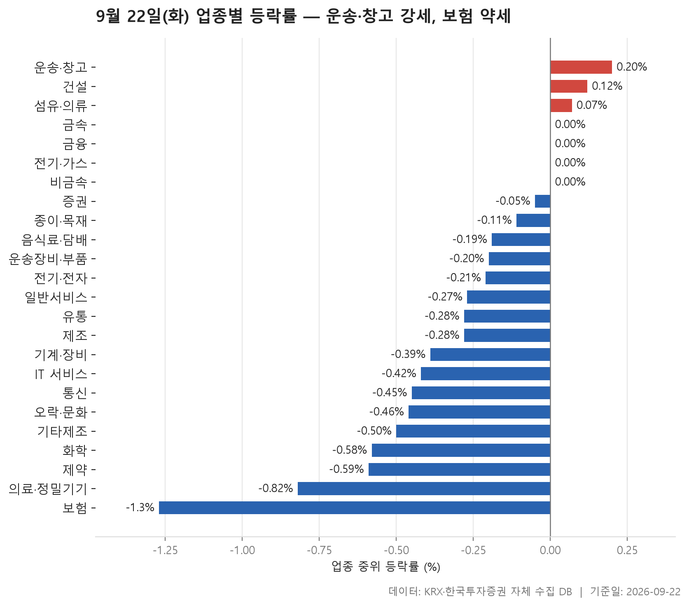
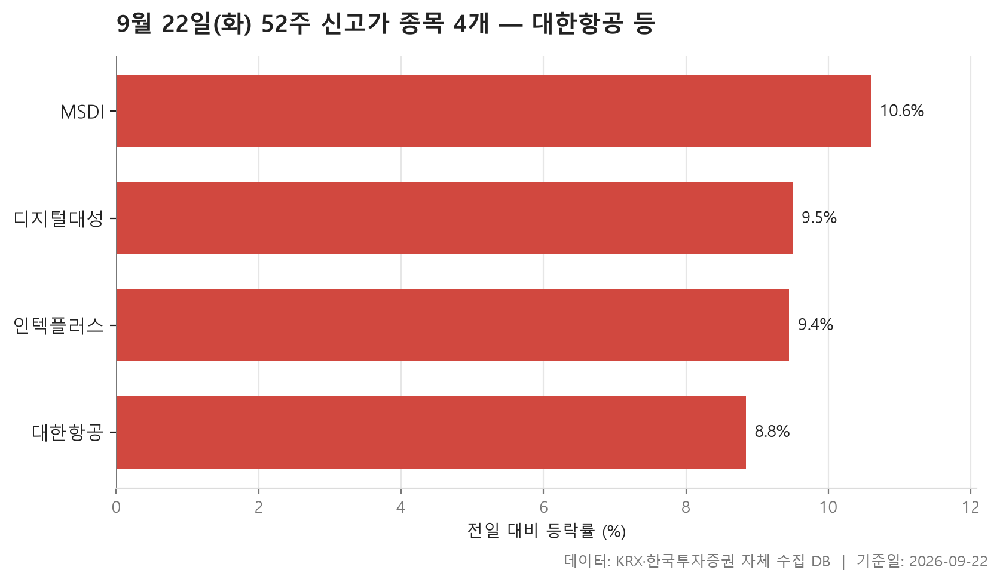
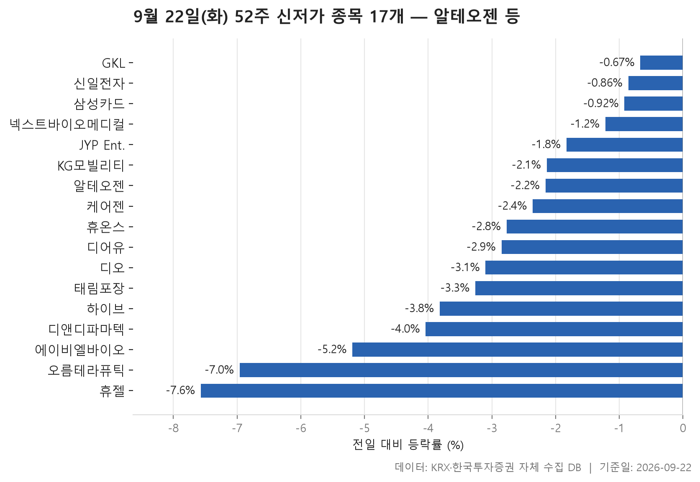
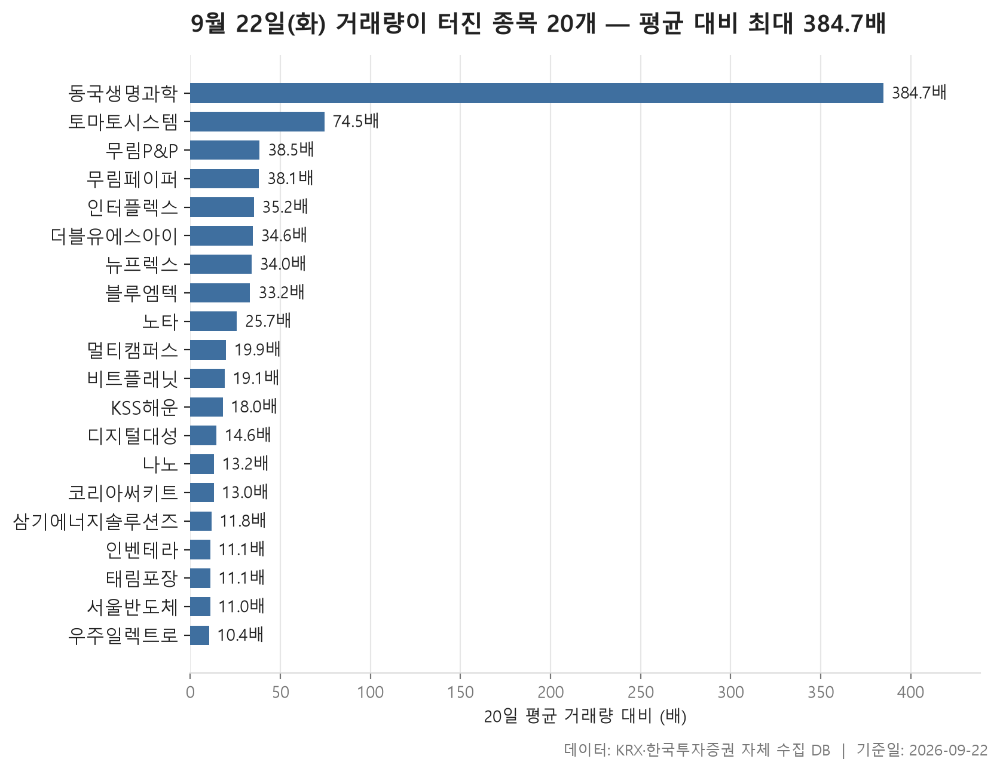

9월 22일 화요일 장을 마감 데이터로 훑어보면, 한쪽으로 크게 쏠린 날은 아니었지만 방향은 분명히 아래쪽이었습니다. 24개 업종의 중위 등락률을 한 줄로 세웠을 때 한가운데 놓인 값이 -0.24%. 크게 무너진 수치는 아닙니다. 다만 24개 업종 가운데 중위값이 플러스로 끝난 곳은 3개뿐이고 17개가 마이너스였다는 점에서, 시장 전반이 조금씩 눌린 하루였다고 보는 편이 맞겠습니다.

가장 위에 놓인 업종은 운송·창고로 +0.20%, 가장 아래는 보험으로 -1.27%였습니다. 맨 위와 맨 아래의 간격이 그리 넓지 않다는 것도 오늘의 성격을 말해 줍니다. 특정 업종이 시장을 끌고 간 날이라기보다, 대부분이 얕게 흘러내리는 가운데 몇 곳만 수면 위에 머물렀습니다.

오늘 글에서는 네 장의 표를 차례로 봅니다. 업종별 등락 분포, 52주 최고가를 넘어선 종목과 최저가를 밑돈 종목, 그리고 평소 거래량의 몇 배가 한꺼번에 터진 종목들입니다. 지수 하나로는 보이지 않는 오늘 시장의 결이 이 네 장에서 드러납니다.

> 기준일: 2026-09-22 · 집계: 자체 수집 데이터베이스

## 업종 등락률 — 24개 중 17개 하락

먼저 표의 위쪽입니다. 운송·창고가 중위 +0.20%로 가장 높고, 건설이 +0.12%, 섬유·의류가 +0.07%로 뒤를 잇습니다. 플러스로 끝난 업종은 여기까지이고, 그다음 네 곳은 0.00%에 정확히 걸려 있습니다. 즉 오늘 플러스로 불린 업종은 사실상 셋뿐이었고, 그마저도 소수점 아래에서 갈린 차이였습니다. 상승비율을 함께 보면 그림이 조금 더 또렷해집니다. 운송·창고는 소속 종목의 절반 이상이 상승으로 마감했고 건설도 비슷했는데, 그 아래 업종들부터는 오른 종목이 절반에 못 미칩니다.

표에서 눈길이 가는 곳은 중위값과 평균이 벌어진 업종들입니다. 섬유·의류는 한가운데 놓인 값이 +0.07%인데 평균은 +0.68%입니다. 이 업종에서 가장 크게 움직인 종목 하나가 +29.93%로 마감했고, 그 한 종목이 업종 평균을 0.64%p 올린 것으로 집계됩니다. 격차와 기여도가 거의 겹치니, 평균을 만든 것은 그 종목 하나였다고 읽어도 무리가 없습니다. 제조업종도 비슷합니다. 종목이 7개뿐이라 한 종목의 영향이 클 수밖에 없는데, 중위값은 -0.28%인 반면 평균은 +0.41%로 부호 자체가 갈립니다. 평균만 보고 업종의 분위기를 짐작하면 안 되는 이유가 여기 있습니다.

반대쪽도 흥미롭습니다. 기계·장비는 중위값이 -0.39%인데 평균은 +0.01%입니다. 가장 크게 움직인 종목이 -30.00%로 끝나 평균을 오히려 0.15%p 끌어내렸는데도 평균이 0 근처에 머물렀다는 것은, 위쪽에서 평균을 떠받친 다른 종목들이 따로 있었다는 뜻입니다. 전기·전자와 일반서비스도 중위값은 마이너스인데 평균은 0 언저리라 결이 같습니다. 중간값은 내려가고 평균은 버티는 모양은, 대다수가 조금씩 밀리는 가운데 소수가 크게 움직였을 때 나옵니다.

가장 약한 쪽은 보험이었습니다. 중위값 -1.27%에 상승비율도 24개 업종 가운데 가장 낮아, 열 곳 중 두 곳이 채 오르지 못했습니다. 통신 역시 중위 -0.45%에 평균 -1.41%로 아래쪽이 더 길게 늘어졌고, 제약은 오른 종목이 넷 중 하나꼴에 그쳤습니다. 다만 제약은 중위값과 평균이 둘 다 -0.59%로 붙어 있어, 특정 종목이 아니라 업종 전반이 고르게 밀린 형태에 가깝습니다. 거래대금 쪽을 보면 전기·전자 한 업종에만 182,491.90억원이 몰려 있어, 관심의 무게중심 자체는 오늘도 그쪽에 있었다는 점은 기억해 둘 만합니다.

| 업종 | 종목수(개) | 중위등락률(%) | 평균등락률(%) | 상승비율(%) | 주도종목 | 주도종목등락률(%) | 평균기여도(%p) | 거래대금합계(억원) |
|---|---|---|---|---|---|---|---|---|
| 운송·창고 | 28 | +0.20 | +0.80 | 53.60 | 대한항공 | +8.84 | 0.32 | 2,982.10 |
| 건설 | 51 | +0.12 | -0.02 | 51.00 | 현대건설 | +4.54 | 0.09 | 4,800.30 |
| 섬유·의류 | 47 | +0.07 | +0.68 | 51.10 | 씨싸이트 | +29.93 | 0.64 | 279.50 |
| 금속 | 130 | 0.00 | +0.29 | 45.40 | 삼미금속 | +21.76 | 0.17 | 8,094.40 |
| 금융 | 111 | 0.00 | +0.04 | 45.90 | 스틱인베스트먼트 | +5.90 | 0.05 | 17,412.30 |
| 전기·가스 | 10 | 0.00 | -0.22 | 30.00 | SGC에너지 | -2.05 | -0.21 | 477.50 |
| 비금속 | 36 | 0.00 | -0.27 | 44.40 | 국영지앤엠 | -24.77 | -0.69 | 407.30 |
| 증권 | 18 | -0.05 | -0.02 | 44.40 | 삼성증권 | +2.83 | 0.16 | 1,668.80 |
| 종이·목재 | 25 | -0.11 | +0.18 | 48.00 | 무림P&P | +11.28 | 0.45 | 282.70 |
| 음식료·담배 | 83 | -0.19 | -0.47 | 33.70 | 한울앤제주 | -6.55 | -0.08 | 1,786.00 |
| 운송장비·부품 | 133 | -0.20 | -0.24 | 37.60 | 네오티스 | +13.11 | 0.10 | 8,766.70 |
| 전기·전자 | 364 | -0.21 | -0.02 | 43.10 | 세진티에스 | -29.90 | -0.08 | 182,491.90 |
| 일반서비스 | 168 | -0.27 | +0.01 | 41.70 | 셀리드 | +29.95 | 0.18 | 8,301.10 |
| 유통 | 156 | -0.28 | -0.16 | 34.60 | 더블유에스아이 | +29.94 | 0.19 | 4,084.70 |
| 제조 | 7 | -0.28 | +0.41 | 28.60 | 지누스 | +3.30 | 0.47 | 5.80 |
| 기계·장비 | 206 | -0.39 | +0.01 | 38.80 | KS인더스트리 | -30.00 | -0.15 | 19,142.10 |
| IT 서비스 | 246 | -0.42 | -0.35 | 37.00 | 토마토시스템 | +30.00 | 0.12 | 12,359.70 |
| 통신 | 13 | -0.45 | -1.41 | 23.10 | 프리티 | -6.37 | -0.49 | 1,092.50 |
| 오락·문화 | 66 | -0.46 | -0.66 | 31.80 | 캔버스엔 | -15.96 | -0.24 | 1,002.30 |
| 기타제조 | 14 | -0.50 | -0.28 | 28.60 | 피코그램 | +6.70 | 0.48 | 17.80 |
| 화학 | 220 | -0.58 | -0.60 | 31.40 | 예선테크 | -17.28 | -0.08 | 8,579.10 |
| 제약 | 165 | -0.59 | -0.59 | 25.50 | 동국생명과학 | +29.98 | 0.18 | 5,326.60 |
| 의료·정밀기기 | 100 | -0.82 | -0.86 | 28.00 | 플라즈맵 | +11.71 | 0.12 | 2,869.30 |
| 보험 | 11 | -1.27 | -1.05 | 18.20 | 한화손해보험 | -3.47 | -0.32 | 2,082.80 |

## 52주 신고가 4개 — 최고 MSDI 10.60%

52주 최고가를 새로 쓴 보통주는 4개뿐이었습니다. 시가총액 500억원, 거래대금 3억원이라는 문턱을 걸어 둔 집계임을 감안해도 숫자가 적습니다. 업종 표에서 본 대로 대부분이 아래로 눌린 날이었으니, 신고가 명단이 얇은 것은 이상한 일이 아닙니다.

네 종목의 전일 대비 등락률은 +8.84%에서 +10.60% 사이에 모여 있습니다. 중간에 놓인 값은 +9.47%. 폭이 좁다는 점이 오히려 특징인데, 어느 한 종목이 극적으로 튀어서 기록을 갈아치운 경우가 아니라 네 곳이 비슷한 폭으로 올라간 모양입니다. 이전 최고가와 오늘 종가의 간격은 종목마다 제각각입니다. 인텍플러스는 직전 고점 54,100원을 종가 55,600원으로 넘어졌고, MSDI는 3,325원에 대해 3,340원으로 간신히 걸쳤습니다. 신고가라는 한 단어 안에 여유 있게 넘은 것과 스치듯 걸친 것이 섞여 있다는 뜻이죠.

시장은 KOSPI 1개, KOSDAQ 3개로 갈렸고 업종은 넷이 모두 다릅니다. 덩치 차이도 큽니다. 가장 큰 대한항공이 115,621.30억원인 반면 가장 작은 MSDI는 675.20억원으로, 같은 표 안에 있지만 규모의 층위는 전혀 다릅니다. 거래대금도 대한항공에 2,252.80억원이 몰린 반면 나머지 셋은 수십억원 안팎에 머물렀습니다. 오늘 업종 순위 맨 위에 운송·창고가 자리한 배경에 이 종목의 +8.84%가 있었다는 점은 두 표를 나란히 놓으면 바로 보입니다.

| 종목명 | 종목코드 | 시장 | 업종 | 종가(원) | 등락률(%) | 이전52주최고(원) | 거래대금(억원) | 시가총액(억원) |
|---|---|---|---|---|---|---|---|---|
| 대한항공 | 003490 | KOSPI | 운송·창고 | 31,400 | +8.84 | 31,200 | 2,252.80 | 115,621.30 |
| 인텍플러스 | 064290 | KOSDAQ | 기계·장비 | 55,600 | +9.45 | 54,100 | 388.80 | 7,204.40 |
| 디지털대성 | 068930 | KOSDAQ | 일반서비스 | 9,570 | +9.50 | 9,180 | 39.20 | 2,648.50 |
| MSDI | 123010 | KOSDAQ | 전기·전자 | 3,340 | +10.60 | 3,325 | 23.70 | 675.20 |

## 52주 신저가 17개 — 최저 휴젤 -7.57%

반대편 명단는 17개로 훨씬 두껍습니다. 신고가 4개 대 신저가 17개라는 숫자 자체가 오늘의 무게중심을 보여 줍니다. 시장별로는 KOSPI 6개, KOSDAQ 11개이고 업종은 9개로 흩어져 있는데, 그중 제약이 5개로 가장 많습니다. 업종 표에서 제약의 상승비율이 넷 중 하나꼴에 그쳤던 것과 앞뒤가 맞습니다.

등락률 분포는 꽤 넓습니다. 가장 덜 내린 GKL이 -0.67%, 가장 크게 내린 휴젤이 -7.57%이고, 한가운데 놓인 값은 -2.77%였습니다. 여기서 눈여겨볼 대목은 하루 낙폭이 작은 종목들도 명단에 올랐다는 점입니다. 1% 미만으로 내렸는데 52주 최저가를 밑돌았다는 것은, 오늘 크게 밀려서가 아니라 이미 직전 바닥 바로 위에 있던 가격이 한 칸 더 내려앉았다는 뜻입니다. 삼성카드, 신일전자, GKL이 그런 경우에 가깝습니다.

반대로 휴젤은 이전 52주 최저가가 205,000원이었는데 오늘 종가가 190,400원입니다. 바닥을 살짝 스친 게 아니라 한 번에 크게 내려섰죠. 에이비엘바이오가 -5.19%, 오름테라퓨틱이 -6.96%로 하루 낙폭이 컸기 때문에, 같은 신저가라도 성격이 다릅니다. 시가총액이 가장 큰 알테오젠은 173,789.60억원 규모인데 종가 249,500원으로 직전 최저가 250,500원을 간신힌 차이로 밑돌았고, 하루 등락률은 -2.16%였습니다. 덩치와 낙폭이 꼭 비례하지 않는다는 것도 이 표가 보여 주는 부분입니다.

업종 분포를 한 번 더 보면, 제약 다음으로 오락·문화가 눈에 띕니다. 오락·문화는 업종 표에서도 중위 -0.46%에 오른 종목이 셋 중 하나에 못 미쳤던 곳입니다. 거래대금 쪽은 대체로 한산한 편이어서, 많은 종목이 큰 거래 없이 조용히 바닥을 낮췄습니다. 왜 그런 가격이 나왔는지는 이 표만으로는 알 수 없고, 여기서 말할 수 있는 것은 위치뿐입니다.

| 종목명 | 종목코드 | 시장 | 업종 | 종가(원) | 등락률(%) | 이전52주최저(원) | 거래대금(억원) | 시가총액(억원) |
|---|---|---|---|---|---|---|---|---|
| 알테오젠 | 196170 | KOSDAQ | 일반서비스 | 249,500 | -2.16 | 250,500 | 698.20 | 173,789.60 |
| 하이브 | 352820 | KOSPI | 오락·문화 | 156,300 | -3.82 | 157,900 | 587.50 | 67,376.00 |
| 삼성카드 | 029780 | KOSPI | 금융 | 42,850 | -0.92 | 43,150 | 66.30 | 49,645.50 |
| 에이비엘바이오 | 298380 | KOSDAQ | 제약 | 51,100 | -5.19 | 53,300 | 237.20 | 28,609.60 |
| 휴젤 | 145020 | KOSDAQ | 제약 | 190,400 | -7.57 | 205,000 | 393.90 | 23,828.90 |
| 케어젠 | 214370 | KOSDAQ | 제약 | 39,350 | -2.36 | 39,550 | 21.80 | 21,136.90 |
| 디앤디파마텍 | 347850 | KOSDAQ | 일반서비스 | 42,800 | -4.04 | 44,000 | 279.30 | 19,686.40 |
| JYP Ent. | 035900 | KOSDAQ | 오락·문화 | 37,500 | -1.83 | 38,050 | 71.60 | 13,324.70 |
| 오름테라퓨틱 | 475830 | KOSDAQ | 제약 | 25,400 | -6.96 | 26,200 | 372.70 | 5,525.20 |
| GKL | 114090 | KOSPI | 오락·문화 | 8,880 | -0.67 | 8,930 | 5.80 | 5,492.80 |
| KG모빌리티 | 003620 | KOSPI | 운송장비·부품 | 2,515 | -2.14 | 2,525 | 15.30 | 5,089.70 |
| 디어유 | 376300 | KOSDAQ | IT 서비스 | 16,710 | -2.85 | 16,980 | 8.10 | 3,966.70 |
| 넥스트바이오메디컬 | 389650 | KOSDAQ | 의료·정밀기기 | 28,300 | -1.22 | 28,400 | 7.20 | 2,342.50 |
| 휴온스 | 243070 | KOSDAQ | 제약 | 18,950 | -2.77 | 19,450 | 12.10 | 2,270.10 |
| 디오 | 039840 | KOSDAQ | 의료·정밀기기 | 9,680 | -3.10 | 9,730 | 5.70 | 1,298.70 |
| 태림포장 | 011280 | KOSPI | 종이·목재 | 1,396 | -3.26 | 1,442 | 4.80 | 988.50 |
| 신일전자 | 002700 | KOSPI | 유통 | 926 | -0.86 | 933 | 4.80 | 634.80 |

## 거래량 급증 20개 — 최고 동국생명과학 384.70배

마지막 표는 평소와 다른 거래량이 터진 곳들입니다. 직전 20거래일 평균의 5배를 기준선으로 걸었는데, 실제로 걸러진 20개의 배수 중간값은 19.50배였습니다. 기준선을 훨씬 웃도는 수준이 한가운데라는 뜻이니, 명단에 올랐다면 대체로 조금 늘었다기보다 완전히 다른 날이었다에 가깝습니다.

맨 위 동국생명과학은 384.70배로 다른 종목들과 자릿수가 다릅니다. 20거래일 평균 거래량이 37,141주였는데 이날만 14,286,739주가 오갔고 종가는 +29.98%. 그다음 토마토시스템이 74.50배이고, 그 아래로는 38.50배, 38.10배, 35.20배 식으로 완만하게 내려옵니다. 맨 아래 우주일렉트로가 10.40배이니, 위의 꼭대기 하나를 제외하면 나머지는 비교적 고르게 이어진 셈입니다.

등락률 옆을 보면 +29.98%, +30.00%, +29.94%, +29.97%처럼 상한가 부근에서 마감한 종목이 여럿이고, 두 자릿수 등락률도 섞여 있습니다. 다만 거래량이 터졌다고 등락률이 항상 플러스인 것은 아닙니다. 나노는 13.20배가 거래되고도 -0.66%로 마감했고, 태림포장은 11.10배에 -3.26%였습니다. 태림포장은 앞의 신저가 표에도 이름이 있었으니, 거래가 몰린 방향이 아래였던 경우입니다. KSS해운도 18.00배가 오갔지만 종가는 +0.30%에 그쳐, 거래량과 가격이 따로 움직인 사례로 볼 수 있습니다.

덩치로 보면 코리아써키트가 15,732.60억원으로 가장 크고, 거래대금도 1,954.00억원으로 이 표에서 가장 많습니다. 배수는 13.00배로 중간값보다 낮은데 종가는 +25.43%였으니, 배수는 낮아도 실제로 오간 금액은 가장 컸습니다. 반대로 멀티캠퍼스는 19.90배라는 높은 배수에도 거래대금은 20.30억원에 그칩니다. 배수는 평소 대비를 재는 값이지 규모를 재는 값이 아니라는 점을 이 두 종목이 나란히 보여 줍니다. 업종 분포는 전기·전자가 5개로 가장 많고, 종이·목재와 IT 서비스도 여럿 이름을 올렸습니다. 종이·목재는 업종 표에서 중위 -0.11%로 조용했는데 개별 종목 단위에서는 거래가 크게 붙었다는 점이 서로 엇갈립니다.

| 종목명 | 종목코드 | 시장 | 업종 | 종가(원) | 등락률(%) | 거래량(주) | 평균거래량(주) | 배수(배) | 거래대금(억원) | 시가총액(억원) |
|---|---|---|---|---|---|---|---|---|---|---|
| 동국생명과학 | 303810 | KOSDAQ | 제약 | 3,035 | +29.98 | 14,286,739 | 37,141 | 384.70 | 404.70 | 970.70 |
| 토마토시스템 | 393210 | KOSDAQ | IT 서비스 | 3,315 | +30.00 | 4,435,367 | 59,566 | 74.50 | 137.90 | 517.60 |
| 무림P&P | 009580 | KOSPI | 종이·목재 | 1,815 | +11.28 | 11,874,644 | 308,088 | 38.50 | 229.50 | 1,132.00 |
| 무림페이퍼 | 009200 | KOSPI | 종이·목재 | 1,503 | +3.51 | 1,290,169 | 33,853 | 38.10 | 20.20 | 625.40 |
| 인터플렉스 | 051370 | KOSDAQ | 전기·전자 | 7,130 | +13.90 | 2,331,316 | 66,286 | 35.20 | 169.90 | 1,663.20 |
| 더블유에스아이 | 299170 | KOSDAQ | 유통 | 1,545 | +29.94 | 3,851,327 | 111,386 | 34.60 | 58.20 | 641.30 |
| 뉴프렉스 | 085670 | KOSDAQ | 전기·전자 | 3,090 | +6.74 | 1,360,465 | 39,973 | 34.00 | 43.80 | 757.10 |
| 블루엠텍 | 439580 | KOSDAQ | 유통 | 3,120 | +13.87 | 8,973,030 | 269,951 | 33.20 | 283.60 | 1,056.00 |
| 노타 | 486990 | KOSDAQ | IT 서비스 | 22,550 | +29.97 | 2,447,794 | 95,100 | 25.70 | 526.50 | 4,824.00 |
| 멀티캠퍼스 | 067280 | KOSDAQ | 일반서비스 | 25,350 | +9.50 | 80,171 | 4,037 | 19.90 | 20.30 | 1,502.40 |
| 비트플래닛 | 049470 | KOSDAQ | IT 서비스 | 3,180 | +15.43 | 4,410,725 | 231,120 | 19.10 | 145.20 | 748.70 |
| KSS해운 | 044450 | KOSPI | 운송·창고 | 10,060 | +0.30 | 658,877 | 36,640 | 18.00 | 75.80 | 2,271.30 |
| 디지털대성 | 068930 | KOSDAQ | 일반서비스 | 9,570 | +9.50 | 411,748 | 28,175 | 14.60 | 39.20 | 2,648.50 |
| 나노 | 187790 | KOSDAQ | 화학 | 3,005 | -0.66 | 1,739,897 | 131,880 | 13.20 | 57.30 | 926.80 |
| 코리아써키트 | 007810 | KOSPI | 전기·전자 | 65,600 | +25.43 | 2,974,905 | 228,910 | 13.00 | 1,954.00 | 15,732.60 |
| 삼기에너지솔루션즈 | 419050 | KOSDAQ | 운송장비·부품 | 1,603 | +5.18 | 8,027,349 | 682,018 | 11.80 | 137.00 | 916.90 |
| 인벤테라 | 0007J0 | KOSDAQ | 일반서비스 | 13,800 | +18.86 | 2,771,404 | 250,491 | 11.10 | 382.70 | 1,085.50 |
| 태림포장 | 011280 | KOSPI | 종이·목재 | 1,396 | -3.26 | 345,911 | 31,185 | 11.10 | 4.80 | 988.50 |
| 서울반도체 | 046890 | KOSDAQ | 전기·전자 | 10,440 | +2.86 | 1,567,749 | 142,280 | 11.00 | 170.70 | 6,087.10 |
| 우주일렉트로 | 065680 | KOSDAQ | 전기·전자 | 25,750 | +16.52 | 147,693 | 14,222 | 10.40 | 38.30 | 2,379.40 |

## 정리

정리하면 9월 22일은 대부분의 업종이 0 아래에서 얕게 밀리는 가운데, 신고가 4개와 신저가 17개가 방향을 확인해 준 하루였습니다. 업종 맨 위와 맨 아래의 간격이 좁았다는 점, 그러면서도 몇몇 업종에서 중위값과 평균이 반대로 갈렸다는 점이 오늘 표의 핵심입니다. 평균 하나만 보면 놓치는 장면이 여럿 있었습니다.

다만 여기 적은 내용은 모두 하루치 종가와 거래량을 정리한 결과일 뿐입니다. 어떤 종목이 왜 상한가에 갔는지, 왜 52주 최저가를 밑돌았는지에 대한 설명은 이 데이터 안에 없고, 저도 추측해서 채워 넣지 않았습니다. 거래량 배수나 신고가·신저가 여부는 과거 구간과 비교한 위치를 알려 줄 뿐 앞으로의 방향과는 별개입니다. 숫자가 어디에 서 있는지를 확인하는 용도로만 참고해 주시기 바랍니다.

## 집계 기준

**업종 등락률**

- **기준**: 2026-09-21 종가 → 2026-09-22 종가
- **순위**: 업종 내 종목 등락률의 중위값 (평균은 참고용으로 함께 표시)
- **주도종목**: 그 업종에서 등락률 절대값이 가장 큰 종목 (동점이면 거래대금이 큰 쪽)
- **평균기여도**: 그 종목 하나가 업종 평균을 움직인 폭 (등락률 ÷ 종목수). 중위값과 평균의 격차가 이 값에 가까우면 평균을 만든 것이 그 종목이고, 훨씬 크면 다른 종목들도 함께 움직인 것입니다
- **필터**: 업종 내 보통주 5종목 이상
- **전체업종중위등락률(%)**: -0.24

**52주 신고가**

- **기준**: 종가 > 직전 52주 최고가
- **관측구간**: 2025-09-09 ~ 2026-09-21 (252거래일)
- **필터**: 시가총액 500억 이상, 거래대금 3억 이상, 보통주

**52주 신저가**

- **기준**: 종가 < 직전 52주 최저가
- **관측구간**: 2025-09-09 ~ 2026-09-21 (252거래일)
- **필터**: 시가총액 500억 이상, 거래대금 3억 이상, 보통주

**거래량 급증**

- **기준**: 당일 거래량 ≥ 직전 20거래일 평균 × 5
- **관측구간**: 2026-08-25 ~ 2026-09-21 (20거래일)
- **필터**: 시가총액 500억 이상, 거래대금 3억 이상, 보통주

## 데이터 출처 및 유의사항

- **데이터출처**: 한국거래소(KRX) 공시 데이터와 한국투자증권 OpenAPI 를 직접 수집해 구축한 자체 데이터베이스
- **집계방식**: 수집·집계·차트 생성을 직접 구현한 파이프라인에서 자동 산출
- **작성고지**: 본문의 표·통계·차트는 자체 데이터베이스에서 계산된 값이며, 문장 작성 과정에 AI 도구를 활용했습니다.
- **면책**: 본 글은 정보 제공을 목적으로 하며 특정 종목의 매수·매도를 추천하지 않습니다. 제시된 수치는 과거 데이터이고 미래 수익을 보장하지 않습니다. 투자 판단과 그 결과에 대한 책임은 투자자 본인에게 있습니다.

