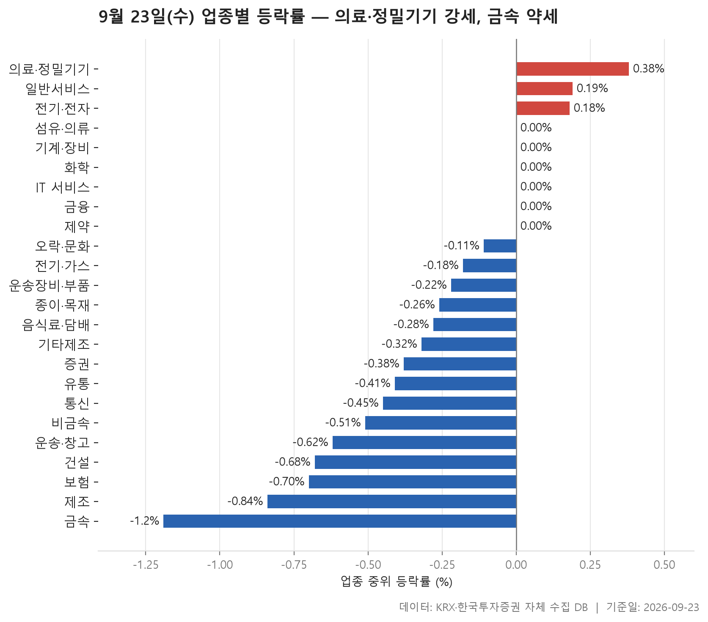
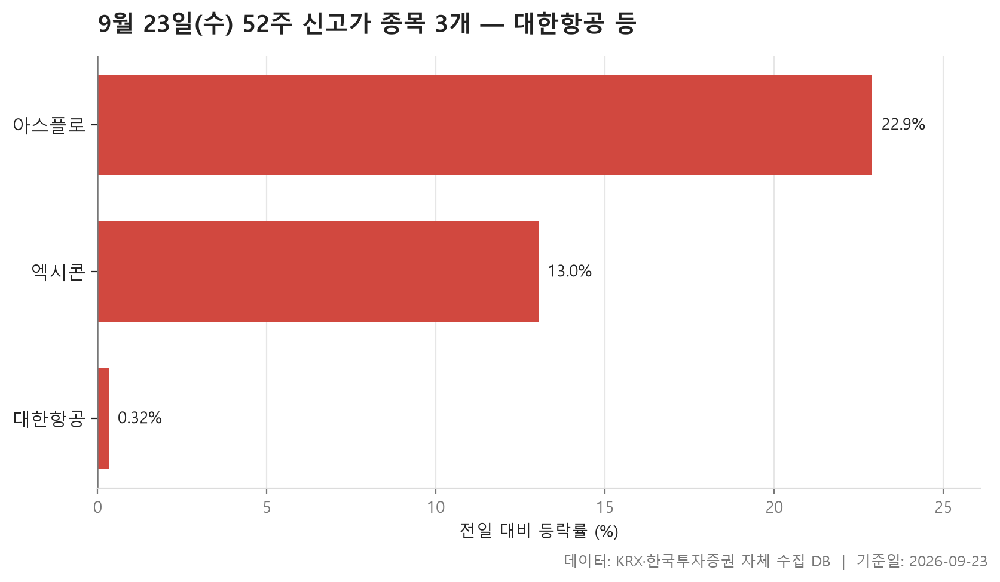
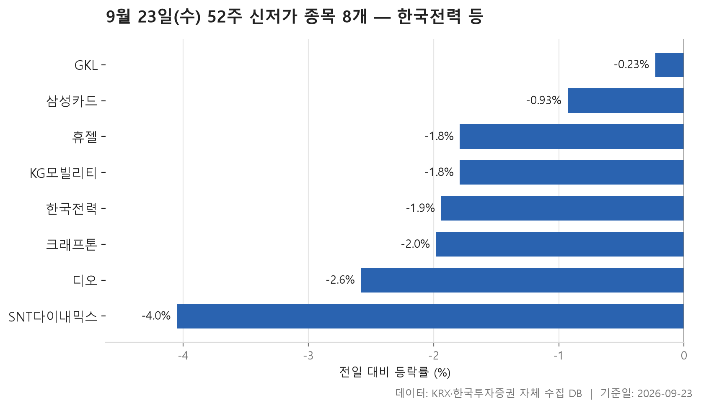
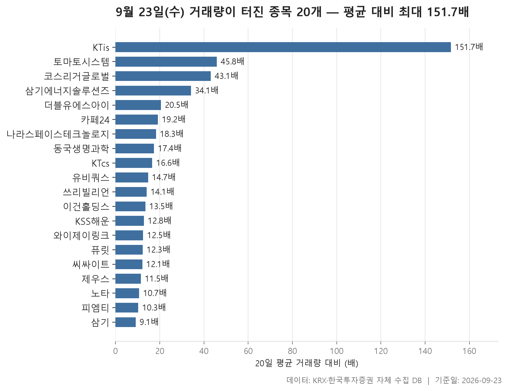

9월 23일 시장은 크게 흔들리지 않았지만 아래쪽으로 조금 기운 하루였습니다. 24개 업종의 중위 등락률을 늘어놓으면 한가운데 값이 -0.24%입니다. 중위값이 플러스인 업종은 3개에 그쳤고 마이너스인 업종은 15개였으며, 나머지는 보합이었습니다. 가장 강한 업종은 의료·정밀기기(+0.38%), 가장 약한 업종은 금속(-1.19%)이었습니다. 위아래 폭이 모두 좁아서, 업종 단위로 보면 크게 움직였다고 하기 어려운 날입니다.

그런데 업종 안을 들여다보면 모양이 다릅니다. 가운데 종목은 제자리인데 평균은 올라가 있는 업종이 여럿이고, 업종 하나를 혼자 흔든 종목도 보입니다. 오늘 글은 업종 흐름부터 살펴보고, 52주 신고가 3종목과 신저가 8종목을 본 뒤, 거래량이 평소의 다섯 배를 넘은 20종목으로 마무리합니다.

> 기준일: 2026-09-23 · 집계: 자체 수집 데이터베이스

## 업종 등락률 — 24개 중 15개 하락

먼저 위쪽입니다. 중위값이 플러스인 곳은 의료·정밀기기, 일반서비스, 전기·전자 세 업종뿐이고, 그마저 +0.38%, +0.19%, +0.18%로 폭이 작습니다. 오른 종목 비율도 59.60%, 54.20%, 53.00%로 절반을 조금 넘는 데 그쳤습니다. 전기·전자는 거래대금이 149,439.70억원으로 다른 업종과 비교가 안 될 만큼 컸지만, 364종목 가운데 절반 남짓이 올랐을 뿐이어서 돈이 몰린 것과 별개로 방향이 한쪽으로 쏠리지는 않았습니다.

눈여겨볼 곳은 그 바로 아래입니다. 섬유·의류, 기계·장비, 화학, IT 서비스 같은 업종은 중위값이 0.00%인데 평균은 모두 플러스여서, 섬유·의류는 +0.61%, 기계·장비는 +0.60%입니다. 가운데 종목은 제자리인데 평균이 올라가 있다면 크게 오른 종목 몇 개가 평균을 끌어올렸다는 뜻입니다. 기계·장비에서 가장 크게 움직인 아스플로는 +22.89% 올랐지만, 이 종목 하나가 업종 평균을 끌어올린 폭은 0.11%p에 그칩니다. 평균을 올린 것은 한 종목이 아니라 여러 종목이 함께 오른 결과로 봐야 합니다.

반대로 종목 하나가 업종 평균을 흔든 곳도 있습니다. 기타제조는 중위값이 -0.32%인데 평균은 +0.23%로 부호가 뒤집혀 있고, 세니젠(+10.11%) 한 종목이 평균을 0.72%p 끌어올렸습니다. 14종목뿐인 작은 업종이라 한 종목의 무게가 큰 것입니다. 전기·가스는 그 반대 경우입니다. 중위값은 -0.18%에 그쳤는데 평균은 -0.93%로 내려가 있고, SGC에너지(-6.86%)가 평균을 0.69%p 끌어내렸습니다. 중위값과 평균 사이의 거리가 이 종목의 몫과 비슷하니, 평균을 끌어내린 것은 사실상 이 종목 하나입니다.

맨 아래 금속은 중위값과 평균이 똑같이 -1.19%이고, 오른 종목은 21.50%로 다섯 곳 중 한 곳꼴이었습니다. HT로보틱스가 +29.95% 올랐지만 130종목 사이에서 평균을 0.23%p 올리는 데 그쳐 흐름을 바꾸지 못했습니다. 보험은 오른 종목 비율이 9.10%로 11종목 가운데 한 곳만 올랐고, 제조는 7종목 중 오른 종목이 하나도 없었습니다.

| 업종 | 종목수(개) | 중위등락률(%) | 평균등락률(%) | 상승비율(%) | 주도종목 | 주도종목등락률(%) | 평균기여도(%p) | 거래대금합계(억원) |
|---|---|---|---|---|---|---|---|---|
| 의료·정밀기기 | 99 | +0.38 | +0.82 | 59.60 | 레메디 | +21.46 | 0.22 | 3,582.60 |
| 일반서비스 | 168 | +0.19 | +0.40 | 54.20 | 쓰리빌리언 | +23.27 | 0.14 | 5,401.90 |
| 전기·전자 | 364 | +0.18 | +0.58 | 53.00 | 우리넷 | +29.90 | 0.08 | 149,439.70 |
| 섬유·의류 | 46 | 0.00 | +0.61 | 47.80 | 씨싸이트 | +12.88 | 0.28 | 296.00 |
| 기계·장비 | 205 | 0.00 | +0.60 | 45.90 | 아스플로 | +22.89 | 0.11 | 21,221.60 |
| 화학 | 220 | 0.00 | +0.52 | 48.20 | SH에너지화학 | +23.11 | 0.11 | 11,541.70 |
| IT 서비스 | 247 | 0.00 | +0.39 | 49.80 | 토마토시스템 | +22.47 | 0.09 | 14,381.90 |
| 금융 | 111 | 0.00 | +0.13 | 47.70 | OCI홀딩스 | +9.57 | 0.09 | 17,564.30 |
| 제약 | 166 | 0.00 | +0.06 | 44.60 | 지놈앤컴퍼니 | +14.30 | 0.09 | 4,505.60 |
| 오락·문화 | 66 | -0.11 | +0.40 | 45.50 | 티엔엔터테인먼트 | +30.00 | 0.45 | 688.40 |
| 전기·가스 | 10 | -0.18 | -0.93 | 40.00 | SGC에너지 | -6.86 | -0.69 | 637.30 |
| 운송장비·부품 | 133 | -0.22 | -0.13 | 39.10 | 삼기에너지솔루션즈 | +20.77 | 0.16 | 10,939.40 |
| 종이·목재 | 25 | -0.26 | -0.22 | 36.00 | 이건홀딩스 | +3.65 | 0.15 | 139.80 |
| 음식료·담배 | 83 | -0.28 | -0.33 | 31.30 | 프롬바이오 | -8.13 | -0.10 | 1,571.80 |
| 기타제조 | 14 | -0.32 | +0.23 | 35.70 | 세니젠 | +10.11 | 0.72 | 15.20 |
| 증권 | 18 | -0.38 | -0.31 | 38.90 | 미래에셋증권 | -1.83 | -0.10 | 1,029.30 |
| 유통 | 155 | -0.41 | -0.56 | 36.10 | 윙스풋 | -15.89 | -0.10 | 4,242.90 |
| 통신 | 13 | -0.45 | -0.33 | 30.80 | 더즌 | +3.54 | 0.27 | 789.20 |
| 비금속 | 36 | -0.51 | -0.39 | 36.10 | 국영지앤엠 | -13.69 | -0.38 | 467.90 |
| 운송·창고 | 28 | -0.62 | -0.30 | 28.60 | KSS해운 | +17.89 | 0.64 | 2,200.00 |
| 건설 | 51 | -0.68 | -1.16 | 33.30 | 현대건설 | -7.77 | -0.15 | 4,740.60 |
| 보험 | 11 | -0.70 | -0.72 | 9.10 | 한화손해보험 | -2.31 | -0.21 | 1,713.30 |
| 제조 | 7 | -0.84 | -1.10 | 0.00 | 지누스 | -2.26 | -0.32 | 5.80 |
| 금속 | 130 | -1.19 | -1.19 | 21.50 | HT로보틱스 | +29.95 | 0.23 | 4,168.50 |

## 52주 신고가 3개 — 최고 아스플로 22.89%

52주 신고가는 3종목뿐입니다. 가장 눈에 띄는 것은 대한항공입니다. 이전 52주 최고가가 31,400원이었는데 종가가 31,500원이어서, 하루 +0.32% 오른 것만으로 기록을 넘었습니다. 시가총액은 115,989억원으로 나머지 두 종목과 규모가 크게 다릅니다. 이 종목이 속한 운송·창고 업종은 중위값이 -0.62%로 약한 편이었으니, 업종 흐름과는 따로 움직인 셈입니다.

나머지 두 종목은 모습이 전혀 다릅니다. 엑시콘(+13.03%)과 아스플로(+22.89%)는 둘 다 코스닥의 기계·장비 종목으로, 하루에 크게 뛰면서 이전 고점을 넘었습니다. 아스플로는 이전 최고가가 26,700원이었는데 29,800원에 마감해 고점을 넉넉히 넘겼습니다. 앞에서 본 기계·장비 업종의 중위값과 평균의 차이를 만든 오른 종목들 가운데 이 두 종목이 들어 있는 셈입니다.

신고가를 쓴 종목이 신저가 종목보다 적었다는 점도 업종표의 분위기와 같은 방향입니다.

| 종목명 | 종목코드 | 시장 | 업종 | 종가(원) | 등락률(%) | 이전52주최고(원) | 거래대금(억원) | 시가총액(억원) |
|---|---|---|---|---|---|---|---|---|
| 대한항공 | 003490 | KOSPI | 운송·창고 | 31,500 | +0.32 | 31,400 | 1,271.70 | 115,989 |
| 엑시콘 | 092870 | KOSDAQ | 기계·장비 | 42,950 | +13.03 | 41,700 | 488.90 | 5,605 |
| 아스플로 | 159010 | KOSDAQ | 기계·장비 | 29,800 | +22.89 | 26,700 | 266.80 | 3,974 |

## 52주 신저가 8개 — 최저 SNT다이내믹스 -4.05%

52주 신저가는 8종목이고 그중 코스피가 6종목입니다. 한국전력(시가총액 194,194억원), 크래프톤(90,914억원), 삼성카드(49,182억원)처럼 규모가 큰 종목이 윗줄을 차지한 것이 특징입니다. 신저가라고 하면 작은 종목을 떠올리기 쉽지만, 오늘 명단은 오히려 무거운 종목 쪽으로 기울어 있습니다.

하락 폭은 크지 않았습니다. 8종목의 하루 등락률 중위값이 -1.86%이고, 가장 많이 내린 SNT다이내믹스가 -4.05%, 가장 적게 내린 GKL은 -0.23%입니다. 이전 저점과의 차이도 작아서, 한국전력은 이전 최저가 30,400원 아래인 30,250원에, GKL은 8,880원 아래인 8,860원에 마감했습니다. 하루에 급락해서라기보다 조금씩 밀려 내려오다 저점을 살짝 밑돈 모습에 가깝습니다.

업종은 7개로 흩어져 있고 운송장비·부품만 SNT다이내믹스와 KG모빌리티 두 종목이 겹칩니다. 오늘 가장 강했던 의료·정밀기기에서도 디오가 신저가 명단에 올랐다는 점은 짚어 둘 만합니다. 업종 중위값이 좋다고 업종 안의 모든 종목이 같은 쪽으로 움직이지는 않았다는 뜻입니다. 다만 GKL과 디오는 거래대금이 4.30억원에 그쳐 거래가 한산한 가운데 나온 기록입니다.

| 종목명 | 종목코드 | 시장 | 업종 | 종가(원) | 등락률(%) | 이전52주최저(원) | 거래대금(억원) | 시가총액(억원) |
|---|---|---|---|---|---|---|---|---|
| 한국전력 | 015760 | KOSPI | 전기·가스 | 30,250 | -1.94 | 30,400 | 452.90 | 194,194 |
| 크래프톤 | 259960 | KOSPI | IT 서비스 | 198,000 | -1.98 | 198,400 | 106.40 | 90,914 |
| 삼성카드 | 029780 | KOSPI | 금융 | 42,450 | -0.93 | 42,600 | 42.80 | 49,182 |
| 휴젤 | 145020 | KOSDAQ | 제약 | 187,000 | -1.79 | 188,200 | 76.60 | 23,403 |
| SNT다이내믹스 | 003570 | KOSPI | 운송장비·부품 | 26,050 | -4.05 | 27,000 | 16.40 | 8,662 |
| GKL | 114090 | KOSPI | 오락·문화 | 8,860 | -0.23 | 8,880 | 4.30 | 5,480 |
| KG모빌리티 | 003620 | KOSPI | 운송장비·부품 | 2,470 | -1.79 | 2,510 | 14.00 | 4,999 |
| 디오 | 039840 | KOSDAQ | 의료·정밀기기 | 9,430 | -2.58 | 9,480 | 4.30 | 1,265 |

## 거래량 급증 20개 — 최고 KTis 151.70배

거래량이 직전 20거래일 평균의 다섯 배를 넘은 종목은 20개이고, 그중 17개가 코스닥입니다. 20종목의 배수 중위값은 14.40배인데, KTis 혼자 151.70배로 멀리 떨어져 있습니다. 평소 32,581주 정도였던 거래량이 4,944,098주로 불어났는데, 주가는 +5.10%로 거래량이 불어난 정도에 비해 덜 움직였습니다. 명단에서 배수가 가장 낮은 삼기도 9.10배입니다.

업종표와 겹치는 이름이 많습니다. 토마토시스템(+22.47%), 쓰리빌리언(+23.27%), 삼기에너지솔루션즈(+20.77%), KSS해운(+17.89%), 씨싸이트(+12.88%)는 모두 자기 업종에서 가장 크게 움직인 종목이었습니다. 업종 평균을 흔든 큰 폭의 등락에는 대부분 평소를 크게 넘는 거래가 함께 있었다는 뜻입니다.

다만 거래가 몰렸다고 해서 모두 오른 것은 아닙니다. 더블유에스아이(-11.91%), 노타(-9.76%), 동국생명과학(-7.74%)은 거래량이 급증한 채로 내렸습니다. 코스리거글로벌은 배수가 43.10배로 높지만 주가는 +0.17%에 그쳤고 거래대금도 5.50억원에 불과해, 평소 거래가 워낙 적었던 탓에 배수가 크게 잡힌 경우로 보입니다. 거래대금으로는 나라스페이스테크놀로지가 1,315.40억원으로 가장 컸습니다. 배수와 거래대금, 그리고 방향은 따로따로 봐야 합니다.

| 종목명 | 종목코드 | 시장 | 업종 | 종가(원) | 등락률(%) | 거래량(주) | 평균거래량(주) | 배수(배) | 거래대금(억원) | 시가총액(억원) |
|---|---|---|---|---|---|---|---|---|---|---|
| KTis | 058860 | KOSPI | IT 서비스 | 2,575 | +5.10 | 4,944,098 | 32,581 | 151.70 | 135.80 | 896 |
| 토마토시스템 | 393210 | KOSDAQ | IT 서비스 | 4,060 | +22.47 | 12,841,354 | 280,382 | 45.80 | 513.10 | 634 |
| 코스리거글로벌 | 043710 | KOSDAQ | 유통 | 3,015 | +0.17 | 161,457 | 3,748 | 43.10 | 5.50 | 522 |
| 삼기에너지솔루션즈 | 419050 | KOSDAQ | 운송장비·부품 | 1,936 | +20.77 | 35,096,781 | 1,029,421 | 34.10 | 675.90 | 1,107 |
| 더블유에스아이 | 299170 | KOSDAQ | 유통 | 1,361 | -11.91 | 6,134,350 | 299,349 | 20.50 | 88.60 | 565 |
| 카페24 | 042000 | KOSDAQ | IT 서비스 | 18,030 | +20.20 | 915,451 | 47,747 | 19.20 | 161.10 | 4,359 |
| 나라스페이스테크놀로지 | 478340 | KOSDAQ | 운송장비·부품 | 14,190 | +8.90 | 8,749,749 | 479,377 | 18.30 | 1,315.40 | 1,648 |
| 동국생명과학 | 303810 | KOSDAQ | 제약 | 2,800 | -7.74 | 13,043,051 | 748,409 | 17.40 | 396.80 | 896 |
| KTcs | 058850 | KOSPI | IT 서비스 | 2,175 | +3.57 | 927,531 | 55,708 | 16.60 | 20.20 | 901 |
| 유비쿼스 | 264450 | KOSDAQ | 전기·전자 | 11,340 | +6.48 | 495,915 | 33,718 | 14.70 | 55.90 | 1,663 |
| 쓰리빌리언 | 394800 | KOSDAQ | 일반서비스 | 5,800 | +23.27 | 3,496,232 | 248,216 | 14.10 | 199.60 | 1,846 |
| 이건홀딩스 | 039020 | KOSDAQ | 종이·목재 | 2,555 | +3.65 | 703,164 | 52,091 | 13.50 | 18.40 | 577 |
| KSS해운 | 044450 | KOSPI | 운송·창고 | 11,860 | +17.89 | 869,418 | 68,070 | 12.80 | 102.00 | 2,678 |
| 와이제이링크 | 209640 | KOSDAQ | 기계·장비 | 3,760 | +1.62 | 6,942,627 | 555,861 | 12.50 | 283.30 | 1,069 |
| 퓨릿 | 445180 | KOSDAQ | 화학 | 9,000 | +12.64 | 270,633 | 22,069 | 12.30 | 23.70 | 1,547 |
| 씨싸이트 | 109670 | KOSDAQ | 섬유·의류 | 9,900 | +12.88 | 797,807 | 65,973 | 12.10 | 83.00 | 578 |
| 제우스 | 079370 | KOSDAQ | 기계·장비 | 12,850 | +15.25 | 2,118,088 | 184,541 | 11.50 | 268.50 | 3,986 |
| 노타 | 486990 | KOSDAQ | IT 서비스 | 20,350 | -9.76 | 2,211,380 | 207,423 | 10.70 | 480.70 | 4,353 |
| 피엠티 | 147760 | KOSDAQ | 의료·정밀기기 | 3,810 | +12.39 | 798,579 | 77,202 | 10.30 | 30.10 | 762 |
| 삼기 | 122350 | KOSDAQ | 운송장비·부품 | 1,637 | +2.18 | 8,870,171 | 973,140 | 9.10 | 150.10 | 628 |

## 정리

오늘을 한 문장으로 줄이면, 업종 대부분은 보합 언저리에서 조금씩 밀렸고 큰 움직임은 거래가 몰린 소수 종목에 모여 있었습니다. 신저가 쪽에 큰 종목이 여럿 있었고, 신고가는 대한항공을 빼면 하루에 크게 뛴 코스닥 종목들이었습니다.

이 글은 하루치 종가만 비교한 것이고, 왜 그렇게 움직였는지는 자료에 없어서 다루지 않았습니다. 신고가·신저가와 거래량 표는 시가총액 500억, 거래대금 3억 이상인 보통주만 걸렀으므로 그보다 작은 종목의 움직임은 빠져 있습니다. 특정 종목을 사거나 팔라는 뜻이 아니라 시장의 모양을 기록해 두려는 글입니다.

## 집계 기준

**업종 등락률**

- **기준**: 2026-09-22 종가 → 2026-09-23 종가
- **순위**: 업종 내 종목 등락률의 중위값 (평균은 참고용으로 함께 표시)
- **주도종목**: 그 업종에서 등락률 절대값이 가장 큰 종목 (동점이면 거래대금이 큰 쪽)
- **평균기여도**: 그 종목 하나가 업종 평균을 움직인 폭 (등락률 ÷ 종목수). 중위값과 평균의 격차가 이 값에 가까우면 평균을 만든 것이 그 종목이고, 훨씬 크면 다른 종목들도 함께 움직인 것입니다
- **필터**: 업종 내 보통주 5종목 이상
- **전체업종중위등락률(%)**: -0.24

**52주 신고가**

- **기준**: 종가 > 직전 52주 최고가
- **관측구간**: 2025-09-10 ~ 2026-09-22 (252거래일)
- **필터**: 시가총액 500억 이상, 거래대금 3억 이상, 보통주

**52주 신저가**

- **기준**: 종가 < 직전 52주 최저가
- **관측구간**: 2025-09-10 ~ 2026-09-22 (252거래일)
- **필터**: 시가총액 500억 이상, 거래대금 3억 이상, 보통주

**거래량 급증**

- **기준**: 당일 거래량 ≥ 직전 20거래일 평균 × 5
- **관측구간**: 2026-08-26 ~ 2026-09-22 (20거래일)
- **필터**: 시가총액 500억 이상, 거래대금 3억 이상, 보통주

## 데이터 출처 및 유의사항

- **데이터출처**: 한국거래소(KRX) 공시 데이터와 한국투자증권 OpenAPI 를 직접 수집해 구축한 자체 데이터베이스
- **집계방식**: 수집·집계·차트 생성을 직접 구현한 파이프라인에서 자동 산출
- **작성고지**: 본문의 표·통계·차트는 자체 데이터베이스에서 계산된 값이며, 문장 작성 과정에 AI 도구를 활용했습니다.
- **면책**: 본 글은 정보 제공을 목적으로 하며 특정 종목의 매수·매도를 추천하지 않습니다. 제시된 수치는 과거 데이터이고 미래 수익을 보장하지 않습니다. 투자 판단과 그 결과에 대한 책임은 투자자 본인에게 있습니다.

