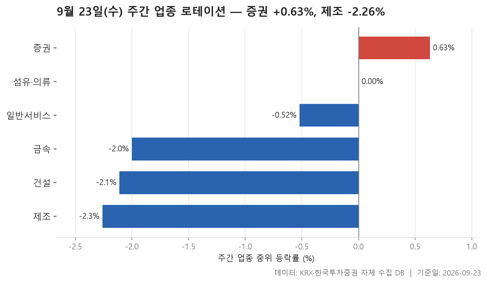
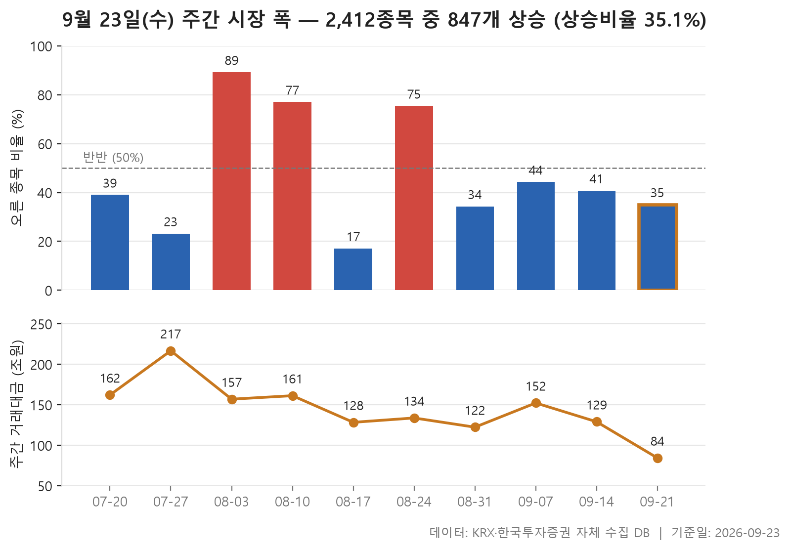
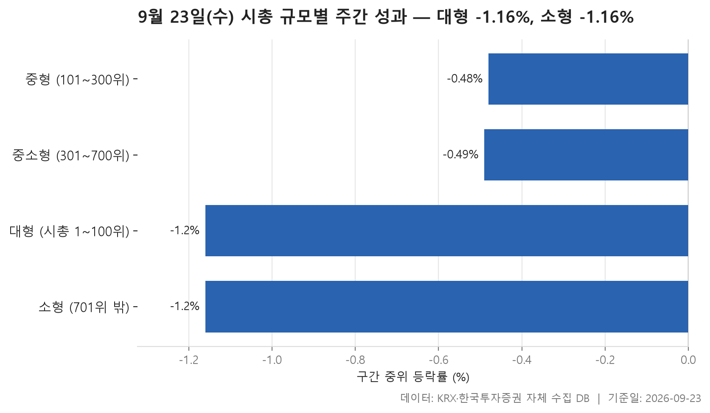

이번 주는 9월 21일부터 23일까지 거래일이 3일뿐인 짧은 한 주였습니다. 출발선은 직전 주 마지막 거래일인 9월 18일 종가입니다. 짧은 기간이었지만 분위기는 한쪽으로 뚜렷하게 기울었습니다. 거래가 있었던 보통주 2,412개 가운데 오른 종목은 847개, 내린 종목은 1,518개였습니다. 오른 종목 하나에 내린 종목이 두 개 가까이 붙은 셈입니다.

오늘은 세 가지를 차례로 봅니다. 먼저 24개 업종 가운데 어느 쪽이 버텼고 어느 쪽이 밀렸는지 봅니다. 업종 순위는 **증권 +0.63%**가 맨 위, **제조 -2.26%**가 맨 아래였습니다. 이어 최근 10주의 시장 폭을 늘어놓고 이번 주가 그 흐름에서 어디쯤인지 확인합니다. 마지막으로 시가총액 순위로 네 구간을 나눠 큰 종목과 작은 종목 가운데 어느 쪽이 나았는지 봅니다.

세 표를 관통하는 특징은 하나입니다. **한가운데 종목은 내렸는데 평균은 플러스인 경우가 많다**는 점입니다. 대다수 종목은 약했지만 소수 종목이 크게 올라 평균을 끌어올렸다는 뜻이고, 이번 주 시장의 모양이 바로 그랬습니다.

> 기준일: 2026-09-23 · 집계: 자체 수집 데이터베이스

## 주간 업종 로테이션 — 6개 중 4개 하락

가장 강했던 세 업종을 보면 이번 주가 얼마나 어려웠는지 알 수 있습니다. 한가운데 종목 기준으로 플러스를 낸 업종은 **증권(+0.63%)** 하나뿐입니다. 2위 섬유·의류는 0.00%, 3위 일반서비스는 -0.52%였습니다. 증권은 내용도 고른 편이었습니다. 18개 종목 가운데 61.10%가 올라 절반을 넘겼고, 한가운데 값과 평균(+0.76%)의 차이도 크지 않았습니다. 가장 크게 움직인 종목은 삼성증권(+6.80%)이었지만, 이 종목 하나가 업종 평균을 올린 폭은 0.38%p에 그칩니다. 한두 종목에 기대지 않고 업종 전체가 조금씩 오른 모습입니다.

섬유·의류와 일반서비스는 사정이 다릅니다. 두 업종 모두 평균은 각각 +0.94%, +0.67%로 플러스지만, 오른 종목 비율은 45.70%, 45.20%로 절반에 못 미칩니다. 평균을 올린 것은 소수의 큰 상승입니다. 섬유·의류에서는 씨싸이트가 +48.65% 올랐고, 이 한 종목이 업종 평균을 1.06%p 끌어올렸습니다. 이 폭이 업종 평균 자체보다 큽니다. 이 종목이 없었다면 평균의 모양이 크게 달라졌을 거라는 뜻입니다. 일반서비스는 168개 종목이라 인벤테라(+39.90%)가 크게 올라도 업종 평균에는 0.24%p만 보태졌습니다.

아래쪽 세 업종은 오른 종목 자체가 드물었습니다. 건설은 오른 종목 비율이 9.80%로 열 곳 가운데 한 곳도 안 됐습니다. 가장 크게 움직인 까뮤이앤씨도 -8.77%로 내린 쪽이었습니다. 금속은 132개 종목 가운데 오른 비율이 20.50%에 그쳤습니다. 그런데 가장 크게 움직인 HT로보틱스는 +28.97%로 흐름과 반대 방향이었습니다. 제조는 종목이 7개뿐이어서 한 종목의 무게가 큽니다. 퍼시스(-5.80%) 하나가 업종 평균을 0.83%p 끌어내렸습니다. 종목 수가 적은 업종은 순위가 한두 종목에 크게 좌우된다는 점을 감안해서 보시면 됩니다. 왜 이런 차이가 났는지는 이 자료만으로는 알 수 없습니다.

| 업종 | 종목수(개) | 주간중위등락률(%) | 주간평균등락률(%) | 상승비율(%) | 주도종목 | 주도종목등락률(%) | 평균기여도(%p) |
|---|---|---|---|---|---|---|---|
| 증권 | 18 | +0.63 | +0.76 | 61.10 | 삼성증권 | +6.80 | 0.38 |
| 섬유·의류 | 46 | 0.00 | +0.94 | 45.70 | 씨싸이트 | +48.65 | 1.06 |
| 일반서비스 | 168 | -0.52 | +0.67 | 45.20 | 인벤테라 | +39.90 | 0.24 |
| 금속 | 132 | -2.00 | -2.11 | 20.50 | HT로보틱스 | +28.97 | 0.22 |
| 건설 | 51 | -2.11 | -2.48 | 9.80 | 까뮤이앤씨 | -8.77 | -0.17 |
| 제조 | 7 | -2.26 | -1.77 | 14.30 | 퍼시스 | -5.80 | -0.83 |

## 주간 시장 폭 — 10주 중 이번 주는 2,412개 중 847개 상승

이번 주에는 오른 종목이 35.10%였습니다. 오른 종목 수를 내린 종목 수로 나눈 값(ADR)은 0.56배였습니다. 최근 10주의 한가운데 값인 0.68배보다 낮으니, 이 기간 안에서도 약한 편에 속하는 주입니다. 거래대금 합계는 84.30조원으로 표에서 가장 작습니다. 다만 이번 주는 거래일이 3일이라 다른 주와 금액을 그대로 비교하기는 어렵습니다.

10주를 길게 보면 흐름이 두 시기로 나뉩니다. 8월에는 주마다 방향이 크게 뒤집혔습니다. 8월 3일 주에는 오른 종목이 89.20%에 달해 비율이 8.58배까지 올랐습니다. 8월 17일 주에는 반대로 17.10%만 올라 0.21배로 떨어졌습니다. 그 전후 주도 3.49배, 3.22배로 크게 흔들렸습니다. 반면 8월 31일 주부터는 네 주 연속 1배를 밑돌았습니다. 폭은 작아졌지만 내린 종목이 더 많은 상태가 계속되고 있다는 얘기입니다.

최근 네 주의 순서도 볼 만합니다. 9월 7일 주에 오른 종목 비율이 44.30%까지 회복했지만, 그 뒤로 40.80%, 이번 주 35.10%로 두 주 연속 낮아졌습니다. 참고로 10주 가운데 거래대금이 가장 컸던 7월 27일 주(216.70조원)는 오른 종목이 23.20%에 그친 약세 주였습니다. 거래가 많았다고 해서 오른 종목이 많았던 것은 아닙니다.

| 주 | 거래일수(일) | 종목수(개) | 상승(개) | 보합(개) | 하락(개) | 상승비율(%) | ADR(배) | 총거래대금(조원) |
|---|---|---|---|---|---|---|---|---|
| 2026-09-21 | 3 | 2,412 | 847 | 47 | 1,518 | 35.10 | 0.56 | 84.30 |
| 2026-09-14 | 5 | 2,409 | 982 | 31 | 1,396 | 40.80 | 0.70 | 129.00 |
| 2026-09-07 | 5 | 2,406 | 1,067 | 40 | 1,299 | 44.30 | 0.82 | 152.20 |
| 2026-08-31 | 5 | 2,401 | 823 | 34 | 1,544 | 34.30 | 0.53 | 122.30 |
| 2026-08-24 | 5 | 2,386 | 1,799 | 28 | 559 | 75.40 | 3.22 | 133.70 |
| 2026-08-17 | 4 | 2,387 | 409 | 16 | 1,962 | 17.10 | 0.21 | 128.30 |
| 2026-08-10 | 5 | 2,385 | 1,837 | 22 | 526 | 77.00 | 3.49 | 161.20 |
| 2026-08-03 | 5 | 2,395 | 2,136 | 10 | 249 | 89.20 | 8.58 | 156.90 |
| 2026-07-27 | 5 | 2,400 | 556 | 21 | 1,823 | 23.20 | 0.30 | 216.70 |
| 2026-07-20 | 5 | 2,402 | 937 | 28 | 1,437 | 39.00 | 0.65 | 162.10 |

## 시총 규모별 주간 성과 — 소형이 0.0%p 앞섬

시가총액 구간으로 나눠 보면 **양 끝이 약하고 가운데가 덜 약했습니다.** 한가운데 종목의 등락률은 중형(101~300위) -0.48%와 중소형(301~700위) -0.49%가 거의 같았고, 이 두 구간이 가장 나았습니다. 대형(1~100위)과 소형(701위 밖)은 둘 다 -1.16%로 맨 아래에 나란히 놓였습니다. 네 구간의 한가운데 값을 줄 세우면 가운데가 -0.82%입니다. 큰 종목과 작은 종목 가운데 어느 한쪽이 앞섰다고 말하기 어려운 주였습니다.

눈여겨볼 대목은 평균입니다. 네 구간 모두 한가운데 값은 마이너스인데, 위쪽 세 구간의 평균은 플러스입니다. 대형 +0.09%, 중형 +0.89%, 중소형 +1.07%입니다. 중형의 파두(+33.77%), 중소형의 아스플로(+35.15%)처럼 크게 오른 종목이 평균을 끌어올린 모양으로, 업종 표에서 본 쏠림이 규모별로도 나타납니다. 대형에서도 심텍이 +18.93% 올랐습니다. 그러나 오른 종목은 36.00%에 그쳐 대부분은 내린 쪽이었습니다.

소형은 평균마저 -0.72%였고, 오른 종목 비율도 31.60%로 네 구간 중 가장 낮았습니다. 토마토시스템이 +106.93%로 두 배 넘게 올랐지만, 1,712개 종목 속에서는 평균을 플러스로 돌려놓지 못했습니다. 돈이 모인 곳도 한쪽으로 쏠려 있었습니다. 주간 거래대금은 상위 100개 종목에 56.60조원이 몰렸습니다. 소형 구간은 종목 수가 가장 많은데도 5.00조원에 머물렀습니다.

| 구간 | 종목수(개) | 주간중위등락률(%) | 주간평균등락률(%) | 상승비율(%) | 주도종목 | 주도종목등락률(%) | 주간거래대금(조원) |
|---|---|---|---|---|---|---|---|
| 대형 (시총 1~100위) | 100 | -1.16 | +0.09 | 36.00 | 심텍 | +18.93 | 56.60 |
| 중형 (101~300위) | 200 | -0.48 | +0.89 | 44.50 | 파두 | +33.77 | 12.60 |
| 중소형 (301~700위) | 400 | -0.49 | +1.07 | 45.30 | 아스플로 | +35.15 | 7.10 |
| 소형 (701위 밖) | 1,712 | -1.16 | -0.72 | 31.60 | 토마토시스템 | +106.93 | 5.00 |

## 정리

정리하면, 이번 주는 **대다수 종목이 조금씩 내리는 가운데 소수 종목이 크게 올라 평균만 버틴 한 주**였습니다. 업종에서는 증권만 고르게 올랐습니다. 시장 폭으로는 8월 31일 주부터 이어진, 내린 종목이 더 많은 흐름이 네 주째 계속됐습니다. 규모별로는 중형과 중소형이 덜 밀렸고 대형과 소형이 똑같이 약했습니다.

이 표에는 한계도 있습니다. 거래일이 3일뿐이라 5일짜리 주와 곧바로 견주기 어렵습니다. 종목이 적은 업종은 한두 종목이 순위를 좌우합니다. 또 이 자료는 무엇이 얼마나 움직였는지만 보여 줄 뿐, 왜 움직였는지는 알려 주지 않습니다. 원인을 따져 보려면 이 표 밖의 자료가 필요합니다.

## 집계 기준

**주간 업종 로테이션**

- **기준**: 2026-09-18 종가 → 2026-09-23 종가
- **구간**: 2026-09-21 시작 주 — 직전 주 마지막 거래일 종가를 출발선으로 삼습니다
- **거래일수**: 3
- **순위**: 업종 내 종목 등락률의 중위값 (평균은 참고용으로 함께 표시)
- **선정**: 전체 24개 업종 중 상위 3개 · 하위 3개
- **주도종목**: 그 업종에서 같은 기간 등락률 절대값이 가장 큰 종목 (동점이면 거래대금이 큰 쪽)
- **평균기여도**: 그 종목 하나가 업종 평균을 움직인 폭 (등락률 ÷ 종목수)
- **필터**: 업종 내 보통주 5종목 이상

**주간 시장 폭**

- **기준**: 각 주의 마지막 거래일 종가를 직전 주 마지막 거래일 종가와 비교
- **주**: 그 주의 월요일 (달력 기준). 거래일 수는 연휴에 따라 다릅니다
- **ADR**: 상승 종목 수 ÷ 하락 종목 수. 1 이면 반반, 2 면 오른 종목이 두 배
- **총거래대금**: 그 주 거래일 전체의 거래대금 합계
- **모집단**: 거래가 있었던 보통주 (거래정지·액면 변경 종목 제외)

**시총 규모별 주간 성과**

- **기준**: 2026-09-18 종가 → 2026-09-23 종가
- **구간**: 기준일 시가총액 순위로 자릅니다 (금액으로 자르면 장이 오른 해에 전부 위 구간으로 올라가 해마다 다른 표가 됩니다)
- **순위**: 구간 내 종목 등락률의 중위값 (평균은 참고용으로 함께 표시)
- **주도종목**: 그 구간에서 같은 기간 등락률 절대값이 가장 큰 종목 (동점이면 거래대금이 큰 쪽)
- **대형소형격차**: 0.0
- **모집단**: 거래가 있었던 보통주 (거래정지·액면 변경 종목 제외)

## 데이터 출처 및 유의사항

- **데이터출처**: 한국거래소(KRX) 공시 데이터와 한국투자증권 OpenAPI 를 직접 수집해 구축한 자체 데이터베이스
- **집계방식**: 수집·집계·차트 생성을 직접 구현한 파이프라인에서 자동 산출
- **작성고지**: 본문의 표·통계·차트는 자체 데이터베이스에서 계산된 값이며, 문장 작성 과정에 AI 도구를 활용했습니다.
- **면책**: 본 글은 정보 제공을 목적으로 하며 특정 종목의 매수·매도를 추천하지 않습니다. 제시된 수치는 과거 데이터이고 미래 수익을 보장하지 않습니다. 투자 판단과 그 결과에 대한 책임은 투자자 본인에게 있습니다.

