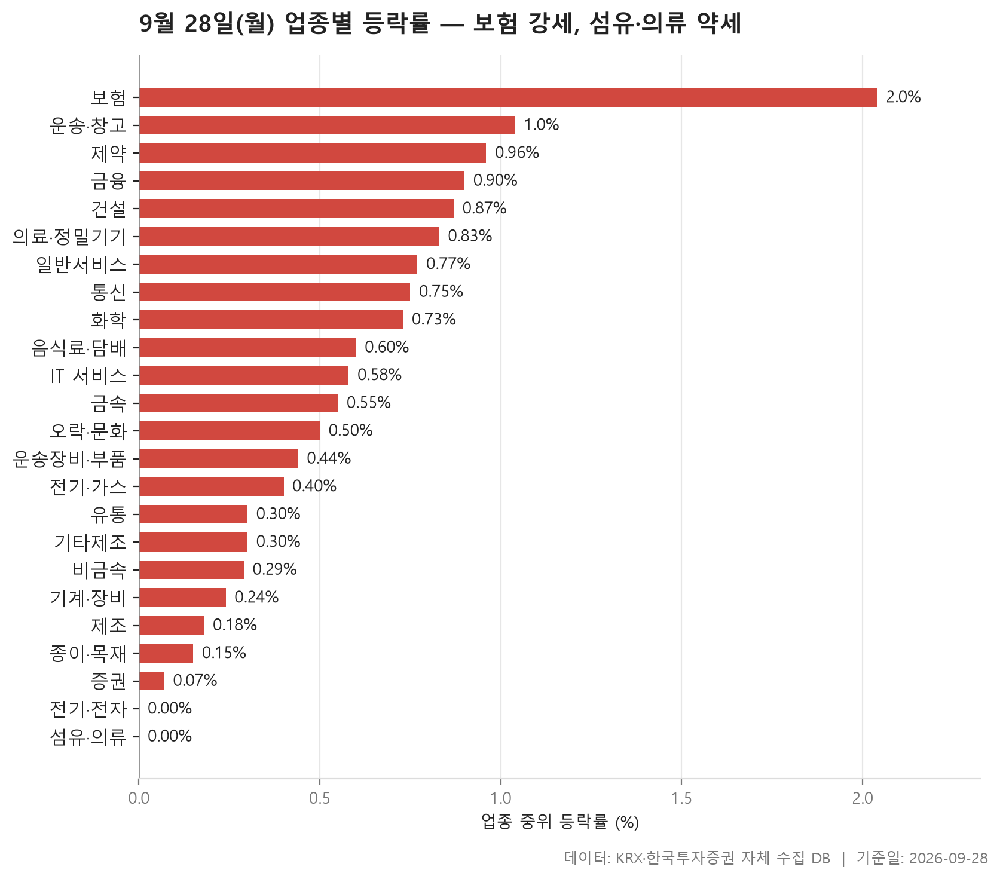
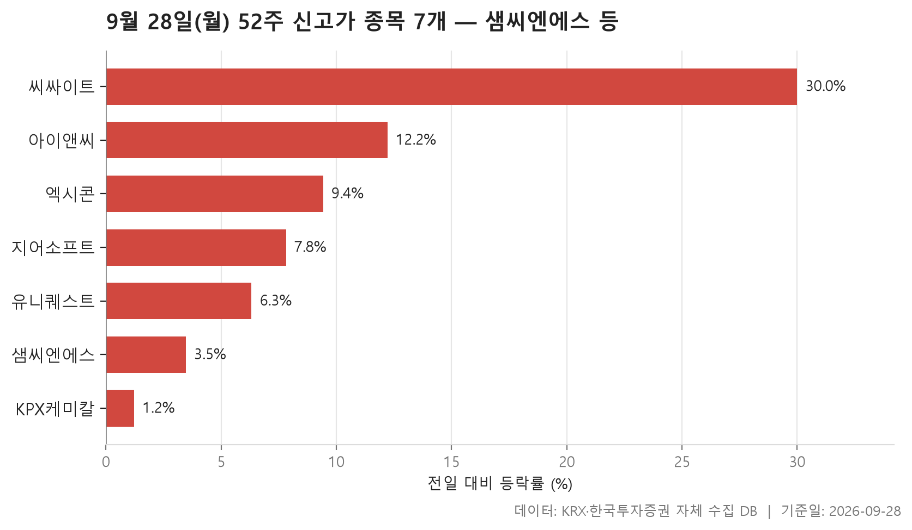
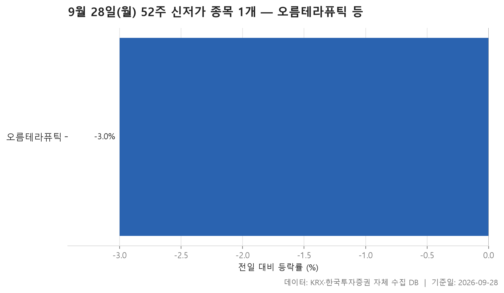
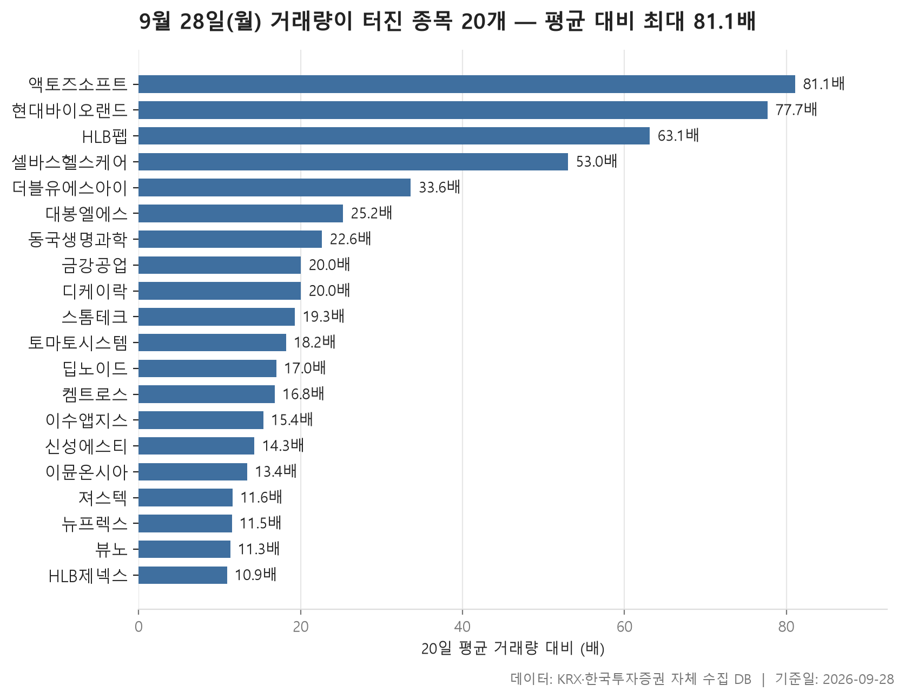

9월 28일 시장을 네 가지 표로 정리했습니다. 업종별 등락, 52주 신고가와 신저가, 그리고 거래량이 평소보다 크게 늘어난 종목입니다. 표를 차례로 보면 오늘 시장이 어느 쪽으로 기울었는지, 그 안에서 어떤 종목이 튀었는지 한눈에 들어옵니다.

먼저 전체 분위기부터 보겠습니다. 24개 업종을 중위 등락률 순으로 늘어놓으면 한가운데 값이 +0.53%입니다. 크게 오른 날은 아니지만, 가장 약한 업종도 중위값이 0.00%에서 멈췄습니다. 중위값 기준으로는 마이너스로 내려간 업종이 하나도 없었다는 뜻이죠. 맨 위는 보험(+2.04%), 맨 아래는 섬유·의류입니다.

신고가는 7개, 신저가는 1개였습니다. 거래량이 직전 20거래일 평균의 5배를 넘은 종목은 20개로, 코스닥 종목이 대부분입니다. 아래에서 표마다 눈여겨볼 대목을 짚어 보겠습니다.

> 기준일: 2026-09-28 · 집계: 자체 수집 데이터베이스

## 업종 등락률

이번 업종 등락률은 9월 23일 종가 대비 9월 28일 종가로 계산했습니다. 가장 깔끔한 모양은 **보험**입니다. 11개 종목이 모두 올라 오른 종목 비율이 100.00%였고, 중위값 +2.04%와 평균 +2.41%도 크게 벌어지지 않았습니다. 가장 많이 오른 서울보증보험(+4.60%)이 업종 평균을 0.42%p 끌어올렸지만, 이 종목 하나가 만든 흐름이라기보다 업종 전체가 고르게 오른 날이었습니다. 운송·창고(+1.04%)와 건설(+0.87%)도 열 곳 가운데 일곱 곳가량이 올라 폭은 작아도 방향이 분명했습니다.

중위값과 평균이 벌어진 업종도 있습니다. **제약**은 중위값이 +0.96%인데 평균은 +2.30%입니다. 상한가를 친 HLB펩(+30.00%)이 평균을 끌어올린 폭은 0.18%p에 그치니, 그 차이를 이 종목 하나로는 설명할 수 없습니다. 크게 오른 종목이 여럿 있었다는 뜻입니다. 의료·정밀기기(중위 +0.83%, 평균 +1.98%)도 같습니다. 코셈(+28.25%)의 몫은 0.29%p뿐이고, 나머지는 다른 종목들이 채웠습니다.

반대 방향으로 어긋난 곳도 보입니다. 기타제조는 중위값이 +0.30%인데 평균은 -0.23%입니다. 가장 크게 움직인 리튬포어스는 +9.98% 올랐으니, 평균을 끌어내린 것은 다른 하락 종목들입니다. 음식료·담배는 프롬바이오(-11.87%) 하나가 평균을 -0.14%p 움직였고, 그 결과 평균(+0.31%)이 중위값(+0.60%)보다 낮게 나왔습니다.

아래쪽 두 업종은 성격이 다릅니다. **전기·전자**는 363개 종목에 거래대금이 158,536.40억원으로 다른 업종과 비교가 안 될 만큼 크지만, 중위값은 0.00%, 오른 종목 비율은 48.80%였습니다. 돈은 가장 많이 몰렸는데 오른 종목과 내린 종목이 팽팽했던 셈입니다. **섬유·의류**는 오른 종목이 41.30%로 열 곳 중 네 곳꼴에 그쳤습니다. 씨싸이트가 상한가(+30.00%)를 기록하며 평균을 0.65%p 밀어 올렸는데도 평균은 -0.05%였으니, 이 종목을 빼면 업종 전체는 약했다고 볼 수 있습니다.

| 업종 | 종목수(개) | 중위등락률(%) | 평균등락률(%) | 상승비율(%) | 주도종목 | 주도종목등락률(%) | 평균기여도(%p) | 거래대금합계(억원) |
|---|---|---|---|---|---|---|---|---|
| 보험 | 11 | +2.04 | +2.41 | 100.00 | 서울보증보험 | +4.60 | 0.42 | 2,266.60 |
| 운송·창고 | 28 | +1.04 | +1.19 | 71.40 | 한진 | +4.82 | 0.17 | 1,558.50 |
| 제약 | 166 | +0.96 | +2.30 | 74.10 | HLB펩 | +30.00 | 0.18 | 7,581.80 |
| 금융 | 110 | +0.90 | +0.91 | 68.20 | OCI홀딩스 | +10.92 | 0.10 | 19,206.10 |
| 건설 | 51 | +0.87 | +1.23 | 76.50 | 베노티앤알 | +17.05 | 0.33 | 4,583.30 |
| 의료·정밀기기 | 99 | +0.83 | +1.98 | 62.60 | 코셈 | +28.25 | 0.29 | 3,853.70 |
| 일반서비스 | 168 | +0.77 | +1.68 | 64.90 | HLB바이오스텝 | +30.00 | 0.18 | 6,508.00 |
| 통신 | 13 | +0.75 | +0.65 | 61.50 | 프리티 | +5.24 | 0.40 | 680.30 |
| 화학 | 220 | +0.73 | +1.14 | 65.50 | 보원케미칼 | +15.13 | 0.07 | 12,017.00 |
| 음식료·담배 | 83 | +0.60 | +0.31 | 61.40 | 프롬바이오 | -11.87 | -0.14 | 1,142.80 |
| IT 서비스 | 247 | +0.58 | +1.01 | 63.60 | 핀텔 | -29.94 | -0.12 | 9,112.90 |
| 금속 | 131 | +0.55 | +0.40 | 56.50 | 에이에프더블류 | -28.30 | -0.22 | 5,470.60 |
| 오락·문화 | 66 | +0.50 | +0.55 | 63.60 | 한주에이알티 | -26.24 | -0.40 | 859.60 |
| 운송장비·부품 | 133 | +0.44 | +0.48 | 62.40 | SNT다이내믹스 | +14.40 | 0.11 | 7,997.00 |
| 전기·가스 | 10 | +0.40 | +0.37 | 60.00 | 한국전력 | +1.49 | 0.15 | 438.50 |
| 유통 | 157 | +0.30 | +0.40 | 55.40 | 와이즈플래닛컴퍼니 | -29.91 | -0.19 | 6,250.80 |
| 기타제조 | 14 | +0.30 | -0.23 | 64.30 | 리튬포어스 | +9.98 | 0.71 | 15.60 |
| 비금속 | 36 | +0.29 | +0.66 | 58.30 | 동양파일 | +9.28 | 0.26 | 412.00 |
| 기계·장비 | 206 | +0.24 | +0.39 | 54.40 | 디에이테크놀로지 | -30.69 | -0.15 | 13,191.00 |
| 제조 | 7 | +0.18 | -0.01 | 57.10 | 코아스 | +7.58 | 1.08 | 6.10 |
| 종이·목재 | 25 | +0.15 | +0.24 | 56.00 | 한국팩키지 | -3.20 | -0.13 | 140.30 |
| 증권 | 18 | +0.07 | +0.07 | 55.60 | 상상인증권 | +4.81 | 0.27 | 816.60 |
| 전기·전자 | 363 | 0.00 | +0.33 | 48.80 | HLB이노베이션 | +29.99 | 0.08 | 158,536.40 |
| 섬유·의류 | 46 | 0.00 | -0.05 | 41.30 | 씨싸이트 | +30.00 | 0.65 | 147.20 |

## 52주 신고가 7개 — 최고 씨싸이트 30%

52주 신고가를 새로 쓴 종목은 7개로, 코스닥이 5개, 코스피가 2개입니다. 업종은 6개로 흩어져 있고 전기·전자만 2개로 겹칩니다. 특정 업종에 몰리지 않고 종목별로 나온 신고가라고 보는 편이 맞겠습니다.

가장 눈에 띄는 것은 **씨싸이트**입니다. 업종 표에서 맨 아래에 놓인 섬유·의류 소속인데, 상한가(+30.00%)로 이전 52주 최고가 11,390원을 넘어 12,870원에 마감했습니다. 다만 거래대금은 4.80억원, 시가총액은 751억원으로 이 표에서 가장 작습니다. 업종이 약한 가운데 종목 하나만 튀어나온 경우입니다.

반대로 시가총액이 가장 큰 **샘씨엔에스**(11,170억원)는 +3.46% 오르는 데 그쳤습니다. 종가 18,550원이 이전 최고가 18,460원을 간발의 차로 넘었습니다. KPX케미칼도 +1.23%로 가장 조용하게 신고가를 넘었는데, 거래대금이 3.10억원이라 집계 조건의 문턱에 걸쳐 있습니다. 7개 종목 등락률의 중위값은 +7.81%(지어소프트)이고, 거래대금으로는 엑시콘(343.60억원)이 가장 컸습니다.

| 종목명 | 종목코드 | 시장 | 업종 | 종가(원) | 등락률(%) | 이전52주최고(원) | 거래대금(억원) | 시가총액(억원) |
|---|---|---|---|---|---|---|---|---|
| 샘씨엔에스 | 252990 | KOSDAQ | 전기·전자 | 18,550 | +3.46 | 18,460 | 138.80 | 11,170 |
| 엑시콘 | 092870 | KOSDAQ | 기계·장비 | 47,000 | +9.43 | 45,600 | 343.60 | 6,134 |
| KPX케미칼 | 025000 | KOSPI | 화학 | 57,700 | +1.23 | 57,000 | 3.10 | 2,393 |
| 유니퀘스트 | 077500 | KOSPI | 유통 | 9,770 | +6.31 | 9,520 | 96.60 | 2,110 |
| 지어소프트 | 051160 | KOSDAQ | IT 서비스 | 12,980 | +7.81 | 12,900 | 64.30 | 1,750 |
| 아이앤씨 | 052860 | KOSDAQ | 전기·전자 | 7,620 | +12.22 | 7,350 | 20.90 | 1,361 |
| 씨싸이트 | 109670 | KOSDAQ | 섬유·의류 | 12,870 | +30.00 | 11,390 | 4.80 | 751 |

## 52주 신저가 1개 — 오름테라퓨틱 -3%

52주 신저가는 코스닥 제약 업종의 **오름테라퓨틱** 한 종목뿐입니다. -3% 내린 24,250원에 마감해 이전 52주 최저가 24,450원을 밑돌았습니다. 시가총액은 5,275억원, 거래대금은 88.10억원입니다.

흥미로운 건 소속 업종과 방향이 반대라는 점입니다. 업종 표에서 제약은 중위 등락률 +0.96%, 오른 종목 비율 74.10%로 상위권이었습니다. 넷 중 셋꼴로 오른 업종에서 이 종목은 오히려 1년 가운데 가장 낮은 자리로 내려간 겁니다. 하락 폭 자체는 크지 않았습니다. 업종 흐름을 따라가지 못한 개별 종목의 움직임으로 보는 게 자연스럽고, 왜 그랬는지는 이 자료만으로는 알 수 없습니다.

| 종목명 | 종목코드 | 시장 | 업종 | 종가(원) | 등락률(%) | 이전52주최저(원) | 거래대금(억원) | 시가총액(억원) |
|---|---|---|---|---|---|---|---|---|
| 오름테라퓨틱 | 475830 | KOSDAQ | 제약 | 24,250 | -3 | 24,450 | 88.10 | 5,275 |

## 거래량 급증 20개 — 최고 액토즈소프트 81.10배

거래량이 직전 20거래일 평균의 5배를 넘은 종목은 20개입니다. 코스피는 금강공업 하나이고 나머지 19개가 코스닥입니다. 업종으로는 제약이 5개로 가장 많아, 업종 표에서 제약의 평균이 중위값보다 크게 높았던 것과 맞물립니다. 거래량 배수의 중위값은 18.75배입니다.

배수만 보면 **액토즈소프트**가 81.10배로 가장 높습니다. 다만 평소 거래량이 하루 12,774주에 불과했기 때문에 배수가 크게 잡힌 면이 있습니다. 거래대금 규모로 보면 **동국생명과학**이 1,036.90억원으로 가장 컸고, 토마토시스템(766.10억원)이 그 뒤를 잇습니다. 배수 순위와 거래대금 순위가 따로 움직이니, 두 값을 함께 봐야 실제 관심의 크기를 가늠할 수 있습니다.

대부분은 거래량과 함께 주가도 크게 올랐습니다. HLB펩(+30.00%)과 HLB제넥스(+29.83%)는 상한가 부근까지 올랐는데, HLB제넥스는 배수가 10.90배로 이 표에서 가장 낮았습니다. 반면 **스톰테크**는 거래량이 19.30배로 불어났는데도 -0.41% 내렸고, 신성에스티도 14.30배에 +0.79%로 거의 제자리였습니다. 거래가 크게 늘었다고 주가가 반드시 한쪽으로 움직이는 건 아니라는 점을 보여 주는 사례입니다. 시가총액이 가장 큰 종목은 이뮨온시아(3,336억원)로, 20개 모두 중소형주였습니다.

| 종목명 | 종목코드 | 시장 | 업종 | 종가(원) | 등락률(%) | 거래량(주) | 평균거래량(주) | 배수(배) | 거래대금(억원) | 시가총액(억원) |
|---|---|---|---|---|---|---|---|---|---|---|
| 액토즈소프트 | 052790 | KOSDAQ | IT 서비스 | 4,870 | +21.75 | 1,035,571 | 12,774 | 81.10 | 48.10 | 532 |
| 현대바이오랜드 | 052260 | KOSDAQ | 화학 | 4,365 | +9.54 | 2,820,931 | 36,319 | 77.70 | 127.40 | 1,310 |
| HLB펩 | 196300 | KOSDAQ | 제약 | 5,590 | +30.00 | 286,703 | 4,541 | 63.10 | 16.00 | 531 |
| 셀바스헬스케어 | 208370 | KOSDAQ | 의료·정밀기기 | 2,745 | +17.06 | 4,155,062 | 78,438 | 53.00 | 113.80 | 707 |
| 더블유에스아이 | 299170 | KOSDAQ | 유통 | 1,510 | +10.95 | 20,284,574 | 603,633 | 33.60 | 316.40 | 627 |
| 대봉엘에스 | 078140 | KOSDAQ | 제약 | 7,910 | +7.18 | 287,507 | 11,397 | 25.20 | 23.30 | 877 |
| 동국생명과학 | 303810 | KOSDAQ | 제약 | 3,425 | +22.32 | 31,557,032 | 1,397,869 | 22.60 | 1,036.90 | 1,095 |
| 금강공업 | 014280 | KOSPI | 금속 | 4,980 | +14.09 | 7,015,812 | 351,521 | 20.00 | 362.60 | 1,461 |
| 디케이락 | 105740 | KOSDAQ | 기계·장비 | 9,630 | +20.83 | 1,406,332 | 70,444 | 20.00 | 128.20 | 979 |
| 스톰테크 | 352090 | KOSDAQ | 화학 | 3,625 | -0.41 | 485,594 | 25,122 | 19.30 | 18.30 | 974 |
| 토마토시스템 | 393210 | KOSDAQ | IT 서비스 | 4,255 | +4.80 | 16,771,902 | 921,750 | 18.20 | 766.10 | 664 |
| 딥노이드 | 315640 | KOSDAQ | IT 서비스 | 2,200 | +13.70 | 1,925,266 | 112,992 | 17.00 | 43.60 | 646 |
| 켐트로스 | 220260 | KOSDAQ | 화학 | 4,450 | +13.38 | 851,589 | 50,739 | 16.80 | 38.00 | 1,427 |
| 이수앱지스 | 086890 | KOSDAQ | 제약 | 3,810 | +8.09 | 707,442 | 45,870 | 15.40 | 27.50 | 1,554 |
| 신성에스티 | 416180 | KOSDAQ | 운송장비·부품 | 25,400 | +0.79 | 304,452 | 21,228 | 14.30 | 81.90 | 2,296 |
| 이뮨온시아 | 424870 | KOSDAQ | 일반서비스 | 3,650 | +18.51 | 9,540,343 | 713,107 | 13.40 | 344.90 | 3,336 |
| 져스텍 | 153890 | KOSDAQ | 전기·전자 | 10,820 | +8.20 | 2,617,283 | 225,301 | 11.60 | 297.10 | 1,304 |
| 뉴프렉스 | 085670 | KOSDAQ | 전기·전자 | 3,480 | +12.08 | 1,341,284 | 116,901 | 11.50 | 46.20 | 853 |
| 뷰노 | 338220 | KOSDAQ | IT 서비스 | 6,820 | +22.44 | 1,532,860 | 135,761 | 11.30 | 106.50 | 955 |
| HLB제넥스 | 187420 | KOSDAQ | 제약 | 2,320 | +29.83 | 1,301,785 | 119,690 | 10.90 | 30.00 | 757 |

## 정리

정리하면 오늘은 보험처럼 업종 전체가 고르게 오른 곳이 있었고, 제약·의료기기처럼 여러 종목이 크게 오르며 평균을 끌어올린 곳이 있었습니다. 전기·전자에는 거래대금이 가장 많이 몰렸지만 오른 종목과 내린 종목이 엇비슷했습니다. 신고가와 거래량 급증은 코스닥 중소형주에 몰렸고, 신저가는 한 종목뿐이었습니다.

이 글은 표에 담긴 등락률과 거래량만으로 쓴 것입니다. 종목이나 업종이 왜 움직였는지는 자료에 없어서 다루지 않았습니다. 업종 등락률은 9월 23일 종가 대비 값이라는 점, 신고가·신저가·거래량 급증 표는 시가총액 500억원 이상과 거래대금 3억원 이상인 보통주만 걸러 냈다는 점도 함께 참고해 주세요.

## 집계 기준

**업종 등락률**

- **기준**: 2026-09-23 종가 → 2026-09-28 종가
- **순위**: 업종 내 종목 등락률의 중위값 (평균은 참고용으로 함께 표시)
- **주도종목**: 그 업종에서 등락률 절대값이 가장 큰 종목 (동점이면 거래대금이 큰 쪽)
- **평균기여도**: 그 종목 하나가 업종 평균을 움직인 폭 (등락률 ÷ 종목수). 중위값과 평균의 격차가 이 값에 가까우면 평균을 만든 것이 그 종목이고, 훨씬 크면 다른 종목들도 함께 움직인 것입니다
- **필터**: 업종 내 보통주 5종목 이상
- **전체업종중위등락률(%)**: 0.53

**52주 신고가**

- **기준**: 종가 > 직전 52주 최고가
- **관측구간**: 2025-09-11 ~ 2026-09-23 (252거래일)
- **필터**: 시가총액 500억 이상, 거래대금 3억 이상, 보통주

**52주 신저가**

- **기준**: 종가 < 직전 52주 최저가
- **관측구간**: 2025-09-11 ~ 2026-09-23 (252거래일)
- **필터**: 시가총액 500억 이상, 거래대금 3억 이상, 보통주

**거래량 급증**

- **기준**: 당일 거래량 ≥ 직전 20거래일 평균 × 5
- **관측구간**: 2026-08-27 ~ 2026-09-23 (20거래일)
- **필터**: 시가총액 500억 이상, 거래대금 3억 이상, 보통주

## 데이터 출처 및 유의사항

- **데이터출처**: 한국거래소(KRX) 공시 데이터와 한국투자증권 OpenAPI 를 직접 수집해 구축한 자체 데이터베이스
- **집계방식**: 수집·집계·차트 생성을 직접 구현한 파이프라인에서 자동 산출
- **작성고지**: 본문의 표·통계·차트는 자체 데이터베이스에서 계산된 값이며, 문장 작성 과정에 AI 도구를 활용했습니다.
- **면책**: 본 글은 정보 제공을 목적으로 하며 특정 종목의 매수·매도를 추천하지 않습니다. 제시된 수치는 과거 데이터이고 미래 수익을 보장하지 않습니다. 투자 판단과 그 결과에 대한 책임은 투자자 본인에게 있습니다.

