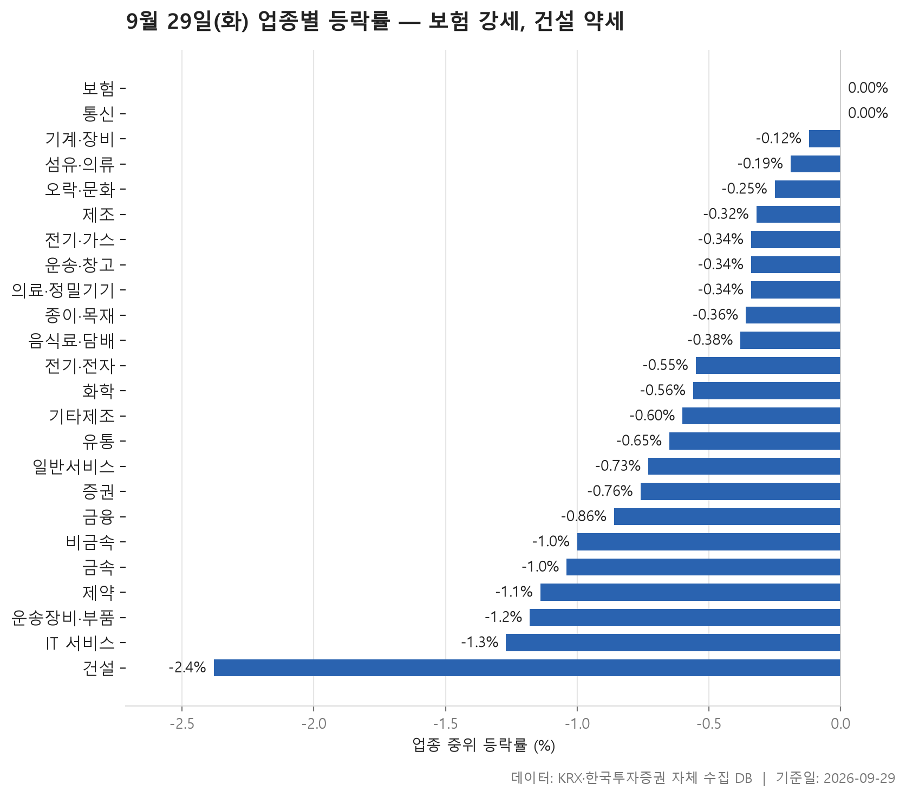
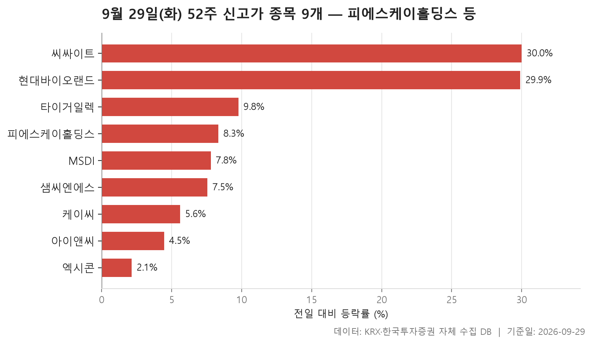
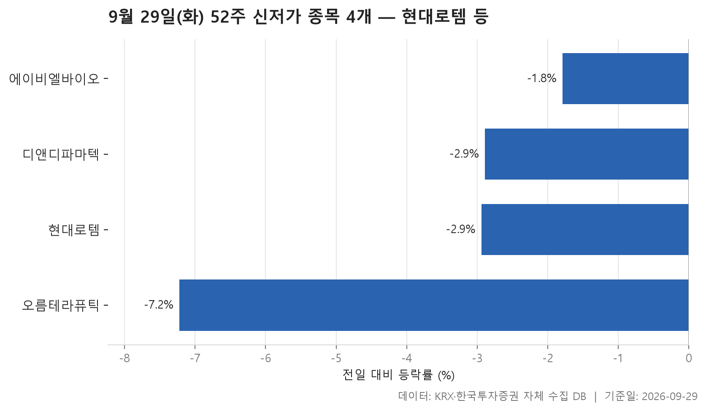
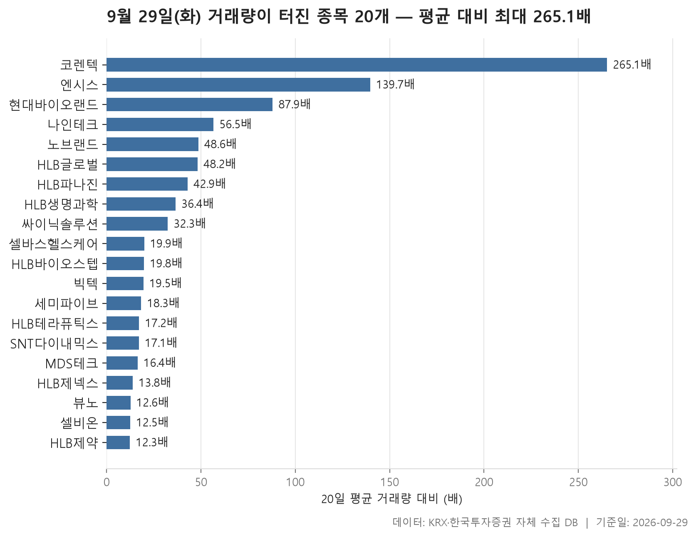

9월 29일 시장은 넓게 조금씩 밀린 하루였습니다. 24개 업종의 중위 등락률을 한 줄로 세웠을 때 한가운데 놓인 값이 -0.56%입니다. 크게 무너진 업종은 드물었지만, 오른 쪽으로 기운 업종도 거의 없었습니다. 제목에 '보험 강세'라고 적었어도 보험의 중위 등락률은 0.00%입니다. 올랐다기보다 **가장 덜 내린 업종**이라고 읽는 편이 정확합니다.

오늘은 네 가지를 차례로 봅니다. 먼저 업종별 등락으로 시장의 전체 모양을 잡고, 이어서 52주 신고가와 신저가 종목, 마지막으로 거래량이 평소보다 크게 불어난 종목을 살핍니다. 순위는 평균이 아니라 중위값으로 매겼습니다. 상한가나 하한가 한 종목이 평균을 흔드는 일이 잦아서입니다. 그래서 중위값과 평균이 어긋나는 업종을 따로 짚어 두었습니다.

지수가 약한 날인데도 신고가 종목이 신저가 종목보다 많았습니다. 그렇다고 한쪽 이야기만 있는 것은 아닙니다. 시가총액이 가장 큰 종목은 오히려 신저가 쪽에 있었습니다. 이런 엇갈림도 함께 보시면 좋겠습니다.

> 기준일: 2026-09-29 · 집계: 자체 수집 데이터베이스

## 업종 등락률

맨 위 자리는 보험과 통신이 함께 차지했습니다. 둘 다 중위 등락률이 0.00%이니, 업종 안 종목을 한 줄로 세웠을 때 가운데 종목이 보합으로 끝났다는 뜻입니다. 다만 속은 다릅니다. 보험은 평균이 -0.14%로 중위값에 바짝 붙어 있어 고르게 버틴 모양입니다. 통신은 평균이 -1.27%로 한참 아래에 있습니다. 가장 크게 움직인 프리티(-8.42%) 하나가 업종 평균을 0.65%p 끌어내렸는데, 중위값과 평균 사이 간격이 그보다 넓습니다. 프리티만이 아니라 다른 몇 종목도 함께 평균을 끌어내렸다는 얘기입니다.

가장 흥미로운 곳은 기계·장비입니다. 중위값은 -0.12%로 마이너스인데 평균은 +0.46%로 플러스입니다. 이 업종에서 가장 크게 움직인 디에이테크놀로지는 -28.57%로 급락했습니다. 그런데도 평균이 위로 올라섰다면, 오른 종목들의 상승 폭이 그만큼 컸다는 뜻입니다. 오른 종목 비중도 46.30%로 24개 업종 가운데 가장 높았습니다. 그래도 절반에는 못 미쳤습니다. 오늘은 어느 업종에서도 오른 종목이 과반을 넘지 못했습니다.

아래쪽에서는 건설이 -2.38%로 가장 약했습니다. 여기서는 평균(-1.58%)이 중위값보다 오히려 위에 있습니다. 베노티앤알이 +18.99% 오르며 업종 평균을 0.37%p 끌어올린 영향이 큽니다. 이 종목을 빼고 보면 업종 분위기는 표의 평균보다 더 무거웠다고 볼 수 있습니다. 금속은 반대로 에이에프더블류가 -40.79%로 표 전체에서 가장 큰 낙폭을 기록했고, 평균이 -1.98%까지 내려갔습니다. 증권은 오른 종목 비중이 5.60%에 그쳤습니다. 거의 모든 종목이 내린 셈입니다.

거래대금은 전기·전자에 압도적으로 몰렸습니다. 131,195.70억원으로 다른 업종과 자릿수부터 다릅니다. 이 업종의 중위 등락률은 -0.55%로, 24개 업종의 한가운데 값(-0.56%)과 거의 같은 자리에 있습니다. 돈이 가장 많이 오간 업종이 시장 평균의 모습을 그대로 보여 준 하루였습니다.

| 업종 | 종목수(개) | 중위등락률(%) | 평균등락률(%) | 상승비율(%) | 주도종목 | 주도종목등락률(%) | 평균기여도(%p) | 거래대금합계(억원) |
|---|---|---|---|---|---|---|---|---|
| 보험 | 11 | 0.00 | -0.14 | 45.50 | 미래에셋생명 | -2.41 | -0.22 | 1,713.60 |
| 통신 | 13 | 0.00 | -1.27 | 46.20 | 프리티 | -8.42 | -0.65 | 797.20 |
| 기계·장비 | 205 | -0.12 | +0.46 | 46.30 | 디에이테크놀로지 | -28.57 | -0.14 | 21,217.70 |
| 섬유·의류 | 46 | -0.19 | +0.25 | 43.50 | 씨싸이트 | +29.99 | 0.65 | 303.80 |
| 오락·문화 | 66 | -0.25 | -0.81 | 36.40 | 아이스크림에듀 | -15.86 | -0.24 | 627.10 |
| 제조 | 7 | -0.32 | -1.52 | 14.30 | 에넥스 | -6.43 | -0.92 | 3.90 |
| 전기·가스 | 10 | -0.34 | -0.46 | 20.00 | 한국전력 | -1.95 | -0.20 | 489.20 |
| 운송·창고 | 28 | -0.34 | -0.51 | 21.40 | STX그린로지스 | -5.42 | -0.19 | 1,238.50 |
| 의료·정밀기기 | 100 | -0.34 | -0.36 | 40.00 | 라메디텍 | +29.95 | 0.30 | 2,643.80 |
| 종이·목재 | 25 | -0.36 | -0.40 | 40.00 | 리더스코스메틱 | +6.83 | 0.27 | 55.80 |
| 음식료·담배 | 83 | -0.38 | -0.09 | 31.30 | 사조동아원 | +7.95 | 0.10 | 1,178.60 |
| 전기·전자 | 363 | -0.55 | -0.39 | 36.10 | 육일씨엔에쓰 | -21.58 | -0.06 | 131,195.70 |
| 화학 | 220 | -0.56 | -0.53 | 36.40 | 예선테크 | -29.95 | -0.14 | 10,790.10 |
| 기타제조 | 14 | -0.60 | -0.27 | 21.40 | 리튬포어스 | +5.06 | 0.36 | 18.50 |
| 유통 | 157 | -0.65 | -0.99 | 27.40 | 와이즈플래닛컴퍼니 | -29.89 | -0.19 | 4,250.70 |
| 일반서비스 | 169 | -0.73 | -1.38 | 29.60 | 앱튼 | -29.96 | -0.18 | 7,218.90 |
| 증권 | 18 | -0.76 | -0.88 | 5.60 | 상상인증권 | -3.06 | -0.17 | 894.00 |
| 금융 | 111 | -0.86 | -0.89 | 20.70 | GMI벤처 | +8.07 | 0.07 | 13,356.50 |
| 비금속 | 35 | -1.00 | -1.06 | 17.10 | 서산 | -8.24 | -0.24 | 480.40 |
| 금속 | 131 | -1.04 | -1.98 | 21.40 | 에이에프더블류 | -40.79 | -0.31 | 3,046.90 |
| 제약 | 166 | -1.14 | -1.28 | 23.50 | HLB펩 | -18.60 | -0.11 | 8,434.80 |
| 운송장비·부품 | 133 | -1.18 | -1.21 | 21.10 | 에스엠벡셀 | -8.27 | -0.06 | 9,141.20 |
| IT 서비스 | 247 | -1.27 | -1.58 | 23.50 | 퀀텀레일 | -29.96 | -0.12 | 6,645.20 |
| 건설 | 51 | -2.38 | -1.58 | 15.70 | 베노티앤알 | +18.99 | 0.37 | 3,430.70 |

## 52주 신고가 9개 — 최고 씨싸이트 29.99%

종가가 직전 52주 최고가를 넘어선 종목은 9개입니다. 이 가운데 8개가 KOSDAQ이고, KOSPI에서는 케이씨 하나뿐입니다. 업종별로는 전기·전자가 4개로 가장 많았습니다. 등락률 중위값은 +7.79%입니다. 시장 전체가 밀린 날이었으니, 이 종목들은 흐름을 거슬러 오른 쪽입니다.

대부분은 이전 고점을 살짝 넘은 정도입니다. 엑시콘은 +2.13% 오른 48,000원으로 마감했는데, 이전 최고가가 47,450원이었습니다. 피에스케이홀딩스도 종가 180,800원으로 이전 최고 174,000원을 크지 않은 차이로 넘었습니다. 이 종목은 시가총액 38,985억원으로 오늘 신고가 명단에서 가장 큽니다.

눈에 띄게 멀리 뛴 것은 씨싸이트입니다. +29.99% 올라 16,730원에 마감했고, 이전 최고가는 12,870원이었습니다. 하루 만에 고점을 크게 넘어선 모양입니다. 섬유·의류 업종에서 가장 크게 움직인 종목도 이 종목이었습니다. 다만 거래대금은 18.50억원으로 크지 않습니다. 현대바이오랜드도 +29.90%로 비슷한 폭을 기록했지만, 거래대금이 782.40억원으로 명단에서 가장 많았습니다. 이 종목은 뒤의 거래량 급증 표에도 다시 나옵니다.

| 종목명 | 종목코드 | 시장 | 업종 | 종가(원) | 등락률(%) | 이전52주최고(원) | 거래대금(억원) | 시가총액(억원) |
|---|---|---|---|---|---|---|---|---|
| 피에스케이홀딩스 | 031980 | KOSDAQ | 기계·장비 | 180,800 | +8.33 | 174,000 | 332.60 | 38,985 |
| 샘씨엔에스 | 252990 | KOSDAQ | 전기·전자 | 19,950 | +7.55 | 19,000 | 217.30 | 12,013 |
| 엑시콘 | 092870 | KOSDAQ | 기계·장비 | 48,000 | +2.13 | 47,450 | 180.30 | 6,264 |
| 타이거일렉 | 219130 | KOSDAQ | 전기·전자 | 91,000 | +9.77 | 87,900 | 75.80 | 5,746 |
| 케이씨 | 029460 | KOSPI | 의료·정밀기기 | 46,250 | +5.59 | 45,000 | 22.40 | 5,097 |
| 현대바이오랜드 | 052260 | KOSDAQ | 화학 | 5,670 | +29.90 | 5,320 | 782.40 | 1,701 |
| 아이앤씨 | 052860 | KOSDAQ | 전기·전자 | 7,960 | +4.46 | 7,670 | 11.20 | 1,422 |
| 씨싸이트 | 109670 | KOSDAQ | 섬유·의류 | 16,730 | +29.99 | 12,870 | 18.50 | 976 |
| MSDI | 123010 | KOSDAQ | 전기·전자 | 3,665 | +7.79 | 3,560 | 13.10 | 741 |

## 52주 신저가 4개 — 최저 오름테라퓨틱 -7.22%

신저가 종목은 4개로, 신고가 쪽의 절반에도 못 미칩니다. 등락률 중위값은 -2.92%입니다. 급락이라기보다 이미 바닥 근처에 있던 종목이 조금 더 밀려 선을 넘은 모양에 가깝습니다.

규모로 보면 사정이 다릅니다. 현대로템은 시가총액이 122,567억원으로, 오늘 신고가 명단의 어느 종목보다 큽니다. -2.94% 내려 112,300원에 마감했고, 이전 최저가는 113,100원이었습니다. 에이비엘바이오는 더 아슬아슬합니다. 종가 49,300원이 이전 최저가 49,350원을 겨우 밑돌았고, 하락률도 -1.79%로 네 종목 가운데 가장 작습니다.

가장 크게 내린 것은 오름테라퓨틱입니다. -7.22% 빠지며 22,500원에 마감해 이전 최저가 24,100원을 분명하게 밑돌았습니다. 업종으로는 제약이 2개입니다. 업종 표에서도 제약은 중위 등락률 -1.14%로 하위권에 있었으니, 두 표가 같은 방향을 가리킵니다.

| 종목명 | 종목코드 | 시장 | 업종 | 종가(원) | 등락률(%) | 이전52주최저(원) | 거래대금(억원) | 시가총액(억원) |
|---|---|---|---|---|---|---|---|---|
| 현대로템 | 064350 | KOSPI | 운송장비·부품 | 112,300 | -2.94 | 113,100 | 417.00 | 122,567 |
| 에이비엘바이오 | 298380 | KOSDAQ | 제약 | 49,300 | -1.79 | 49,350 | 181.90 | 27,602 |
| 디앤디파마텍 | 347850 | KOSDAQ | 일반서비스 | 41,950 | -2.89 | 42,600 | 197.00 | 19,295 |
| 오름테라퓨틱 | 475830 | KOSDAQ | 제약 | 22,500 | -7.22 | 24,100 | 151.80 | 4,894 |

## 거래량 급증 20개 — 최고 코렌텍 265.10배

거래량이 직전 20거래일 평균의 5배를 넘긴 종목은 20개입니다. 한가운데 종목의 거래량이 평소의 19.85배였으니, 기준선을 여유 있게 넘은 종목이 대부분입니다. 시장별로는 KOSDAQ이 18개로 거의 전부를 차지합니다.

맨 위의 코렌텍은 평소의 265.10배입니다. 숫자가 이렇게 커진 데는 바탕이 얇았던 탓도 있습니다. 평소 하루 거래량이 8,705주에 불과했는데 이날 2,307,918주가 오갔습니다. 평소 7,932주였던 엔시스가 139.70배로 두 번째에 오른 것도 같은 구조입니다. 거래가 드물던 종목은 조금만 손이 몰려도 배수가 크게 튑니다. 그래서 배수와 함께 금액도 보는 편이 좋습니다. 금액으로는 세미파이브가 1,688.60억원으로 가장 많았고, 현대바이오랜드가 782.40억원으로 뒤를 이었습니다.

명단에서 눈에 띄는 것은 HLB라는 이름이 붙은 종목이 여럿 섞여 있다는 점입니다. 그런데 방향은 엇갈립니다. HLB제약은 +25.05%, HLB생명과학은 +6.61% 올랐고, HLB제넥스는 -12.28%, HLB파나진은 -10.27% 내렸습니다. 거래가 한꺼번에 몰린 것은 같지만 주가가 한 방향으로 움직이지는 않았습니다. 왜 몰렸는지는 이 자료로 알 수 없습니다. 전체로 보면 오른 종목이 훨씬 많았지만, 내리면서 거래가 터진 종목도 몇 개 끼어 있습니다. 시가총액이 가장 큰 종목은 KOSPI의 SNT다이내믹스(10,308억원)로, +4.03% 올랐습니다.

| 종목명 | 종목코드 | 시장 | 업종 | 종가(원) | 등락률(%) | 거래량(주) | 평균거래량(주) | 배수(배) | 거래대금(억원) | 시가총액(억원) |
|---|---|---|---|---|---|---|---|---|---|---|
| 코렌텍 | 104540 | KOSDAQ | 의료·정밀기기 | 4,315 | +7.74 | 2,307,918 | 8,705 | 265.10 | 105.40 | 579 |
| 엔시스 | 333620 | KOSDAQ | 전기·전자 | 5,250 | +4.37 | 1,108,297 | 7,932 | 139.70 | 62.20 | 577 |
| 현대바이오랜드 | 052260 | KOSDAQ | 화학 | 5,670 | +29.90 | 15,372,949 | 174,840 | 87.90 | 782.40 | 1,701 |
| 나인테크 | 267320 | KOSDAQ | 기계·장비 | 2,580 | +16.74 | 12,926,014 | 228,875 | 56.50 | 341.50 | 1,481 |
| 노브랜드 | 145170 | KOSDAQ | 섬유·의류 | 3,315 | +15.30 | 3,955,521 | 81,396 | 48.60 | 131.90 | 561 |
| HLB글로벌 | 003580 | KOSPI | 유통 | 2,030 | -1.22 | 5,738,364 | 119,058 | 48.20 | 132.30 | 1,028 |
| HLB파나진 | 046210 | KOSDAQ | 제약 | 1,285 | -10.27 | 3,513,784 | 81,949 | 42.90 | 50.90 | 585 |
| HLB생명과학 | 067630 | KOSDAQ | 제약 | 3,630 | +6.61 | 7,003,659 | 192,612 | 36.40 | 277.50 | 4,426 |
| 싸이닉솔루션 | 234030 | KOSDAQ | 전기·전자 | 3,845 | +13.42 | 4,331,011 | 134,221 | 32.30 | 167.60 | 908 |
| 셀바스헬스케어 | 208370 | KOSDAQ | 의료·정밀기기 | 2,880 | +4.92 | 5,647,347 | 284,163 | 19.90 | 164.10 | 741 |
| HLB바이오스텝 | 278650 | KOSDAQ | 일반서비스 | 3,440 | +5.85 | 2,692,956 | 136,231 | 19.80 | 103.80 | 600 |
| 빅텍 | 065450 | KOSDAQ | 의료·정밀기기 | 3,060 | +4.79 | 6,466,540 | 332,217 | 19.50 | 201.30 | 903 |
| 세미파이브 | 490470 | KOSDAQ | 일반서비스 | 18,840 | +15.16 | 9,042,215 | 493,228 | 18.30 | 1,688.60 | 6,410 |
| HLB테라퓨틱스 | 115450 | KOSDAQ | 유통 | 2,550 | -1.16 | 3,527,203 | 204,877 | 17.20 | 96.10 | 2,414 |
| SNT다이내믹스 | 003570 | KOSPI | 운송장비·부품 | 31,000 | +4.03 | 767,635 | 44,836 | 17.10 | 243.50 | 10,308 |
| MDS테크 | 086960 | KOSDAQ | IT 서비스 | 2,410 | +12.88 | 10,561,210 | 644,604 | 16.40 | 260.70 | 1,025 |
| HLB제넥스 | 187420 | KOSDAQ | 제약 | 2,035 | -12.28 | 2,481,588 | 179,478 | 13.80 | 54.30 | 664 |
| 뷰노 | 338220 | KOSDAQ | IT 서비스 | 8,320 | +21.99 | 2,669,962 | 211,669 | 12.60 | 216.10 | 1,165 |
| 셀비온 | 308430 | KOSDAQ | 제약 | 14,970 | +1.22 | 210,131 | 16,816 | 12.50 | 33.10 | 1,932 |
| HLB제약 | 047920 | KOSDAQ | 일반서비스 | 12,030 | +25.05 | 3,871,839 | 314,072 | 12.30 | 468.20 | 3,946 |

## 정리

9월 29일은 거의 모든 업종이 조금씩 밀린 날이었습니다. 그 사이에서 KOSDAQ 중소형주 몇 곳이 거래량을 동반해 신고가를 새로 썼고, 덩치 큰 종목 하나는 신저가로 내려앉았습니다. 가장 덜 내린 업종도 보합에 머물렀으니, 제목의 '보험 강세'는 상대적인 표현으로 읽어 주시면 됩니다.

이 글은 하루치 종가만 비교한 결과입니다. 왜 올랐고 왜 내렸는지는 자료에 없어 다루지 않았습니다. 신고가·신저가·거래량 표는 시가총액 500억 이상 보통주만 걸러 낸 것이라 그보다 작은 종목의 움직임은 빠져 있습니다. 업종 순위도 중위값 기준이어서 평균으로 줄을 세우면 순서가 달라질 수 있습니다.

## 집계 기준

**업종 등락률**

- **기준**: 2026-09-28 종가 → 2026-09-29 종가
- **순위**: 업종 내 종목 등락률의 중위값 (평균은 참고용으로 함께 표시)
- **주도종목**: 그 업종에서 등락률 절대값이 가장 큰 종목 (동점이면 거래대금이 큰 쪽)
- **평균기여도**: 그 종목 하나가 업종 평균을 움직인 폭 (등락률 ÷ 종목수). 중위값과 평균의 격차가 이 값에 가까우면 평균을 만든 것이 그 종목이고, 훨씬 크면 다른 종목들도 함께 움직인 것입니다
- **필터**: 업종 내 보통주 5종목 이상
- **전체업종중위등락률(%)**: -0.56

**52주 신고가**

- **기준**: 종가 > 직전 52주 최고가
- **관측구간**: 2025-09-12 ~ 2026-09-28 (252거래일)
- **필터**: 시가총액 500억 이상, 거래대금 3억 이상, 보통주

**52주 신저가**

- **기준**: 종가 < 직전 52주 최저가
- **관측구간**: 2025-09-12 ~ 2026-09-28 (252거래일)
- **필터**: 시가총액 500억 이상, 거래대금 3억 이상, 보통주

**거래량 급증**

- **기준**: 당일 거래량 ≥ 직전 20거래일 평균 × 5
- **관측구간**: 2026-08-28 ~ 2026-09-28 (20거래일)
- **필터**: 시가총액 500억 이상, 거래대금 3억 이상, 보통주

## 데이터 출처 및 유의사항

- **데이터출처**: 한국거래소(KRX) 공시 데이터와 한국투자증권 OpenAPI 를 직접 수집해 구축한 자체 데이터베이스
- **집계방식**: 수집·집계·차트 생성을 직접 구현한 파이프라인에서 자동 산출
- **작성고지**: 본문의 표·통계·차트는 자체 데이터베이스에서 계산된 값이며, 문장 작성 과정에 AI 도구를 활용했습니다.
- **면책**: 본 글은 정보 제공을 목적으로 하며 특정 종목의 매수·매도를 추천하지 않습니다. 제시된 수치는 과거 데이터이고 미래 수익을 보장하지 않습니다. 투자 판단과 그 결과에 대한 책임은 투자자 본인에게 있습니다.

