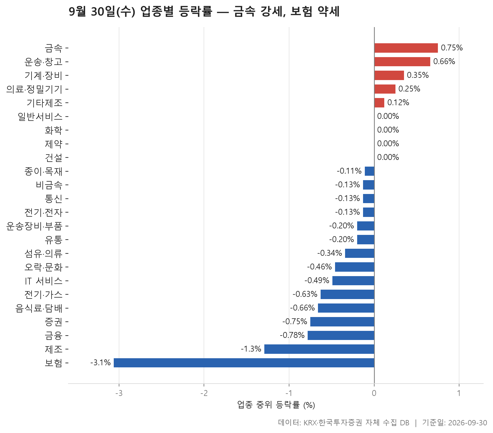
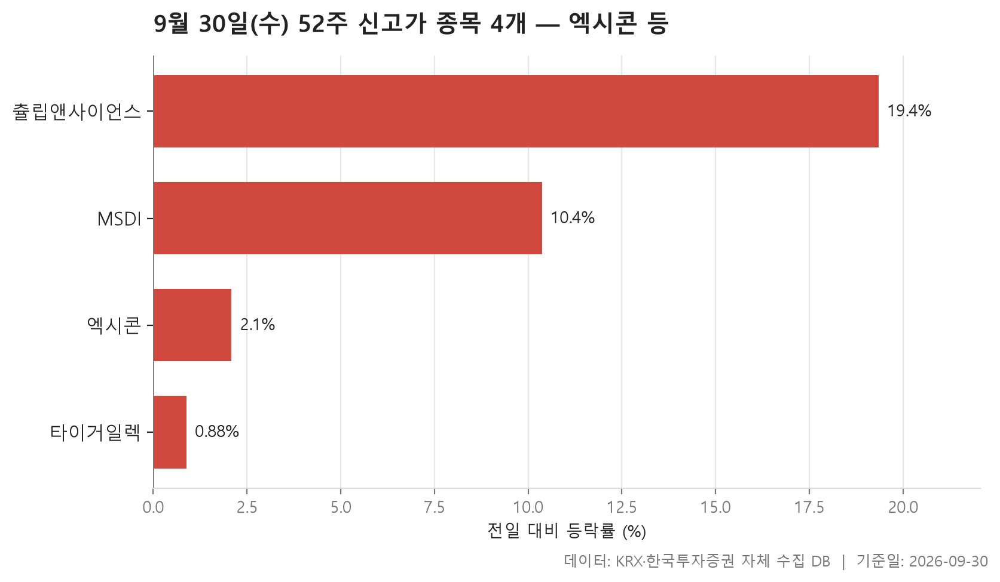
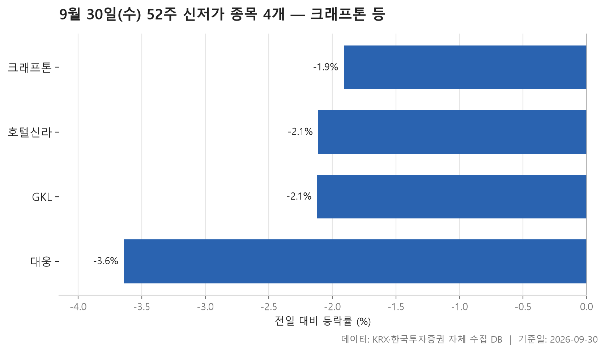
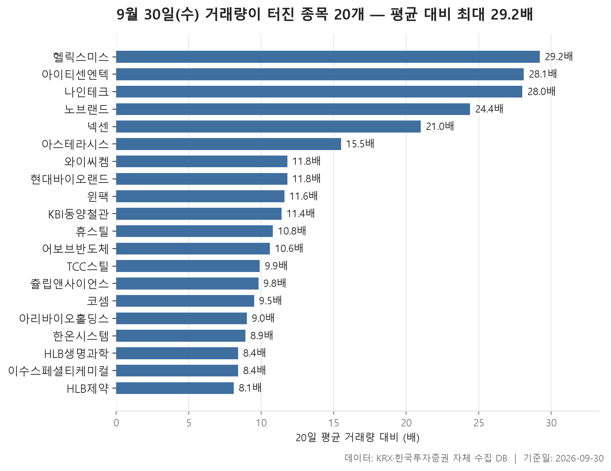

9월 30일 시장은 업종별로 갈렸습니다. 24개 업종을 놓고 보면 오른 업종이 5개, 내린 업종이 15개였고 나머지는 보합 언저리에 머물렀습니다. 업종마다 종목 등락률의 가운데값을 구해 한 줄로 세우면 한가운데 놓이는 값이 -0.13%입니다. 크게 무너진 날은 아니었지만 내린 쪽이 조금 더 많은 하루였다고 보면 됩니다.

맨 위는 금속(+0.75%), 맨 아래는 보험(-3.06%)입니다. 위아래 폭을 보면 하락 쪽 끝이 훨씬 멀리 나가 있습니다. 오른 업종도 오른 폭은 크지 않았고, 보험을 비롯한 금융권 몇 곳이 아래로 많이 처졌습니다.

오늘은 업종 등락을 먼저 보고 52주 신고가·신저가 종목을 확인한 뒤, 거래량이 평소보다 크게 불어난 종목으로 넘어갑니다. 신고가와 신저가는 시장도 규모도 정반대로 갈렸습니다. 거래량이 몰린 종목 명단에는 업종 표에서 강했던 금속이 다시 나옵니다.

> 기준일: 2026-09-30 · 집계: 자체 수집 데이터베이스

## 업종 등락률 — 24개 중 15개 하락

1위 금속은 가운데값이 +0.75%이고 평균은 +1.93%로 더 높습니다. 131개 종목 중 63.40%가 올랐으니 열 곳에 여섯 곳 이상이 오른 셈이고, 한두 종목만 튄 날은 아니었다는 뜻입니다. 동일스틸럭스가 +29.99%로 가장 크게 움직였는데, 이 종목 하나가 업종 평균을 끌어올린 폭은 0.23%p밖에 안 됩니다. 평균과 가운데값의 차이는 이보다 훨씬 크므로 평균을 끌어올린 종목이 여럿이었다고 봐야 합니다. 오른 종목 비율로는 운송·창고가 64.30%로 금속보다 조금 높았습니다.

아래쪽에서는 금융권이 함께 처졌습니다. 증권(-0.75%), 금융(-0.78%), 보험(-3.06%)이 모두 하위권입니다. 보험은 11개 종목 중 오른 비율이 9.10%였으니 열 곳에 한 곳 정도만 올랐습니다. 평균은 -3.66%이고, 한화생명이 -8.58%로 가장 많이 내렸습니다. 업종 전체가 함께 밀렸고 그중 한화생명이 가장 깊었습니다.

표에서 눈여겨볼 곳은 제조입니다. 가운데값은 -1.29%인데 평균은 -3.40%로 크게 벌어져 있습니다. 종목이 7개뿐인 업종에서 코아스가 -16.29% 내렸고, 이 종목 하나가 평균을 -2.33%p 끌어내렸습니다. 평균과 가운데값의 차이가 이 한 종목 몫과 거의 비슷하므로 평균을 낮춘 것은 사실상 코아스 하나라고 볼 수 있습니다. 반대로 의료·정밀기기는 코스모로보틱스가 -29.98% 내렸는데도 가운데값은 +0.25%로 플러스를 지켰습니다. 종목이 100개라 한 종목이 크게 빠져도 업종 전체 흐름은 크게 흔들리지 않았습니다.

돈이 가장 많이 몰린 곳은 여전히 전기·전자입니다. 거래대금이 141,211.20억원으로 다른 업종과 단위가 다를 만큼 크지만, 가운데값은 -0.13%로 딱 중간에 놓였습니다. 돈은 많이 오갔지만 업종 전체로는 방향이 뚜렷하지 않았습니다.

| 업종 | 종목수(개) | 중위등락률(%) | 평균등락률(%) | 상승비율(%) | 주도종목 | 주도종목등락률(%) | 평균기여도(%p) | 거래대금합계(억원) |
|---|---|---|---|---|---|---|---|---|
| 금속 | 131 | +0.75 | +1.93 | 63.40 | 동일스틸럭스 | +29.99 | 0.23 | 5,764.70 |
| 운송·창고 | 28 | +0.66 | +0.35 | 64.30 | 한국공항 | +3.09 | 0.11 | 1,444.00 |
| 기계·장비 | 206 | +0.35 | +0.74 | 58.70 | KS인더스트리 | -12.55 | -0.06 | 18,816.10 |
| 의료·정밀기기 | 100 | +0.25 | +0.42 | 55.00 | 코스모로보틱스 | -29.98 | -0.30 | 2,338.70 |
| 기타제조 | 14 | +0.12 | +0.86 | 50.00 | 엑스플러스 | +14.46 | 1.03 | 12.10 |
| 일반서비스 | 169 | 0.00 | +0.30 | 46.70 | 비케이홀딩스 | +22.58 | 0.13 | 5,231.00 |
| 화학 | 220 | 0.00 | +0.14 | 45.50 | 이수스페셜티케미컬 | +17.21 | 0.08 | 13,247.80 |
| 제약 | 167 | 0.00 | +0.11 | 48.50 | 지놈앤컴퍼니 | +13.59 | 0.08 | 5,728.70 |
| 건설 | 51 | 0.00 | -0.34 | 41.20 | 남화토건 | -5.47 | -0.11 | 2,433.00 |
| 종이·목재 | 25 | -0.11 | +0.10 | 36.00 | 동화기업 | +3.96 | 0.16 | 34.40 |
| 비금속 | 36 | -0.13 | -0.39 | 41.70 | 동양파일 | -4.17 | -0.12 | 384.60 |
| 통신 | 13 | -0.13 | +0.08 | 38.50 | 프리티 | +4.06 | 0.31 | 688.20 |
| 전기·전자 | 366 | -0.13 | +0.09 | 42.30 | 윈팩 | +29.98 | 0.08 | 141,211.20 |
| 운송장비·부품 | 134 | -0.20 | -0.08 | 41.80 | 부산주공 | +18.92 | 0.14 | 8,009.60 |
| 유통 | 157 | -0.20 | -0.19 | 40.80 | 블루엠텍 | +12.36 | 0.08 | 3,865.80 |
| 섬유·의류 | 45 | -0.34 | -0.28 | 35.60 | 형지I&C | -20.61 | -0.46 | 437.50 |
| 오락·문화 | 66 | -0.46 | -0.65 | 30.30 | 아이스크림에듀 | -7.59 | -0.11 | 526.10 |
| IT 서비스 | 247 | -0.49 | -0.49 | 35.60 | 핀텔 | -29.97 | -0.12 | 9,581.90 |
| 전기·가스 | 10 | -0.63 | -0.78 | 10.00 | 한국가스공사 | -1.97 | -0.20 | 336.10 |
| 음식료·담배 | 83 | -0.66 | -0.56 | 20.50 | 한탑 | +10.27 | 0.12 | 1,205.60 |
| 증권 | 18 | -0.75 | -0.79 | 16.70 | 다올투자증권 | -3.18 | -0.18 | 912.70 |
| 금융 | 111 | -0.78 | -0.80 | 25.20 | JB금융지주 | -5.83 | -0.05 | 17,090.30 |
| 제조 | 7 | -1.29 | -3.40 | 14.30 | 코아스 | -16.29 | -2.33 | 15.50 |
| 보험 | 11 | -3.06 | -3.66 | 9.10 | 한화생명 | -8.58 | -0.78 | 2,281.50 |

## 52주 신고가 4개 — 최고 츌립앤사이언스 19.35%

52주 신고가를 쓴 종목은 4개로 모두 KOSDAQ 종목입니다. 시가총액이 가장 큰 엑시콘도 6,394.90억원이니 대형주는 하나도 없습니다. 업종은 전기·전자가 2개, 기계·장비와 일반서비스가 하나씩입니다.

같은 신고가라도 모양은 둘로 나뉩니다. 엑시콘은 +2.08%, 타이거일렉은 +0.88% 올라 이전 고점을 살짝 넘겼습니다. 엑시콘은 48,850원이던 고점을 49,000원으로, 타이거일렉은 91,400원을 91,800원으로 바꿨습니다. 반면 MSDI(+10.37%)와 츌립앤사이언스(+19.35%)는 하루에 크게 뛰며 고점을 넘었습니다. 등락률 가운데값은 6.22%인데, 네 종목이 이 값 근처에 모여 있는 게 아니라 위아래로 갈라져 있습니다.

츌립앤사이언스는 등락률이 가장 높았지만 거래대금은 4.50억원으로 네 종목 중 가장 적습니다. 많지 않은 거래로 가격이 크게 움직였다는 점은 감안하고 봐야 합니다. 이 종목은 뒤의 거래량 급증 표에도 나옵니다.

| 종목명 | 종목코드 | 시장 | 업종 | 종가(원) | 등락률(%) | 이전52주최고(원) | 거래대금(억원) | 시가총액(억원) |
|---|---|---|---|---|---|---|---|---|
| 엑시콘 | 092870 | KOSDAQ | 기계·장비 | 49,000 | +2.08 | 48,850 | 131.80 | 6,394.90 |
| 타이거일렉 | 219130 | KOSDAQ | 전기·전자 | 91,800 | +0.88 | 91,400 | 28.50 | 5,796.50 |
| MSDI | 123010 | KOSDAQ | 전기·전자 | 4,045 | +10.37 | 3,680 | 41.50 | 817.70 |
| 츌립앤사이언스 | 291650 | KOSDAQ | 일반서비스 | 2,245 | +19.35 | 2,130 | 4.50 | 685.20 |

## 52주 신저가 4개 — 최저 대웅 -3.64%

신저가 쪽은 신고가와 정반대입니다. 4개 종목이 모두 KOSPI이고, 업종도 IT 서비스, 유통, 제약, 오락·문화로 하나씩 갈립니다. 규모도 다릅니다. 크래프톤은 시가총액이 89,490.70억원으로 오늘 네 표에 나온 종목 중 가장 크고, 호텔신라도 15,444.10억원입니다. 신고가는 KOSDAQ 소형주에서, 신저가는 KOSPI 대형주에서 나왔습니다.

하루 낙폭은 크지 않았습니다. 가장 많이 내린 대웅이 -3.64%, 가장 적게 내린 크래프톤이 -1.91%이고 가운데값은 -2.12%입니다. 크래프톤은 196,000원이던 저점을 194,900원으로 낮췄고, GKL은 8,800원이던 저점보다 조금 낮은 8,780원에 마감했습니다. 하루에 급락해서가 아니라, 저점 바로 위에 있던 가격이 조금 더 밀리면서 저점을 깼다고 보는 편이 표와 맞습니다. 왜 밀렸는지는 이 자료로 알 수 없습니다.

| 종목명 | 종목코드 | 시장 | 업종 | 종가(원) | 등락률(%) | 이전52주최저(원) | 거래대금(억원) | 시가총액(억원) |
|---|---|---|---|---|---|---|---|---|
| 크래프톤 | 259960 | KOSPI | IT 서비스 | 194,900 | -1.91 | 196,000 | 219.10 | 89,490.70 |
| 호텔신라 | 008770 | KOSPI | 유통 | 39,350 | -2.11 | 39,700 | 115.80 | 15,444.10 |
| 대웅 | 003090 | KOSPI | 제약 | 15,070 | -3.64 | 15,390 | 14.80 | 8,762.00 |
| GKL | 114090 | KOSPI | 오락·문화 | 8,780 | -2.12 | 8,800 | 9.80 | 5,430.90 |

## 거래량 급증 20개 — 최고 헬릭스미스 29.20배

거래량이 지난 20거래일 평균의 5배를 넘긴 종목은 20개입니다. KOSDAQ이 14개로 KOSPI 6개보다 많습니다. 배수 가운데값은 11.10배로, 기준인 5배를 훌쩍 넘는 종목이 많았습니다. 가장 많이 늘어난 헬릭스미스는 평소의 29.20배가 거래되며 +18.85% 올랐고, 명단에서 가장 낮은 HLB제약도 8.10배였습니다.

업종 표와 연결해 볼 대목은 금속입니다. KBI동양철관(+29.97%), TCC스틸(+24.73%), 휴스틸(+9.38%) 세 종목이 거래가 크게 불면서 함께 올랐습니다. 업종 순위 1위였던 금속이 거래량 명단에도 여럿 나온 셈입니다. 업종별로는 화학이 4개로 가장 많고, 그중 이수스페셜티케미컬은 +17.21% 올라 화학 업종에서 가장 크게 움직였습니다. 거래대금도 877.90억원으로 이 명단에서 가장 많습니다.

거래가 몰렸다고 모두 오른 것은 아닙니다. 아리바이오홀딩스는 -12.52%, 현대바이오랜드는 -4.76%, HLB제약은 -2.16%로 내렸습니다. 특히 현대바이오랜드는 하루 거래량이 11,143,651주에 이르렀는데도 하락으로 끝났습니다. 시가총액이 가장 큰 한온시스템(36,124억원)은 평소의 8.90배가 거래되며 +10.00% 올랐습니다. 대형주가 이 정도 배수로 거래된 것은 명단에서 이 종목뿐입니다.

| 종목명 | 종목코드 | 시장 | 업종 | 종가(원) | 등락률(%) | 거래량(주) | 평균거래량(주) | 배수(배) | 거래대금(억원) | 시가총액(억원) |
|---|---|---|---|---|---|---|---|---|---|---|
| 헬릭스미스 | 084990 | KOSDAQ | 일반서비스 | 3,815 | +18.85 | 2,140,225 | 73,410 | 29.20 | 83.40 | 1,758.40 |
| 아이티센엔텍 | 010280 | KOSDAQ | IT 서비스 | 6,000 | +16.73 | 620,915 | 22,112 | 28.10 | 36.20 | 781.50 |
| 나인테크 | 267320 | KOSDAQ | 기계·장비 | 2,820 | +9.30 | 24,189,536 | 864,840 | 28.00 | 690.60 | 1,619.10 |
| 노브랜드 | 145170 | KOSDAQ | 섬유·의류 | 3,695 | +11.46 | 6,791,583 | 277,911 | 24.40 | 260.70 | 624.80 |
| 넥센 | 005720 | KOSPI | 화학 | 6,020 | +11.28 | 336,813 | 16,072 | 21.00 | 20.10 | 3,163.10 |
| 아스테라시스 | 450950 | KOSDAQ | 의료·정밀기기 | 6,200 | +10.71 | 316,176 | 20,463 | 15.50 | 19.20 | 2,332.90 |
| 와이씨켐 | 112290 | KOSDAQ | 화학 | 12,370 | +14.75 | 1,139,703 | 96,459 | 11.80 | 138.10 | 2,501.30 |
| 현대바이오랜드 | 052260 | KOSDAQ | 화학 | 5,400 | -4.76 | 11,143,651 | 941,941 | 11.80 | 620.30 | 1,620.00 |
| 윈팩 | 097800 | KOSDAQ | 전기·전자 | 3,035 | +29.98 | 1,094,111 | 94,580 | 11.60 | 33.20 | 828.30 |
| KBI동양철관 | 008970 | KOSPI | 금속 | 1,483 | +29.97 | 17,587,371 | 1,544,262 | 11.40 | 249.20 | 1,538.90 |
| 휴스틸 | 005010 | KOSPI | 금속 | 4,200 | +9.38 | 4,676,547 | 433,991 | 10.80 | 199.80 | 2,359.90 |
| 어보브반도체 | 102120 | KOSDAQ | 전기·전자 | 8,180 | +4.87 | 1,016,354 | 95,767 | 10.60 | 87.40 | 1,454.50 |
| TCC스틸 | 002710 | KOSPI | 금속 | 14,020 | +24.73 | 2,835,642 | 285,170 | 9.90 | 374.40 | 3,675.20 |
| 츌립앤사이언스 | 291650 | KOSDAQ | 일반서비스 | 2,245 | +19.35 | 207,955 | 21,261 | 9.80 | 4.50 | 685.20 |
| 코셈 | 360350 | KOSDAQ | 의료·정밀기기 | 11,280 | +23.96 | 354,363 | 37,405 | 9.50 | 38.70 | 613.40 |
| 아리바이오홀딩스 | 290690 | KOSDAQ | 전기·전자 | 3,425 | -12.52 | 3,713,130 | 410,316 | 9.00 | 119.70 | 1,817.70 |
| 한온시스템 | 018880 | KOSPI | 기계·장비 | 3,520 | +10.00 | 22,708,507 | 2,537,543 | 8.90 | 798.40 | 36,124.00 |
| HLB생명과학 | 067630 | KOSDAQ | 제약 | 3,930 | +8.26 | 4,478,546 | 533,695 | 8.40 | 179.20 | 4,791.30 |
| 이수스페셜티케미컬 | 457190 | KOSPI | 화학 | 79,700 | +17.21 | 1,128,442 | 134,500 | 8.40 | 877.90 | 24,084.40 |
| HLB제약 | 047920 | KOSDAQ | 일반서비스 | 11,770 | -2.16 | 4,097,255 | 503,897 | 8.10 | 493.80 | 3,860.50 |

## 정리

정리하면 9월 30일은 금속이 넓게 오르고 보험을 비롯한 금융권이 함께 밀린 하루였습니다. 신고가는 KOSDAQ 소형주에서, 신저가는 KOSPI 대형주에서 나왔고, 거래량이 몰린 종목 명단에도 금속 종목이 여럿 들어 있었습니다.

다만 이 표들은 하루 종가끼리 비교한 결과일 뿐 왜 움직였는지는 담고 있지 않습니다. 종목 수가 적은 업종은 한두 종목에 평균이 크게 흔들리고, 거래대금이 적은 종목은 가격이 쉽게 튑니다. 하루 움직임만으로 흐름을 단정하지 말고, 며칠 이어지는지 함께 지켜보시기 바랍니다.

## 집계 기준

**업종 등락률**

- **기준**: 2026-09-29 종가 → 2026-09-30 종가
- **순위**: 업종 내 종목 등락률의 중위값 (평균은 참고용으로 함께 표시)
- **주도종목**: 그 업종에서 등락률 절대값이 가장 큰 종목 (동점이면 거래대금이 큰 쪽)
- **평균기여도**: 그 종목 하나가 업종 평균을 움직인 폭 (등락률 ÷ 종목수). 중위값과 평균의 격차가 이 값에 가까우면 평균을 만든 것이 그 종목이고, 훨씬 크면 다른 종목들도 함께 움직인 것입니다
- **필터**: 업종 내 보통주 5종목 이상
- **전체업종중위등락률(%)**: -0.13

**52주 신고가**

- **기준**: 종가 > 직전 52주 최고가
- **관측구간**: 2025-09-15 ~ 2026-09-29 (252거래일)
- **필터**: 시가총액 500억 이상, 거래대금 3억 이상, 보통주

**52주 신저가**

- **기준**: 종가 < 직전 52주 최저가
- **관측구간**: 2025-09-15 ~ 2026-09-29 (252거래일)
- **필터**: 시가총액 500억 이상, 거래대금 3억 이상, 보통주

**거래량 급증**

- **기준**: 당일 거래량 ≥ 직전 20거래일 평균 × 5
- **관측구간**: 2026-08-31 ~ 2026-09-29 (20거래일)
- **필터**: 시가총액 500억 이상, 거래대금 3억 이상, 보통주

## 데이터 출처 및 유의사항

- **데이터출처**: 한국거래소(KRX) 공시 데이터와 한국투자증권 OpenAPI 를 직접 수집해 구축한 자체 데이터베이스
- **집계방식**: 수집·집계·차트 생성을 직접 구현한 파이프라인에서 자동 산출
- **작성고지**: 본문의 표·통계·차트는 자체 데이터베이스에서 계산된 값이며, 문장 작성 과정에 AI 도구를 활용했습니다.
- **면책**: 본 글은 정보 제공을 목적으로 하며 특정 종목의 매수·매도를 추천하지 않습니다. 제시된 수치는 과거 데이터이고 미래 수익을 보장하지 않습니다. 투자 판단과 그 결과에 대한 책임은 투자자 본인에게 있습니다.

