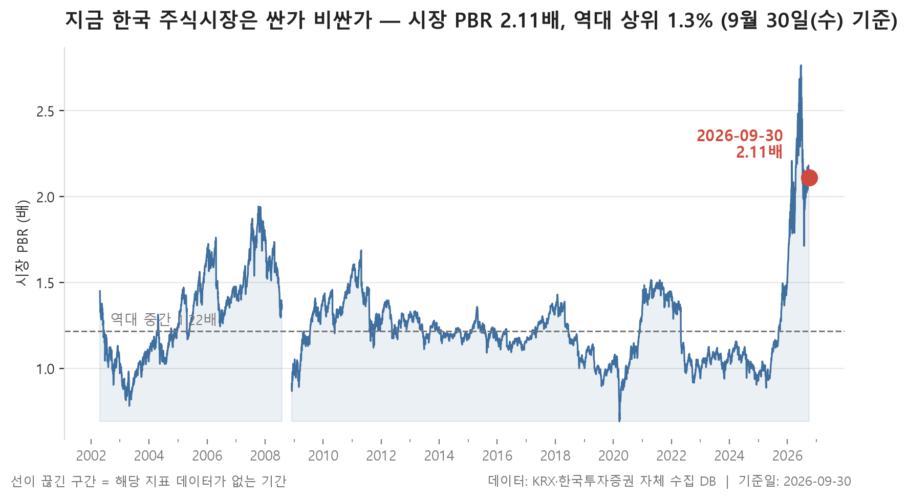
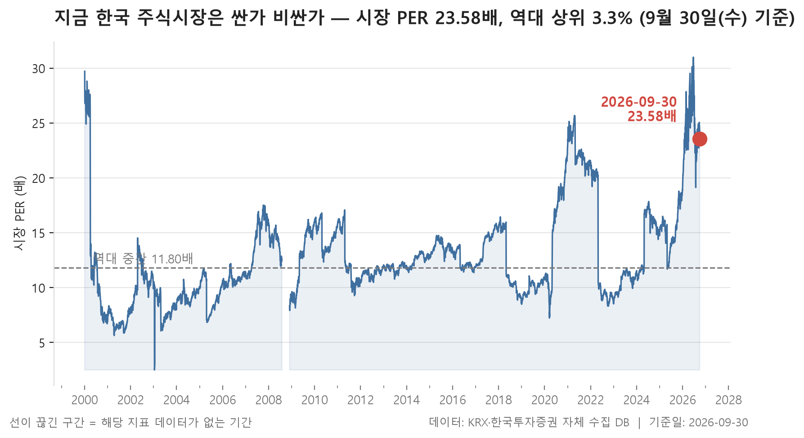
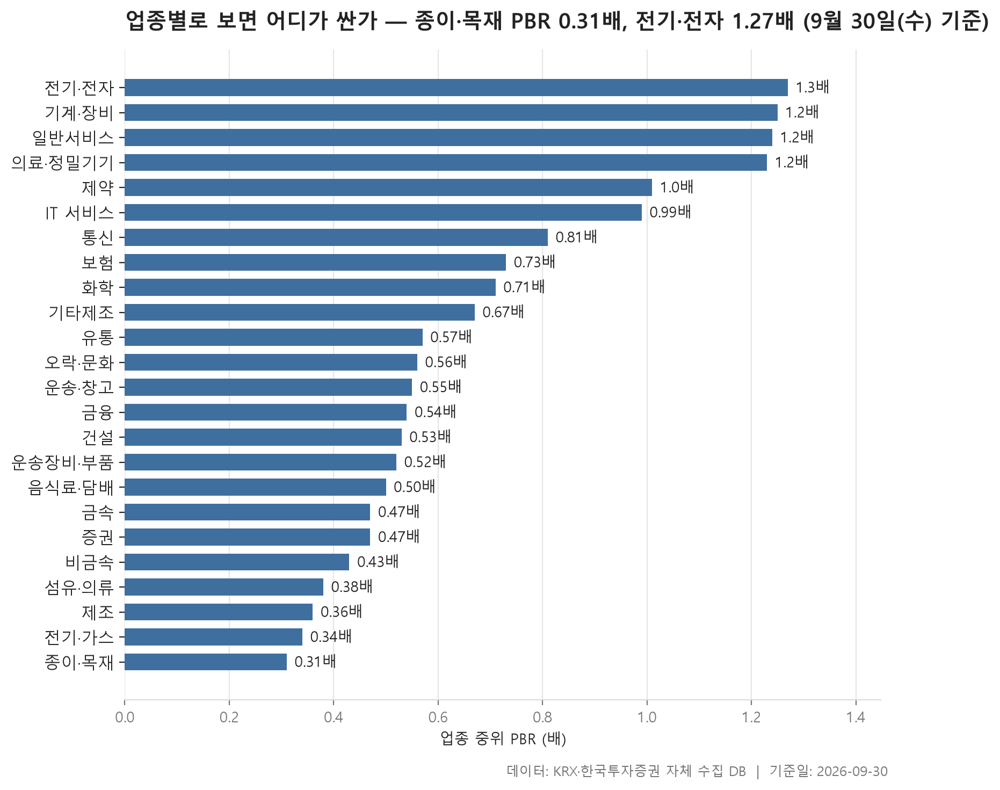
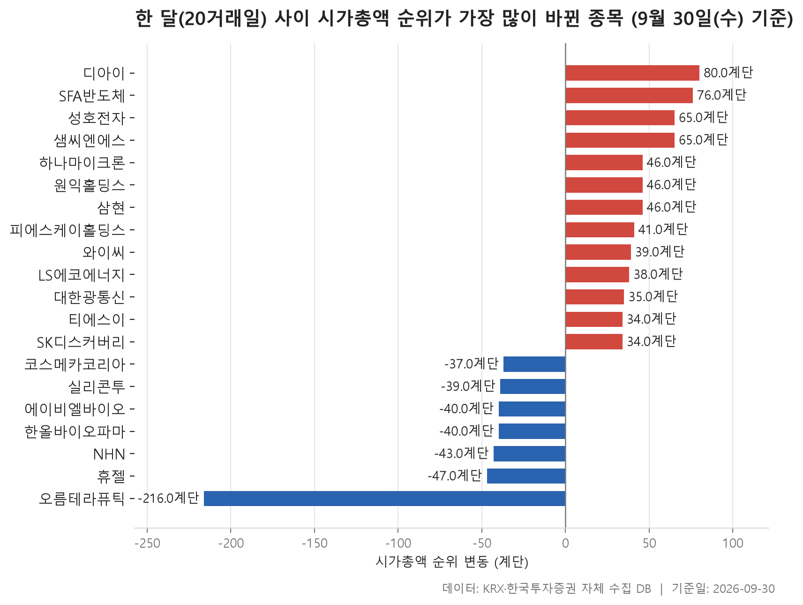

9월 마지막 거래일 기준으로 시장 전체가 역사적으로 어느 정도 가격에 와 있는지부터 봅니다. 결론은 제목대로입니다. 2002-04-23 이후 쌓인 5,939거래일 기록에 비춰 보면, 시가총액으로 가중한 시장 PBR 2.11배는 역대 상위 1.3% 수준입니다. PER과 배당수익률도 같은 방향을 가리킵니다.

다만 시장 전체 숫자 하나로는 그 수준을 누가 만들고 있는지 알 수 없습니다. 그래서 두 번째로 24개 업종의 중위 PBR을 늘어놓고, 시가총액이 어디에 몰려 있는지를 함께 살폈습니다. 업종 하나가 시장 무게의 절반을 훌쩍 넘게 차지하는 구조라 이 부분을 같이 보지 않으면 그림을 잘못 읽기 쉽습니다.

마지막으로 8월 말에서 9월 말까지 한 달 동안 시가총액 상위 300위권에서 자리가 크게 바뀐 20개 종목을 정리했습니다. 개별 종목의 오르내림보다는 어떤 업종이 위로 올라오고 어떤 업종이 밀려났는지, 그 모양을 보시면 됩니다.

> 기준일: 2026-09-30 · 집계: 자체 수집 데이터베이스

## 시장 밸류에이션 백분위 — PER 역대 상위 3.3%, PBR 역대 상위 1.3%, 배당수익률 역대 하위 1.2%

세 지표가 한목소리를 냅니다. 시장 PER은 23.58배로 역대 상위 3.3%, PBR은 2.11배로 역대 상위 1.3%, 배당수익률은 1.09%로 역대 하위 1.2%입니다. 배당수익률은 낮을수록 주가가 비싸다는 뜻이니, 세 가지 모두 '역사적으로 비싼 쪽 끝'을 가리키고 있는 셈입니다. 어느 한 지표만 튀는 게 아니라는 점이 이번 달 표의 핵심입니다.

역대 중간값과 나란히 놓으면 거리감이 더 분명해집니다. PER의 역대 중간값은 11.97배, PBR은 1.22배, 배당수익률은 1.87%였습니다. 지금 값은 이 한가운데에서 한참 떨어져 있습니다. 더 눈여겨볼 대목은 위쪽 끝과의 간격입니다. 하루치 이상값을 걸러내려고 상위 1% 지점을 범위의 끝으로 잡았는데, PBR의 그 지점이 2.19배이고 PER은 25.92배입니다. 현재 PBR 2.11배는 이 끝선 바로 아래에 붙어 있습니다. 배당수익률도 하위 1% 지점인 1.04%와 거의 맞닿아 있습니다.

해석할 때 감안할 점이 하나 있습니다. 집계 종목 수가 관측 초기 약 800개에서 지금은 2,515개로 늘었습니다. 시장을 구성하는 기업의 성격이 20여 년 사이 달라졌으니, 같은 PBR이라도 예전과 지금이 꼭 같은 의미는 아닐 수 있습니다. 백분위는 '과거 기록과 비교한 위치'를 알려줄 뿐, 앞으로의 방향을 말해 주지는 않습니다.

| 지표 | 현재값 | 백분위(%) | 하위1% | 역대중간 | 상위1% | 단위 |
|---|---|---|---|---|---|---|
| 시장 PER | 23.58 | 96.70 | 7.07 | 11.97 | 25.92 | 배 |
| 시장 PBR | 2.11 | 98.70 | 0.87 | 1.22 | 2.19 | 배 |
| 시장 배당수익률 | 1.09 | 1.20 | 1.04 | 1.87 | 3.01 | % |

## 업종별 밸류에이션 — 가장 싼 종이·목재 0.31배, 가장 비싼 전기·전자 1.27배

업종 단위로 내려오면 분위기가 꽤 다릅니다. 24개 업종의 중위 PBR 가운데 가장 낮은 곳은 종이·목재(0.31배), 가장 높은 곳은 전기·전자(1.27배)이고, 한가운데 놓인 값은 0.56배입니다. 시장 전체가 2.11배인데 가장 비싼 업종의 중위 종목조차 1.27배에 머문다는 점이 어긋나 보이는 부분입니다. 중위값은 업종 안의 '보통 종목'을, 시장 PBR은 시가총액으로 가중한 값을 재기 때문에 생기는 차이로 보입니다. 표가 말해 주는 범위에서 정리하면, 시장 전체의 높은 배수는 다수 종목보다는 덩치 큰 소수 종목 쪽에서 나온다고 읽는 편이 자연스럽습니다.

그 덩치가 어디 있는지는 시가총액 비중이 보여 줍니다. 전기·전자 한 업종이 58.85%를 차지하고, 그다음인 금융이 10.17%입니다. 나머지 업종은 대부분 몇 퍼센트 안쪽입니다. 사실상 전기·전자 업종의 가격 수준이 곧 시장 전체의 가격 수준을 좌우하는 구조입니다. 반대로 금융은 비중이 둘째로 크지만 중위 PBR이 0.54배로 표의 중간쯤에 있습니다.

PBR과 PER이 서로 엇갈리는 업종도 보입니다. 비금속은 PBR이 0.43배로 낮은 편인데 흑자 종목만의 중위 PER은 17.18배로 높은 축에 듭니다. 전기·가스는 PER이 3.95배로 가장 낮고 열 곳 중 아홉 곳이 흑자입니다. 반면 종이·목재는 25개 종목 가운데 흑자가 8개뿐이라, 이 업종의 PER은 소수 종목으로 계산된 값이라는 점을 감안해야 합니다. 제조 업종도 7개 중 3개만 흑자입니다. 업종마다 자산 구조와 이익 성격이 달라 낮다고 싸고 높다고 비싼 것은 아니라는 점도 함께 기억해 두시면 좋겠습니다.

| 업종 | 종목수(개) | 중위PBR(배) | 중위PER(배) | 흑자종목수(개) | 시총비중(%) |
|---|---|---|---|---|---|
| 종이·목재 | 25 | 0.31 | 10.43 | 8 | 0.05 |
| 전기·가스 | 10 | 0.34 | 3.95 | 9 | 0.43 |
| 제조 | 7 | 0.36 | 6.06 | 3 | 0.01 |
| 섬유·의류 | 45 | 0.38 | 6.59 | 29 | 0.13 |
| 비금속 | 36 | 0.43 | 17.18 | 23 | 0.17 |
| 금속 | 131 | 0.47 | 14.48 | 82 | 1.58 |
| 증권 | 18 | 0.47 | 7.84 | 17 | 0.85 |
| 음식료·담배 | 83 | 0.50 | 9.19 | 56 | 0.85 |
| 운송장비·부품 | 133 | 0.52 | 7.54 | 98 | 5.69 |
| 건설 | 51 | 0.53 | 7.72 | 40 | 0.68 |
| 금융 | 110 | 0.54 | 8.33 | 94 | 10.17 |
| 운송·창고 | 28 | 0.55 | 6.48 | 18 | 0.97 |
| 오락·문화 | 66 | 0.56 | 10.72 | 33 | 0.35 |
| 유통 | 156 | 0.57 | 11.08 | 97 | 2.02 |
| 기타제조 | 14 | 0.67 | 6.43 | 5 | 0.02 |
| 화학 | 219 | 0.71 | 13.25 | 163 | 3.27 |
| 보험 | 11 | 0.73 | 9.19 | 11 | 1.95 |
| 통신 | 13 | 0.81 | 9.90 | 12 | 0.67 |
| IT 서비스 | 246 | 0.99 | 11.88 | 146 | 2.27 |
| 제약 | 167 | 1.01 | 13.22 | 96 | 3.15 |
| 의료·정밀기기 | 100 | 1.23 | 19.69 | 56 | 0.42 |
| 일반서비스 | 169 | 1.24 | 10.91 | 88 | 1.86 |
| 기계·장비 | 204 | 1.25 | 18.42 | 113 | 3.58 |
| 전기·전자 | 364 | 1.27 | 17.40 | 216 | 58.85 |

## 시총 순위 변동 20개 — 최고 디아이 80계단

한 달 사이 순위가 크게 움직인 20개 종목 가운데 13개가 올라왔고 7개가 밀려났습니다. 변동 폭의 중위값은 36.50계단입니다. 시장으로는 KOSDAQ이 15개, KOSPI가 5개로, 순위가 크게 출렁인 쪽은 대부분 KOSDAQ 종목이었습니다.

가장 극단적인 사례는 오름테라퓨틱입니다. 260위에서 476위로 -216계단 내려가며 300위권 밖으로 밀려났고, 시가총액은 -65.87% 줄었습니다. 하락한 일곱 종목을 보면 휴젤, 에이비엘바이오, 한올바이오파마까지 제약 업종이 절반 넘게 차지합니다. 상승 쪽은 반대로 전기·전자가 5개로 가장 많습니다. 다만 이런 쏠림이 왜 생겼는지는 이 자료로 알 수 없습니다.

순위가 오른 폭과 시가총액이 늘어난 폭이 꼭 비례하지는 않습니다. SFA반도체는 시가총액이 +89.13% 늘며 76계단 올랐는데, 가장 많이 오른 디아이는 +51.64%로 80계단을 올라 372위에서 292위로 상위 300위권에 들어왔습니다. 대한광통신은 +19.48%만으로도 35계단을 올랐습니다. 순위가 낮은 구간일수록 종목들이 비슷한 시가총액에 촘촘히 모여 있어 같은 상승률에도 더 많은 계단을 건너뛰기 때문으로 보입니다.

덩치로는 피에스케이홀딩스가 38,510.40억원으로 가장 큽니다. 173위에서 132위로 41계단 올라 표 안에서 가장 높은 자리에 섰습니다. 이 표는 상위 300위권 언저리의 자리바꿈을 보여 주는 것이지, 시장 최상단의 판도 변화를 담고 있지는 않습니다.

| 종목명 | 종목코드 | 시장 | 업종 | 현재순위(위) | 과거순위(위) | 순위변동(계단) | 시총증감률(%) | 시가총액(억원) |
|---|---|---|---|---|---|---|---|---|
| 오름테라퓨틱 | 475830 | KOSDAQ | 제약 | 476 | 260 | -216 | -65.87 | 4,818.30 |
| 디아이 | 003160 | KOSPI | 의료·정밀기기 | 292 | 372 | 80 | +51.64 | 10,386.10 |
| SFA반도체 | 036540 | KOSDAQ | 전기·전자 | 231 | 307 | 76 | +89.13 | 17,728.80 |
| 성호전자 | 043260 | KOSDAQ | 전기·전자 | 209 | 274 | 65 | +60.05 | 19,957.00 |
| 샘씨엔에스 | 252990 | KOSDAQ | 전기·전자 | 281 | 346 | 65 | +53.03 | 11,887.00 |
| 휴젤 | 145020 | KOSDAQ | 제약 | 192 | 145 | -47 | -28.69 | 22,489.80 |
| 하나마이크론 | 067310 | KOSDAQ | 전기·전자 | 144 | 190 | 46 | +33.19 | 31,483.40 |
| 원익홀딩스 | 030530 | KOSDAQ | 화학 | 208 | 254 | 46 | +40.58 | 20,390.80 |
| 삼현 | 437730 | KOSDAQ | 운송장비·부품 | 249 | 295 | 46 | +54.05 | 15,679.40 |
| NHN | 181710 | KOSPI | IT 서비스 | 230 | 187 | -43 | -26.94 | 17,780.90 |
| 피에스케이홀딩스 | 031980 | KOSDAQ | 기계·장비 | 132 | 173 | 41 | +43.11 | 38,510.40 |
| 에이비엘바이오 | 298380 | KOSDAQ | 제약 | 165 | 125 | -40 | -33.29 | 27,153.90 |
| 한올바이오파마 | 009420 | KOSPI | 제약 | 188 | 148 | -40 | -26.13 | 23,038.10 |
| 실리콘투 | 257720 | KOSDAQ | 유통 | 176 | 137 | -39 | -29.61 | 25,017.30 |
| 와이씨 | 232140 | KOSDAQ | 기계·장비 | 279 | 318 | 39 | +35.15 | 11,986.80 |
| LS에코에너지 | 229640 | KOSPI | 금융 | 221 | 259 | 38 | +34.49 | 18,987.40 |
| 코스메카코리아 | 241710 | KOSDAQ | 화학 | 275 | 238 | -37 | -24.03 | 12,153.80 |
| 대한광통신 | 010170 | KOSDAQ | 전기·전자 | 170 | 205 | 35 | +19.48 | 25,935.00 |
| 티에스이 | 131290 | KOSDAQ | 의료·정밀기기 | 141 | 175 | 34 | +21.94 | 31,967.50 |
| SK디스커버리 | 006120 | KOSPI | 금융 | 283 | 317 | 34 | +28.63 | 11,423.40 |

## 정리

한 문장으로 묶으면, 9월 말 시장은 PER·PBR·배당수익률 모두 역사적 끝자락에 있고, 그 수준은 시가총액의 절반 넘게를 차지하는 전기·전자 업종의 무게에 크게 기대고 있으며, 한 달 사이 상위 300위권에서는 전기·전자가 올라오고 제약이 밀려나는 모양이 나타났습니다.

한계도 분명히 적어 둡니다. 백분위는 과거와 비교한 위치일 뿐 앞날을 예고하지 않고, 그사이 집계 종목 수가 크게 늘어 시점 간 비교에는 주의가 필요합니다. 업종별 배수는 업종마다 성격이 달라 같은 잣대로 줄 세우기 어렵습니다. 순위 변동은 한 달이라는 짧은 구간의 결과이고, 그 원인은 이 자료에 담겨 있지 않습니다.

## 집계 기준

**시장 밸류에이션 백분위**

- **기준**: 시가총액 가중 — 시장 PER = Σ시가총액 / Σ(시가총액÷PER)
- **관측구간**: 2002-04-23 ~ 2026-09-30 (5,939거래일)
- **모집단**: KOSPI·KOSDAQ 보통주
- **백분위해석**: 백분위 30 = 역대 기록 중 30% 만이 현재보다 낮았다는 뜻
- **표본제외**: 집계 종목이 100개 미만인 0일은 모집단에서 제외 (전체 5,939일 중)
- **범위표시**: 절대 최소·최대는 하루치 오류 데이터에 흔들리므로 1~99 분위로 표시
- **표본변화**: 집계 종목 수는 관측 초기 약 800개에서 현재 2,515개로 늘어났습니다. 시점 간 비교 시 참고가 필요합니다.

**업종별 밸류에이션**

- **기준**: 2026-09-30 종가와 같은 날 재무 지표
- **순위**: 업종 내 종목 PBR 의 중위값 (낮은 순)
- **중위PER**: 흑자 종목(PER > 0)만으로 계산합니다. 적자 종목은 PER 이 음수라 순위에 섞으면 가장 싼 업종이 뒤집힙니다
- **시총비중**: 표에 실린 업종 전체를 100 으로 본 비중
- **필터**: PBR 이 있는 보통주 5종목 이상인 업종
- **주의**: PBR·PER 은 업종마다 성격이 달라 서로 다른 업종을 같은 잣대로 비교하기 어렵습니다. 낮다고 싼 것도, 높다고 비싼 것도 아닙니다

**시총 순위 변동**

- **기준**: 2026-08-31 대비 2026-09-30 시가총액 순위 변동 (양수 = 순위 상승)
- **모집단**: 양쪽 날짜 중 한 번이라도 시총 300위 이내였던 보통주

## 데이터 출처 및 유의사항

- **데이터출처**: 한국거래소(KRX) 공시 데이터와 한국투자증권 OpenAPI 를 직접 수집해 구축한 자체 데이터베이스
- **집계방식**: 수집·집계·차트 생성을 직접 구현한 파이프라인에서 자동 산출
- **작성고지**: 본문의 표·통계·차트는 자체 데이터베이스에서 계산된 값이며, 문장 작성 과정에 AI 도구를 활용했습니다.
- **면책**: 본 글은 정보 제공을 목적으로 하며 특정 종목의 매수·매도를 추천하지 않습니다. 제시된 수치는 과거 데이터이고 미래 수익을 보장하지 않습니다. 투자 판단과 그 결과에 대한 책임은 투자자 본인에게 있습니다.

