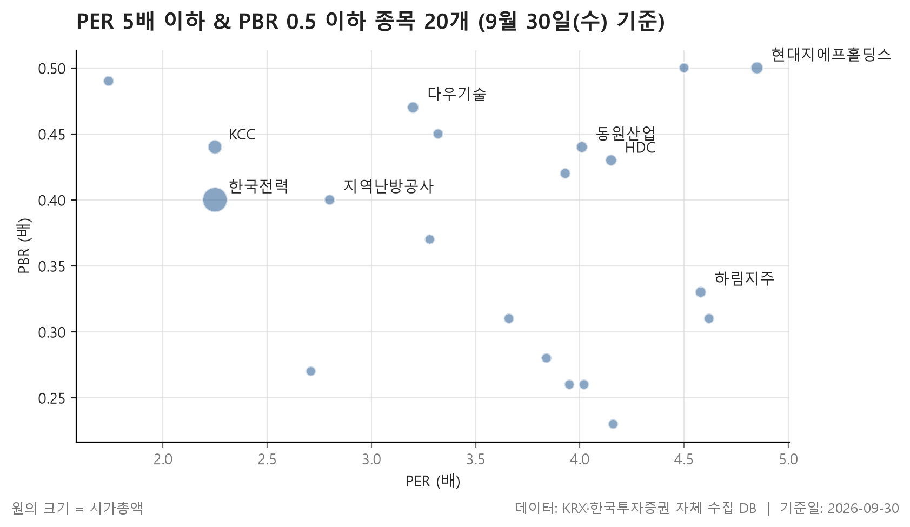
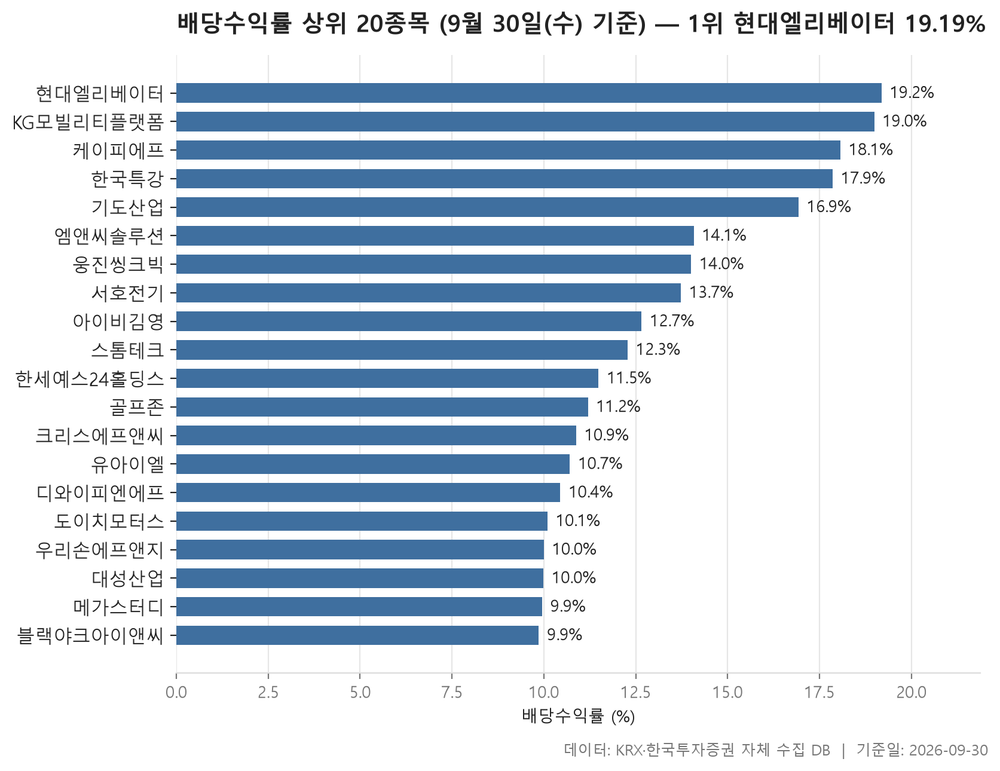
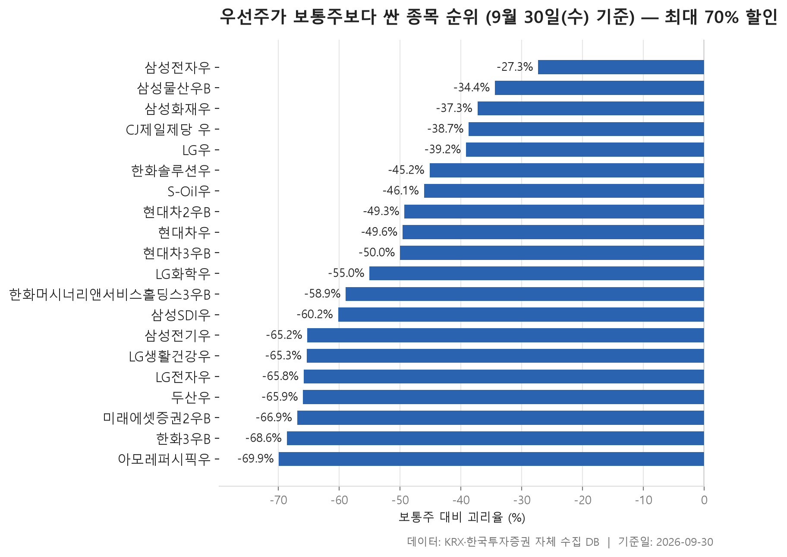

분기가 바뀌었으니 재무제표로 움직이는 지표들을 다시 정리합니다. 주가는 매일 바뀌지만 이익과 순자산은 분기마다 갱신되기 때문에, 이런 지표는 분기 단위로 모아 보는 편이 흐름을 읽기에 낫습니다. 기준일은 2026-09-30이고, 세 가지 표를 차례로 봅니다.

첫 번째는 이익에 견줘서도, 장부상 순자산에 견줘서도 주가가 낮은 종목입니다. PER 5배 이하와 PBR 0.5 이하를 함께 만족하는 보통주 20개를 추렸습니다. 두 번째는 직전 결산 배당을 지금 주가로 나눈 배당수익률이 높은 보통주 20개, 세 번째는 같은 회사의 우선주가 보통주보다 얼마나 싸게 거래되는지를 보여 주는 우선주 괴리율 표입니다.

세 표 모두 숫자가 낮거나 높다는 사실을 보여 줄 뿐, 그 까닭까지 알려 주지는 않습니다. 그래서 이 글은 표 안에서 서로 어긋나 보이는 대목을 짚는 데 집중하겠습니다.

> 기준일: 2026-09-30 · 집계: 자체 수집 데이터베이스

## 저PER·저PBR 20개 — 가장 싼 솔브레인홀딩스 1.74배

두 조건을 동시에 통과한 20개 종목의 PER은 솔브레인홀딩스의 1.74배부터 현대지에프홀딩스의 4.85배까지 퍼져 있고, 한가운데 값은 3.88배입니다. 중간값이 상한보다 꽤 아래에 놓여 있으니, 경계선에 겨우 걸친 종목보다 여유 있게 들어온 종목이 더 많다는 뜻입니다. PBR 쪽은 사정이 조금 다릅니다. F&F홀딩스가 0.23배로 가장 낮지만, 현대지에프홀딩스와 쿠쿠홈시스는 상한인 0.50배에 딱 걸려 있습니다. 순자산 기준으로는 조건을 겨우 넘긴 종목도 섞여 있는 셈입니다.

구성을 보면 KOSPI가 15개, KOSDAQ이 5개이고, 11개 업종 가운데 금융이 6개로 가장 많습니다. 다만 그 여섯 곳의 이름을 보면 동원산업, HDC, 하림지주, LX홀딩스처럼 은행이나 증권사보다는 지주회사가 대부분입니다. 업종 분류만 보고 '금융주가 싸다'고 읽으면 표를 잘못 읽게 됩니다. 전기·가스도 한국전력, 지역난방공사, 삼천리 세 곳이 들어와 눈에 띄는 무리를 이룹니다.

규모 차이도 큽니다. 한국전력의 시가총액이 192,268.20억원인데, 두 번째인 KCC가 40,429.60억원이니 맨 위 한 종목이 나머지와 한참 떨어져 있습니다. 표의 아래쪽으로 내려가면 서희건설의 4,525.40억원처럼 훨씬 작은 종목들이 자리를 채웁니다.

배당은 고르지 않습니다. 지역난방공사가 7.82%, KG스틸이 5.35%, 한국전력이 5.15%로 높은 편이지만, 한화손해보험과 대한해운은 0.00%입니다. 이익에 견줘 주가가 낮다고 해서 그 이익이 주주에게 배당으로 돌아온다는 보장은 없다는 점이 이 대목에서 드러납니다.

| 종목명 | 종목코드 | 시장 | 업종 | 종가(원) | PER(배) | PBR(배) | 배당수익률(%) | BPS(원) | 시가총액(억원) |
|---|---|---|---|---|---|---|---|---|---|
| 한국전력 | 015760 | KOSPI | 전기·가스 | 29,950 | 2.25 | 0.40 | 5.15 | 75,035 | 192,268.20 |
| KCC | 002380 | KOSPI | 화학 | 470,500 | 2.25 | 0.44 | 3.19 | 1,063,952 | 40,429.60 |
| 현대지에프홀딩스 | 005440 | KOSPI | 금융 | 12,810 | 4.85 | 0.50 | 2.34 | 25,658 | 23,493.20 |
| 다우기술 | 023590 | KOSPI | IT 서비스 | 37,500 | 3.20 | 0.47 | 4.80 | 79,869 | 16,232.70 |
| 동원산업 | 006040 | KOSPI | 금융 | 35,300 | 4.01 | 0.44 | 3.26 | 79,927 | 15,581.70 |
| HDC | 012630 | KOSPI | 금융 | 25,150 | 4.15 | 0.43 | 1.79 | 59,006 | 15,025.00 |
| 하림지주 | 003380 | KOSDAQ | 금융 | 10,800 | 4.58 | 0.33 | 1.11 | 32,613 | 12,096.60 |
| 지역난방공사 | 071320 | KOSPI | 전기·가스 | 78,700 | 2.80 | 0.40 | 7.82 | 198,762 | 9,112.50 |
| 솔브레인홀딩스 | 036830 | KOSDAQ | 일반서비스 | 42,100 | 1.74 | 0.49 | 1.19 | 86,410 | 8,632.20 |
| 한화손해보험 | 000370 | KOSPI | 보험 | 7,300 | 3.93 | 0.42 | 0.00 | 17,378 | 8,521.90 |
| 다우데이타 | 032190 | KOSDAQ | 유통 | 18,980 | 3.32 | 0.45 | 2.90 | 42,047 | 7,269.30 |
| 대한해운 | 005880 | KOSPI | 운송·창고 | 2,050 | 3.66 | 0.31 | 0.00 | 6,684 | 6,616.30 |
| LX홀딩스 | 383800 | KOSPI | 금융 | 8,060 | 4.62 | 0.31 | 3.60 | 25,745 | 6,148.20 |
| KG스틸 | 016380 | KOSPI | 금속 | 5,610 | 4.02 | 0.26 | 5.35 | 21,234 | 5,610.50 |
| 넥센타이어 | 002350 | KOSPI | 화학 | 5,640 | 3.84 | 0.28 | 3.55 | 19,967 | 5,508.50 |
| 쿠쿠홈시스 | 284740 | KOSPI | 일반서비스 | 24,000 | 4.50 | 0.50 | 5.00 | 48,373 | 5,385.00 |
| F&F홀딩스 | 007700 | KOSPI | 금융 | 13,380 | 4.16 | 0.23 | 3.74 | 59,179 | 5,233.50 |
| 삼천리 | 004690 | KOSPI | 전기·가스 | 128,700 | 3.95 | 0.26 | 2.33 | 491,062 | 4,667.70 |
| 성우하이텍 | 015750 | KOSDAQ | 운송장비·부품 | 5,720 | 2.71 | 0.27 | 3.50 | 21,208 | 4,576.00 |
| 서희건설 | 035890 | KOSDAQ | 건설 | 2,180 | 3.28 | 0.37 | 4.59 | 5,846 | 4,525.40 |

## 배당수익률 상위 20개 — 최고 현대엘리베이터 19.19%

배당수익률 상위 20개는 현대엘리베이터의 19.19%에서 블랙야크아이앤씨의 9.86%까지이고, 한가운데 값은 11.88%입니다. 20% 이상은 처음부터 걸러 냈기 때문에 맨 위가 그 상한에 바짝 붙어 있습니다.

먼저 눈에 띄는 것은 규모입니다. 시가총액이 가장 큰 현대엘리베이터가 28,537.40억원이고, 나머지는 훨씬 작습니다. 가장 작은 한국특강은 641.70억원에 그칩니다. 시장도 KOSDAQ이 13개로 KOSPI 7개보다 많습니다. 첫 번째 표가 대형주 위주였던 것과는 반대로, 이쪽은 작은 회사들이 주를 이룹니다. 업종에서는 섬유·의류가 4개로 가장 많습니다.

더 짚어 볼 대목은 이익과의 관계입니다. 웅진씽크빅, 한세예스24홀딩스, 대성산업, 블랙야크아이앤씨 네 곳은 PER이 비어 있는데, 적자라서 산출되지 않았다는 뜻입니다. 이익이 없는데도 배당수익률이 높게 나오는 건 이 값이 직전 결산 배당을 기준으로 계산되기 때문입니다. 한국특강은 21.54배, 도이치모터스는 32.17배로 PER이 높아 이익에 비해 배당이 큰 편으로 보입니다. 반대로 기도산업은 PER 1.41배, PBR 0.38배에 배당수익률 16.93%여서 세 지표가 모두 한쪽으로 쏠려 있습니다.

배당수익률은 주가를 분모로 쓰기 때문에 주가가 내려가도 올라갑니다. 엠앤씨솔루션의 2.50배나 서호전기의 2.41배처럼 PBR이 높은 종목이 함께 섞여 있다는 점은, 이 표가 '싼 종목' 목록과는 성격이 다르다는 것을 보여 줍니다. 첫 번째 표의 20개 가운데 이 표에 다시 나오는 종목은 하나도 없습니다.

| 종목명 | 종목코드 | 시장 | 업종 | 종가(원) | 배당수익률(%) | PER(배) | PBR(배) | 시가총액(억원) |
|---|---|---|---|---|---|---|---|---|
| 현대엘리베이터 | 017800 | KOSPI | 기계·장비 | 73,000 | 19.19 | 10.06 | 1.95 | 28,537.40 |
| KG모빌리티플랫폼 | 381970 | KOSPI | 유통 | 6,320 | 18.99 | 6.02 | 1.38 | 3,085.50 |
| 케이피에프 | 024880 | KOSDAQ | 금속 | 3,880 | 18.07 | 3.88 | 0.29 | 773.70 |
| 한국특강 | 007280 | KOSPI | 금속 | 2,240 | 17.86 | 21.54 | 0.30 | 641.70 |
| 기도산업 | 282620 | KOSDAQ | 섬유·의류 | 11,810 | 16.93 | 1.41 | 0.38 | 692.10 |
| 엠앤씨솔루션 | 484870 | KOSPI | 기계·장비 | 17,690 | 14.08 | 10.66 | 2.50 | 4,858.00 |
| 웅진씽크빅 | 095720 | KOSPI | 일반서비스 | 1,213 | 14.01 | - | 0.26 | 689.30 |
| 서호전기 | 065710 | KOSDAQ | 전기·전자 | 43,700 | 13.73 | 9.52 | 2.41 | 2,250.60 |
| 아이비김영 | 339950 | KOSDAQ | 일반서비스 | 2,370 | 12.66 | 4.96 | 1.39 | 1,065.20 |
| 스톰테크 | 352090 | KOSDAQ | 화학 | 3,665 | 12.28 | 9.64 | 1.05 | 984.90 |
| 한세예스24홀딩스 | 016450 | KOSPI | 섬유·의류 | 4,350 | 11.49 | - | 0.37 | 1,740.00 |
| 골프존 | 215000 | KOSDAQ | IT 서비스 | 35,700 | 11.20 | 8.36 | 0.49 | 2,240.30 |
| 크리스에프앤씨 | 110790 | KOSDAQ | 섬유·의류 | 2,940 | 10.88 | 4.78 | 0.17 | 688.90 |
| 유아이엘 | 049520 | KOSDAQ | 전기·전자 | 3,735 | 10.71 | 5.22 | 0.58 | 1,152.00 |
| 디와이피엔에프 | 104460 | KOSDAQ | 기계·장비 | 6,700 | 10.45 | 2.48 | 0.42 | 704.70 |
| 도이치모터스 | 067990 | KOSDAQ | 유통 | 3,860 | 10.10 | 32.17 | 0.29 | 1,126.40 |
| 우리손에프앤지 | 073560 | KOSDAQ | 음식료·담배 | 1,500 | 10.00 | 4.36 | 0.31 | 1,038.60 |
| 대성산업 | 128820 | KOSPI | 유통 | 4,045 | 9.99 | - | 0.24 | 1,829.80 |
| 메가스터디 | 072870 | KOSDAQ | 오락·문화 | 13,270 | 9.95 | 5.55 | 0.45 | 1,581.90 |
| 블랙야크아이앤씨 | 478560 | KOSDAQ | 섬유·의류 | 3,295 | 9.86 | - | 2.22 | 851.10 |

## 우선주 괴리율 20개 — 할인이 가장 큰 아모레퍼시픽우 -69.91%

거래가 어느 정도 이뤄지는 우선주 20개는 모두 보통주보다 싸게 거래됐습니다. 우선주가 더 비싼 경우는 한 건도 없었습니다. 할인 폭은 삼성전자우의 -27.30%에서 아모레퍼시픽우의 -69.91%까지 넓게 퍼져 있고, 한가운데 값은 -52.51%입니다. 절반가량의 우선주가 보통주 값의 절반에도 못 미치는 가격에 거래된다는 뜻입니다.

가장 깔끔한 비교 대상은 현대차입니다. 같은 보통주에 딸린 우선주 세 종목이 -49.28%에서 -50.00% 사이에 촘촘히 모여 있고, 배당수익률도 5.77~5.83%로 거의 같습니다. 같은 회사 안에서는 우선주끼리 값이 크게 벌어지지 않는다는 점을 확인할 수 있습니다.

회사가 다르면 이야기가 달라집니다. 할인이 깊은 쪽의 두산우는 우선주 배당수익률이 0.87%, 삼성전기우는 0.46%이고, 삼성SDI우와 한화솔루션우는 0.00%입니다. 할인이 얕은 쪽에는 CJ제일제당 우가 5.52%, 삼성화재우가 4.91%, LG우가 4.67%로 배당이 높은 우선주가 여럿 있습니다. 그렇다고 일관된 규칙은 아닙니다. 할인이 가장 얕은 삼성전자우의 배당수익률은 0.86%에 불과합니다.

거래대금은 한쪽으로 크게 쏠려 있습니다. 삼성전자우가 9,186.20억원이고, 그다음인 현대차2우B는 133.10억원입니다. 나머지 대부분은 수억에서 수십억원 수준이어서, 할인 폭을 비교할 때 거래 규모가 크게 다르다는 점도 함께 고려해야 합니다.

| 우선주 | 우선주코드 | 보통주 | 보통주코드 | 우선주종가(원) | 보통주종가(원) | 괴리율(%) | 우선주배당수익률(%) | 우선주거래대금(억원) |
|---|---|---|---|---|---|---|---|---|
| 아모레퍼시픽우 | 090435 | 아모레퍼시픽 | 090430 | 41,650 | 138,400 | -69.91 | 2.99 | 9.90 |
| 한화3우B | 00088K | 한화 | 000880 | 39,400 | 125,500 | -68.61 | 2.92 | 8.60 |
| 미래에셋증권2우B | 00680K | 미래에셋증권 | 006800 | 10,240 | 30,950 | -66.91 | 2.93 | 23.70 |
| 두산우 | 000155 | 두산 | 000150 | 466,000 | 1,368,000 | -65.94 | 0.87 | 29.90 |
| LG전자우 | 066575 | LG전자 | 066570 | 72,600 | 212,500 | -65.84 | 1.93 | 30.60 |
| LG생활건강우 | 051905 | LG생활건강 | 051900 | 93,200 | 269,000 | -65.35 | 2.20 | 13.70 |
| 삼성전기우 | 009155 | 삼성전기 | 009150 | 526,000 | 1,513,000 | -65.23 | 0.46 | 51.70 |
| 삼성SDI우 | 006405 | 삼성SDI | 006400 | 205,000 | 515,000 | -60.19 | 0.00 | 6.60 |
| 한화머시너리앤서비스홀딩스3우B | 0220WL | 한화머시너리앤서비스홀딩스 | 0220W0 | 2,345 | 5,710 | -58.93 | 0.00 | 14.70 |
| LG화학우 | 051915 | LG화학 | 051910 | 112,900 | 251,000 | -55.02 | 1.82 | 9.50 |
| 현대차3우B | 005389 | 현대차 | 005380 | 172,500 | 345,000 | -50.00 | 5.83 | 10.10 |
| 현대차우 | 005385 | 현대차 | 005380 | 173,900 | 345,000 | -49.59 | 5.78 | 79.10 |
| 현대차2우B | 005387 | 현대차 | 005380 | 175,000 | 345,000 | -49.28 | 5.77 | 133.10 |
| S-Oil우 | 010955 | S-Oil | 010950 | 87,200 | 161,700 | -46.07 | 0.41 | 17.50 |
| 한화솔루션우 | 009835 | 한화솔루션 | 009830 | 18,590 | 33,900 | -45.16 | 0.00 | 3.20 |
| LG우 | 003555 | LG | 003550 | 67,400 | 110,800 | -39.17 | 4.67 | 3.40 |
| CJ제일제당 우 | 097955 | CJ제일제당 | 097950 | 109,700 | 179,000 | -38.72 | 5.52 | 6.30 |
| 삼성화재우 | 000815 | 삼성화재 | 000810 | 397,000 | 633,000 | -37.28 | 4.91 | 42.50 |
| 삼성물산우B | 02826K | 삼성물산 | 028260 | 224,000 | 341,500 | -34.41 | 1.27 | 9.10 |
| 삼성전자우 | 005935 | 삼성전자 | 005930 | 195,200 | 268,500 | -27.30 | 0.86 | 9,186.20 |

## 정리

세 표를 겹쳐 보면 이렇게 요약됩니다. 이익과 순자산에 견줘 싼 종목은 대형주와 지주회사 쪽에, 배당이 높은 종목은 작은 KOSDAQ 회사 쪽에 몰려 있습니다. 우선주는 예외 없이 보통주보다 싸게 거래되는데, 그 폭은 배당수익률과 뚜렷한 관계를 보이지 않습니다.

한계도 분명합니다. PER과 PBR은 KRX 공시 기준이라 적자 회사는 첫 번째 표에 들어올 수 없습니다. 배당수익률은 직전 결산 기준이어서 다음 배당이 같다는 보장이 없습니다. 우선주 표는 거래대금 기준을 넘긴 종목만 담았습니다. 이 표들은 어디서 숫자가 어긋나는지 보여 주는 지도일 뿐이고, 개별 종목을 고르는 근거로 쓰기에는 담긴 정보가 부족합니다.

## 집계 기준

**저PER·저PBR**

- **기준**: 0 < PER ≤ 5.0, 0 < PBR ≤ 0.5
- **필터**: 시가총액 500억 이상, 보통주
- **주의**: PER/PBR 은 KRX 공시 기준이며 적자 종목은 PER 이 산출되지 않습니다.

**배당수익률 상위**

- **기준**: KRX 공시 배당수익률 (직전 결산 기준)
- **필터**: 0% 초과 20% 미만, 시가총액 500억 이상, 보통주
- **주의**: 직전 결산 배당 기준이므로 향후 배당이 같다는 보장은 없습니다.

**우선주 괴리율**

- **기준**: (우선주 종가 - 보통주 종가) / 보통주 종가 × 100
- **짝짓기**: 우선주 코드 6자리 중 앞 5자리가 같고 끝자리가 0 인 종목을 보통주로 봅니다.
- **필터**: 우선주 거래대금 3억 이상

## 데이터 출처 및 유의사항

- **데이터출처**: 한국거래소(KRX) 공시 데이터와 한국투자증권 OpenAPI 를 직접 수집해 구축한 자체 데이터베이스
- **집계방식**: 수집·집계·차트 생성을 직접 구현한 파이프라인에서 자동 산출
- **작성고지**: 본문의 표·통계·차트는 자체 데이터베이스에서 계산된 값이며, 문장 작성 과정에 AI 도구를 활용했습니다.
- **면책**: 본 글은 정보 제공을 목적으로 하며 특정 종목의 매수·매도를 추천하지 않습니다. 제시된 수치는 과거 데이터이고 미래 수익을 보장하지 않습니다. 투자 판단과 그 결과에 대한 책임은 투자자 본인에게 있습니다.

