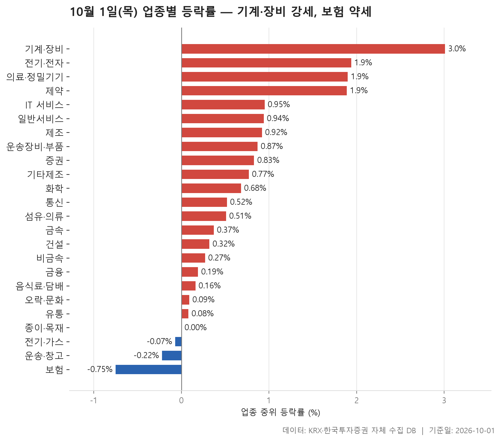
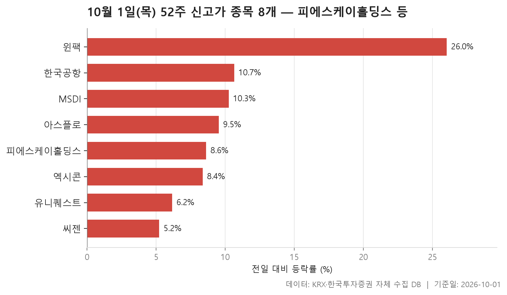
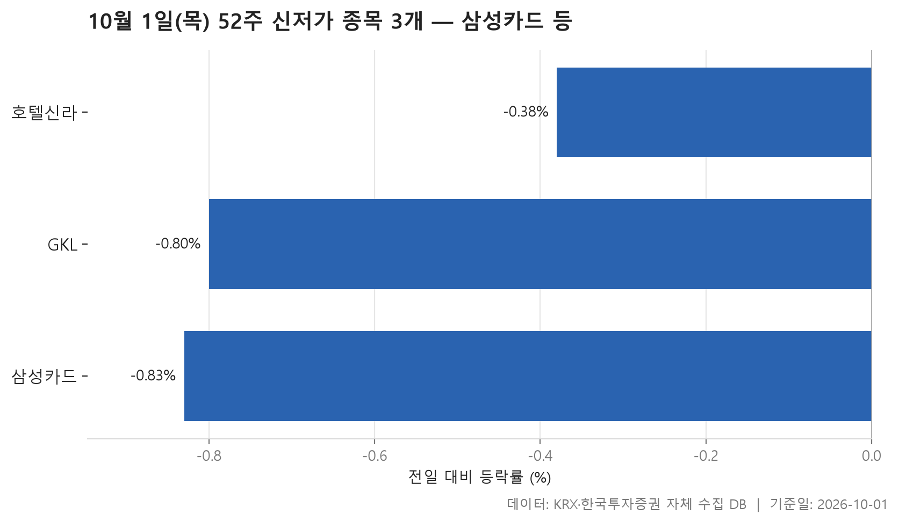
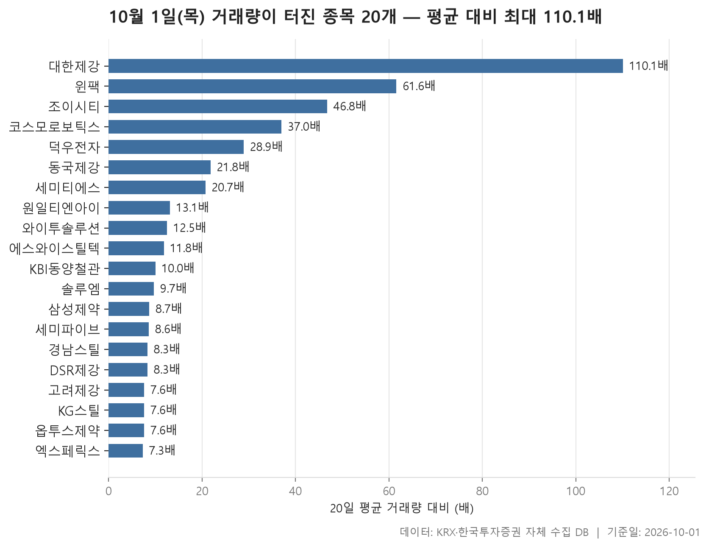

10월 1일 시장은 넓게 오른 하루였습니다. 24개 업종 가운데 20개 업종의 등락률 중위값이 플러스였고, 마이너스는 3개에 그쳤습니다. 업종별 중위값을 한 줄로 세웠을 때 한가운데 놓인 값이 +0.52%입니다. 크게 뛴 날이라기보다는 대부분의 업종이 조금씩 오른 날에 가깝습니다.

그 안에서는 차이가 꽤 났습니다. 맨 위의 기계·장비는 +3.01%, 맨 아래의 보험은 -0.75%였습니다. 오늘 글에서는 업종 흐름을 먼저 보고, 52주 신고가와 신저가 목록, 거래량이 평소보다 크게 늘어난 종목 순서로 살펴봅니다. 표만 봐서는 잘 보이지 않는 부분, 곧 평균과 중위값이 따로 움직인 업종과 거래량은 터졌는데 주가는 거의 안 움직인 종목도 함께 짚겠습니다.

> 기준일: 2026-10-01 · 집계: 자체 수집 데이터베이스

## 업종 등락률 — 24개 중 20개 상승

맨 위의 기계·장비는 205개 종목 가운데 86.80%가 올랐습니다. 열 곳 중 아홉 곳 가까이가 오른 셈이니, 몇 종목만 튄 게 아니라 업종 전체가 함께 오른 모양입니다. 평균은 +3.59%로 중위값보다 조금 높습니다. 상한가 근처까지 오른 원일티엔아이(+29.94%)가 업종 평균을 끌어올린 폭은 0.15%p에 그칩니다. 평균이 높게 나온 것도 한 종목 때문이 아니라는 뜻입니다. 전기·전자(+1.94%), 의료·정밀기기(+1.90%), 제약(+1.89%)이 그 뒤에 비슷한 높이로 붙어 있습니다. 전기·전자는 거래대금을 모두 더하면 122,529.50억원으로, 다른 업종과 비교가 안 될 만큼 돈이 몰렸습니다.

표에서 어긋나 보이는 곳은 두 군데입니다. 하나는 제조입니다. 중위값은 +0.92%인데 평균은 -0.28%로 방향이 거꾸로입니다. 종목이 7개뿐인 업종이라 에넥스(-6.04%) 한 종목이 평균을 0.86%p 끌어내렸고, 그 결과 평균이 마이너스로 바뀌었습니다. 다른 하나는 일반서비스입니다. 중위값 +0.94%에 비해 평균이 +2.27%로 높은데, 알지노믹스(+23.28%)가 올린 폭은 0.14%p뿐입니다. 이 업종에서는 여러 종목이 큰 폭으로 함께 오르며 평균을 밀어 올렸다고 봐야 합니다.

아래쪽은 이와 반대입니다. 보험의 중위값은 -0.75%이고 오른 종목은 36.40%에 그쳤지만 평균은 +0.18%로 플러스입니다. 종목이 11개뿐인 업종에서 롯데손해보험(+5.21%) 하나가 평균을 0.47%p 올렸습니다. 운송·창고도 중위값은 -0.22%인데 한국공항(+10.65%)이 0.38%p를 보태 평균이 +0.26%가 됐습니다. 하위권 업종은 대부분 종목이 약했고, 한두 종목이 평균만 끌어올린 모습입니다. 평균만 보면 이 차이를 놓치기 쉽습니다.

| 업종 | 종목수(개) | 중위등락률(%) | 평균등락률(%) | 상승비율(%) | 주도종목 | 주도종목등락률(%) | 평균기여도(%p) | 거래대금합계(억원) |
|---|---|---|---|---|---|---|---|---|
| 기계·장비 | 205 | +3.01 | +3.59 | 86.80 | 원일티엔아이 | +29.94 | 0.15 | 26,524.30 |
| 전기·전자 | 366 | +1.94 | +2.59 | 78.70 | 덕우전자 | +29.90 | 0.08 | 122,529.50 |
| 의료·정밀기기 | 100 | +1.90 | +2.59 | 75.00 | LK삼양 | +22.77 | 0.23 | 5,541.00 |
| 제약 | 166 | +1.89 | +2.72 | 82.50 | 지투지바이오 | +23.06 | 0.14 | 7,125.40 |
| IT 서비스 | 247 | +0.95 | +1.09 | 68.40 | E8 | -18.97 | -0.08 | 8,752.00 |
| 일반서비스 | 168 | +0.94 | +2.27 | 64.90 | 알지노믹스 | +23.28 | 0.14 | 8,061.60 |
| 제조 | 7 | +0.92 | -0.28 | 71.40 | 에넥스 | -6.04 | -0.86 | 5.00 |
| 운송장비·부품 | 135 | +0.87 | +1.08 | 72.60 | 부산주공 | -9.09 | -0.07 | 10,276.90 |
| 증권 | 18 | +0.83 | +1.35 | 77.80 | 키움증권 | +4.37 | 0.24 | 956.50 |
| 기타제조 | 14 | +0.77 | +1.39 | 64.30 | 피코그램 | +8.86 | 0.63 | 14.20 |
| 화학 | 220 | +0.68 | +1.28 | 65.00 | 진양화학 | -14.05 | -0.06 | 12,047.30 |
| 통신 | 13 | +0.52 | +1.03 | 84.60 | 프리티 | +4.71 | 0.36 | 632.50 |
| 섬유·의류 | 45 | +0.51 | +0.68 | 73.30 | LF | +7.31 | 0.16 | 187.40 |
| 금속 | 131 | +0.37 | +0.30 | 61.80 | 광진실업 | -17.06 | -0.13 | 6,687.00 |
| 건설 | 51 | +0.32 | +0.53 | 62.70 | 세보엠이씨 | +9.73 | 0.19 | 2,830.80 |
| 비금속 | 36 | +0.27 | +0.76 | 58.30 | 쎄노텍 | +9.89 | 0.27 | 435.40 |
| 금융 | 111 | +0.19 | +0.41 | 53.20 | 대성창투 | -9.88 | -0.09 | 16,016.40 |
| 음식료·담배 | 83 | +0.16 | +0.23 | 53.00 | MH에탄올 | +9.80 | 0.12 | 1,053.70 |
| 오락·문화 | 66 | +0.09 | -0.10 | 51.50 | 빌리언스 | -8.65 | -0.13 | 723.60 |
| 유통 | 157 | +0.08 | +0.40 | 51.00 | 에스티큐브 | +10.49 | 0.07 | 3,296.40 |
| 종이·목재 | 25 | 0.00 | +0.32 | 40.00 | 유니드비티플러스 | +5.69 | 0.23 | 23.50 |
| 전기·가스 | 10 | -0.07 | +0.20 | 40.00 | 한국가스공사 | +1.29 | 0.13 | 267.70 |
| 운송·창고 | 28 | -0.22 | +0.26 | 39.30 | 한국공항 | +10.65 | 0.38 | 1,249.70 |
| 보험 | 11 | -0.75 | +0.18 | 36.40 | 롯데손해보험 | +5.21 | 0.47 | 1,291.80 |

## 52주 신고가 8개 — 최고 윈팩 26.03%

종가가 지난 52주 최고가를 넘어선 종목은 8개입니다. KOSDAQ이 6개, KOSPI가 2개이고, 업종으로는 기계·장비가 3개로 가장 많습니다. 업종표 맨 위에 있던 기계·장비가 신고가 목록에서도 가장 많이 보이니, 두 표가 같은 이야기를 하고 있습니다.

덩치가 가장 큰 곳은 시가총액 41,831억원의 피에스케이홀딩스입니다. +8.62% 올라 194,000원으로 마감하며 그전 고점 186,000원을 넘었습니다. 오름폭이 가장 컸던 곳은 윈팩(+26.03%)입니다. 이 종목은 뒤에 나오는 거래량 급증 표에도 다시 나옵니다. 8개 종목의 등락률 중위값이 9.08%이고, 가장 덜 오른 씨젠도 +5.22%입니다. 하루에 작지 않은 폭으로 뛰면서 고점을 넘은 경우가 대부분입니다.

다만 고점을 넘은 폭은 종목마다 다릅니다. MSDI는 종가 4,460원으로 그전 최고가 4,425원을 겨우 넘었습니다. 한국공항은 +10.65% 올랐지만 거래대금이 18.00억원으로 목록에서 가장 작습니다. 큰 돈이 몰려서 올랐다고 보기는 어려운 경우입니다. 운송·창고 업종의 평균을 혼자 끌어올린 종목이 바로 이 한국공항입니다.

| 종목명 | 종목코드 | 시장 | 업종 | 종가(원) | 등락률(%) | 이전52주최고(원) | 거래대금(억원) | 시가총액(억원) |
|---|---|---|---|---|---|---|---|---|
| 피에스케이홀딩스 | 031980 | KOSDAQ | 기계·장비 | 194,000 | +8.62 | 186,000 | 403.60 | 41,831 |
| 씨젠 | 096530 | KOSDAQ | 제약 | 37,300 | +5.22 | 35,750 | 183.70 | 17,432 |
| 엑시콘 | 092870 | KOSDAQ | 기계·장비 | 53,100 | +8.37 | 49,900 | 339.20 | 6,930 |
| 아스플로 | 159010 | KOSDAQ | 기계·장비 | 32,150 | +9.54 | 30,950 | 119.10 | 4,287 |
| 한국공항 | 005430 | KOSPI | 운송·창고 | 99,700 | +10.65 | 95,900 | 18.00 | 3,157 |
| 유니퀘스트 | 077500 | KOSPI | 유통 | 10,700 | +6.15 | 10,410 | 46.90 | 2,311 |
| 윈팩 | 097800 | KOSDAQ | 전기·전자 | 3,825 | +26.03 | 3,500 | 329.90 | 1,044 |
| MSDI | 123010 | KOSDAQ | 전기·전자 | 4,460 | +10.26 | 4,425 | 27.70 | 902 |

## 52주 신저가 3개 — 최저 삼성카드 -0.83%

신저가 쪽은 훨씬 조용합니다. 지난 52주 최저가 아래에서 마감한 종목은 3개이고, 모두 KOSPI 종목입니다. 업종은 금융, 유통, 오락·문화로 하나씩입니다. 세 업종 모두 업종표에서 아래쪽에 있던 곳입니다.

눈여겨볼 점은 하락 폭이 작다는 것입니다. 가장 많이 내린 삼성카드가 -0.83%, 가장 적게 내린 호텔신라가 -0.38%입니다. 크게 떨어져서 바닥을 깬 것이 아니라, 원래 저점 근처에 있던 주가가 조금 밀리면서 기준선을 넘어간 것입니다. 시가총액이 48,487억원으로 가장 큰 삼성카드도 종가 41,850원이 그전 저점 42,100원을 살짝 밑돈 정도입니다. 대부분의 업종이 오른 날에도 이 종목들은 오르지 못했다는 정도로 읽는 것이 맞습니다. 왜 약했는지는 이 자료로 알 수 없습니다.

| 종목명 | 종목코드 | 시장 | 업종 | 종가(원) | 등락률(%) | 이전52주최저(원) | 거래대금(억원) | 시가총액(억원) |
|---|---|---|---|---|---|---|---|---|
| 삼성카드 | 029780 | KOSPI | 금융 | 41,850 | -0.83 | 42,100 | 28.60 | 48,487 |
| 호텔신라 | 008770 | KOSPI | 유통 | 39,200 | -0.38 | 39,300 | 93.70 | 15,385 |
| GKL | 114090 | KOSPI | 오락·문화 | 8,710 | -0.80 | 8,780 | 7.90 | 5,388 |

## 거래량 급증 20개 — 최고 대한제강 110.10배

거래량이 직전 20거래일 평균의 5배를 넘은 종목은 20개입니다. 이들의 배수 중위값은 10.90배로, 평소의 열 배 남짓이 보통이었습니다. 맨 위의 대한제강은 하루 평균 24,853주이던 거래량이 2,735,748주로 늘어 110.10배를 기록했고, 주가도 +16.82% 올랐습니다. 2위 윈팩(61.60배)과 비교해도 차이가 큽니다.

가장 눈에 띄는 것은 금속입니다. 20개 중 8개가 금속 종목인데, 업종표에서 금속의 중위값은 +0.37%로 중간쯤이고 오른 종목은 61.80%였습니다. 거래량 표 안에서도 금속 종목의 주가는 제각각입니다. 대한제강처럼 크게 오른 곳도 있지만 경남스틸(+0.37%), KG스틸(+0.71%), DSR제강(+0.92%)은 거의 움직이지 않았습니다. KBI동양철관은 거래량이 10.00배로 늘었는데 주가는 -2.23%로, 이 표에서 유일하게 내린 종목입니다. 같은 업종에 거래가 한꺼번에 몰렸지만 주가는 같은 방향으로 움직이지 않았습니다. 이유는 자료에 없습니다.

거래대금으로 보면 코스모로보틱스(2,277.90억원)와 세미파이브(1,869.40억원)가 다른 종목보다 훨씬 큽니다. 시가총액이 가장 큰 곳은 솔루엠(7,378억원)입니다. 업종별로 가장 크게 움직인 덕우전자(+29.90%)와 원일티엔아이(+29.94%)도 이 표에 있습니다. 다만 두 종목의 거래대금은 각각 22.90억원, 18.70억원으로 크지 않습니다. 평소 거래가 적은 종목이라 배수가 크게 나온 면도 함께 봐야 합니다.

| 종목명 | 종목코드 | 시장 | 업종 | 종가(원) | 등락률(%) | 거래량(주) | 평균거래량(주) | 배수(배) | 거래대금(억원) | 시가총액(억원) |
|---|---|---|---|---|---|---|---|---|---|---|
| 대한제강 | 084010 | KOSPI | 금속 | 9,100 | +16.82 | 2,735,748 | 24,853 | 110.10 | 265.60 | 3,128 |
| 윈팩 | 097800 | KOSDAQ | 전기·전자 | 3,825 | +26.03 | 9,089,733 | 147,517 | 61.60 | 329.90 | 1,044 |
| 조이시티 | 067000 | KOSDAQ | IT 서비스 | 1,222 | +6.72 | 8,227,191 | 175,643 | 46.80 | 104.10 | 854 |
| 코스모로보틱스 | 439960 | KOSDAQ | 의료·정밀기기 | 8,650 | +15.03 | 26,535,538 | 716,843 | 37.00 | 2,277.90 | 2,807 |
| 덕우전자 | 263600 | KOSDAQ | 전기·전자 | 4,410 | +29.90 | 533,533 | 18,439 | 28.90 | 22.90 | 703 |
| 동국제강 | 460860 | KOSPI | 금속 | 9,880 | +4.55 | 3,170,039 | 145,383 | 21.80 | 334.70 | 4,901 |
| 세미티에스 | 0017J0 | KOSDAQ | 기계·장비 | 3,110 | +22.92 | 4,340,840 | 209,486 | 20.70 | 127.40 | 938 |
| 원일티엔아이 | 136150 | KOSDAQ | 기계·장비 | 10,850 | +29.94 | 175,686 | 13,402 | 13.10 | 18.70 | 909 |
| 와이투솔루션 | 011690 | KOSPI | 전기·전자 | 3,635 | +7.54 | 1,075,949 | 86,303 | 12.50 | 39.60 | 1,334 |
| 에스와이스틸텍 | 365330 | KOSDAQ | 금속 | 1,696 | +8.37 | 3,536,544 | 299,572 | 11.80 | 61.30 | 851 |
| KBI동양철관 | 008970 | KOSPI | 금속 | 1,450 | -2.23 | 24,051,916 | 2,409,381 | 10.00 | 365.00 | 1,505 |
| 솔루엠 | 248070 | KOSPI | 전기·전자 | 15,430 | +15.06 | 835,362 | 86,114 | 9.70 | 122.60 | 7,378 |
| 삼성제약 | 001360 | KOSPI | 제약 | 1,464 | +12.88 | 2,214,750 | 254,632 | 8.70 | 31.40 | 1,379 |
| 세미파이브 | 490470 | KOSDAQ | 일반서비스 | 20,550 | +12.48 | 9,265,950 | 1,074,918 | 8.60 | 1,869.40 | 6,992 |
| 경남스틸 | 039240 | KOSDAQ | 금속 | 1,914 | +0.37 | 333,111 | 40,320 | 8.30 | 6.60 | 516 |
| DSR제강 | 069730 | KOSPI | 금속 | 5,490 | +0.92 | 159,439 | 19,206 | 8.30 | 9.00 | 791 |
| 고려제강 | 002240 | KOSPI | 금속 | 17,380 | +5.02 | 176,345 | 23,143 | 7.60 | 32.00 | 4,693 |
| KG스틸 | 016380 | KOSPI | 금속 | 5,650 | +0.71 | 1,301,992 | 170,804 | 7.60 | 75.80 | 5,651 |
| 옵투스제약 | 131030 | KOSDAQ | 제약 | 6,270 | +4.15 | 144,315 | 18,980 | 7.60 | 9.00 | 1,106 |
| 엑스페릭스 | 317770 | KOSDAQ | 전기·전자 | 2,950 | +12.38 | 757,154 | 103,427 | 7.30 | 21.50 | 1,091 |

## 정리

정리하면 10월 1일은 대부분의 업종이 조금씩 오른 가운데 기계·장비와 전기·전자, 제약 쪽이 업종 전체로 강했던 날입니다. 신고가 8개와 신저가 3개라는 숫자도 같은 흐름을 보여 줍니다. 아래쪽 업종에서는 한두 종목이 평균을 끌어올렸을 뿐 중위값은 마이너스였습니다. 평균과 중위값을 함께 봐야 하는 이유가 여기 있습니다.

이 글은 하루치 종가만으로 만든 기록입니다. 업종이 왜 강했는지, 금속 종목에 거래가 왜 몰렸는지는 이 데이터로 알 수 없습니다. 하루의 움직임이 이어질지도 이 표로는 판단할 수 없습니다. 오늘의 흐름을 정리한 기록으로만 봐 주시기 바랍니다.

## 집계 기준

**업종 등락률**

- **기준**: 2026-09-30 종가 → 2026-10-01 종가
- **순위**: 업종 내 종목 등락률의 중위값 (평균은 참고용으로 함께 표시)
- **주도종목**: 그 업종에서 등락률 절대값이 가장 큰 종목 (동점이면 거래대금이 큰 쪽)
- **평균기여도**: 그 종목 하나가 업종 평균을 움직인 폭 (등락률 ÷ 종목수). 중위값과 평균의 격차가 이 값에 가까우면 평균을 만든 것이 그 종목이고, 훨씬 크면 다른 종목들도 함께 움직인 것입니다
- **필터**: 업종 내 보통주 5종목 이상
- **전체업종중위등락률(%)**: 0.52

**52주 신고가**

- **기준**: 종가 > 직전 52주 최고가
- **관측구간**: 2025-09-16 ~ 2026-09-30 (252거래일)
- **필터**: 시가총액 500억 이상, 거래대금 3억 이상, 보통주

**52주 신저가**

- **기준**: 종가 < 직전 52주 최저가
- **관측구간**: 2025-09-16 ~ 2026-09-30 (252거래일)
- **필터**: 시가총액 500억 이상, 거래대금 3억 이상, 보통주

**거래량 급증**

- **기준**: 당일 거래량 ≥ 직전 20거래일 평균 × 5
- **관측구간**: 2026-09-01 ~ 2026-09-30 (20거래일)
- **필터**: 시가총액 500억 이상, 거래대금 3억 이상, 보통주

## 데이터 출처 및 유의사항

- **데이터출처**: 한국거래소(KRX) 공시 데이터와 한국투자증권 OpenAPI 를 직접 수집해 구축한 자체 데이터베이스
- **집계방식**: 수집·집계·차트 생성을 직접 구현한 파이프라인에서 자동 산출
- **작성고지**: 본문의 표·통계·차트는 자체 데이터베이스에서 계산된 값이며, 문장 작성 과정에 AI 도구를 활용했습니다.
- **면책**: 본 글은 정보 제공을 목적으로 하며 특정 종목의 매수·매도를 추천하지 않습니다. 제시된 수치는 과거 데이터이고 미래 수익을 보장하지 않습니다. 투자 판단과 그 결과에 대한 책임은 투자자 본인에게 있습니다.

