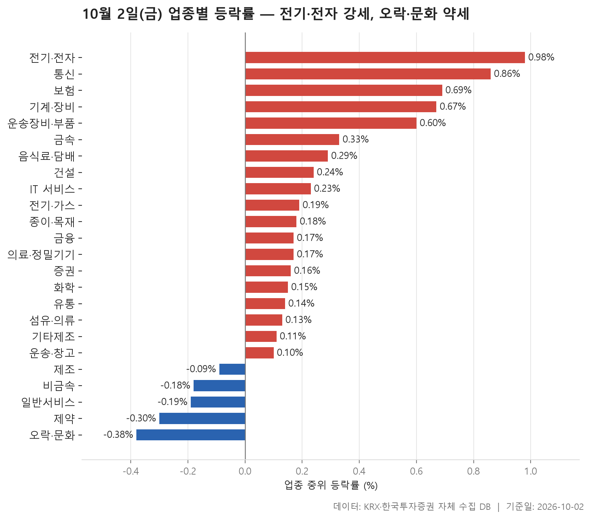
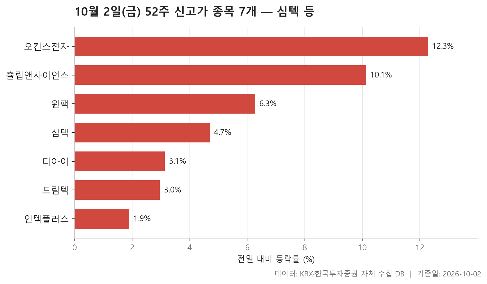
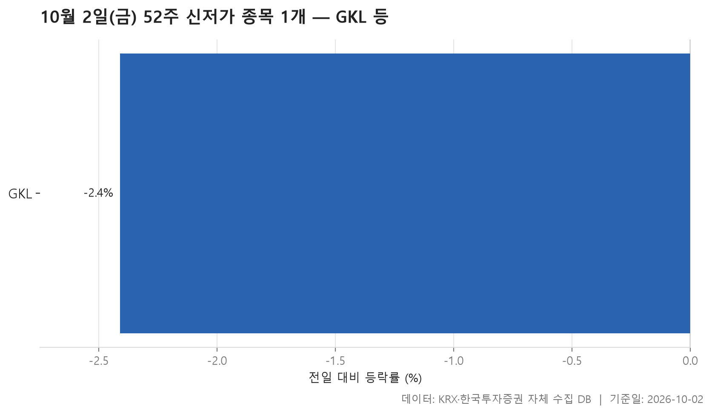
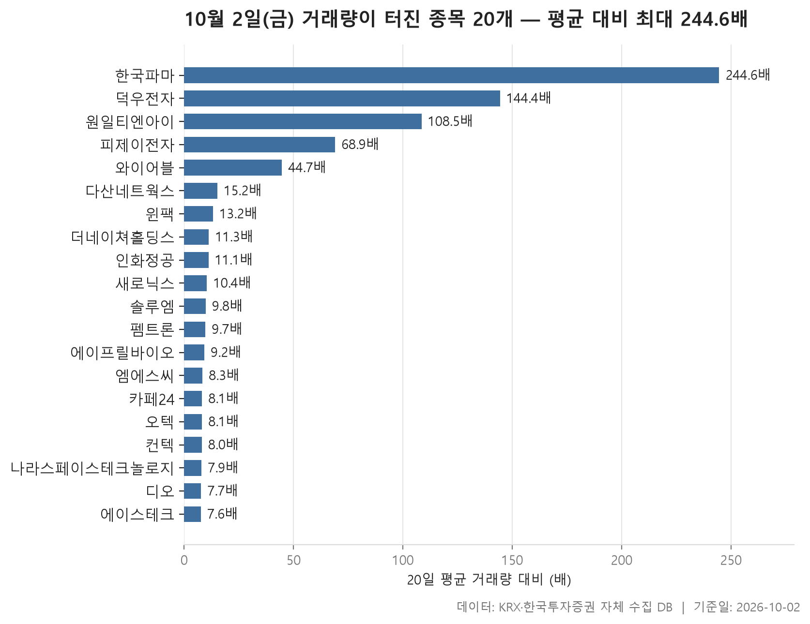

10월 2일 금요일 장은 큰 방향 없이 조금 위쪽으로 기운 하루였습니다. 24개 업종 가운데 19개는 중위 등락률이 플러스였고 5개만 마이너스였습니다. 업종별 중위 등락률을 한 줄로 세웠을 때 한가운데 놓인 값은 **+0.17%**입니다. 맨 위의 전기·전자가 +0.98%, 맨 아래의 오락·문화가 -0.38%로 양 끝이 모두 1%를 넘지 않았습니다. 업종 사이 격차가 크지 않았다는 뜻입니다.

그렇다고 조용하기만 한 장은 아니었습니다. 업종 평균을 들여다보면 몇몇 종목이 숫자를 크게 끌어올린 흔적이 보이고, 거래량이 평소의 몇십 배에서 몇백 배까지 불어난 종목도 스무 개가 나왔습니다. 오늘 글은 업종 흐름, 52주 신고가와 신저가, 거래량이 터진 종목 순서로 정리합니다. 개별 종목보다는 하루의 전체 모양을 보는 데 초점을 맞췄습니다.

> 기준일: 2026-10-02 · 집계: 자체 수집 데이터베이스

## 업종 등락률 — 24개 중 19개 상승

1위 전기·전자는 종목 수가 365개로 가장 많은 업종입니다. 그런데도 중위값이 +0.98%였고, 오른 종목 비중이 64.90%로 열 곳 중 여섯 곳 넘게 올랐습니다. 평균은 +1.69%로 중위값보다 높습니다. 업종에서 가장 크게 움직인 티엠씨(+29.95%)가 업종 평균에 보탠 몫은 0.08%p에 그칩니다. 평균을 끌어올린 게 한 종목이 아니고 여러 종목이 함께 올랐다고 읽는 게 맞습니다. 거래대금도 126,261.90억원으로 다른 업종과 비교가 안 될 만큼 컸습니다.

2위 통신은 성격이 다릅니다. 13개 종목 가운데 오른 비중이 84.60%로 가장 넓게 올랐지만, 평균 +2.75%는 중위값 +0.86%와 거리가 멉니다. 와이어블(+17.58%) 한 종목이 평균을 1.35%p 끌어올렸으니 그 간격은 대부분 이 종목이 만든 것입니다. 기타제조도 비슷합니다. 중위값은 +0.11%인데 평균이 +2.42%이고, 그 차이 대부분은 리튬포어스(+18.20%)가 보탠 1.30%p로 설명됩니다. 섬유·의류는 중위값 +0.13%와 평균 +1.47% 사이가 벌어져 있지만, 에스제이그룹(+29.96%)의 몫은 0.65%p라서 다른 종목들도 평균을 함께 밀어 올린 것으로 보입니다.

흐름과 반대로 움직인 종목도 있습니다. 운송장비·부품에서는 부산주공이 -32.50%로 크게 빠졌는데도 업종 중위값은 +0.60%였고, 오른 종목 비중도 65.90%였습니다. 한 종목의 급락이 업종 전체 분위기를 바꾸지는 못한 셈입니다. 반대로 제약은 한국파마가 +16.27%를 기록했어도 중위값은 -0.30%였고 오른 종목은 열 곳 중 네 곳이 채 안 됐습니다.

최하위 오락·문화는 중위값 -0.38%인데 평균은 +0.11%로 부호가 서로 다릅니다. 오른 종목 비중이 38.50%로 대다수가 약했지만, 키이스트(+16.16%) 같은 일부 상승 종목이 평균만 플러스로 돌려놓은 모습입니다. 중위값으로 순위를 매기는 이유가 여기서 잘 드러납니다.

| 업종 | 종목수(개) | 중위등락률(%) | 평균등락률(%) | 상승비율(%) | 주도종목 | 주도종목등락률(%) | 평균기여도(%p) | 거래대금합계(억원) |
|---|---|---|---|---|---|---|---|---|
| 전기·전자 | 365 | +0.98 | +1.69 | 64.90 | 티엠씨 | +29.95 | 0.08 | 126,261.90 |
| 통신 | 13 | +0.86 | +2.75 | 84.60 | 와이어블 | +17.58 | 1.35 | 824.80 |
| 보험 | 11 | +0.69 | +0.79 | 72.70 | 롯데손해보험 | +4.01 | 0.36 | 1,267.40 |
| 기계·장비 | 206 | +0.67 | +1.02 | 61.70 | 원일티엔아이 | +14.65 | 0.07 | 27,513.80 |
| 운송장비·부품 | 135 | +0.60 | +1.15 | 65.90 | 부산주공 | -32.50 | -0.24 | 11,407.10 |
| 금속 | 132 | +0.33 | +0.34 | 58.30 | 동국산업 | +18.86 | 0.14 | 4,209.50 |
| 음식료·담배 | 83 | +0.29 | +0.26 | 56.60 | 뉴온 | +7.46 | 0.09 | 938.50 |
| 건설 | 51 | +0.24 | +0.05 | 56.90 | 베노티앤알 | -8.68 | -0.17 | 2,423.90 |
| IT 서비스 | 247 | +0.23 | +0.40 | 56.70 | 이루온 | +14.61 | 0.06 | 7,649.70 |
| 전기·가스 | 10 | +0.19 | +0.19 | 50.00 | 한국가스공사 | +2.13 | 0.21 | 304.10 |
| 종이·목재 | 25 | +0.18 | +0.65 | 52.00 | 국일제지 | +4.37 | 0.17 | 29.40 |
| 금융 | 111 | +0.17 | +0.53 | 58.60 | OCI홀딩스 | +7.01 | 0.06 | 13,595.90 |
| 의료·정밀기기 | 100 | +0.17 | +0.72 | 51.00 | 피제이전자 | +29.91 | 0.30 | 2,950.00 |
| 증권 | 18 | +0.16 | +0.41 | 66.70 | 상상인증권 | +4.09 | 0.23 | 715.60 |
| 화학 | 220 | +0.15 | +0.33 | 53.60 | 예선테크 | +13.76 | 0.06 | 12,882.00 |
| 유통 | 157 | +0.14 | +0.44 | 52.90 | 엑시온그룹 | +29.96 | 0.19 | 4,286.10 |
| 섬유·의류 | 46 | +0.13 | +1.47 | 52.20 | 에스제이그룹 | +29.96 | 0.65 | 259.10 |
| 기타제조 | 14 | +0.11 | +2.42 | 57.10 | 리튬포어스 | +18.20 | 1.30 | 36.70 |
| 운송·창고 | 28 | +0.10 | +0.27 | 50.00 | 팬오션 | +6.12 | 0.22 | 1,316.50 |
| 제조 | 7 | -0.09 | -0.02 | 28.60 | 지누스 | +1.47 | 0.21 | 5.90 |
| 비금속 | 36 | -0.18 | -0.18 | 36.10 | 티씨케이 | -5.73 | -0.16 | 439.80 |
| 일반서비스 | 167 | -0.19 | -0.67 | 40.70 | 에이프릴바이오 | -20.09 | -0.12 | 5,257.40 |
| 제약 | 166 | -0.30 | -0.27 | 38.60 | 한국파마 | +16.27 | 0.10 | 5,329.20 |
| 오락·문화 | 65 | -0.38 | +0.11 | 38.50 | 키이스트 | +16.16 | 0.25 | 624.20 |

## 52주 신고가 7개 — 최고 오킨스전자 12.28%

종가가 직전 52주 최고가를 넘어선 종목은 7개입니다. 이 가운데 4개가 전기·전자여서 업종 순위에서 본 강세가 신고가 목록에서도 그대로 보입니다. 시장별로는 KOSDAQ이 5개, KOSPI가 2개입니다.

덩치가 가장 큰 종목은 시가총액 64,346억원의 심텍입니다. 하루 +4.70%를 올라 167,200원에 마감하면서 이전 고점 164,200원을 넘어섰습니다. 이 +4.70%가 일곱 종목 등락률의 중위값이기도 합니다. 가장 많이 오른 종목은 오킨스전자(+12.28%)였습니다. 인텍플러스는 +1.90%로 상승 폭이 가장 작았고, 종가 59,100원이 이전 고점 59,000원을 근소하게 넘어선 정도라 간신히 걸린 경우에 가깝습니다.

하나 짚어 둘 종목은 츌립앤사이언스입니다. +10.13%로 상위권에 올랐지만 거래대금이 3.10억원으로 목록에서 가장 적어, 필터 기준선을 겨우 넘었습니다. 거래가 얇은 상태에서 나온 신고가라는 점은 따로 봐 둘 만합니다. 윈팩은 이 목록에도 있고 뒤의 거래량 급증 목록에도 다시 나옵니다.

| 종목명 | 종목코드 | 시장 | 업종 | 종가(원) | 등락률(%) | 이전52주최고(원) | 거래대금(억원) | 시가총액(억원) |
|---|---|---|---|---|---|---|---|---|
| 심텍 | 222800 | KOSDAQ | 전기·전자 | 167,200 | +4.70 | 164,200 | 1,742.50 | 64,346 |
| 디아이 | 003160 | KOSPI | 의료·정밀기기 | 42,800 | +3.13 | 41,900 | 533.80 | 12,112 |
| 인텍플러스 | 064290 | KOSDAQ | 기계·장비 | 59,100 | +1.90 | 59,000 | 282.20 | 7,658 |
| 드림텍 | 192650 | KOSPI | 전기·전자 | 9,380 | +2.96 | 9,250 | 111.60 | 6,180 |
| 오킨스전자 | 080580 | KOSDAQ | 전기·전자 | 29,250 | +12.28 | 27,500 | 369.80 | 6,169 |
| 윈팩 | 097800 | KOSDAQ | 전기·전자 | 4,065 | +6.27 | 3,940 | 332.60 | 1,109 |
| 츌립앤사이언스 | 291650 | KOSDAQ | 일반서비스 | 2,500 | +10.13 | 2,340 | 3.10 | 763 |

## 52주 신저가 1개 — GKL -2.41%

신저가 쪽은 한 종목뿐이었습니다. 신고가가 7개였던 것과 견주면 오늘 시장의 기울기가 이쪽에서도 드러납니다. 신저가 종목은 KOSPI의 GKL로, -2.41% 내린 8,500원에 마감하며 직전 52주 최저가 8,580원 아래로 내려갔습니다.

GKL은 오늘 업종 순위 최하위였던 오락·문화에 속합니다. 업종 전체가 약했던 날, 그 안의 한 종목이 1년 저점을 새로 썼다는 정도까지가 표에서 읽을 수 있는 내용입니다. 거래대금은 13.10억원으로 크지 않았고, 왜 내렸는지는 이 자료로 알 수 없습니다.

| 종목명 | 종목코드 | 시장 | 업종 | 종가(원) | 등락률(%) | 이전52주최저(원) | 거래대금(억원) | 시가총액(억원) |
|---|---|---|---|---|---|---|---|---|
| GKL | 114090 | KOSPI | 오락·문화 | 8,500 | -2.41 | 8,580 | 13.10 | 5,258 |

## 거래량 급증 20개 — 최고 한국파마 244.60배

거래량이 직전 20거래일 평균의 5배를 넘은 종목은 20개입니다. 이 가운데 19개가 KOSDAQ이고, KOSPI는 시가총액 7,985억원으로 목록에서 가장 큰 솔루엠 하나였습니다. 업종별로는 전기·전자가 6개로 가장 많습니다. 배수의 중위값은 10.10배로, 기준선의 두 배쯤에 몰려 있다고 보면 됩니다.

맨 위의 몇 종목은 차원이 다릅니다. 한국파마는 평소 하루 8,091주가 오가던 종목인데 이날 1,978,899주가 거래돼 평소의 244.60배를 기록했습니다. 덕우전자(144.40배)와 원일티엔아이(108.50배)도 100배를 넘겼습니다. 한국파마, 원일티엔아이, 피제이전자, 와이어블은 앞의 업종 표에서 각 업종을 가장 크게 움직인 종목으로 이미 나왔던 이름들입니다. 업종 표에 찍힌 큰 움직임이 상당 부분 거래량 폭증과 함께 나왔다는 얘기입니다.

거래량이 늘었다고 모두 오른 것은 아닙니다. 에이프릴바이오는 -20.09%로 급락하면서 거래가 몰렸고, 새로닉스(-8.31%)와 카페24(-2.36%)도 내린 쪽입니다. 배수만 보면 눈에 덜 띄는 종목도 있습니다. 나라스페이스테크놀로지는 7.90배로 하위권이지만 거래대금은 1,419.20억원으로 목록에서 단연 큽니다. 원래 평균 거래량이 1,091,026주로 많은 종목이라 배수가 작게 나왔을 뿐, 실제로 들어온 돈은 가장 많았습니다. 배수와 거래대금은 함께 봐야 합니다.

| 종목명 | 종목코드 | 시장 | 업종 | 종가(원) | 등락률(%) | 거래량(주) | 평균거래량(주) | 배수(배) | 거래대금(억원) | 시가총액(억원) |
|---|---|---|---|---|---|---|---|---|---|---|
| 한국파마 | 032300 | KOSDAQ | 제약 | 8,720 | +16.27 | 1,978,899 | 8,091 | 244.60 | 177.00 | 951 |
| 덕우전자 | 263600 | KOSDAQ | 전기·전자 | 5,290 | +19.95 | 6,444,527 | 44,631 | 144.40 | 343.40 | 843 |
| 원일티엔아이 | 136150 | KOSDAQ | 기계·장비 | 12,440 | +14.65 | 2,349,703 | 21,646 | 108.50 | 311.20 | 1,043 |
| 피제이전자 | 006140 | KOSDAQ | 의료·정밀기기 | 5,690 | +29.91 | 1,684,905 | 24,441 | 68.90 | 89.10 | 846 |
| 와이어블 | 065530 | KOSDAQ | 통신 | 1,505 | +17.58 | 8,229,798 | 184,130 | 44.70 | 126.10 | 720 |
| 다산네트웍스 | 039560 | KOSDAQ | 전기·전자 | 2,995 | +15.64 | 2,629,240 | 173,416 | 15.20 | 77.40 | 1,285 |
| 윈팩 | 097800 | KOSDAQ | 전기·전자 | 4,065 | +6.27 | 7,930,423 | 600,606 | 13.20 | 332.60 | 1,109 |
| 더네이쳐홀딩스 | 298540 | KOSDAQ | 섬유·의류 | 6,770 | +1.65 | 69,323 | 6,127 | 11.30 | 4.60 | 981 |
| 인화정공 | 101930 | KOSDAQ | 운송장비·부품 | 6,460 | +4.70 | 132,860 | 11,940 | 11.10 | 8.80 | 2,952 |
| 새로닉스 | 042600 | KOSDAQ | 전기·전자 | 11,140 | -8.31 | 124,170 | 11,939 | 10.40 | 13.60 | 1,384 |
| 솔루엠 | 248070 | KOSPI | 전기·전자 | 16,700 | +8.23 | 1,225,738 | 125,233 | 9.80 | 205.20 | 7,985 |
| 펨트론 | 168360 | KOSDAQ | 기계·장비 | 16,040 | +7.94 | 776,877 | 80,417 | 9.70 | 126.60 | 3,592 |
| 에이프릴바이오 | 397030 | KOSDAQ | 일반서비스 | 17,020 | -20.09 | 1,570,825 | 169,895 | 9.20 | 280.30 | 4,691 |
| 엠에스씨 | 009780 | KOSDAQ | 음식료·담배 | 7,480 | +6.10 | 62,028 | 7,481 | 8.30 | 4.60 | 1,316 |
| 카페24 | 042000 | KOSDAQ | IT 서비스 | 20,700 | -2.36 | 1,353,963 | 166,427 | 8.10 | 266.90 | 5,005 |
| 오텍 | 067170 | KOSDAQ | 운송장비·부품 | 2,845 | +8.38 | 2,443,496 | 302,948 | 8.10 | 70.10 | 781 |
| 컨텍 | 451760 | KOSDAQ | IT 서비스 | 8,830 | +5.12 | 754,880 | 94,693 | 8.00 | 67.80 | 1,458 |
| 나라스페이스테크놀로지 | 478340 | KOSDAQ | 운송장비·부품 | 17,410 | +22.95 | 8,576,495 | 1,091,026 | 7.90 | 1,419.20 | 2,021 |
| 디오 | 039840 | KOSDAQ | 의료·정밀기기 | 10,140 | +6.51 | 317,489 | 41,392 | 7.70 | 32.90 | 1,360 |
| 에이스테크 | 088800 | KOSDAQ | 전기·전자 | 2,395 | +9.61 | 3,491,626 | 457,969 | 7.60 | 85.90 | 1,808 |

## 정리

정리하면 10월 2일은 업종 대부분이 소폭 오른 가운데 전기·전자가 종목 수와 거래대금 양쪽에서 넓게 강했고, 몇몇 업종의 평균은 개별 종목 한두 개의 급등에 크게 흔들린 하루였습니다. 신고가 7개와 신저가 1개, KOSDAQ 쪽에 몰린 거래량 급증이 같은 그림을 보여 줍니다.

이 글은 하루치 종가만으로 만든 집계라서 등락의 원인은 담고 있지 않습니다. 시가총액과 거래대금 필터 아래에 있는 소형주도 빠져 있습니다. 표는 그날 시장의 모양을 보여 줄 뿐 이후 방향을 말해 주지는 않습니다.

## 집계 기준

**업종 등락률**

- **기준**: 2026-10-01 종가 → 2026-10-02 종가
- **순위**: 업종 내 종목 등락률의 중위값 (평균은 참고용으로 함께 표시)
- **주도종목**: 그 업종에서 등락률 절대값이 가장 큰 종목 (동점이면 거래대금이 큰 쪽)
- **평균기여도**: 그 종목 하나가 업종 평균을 움직인 폭 (등락률 ÷ 종목수). 중위값과 평균의 격차가 이 값에 가까우면 평균을 만든 것이 그 종목이고, 훨씬 크면 다른 종목들도 함께 움직인 것입니다
- **필터**: 업종 내 보통주 5종목 이상
- **전체업종중위등락률(%)**: 0.17

**52주 신고가**

- **기준**: 종가 > 직전 52주 최고가
- **관측구간**: 2025-09-17 ~ 2026-10-01 (252거래일)
- **필터**: 시가총액 500억 이상, 거래대금 3억 이상, 보통주

**52주 신저가**

- **기준**: 종가 < 직전 52주 최저가
- **관측구간**: 2025-09-17 ~ 2026-10-01 (252거래일)
- **필터**: 시가총액 500억 이상, 거래대금 3억 이상, 보통주

**거래량 급증**

- **기준**: 당일 거래량 ≥ 직전 20거래일 평균 × 5
- **관측구간**: 2026-09-02 ~ 2026-10-01 (20거래일)
- **필터**: 시가총액 500억 이상, 거래대금 3억 이상, 보통주

## 데이터 출처 및 유의사항

- **데이터출처**: 한국거래소(KRX) 공시 데이터와 한국투자증권 OpenAPI 를 직접 수집해 구축한 자체 데이터베이스
- **집계방식**: 수집·집계·차트 생성을 직접 구현한 파이프라인에서 자동 산출
- **작성고지**: 본문의 표·통계·차트는 자체 데이터베이스에서 계산된 값이며, 문장 작성 과정에 AI 도구를 활용했습니다.
- **면책**: 본 글은 정보 제공을 목적으로 하며 특정 종목의 매수·매도를 추천하지 않습니다. 제시된 수치는 과거 데이터이고 미래 수익을 보장하지 않습니다. 투자 판단과 그 결과에 대한 책임은 투자자 본인에게 있습니다.

