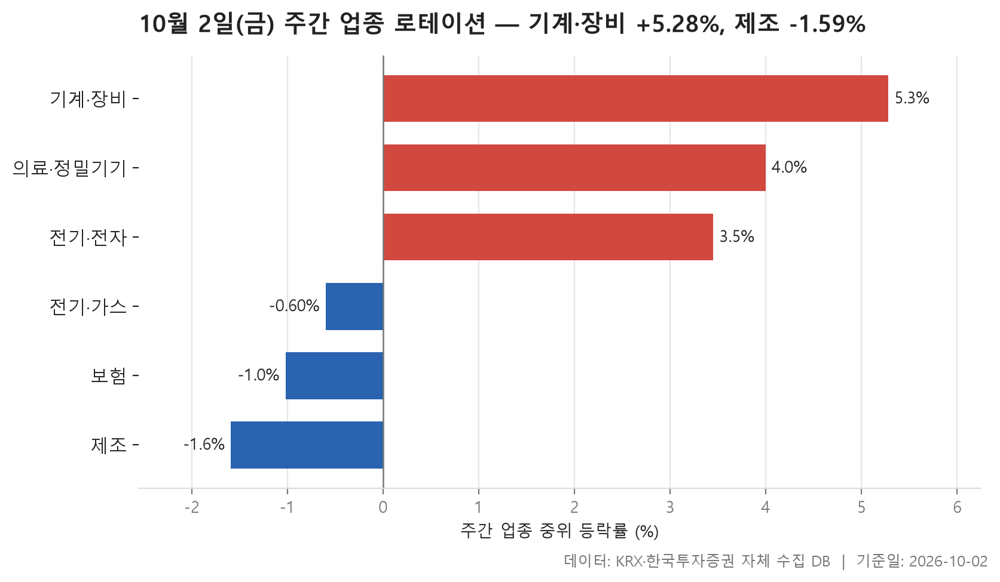
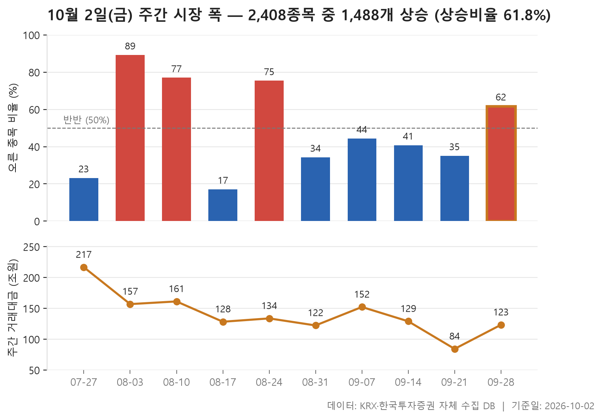
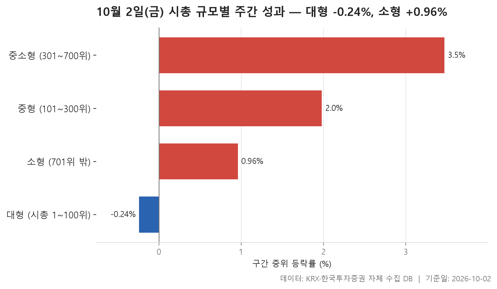

9월 28일부터 10월 2일까지, 거래일 닷새를 한 묶음으로 놓고 봤습니다. 출발선은 직전 주 마지막 거래일 종가입니다. 한 주 동안 가장 강했던 업종은 기계·장비였습니다. 업종 안 종목들의 등락률을 한 줄로 세웠을 때 한가운데 놓인 값이 +5.28%입니다. 반대쪽 끝에는 제조가 -1.59%로 자리했습니다.

시장 전체로 넓혀 보면 오른 종목이 1,488개, 내린 종목이 879개로 오른 쪽이 많았습니다. 9월 들어 내린 종목이 더 많은 주가 이어졌는데, 그 흐름이 이번 주에 끊겼습니다. 시가총액 순위로 나눠 보면 301~700위 중소형 구간이 +3.47%로 가장 좋았습니다. 상위 100개 대형 구간은 -0.24%로 네 구간 가운데 유일하게 마이너스였습니다.

아래에서 세 표를 차례로 보면서 숫자끼리 어긋나는 대목을 함께 짚겠습니다. 이번 주에는 평균과 중위값이 따로 노는 곳이 유난히 많습니다. 몇몇 종목이 크게 움직이면 이런 모양이 나오는데, 그 차이를 알고 보면 표가 훨씬 입체적으로 읽힙니다.

> 기준일: 2026-10-02 · 집계: 자체 수집 데이터베이스

## 주간 업종 로테이션 — 6개 중 3개 상승

상위 세 업종은 모두 종목 수가 많은 업종입니다. 전기·전자가 361개, 기계·장비가 204개, 의료·정밀기기가 99개입니다. 종목이 이만큼 많은 업종에서 한가운데 값이 크게 올랐다면 몇 종목만 튄 것이 아니라 업종 전반이 함께 움직였다고 봐야 합니다. 실제로 기계·장비는 열 곳 중 여덟 곳꼴로 올랐고(81.40%), 의료·정밀기기와 전기·전자도 열 곳 중 일곱 곳 넘게 올랐습니다.

세 업종 모두 평균이 중위값보다 위에 있다는 점도 볼 만합니다. 가장 크게 움직인 종목만 봐도 윈팩이 +67.28%, 코셈이 +55.37%, 원일티엔아이가 +51.34%입니다. 그런데 이 종목들이 업종 평균을 끌어올린 폭은 0.19%p에서 0.56%p 사이에 그칩니다. 종목 수가 많아 한 종목의 힘이 묽어지기 때문입니다. 그러니 평균이 중위값을 웃도는 것은 한 종목 때문이라기보다, 크게 오른 종목이 여럿 섞여 있었다고 읽는 편이 자연스럽습니다.

하위 세 업종은 정반대로 작은 업종입니다. 전기·가스가 10개, 보험이 11개, 제조가 7개입니다. 가장 아래 놓인 제조는 한가운데 값이 -1.59%인데 평균은 -5.16%까지 내려가 있습니다. 차이의 상당 부분은 에넥스 한 종목에서 나옵니다. 이 종목이 -20.50% 밀리면서 업종 평균을 혼자 -2.93%p 끌어내렸습니다. 종목이 일곱 개뿐인 업종에서는 이렇게 한 종목이 평균을 좌우합니다.

보험은 결이 다릅니다. 업종의 한가운데 값은 -1.02%로 내렸는데, 가장 크게 움직인 롯데손해보험은 거꾸로 +9.43% 올랐습니다. 이 종목 하나가 업종 평균을 0.86%p 끌어올린 셈입니다. 그래서 평균(-0.52%)이 중위값보다 덜 나쁘게 나왔습니다. 전기·가스는 가장 크게 움직인 SGC에너지조차 -2.45%에 그쳐서, 크게 무너졌다기보다 조용히 밀린 주에 가깝습니다. 다만 하위 업종은 표본이 작아서 순위 자체를 무겁게 받아들일 필요는 없습니다.

| 업종 | 종목수(개) | 주간중위등락률(%) | 주간평균등락률(%) | 상승비율(%) | 주도종목 | 주도종목등락률(%) | 평균기여도(%p) |
|---|---|---|---|---|---|---|---|
| 기계·장비 | 204 | +5.28 | +6.44 | 81.40 | 원일티엔아이 | +51.34 | 0.25 |
| 의료·정밀기기 | 99 | +4.00 | +5.23 | 73.70 | 코셈 | +55.37 | 0.56 |
| 전기·전자 | 361 | +3.45 | +4.32 | 70.10 | 윈팩 | +67.28 | 0.19 |
| 전기·가스 | 10 | -0.60 | -0.50 | 30.00 | SGC에너지 | -2.45 | -0.25 |
| 보험 | 11 | -1.02 | -0.52 | 36.40 | 롯데손해보험 | +9.43 | 0.86 |
| 제조 | 7 | -1.59 | -5.16 | 28.60 | 에넥스 | -20.50 | -2.93 |

## 주간 시장 폭 — 10주 중 이번 주는 2,408개 중 1,488개 상승

이번 주에는 오른 종목이 내린 종목의 1.69배였습니다. 열 주 동안의 이 배수를 늘어놓았을 때 한가운데 값이 0.76배이니, 그보다 확실히 높습니다. 전체 2,408개 가운데 61.80%가 올랐습니다. 직전 네 주는 이 배수가 0.53배에서 0.82배 사이에 머물러 모두 1을 밑돌았습니다. 바로 앞 주는 거래일이 사흘뿐이었고 0.56배였습니다. 9월 내내 내린 종목이 더 많던 분위기가 이번 주에 처음 뒤집힌 셈입니다.

그렇다고 이번 주를 크게 쏠린 주로 볼 수는 없습니다. 8월을 보면 차이가 분명합니다. 8월 3일 주에는 오른 종목이 내린 종목의 8.61배였고 열 곳 중 아홉 곳가량이 올랐습니다. 그런데 2주 뒤인 8월 17일 주에는 이 배수가 0.21배까지 떨어져 오른 종목이 17.10%뿐이었습니다. 그다음 주에는 다시 3.22배로 올라섰습니다. 주마다 시장 전체가 한쪽으로 몰렸다가 되돌아오던 시기였습니다. 그에 비하면 이번 주의 1.69배는 오른 쪽이 분명히 많지만, 한꺼번에 쏠렸다고 할 정도는 아닙니다.

거래대금도 같은 맥락입니다. 이번 주 합계는 123.30조원으로, 사흘짜리였던 앞 주의 84.30조원보다는 많습니다. 하지만 8월 10일 주의 161.20조원이나 9월 7일 주의 152.20조원에는 못 미칩니다. 열 주 가운데 거래대금이 가장 많았던 7월 27일 주(216.70조원)에는 오른 종목이 내린 종목의 0.31배에 불과했습니다. 거래가 많다고 오른 종목이 많아지는 것은 아니어서, 거래대금과 오른 종목 수는 따로 보는 편이 안전합니다.

| 주 | 거래일수(일) | 종목수(개) | 상승(개) | 보합(개) | 하락(개) | 상승비율(%) | ADR(배) | 총거래대금(조원) |
|---|---|---|---|---|---|---|---|---|
| 2026-09-28 | 5 | 2,408 | 1,488 | 41 | 879 | 61.80 | 1.69 | 123.30 |
| 2026-09-21 | 3 | 2,412 | 847 | 47 | 1,518 | 35.10 | 0.56 | 84.30 |
| 2026-09-14 | 5 | 2,406 | 982 | 31 | 1,393 | 40.80 | 0.70 | 129.00 |
| 2026-09-07 | 5 | 2,405 | 1,067 | 40 | 1,298 | 44.40 | 0.82 | 152.20 |
| 2026-08-31 | 5 | 2,400 | 823 | 34 | 1,543 | 34.30 | 0.53 | 122.30 |
| 2026-08-24 | 5 | 2,385 | 1,798 | 28 | 559 | 75.40 | 3.22 | 133.70 |
| 2026-08-17 | 4 | 2,386 | 408 | 16 | 1,962 | 17.10 | 0.21 | 128.30 |
| 2026-08-10 | 5 | 2,384 | 1,836 | 22 | 526 | 77.00 | 3.49 | 161.20 |
| 2026-08-03 | 5 | 2,394 | 2,136 | 10 | 248 | 89.20 | 8.61 | 156.90 |
| 2026-07-27 | 5 | 2,399 | 556 | 21 | 1,822 | 23.20 | 0.31 | 216.70 |

## 시총 규모별 주간 성과 — 소형이 1.2%p 앞섬

시가총액 상위 100개 대형 구간은 한가운데 값이 -0.24%로 네 구간 가운데 가장 낮았습니다. 그런데 평균은 +1.52%로 플러스입니다. 오른 종목도 48.00%로 절반에 조금 못 미쳤습니다. 절반 넘는 종목이 오르지 못했는데도 평균이 플러스라면, 일부 종목이 크게 오르며 평균을 들어 올렸다는 뜻입니다. 이 구간에서 가장 크게 움직인 대덕전자는 +23.79%였습니다. 이 구간의 거래대금은 79.80조원으로 나머지 세 구간을 압도했지만, 오른 종목 수로는 가장 약했습니다.

가장 좋았던 곳은 가운데 두 구간입니다. 101~300위 중형 구간이 +1.98%, 301~700위 중소형 구간이 +3.47%였습니다. 특히 중소형 구간은 열 곳 중 일곱 곳 넘게 올라(72.30%) 업종 표에서 본 기계·장비, 전기·전자의 폭넓은 상승과 비슷한 모양을 보입니다. 이 두 구간에서 가장 크게 움직인 종목은 앱클론(+42.35%)과 HLB(+32.41%)였습니다.

701위 밖 소형 구간은 한가운데 값이 +0.96%로 다시 낮아집니다. 오른 종목은 60.00%로 시장 전체와 비슷했습니다. 그런데 네 구간을 통틀어 가장 크게 움직인 종목은 이 구간의 씨싸이트(+75.25%)였습니다. 1,708개 종목이 모인 구간인데 거래대금은 9.10조원으로, 400개짜리 중소형 구간(9.20조원)과 비슷한 수준입니다. 종목 수에 비해 돈이 얇게 퍼져 있다는 뜻입니다.

대형 구간의 한가운데 값은 소형 구간보다 1.2%p 낮았습니다. 네 구간의 한가운데 값을 다시 늘어놓으면 중간에 놓이는 값이 1.47%이고, 네 구간 가운데 세 곳이 플러스였습니다. 크기별로 보면 양 끝이 약하고 가운데가 솟은 모양이었습니다.

| 구간 | 종목수(개) | 주간중위등락률(%) | 주간평균등락률(%) | 상승비율(%) | 주도종목 | 주도종목등락률(%) | 주간거래대금(조원) |
|---|---|---|---|---|---|---|---|
| 대형 (시총 1~100위) | 100 | -0.24 | +1.52 | 48.00 | 대덕전자 | +23.79 | 79.80 |
| 중형 (101~300위) | 200 | +1.98 | +3.89 | 63.50 | HLB | +32.41 | 19.40 |
| 중소형 (301~700위) | 400 | +3.47 | +4.86 | 72.30 | 앱클론 | +42.35 | 9.20 |
| 소형 (701위 밖) | 1,708 | +0.96 | +1.68 | 60.00 | 씨싸이트 | +75.25 | 9.10 |

## 정리

정리하면 이번 주는 9월 내내 이어지던 약세를 끊고 오른 종목이 더 많아진 주였습니다. 상승은 종목 수가 많은 기계·장비, 전기·전자, 의료·정밀기기에서, 그리고 시가총액 중간 구간에서 가장 넓게 퍼졌습니다. 다만 8월처럼 시장 전체가 한쪽으로 쏠린 주는 아니었고, 대형 구간은 절반 넘는 종목이 오르지 못했습니다.

이 표들은 돈이 어느 방향으로 움직였는지는 보여 주지만 왜 그렇게 움직였는지는 알려 주지 않습니다. 순위는 중위값으로 매겼기 때문에 평균과 다르게 읽힐 수 있습니다. 종목이 열 개 안팎인 업종은 한 종목에 따라 순위가 쉽게 바뀝니다. 또 한 주 동안의 흐름이 다음 주에도 이어진다는 보장은 없습니다. 8월의 오르내림이 그 점을 잘 보여 줍니다.

## 집계 기준

**주간 업종 로테이션**

- **기준**: 2026-09-23 종가 → 2026-10-02 종가
- **구간**: 2026-09-28 시작 주 — 직전 주 마지막 거래일 종가를 출발선으로 삼습니다
- **거래일수**: 5
- **순위**: 업종 내 종목 등락률의 중위값 (평균은 참고용으로 함께 표시)
- **선정**: 전체 24개 업종 중 상위 3개 · 하위 3개
- **주도종목**: 그 업종에서 같은 기간 등락률 절대값이 가장 큰 종목 (동점이면 거래대금이 큰 쪽)
- **평균기여도**: 그 종목 하나가 업종 평균을 움직인 폭 (등락률 ÷ 종목수)
- **필터**: 업종 내 보통주 5종목 이상

**주간 시장 폭**

- **기준**: 각 주의 마지막 거래일 종가를 직전 주 마지막 거래일 종가와 비교
- **주**: 그 주의 월요일 (달력 기준). 거래일 수는 연휴에 따라 다릅니다
- **ADR**: 상승 종목 수 ÷ 하락 종목 수. 1 이면 반반, 2 면 오른 종목이 두 배
- **총거래대금**: 그 주 거래일 전체의 거래대금 합계
- **모집단**: 거래가 있었던 보통주 (거래정지·액면 변경 종목 제외)

**시총 규모별 주간 성과**

- **기준**: 2026-09-23 종가 → 2026-10-02 종가
- **구간**: 기준일 시가총액 순위로 자릅니다 (금액으로 자르면 장이 오른 해에 전부 위 구간으로 올라가 해마다 다른 표가 됩니다)
- **순위**: 구간 내 종목 등락률의 중위값 (평균은 참고용으로 함께 표시)
- **주도종목**: 그 구간에서 같은 기간 등락률 절대값이 가장 큰 종목 (동점이면 거래대금이 큰 쪽)
- **대형소형격차**: -1.2
- **모집단**: 거래가 있었던 보통주 (거래정지·액면 변경 종목 제외)

## 데이터 출처 및 유의사항

- **데이터출처**: 한국거래소(KRX) 공시 데이터와 한국투자증권 OpenAPI 를 직접 수집해 구축한 자체 데이터베이스
- **집계방식**: 수집·집계·차트 생성을 직접 구현한 파이프라인에서 자동 산출
- **작성고지**: 본문의 표·통계·차트는 자체 데이터베이스에서 계산된 값이며, 문장 작성 과정에 AI 도구를 활용했습니다.
- **면책**: 본 글은 정보 제공을 목적으로 하며 특정 종목의 매수·매도를 추천하지 않습니다. 제시된 수치는 과거 데이터이고 미래 수익을 보장하지 않습니다. 투자 판단과 그 결과에 대한 책임은 투자자 본인에게 있습니다.

