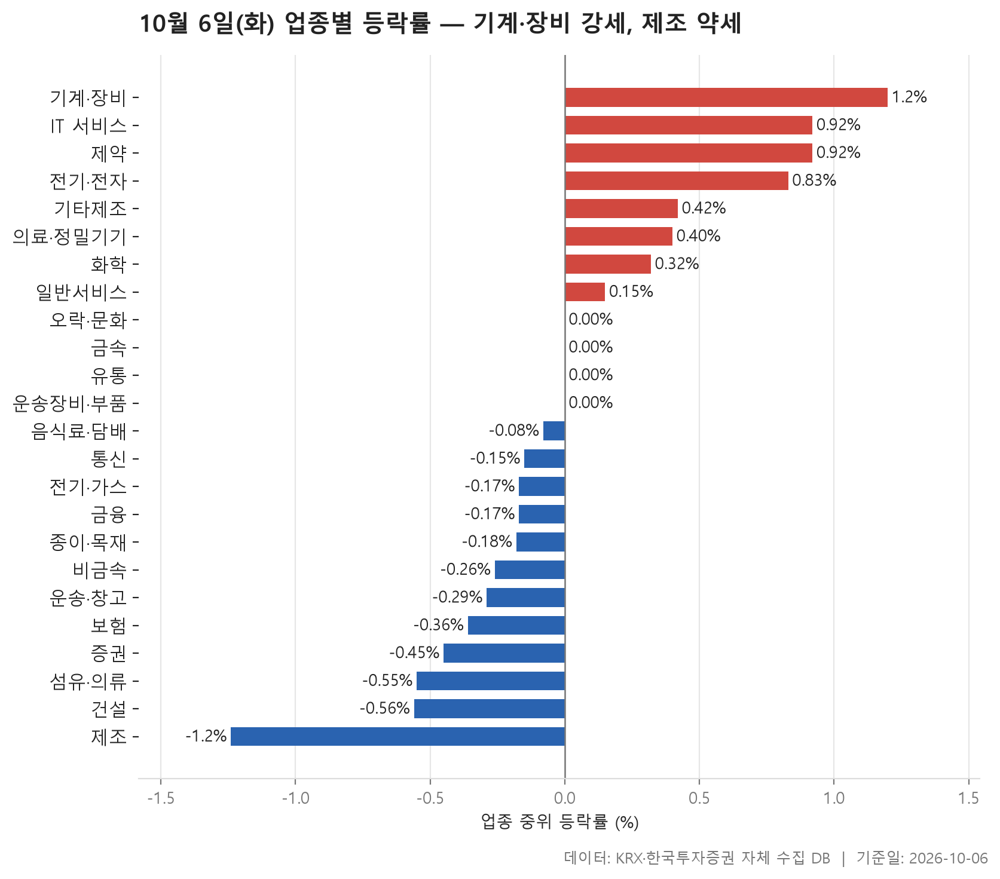
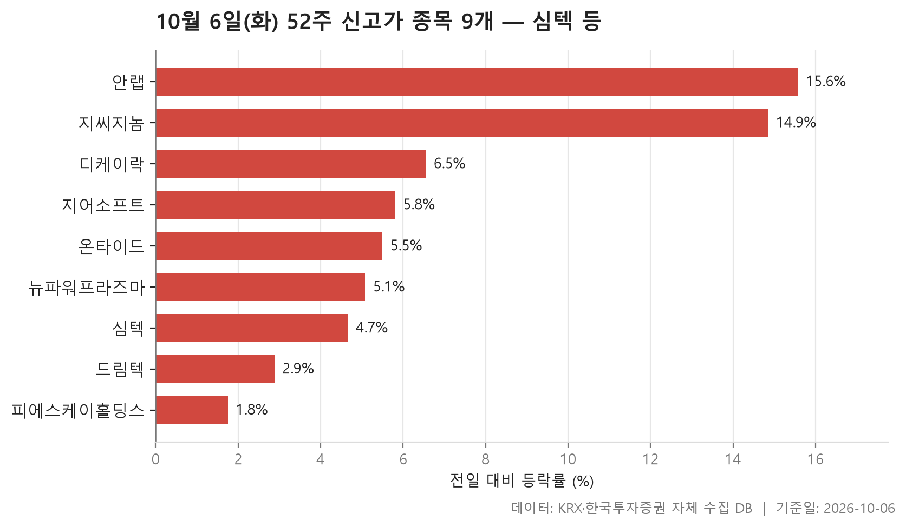
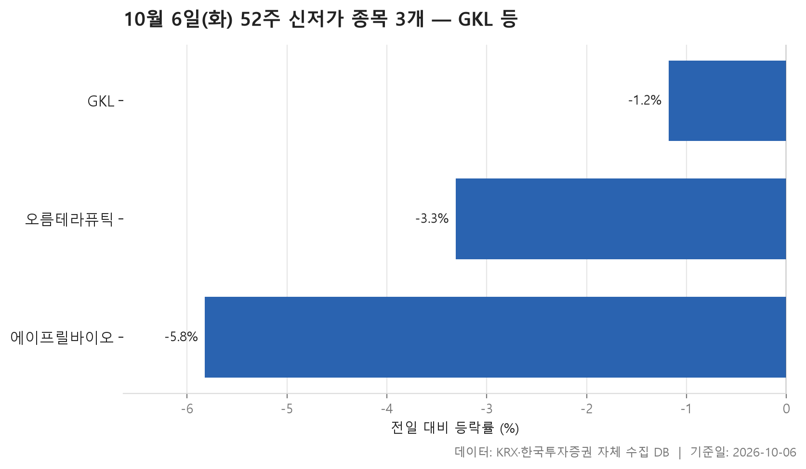
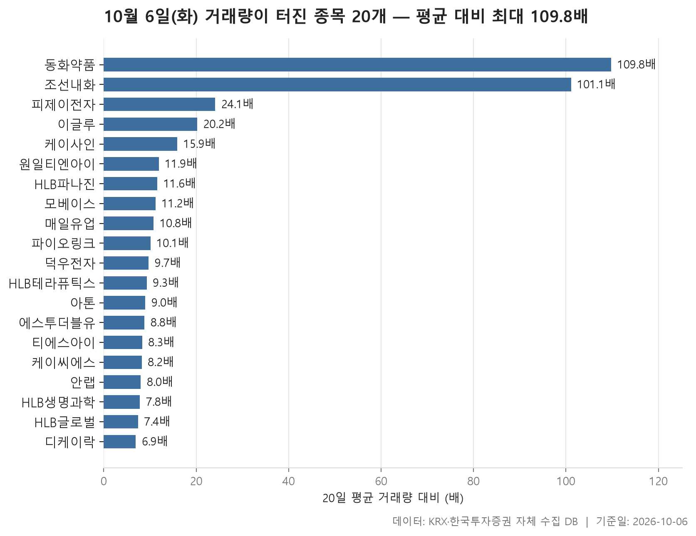

10월 6일 시장은 업종 단위로 보면 거의 제자리였습니다. 24개 업종의 중위 등락률을 줄 세웠을 때 한가운데 놓인 값이 -0.04%입니다. 오른 업종이 8개, 내린 업종이 12개로 내린 쪽이 조금 많았습니다. 그래도 어느 쪽으로든 크게 쏠린 날은 아니었습니다. 기준은 10월 2일 종가 대비 10월 6일 종가입니다.

다만 표 위쪽과 아래쪽은 성격이 꽤 다릅니다. 위에는 기계·장비, IT 서비스, 제약, 전기·전자처럼 종목 수가 많은 업종이 몰려 있고, 아래에는 건설, 섬유·의류, 증권처럼 상대적으로 작은 업종이 자리했습니다. 52주 신고가 종목은 9개로 신저가 3개보다 많았습니다. 거래량이 평소의 5배를 넘긴 20개 종목은 모두 오른 채 장을 마쳤습니다.

오늘은 업종 흐름부터 보고, 신고가와 신저가를 거쳐 거래량이 갑자기 몰린 종목까지 차례로 살펴봅니다. 숫자 자체보다 숫자들이 어긋나는 대목에 무게를 두었습니다.

> 기준일: 2026-10-06 · 집계: 자체 수집 데이터베이스

## 업종 등락률 — 24개 중 12개 하락

맨 위는 기계·장비입니다. 중위 등락률 +1.20%에 평균은 +1.59%였고, 207개 종목 가운데 70.00%가 올랐습니다. 이 업종에서 가장 크게 움직인 주성엔지니어링이 +17.51% 올랐지만, 이 종목 하나가 업종 평균을 끌어올린 폭은 0.08%p에 그칩니다. 평균이 중위값보다 높은 건 한 종목 덕이 아니라 여러 종목이 함께 올랐기 때문이라고 읽을 수 있습니다. 열 곳 중 일곱 곳이 오른 업종이니 '고르게 강했다'는 표현이 어울립니다.

**IT 서비스**는 조금 다른 모양입니다. 중위값은 +0.92%인데 평균은 +2.10%로 꽤 벌어져 있습니다. 상한가로 마감한 샌즈랩(+30.00%)이 평균을 움직인 폭은 0.12%p뿐이라, 두 값의 격차를 설명하려면 크게 오른 종목이 여럿 더 있어야 합니다. 실제로 아래 거래량 급증 표에 IT 서비스 종목이 6개 올라와 있습니다. 전기·전자는 중위값 +0.83%로 순위는 네 번째지만, 거래대금이 151,127.90억원으로 다른 업종과 비교가 되지 않을 만큼 많았습니다. 오늘 돈이 가장 많이 오간 곳은 이 업종이었습니다.

중간 지대에는 평균과 중위값이 따로 노는 업종이 있습니다. 오락·문화는 중위값이 0.00%인데 평균은 +0.84%입니다. 아티스트스튜디오(+30.00%) 하나가 평균을 0.46%p 올렸으니, 평균을 만든 건 사실상 이 종목입니다. 보험도 비슷합니다. 중위값은 -0.36%로 내렸는데 평균은 +0.07%로 플러스였습니다. 미래에셋생명(+4.62%)이 혼자 평균을 0.42%p 밀어 올린 결과입니다. 종목이 11개뿐인 업종이라 한 종목의 무게가 큽니다. 반대로 기타제조는 중위값 +0.42%보다 평균 +0.10%가 낮았는데, 제이에스티나(-3.82%)가 평균을 끌어내렸습니다.

맨 아래는 제조입니다. 중위값 -1.24%, 평균 -1.93%로, 여덟 종목 가운데 오른 건 한 종목뿐이었습니다. 코아스(-6.44%) 하나가 평균을 -0.80%p 끌어내렸습니다. 다만 종목 수가 8개, 거래대금이 9.80억원에 불과한 작은 업종이라 시장 전체의 약세로 넓혀 읽기는 어렵습니다. 그 위로 건설(-0.56%), 섬유·의류(-0.55%), 증권(-0.45%)이 이어지는데, 낙폭이 크다기보다 오른 종목이 셋 중 하나꼴에 그쳤다는 점이 더 눈에 띕니다.

| 업종 | 종목수(개) | 중위등락률(%) | 평균등락률(%) | 상승비율(%) | 주도종목 | 주도종목등락률(%) | 평균기여도(%p) | 거래대금합계(억원) |
|---|---|---|---|---|---|---|---|---|
| 기계·장비 | 207 | +1.20 | +1.59 | 70.00 | 주성엔지니어링 | +17.51 | 0.08 | 27,805.80 |
| IT 서비스 | 245 | +0.92 | +2.10 | 63.30 | 샌즈랩 | +30.00 | 0.12 | 15,859.20 |
| 제약 | 166 | +0.92 | +1.62 | 63.90 | HLB생명과학 | +25.03 | 0.15 | 8,916.70 |
| 전기·전자 | 366 | +0.83 | +1.83 | 65.60 | 하이젠알앤엠 | +18.99 | 0.05 | 151,127.90 |
| 기타제조 | 14 | +0.42 | +0.10 | 64.30 | 제이에스티나 | -3.82 | -0.27 | 19.40 |
| 의료·정밀기기 | 100 | +0.40 | +1.14 | 58.00 | 케이씨텍 | +16.74 | 0.17 | 3,132.10 |
| 화학 | 220 | +0.32 | +0.79 | 55.50 | 예선테크 | +29.87 | 0.14 | 12,233.10 |
| 일반서비스 | 167 | +0.15 | +1.24 | 52.10 | HLB제약 | +29.97 | 0.18 | 6,834.70 |
| 오락·문화 | 65 | 0.00 | +0.84 | 46.20 | 아티스트스튜디오 | +30.00 | 0.46 | 514.80 |
| 금속 | 130 | 0.00 | +0.70 | 49.20 | 국일신동 | +28.82 | 0.22 | 5,413.20 |
| 유통 | 158 | 0.00 | +0.21 | 43.70 | 한창 | -31.25 | -0.20 | 3,855.90 |
| 운송장비·부품 | 135 | 0.00 | +0.13 | 48.10 | 네오티스 | +16.55 | 0.12 | 8,985.90 |
| 음식료·담배 | 83 | -0.08 | -0.09 | 43.40 | 이지바이오 | -3.45 | -0.04 | 1,164.80 |
| 통신 | 13 | -0.15 | -0.24 | 38.50 | 나이스정보통신 | -1.78 | -0.14 | 642.50 |
| 전기·가스 | 10 | -0.17 | -0.10 | 30.00 | 경동도시가스 | -1.64 | -0.16 | 359.90 |
| 금융 | 111 | -0.17 | +0.08 | 41.40 | 대성창투 | +8.02 | 0.07 | 17,511.80 |
| 종이·목재 | 25 | -0.18 | 0.00 | 40.00 | 아세아제지 | -3.68 | -0.15 | 58.90 |
| 비금속 | 36 | -0.26 | -0.40 | 36.10 | 강동씨앤엘 | -6.02 | -0.17 | 446.70 |
| 운송·창고 | 28 | -0.29 | -0.54 | 32.10 | STX그린로지스 | -5.80 | -0.21 | 1,148.40 |
| 보험 | 11 | -0.36 | +0.07 | 45.50 | 미래에셋생명 | +4.62 | 0.42 | 1,638.50 |
| 증권 | 18 | -0.45 | -0.44 | 33.30 | 키움증권 | -2.50 | -0.14 | 1,095.00 |
| 섬유·의류 | 46 | -0.55 | -0.64 | 32.60 | 에스제이그룹 | -7.79 | -0.17 | 225.70 |
| 건설 | 51 | -0.56 | -0.62 | 33.30 | 베노티앤알 | -13.72 | -0.27 | 2,386.70 |
| 제조 | 8 | -1.24 | -1.93 | 12.50 | 코아스 | -6.44 | -0.80 | 9.80 |

## 52주 신고가 9개 — 최고 안랩 15.58%

52주 신고가를 새로 쓴 종목은 9개였고, 그중 7개가 KOSDAQ 종목입니다. 업종으로 보면 기계·장비가 3개(피에스케이홀딩스, 뉴파워프라즈마, 디케이락)로 가장 많고, 전기·전자와 IT 서비스가 2개씩입니다. 업종 표 상단에 있던 이름들이 신고가 목록에서도 그대로 보입니다.

시가총액이 가장 큰 심텍(67,348억원)은 +4.67% 오르며 직전 고점 171,000원을 넘어 175,000원에 마감했습니다. 등락 폭이 가장 컸던 건 안랩(+15.58%)입니다. 직전 고점이 78,800원이었는데 89,000원까지 올라서 고점을 한 번에 꽤 높이 넘었습니다. 안랩은 거래량 급증 표에도 이름을 올렸습니다.

반대로 간신히 선을 넘은 종목도 있습니다. 피에스케이홀딩스는 +1.76%로 표에서 가장 적게 올랐고, 직전 고점 195,500원을 197,000원으로 살짝 넘었습니다. 디케이락도 직전 고점 11,680원에 11,720원으로 마감해 차이가 아주 작습니다. 9개 종목의 등락률 중위값은 +5.50%입니다. 신고가 종목이라고 모두 급등한 건 아니었다는 뜻입니다. 온타이드는 거래대금이 6.20억원에 그쳐, 거래가 얇은 상태에서 나온 신고가라는 점을 함께 봐 둘 만합니다.

| 종목명 | 종목코드 | 시장 | 업종 | 종가(원) | 등락률(%) | 이전52주최고(원) | 거래대금(억원) | 시가총액(억원) |
|---|---|---|---|---|---|---|---|---|
| 심텍 | 222800 | KOSDAQ | 전기·전자 | 175,000 | +4.67 | 171,000 | 1,647.70 | 67,348 |
| 피에스케이홀딩스 | 031980 | KOSDAQ | 기계·장비 | 197,000 | +1.76 | 195,500 | 408.20 | 42,478 |
| 안랩 | 053800 | KOSDAQ | IT 서비스 | 89,000 | +15.58 | 78,800 | 576.50 | 9,903 |
| 드림텍 | 192650 | KOSPI | 전기·전자 | 9,650 | +2.88 | 9,470 | 99.00 | 6,358 |
| 뉴파워프라즈마 | 144960 | KOSDAQ | 기계·장비 | 13,870 | +5.08 | 13,400 | 206.50 | 6,060 |
| 지씨지놈 | 340450 | KOSDAQ | 일반서비스 | 10,200 | +14.86 | 9,520 | 206.30 | 2,412 |
| 지어소프트 | 051160 | KOSDAQ | IT 서비스 | 13,660 | +5.81 | 13,400 | 23.80 | 1,842 |
| 디케이락 | 105740 | KOSDAQ | 기계·장비 | 11,720 | +6.55 | 11,680 | 213.80 | 1,192 |
| 온타이드 | 005320 | KOSPI | 유통 | 1,495 | +5.50 | 1,441 | 6.20 | 511 |

## 52주 신저가 3개 — 최저 에이프릴바이오 -5.82%

52주 신저가는 3개 종목뿐이었습니다. 신고가 9개와 나란히 놓고 보면 오늘은 고점을 뚫은 쪽이 더 많은 날이었습니다.

시가총액이 가장 큰 GKL은 -1.18%로 낙폭은 셋 중 가장 작았습니다. 직전 저점 8,480원을 8,400원으로 조금 밑돈 정도이고, 거래대금도 8.60억원으로 많지 않았습니다. 오름테라퓨틱(-3.31%)과 에이프릴바이오(-5.82%)는 각각 제약과 일반서비스 업종입니다.

여기서 하나 어긋나는 대목이 있습니다. 제약은 업종 표에서 중위 등락률 +0.92%로 상위권에 있던 업종입니다. 업종 전체가 강해도 그 안에서 저점을 새로 쓰는 종목은 나올 수 있다는 걸 보여 주는 사례입니다. 왜 이 종목들만 내렸는지는 자료로 알 수 없습니다.

| 종목명 | 종목코드 | 시장 | 업종 | 종가(원) | 등락률(%) | 이전52주최저(원) | 거래대금(억원) | 시가총액(억원) |
|---|---|---|---|---|---|---|---|---|
| GKL | 114090 | KOSPI | 오락·문화 | 8,400 | -1.18 | 8,480 | 8.60 | 5,196 |
| 오름테라퓨틱 | 475830 | KOSDAQ | 제약 | 20,450 | -3.31 | 20,850 | 77.30 | 4,448 |
| 에이프릴바이오 | 397030 | KOSDAQ | 일반서비스 | 16,030 | -5.82 | 16,450 | 88.70 | 4,418 |

## 거래량 급증 20개 — 최고 동화약품 109.80배

거래량이 직전 20거래일 평균의 5배를 넘긴 종목은 20개입니다. 이 가운데 17개가 KOSDAQ 종목이고, 20개 모두 올랐습니다. 배수의 중위값은 9.90배입니다.

배수만 보면 동화약품(109.80배)과 조선내화(101.10배)가 압도적입니다. 그런데 두 종목은 평소 거래량 자체가 아주 적었습니다. 동화약품의 20일 평균 거래량은 52,540주, 조선내화는 6,267주였습니다. 바닥이 낮으니 배수가 크게 튀어 보인 면이 있습니다. 조선내화의 거래대금은 90.40억원이고, 등락률도 +2.11%로 이 표에서는 낮은 편입니다. 매일유업 역시 10.80배지만 거래대금은 10.00억원에 그쳤습니다.

실제로 돈이 몰린 곳은 배수 순위 중간쯤에 있습니다. 아톤은 9.00배로 배수만 보면 평범하지만 거래대금이 1,228.00억원, 등락률이 +26.91%였습니다. 에스투더블유도 1,092.50억원이 오가며 +16.21% 올랐습니다. 두 종목 모두 IT 서비스 업종입니다. 이글루, 케이사인, 케이씨에스, 안랩까지 합쳐 IT 서비스가 6개로 가장 많아, 업종 표에서 평균이 중위값보다 훨씬 높았던 이유를 여기서 짐작할 수 있습니다.

이름에 HLB가 붙은 종목이 여럿이라는 점도 눈에 띕니다. HLB파나진, HLB테라퓨틱스, HLB생명과학, HLB글로벌이 모두 이 표에 있고, 업종 표에서도 HLB생명과학(+25.03%)과 HLB제약(+29.97%)이 각 업종에서 가장 크게 움직인 종목으로 나옵니다. 함께 움직인 이유는 자료에 없으니 같은 날 동시에 거래가 몰렸다는 사실까지만 적어 둡니다.

| 종목명 | 종목코드 | 시장 | 업종 | 종가(원) | 등락률(%) | 거래량(주) | 평균거래량(주) | 배수(배) | 거래대금(억원) | 시가총액(억원) |
|---|---|---|---|---|---|---|---|---|---|---|
| 동화약품 | 000020 | KOSPI | 제약 | 5,450 | +6.45 | 5,771,275 | 52,540 | 109.80 | 328.10 | 1,522 |
| 조선내화 | 462520 | KOSPI | 비금속 | 13,090 | +2.11 | 633,893 | 6,267 | 101.10 | 90.40 | 1,552 |
| 피제이전자 | 006140 | KOSDAQ | 의료·정밀기기 | 5,870 | +3.16 | 2,607,705 | 108,017 | 24.10 | 153.00 | 873 |
| 이글루 | 067920 | KOSDAQ | IT 서비스 | 6,580 | +12.29 | 1,635,283 | 80,886 | 20.20 | 109.00 | 724 |
| 케이사인 | 192250 | KOSDAQ | IT 서비스 | 9,570 | +15.44 | 1,412,105 | 88,659 | 15.90 | 136.20 | 676 |
| 원일티엔아이 | 136150 | KOSDAQ | 기계·장비 | 14,100 | +13.34 | 1,657,109 | 138,801 | 11.90 | 231.40 | 1,182 |
| HLB파나진 | 046210 | KOSDAQ | 제약 | 1,393 | +13.25 | 3,211,563 | 277,150 | 11.60 | 46.70 | 634 |
| 모베이스 | 101330 | KOSDAQ | 전기·전자 | 4,080 | +8.95 | 576,616 | 51,267 | 11.20 | 23.50 | 944 |
| 매일유업 | 267980 | KOSDAQ | 음식료·담배 | 35,100 | +2.18 | 28,160 | 2,610 | 10.80 | 10.00 | 2,690 |
| 파이오링크 | 170790 | KOSDAQ | 전기·전자 | 8,820 | +5.63 | 157,270 | 15,508 | 10.10 | 14.10 | 564 |
| 덕우전자 | 263600 | KOSDAQ | 전기·전자 | 5,410 | +2.27 | 3,557,307 | 366,517 | 9.70 | 199.10 | 862 |
| HLB테라퓨틱스 | 115450 | KOSDAQ | 유통 | 2,890 | +17.00 | 4,034,017 | 432,143 | 9.30 | 118.70 | 2,736 |
| 아톤 | 158430 | KOSDAQ | IT 서비스 | 6,980 | +26.91 | 18,328,341 | 2,034,930 | 9.00 | 1,228.00 | 1,709 |
| 에스투더블유 | 488280 | KOSDAQ | IT 서비스 | 17,850 | +16.21 | 6,137,138 | 697,650 | 8.80 | 1,092.50 | 1,932 |
| 티에스아이 | 277880 | KOSDAQ | 기계·장비 | 4,080 | +9.97 | 289,406 | 34,926 | 8.30 | 11.50 | 810 |
| 케이씨에스 | 115500 | KOSDAQ | IT 서비스 | 12,750 | +19.05 | 3,826,025 | 464,539 | 8.20 | 476.10 | 1,530 |
| 안랩 | 053800 | KOSDAQ | IT 서비스 | 89,000 | +15.58 | 652,509 | 81,428 | 8.00 | 576.50 | 9,903 |
| HLB생명과학 | 067630 | KOSDAQ | 제약 | 4,470 | +25.03 | 6,214,323 | 796,254 | 7.80 | 276.20 | 5,450 |
| HLB글로벌 | 003580 | KOSPI | 유통 | 2,080 | +17.45 | 3,556,100 | 477,562 | 7.40 | 76.70 | 1,054 |
| 디케이락 | 105740 | KOSDAQ | 기계·장비 | 11,720 | +6.55 | 1,789,441 | 261,203 | 6.90 | 213.80 | 1,192 |

## 정리

한 문장으로 줄이면, 10월 6일은 업종 전체로는 제자리였지만 기계·장비와 IT 서비스 같은 일부 업종에 상승이 넓게 퍼지고 KOSDAQ 종목 중심으로 거래가 몰린 날이었습니다. 신고가가 신저가보다 많았고, 거래량이 터진 종목은 모두 오른 채 마감했습니다.

한계도 분명합니다. 이 글은 10월 2일 종가와 10월 6일 종가만 비교했으므로 그사이 장중 흐름은 담지 못합니다. 보험이나 제조처럼 종목 수가 적은 업종은 한두 종목에 따라 숫자가 크게 흔들립니다. 무엇보다 왜 올랐고 왜 내렸는지는 이 데이터에 없습니다. 표는 무엇이 움직였는지까지만 보여 줍니다.

## 집계 기준

**업종 등락률**

- **기준**: 2026-10-02 종가 → 2026-10-06 종가
- **순위**: 업종 내 종목 등락률의 중위값 (평균은 참고용으로 함께 표시)
- **주도종목**: 그 업종에서 등락률 절대값이 가장 큰 종목 (동점이면 거래대금이 큰 쪽)
- **평균기여도**: 그 종목 하나가 업종 평균을 움직인 폭 (등락률 ÷ 종목수). 중위값과 평균의 격차가 이 값에 가까우면 평균을 만든 것이 그 종목이고, 훨씬 크면 다른 종목들도 함께 움직인 것입니다
- **필터**: 업종 내 보통주 5종목 이상
- **전체업종중위등락률(%)**: -0.04

**52주 신고가**

- **기준**: 종가 > 직전 52주 최고가
- **관측구간**: 2025-09-18 ~ 2026-10-02 (252거래일)
- **필터**: 시가총액 500억 이상, 거래대금 3억 이상, 보통주

**52주 신저가**

- **기준**: 종가 < 직전 52주 최저가
- **관측구간**: 2025-09-18 ~ 2026-10-02 (252거래일)
- **필터**: 시가총액 500억 이상, 거래대금 3억 이상, 보통주

**거래량 급증**

- **기준**: 당일 거래량 ≥ 직전 20거래일 평균 × 5
- **관측구간**: 2026-09-03 ~ 2026-10-02 (20거래일)
- **필터**: 시가총액 500억 이상, 거래대금 3억 이상, 보통주

## 데이터 출처 및 유의사항

- **데이터출처**: 한국거래소(KRX) 공시 데이터와 한국투자증권 OpenAPI 를 직접 수집해 구축한 자체 데이터베이스
- **집계방식**: 수집·집계·차트 생성을 직접 구현한 파이프라인에서 자동 산출
- **작성고지**: 본문의 표·통계·차트는 자체 데이터베이스에서 계산된 값이며, 문장 작성 과정에 AI 도구를 활용했습니다.
- **면책**: 본 글은 정보 제공을 목적으로 하며 특정 종목의 매수·매도를 추천하지 않습니다. 제시된 수치는 과거 데이터이고 미래 수익을 보장하지 않습니다. 투자 판단과 그 결과에 대한 책임은 투자자 본인에게 있습니다.

