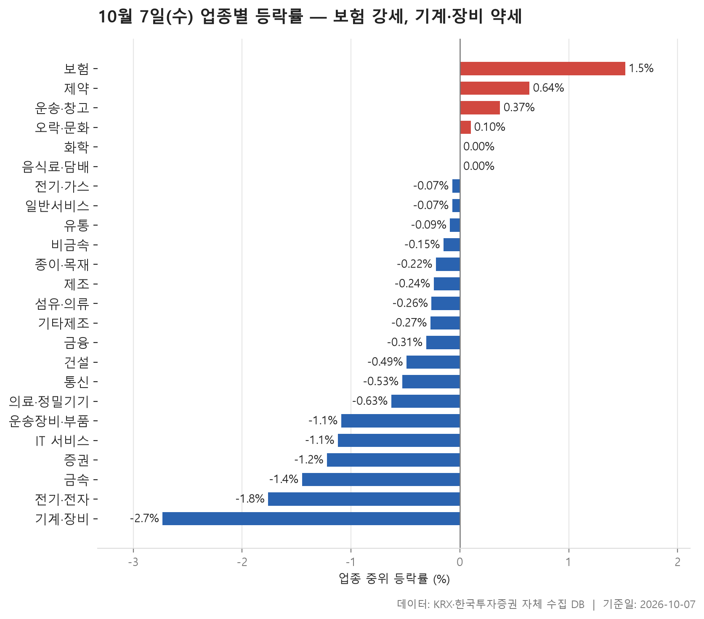
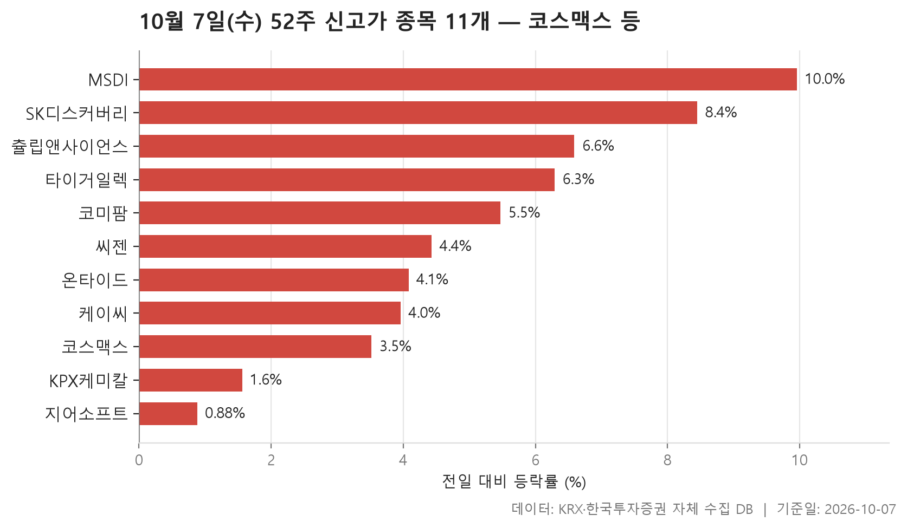
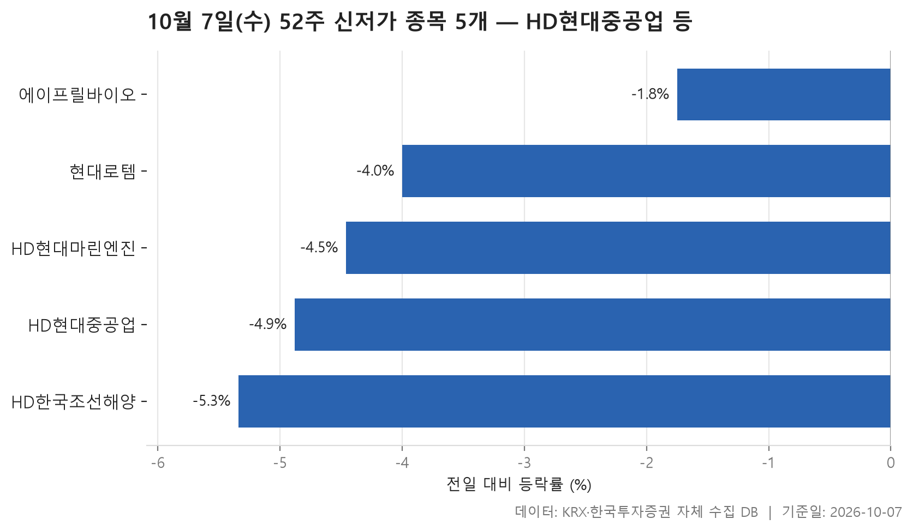
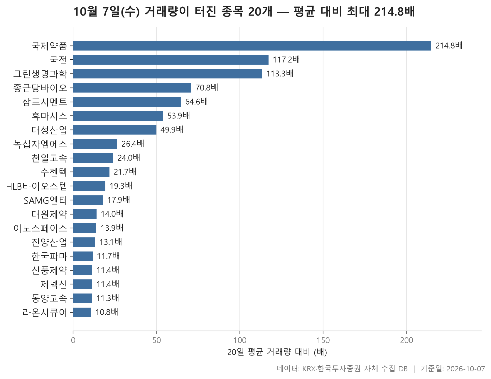

10월 7일 시장은 한쪽으로 크게 쏠리지 않았지만 약한 쪽이 더 넓었습니다. 24개 업종을 업종 안 종목들의 중위 등락률로 줄 세웠을 때 한가운데 놓인 값이 -0.25%입니다. 그중 4개 업종만 플러스로 마감했고 18개는 마이너스였습니다. 맨 위는 보험(+1.52%), 맨 아래는 기계·장비(-2.73%)입니다.

오늘 글은 네 장의 표로 나눴습니다. 업종별 등락으로 전체 모양을 먼저 보고, 52주 신고가와 신저가를 차례로 본 뒤, 거래량이 평소보다 크게 늘어난 종목으로 마무리합니다. 표마다 따로 읽어도 되지만 함께 놓으면 겹치는 대목이 보입니다. 약했던 업종이 신저가 명단과 이어지고, 거래량이 늘어난 종목 상당수가 제약 업종이라는 점이 그렇습니다.

> 기준일: 2026-10-07 · 집계: 자체 수집 데이터베이스

## 업종 등락률 — 24개 중 18개 하락

위쪽부터 보면 보험이 중위값 +1.52%로 1위입니다. 11개 종목 가운데 오른 종목이 열에 여섯 남짓이었으니 몇몇 종목만 튄 것은 아니었습니다. 미래에셋생명이 +11.03% 올라 업종 평균을 1.00%p 밀어 올렸지만, 중위값 자체가 높다는 것은 업종 전반이 함께 올랐다는 뜻입니다. 제약도 중위값 +0.64%로 2위입니다. 166개 종목으로 덩치가 큰데도 오른 종목이 59.00%로 절반을 넘었습니다.

**평균과 중위값이 따로 움직인 업종**도 있습니다. 운송·창고는 중위값이 +0.37%인데 평균은 +2.51%까지 올라갑니다. 동양고속(+30.00%) 한 종목이 평균을 1.07%p 끌어올린 셈인데, 두 값의 간격은 그보다 넓습니다. 이 업종에서는 다른 종목도 크게 움직였다는 뜻이고, 실제로 거래량 표에 같은 업종의 천일고속이 +29.99%로 올라 있습니다. 제조는 반대 경우입니다. 8개 종목뿐이라 에넥스(+17.12%) 하나가 평균을 2.14%p 움직였습니다. 중위값은 -0.24%인데 평균은 +1.63%로 나온 것도 대부분 이 종목 몫입니다. 숫자만 보고 제조 업종이 강했다고 읽으면 안 되는 이유입니다.

아래쪽에서는 덩치 큰 업종들이 함께 밀렸습니다. 전기·전자는 366개 종목에 거래대금이 151,268.80억원으로 다른 업종을 크게 앞서는데, 중위값이 -1.76%였고 오른 종목은 23.00%에 그쳤습니다. 기계·장비(-2.73%)와 운송장비·부품(-1.09%)도 오른 종목이 다섯 중 하나꼴입니다. 통신과 증권은 이 비중이 더 낮아 열 곳 중 두 곳도 오르지 못했습니다. 화학과 음식료·담배는 중위값이 0.00%로 보합이었습니다.

| 업종 | 종목수(개) | 중위등락률(%) | 평균등락률(%) | 상승비율(%) | 주도종목 | 주도종목등락률(%) | 평균기여도(%p) | 거래대금합계(억원) |
|---|---|---|---|---|---|---|---|---|
| 보험 | 11 | +1.52 | +1.95 | 63.60 | 미래에셋생명 | +11.03 | 1.00 | 1,584.20 |
| 제약 | 166 | +0.64 | +1.25 | 59.00 | 국제약품 | +29.91 | 0.18 | 9,855.40 |
| 운송·창고 | 28 | +0.37 | +2.51 | 53.60 | 동양고속 | +30.00 | 1.07 | 1,358.80 |
| 오락·문화 | 65 | +0.10 | +0.88 | 52.30 | SAMG엔터 | +27.16 | 0.42 | 1,307.20 |
| 화학 | 220 | 0.00 | +0.52 | 47.30 | 예선테크 | +29.99 | 0.14 | 11,982.10 |
| 음식료·담배 | 83 | 0.00 | +0.35 | 47.00 | 한탑 | +12.30 | 0.15 | 1,079.80 |
| 전기·가스 | 10 | -0.07 | -0.09 | 40.00 | SGC에너지 | -1.76 | -0.18 | 339.50 |
| 일반서비스 | 166 | -0.07 | +0.32 | 45.80 | HLB바이오스텝 | +29.99 | 0.18 | 6,438.00 |
| 유통 | 158 | -0.09 | 0.00 | 42.40 | 한창 | -24.68 | -0.16 | 4,007.20 |
| 비금속 | 36 | -0.15 | -0.36 | 38.90 | 삼표시멘트 | +15.85 | 0.44 | 1,816.40 |
| 종이·목재 | 25 | -0.22 | -0.55 | 28.00 | 블루산업개발 | -6.41 | -0.26 | 32.60 |
| 제조 | 8 | -0.24 | +1.63 | 50.00 | 에넥스 | +17.12 | 2.14 | 10.50 |
| 섬유·의류 | 46 | -0.26 | -0.04 | 41.30 | 웰크론 | +8.93 | 0.19 | 171.30 |
| 기타제조 | 14 | -0.27 | -0.73 | 35.70 | 리튬포어스 | -8.81 | -0.63 | 13.40 |
| 금융 | 111 | -0.31 | -0.56 | 35.10 | 아주IB투자 | -10.04 | -0.09 | 15,697.10 |
| 건설 | 51 | -0.49 | -0.62 | 31.40 | CNT85 | +10.29 | 0.20 | 1,997.90 |
| 통신 | 13 | -0.53 | -0.86 | 15.40 | 더즌 | -4.41 | -0.34 | 418.50 |
| 의료·정밀기기 | 100 | -0.63 | -0.54 | 38.00 | 케이씨텍 | +14.53 | 0.15 | 3,700.40 |
| 운송장비·부품 | 134 | -1.09 | -1.69 | 20.90 | 덕산넵코어스 | -14.24 | -0.11 | 10,417.20 |
| IT 서비스 | 246 | -1.12 | -1.09 | 31.30 | E8 | +23.33 | 0.09 | 12,300.60 |
| 증권 | 18 | -1.22 | -1.47 | 16.70 | 미래에셋증권 | -4.54 | -0.25 | 950.30 |
| 금속 | 130 | -1.45 | -1.41 | 18.50 | 대양금속 | +14.85 | 0.11 | 6,634.60 |
| 전기·전자 | 366 | -1.76 | -1.73 | 23.00 | 알파칩스 | +29.97 | 0.08 | 151,268.80 |
| 기계·장비 | 206 | -2.73 | -2.28 | 20.40 | 브릴스 | -15.63 | -0.08 | 23,184.40 |

## 52주 신고가 11개 — 최고 MSDI 9.96%

52주 최고가를 새로 쓴 보통주는 11개로, KOSPI 5개, KOSDAQ 6개입니다. 이날 등락률의 중위값은 +4.43%입니다. 가장 많이 오른 MSDI가 +9.96%, 가장 적게 오른 지어소프트가 +0.88%입니다. 지어소프트는 종가가 13,780원으로 이전 최고가 13,770원을 아주 조금 넘었습니다. 신고가라는 이름은 같아도 크게 뛰어 넘은 종목과 간신히 넘은 종목이 섞여 있습니다.

시가총액으로는 코스맥스가 35,013억원으로 가장 크고, 명단 아래쪽에는 온타이드(532억원)처럼 규모가 작은 종목도 있습니다. 업종은 8개로 흩어져 있고 가장 많은 화학도 2개에 그칩니다. 눈여겨볼 점은 **업종이 약했는데 신고가가 나온 경우**입니다. 전기·전자는 중위값 -1.76%로 하위권이었지만 타이거일렉(+6.29%)과 MSDI가 이 명단에 들었습니다. 업종 전체 흐름과 개별 종목의 흐름이 늘 같지는 않다는 것을 보여 줍니다. 강했던 제약에서는 씨젠과 코미팜이 신고가를 냈습니다.

| 종목명 | 종목코드 | 시장 | 업종 | 종가(원) | 등락률(%) | 이전52주최고(원) | 거래대금(억원) | 시가총액(억원) |
|---|---|---|---|---|---|---|---|---|
| 코스맥스 | 192820 | KOSPI | 화학 | 308,500 | +3.52 | 306,500 | 615.70 | 35,013 |
| 씨젠 | 096530 | KOSDAQ | 제약 | 38,900 | +4.43 | 37,650 | 329.30 | 18,180 |
| SK디스커버리 | 006120 | KOSPI | 금융 | 71,900 | +8.45 | 68,900 | 84.70 | 12,520 |
| 코미팜 | 041960 | KOSDAQ | 제약 | 11,000 | +5.47 | 10,790 | 79.10 | 8,208 |
| 타이거일렉 | 219130 | KOSDAQ | 전기·전자 | 98,000 | +6.29 | 96,600 | 121.50 | 6,188 |
| 케이씨 | 029460 | KOSPI | 의료·정밀기기 | 47,250 | +3.96 | 46,800 | 29.10 | 5,207 |
| KPX케미칼 | 025000 | KOSPI | 화학 | 58,600 | +1.56 | 57,800 | 5.30 | 2,430 |
| 지어소프트 | 051160 | KOSDAQ | IT 서비스 | 13,780 | +0.88 | 13,770 | 29.60 | 1,858 |
| MSDI | 123010 | KOSDAQ | 전기·전자 | 4,635 | +9.96 | 4,570 | 21.80 | 937 |
| 츌립앤사이언스 | 291650 | KOSDAQ | 일반서비스 | 2,750 | +6.59 | 2,660 | 3.90 | 839 |
| 온타이드 | 005320 | KOSPI | 유통 | 1,556 | +4.08 | 1,520 | 5.40 | 532 |

## 52주 신저가 5개 — 최저 HD한국조선해양 -5.34%

52주 최저가 아래로 내려간 보통주는 5개로 신고가보다 적습니다. 대신 덩치가 훨씬 큽니다. HD현대중공업이 시가총액 419,845억원으로 가장 크고, HD한국조선해양(213,381억원)과 현대로템(117,765억원)이 뒤를 잇습니다. 신고가 명단에서 가장 큰 코스맥스보다 몇 배 큰 종목들이 신저가 쪽에 있습니다.

등락률 중위값은 -4.46%입니다. 가장 많이 내린 종목은 HD한국조선해양(-5.34%)이고, 가장 덜 내린 에이프릴바이오도 -1.75%였습니다. 업종을 보면 운송장비·부품이 2개, 기계·장비가 1개입니다. 업종 표 하위권과 그대로 겹치는 구성이라, 이 두 업종의 약세에 대형주가 함께 있었던 것으로 보입니다. HD한국조선해양은 업종 분류상 금융으로 잡혀 있다는 점도 알아 두면 좋습니다. 이 종목들이 왜 함께 내렸는지는 이 자료로 알 수 없습니다. 표가 보여 주는 것은 같은 날 같은 방향으로 1년 저점을 깼다는 사실까지입니다.

| 종목명 | 종목코드 | 시장 | 업종 | 종가(원) | 등락률(%) | 이전52주최저(원) | 거래대금(억원) | 시가총액(억원) |
|---|---|---|---|---|---|---|---|---|
| HD현대중공업 | 329180 | KOSPI | 운송장비·부품 | 400,000 | -4.88 | 411,500 | 1,309.10 | 419,845 |
| HD한국조선해양 | 009540 | KOSPI | 금융 | 301,500 | -5.34 | 314,000 | 851.40 | 213,381 |
| 현대로템 | 064350 | KOSPI | 운송장비·부품 | 107,900 | -4.00 | 110,100 | 363.20 | 117,765 |
| HD현대마린엔진 | 071970 | KOSPI | 기계·장비 | 45,000 | -4.46 | 46,500 | 100.00 | 15,265 |
| 에이프릴바이오 | 397030 | KOSDAQ | 일반서비스 | 15,750 | -1.75 | 15,860 | 31.20 | 4,341 |

## 거래량 급증 20개 — 최고 국제약품 214.80배

거래량이 직전 20거래일 평균의 5배를 넘은 보통주는 20개입니다. 배수의 중위값은 20.50배이고, 맨 위의 국제약품은 214.80배였습니다. 평소 하루 평균 28,439주가 거래되던 종목에 6,108,604주가 몰리면서 +29.91% 올랐습니다. 20개 가운데 10개가 제약이어서 명단의 절반을 차지합니다. 업종 표에서 제약이 강했던 것과 같은 흐름으로 읽힙니다. 20개 모두 이날 플러스로 마감했다는 점도 눈에 띕니다.

배수와 거래 규모를 구분해서 볼 필요가 있습니다. 천일고속은 배수가 24.00배지만 거래량은 25,159주, 거래대금은 43.70억원입니다. 평소 거래가 워낙 적어 배수가 커 보이는 경우입니다. 반대로 배수가 가장 낮은 라온시큐어(10.80배)는 거래대금이 2,957.30억원으로 명단에서 가장 많았습니다. 시가총액이 가장 큰 삼표시멘트(8,439억원)도 +15.85% 오르며 거래대금 1,439.10억원을 기록했는데, 이 종목은 비금속 업종 평균을 0.44%p 끌어올린 종목이기도 합니다.

| 종목명 | 종목코드 | 시장 | 업종 | 종가(원) | 등락률(%) | 거래량(주) | 평균거래량(주) | 배수(배) | 거래대금(억원) | 시가총액(억원) |
|---|---|---|---|---|---|---|---|---|---|---|
| 국제약품 | 002720 | KOSPI | 제약 | 4,430 | +29.91 | 6,108,604 | 28,439 | 214.80 | 264.80 | 937 |
| 국전 | 307750 | KOSDAQ | 제약 | 2,770 | +15.66 | 14,686,183 | 125,317 | 117.20 | 416.50 | 1,495 |
| 그린생명과학 | 114450 | KOSDAQ | 제약 | 2,560 | +11.55 | 5,669,610 | 50,048 | 113.30 | 149.00 | 512 |
| 종근당바이오 | 063160 | KOSPI | 제약 | 15,070 | +11.46 | 504,594 | 7,127 | 70.80 | 76.80 | 827 |
| 삼표시멘트 | 038500 | KOSDAQ | 비금속 | 7,820 | +15.85 | 18,064,786 | 279,684 | 64.60 | 1,439.10 | 8,439 |
| 휴마시스 | 205470 | KOSDAQ | 제약 | 3,120 | +19.77 | 2,499,497 | 46,361 | 53.90 | 80.90 | 770 |
| 대성산업 | 128820 | KOSPI | 유통 | 5,000 | +18.48 | 6,497,254 | 130,130 | 49.90 | 323.70 | 2,262 |
| 녹십자엠에스 | 142280 | KOSDAQ | 제약 | 4,200 | +26.89 | 20,161,301 | 762,757 | 26.40 | 812.30 | 1,006 |
| 천일고속 | 000650 | KOSPI | 운송·창고 | 180,300 | +29.99 | 25,159 | 1,046 | 24.00 | 43.70 | 2,577 |
| 수젠텍 | 253840 | KOSDAQ | 제약 | 4,890 | +6.89 | 3,772,456 | 173,983 | 21.70 | 190.40 | 819 |
| HLB바이오스텝 | 278650 | KOSDAQ | 일반서비스 | 4,855 | +29.99 | 6,716,072 | 348,181 | 19.30 | 300.50 | 846 |
| SAMG엔터 | 419530 | KOSDAQ | 오락·문화 | 22,800 | +27.16 | 791,193 | 44,208 | 17.90 | 171.30 | 2,327 |
| 대원제약 | 003220 | KOSPI | 제약 | 8,250 | +4.70 | 323,856 | 23,107 | 14.00 | 27.30 | 1,850 |
| 이노스페이스 | 462350 | KOSDAQ | 운송장비·부품 | 6,710 | +5.67 | 3,126,806 | 225,353 | 13.90 | 212.90 | 2,273 |
| 진양산업 | 003780 | KOSPI | 화학 | 4,185 | +5.68 | 1,500,297 | 114,678 | 13.10 | 64.00 | 544 |
| 한국파마 | 032300 | KOSDAQ | 제약 | 9,030 | +5.00 | 1,362,684 | 116,327 | 11.70 | 128.80 | 985 |
| 신풍제약 | 019170 | KOSPI | 제약 | 11,010 | +13.86 | 3,056,413 | 267,069 | 11.40 | 330.30 | 5,771 |
| 제넥신 | 095700 | KOSDAQ | 일반서비스 | 3,015 | +6.35 | 2,063,406 | 180,460 | 11.40 | 68.30 | 1,373 |
| 동양고속 | 084670 | KOSPI | 운송·창고 | 29,250 | +30.00 | 99,300 | 8,784 | 11.30 | 27.90 | 847 |
| 라온시큐어 | 042510 | KOSDAQ | IT 서비스 | 16,710 | +12.37 | 17,934,336 | 1,664,257 | 10.80 | 2,957.30 | 1,856 |

## 정리

정리하면 10월 7일은 보험과 제약이 위에서 버티는 동안 전기·전자, 기계·장비, 운송장비·부품 같은 큰 업종이 아래로 밀린 하루였습니다. 그 약세는 대형 조선·기계 종목의 신저가로 이어졌고, 거래량이 몰린 쪽은 제약 중소형주였습니다.

이 글은 하루치 종가만 비교했고, 오르거나 내린 이유는 자료에 없어 다루지 않았습니다. 업종 순위는 중위값 기준이라 평균이 크게 다른 업종은 따로 살펴야 합니다. 거래량 배수는 평소 거래가 적은 종목일수록 커지기 쉽다는 점도 함께 고려해 주십시오.

## 집계 기준

**업종 등락률**

- **기준**: 2026-10-06 종가 → 2026-10-07 종가
- **순위**: 업종 내 종목 등락률의 중위값 (평균은 참고용으로 함께 표시)
- **주도종목**: 그 업종에서 등락률 절대값이 가장 큰 종목 (동점이면 거래대금이 큰 쪽)
- **평균기여도**: 그 종목 하나가 업종 평균을 움직인 폭 (등락률 ÷ 종목수). 중위값과 평균의 격차가 이 값에 가까우면 평균을 만든 것이 그 종목이고, 훨씬 크면 다른 종목들도 함께 움직인 것입니다
- **필터**: 업종 내 보통주 5종목 이상
- **전체업종중위등락률(%)**: -0.25

**52주 신고가**

- **기준**: 종가 > 직전 52주 최고가
- **관측구간**: 2025-09-19 ~ 2026-10-06 (252거래일)
- **필터**: 시가총액 500억 이상, 거래대금 3억 이상, 보통주

**52주 신저가**

- **기준**: 종가 < 직전 52주 최저가
- **관측구간**: 2025-09-19 ~ 2026-10-06 (252거래일)
- **필터**: 시가총액 500억 이상, 거래대금 3억 이상, 보통주

**거래량 급증**

- **기준**: 당일 거래량 ≥ 직전 20거래일 평균 × 5
- **관측구간**: 2026-09-04 ~ 2026-10-06 (20거래일)
- **필터**: 시가총액 500억 이상, 거래대금 3억 이상, 보통주

## 데이터 출처 및 유의사항

- **데이터출처**: 한국거래소(KRX) 공시 데이터와 한국투자증권 OpenAPI 를 직접 수집해 구축한 자체 데이터베이스
- **집계방식**: 수집·집계·차트 생성을 직접 구현한 파이프라인에서 자동 산출
- **작성고지**: 본문의 표·통계·차트는 자체 데이터베이스에서 계산된 값이며, 문장 작성 과정에 AI 도구를 활용했습니다.
- **면책**: 본 글은 정보 제공을 목적으로 하며 특정 종목의 매수·매도를 추천하지 않습니다. 제시된 수치는 과거 데이터이고 미래 수익을 보장하지 않습니다. 투자 판단과 그 결과에 대한 책임은 투자자 본인에게 있습니다.

